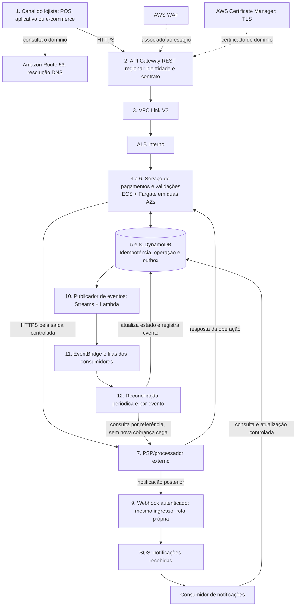
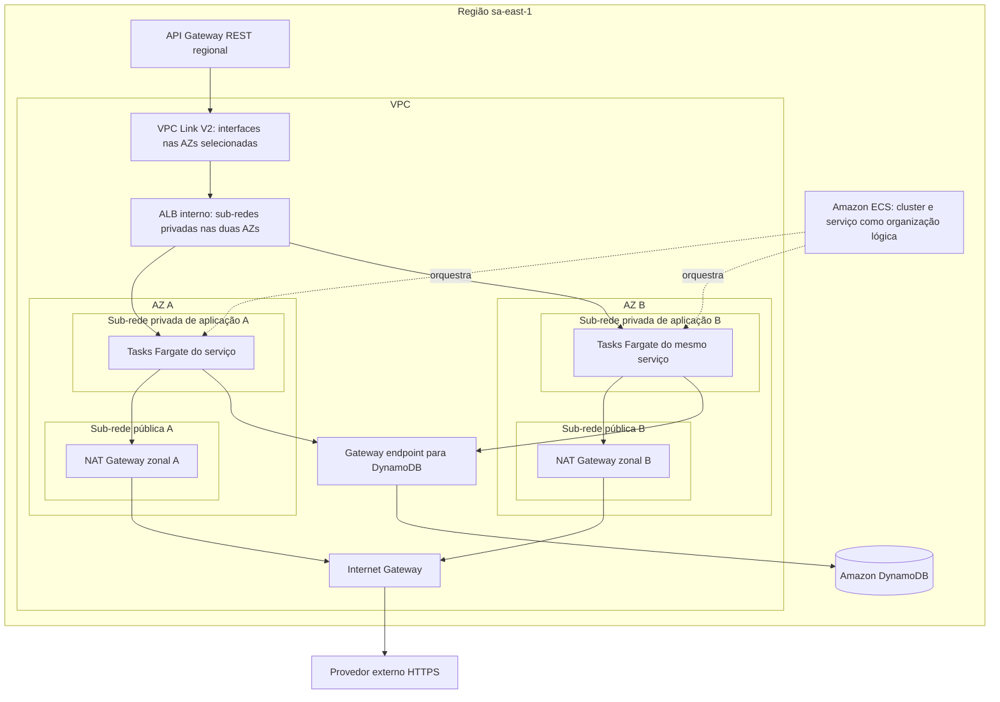
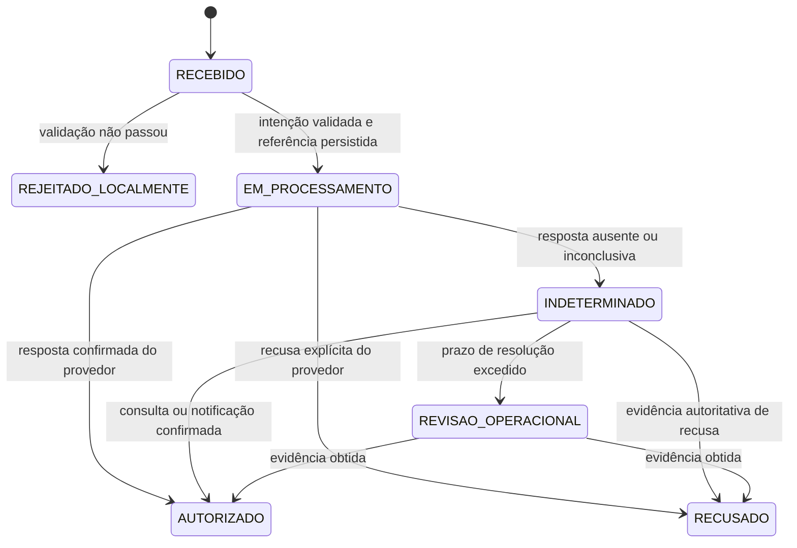
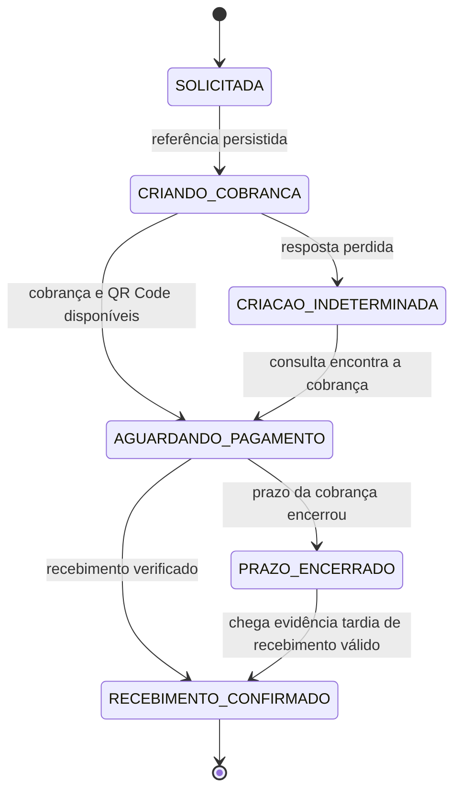
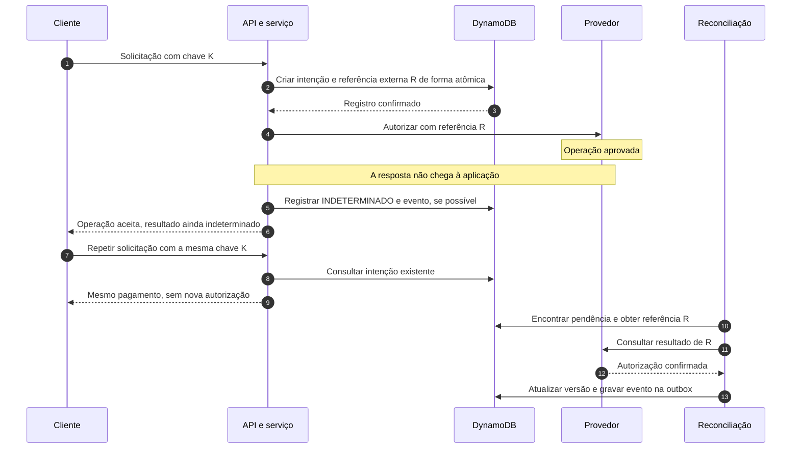
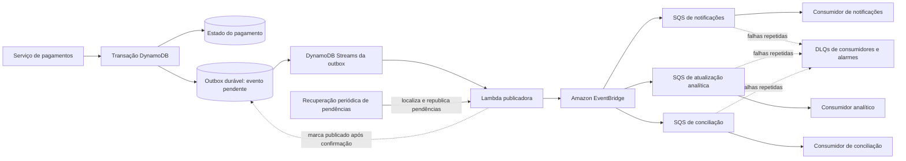

# Case 01 — Processamento de pagamentos e Pix na AWS

> **Foco:** idempotência, consistência, transações, alta disponibilidade e integração com provedores de pagamento.  
> **Idioma:** português do Brasil. Os nomes dos serviços AWS foram preservados.  
> **Formato:** guia de estudo e simulação de entrevista de arquitetura.  
> **Referências consultadas em:** 27/09/2026.  
> **Caminho sugerido no repositório:** `cases/01-payment-processing-pix.md`.

## Como usar este material

Este case tem um **núcleo de arquitetura comum** e duas jornadas de negócio: **autorização de cartão tokenizado** e **cobrança/recebimento Pix**. A infraestrutura pode ser compartilhada; os estados e as regras financeiras não são intercambiáveis.

Na primeira leitura, estude o problema, o fluxo e as decisões principais. Na segunda, aprofunde idempotência, falhas e eventos. Depois, responda às perguntas sem abrir as respostas e apresente a solução em voz alta.

**O objetivo não é decorar uma sequência de serviços. É explicar qual problema cada componente resolve, qual risco permanece e em que situação a escolha mudaria.**

O cenário, as metas numéricas, os exemplos de API e as decisões propostas são didáticos. Este documento não é uma arquitetura oficial da AWS, um sistema pronto para movimentar dinheiro ou uma rubrica oficial de entrevista. O nível L5 é o alvo de preparação informado; a descrição pública da vaga não declara esse nível.

### Relação com a vaga

A vaga de Solutions Architect — FSI, Job ID 10457255, enfatiza aconselhamento técnico ao cliente, conexão entre tecnologia e negócio, criação de arquiteturas, transferência de conhecimento e melhoria de soluções. Por isso, o estudo inclui descoberta de requisitos, explicação de alternativas e comunicação de riscos — além dos serviços. [Fonte: vaga][r01]

---

## Sumário

1. [Problema de negócio e escopo](#s01)
2. [Vocabulário essencial](#s02)
3. [Perguntas antes de desenhar](#s03)
4. [Requisitos e premissas da simulação](#s04)
5. [Decisões da arquitetura-base](#s05)
6. [Visão geral em Mermaid](#s06)
7. [Fluxo explicado em 12 etapas](#s07)
8. [Dados, idempotência e concorrência](#s08)
9. [Estados, timeout e recuperação](#s09)
10. [Eventos confiáveis: outbox, filas e consumidores](#s10)
11. [Papel e posicionamento dos serviços](#s11)
12. [Trade-offs que precisam ser defendidos](#s12)
13. [Rede, sub-redes e conectividade](#s13)
14. [Segurança e responsabilidade](#s14)
15. [Alta disponibilidade e recuperação regional](#s15)
16. [Desempenho, capacidade e custos](#s16)
17. [Observabilidade, operação e implantação](#s17)
18. [Aplicação dos seis pilares Well-Architected](#s18)
19. [Roteiro de laboratório e testes](#s19)
20. [Perguntas de entrevista com respostas comentadas](#s20)
21. [Apresentação da solução e simulação de 45 minutos](#s21)
22. [Checklist de domínio](#s22)
23. [Referências e leitura orientada](#s23)

---

<a id="s01"></a>
## 1. Problema de negócio e escopo

### Enunciado inicial

> Uma instituição financeira brasileira quer oferecer uma plataforma de pagamentos para lojistas. As transações podem começar em um e-commerce, aplicativo ou terminal de pagamento. A solução precisa operar continuamente, absorver picos, impedir efeitos financeiros duplicados e integrar-se a provedores de pagamento existentes. Como você a desenharia na AWS?

Antes de escolher serviços, descubra **qual parte da cadeia estamos construindo**. Um gateway para lojistas, um banco emissor de cartões, um participante direto do Pix e um sistema contábil central têm responsabilidades diferentes.

### Escopo adotado neste estudo

Construiremos a **camada de orquestração e acompanhamento**. Ela recebe uma intenção, valida quem a solicitou, registra a operação, chama o provedor, acompanha o resultado e publica eventos para outros sistemas.

Na jornada de cartão, o provedor recebe um **token de pagamento**, não dados brutos do cartão enviados à nossa aplicação. A captura e a liquidação serão discutidas como extensões, sem confundi-las com autorização.

Na jornada Pix, construiremos **criação e acompanhamento de cobranças para recebimento via PSP**. Criar uma cobrança não transfere dinheiro. A confirmação do recebimento chega posteriormente e precisa ser correlacionada com a cobrança. A API Pix do Banco Central trata serviços do PSP recebedor, incluindo cobranças, acompanhamento, devoluções e consultas. [Fonte: especificação API Pix][r42]

### O que fica fora do núcleo

Não construiremos um arranjo de cartões, uma integração direta com o SPI, um core bancário completo nem a custódia de chaves criptográficas de pagamento. AWS Payment Cryptography e CloudHSM não entram na arquitetura estudada. Isso é uma **delimitação de responsabilidade com o provedor**, não uma afirmação de que requisitos criptográficos deixaram de existir.

Também não implementaremos inicialmente Pix Automático, pagamentos parciais, múltiplas capturas ou mecanismos especiais de disputa. São extensões com regras próprias.

**Pergunta que muda o case:** “Precisamos enviar Pix debitando o saldo de uma conta do banco?” Nesse caso, além deste núcleo, será necessário modelar autorização da conta, saldo disponível, reservas, lançamentos e integração com o sistema financeiro responsável. Uma chave de idempotência, sozinha, não impede gasto acima do saldo.

---

<a id="s02"></a>
## 2. Vocabulário essencial

| Termo | Significado neste case |
|---|---|
| POS | *Point of Sale*: terminal ou sistema de ponto de venda. Aqui, o canal físico que inicia a operação. |
| Lojista | Empresa que usa nossa plataforma para receber pagamentos. Também chamado de *merchant*. |
| PSP | Prestador de serviços de pagamento. Na jornada Pix, usamos os serviços do PSP recebedor. |
| Intenção de pagamento | Registro interno que representa o que o cliente está tentando fazer. Existe mesmo antes de conhecermos o resultado externo. |
| Idempotência | Repetir a mesma operação identificada não deve repetir seu efeito de negócio. |
| Autorização | No cartão, aprovação da operação, que pode reservar o valor para uma captura posterior. |
| Captura | Etapa de efetivação da cobrança de cartão previamente autorizada, conforme o contrato do processador. Não é um comando do fluxo Pix apresentado. |
| Liquidação | Movimentação financeira final entre os participantes aplicáveis. Não deve ser inferida apenas porque uma API respondeu com sucesso. |
| Conciliação/reconciliação | Comparação de registros internos com evidências do provedor para identificar e resolver diferenças. |
| Webhook | Requisição HTTP enviada pelo provedor para notificar uma mudança. Deve ser autenticada e pode precisar ser deduplicada. |
| Outbox | Registro durável do evento a publicar, gravado junto com a mudança de estado. |
| DLQ | Fila que recebe mensagens que não puderam ser processadas ou entregues após a política configurada. |
| SLI / SLO | Indicador medido / objetivo desse indicador. Exemplo: proporção de requisições válidas respondidas dentro de determinado tempo. |
| RTO / RPO | Tempo-alvo para recuperar o serviço / quantidade de dados que se admite perder, expressa como intervalo de tempo. |

A separação entre autorização e captura é documentada por processadores, mas os detalhes dependem do meio e do contrato. Não transforme um comportamento de um fornecedor em regra universal. [Fonte: autorização e captura][r43]

---

<a id="s03"></a>
## 3. Perguntas antes de desenhar

Uma boa abertura seria:

> “Antes de propor os serviços, quero entender qual operação financeira executamos, quem é responsável por movimentar o dinheiro, como o cliente espera receber o resultado e quais garantias precisamos manter durante falhas.”

| Pergunta ao cliente | Como a resposta muda a arquitetura |
|---|---|
| Somos gateway, PSP, adquirente ou banco emissor? | Define as responsabilidades financeiras, regulatórias e de integração. |
| Estamos autorizando cartão, recebendo Pix ou enviando Pix? | Muda a máquina de estados, o contrato e o caminho crítico. |
| Qual é o volume médio, o pico e a duração do pico? | Orienta capacidade, quotas, quantidade mínima de tasks e proteção do provedor. |
| O TPS informado inclui consultas, notificações e novas tentativas? | Evita dimensionar a API apenas pelo número de pagamentos. |
| O cliente precisa esperar a resposta final? | Determina o que fica síncrono e quando usar `202 Accepted`. |
| Qual latência é exigida e em qual percentil? | Obriga a distribuir um orçamento de tempo entre componentes. |
| O provedor suporta idempotência e consulta por referência? | Determina como recuperar uma operação cujo resultado se perdeu. |
| Um pedido pode ter mais de um pagamento? | Define a regra de unicidade além da chave técnica de idempotência. |
| Qual é a duração máxima de um retry legítimo? | Orienta retenção de chaves e tratamento de tentativas tardias. |
| O provedor envia webhooks? Pode duplicá-los? | Exige validação, persistência de entrada e deduplicação. |
| Precisamos suportar falha de AZ ou também de Região? | Separa alta disponibilidade local de recuperação regional. |
| Quais RTO e RPO são aceitos por tipo de dado? | Evita aplicar o mesmo compromisso a configuração, pagamento e analytics. |
| Há dados sensíveis de cartão ou pessoais em nosso fluxo? | Define minimização, controles, escopo de avaliação e responsabilidades. |
| Qual sistema é a fonte oficial do saldo e dos lançamentos? | Impede transformar uma tabela de status em ledger por acidente. |
| Há rede privada com o provedor ou integração HTTPS pública? | Muda saída de rede, conectividade e procedimentos de recuperação. |
| Quem opera incidentes e qual é o orçamento? | Define complexidade sustentável, observabilidade e modelo de suporte. |

Não é necessário fazer todas as perguntas em sequência. Comece pelas que podem alterar radicalmente a proposta.

---

<a id="s04"></a>
## 4. Requisitos e premissas da simulação

As metas abaixo são **hipóteses para exercitar decisões**, não limites dos serviços nem promessas de capacidade.

| Categoria | Premissa de trabalho |
|---|---|
| Jornada inicial | Autorização de cartão tokenizado; adaptar o mesmo núcleo para cobrança/recebimento Pix. |
| Região primária | `sa-east-1`, sujeita à decisão do cliente sobre localização de dados, custo e dependências. |
| Rede | Uma VPC, com recursos da aplicação distribuídos entre duas AZs. |
| Volume inicial | Até 1.000 novas operações por segundo no pico. Consultas e webhooks devem ser dimensionados separadamente. |
| Evolução | Exercício adicional de crescimento para 20.000 operações por segundo; exige nova validação de capacidade. |
| Latência interna | Meta inicial de p95 de até 300 ms de tempo atribuído à nossa camada, sem incluir a espera pelo provedor. |
| Tempo total | Definir prazo de resposta com o cliente e com o PSP; não manter uma chamada aberta indefinidamente. |
| Disponibilidade | Meta didática de 99,95% para a API, com definição explícita de quais respostas contam como sucesso. |
| Integridade | Uma repetição da mesma intenção não pode criar novo efeito financeiro. |
| Estado incerto | Permitido temporariamente, desde que visível, rastreável e sujeito a recuperação. |
| Provedor | Suporta uma referência estável, repetição segura conforme seu contrato e consulta do resultado. |
| Dados | Sem PAN, CVV ou PIN brutos na aplicação. O provedor mantém as responsabilidades de pagamento contratadas. |
| Regional | A versão inicial cobre Multi-AZ. RTO/RPO regionais devem ser definidos antes de aprovar uma solução Multi-Region. |

**Aceitar uma solicitação e concluir um pagamento são indicadores diferentes.** Uma resposta `202` pode cumprir o contrato de aceitação da API, mas não demonstra que o pagamento terminou. Por isso, acompanhe também a idade das operações pendentes e o prazo de conclusão.

### Invariantes de negócio

1. Mesma intenção, mesmo solicitante e mesmos dados: reaproveitar a operação existente.
2. Mesma chave com dados incompatíveis: rejeitar o conflito, nunca alterar silenciosamente a operação original.
3. Timeout não é prova de recusa.
4. Uma mudança relevante de estado precisa deixar evidência durável e gerar seus eventos sem uma janela de perda silenciosa.
5. Uma mensagem duplicada não pode duplicar um lançamento, captura, devolução ou liberação de pedido.
6. Falha de cache, analytics ou notificação não pode apagar o histórico do pagamento.

---

<a id="s05"></a>
## 5. Decisões da arquitetura-base

A proposta usa **Amazon API Gateway REST API regional → VPC Link V2 → ALB interno → Amazon ECS com AWS Fargate**. O estado operacional e a idempotência ficam no DynamoDB. Os efeitos posteriores usam outbox, DynamoDB Streams, Lambda, EventBridge e uma fila SQS por consumidor independente.

Escolhemos REST API para ter, entre outros recursos, associação direta do AWS WAF ao estágio. A documentação atual permite integração privada de REST APIs com ALB ou NLB usando VPC Link V2, inclusive com suporte em São Paulo. Não é correto afirmar que toda REST API exige NLB: isso depende do modelo de integração, e os VPC Links V1 são o caminho legado. [Fontes: WAF][r07], [integração privada][r08], [VPC Link V2][r09]

### O que é central e o que é opcional

| Componente | Decisão neste case |
|---|---|
| API Gateway, ALB interno e ECS/Fargate | Caminho principal da aplicação containerizada. |
| DynamoDB | Fonte autoritativa do estado operacional interno; guarda também estruturas de idempotência e outbox. |
| PSP/processador | Fonte externa de evidência sobre o que ocorreu no meio de pagamento. |
| SQS de entrada de webhooks | Amortece notificações e permite resposta após recebimento durável. |
| Streams + Lambda + EventBridge + SQS | Publicação e consumo dos eventos de negócio, com recuperação explícita. |
| IAM, TLS, Secrets Manager, criptografia, logs e alarmes | Controles transversais, não opcionais do ponto de vista do requisito. |
| Aurora | Alternativa para o núcleo relacional, ou banco de uma capacidade separada. Não será uma segunda fonte concorrente do mesmo estado. |
| ElastiCache | Otimização posterior, caso medições justifiquem. Não é requisito para a primeira versão. |
| CloudFront + S3 | Opcionais para a interface web e conteúdo estático; não entram só para enfeitar a API de pagamento. |
| MSK, EKS, Step Functions | Alternativas ou evoluções justificadas por necessidades específicas. |

**Por que não começar com todos os bancos?** Porque cada novo armazenamento aumenta custo, operação e questões de consistência. Saber explicar quando não usar um serviço também faz parte da solução.

---

<a id="s06"></a>
## 6. Visão geral em Mermaid

### 6.1 Caminho principal e comunicação com o provedor

Este é um fluxo lógico. DNS, certificados e controles não são todos “saltos” pelos quais o corpo da requisição passa.



**Observações de leitura:** as validações da etapa 6 pertencem à aplicação; o PSP da etapa 7 é externo. A entrada de webhook passa pela API e pela aplicação antes da fila. O gatilho periódico de reconciliação também existe, mesmo quando nenhum evento chega.

### 6.2 Distribuição de rede

O ALB é **interno**, pois o ponto público é o API Gateway. O desenho mostra um único ALB lógico habilitado nas duas AZs, não um ALB diferente por zona. A caixa do cluster ECS foi omitida para não confundi-la com a fronteira de rede.



Os endpoints, regras de segurança e rotas precisam existir na implementação. A seta não os cria. O número de tasks será dimensionado; os dois blocos não significam que duas tasks sempre suportam o pico.

---

<a id="s07"></a>
## 7. Fluxo explicado em 12 etapas

### Etapa 1 — Receber uma intenção, não apenas um clique

O canal inicia uma operação com uma chave estável para aquela intenção. Exemplo didático da **nossa API**, não do Banco Central:

```http
POST /pagamentos
Authorization: Bearer <token-do-solicitante>
Idempotency-Key: 23916fae-52a7-4280-9450-8816e38f8760
Content-Type: application/json

{
  "pedidoId": "pedido-8421",
  "meio": "CARTAO",
  "operacao": "AUTORIZAR",
  "valorCentavos": 50000,
  "moeda": "BRL",
  "tokenPagamento": "token-opaco-do-provedor"
}
```

`50000` centavos representa R$ 500,00. A aplicação deve definir limites e regras de arredondamento, evitando usar ponto flutuante binário para cálculos monetários.

O identificador do lojista vem do contexto autenticado. Mesmo que apareça no corpo, não pode ser aceito sem conferir se corresponde ao solicitante autorizado.

### Etapa 2 — Resolver o domínio, proteger e autorizar

Route 53 resolve o nome. O cliente abre uma conexão HTTPS com a API. ACM administra o certificado aplicável ao domínio. WAF inspeciona o tráfego associado ao recurso protegido. API Gateway aplica o contrato de entrada e a autenticação configurada.

A aplicação ainda precisa autorizar o acesso a cada pagamento: **um token válido não autoriza consultar ou alterar qualquer `pagamentoId`**.

Para a REST API, podemos usar um autorizador Lambda integrado ao provedor de identidade existente, Cognito quando fizer sentido ou IAM em integrações apropriadas. Uma API key de plano de uso não substitui autenticação/autorização. [Fontes: APIs REST/HTTP][r10], [planos de uso][r45]

### Etapa 3 — Acessar a aplicação sem publicá-la na internet

O VPC Link V2 conecta a API ao ALB interno. O ALB encaminha para os endereços privados das tasks. O grupo de destino usa tipo `ip`, apropriado às tasks em modo `awsvpc`. [Fontes: integração privada][r08], [ALB com ECS][r13]

Não é necessário colocar um ALB público atrás do API Gateway. Isso criaria outro ingresso a proteger e potencialmente permitiria contornar controles da API.

### Etapa 4 — Executar o serviço em ECS/Fargate

ECS mantém o serviço e a quantidade desejada de tasks. Fargate fornece a capacidade de execução sem que a equipe administre instâncias EC2 desse workload. As tasks executam nas sub-redes escolhidas e recebem interfaces de rede e IPs privados. [Fontes: cluster ECS][r11], [rede Fargate][r12]

A task não guarda a única cópia do pagamento em memória ou disco local. Uma substituição durante implantação ou falha deve preservar a capacidade de consultar e continuar a operação.

### Etapa 5 — Reservar a intenção de forma atômica

Antes de chamar o provedor, registre a chave de idempotência e a intenção. Uma operação condicional evita que duas tasks aceitem simultaneamente a mesma chave como inédita. Quando são itens separados, grave-os em uma transação DynamoDB. [Fontes: escrita condicional][r16], [transações][r17]

Se já existir uma operação com os mesmos dados, devolva sua referência. Se a chave foi reutilizada com outro valor, moeda ou intenção, rejeite o conflito. Não execute outra cobrança.

### Etapa 6 — Validar o que precisa estar no caminho crítico

Confira o estado do lojista, a operação permitida, limites, consistência dos dados e a validade do token ou da solicitação Pix. Caso o negócio exija decisão antifraude antes da autorização, integre o mecanismo existente dentro de um orçamento de tempo.

Cache pode acelerar configurações. Não pode ser a única fonte de uma decisão financeira que precisa sobreviver à sua perda. Também é necessário definir por quanto tempo uma configuração de risco desatualizada é aceitável.

### Etapa 7 — Executar a operação correta no provedor

**Cartão tokenizado:** enviar uma autorização com referência estável. O provedor cuida da integração financeira contratada. Neste exercício, nenhuma task implementa PIN, CVV, comunicação direta com bandeira ou HSM.

**Pix cobrança:** criar ou recuperar a cobrança no PSP recebedor usando o identificador previsto no contrato. A API Pix padronizada possui operações de cobrança identificadas por `txid`; nosso adaptador converte a representação interna para a do PSP. [Fonte: API Pix][r42]

A comunicação HTTPS externa usa a saída controlada da VPC. Não abra uma nova referência no provedor a cada retry. Grave a referência pretendida **antes** da chamada para conseguir recuperar uma resposta perdida.

### Etapa 8 — Persistir o resultado sem exagerar seu significado

Na autorização de cartão, um resultado positivo pode produzir `AUTORIZADO`. Não significa automaticamente `CAPTURADO` ou `LIQUIDADO`. [Fonte: autorização e captura][r43]

Na criação de cobrança Pix, a resposta com QR Code leva a `AGUARDANDO_PAGAMENTO`, não a `RECEBIDO`. O QR Code é um meio de iniciar a jornada do pagador, não prova de recebimento.

Atualize o estado e grave o evento de negócio na outbox na mesma transação local. O resultado não depende de e-mail ou analytics estarem disponíveis. Em caso de timeout externo, preserve o vínculo e marque a operação como indeterminada quando ainda for possível gravar. Se a gravação também falhar, o estado anterior em processamento deve ser detectado pela rotina de recuperação.

### Etapa 9 — Receber notificações com segurança e durabilidade

O PSP pode notificar mudanças por webhook. A rota de entrada autentica o remetente conforme o contrato, valida formato e limites, registra a notificação em SQS e só então confirma o recebimento.

O consumidor correlaciona a notificação com a operação e verifica os dados relevantes. Quando houver dúvida, consulta o provedor. A aplicação não confia em um aviso do navegador dizendo “paguei”. Uma notificação fora de ordem não deve sobrescrever um estado mais recente. [Referência de tratamento de notificações em processador][r44]

Se a notificação for durável, mas o consumidor falhar, a fila permite nova tentativa. Se nem a persistência for possível, não envie confirmação de recebimento como se tudo estivesse seguro. Não assuma que o provedor tentará para sempre; mantenha também conciliação periódica.

### Etapa 10 — Publicar eventos sem a armadilha da dupla escrita

A outbox mantém o evento pendente. DynamoDB Streams aciona o publicador Lambda, que envia o evento ao EventBridge. Um mecanismo periódico recupera itens ainda pendentes, inclusive se o consumo do stream tiver ficado indisponível por muito tempo.

Sem essa estratégia, a aplicação poderia gravar “autorizado”, morrer antes de publicar e deixar os demais sistemas sem saber o que aconteceu. [Fonte: transactional outbox][r20]

### Etapa 11 — Desacoplar consumidores independentes

EventBridge encaminha os eventos às filas correspondentes. Notificação, conciliação e atualização analítica têm **filas separadas**. Múltiplos consumidores da mesma fila dividem o trabalho; isso não significa que cada um receberá uma cópia de todos os eventos.

Cada consumidor implementa idempotência e sua política de erro. Mensagens podem ser entregues mais de uma vez; o desenho não depende de entrega única de ponta a ponta. [Fontes: SQS Standard][r25], [Lambda com SQS][r28]

### Etapa 12 — Conciliar e fechar pendências

Um processo periódico procura operações paradas em processamento, indeterminadas ou aguardando confirmação além do esperado. Consulta o PSP por referência, compara evidências e atualiza o estado com controle de concorrência.

A conciliação também cruza recebimentos e relatórios do provedor com registros internos. Isso encontra diferenças que não aparecem apenas olhando a lista local de pendências.

**Não resolver a tempo não autoriza transformar incerteza em recusa.** Encaminhe a exceção à operação, preserve a evidência e mantenha uma comunicação clara ao cliente.

---

<a id="s08"></a>
## 8. Dados, idempotência e concorrência

### 8.1 Três estruturas, com responsabilidades distintas

Para tornar o raciocínio visível, adotaremos três tabelas conceituais. Isso não obriga o uso de três tabelas físicas, mas evita confundir responsabilidades antes de discutir otimização.

| Estrutura | Chave e conteúdo principal | Pergunta respondida |
|---|---|---|
| `Idempotencia` | Lojista + tipo de operação + chave; hash da intenção; `pagamentoId`. | Já aceitamos esta mesma solicitação? |
| `Pagamentos` | `pagamentoId`; lojista; valor; meio; estado; versão; referência externa; datas. | Qual é o estado conhecido da operação? |
| `Outbox` | `eventoId`; pagamento; versão; tipo; dados mínimos; situação da publicação. | Que mudança ainda precisa ser comunicada? |

A tabela de pagamentos é a fonte de verdade do **estado operacional interno**. Não substitui a evidência do PSP nem é, automaticamente, um ledger contábil.

Exemplo simplificado, sem credenciais:

```json
{
  "chave": "LOJISTA#42#AUTORIZAR#23916fae-52a7-4280-9450-8816e38f8760",
  "pagamentoId": "pag-7e04d",
  "hashDaIntencao": "sha256-dos-campos-canonicos",
  "criadoEm": "2026-09-27T18:00:00Z"
}
```

```json
{
  "pagamentoId": "pag-7e04d",
  "lojistaId": "42",
  "pedidoId": "pedido-8421",
  "meio": "CARTAO",
  "operacao": "AUTORIZAR",
  "valorCentavos": 50000,
  "moeda": "BRL",
  "estado": "EM_PROCESSAMENTO",
  "versao": 2,
  "referenciaProvedor": "ref-estavel-pag-7e04d",
  "atualizadoEm": "2026-09-27T18:00:01Z"
}
```

O hash precisa usar campos normalizados e uma definição estável de intenção: valor, moeda, meio, pedido e referência do instrumento, quando aplicável. Não inclua campos voláteis como o horário de cada tentativa. Não registre tokens sensíveis no log só para comparar requisições.

### 8.2 O erro de “consultar e depois inserir”

Duas tasks podem consultar simultaneamente, ambas concluir que a chave não existe e ambas chamar o provedor. Mesmo uma leitura fortemente consistente não transforma duas operações separadas em uma operação atômica.

A proteção está na **condição da escrita**. Exemplo conceitual, não um comando pronto:

```text
TransactWriteItems:
  1. Criar Idempotencia, somente se a chave ainda não existir.
  2. Criar Pagamentos em RECEBIDO, somente se o pagamentoId não existir.

Se a transação confirmar:
  continuar com o pagamento criado.

Se a condição da idempotência falhar:
  ler a intenção já registrada;
  comparar solicitante, operação e hash;
  devolver a operação existente ou rejeitar conflito.

Se ocorrer timeout ou erro transitório na própria gravação:
  não presumir que nada foi gravado;
  resolver o resultado com a mesma identidade antes de chamar o PSP.
```

Não trate toda falha de transação como “duplicata”: falta de capacidade, falta de permissão e conflito de condição exigem tratamentos diferentes. Escritas condicionais e transações são os mecanismos disponíveis; a política de negócio é nossa. [Fontes: condições][r16], [transações][r17]

### 8.3 Atualizações também precisam de proteção

Ao mudar o estado, exija a versão esperada **e** uma transição permitida. Exemplo:

```text
Atualizar pagamento:
  condição: versao = 2 E estado = EM_PROCESSAMENTO
  mudança: estado = AUTORIZADO, versao = 3

Na mesma transação:
  inserir Outbox(eventoId="pag-7e04d:v3:autorizado")
```

Uma resposta tardia não pode desfazer um recebimento já confirmado. Quando a condição falhar, releia e reavalie: não sobrescreva o vencedor automaticamente.

Caso outro worker precise recuperar uma operação, um mecanismo de posse temporária e versão pode evitar processamento concorrente. Porém, **um bloqueio local não cancela uma chamada que já saiu para o PSP**. A referência externa idempotente continua necessária.

### 8.4 O que responder em cada situação

Estes códigos são escolhas didáticas da nossa API, não regras da API Pix:

| Situação | Comportamento proposto |
|---|---|
| Intenção nova aceita | Devolver o identificador e o estado; `201` pode representar a criação do recurso. |
| Mesma chave e mesmos dados | Reaproveitar a operação; não executar nova autorização. Documentar se a API retorna o resultado atual ou uma resposta original preservada. |
| Mesma chave com valor ou intenção diferente | `409 Conflict`, com mensagem clara. |
| Operação ainda em andamento ou indeterminada | `202 Accepted`, estado explícito e `Location` para consulta. |
| Consulta de operação permitida | `200` com o estado, inclusive se o negócio recusou a transação. |
| Solicitante sem permissão | Rejeitar sem revelar dados de outro lojista. |
| Não foi possível garantir registro seguro | Erro transitório controlado; cliente deve repetir com a mesma chave. |

**Uma nova chave não prova uma nova intenção.** Se o contrato permitir apenas um pagamento por pedido, também é necessária uma restrição de negócio por lojista/pedido/operação. Caso o pedido aceite tentativas alternativas ou pagamentos divididos, modele essas regras explicitamente.

### 8.5 Onde usar leitura forte

Na decisão imediata após um conflito de idempotência, uma leitura forte do item na tabela primária pode evitar responder com uma versão antiga. Painéis e relatórios frequentemente toleram algum atraso. Índices secundários globais do DynamoDB não oferecem leitura fortemente consistente. [Fonte: consistência de leitura][r18]

Por isso, a recuperação pode descobrir candidatos por um índice de pendências, mas deve reler e validar a versão do pagamento antes de modificá-lo. Planeje consultas paginadas por faixa de tempo e particionamento; não faça um `Scan` completo a cada minuto em uma tabela crescente.

### 8.6 Retenção e duas falsas garantias

A retenção da idempotência depende da duração de retries, da possibilidade de reenvio tardio e do contrato financeiro. Não remova a proteção enquanto a operação estiver sem resolução. É possível separar o histórico durável de registros auxiliares com retenção menor.

**TTL não é um relógio de exclusão exato:** a remoção de itens expirados ocorre de forma assíncrona. A aplicação precisa avaliar a expiração lógica quando ela for relevante. O token de idempotência de `TransactWriteItems`, por sua vez, tem uma janela documentada de dez minutos; não substitui nossa chave de negócio persistida. [Fontes: TTL][r19], [transações][r17]

### 8.7 Idempotência dentro e fora da AWS

A política deve cobrir a cadeia inteira:

```text
Cliente: repete a mesma chave para a mesma intenção.
Nossa aplicação: mantém a mesma operação e a referência externa.
PSP: reconhece a referência conforme o contrato ou permite consultar o resultado.
Consumidores: reconhecem o mesmo evento e não repetem seu efeito.
```

Não prometa “exactly once” apenas porque há DynamoDB ou SQS FIFO. A afirmação defensável é: **projetamos para evitar efeitos repetidos por meio de identidade estável, atualizações atômicas, contrato idempotente com o provedor e conciliação; os limites desse contrato são explícitos**. [Referências: operações idempotentes][r04], [retries seguros][r05]

---

<a id="s09"></a>
## 9. Estados, timeout e recuperação

### 9.1 Cartão: autorização não é liquidação

A máquina abaixo termina na autorização. Captura, cancelamento da autorização e devolução seriam operações próprias, cada uma com idempotência e estados específicos.



Um worker que morreu pode deixar a operação em `EM_PROCESSAMENTO`, sem conseguir gravar `INDETERMINADO`. A rotina de recuperação procura **ambos os estados**, considerando tempo e posse da execução.

### 9.2 Pix: cobrança criada não é pagamento recebido

Neste fluxo, o pagador realiza a transferência pelo seu aplicativo. Nossa plataforma acompanha uma cobrança do lojista junto ao PSP recebedor.



São **estados internos de estudo**, não uma cópia dos enums oficiais do Banco Central. A expiração da cobrança e a existência de um recebimento precisam ser verificadas no contrato; o relógio local, sozinho, não invalida uma evidência financeira tardia.

Na API Pix, `txid` e `endToEndId` têm papéis distintos. Use `txid` para correlação da cobrança quando aplicável e registre cada recebimento pela sua referência de pagamento. A chave de idempotência da nossa API é uma terceira identidade. [Fonte: API Pix][r42]

**Exemplo de cuidado:** dois avisos do mesmo recebimento devem ser deduplicados; dois recebimentos reais distintos não podem ser descartados como se fossem o mesmo webhook. Valor divergente ou recebimento adicional abre uma exceção de conciliação, não desaparece do histórico.

### 9.3 O caso clássico de resposta perdida



### 9.4 Por que não enviar imediatamente ao segundo PSP?

Porque o primeiro pode ter autorizado. O segundo PSP não conhece necessariamente a referência nem a deduplicação do primeiro. Trocar de provedor **antes** de qualquer envio pode ser uma estratégia de roteamento; trocar **após resultado incerto** exige uma política específica e evidências suficientes.

### 9.5 Retry, timeout e circuit breaker

Configure um prazo total e timeouts por dependência. Faça retries apenas quando seguros, com limite, espera crescente e aleatoriedade. Evite que SDK, aplicação, fila e cliente multipliquem tentativas sem coordenação. [Fonte: limitar retries][r06]

Um circuit breaker (disjuntor de chamadas) interrompe temporariamente chamadas novas a uma dependência com falhas recorrentes. Ele não resolve pagamentos já enviados. Separe a proteção de novas operações da consulta e recuperação das anteriores, que podem precisar de capacidade reservada.

---

<a id="s10"></a>
## 10. Eventos confiáveis: outbox, filas e consumidores

### 10.1 O problema da dupla escrita

Considere duas linhas independentes:

```text
1. Gravar AUTORIZADO no banco.
2. Publicar PagamentoAutorizado no barramento.
```

Uma falha entre elas deixa o banco correto e os consumidores desinformados. Inverter a ordem também não resolve: o evento poderia anunciar uma mudança que não foi persistida.

A solução escolhida é gravar **estado + evento pendente** na mesma transação local. Um publicador independente entrega o evento e pode repeti-lo com a mesma identidade. A outbox resolve a janela de perda entre banco e publicação; não elimina duplicação nem implementa o efeito do consumidor. [Referência: outbox][r20]



A transação é a gravação conjunta, não a relação visual entre duas setas. A DLQ da entrega EventBridge → SQS é uma proteção adicional, distinta das DLQs dos consumidores representadas acima.

### 10.2 Contrato do evento

```json
{
  "eventoId": "pag-7e04d:v3:autorizado",
  "tipo": "pagamento.cartao.autorizado",
  "versaoEsquema": 1,
  "pagamentoId": "pag-7e04d",
  "versaoPagamento": 3,
  "lojistaId": "42",
  "ocorridoEm": "2026-09-27T18:00:02Z",
  "dados": {
    "valorCentavos": 50000,
    "moeda": "BRL"
  }
}
```

Para Pix, prefira um evento como `pagamento.pix.recebido`, com a referência necessária à correlação. Não chame ambos de “autorização” só para reutilizar um nome.

O identificador estável de negócio vai dentro do evento. Uma republicação pode receber outro identificador do transporte, mas precisa preservar `eventoId` para deduplicação. Evite incluir credenciais, dados brutos de cartão ou informações pessoais desnecessárias.

### 10.3 Recuperação do publicador

Streams retém registros por até **24 horas**. A outbox durável não deve depender de o publicador sempre voltar antes disso. Preserve itens pendentes e execute uma varredura indexada de recuperação. As atualizações feitas para marcar publicação não devem gerar um ciclo de republicação; filtre tipo de registro e situação. [Fontes: Streams][r21], [Lambda com DynamoDB][r22]

Ao publicar um lote com `PutEvents`, verifique o resultado de **cada entrada**. Uma resposta HTTP bem-sucedida não basta para concluir que todos os eventos foram aceitos. Marque a outbox somente após essa confirmação. Se a aplicação publicar e morrer antes de marcar, a recuperação poderá publicar de novo: os consumidores devem tolerar isso. [Fonte: PutEvents][r23]

Não use `PUBLICADO` como sinônimo de “todos os sistemas de destino processaram”. São confirmações diferentes.

### 10.4 Entrega, falha e reprocessamento

Configure retries e DLQ para falha do EventBridge ao entregar à fila. Depois que a mensagem está na fila, configure timeout de visibilidade, política de tentativas e DLQ do consumidor. Um erro deve produzir um alarme e uma forma controlada de recuperação, não apenas uma fila esquecida. [Fontes: retries do EventBridge][r24], [SQS DLQ][r27]

O consumidor só confirma a mensagem depois de concluir seu efeito. Quando efeito e marca de deduplicação estão no mesmo banco, podem participar da mesma transação. Se o efeito é externo — por exemplo, chamar outro sistema financeiro — será necessário outro contrato idempotente e recuperação. Gravar “já processei” antes de executar pode perder o efeito; gravar apenas depois pode repeti-lo em uma falha intermediária.

**Fila Standard ou FIFO?** Comece identificando a necessidade de ordem. Standard exige tolerância a duplicação e reordenação. FIFO pode ordenar por grupo e oferece deduplicação de envio dentro da janela documentada, mas não transforma chamadas externas em uma transação exatamente uma vez. Use versão do pagamento e identificadores de negócio em ambos os casos. [Fontes: Standard][r25], [FIFO][r26]

### 10.5 Existe uma versão menor?

Sim. Com um único consumidor, a publicadora pode enviar diretamente para SQS, sem EventBridge. Para um laboratório inicial, outbox + publicador periódico + uma fila já permite estudar o problema central. O barramento passa a valer a pena quando há roteamento e múltiplos consumidores independentes.

**Simplificar é retirar componentes sem retirar garantias necessárias.** Remover outbox sem substituir sua garantia não é a mesma coisa que remover um barramento desnecessário.

---

<a id="s11"></a>
## 11. Papel e posicionamento dos serviços

Esta tabela é um guia para montar o desenho manual. Ela separa **o serviço gerenciado**, **o recurso de rede** e **a execução da aplicação**.

| Serviço/recurso | Papel no case | Como representar / limite importante |
|---|---|---|
| Amazon Route 53 | Resolver o domínio público. | Relação de DNS, não um proxy pelo qual o pagamento passa. |
| AWS WAF | Inspecionar e filtrar chamadas à API protegida. | Associado ao estágio da REST API; não decide se um pagamento é legítimo financeiramente. |
| AWS Certificate Manager | Gerenciar os certificados TLS aplicáveis. | Associado aos endpoints que usam o certificado, não uma etapa de processamento. |
| Amazon API Gateway | Contrato público, autenticação configurada, limites e encaminhamento. | Fora das sub-redes da aplicação; API regional pública neste case. |
| VPC Link V2 | Acesso privado da API ao balanceador. | Mostrar interfaces/conexão com as sub-redes selecionadas. |
| Application Load Balancer | Encaminhar HTTP/HTTPS para targets saudáveis. | Um ALB interno lógico com habilitação nas duas AZs. |
| Amazon ECS | Orquestrar serviços e tasks. | Cluster e serviço são entidades lógicas; não são donos das sub-redes. |
| AWS Fargate | Executar as tasks sem administrar os hosts EC2. | Tasks nas sub-redes privadas, com suas interfaces de rede. |
| Amazon ECR | Armazenar imagens dos containers. | Serviço regional fora da VPC; é consultado no ciclo de implantação/inicialização, não a cada pagamento. |
| Amazon DynamoDB | Idempotência, estado e outbox. | Serviço gerenciado regional fora da VPC; acesso privado via gateway endpoint quando configurado. |
| DynamoDB Streams | Sinalizar alterações da outbox ao publicador. | Não é substituto de histórico permanente nem do registro pendente. |
| AWS Lambda | Publicador e consumidores curtos, quando adequado. | Não precisa estar na VPC se não precisar alcançar recursos privados. |
| Amazon EventBridge | Roteamento de eventos por tipo/interesse. | Não substitui banco de pagamentos nem fila de trabalho durável dos consumidores. |
| Amazon SQS | Buffer, persistência de entrada e desacoplamento de trabalho. | Uma fila por consumidor independente; DLQs e retenção precisam ser configuradas. |
| Amazon EventBridge Scheduler | Disparar conciliação/publicação periódica. | Gatilho temporal; a aplicação implementa paginação, idempotência e recuperação. |
| NAT Gateway / Internet Gateway | Saída das tasks privadas para o PSP HTTPS público. | NAT zonal em cada sub-rede pública neste desenho; não confundir com entrada de webhook. |
| AWS Secrets Manager | Guardar segredos de integração. | Consultado com IAM; a aplicação precisa lidar com rotação e indisponibilidade. |
| AWS KMS | Controle de chaves para criptografia em repouso e usos compatíveis. | Não implementa a operação financeira nem substitui criptografia especializada de pagamentos. |
| Amazon CloudWatch | Métricas, logs, alarmes e painéis. | Inclua métricas de negócio, não somente CPU. |
| AWS CloudTrail | Auditoria de atividades de API AWS registradas. | Não cria automaticamente a trilha completa do pagamento. |
| Amazon Aurora, opcional | Núcleo relacional alternativo ou capacidade separada. | Instâncias nas sub-redes privadas apropriadas, com HA definida. |
| Amazon ElastiCache, opcional | Cache de dados quentes não autoritativos. | Na conectividade privada adotada; sua perda não apaga o pagamento. |

As principais posições são fundamentadas nas documentações de [ECS][r11], [rede Fargate][r12], [ECR][r14], [integração privada][r08] e [auditoria CloudTrail][r37]. Os papéis de negócio da tabela são decisões deste estudo.

---

<a id="s12"></a>
## 12. Trade-offs que precisam ser defendidos

### 12.1 API Gateway + ALB ou apenas ALB?

**Escolha-base:** API Gateway para a API de parceiros e ALB interno para os containers. Justifica-se se precisamos das capacidades de gerenciamento da API.

**Alternativa menor:** ALB público com WAF, autenticação e controles definidos na aplicação/camada apropriada. Pode ser suficiente sem uma plataforma de APIs. Reduz um componente, mas exige reavaliar quais capacidades eram fornecidas pelo API Gateway.

Não use ambos por hábito. Explique qual requisito paga o custo e a latência adicional.

### 12.2 ALB ou NLB?

**ALB** é a escolha deste fluxo HTTP/HTTPS e permite roteamento de aplicação. **NLB** deve entrar se requisitos de transporte, conectividade ou protocolo o justificarem. Nenhum deles garante idempotência.

REST API com VPC Link V2 não obriga NLB; compare a modalidade efetivamente usada, não uma limitação lembrada de uma versão antiga. [Fontes: integração privada][r08], [ALB com ECS][r13]

### 12.3 REST API ou HTTP API?

A escolha por REST neste case contempla WAF diretamente associado e os recursos necessários de gestão. HTTP API é uma alternativa quando seu conjunto de funcionalidades satisfaz os requisitos. Não presuma que autorizadores, WAF e planos de uso são idênticos nos dois produtos. [Fonte: comparação oficial][r10]

### 12.4 ECS/Fargate, Lambda ou EKS?

**ECS/Fargate** é nossa decisão para uma aplicação containerizada com equipe familiarizada com esse modelo. Pode manter processos e pools de conexão, mas exige dimensionamento, limites de concorrência e operação das tasks.

**Lambda** pode simplificar um fluxo HTTP curto ou os consumidores. Compare duração, padrão de tráfego, concorrência, dependências e custo medido. A alternativa Lambda não exige ALB só porque a versão em containers o usava.

**EKS** pode fazer sentido se a instituição já tem uma plataforma Kubernetes que reduz, de fato, o trabalho das equipes ou se existem necessidades específicas. Não adicione Kubernetes somente por “ser mais completo”. A comparação é do custo operacional total, não apenas da flexibilidade técnica.

### 12.5 DynamoDB ou Aurora?

**DynamoDB:** escolha coerente quando o acesso principal é por chave de pagamento/idempotência, o modelo pode ser desenhado antecipadamente e queremos transações locais limitadas a itens conhecidos. O desafio está nos índices, consultas, distribuição de chaves e modelagem.

**Aurora:** opção forte quando relações, consultas SQL e transações envolvendo entidades relacionadas são centrais ou a equipe já opera esse modelo com segurança. Uma restrição única pode proteger a idempotência, e pagamento + outbox podem ser gravados na mesma transação SQL. Ainda será necessário dimensionar conexões, escrita, réplicas e failover. [Referências: transações DynamoDB][r17], [HA Aurora][r38]

**Não existe a regra “pagamento precisa de SQL” nem “DynamoDB é sempre mais escalável para qualquer modelo”.** Peça padrões de acesso e invariantes. Uma alternativa relacional bem defendida pode ser melhor que uma modelagem NoSQL inadequada.

### 12.6 SQS, EventBridge ou MSK?

Escolha a função antes do produto. Neste case, **SQS** mantém trabalho pendente e desacopla o consumo; **EventBridge** seleciona os destinos; **MSK** seria uma opção a estudar se a organização precisar de um ecossistema Kafka, consumo por offsets e replay de streams como requisito central.

Trocar SQS por MSK não elimina a necessidade de idempotência, estado e conciliação. Tampouco é necessário adicionar Kafka porque o domínio é financeiro.

### 12.7 Síncrono ou assíncrono?

Na autorização de cartão, o cliente normalmente espera uma decisão em um prazo acordado; mantenha nesse caminho somente o necessário. Se a resposta não puder ser determinada, devolva uma pendência real, não um sucesso financeiro inventado.

Na cobrança Pix, a espera pela ação do pagador é naturalmente desacoplada da criação da cobrança. Recebimentos são confirmados por notificação/consulta. E-mail e analytics ficam fora dos dois caminhos críticos.

### 12.8 ElastiCache, CloudFront e Step Functions entram quando?

ElastiCache entra se houver benefício medido e uma política clara para dados desatualizados. CloudFront/S3 entram para conteúdo/interface, sem cachear indevidamente estado sensível ou respostas de mutação. Step Functions pode coordenar processos com várias etapas, esperas e exceções; para este núcleo, uma máquina de estados persistida já permite discutir os requisitos sem adicionar um orquestrador.

---

<a id="s13"></a>
## 13. Rede, sub-redes e conectividade

### 13.1 Estrutura para desenhar sem ambiguidade

A VPC é regional. Uma sub-rede pertence a uma única AZ. Ao desenhar AZs dentro da caixa da VPC, estamos mostrando os **recortes daquela VPC em cada AZ**, não afirmando que a VPC contém fisicamente a AZ inteira.

As duas sub-redes privadas hospedam as tasks. Para uma versão com Aurora, podemos separar também sub-redes de dados. O agrupamento de ECS deve ser identificado como lógico ou omitido.

Um ECS Service não é um servidor extra na sequência `ALB → Service → Task`. O ALB envia tráfego para as tasks registradas; o Service mantém e substitui essas tasks. [Fontes: ECS][r11], [rede das tasks][r12], [ALB][r13]

### 13.2 Regras mínimas de comunicação

| Origem | Destino | Regra proposta |
|---|---|---|
| Cliente | API Gateway | HTTPS e autenticação/autorização adequadas. |
| Interfaces do VPC Link | ALB interno | Porta do listener, restrita ao grupo de segurança do VPC Link quando aplicável. |
| ALB | Tasks | Porta da aplicação, aceitando origem do grupo de segurança do ALB. |
| Tasks | PSP | HTTPS pela saída autorizada; validar certificado e identidade do destino. |
| Tasks | DynamoDB | Gateway endpoint, tabela de rotas, política do endpoint e IAM coerentes. |
| Tasks | Aurora/cache, se adotados | Portas específicas e grupos de segurança restritos. |

Rotas permitem alcançar o destino; grupos de segurança e políticas permitem ou negam o acesso. Um não substitui o outro.

### 13.3 Entrada não passa pelo NAT

O webhook externo chega ao API Gateway público, que usa a integração privada. O NAT serve à **conexão iniciada pelas tasks para fora**, não à publicação das tasks na internet.

Na variante de NAT zonal deste case, cada sub-rede privada usa o NAT da mesma AZ, e a sub-rede pública tem rota para o Internet Gateway. Isso evita depender do NAT de uma zona diferente para continuar falando com o PSP após uma falha zonal. [Fonte: NAT Gateway][r15]

Tasks Fargate podem ter configurações com IP público em outros desenhos. Não é tecnicamente impossível acessá-las assim; apenas **não é a configuração escolhida** para este serviço privado com ingresso controlado.

### 13.4 Como baixar imagens sem depender de internet para tudo

Para ECR privado com Fargate, planeje os endpoints de ECR e o acesso ao S3 que hospeda camadas de imagem, conforme a plataforma utilizada. Logs e segredos podem exigir seus próprios endpoints se você remover a saída por NAT. Configurar apenas um endpoint de ECR não basta para concluir que todo o bootstrap está privado. [Fonte: endpoints ECR][r14]

O endpoint de DynamoDB mostrado é um **gateway endpoint**. Não o apresente como se fosse necessariamente o mesmo mecanismo de interface endpoint/PrivateLink usado por outros serviços.

### 13.5 TLS também na integração privada

Estar dentro da VPC não significa que TLS está automaticamente habilitado. Configure e valide HTTPS nos trechos em que essa proteção for requisito, incluindo API Gateway → ALB e, conforme o desenho, ALB → aplicação. A integração privada do API Gateway usa HTTP por padrão se não for configurada para HTTPS. [Fonte: integração privada][r08]

---

<a id="s14"></a>
## 14. Segurança e responsabilidade

### Identidade e isolamento

Autentique lojistas e provedores de webhook com mecanismos compatíveis com seus contratos. No backend, autorize cada operação pelo lojista e pelos atributos do recurso. Para integrações que exijam mTLS, trate o certificado como parte da identidade do cliente, não como autorização irrestrita a todos os pagamentos.

No ECS, separe a **task role**, usada pela aplicação, da **task execution role**, usada em funções de execução como obter imagens e publicar logs, conforme a configuração. Dê ao publicador permissão para publicar apenas no barramento esperado e aos consumidores apenas nos recursos necessários. [Fontes: task role][r33], [execution role][r34]

### Segredos e criptografia

Credenciais do PSP ficam no Secrets Manager, com acesso mínimo e plano de rotação. Defina como a aplicação renova valores em cache e como credenciais antigas deixam de ser aceitas. Criptografia em repouso e política de chaves devem refletir as necessidades de auditoria; DynamoDB oferece criptografia em repouso integrada ao KMS. [Fontes: segredos][r35], [criptografia DynamoDB][r36]

**KMS aqui protege dados/chaves nos usos compatíveis, não substitui funções específicas de cartão.** A opção sem HSM funciona neste estudo porque a aplicação não assume essas funções do processador.

### Minimização e escopo

Não receber PAN, CVV e PIN na nossa aplicação é uma decisão de minimização. Porém, não conclua que “usar token elimina PCI DSS”. O escopo precisa ser validado, inclusive quanto à capacidade de o sistema impactar o ambiente de dados de cartão. O padrão abrange mais que o armazenamento direto de números de cartão. [Fonte: PCI SSC][r48]

Mapeie responsabilidades entre cliente, equipe, AWS e PSP. A contratação de serviços gerenciados não transfere automaticamente a segurança do código, das permissões e do tratamento de dados. [Fonte: responsabilidade compartilhada][r49]

### Auditoria útil, sem vazar dados

Registre quem solicitou, que regra autorizou, qual versão mudou, qual referência externa foi usada e qual evidência confirmou o resultado. Proteja acesso, retenção e alterações desse histórico. CloudTrail registra atividades AWS cobertas pela configuração; eventos de negócio exigem instrumentação própria. [Fonte: CloudTrail][r37]

Não habilite logs integrais de request/response contendo credenciais ou tokens de pagamento. Considere também mensagens em DLQ, traces e capturas de erro como dados sujeitos a proteção, e não como um ambiente livre de controles.

---

<a id="s15"></a>
## 15. Alta disponibilidade e recuperação regional

### 15.1 O que Multi-AZ entrega neste desenho

O serviço tem tasks em duas AZs e um ALB habilitado nas duas. A falha de uma zona deve deixar capacidade suficiente na outra. Configure e observe a distribuição do serviço, health checks, substituição de tasks e comportamento de balanceamento; não basta colocar duas AZs no desenho. [Fontes: rebalanceamento ECS][r50], [ALB][r13]

A capacidade sobrevivente precisa absorver o tráfego antes de novas tasks ficarem prontas. Se o pico exige toda a capacidade das duas AZs, perder metade pode indisponibilizar o serviço mesmo que existam tasks saudáveis.

DynamoDB é regional e gerenciado; não desenhe uma tabela independente em cada sub-rede. Se escolher Aurora, avalie instâncias de réplica e failover, além da resiliência do armazenamento. Ter Aurora no diagrama não define sozinho o tempo de recuperação da aplicação. [Fontes: DynamoDB][r46], [HA Aurora][r38]

### 15.2 O que ainda não foi resolvido

Multi-AZ não resolve indisponibilidade regional, bug que afeta todas as tasks, perda de credenciais, autorização indevida nem PSP fora do ar. São modos de falha diferentes.

Para uma segunda Região, primeiro defina RTO, RPO, localização de dados e risco tolerável. Backup/restauração, pilot light, warm standby e operação ativa em múltiplos locais têm custos e complexidades diferentes. Uma extensão inicial possível é ativa/passiva com procedimento de promoção testado, não um active-active assumido. [Fonte: estratégias de DR][r30]

### 15.3 Recuperar o escritor é mais difícil que mudar o DNS

Antes de liberar mutações na Região secundária, é necessário impedir que a primária antiga continue autorizando simultaneamente — uma proteção contra dois escritores ativos indevidos. Verifique estado replicado, referências externas, pendências, conectividade, segredos, quotas e capacidade do PSP.

Uma requisição ou mensagem anterior pode reaparecer durante a recuperação. A nova Região precisa continuar usando a mesma identidade e consultar o provedor quando a informação local for insuficiente. DNS/failover não torna idempotência global por conta própria.

### 15.4 DynamoDB Global Tables: atenção ao modo

**MREC:** replicação assíncrona; condições são avaliadas na réplica local. Duas Regiões podem aceitar a mesma chave antes da replicação. Transações são atômicas na Região de origem, mas seus itens não são replicados como uma unidade indivisível.

**MRSC:** existe consistência forte multirregional, mas não é uma troca transparente para este desenho. Na documentação consultada, seus conjuntos de Regiões não incluem São Paulo, e o modo não suporta transações nem TTL. Portanto, não basta ativá-lo na arquitetura baseada em `TransactWriteItems` apresentada aqui. [Fonte: modos e restrições de Global Tables][r29]

Além disso, replicar tabelas não replica automaticamente filas, entregas do barramento e execuções pendentes. O plano regional precisa cobrir esses componentes e evitar publicar eventos em duplicidade a partir de múltiplos streams sem controle.

### 15.5 Backup também é necessário

Replicação pode propagar uma alteração errada. Mantenha estratégia de backup e restauração testada. O PITR do DynamoDB restaura para uma nova tabela; o plano deve prever validação, configurações, permissões e reconexão da aplicação. Restaurar dados antigos não desfaz pagamentos já executados no PSP: será preciso conciliar. [Fontes: backup][r47], [restauração PITR][r51]

---

<a id="s16"></a>
## 16. Desempenho, capacidade e custos

### 16.1 Dimensionar chamadas, não apenas pagamentos

Exemplo **hipotético**: para cada 1.000 novos pagamentos/s, temos duas consultas e um webhook por pagamento. O ingresso pode chegar a 4.000 chamadas/s antes de retries. A conta é do padrão imaginado, não um comportamento obrigatório de toda integração.

O API Gateway documenta uma quota padrão regional compartilhada pela conta, geralmente de 10.000 requisições/s, com exceções por Região e possibilidade de solicitar aumentos. Confirme a quota efetiva. O exercício de 20.000 pagamentos/s, portanto, não pode assumir que a configuração padrão atende sequer às chamadas de criação, muito menos às consultas e notificações. [Fonte: quotas API Gateway][r31]

Também verifique quotas de Fargate, Lambda, DynamoDB, EventBridge, SQS, endereços de sub-rede e limites do PSP. A menor capacidade de uma dependência pode limitar o conjunto.

### 16.2 Concorrência e capacidade das tasks

Para raciocínio inicial, usando **médias em regime estável**:

```text
Requisições simultâneas ≈ taxa de chegada × tempo médio no sistema

Exemplo hipotético:
1.000 requisições/s × 0,3 s = 300 requisições simultâneas em média
```

Esse cálculo não dimensiona sozinho CPU, memória, número de tasks ou p99. Teste com mistura realista de operações, tempo externo e tamanho de resposta. Se o PSP fica lento, a quantidade de chamadas em voo pode subir mesmo sem aumento de TPS.

Limite conexões e concorrência por provedor e por lojista. Preserve capacidade para consultas e webhooks durante picos de criação. Autoscaling sem limite pode transformar uma lentidão do PSP em uma tempestade de chamadas.

### 16.3 Capacidade de armazenamento e eventos

Uma operação de negócio envolve várias leituras, escritas, transações, eventos e tentativas. Calcule tamanho dos itens, custos das transações, índices e taxa dos consumidores. Evite concentrar todo o tráfego em uma única chave de lojista, dia ou status. Os limites e quotas da tabela não dispensam um bom desenho de partição. [Fontes: quotas DynamoDB][r32], [transações][r17]

Ao estimar recuperação de filas, compare taxa de chegada e taxa de processamento. Se entram 500 mensagens/s e saem 500 mensagens/s, o backlog antigo não diminui. É necessária capacidade excedente, respeitando os limites dos sistemas de destino.

### 16.4 Custo: o que medir

| Parcela | Decisão que altera o custo |
|---|---|
| API Gateway e ALB | Quantidade de chamadas, conexões, tráfego e necessidade de ambas as camadas. |
| Fargate | CPU/memória, tempo de execução, capacidade mínima e margem para perda de AZ. |
| DynamoDB | Tamanho, transações, índices, leituras fortes, capacidade e replicação. |
| Eventos e filas | Número de eventos, destinos, tentativas, tamanho das mensagens e retenção. |
| Rede | NAT, endpoints de interface, tráfego entre AZs e saída para o provedor. |
| Observabilidade | Volume de logs, métricas, traces, retenção e consultas. |
| DR | Capacidade reservada, replicação, testes e operação da segunda Região. |

Não há estimativa monetária fechada neste material porque faltam medições e escolhas finais. Compare alternativas com o mesmo SLO e o mesmo perfil de carga. Retirar proteção de integridade para baratear não é equivalente a otimizar uma configuração superdimensionada.

---

<a id="s17"></a>
## 17. Observabilidade, operação e implantação

### 17.1 Métricas que revelam o problema real

| Indicador | O que investigar |
|---|---|
| Latência p50/p95/p99 da API e do PSP | Onde o orçamento de tempo está sendo consumido. |
| Erros técnicos e throttling | Capacidade, configuração, dependência ou proteção excessiva. |
| Taxa de recusa de cartão | Pode ser comportamento de negócio; comparar com códigos do provedor. |
| Quantidade e idade de indeterminados | Risco de operações sem resultado conhecido. |
| Tempo de confirmação Pix | Separar tempo do pagador de atraso da plataforma na confirmação. |
| Chaves repetidas e conflitos de payload | Retries normais, bug no canal ou reutilização indevida. |
| Idade e quantidade de itens pendentes na outbox | Publicação atrasada ou indisponível. |
| Idade de mensagens, DLQ e taxa de consumo | Consumidor sem capacidade ou mensagem problemática. |
| Divergências de conciliação | Diferença entre estado interno e evidência financeira. |

Use identificadores de correlação em logs e traces. Evite transformar cada `pagamentoId` em uma dimensão de métrica de alta cardinalidade. Uma recusa legítima não deve contar automaticamente como falha técnica, mas uma alta inesperada de recusas merece investigação.

### 17.2 Três procedimentos operacionais essenciais

**PSP degradado:** confirmar escopo, limitar novas chamadas, preservar consultas, comunicar pendências e acompanhar conciliação. Não redirecionar operações indeterminadas cegamente.

**Outbox ou fila parada:** identificar o ponto da falha, corrigir permissão/código/capacidade, reprocessar mantendo `eventoId` e comparar efeitos. Não apagar DLQ para “zerar o painel”.

**Pagamento contestado pelo lojista:** localizar intenção, histórico de versões, referência externa, evidência do PSP e efeitos posteriores. Não depender de uma pessoa lembrar o que ocorreu.

### 17.3 Implantação sem perder o controle das operações

O fluxo de entrega proposto é: código revisado → testes → build da imagem → ECR → atualização do serviço ECS → health checks e observação. Fixe a imagem por referência imutável/digest e mantenha possibilidade de rollback.

Use credenciais temporárias com OIDC no GitHub Actions e restrinja a confiança ao repositório, referência e ambiente apropriados. Evite chaves AWS de longa duração armazenadas como solução padrão de CI. [Fonte: OIDC para AWS][r39]

No serviço, teste encerramento gracioso, drenagem, tempo disponível para finalizar chamadas e recuperação após interrupção. O circuit breaker de implantação do ECS pode interromper uma implantação que não estabiliza, conforme configuração, mas não desfaz uma operação financeira externa. [Fonte: circuit breaker ECS][r40]

Um endpoint de saúde não deve derrubar todas as tasks apenas porque o PSP ficou temporariamente indisponível. Diferencie saúde do processo, capacidade de servir e saúde da dependência. Evolua contratos de banco e eventos de forma compatível para permitir versões antigas e novas durante a transição.

---

<a id="s18"></a>
## 18. Aplicação dos seis pilares Well-Architected

Well-Architected é uma forma de revisar decisões e riscos, não um selo obtido por desenhar certos ícones. O framework organiza a análise em seis pilares. A aplicação abaixo é a nossa proposta para o case. [Fonte: pilares][r03]

| Pilar | Decisões concretas | Pergunta de revisão |
|---|---|---|
| Excelência operacional | Infraestrutura versionada, testes de falha, procedimentos de reconciliação, implantação observável. | Quem resolve um pagamento indeterminado às 3h e com quais evidências? |
| Segurança | Identidade por lojista, privilégio mínimo, segredos, TLS, minimização e auditoria de negócio. | Uma credencial comprometida permite acessar pagamentos de outros lojistas? |
| Confiabilidade | Multi-AZ, idempotência, outbox, retries limitados, recuperação de pendências e testes de restauração. | O que acontece se a task morrer depois de o PSP executar a operação? |
| Eficiência de desempenho | Orçamento de latência, chaves bem distribuídas, limites por dependência e capacidade medida. | Escalar nossa API ultrapassa o limite do provedor? |
| Otimização de custos | Evitar bancos e barramentos sem requisito, medir custo por operação e adequar retenção. | Qual componente foi incluído sem benefício mensurável? |
| Sustentabilidade | Reduzir processamento repetido, consultas desnecessárias, cópias e retenção sem finalidade. | Estamos fazendo trabalho que não contribui para o resultado do cliente? |

A mesma decisão pode envolver conflito entre pilares. Manter capacidade ociosa para perda de AZ custa mais, mas pode ser necessário para confiabilidade. A discussão deve registrar a razão e a alternativa descartada.

---

<a id="s19"></a>
## 19. Roteiro de laboratório e testes

### 19.1 Evolução por etapas

Este é um **roteiro proposto**, não uma implementação já testada. Use dados sintéticos e um simulador de PSP; não movimente dinheiro real para validar falhas.

| Etapa | Construir | Evidência para avançar |
|---|---|---|
| 1. Contrato local | `POST /pagamentos`, `GET /pagamentos/{id}` e simulador com aprovação, recusa e atraso. | Mesma chave aponta para a mesma intenção. |
| 2. Persistência | Idempotência e estado com escrita condicional/transação. | Chamadas concorrentes não criam operações distintas. |
| 3. Recuperação | Referência externa estável, consulta e busca de pendências antigas. | Aprovação com resposta perdida converge sem nova autorização. |
| 4. Eventos | Outbox, publicador, fila e consumidor idempotente. | Falhar depois da gravação não perde o evento. |
| 5. Jornada Pix | Criar cobrança simulada, devolver QR fictício e receber notificação simulada. | Cobrança criada não é marcada como recebimento. |
| 6. Rede AWS | VPC, duas AZs, ALB interno, integração de API e tasks privadas. | A API é alcançável; tasks não ficam diretamente publicadas. |
| 7. Operação | Logs sem segredos, métricas, alarmes e teste de implantação. | Uma falha é detectada e recuperada seguindo o procedimento. |
| 8. Capacidade | Carga progressiva, provedor lento e perda de capacidade de uma AZ. | Medições sustentam o SLO, ou documentam o gargalo encontrado. |

No laboratório de custo reduzido, começar sem Multi-AZ pode ser uma decisão temporária explícita. Isso **não valida** a parte de alta disponibilidade; essa comprovação vem na etapa correspondente.

### 19.2 Exemplo específico de cobrança Pix

Contrato didático da nossa API, adaptado posteriormente ao PSP:

```http
POST /pagamentos
Authorization: Bearer <token-do-lojista>
Idempotency-Key: 01d1d253-a32a-4302-b1ce-b23d85dce3a9
Content-Type: application/json

{
  "pedidoId": "pedido-8422",
  "meio": "PIX",
  "operacao": "CRIAR_COBRANCA",
  "valorCentavos": 8500,
  "moeda": "BRL"
}
```

Resposta ilustrativa após confirmação da criação no simulador:

```json
{
  "pagamentoId": "pag-pix-8422",
  "estado": "AGUARDANDO_PAGAMENTO",
  "referenciaCobranca": "referencia-ficticia-do-simulador",
  "codigoCopiaECola": "CONTEUDO-FICTICIO-NAO-UTILIZAVEL",
  "consulta": "/pagamentos/pag-pix-8422"
}
```

A confirmação posterior precisa trazer evidência de recebimento, valor e correlação. Nunca use o QR fictício acima como um Pix válido.

### 19.3 Matriz mínima de testes de falha

| Experimento | Resultado esperado |
|---|---|
| Enviar várias requisições simultâneas com mesma chave e corpo | Um pagamento interno e, sob o contrato idempotente do simulador, um efeito externo. |
| Reutilizar a chave com outro valor | Conflito explícito; nenhum segundo efeito. |
| Repetir o pedido com chave diferente | Aplicar a política de unicidade do pedido, não presumir que idempotência técnica cobre isso. |
| Lojista A consultar pagamento do B | Acesso negado sem vazamento. |
| Interromper task antes da chamada externa | Intenção continua recuperável; nova execução usa a mesma identidade. |
| PSP aprovar e descartar a resposta | Operação indeterminada; consulta confirma sem repetir autorização. |
| Interromper task depois da aprovação e antes de persistir resultado | Recuperar a partir do estado antigo e da referência externa. |
| Falhar DynamoDB ao registrar a intenção | Não chamar o PSP sem confirmação de registro seguro. |
| Falhar a publicação após persistir estado + outbox | Evento permanece pendente e é publicado depois. |
| Publicar e morrer antes de marcar a outbox | Duplicata pode aparecer, mas consumidor não repete seu efeito. |
| Pausar consumo além da retenção do stream | Recuperação encontra a outbox ainda pendente. |
| Entregar webhook duplicado ou fora de ordem | Deduplicar/validar versão sem regredir o estado. |
| Não entregar webhook Pix | Conciliação por consulta detecta o recebimento. |
| Simular dois recebimentos Pix distintos | Ambos ficam registrados; recebimento adicional abre a política de exceção. |
| Falhar consumidor repetidamente | Mensagem chega à DLQ conforme política; alarme e reprocessamento controlado. |
| Falhar cache opcional | Estado financeiro preservado; comportamento de degradação conhecido. |
| Retirar capacidade de uma AZ | Zona sobrevivente atende dentro da capacidade comprovada. |
| Restaurar backup antigo | Aplicação não reenvia cegamente pagamentos já feitos; reconcilia a diferença. |

Além de contar requests, registre **quantos efeitos o simulador executou**. Dez tentativas HTTP podem ser legítimas; duas cobranças para a mesma intenção, não.

Defina limites de gasto e um procedimento de remoção dos recursos de laboratório, incluindo balanceadores, NAT, endpoints e logs. Não confunda parar as tasks com remover todos os custos.

---

<a id="s20"></a>
## 20. Perguntas de entrevista com respostas comentadas

São perguntas propostas para treino, **não questões oficiais da AWS**. Tente responder antes de expandir cada item. Uma boa resposta explicita requisitos, decisão, justificativa e limite.

<details>
<summary><strong>1. Por onde você começaria este desenho?</strong></summary>

Pelo papel da instituição e pela operação: autorizar cartão, criar cobrança Pix ou enviar uma transferência. Em seguida, volume, latência, disponibilidade, identidade, idempotência do PSP e sistema oficial de saldo. As respostas definem o escopo antes da escolha de serviços.

**O que evitar:** abrir com uma lista de serviços sem identificar quem movimenta o dinheiro.

</details>

<details>
<summary><strong>2. Cartão e Pix podem usar exatamente o mesmo fluxo?</strong></summary>

Podem compartilhar ingresso, execução, identidade e operação, mas não a semântica financeira. Autorizar cartão é diferente de criar cobrança Pix. No Pix deste case, a criação retorna dados para pagamento; o recebimento é verificado depois. Capture, autorize e confirme apenas a operação que realmente ocorreu.

</details>

<details>
<summary><strong>3. Route 53 e WAF são dois servidores antes da API?</strong></summary>

Não. Route 53 participa da resolução DNS. WAF é um controle associado ao recurso protegido. O corpo da chamada não atravessa um servidor Route 53. No desenho, diferencio tráfego de dados de associações de configuração.

</details>

<details>
<summary><strong>4. Por que API Gateway e ALB juntos?</strong></summary>

API Gateway fornece o contrato público e as capacidades de gestão escolhidas; ALB encaminha para os containers privados. Se essas capacidades não forem necessárias, avalio ALB com os controles adequados como alternativa menor. A justificativa precisa ser funcional, não apenas “é o padrão”.

</details>

<details>
<summary><strong>5. REST API exige NLB?</strong></summary>

Não universalmente. A integração privada atual via VPC Link V2 suporta ALB e NLB. Escolhi ALB pelo fluxo HTTP/HTTPS; verificaria o tipo e a versão da integração antes de afirmar uma restrição. [Fonte][r08]

</details>

<details>
<summary><strong>6. Onde ficam cluster, Service e tasks ECS?</strong></summary>

Cluster e Service organizam/orquestram logicamente. As tasks Fargate usam as sub-redes e grupos de segurança definidos. O ALB envia tráfego para seus targets, não para um “servidor Service” intermediário. Uma caixa de cluster em um diagrama deve deixar claro que não é fronteira de rede.

</details>

<details>
<summary><strong>7. Duas tasks receberam a mesma chave ao mesmo tempo. O que impede duplicação?</strong></summary>

A condição atômica da escrita/transação que aceita a intenção, não uma consulta prévia. A perdedora lê a operação registrada e compara o hash. O envio externo usa a referência estável já persistida. É necessário também verificar o contrato de idempotência do PSP.

</details>

<details>
<summary><strong>8. A mesma chave foi reutilizada com R$ 700 em vez de R$ 500. O que fazer?</strong></summary>

Rejeitar conflito e preservar a intenção original. Atualizar valor silenciosamente transforma um retry em outra operação. O hash canônico e a comparação dos campos de negócio permitem identificar essa diferença.

</details>

<details>
<summary><strong>9. E se o cliente enviar outra chave para o mesmo pedido?</strong></summary>

A deduplicação por chave não resolve sozinha. Verifico se o negócio permite múltiplos pagamentos ou tentativas para o pedido. Se houver unicidade, implemento uma restrição adicional por pedido/operação. Se houver divisão de pagamento, modelo as partes e os limites.

</details>

<details>
<summary><strong>10. O processador respondeu timeout. Você recusa a compra?</strong></summary>

Não automaticamente. Timeout significa ausência de resposta, não ausência de efeito. Devolvo estado indeterminado, preservo a referência e consulto/reconcilio. Só afirmo recusa quando existe evidência suficiente.

</details>

<details>
<summary><strong>11. A task morreu e nem conseguiu registrar INDETERMINADO. Como recuperar?</strong></summary>

A intenção e a referência externa foram persistidas antes do envio. Procuro operações antigas em processamento e consulto o PSP. A recuperação não depende de a task conseguir gravar seu próprio erro. Controle de versão impede disputa com uma resposta tardia.

</details>

<details>
<summary><strong>12. O PSP não tem idempotência nem consulta por referência. Você garante ausência de duplicação?</strong></summary>

Não com esta arquitetura apenas. Explico o limite: após resposta perdida, reenviar pode duplicar, e não reenviar pode deixar o resultado sem solução automática. Precisamos melhorar o contrato de integração, obter outra evidência ou definir tratamento operacional. Não prometo uma garantia que o parceiro não permite sustentar.

</details>

<details>
<summary><strong>13. Idempotência também impede duas compras distintas de gastar o mesmo saldo?</strong></summary>

Não. São intenções diferentes, ambas podem ser inéditas. Para debitar uma conta, é preciso controlar saldo disponível, reservas e lançamentos com as garantias transacionais adequadas. Por isso, o core/ledger permanece fora do escopo simplificado.

</details>

<details>
<summary><strong>14. Por que não atualizar o banco e publicar no EventBridge em seguida?</strong></summary>

Porque a aplicação pode morrer entre as duas ações. Gravo estado e evento pendente juntos e publico depois. Essa escolha troca uma janela de perda silenciosa por um mecanismo de entrega repetível, que exige consumidores idempotentes.

</details>

<details>
<summary><strong>15. Por que guardar outbox se já temos DynamoDB Streams?</strong></summary>

Streams tem retenção limitada. A outbox mantém pendências além dessa janela e permite recuperação explícita. Também fornece identidade e situação da publicação. Ela não é apagada só porque um gatilho deveria ter executado. [Fonte][r21]

</details>

<details>
<summary><strong>16. Uma fila SQS com três consumidores entrega uma cópia para cada um?</strong></summary>

Não é o modelo de fanout desejado: eles competem pelo trabalho da mesma fila. Para notificação, analytics e conciliação independentes, uso filas distintas e roteamento para cada destino. Cada fila escala e falha de forma independente.

</details>

<details>
<summary><strong>17. SQS FIFO elimina a necessidade de idempotência?</strong></summary>

Não. Ordem e deduplicação do transporte não tornam atômica uma atualização local mais uma chamada externa. Um consumidor pode executar o efeito e falhar antes da confirmação. Mantenho identidade do evento, controle transacional e recuperação. [Fonte][r26]

</details>

<details>
<summary><strong>18. Chegou um webhook antigo depois de uma confirmação nova. O que prevalece?</strong></summary>

Não uso apenas a ordem de chegada nem o maior timestamp como autoridade universal. Valido referência, versão, transição e evidência do provedor. Uma notificação antiga não regride um estado confirmado; uma correção financeira legítima vira uma operação/evento apropriado e auditável.

</details>

<details>
<summary><strong>19. O mesmo txid apareceu com dois recebimentos Pix. É só duplicata?</strong></summary>

Não concluo isso apenas pelo txid. Verifico as referências de recebimento, valores e evidências. O mesmo recebimento notificado duas vezes é diferente de dois pagamentos reais. Preservo ambos quando forem distintos e aplico a política de conciliação/exceção. [Fonte][r42]

</details>

<details>
<summary><strong>20. O cache caiu. Podemos continuar?</strong></summary>

Depende do dado. Configuração com fallback seguro pode ser lida na fonte, com proteção contra sobrecarga. Informação crítica de risco desatualizada pode exigir falha controlada. Em nenhum caso o cache deve ser a única cópia do estado financeiro.

</details>

<details>
<summary><strong>21. O cliente exige Aurora em vez de DynamoDB. A proposta deixa de funcionar?</strong></summary>

Não. Posso modelar unicidade da intenção, transações, estados e outbox em SQL. Reavaliaria consultas, capacidade, conexões, HA e operação. O núcleo da solução é preservar invariantes; o banco é uma decisão fundamentada nos requisitos.

</details>

<details>
<summary><strong>22. Uma AZ caiu. Basta ter uma task na outra?</strong></summary>

Não basta existir. A zona restante precisa de capacidade, rede, acesso a dependências e targets saudáveis. Testo carga com perda de zona e o tempo para ampliar capacidade. Protejo também saída para o PSP e inicialização das tasks.

</details>

<details>
<summary><strong>23. Por que não resolver DR apenas com Route 53?</strong></summary>

Mudar o destino não garante dados atuais, unicidade global ou bloqueio do escritor antigo. O plano precisa tratar replicação, mensagens, referências externas, capacidade e reconciliação, além do mecanismo de tráfego.

</details>

<details>
<summary><strong>24. Global Tables resolve idempotência multirregional automaticamente?</strong></summary>

Não. No modo MREC, condições são locais e a replicação é assíncrona. MRSC tem outras garantias e restrições, incluindo disponibilidade regional e ausência de transações, que precisam ser compatíveis com o desenho. Não trato os dois modos como equivalentes. [Fonte][r29]

</details>

<details>
<summary><strong>25. Como chegar a 20 mil pagamentos por segundo?</strong></summary>

Começo pelo volume total de chamadas e pelo contrato do PSP, depois quotas, chaves, número de operações de banco, concorrência e capacidade sobrevivente a falhas. Faço testes graduais e identifico o gargalo. “É serverless” não substitui dimensionamento.

</details>

<details>
<summary><strong>26. Pagamento recusado deve gerar alarme de erro da API?</strong></summary>

Não necessariamente. Recusa legítima é resultado de negócio. Separo erro técnico, indisponibilidade e resultado financeiro, mas monitoro mudanças anormais na taxa de recusa. Isso evita esconder uma falha real ou acionar plantão para toda recusa normal.

</details>

<details>
<summary><strong>27. Por que não há HSM neste case? KMS faz o mesmo?</strong></summary>

Não estamos substituindo HSM por KMS. Delimitamos o escopo: o provedor executa as funções especializadas de pagamento. KMS atende usos de criptografia da nossa camada. Se o cliente exigir que assumamos novas funções criptográficas, precisamos redesenhar com os especialistas e requisitos correspondentes.

</details>

<details>
<summary><strong>28. CloudTrail permite explicar tudo que aconteceu com um pagamento?</strong></summary>

Não sozinho. Ele ajuda a auditar atividades AWS registradas. Preciso de histórico de negócio, identidade do solicitante, transições, referência do PSP e eventos. Correlaciono essas evidências sem registrar dados sensíveis desnecessários. [Fonte][r37]

</details>

<details>
<summary><strong>29. Como fazer deploy sem duplicar autorizações?</strong></summary>

Persistência e identidade não dependem da memória da task. Dreno conexões, trato encerramento, mantenho contratos compatíveis e recupero operações interrompidas pela referência existente. Rollback da imagem não desfaz o que já aconteceu no provedor.

</details>

<details>
<summary><strong>30. O cliente diz que a arquitetura ficou complexa. O que você retiraria?</strong></summary>

Reviso as necessidades. Posso retirar cache, banco secundário, CDN de uma API sem interface estática e até o barramento se houver um único consumidor. Posso escolher execução Lambda se satisfizer o perfil. Não retiro autenticação, persistência segura ou proteção contra perda de eventos sem oferecer uma garantia equivalente.

</details>

---

<a id="s21"></a>
## 21. Apresentação da solução e simulação de 45 minutos

### 21.1 Explicação inicial de aproximadamente dois minutos

> “Primeiro, delimitaria o papel da nossa plataforma. Neste cenário, orquestramos pagamentos e acompanhamos o resultado, enquanto o PSP executa as funções financeiras contratadas. Para cartão, tratamos autorização tokenizada; para Pix, criação e acompanhamento de cobrança. Esses fluxos compartilham infraestrutura, mas não os mesmos estados.
>
> A entrada usa uma API autenticada e protegida. Ela alcança um ALB interno por VPC Link, e o ALB encaminha às tasks em ECS/Fargate, distribuídas em duas AZs. Nenhuma task guarda sozinha o estado da operação.
>
> Antes de chamar o PSP, registro a intenção, a chave de idempotência e a referência externa de forma atômica. Se o cliente repetir a chamada, reaproveito a operação. Se a resposta do PSP se perder, não assumo recusa: mantenho a pendência e consulto pelo mesmo identificador.
>
> Ao confirmar uma mudança, gravo estado e evento pendente juntos. Um publicador entrega o evento às filas dos consumidores, que também são idempotentes. Assim, notificação e analytics não bloqueiam a autorização, e uma falha de publicação pode ser recuperada.
>
> Por fim, eu validaria capacidade durante perda de AZ, segurança entre lojistas, métricas de resultado e de pendência, custos e procedimentos de conciliação. Multi-Region seria uma decisão adicional, baseada em RTO e RPO, porque muda as garantias de escrita e recuperação.”

### 21.2 Agenda de treino, não formato oficial da seleção

| Tempo | Atividade |
|---|---|
| 0–5 min | Descobrir papel, jornada, requisitos e limites do PSP. |
| 5–10 min | Confirmar premissas e declarar os invariantes. |
| 10–20 min | Desenhar e explicar ingresso, execução, estado e integração. |
| 20–30 min | Explorar duplicação, timeout, perda de task e eventos. |
| 30–38 min | Discutir rede, segurança, AZ, capacidade e alternativas. |
| 38–45 min | Resumir trade-offs, limites, plano de teste e evolução. |

O entrevistador da simulação pode revelar uma restrição por vez: “o PSP ficou lento”, “o webhook não chegou”, “precisamos usar Aurora”, “uma AZ caiu” ou “o orçamento caiu”. A candidata deve adaptar a proposta e explicar o impacto, não defender o primeiro desenho a qualquer custo.

### 21.3 O que revisar na gravação do treino

Observe se a explicação conecta cada serviço a um requisito, diferencia fato de hipótese, admite limites e mantém o estado do negócio correto sob falhas. Avalie também se um cliente entenderia por que a proposta custa e opera daquele modo.

A vaga valoriza comunicação técnica, orientação ao cliente e transferência de conhecimento. Use o exercício para praticar essas capacidades, sem presumir que ele reproduz as perguntas da seleção. [Fonte: vaga][r01]

---

<a id="s22"></a>
## 22. Checklist de domínio

### Núcleo a dominar primeiro

- [ ] Explico autorização de cartão e cobrança/recebimento Pix sem misturar os estados.
- [ ] Sei quem é responsável por movimentar o dinheiro e onde está o sistema de saldo.
- [ ] Justifico API Gateway, ALB e ECS/Fargate — e uma alternativa mais simples.
- [ ] Posiciono tasks, sub-redes, AZs, NAT, cluster e serviços gerenciados corretamente.
- [ ] Explico por que leitura seguida de escrita não protege concorrência.
- [ ] Trato mesma chave com dados diferentes e mesmo pedido com outra chave.
- [ ] Recupero timeout e morte da task sem criar uma nova referência externa.
- [ ] Diferencio estado financeiro, status HTTP e sucesso de publicação.
- [ ] Explico outbox, entrega repetida e idempotência do consumidor.
- [ ] Distingo recusa de negócio de falha técnica.

### Aprofundamento

- [ ] Explico limites do PSP, retenção, TTL e recuperação além de Streams.
- [ ] Justifico DynamoDB versus Aurora sem tratar nenhum como resposta universal.
- [ ] Dimensiono chamadas, concorrência, capacidade por AZ e limite do provedor.
- [ ] Explico por que Multi-AZ não resolve DR regional.
- [ ] Reconheço diferenças entre MREC e MRSC sem prometer uma troca transparente.
- [ ] Tenho procedimentos para conciliação, DLQ, restauração e implantação interrompida.
- [ ] Relaciono escolhas aos seis pilares, inclusive custo e sustentabilidade.
- [ ] Consigo apresentar a solução sem depender do texto ou de um catálogo de ícones.

**Frase-síntese:** uma plataforma de pagamentos não é apenas uma API que chama um processador. É um sistema que mantém identidade, evidência e coerência do negócio quando mensagens se repetem e respostas se perdem.

---

<a id="s23"></a>
## 23. Referências e leitura orientada

As fontes abaixo fundamentam capacidades e restrições. O case, seus requisitos, os diagramas, os exemplos e as perguntas são uma elaboração didática própria. A arquitetura de Payments do FSI Lens é referência de domínio, não um desenho que este material reproduz integralmente.

### Comece por estas leituras

| Leitura | O que procurar |
|---|---|
| [Descrição da vaga][r01] | Relação entre tecnologia, cliente, comunicação e negócio. |
| [Payments — FSI Lens][r02] | Componentes de uma plataforma de pagamentos e preocupações do domínio. |
| [Operações idempotentes — Well-Architected][r04] | Como repetir operações sem repetir seus efeitos. |
| [Making retries safe with idempotent APIs][r05] | Contratos, intenção e efeitos de novas tentativas. |
| [Transactional outbox][r20] | O problema de gravar estado e publicar separadamente. |
| [API Pix do Banco Central][r41] | Escopo das APIs do PSP recebedor; não confundir com toda a infraestrutura do Pix. |

### Ingresso, execução e rede

[WAF com API Gateway][r07] · [Integração privada REST][r08] · [VPC Link V2 e Regiões][r09] · [REST versus HTTP API][r10] · [Planos de uso e API keys][r45] · [Clusters ECS][r11] · [Rede Fargate][r12] · [ALB com ECS][r13] · [Endpoints ECR][r14] · [NAT Gateway][r15] · [Rebalanceamento entre AZs][r50].

### Persistência, eventos e recuperação

[Condições no DynamoDB][r16] · [Transações DynamoDB][r17] · [Consistência de leitura][r18] · [TTL][r19] · [Streams][r21] · [Lambda com DynamoDB][r22] · [PutEvents][r23] · [Retry do EventBridge][r24] · [SQS Standard][r25] · [SQS FIFO][r26] · [DLQ][r27] · [Lambda com SQS][r28] · [Modos de Global Tables][r29] · [Estratégias de DR][r30] · [Backup DynamoDB][r47] · [Restauração PITR][r51].

### Segurança, operação e dimensionamento

[Seis pilares][r03] · [Limitar retries][r06] · [Quotas API Gateway][r31] · [Quotas DynamoDB][r32] · [Task role][r33] · [Execution role][r34] · [Secrets Manager][r35] · [Criptografia DynamoDB][r36] · [CloudTrail][r37] · [HA Aurora][r38] · [OIDC GitHub Actions/AWS][r39] · [Circuit breaker de implantação ECS][r40] · [Introdução ao DynamoDB][r46] · [PCI DSS — escopo][r48] · [Responsabilidade compartilhada][r49].

### Semântica de pagamentos

[Especificação OpenAPI da API Pix][r42] · [Autorização e captura — exemplo de processador][r43] · [Acompanhamento de estado e notificações — exemplo de processador][r44].

As referências de processador ilustram conceitos; o contrato do PSP escolhido deve ser verificado. Revalide funcionalidades, quotas, Regiões e documentação antes de implementar. O conteúdo não substitui revisão especializada dos requisitos de segurança e conformidade.

[r01]: https://www.amazon.jobs/en/jobs/10457255/arquiteta-de-solucoes-vaga-para-mulheres-brazil-solutions-architect-fsi
[r02]: https://docs.aws.amazon.com/wellarchitected/latest/financial-services-industry-lens/payments.html
[r03]: https://docs.aws.amazon.com/wellarchitected/latest/framework/the-pillars-of-the-framework.html
[r04]: https://docs.aws.amazon.com/wellarchitected/latest/framework/rel_prevent_interaction_failure_idempotent.html
[r05]: https://aws.amazon.com/builders-library/making-retries-safe-with-idempotent-APIs/
[r06]: https://docs.aws.amazon.com/wellarchitected/latest/framework/rel_mitigate_interaction_failure_limit_retries.html
[r07]: https://docs.aws.amazon.com/apigateway/latest/developerguide/apigateway-control-access-aws-waf.html
[r08]: https://docs.aws.amazon.com/apigateway/latest/developerguide/set-up-private-integration.html
[r09]: https://docs.aws.amazon.com/apigateway/latest/developerguide/apigateway-vpc-links-v2.html
[r10]: https://docs.aws.amazon.com/apigateway/latest/developerguide/http-api-vs-rest.html
[r11]: https://docs.aws.amazon.com/AmazonECS/latest/developerguide/clusters.html
[r12]: https://docs.aws.amazon.com/AmazonECS/latest/developerguide/fargate-task-networking.html
[r13]: https://docs.aws.amazon.com/AmazonECS/latest/developerguide/alb.html
[r14]: https://docs.aws.amazon.com/AmazonECR/latest/userguide/vpc-endpoints.html
[r15]: https://docs.aws.amazon.com/vpc/latest/userguide/nat-gateway-basics.html
[r16]: https://docs.aws.amazon.com/amazondynamodb/latest/developerguide/Expressions.ConditionExpressions.html
[r17]: https://docs.aws.amazon.com/amazondynamodb/latest/developerguide/transaction-apis.html
[r18]: https://docs.aws.amazon.com/amazondynamodb/latest/developerguide/HowItWorks.ReadConsistency.html
[r19]: https://docs.aws.amazon.com/amazondynamodb/latest/developerguide/TTL.html
[r20]: https://docs.aws.amazon.com/prescriptive-guidance/latest/cloud-design-patterns/transactional-outbox.html
[r21]: https://docs.aws.amazon.com/amazondynamodb/latest/developerguide/Streams.html
[r22]: https://docs.aws.amazon.com/lambda/latest/dg/with-ddb.html
[r23]: https://docs.aws.amazon.com/eventbridge/latest/userguide/eb-putevents.html
[r24]: https://docs.aws.amazon.com/eventbridge/latest/userguide/eb-rule-retry-policy.html
[r25]: https://docs.aws.amazon.com/AWSSimpleQueueService/latest/SQSDeveloperGuide/standard-queues-at-least-once-delivery.html
[r26]: https://docs.aws.amazon.com/AWSSimpleQueueService/latest/SQSDeveloperGuide/FIFO-queues-exactly-once-processing.html
[r27]: https://docs.aws.amazon.com/AWSSimpleQueueService/latest/SQSDeveloperGuide/sqs-dead-letter-queues.html
[r28]: https://docs.aws.amazon.com/lambda/latest/dg/with-sqs.html
[r29]: https://docs.aws.amazon.com/amazondynamodb/latest/developerguide/V2globaltables_HowItWorks.html
[r30]: https://docs.aws.amazon.com/whitepapers/latest/disaster-recovery-workloads-on-aws/disaster-recovery-options-in-the-cloud.html
[r31]: https://docs.aws.amazon.com/apigateway/latest/developerguide/limits.html
[r32]: https://docs.aws.amazon.com/amazondynamodb/latest/developerguide/ServiceQuotas.html
[r33]: https://docs.aws.amazon.com/AmazonECS/latest/developerguide/task-iam-roles.html
[r34]: https://docs.aws.amazon.com/AmazonECS/latest/developerguide/task_execution_IAM_role.html
[r35]: https://docs.aws.amazon.com/secretsmanager/latest/userguide/best-practices.html
[r36]: https://docs.aws.amazon.com/amazondynamodb/latest/developerguide/EncryptionAtRest.html
[r37]: https://docs.aws.amazon.com/awscloudtrail/latest/userguide/cloudtrail-user-guide.html
[r38]: https://docs.aws.amazon.com/AmazonRDS/latest/AuroraUserGuide/Concepts.AuroraHighAvailability.html
[r39]: https://docs.github.com/en/actions/how-tos/secure-your-work/security-harden-deployments/oidc-in-aws
[r40]: https://docs.aws.amazon.com/AmazonECS/latest/developerguide/deployment-circuit-breaker.html
[r41]: https://github.com/bacen/pix-api
[r42]: https://raw.githubusercontent.com/bacen/pix-api/master/openapi.yaml
[r43]: https://docs.stripe.com/payments/place-a-hold-on-a-payment-method
[r44]: https://docs.stripe.com/payments/payment-intents/verifying-status
[r45]: https://docs.aws.amazon.com/apigateway/latest/developerguide/api-gateway-api-usage-plans.html
[r46]: https://docs.aws.amazon.com/amazondynamodb/latest/developerguide/Introduction.html
[r47]: https://docs.aws.amazon.com/amazondynamodb/latest/developerguide/backuprestore_HowItWorks.html
[r48]: https://www.pcisecuritystandards.org/standards/pci-dss/
[r49]: https://aws.amazon.com/compliance/shared-responsibility-model/
[r50]: https://docs.aws.amazon.com/AmazonECS/latest/developerguide/service-rebalancing.html
[r51]: https://docs.aws.amazon.com/amazondynamodb/latest/developerguide/PointInTimeRecovery.Tutorial.html
