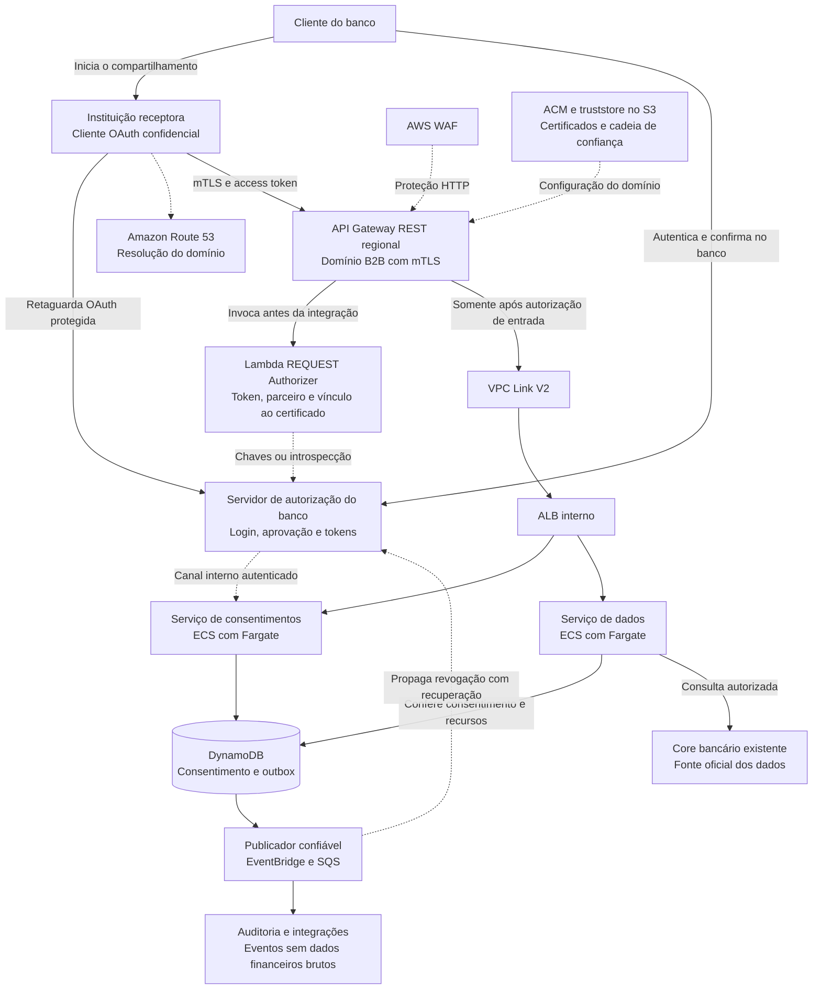
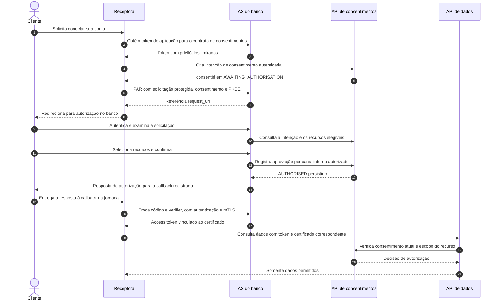
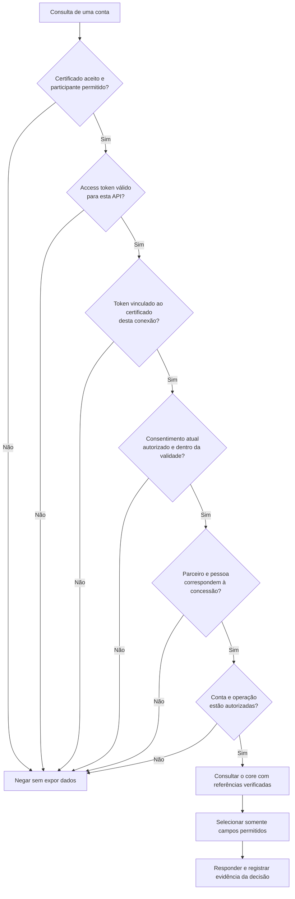
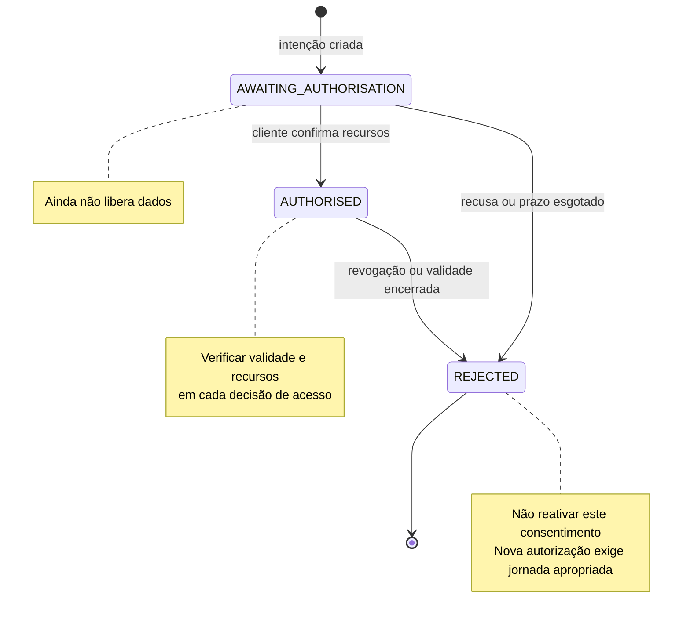
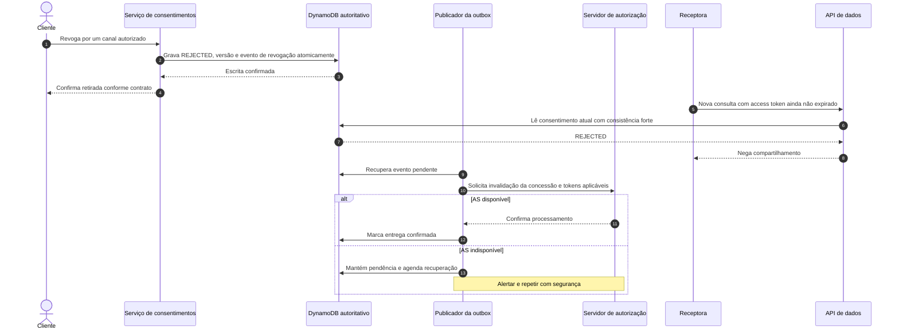
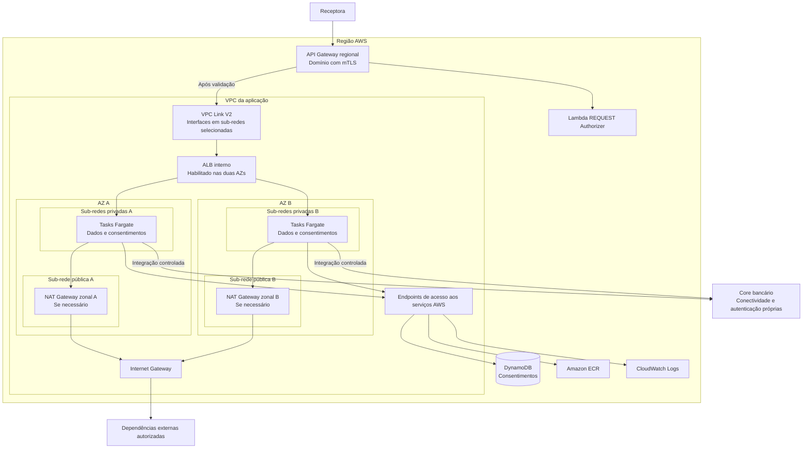

# Case 02 — APIs de Open Finance na AWS

> **Foco:** OAuth 2.0, OpenID Connect, mTLS, consentimento, autorização granular e segurança de APIs.  
> **Idioma:** português do Brasil. Os nomes dos serviços AWS e dos campos de protocolo foram preservados.  
> **Formato:** guia de estudo, decisões arquiteturais e simulação de entrevista.  
> **Referências consultadas em:** 28/09/2026.  
> **Caminho sugerido no repositório:** `cases/02-open-finance-apis.md`.

## Como usar este material

Este case continua a série iniciada em [Case 01 — Processamento de pagamentos e Pix](01-payment-processing-pix.md). Agora, o principal risco não é cobrar duas vezes: é **compartilhar dados financeiros com a instituição errada, sobre a conta errada ou depois de o cliente retirar sua autorização**.

Na primeira leitura, percorra o cenário, o vocabulário, a arquitetura e as 12 etapas. Depois aprofunde tokens, certificados e revogação. Finalmente, responda às perguntas sem abrir as respostas e explique a solução em voz alta.

**O objetivo é conseguir responder: quem está chamando, em nome de quem, para fazer o quê, sobre qual recurso e até quando?**

O material apresenta uma proposta didática, não uma arquitetura oficial da AWS, uma implementação homologada de Open Finance Brasil ou uma rubrica oficial de entrevista. As metas numéricas são hipóteses. O nível L5 é o alvo de preparação informado, não uma classificação publicada na descrição da vaga.

### Relação com a vaga

A descrição da vaga de Arquiteta de Soluções — FSI, Job ID 10457255, envolve aconselhar clientes, relacionar tecnologia e negócio, discutir arquiteturas e transferir conhecimento. Por isso, este estudo inclui descoberta de requisitos, alternativas, riscos e comunicação — e não apenas nomes de serviços. [Fonte: vaga][r01]

### Duas camadas de aprendizado

**Núcleo de arquitetura:** entender identidade, autorização, isolamento entre clientes, disponibilidade, integração com o banco e operação. É a parte para defender no quadro.

**Aprofundamento de Open Finance Brasil:** entender que existe um perfil de segurança, contratos de API, certificados, registro de participantes e testes de conformidade. Não é necessário decorar cada parâmetro na primeira leitura; é necessário saber que um login OAuth genérico não substitui esses requisitos. O portal oficial reúne as especificações aplicáveis. [Fonte: portal][r02]

---

## Sumário

1. [Problema de negócio e escopo](#s01)
2. [Vocabulário e modelo mental](#s02)
3. [Perguntas antes de desenhar](#s03)
4. [Requisitos e premissas da simulação](#s04)
5. [Decisões da arquitetura-base](#s05)
6. [Visão geral e jornada em Mermaid](#s06)
7. [Fluxo explicado em 12 etapas](#s07)
8. [OAuth 2.0, OIDC e validação dos tokens](#s08)
9. [mTLS, certificados e vínculo com o token](#s09)
10. [Consentimento, dados e revogação](#s10)
11. [Papel e posicionamento dos serviços](#s11)
12. [Trade-offs que precisam ser defendidos](#s12)
13. [Rede, domínios e fronteiras de confiança](#s13)
14. [Segurança de APIs e requisitos do ecossistema](#s14)
15. [Alta disponibilidade e recuperação regional](#s15)
16. [Desempenho, capacidade e custos](#s16)
17. [Observabilidade, operação e implantação](#s17)
18. [Aplicação dos seis pilares Well-Architected](#s18)
19. [Roteiro de laboratório e testes](#s19)
20. [30 perguntas de entrevista com respostas comentadas](#s20)
21. [Apresentação da solução e simulação de 45 minutos](#s21)
22. [Checklist de domínio](#s22)
23. [Referências e leitura orientada](#s23)

---

<a id="s01"></a>
## 1. Problema de negócio e escopo

### Enunciado inicial

> Um banco brasileiro quer disponibilizar APIs de Open Finance para que outras instituições participantes consultem contas, saldos e transações de clientes que autorizarem o compartilhamento. A solução deve proteger os dados, permitir revogação do consentimento, operar continuamente e integrar-se aos sistemas bancários existentes. Como você a desenharia na AWS?

### Exemplo de negócio

Uma cliente utiliza um aplicativo de outra instituição para organizar suas finanças. Ela decide conectar a conta mantida no nosso banco. O aplicativo solicita o compartilhamento; a cliente se autentica **no ambiente do banco**, verifica a solicitação e escolhe os recursos que deseja compartilhar.

Depois disso, o backend da instituição receptora consulta as APIs do banco dentro da autorização concedida. A cliente pode encerrar esse compartilhamento. A jornada de dados cadastrais e transacionais do Open Finance Brasil prevê autorização do cliente e mecanismos de revogação. [Fonte: compartilhamento de dados][r03]

**A senha do banco não deve ser entregue à instituição receptora.** A integração utiliza o mecanismo de autorização, não a coleta de credenciais bancárias pelo parceiro.

### Qual papel estamos construindo?

Neste estudo, somos a **instituição transmissora de dados**. Construiremos a exposição das APIs, a decisão de acesso e a gestão de consentimentos que se integram ao servidor de autorização e ao core existentes.

| Participante | Papel no cenário |
|---|---|
| Cliente do banco | Decide se autoriza e quais recursos compartilha. |
| Instituição receptora | Aplicação parceira que pede autorização e consome os dados. |
| Nosso banco, transmissor | Mantém os dados e decide se cada acesso é permitido. |
| Servidor de autorização do banco | Conduz a autenticação/autorização e emite os tokens apropriados. |
| Plataforma de APIs na AWS | Aplica controles de entrada, autorização e integração com os dados. |
| Core/sistemas bancários | Continuam sendo a fonte oficial de contas, saldos e transações. |
| Diretório e infraestrutura de confiança | Sustentam identificação e registro dos participantes e aplicações, conforme o ecossistema. |

O registro do cliente OAuth não será um cadastro público irrestrito. No ambiente regulado, ele precisa respeitar as informações e verificações de registro de participantes e software. [Fonte: registro dinâmico de clientes][r06]

### Fora do núcleo inicial

Não implementaremos iniciação de pagamentos, integração direta com Pix, investimentos, compartilhamento de pessoa jurídica com múltiplas alçadas, CIBA ou todas as jornadas otimizadas. Esses itens alteram contratos e regras de autorização.

Também não construiremos um servidor criptográfico ou um servidor OAuth artesanal para produção. A proposta integra um **servidor de autorização adequado ao perfil exigido**, operado pelo banco ou por um fornecedor especializado. O sistema existente pode precisar de adaptação e homologação; sua adequação não será presumida.

**Uma permissão para consultar saldo não autoriza realizar um pagamento.** Essa distinção deve permanecer clara mesmo quando dois produtos usam a mesma infraestrutura.

---

<a id="s02"></a>
## 2. Vocabulário e modelo mental

### A diferença central

Pense em uma visita a um arquivo confidencial:

- O **certificado mTLS** ajuda a comprovar qual organização/aplicação está se apresentando.
- O **access token** representa uma autorização emitida pelo servidor responsável.
- O **consentimento vigente** delimita quais informações daquela pessoa podem ser compartilhadas.

Ainda falta conferir se o documento solicitado realmente está dentro dessa autorização. Ter entrado no prédio não dá direito a abrir qualquer pasta.

Essa analogia é apenas didática. No protocolo, autenticação do cliente, autorização delegada e identidade do usuário têm mecanismos distintos. [Fontes: OAuth][r09], [OIDC][r10], [mTLS OAuth][r13]

| Termo | Significado prático neste case |
|---|---|
| OAuth 2.0 | Framework de autorização: permite conceder acesso limitado a uma aplicação. |
| OIDC | OpenID Connect: camada de identidade sobre OAuth 2.0, utilizada para informações de autenticação do usuário. |
| Cliente OAuth | A aplicação que pede tokens; aqui, o backend da instituição receptora. Não confundir com o cliente pessoa física. |
| Servidor de autorização, ou AS | Autoridade que valida a jornada e emite tokens. |
| Servidor de recursos, ou RS | API que entrega os dados protegidos. |
| Access token | Credencial apresentada à API para a autorização de acesso. |
| ID token | Artefato de identidade destinado ao cliente OIDC; não substitui o access token da API. |
| Refresh token | Credencial usada com o AS para obter novos access tokens conforme as regras da concessão. |
| Scope, ou escopo | Conjunto de capacidades solicitado/concedido no protocolo OAuth. Não substitui a seleção de contas. |
| Consentimento | Registro de negócio da autorização do cliente para um compartilhamento específico. |
| Recurso | Objeto protegido: por exemplo, uma conta identificada por `accountId`. |
| JWT | Formato de token que pode carregar declarações assinadas; não significa automaticamente que os dados estão cifrados. |
| JWKS | Conjunto publicado de chaves públicas para verificação de assinaturas. |
| mTLS | TLS mútuo: além do servidor, o cliente da conexão apresenta certificado. |
| Truststore | Conjunto de certificados de confiança utilizado para verificar cadeias. Não contém a chave privada do parceiro. |
| Token vinculado ao certificado | Token cujo uso exige o certificado ao qual ele foi associado. |
| PKCE | Proteção que vincula a solicitação de autorização à posterior troca do código. |
| PAR | Envio da solicitação de autorização diretamente ao AS, antes do redirecionamento pelo navegador. |
| `private_key_jwt` | Autenticação do cliente com uma declaração JWT assinada por sua chave privada. |
| FAPI | Perfil de segurança que restringe e complementa protocolos para aplicações financeiras. |
| BOLA | Falha de autorização sobre o objeto: trocar o ID e acessar a conta de outra pessoa. |
| Revogação | Retirada da autorização ou invalidação de uma credencial, conforme o objeto revogado. |

**Três identificadores diferentes:** `client_id` identifica a aplicação; `sub` identifica o sujeito no contexto do emissor; `consentId` identifica o consentimento. Não use um como substituto dos outros.

### Uma frase para guardar

> “O certificado autentica a conexão da instituição; o token apresenta uma autorização; o serviço verifica se o consentimento e o recurso solicitado ainda permitem aquela leitura.”

A sequência é importante: **token assinado não significa acesso irrestrito; consentimento antigo não significa autorização atual**.

---

<a id="s03"></a>
## 3. Perguntas antes de desenhar

Uma abertura adequada seria:

> “Quero confirmar nosso papel no ecossistema, quais dados vamos compartilhar, como o cliente autoriza e revoga esse acesso e quais componentes de identidade e core já existem. Essas respostas definem a fronteira da solução.”

| Pergunta ao cliente | Por que muda a arquitetura |
|---|---|
| Somos transmissores, receptores ou iniciadores de pagamentos? | Define quais APIs e jornadas são responsabilidade nossa. |
| Quais dados e públicos entram primeiro? | Conta PF, conta PJ, cartão e investimentos têm regras diferentes. |
| A integração é Open Finance Brasil regulado ou uma API privada para parceiros? | Muda o perfil de protocolo, certificados e conformidade. |
| Já existe AS/IdP adequado e homologado? | Define integração com a plataforma existente ou um projeto adicional. |
| Quem opera registro de parceiros, certificados e chaves? | Expõe dependências e responsabilidades fora da aplicação. |
| Como a cliente confirma e escolhe as contas? | Define a ligação entre identidade, consentimento e recursos. |
| Em quais canais ela pode revogar? | Exige convergência entre canal do banco, receptor e AS. |
| O que significa “revogação imediata” para chamadas em andamento? | Obriga a definir o ponto de decisão e a janela de concorrência. |
| Qual volume médio, pico e distribuição por parceiro? | Orienta escalabilidade, limites e proteção do core. |
| Qual latência, em qual percentil e por endpoint? | Diferencia leitura simples de extrato paginado. |
| O core aceita todo o tráfego ou há uma camada de leitura? | Pode exigir réplica/projeção com política de atualização explícita. |
| O token é JWT ou opaco? Há introspecção? | Altera o autorizador e a dependência síncrona do AS. |
| Quais falhas podem interromper o compartilhamento? | Define escolhas de segurança versus continuidade. |
| Precisamos resistir a falha de AZ ou de Região? | Muda o tratamento do estado de consentimento e revogação. |
| Quais contratos, versões e testes são obrigatórios na implantação? | Evita implementar uma API tecnicamente funcional, mas incompatível. |
| Quais evidências precisam ser preservadas e por quanto tempo? | Orienta auditoria, privacidade e retenção. |
| Existem restrições de residência de dados e de fornecedores? | Condiciona regiões, conectividade e dependências. |
| Quem acompanha incidentes e alterações regulatórias? | Sem operação, certificados e contratos podem expirar em produção. |

Na entrevista, priorize escopo, identidade, consentimento e risco antes de discutir cache ou tipo de banco.

---

<a id="s04"></a>
## 4. Requisitos e premissas da simulação

Os números abaixo são **metas de exercício**, não requisitos regulatórios nem capacidade comprovada dos serviços.

| Categoria | Premissa do estudo |
|---|---|
| Papel | Banco transmissor de dados. |
| Jornada inicial | Compartilhamento de contas, saldos e transações de pessoa física. |
| Identidade | AS existente, com integração segura ao login e ao consentimento do banco. |
| Participantes | Aplicações previamente identificadas e registradas. |
| Região inicial | `sa-east-1`, sujeita à avaliação de serviços, políticas e dependências. |
| Disponibilidade | Meta didática de 99,95% para consultas elegíveis; definir indicadores separados para login e consentimento. |
| Volume | Até 1.000 consultas/s de pico, com criação e revogação dimensionadas separadamente. |
| Latência | p95 de até 500 ms para consulta simples, incluindo o core; validar por teste e por endpoint. |
| Consentimentos | Suportar milhões de registros sem obrigar carregamento em memória. |
| Revogação | Nenhuma autorização de dados iniciada após a gravação confirmada da revogação deve usar o consentimento antigo na Região primária. |
| Tokens | JWT no caminho principal didático; token opaco será uma alternativa. |
| Cache inicial | Sem cache de decisão `Allow` e sem cache de resposta contendo dados financeiros. |
| Core | Continua sendo a fonte oficial dos dados financeiros. |
| Resiliência inicial | Multi-AZ; estratégia regional depende de RTO/RPO e segurança de restauração. |
| Laboratório | Somente dados sintéticos, clientes de teste e certificados de laboratório. |

### Invariantes de segurança do projeto

1. A identidade do parceiro não pode ser escolhida pelo próprio corpo ou por um header arbitrário da requisição.
2. Uma autorização para a conta A não permite ler a conta B, mesmo que ambas pertençam à mesma pessoa.
3. Um consentimento revogado ou vencido não permite nova leitura, mesmo com JWT ainda dentro do prazo.
4. A criação de uma solicitação de consentimento não equivale à aprovação pela pessoa.
5. Nem cache, nem atraso de fila, nem restauração de backup podem ser tratados como autorização implícita.
6. Dados financeiros e credenciais não devem vazar por logs, erros, URLs ou métricas.

**Definição importante:** “nenhuma autorização iniciada após a revogação” não significa recolher dados que já foram transmitidos. Chamadas concorrentes e dados previamente recebidos exigem uma política explícita, detalhada na seção 10.

---

<a id="s05"></a>
## 5. Decisões da arquitetura-base

### Caminho da API de dados

**Domínio regional com mTLS → API Gateway REST API → Lambda REQUEST Authorizer → VPC Link V2 → ALB interno → ECS com AWS Fargate.**

O serviço consulta o consentimento no DynamoDB e acessa o core somente após a autorização granular. O AS aparece como uma autoridade integrada, não como uma função Lambda que inventaremos para emitir tokens.

A documentação atual permite ALB ou NLB nas integrações privadas de REST APIs com VPC Link V2. Para nosso tráfego HTTP e roteamento de aplicações, escolhemos ALB interno. Essa escolha deve ser reavaliada quando houver requisitos diferentes de protocolo ou plataforma. [Fonte: integração privada][r24]

### Duas entradas diferentes

| Entrada | Quem utiliza | Controles principais |
|---|---|---|
| Canal de autenticação e aprovação | Navegador/aplicativo da pessoa no ambiente do banco | TLS, sessão segura, autenticação do banco e confirmação da jornada. |
| APIs entre instituições | Backend da instituição receptora | mTLS, token apropriado, vínculo com o certificado, situação do parceiro e autorização do recurso. |

O navegador da cliente não precisa possuir o certificado institucional da receptora. Já os endpoints de retaguarda do AS, como troca de token, seguem as regras de segurança aplicáveis ao cliente institucional.

### Responsabilidades separadas

| Componente | Responsabilidade | O que não resolve sozinho |
|---|---|---|
| API Gateway + mTLS | Entrada da API e validação da cadeia do certificado conforme a configuração. | Consentimento, todas as verificações de revogação e autorização por conta. |
| Lambda REQUEST Authorizer | Validar o contexto de segurança: token, aplicação, certificado e política de entrada. | Conhecer todo o modelo de contas e filtrar campos do core. |
| Serviço de consentimentos | Manter autorização de negócio, recursos escolhidos, estados e evidências. | Autenticar sozinho toda a jornada OIDC. |
| Serviço de dados | Aplicar autorização por objeto/campo e traduzir o contrato da API para o core. | Substituir a fonte oficial do saldo. |
| AS/IdP existente | Autenticação, concessão, emissão, renovação e revogação de tokens. | Garantir que o RS autorize corretamente todos os objetos. |
| Eventos | Propagar mudanças e alimentar operação e auditoria. | Bloquear imediatamente uma leitura, se o serviço continuar aceitando um estado em cache. |

A AWS já publicou uma arquitetura de integração entre API Gateway, Lambda Authorizers e provedores OIDC adequados a FAPI. Usamos essa separação como referência conceitual; o artigo é de 2021 e não substitui os perfis e testes atuais. [Fonte: referência AWS][r42]

### O que não entra automaticamente

Aurora é alternativa ao DynamoDB se o modelo de consentimento justificar transações relacionais. ElastiCache só será acrescentado com medição e regras de invalidação. CloudFront pode atender uma interface estática separada, mas não será colocado, sem análise, na frente do ingresso mTLS. EKS, MSK e um produto de autorização adicional não são obrigatórios para explicar este case.

---

<a id="s06"></a>
## 6. Visão geral e jornada em Mermaid

### 6.1 Visão lógica da solução

As linhas tracejadas representam associações de controle ou integração. Route 53 resolve DNS; WAF, certificados e servidor de autorização não são simplesmente caixas em série pelas quais toda requisição de negócio passa.



O AS e a instituição receptora têm seus próprios componentes de segurança. O desenho não afirma que compartilham a mesma VPC nem que o AS estará obrigatoriamente hospedado na AWS. As operações internas de aprovação usam uma identidade de serviço verificada; não são endpoints públicos que permitem ao parceiro definir o status do consentimento.

### 6.2 Jornada de consentimento e obtenção de acesso

O diagrama resume as responsabilidades. Os detalhes de assinatura, criptografia, parâmetros e respostas seguem o perfil escolhido. A resposta de autorização pode conter, além do código, outros artefatos exigidos pelo perfil; ela não é reduzida aqui a uma implementação genérica de OAuth.



A seta de callback representa o tratamento da resposta pela aplicação receptora, incluindo o componente de navegador quando o modo de resposta assim exige; ela não significa que o fragmento de uma URL seja enviado automaticamente ao backend. Use uma implementação do protocolo compatível com a jornada. [Fonte: OIDC][r10]

A chamada `D → C` representa a consulta de política. Na implementação-base, o serviço de dados pode ler a estrutura autoritativa diretamente no DynamoDB, com um módulo de política compartilhado, em vez de adicionar um salto HTTP. A regra precisa permanecer única e testada.

---

<a id="s07"></a>
## 7. Fluxo explicado em 12 etapas

### Etapa 1 — Identificar a instituição e registrar a aplicação

Antes de acessar dados, a receptora e seu software precisam estar corretamente registrados. Mantenha o vínculo entre organização, aplicação, `client_id`, certificados, chaves e metadados aprovados. Um certificado tecnicamente válido não deve permitir que qualquer aplicação se apresente como qualquer participante.

**Onde entra a AWS:** uma estrutura controlada pode manter o estado operacional de parceiros no DynamoDB; chaves públicas e metadados vêm de origens aprovadas. Atualizações devem ter origem autenticada e evidência de quem as aprovou. O processo de registro segue o contrato do diretório e do AS. [Fonte: DCR][r06]

**Pergunta para defender:** “Como bloqueamos uma aplicação suspensa sem interromper todos os participantes que usam a mesma autoridade certificadora?”

### Etapa 2 — Receber o pedido inicial de compartilhamento

A pessoa inicia a jornada na receptora. O backend solicita uma intenção de consentimento ao banco com os privilégios de aplicação exigidos por essa rota.

Essa chamada pode usar um token obtido por `client_credentials`, conforme o contrato da API. Ela ainda **não autoriza consultar o saldo da pessoa**. O serviço valida o solicitante e persiste o pedido sem marcar aprovação.

**Onde entra a AWS:** API Gateway, autorizador e serviço de consentimentos. A regra da rota de criação é diferente da regra de uma consulta financeira; exigir consentimento já aprovado para criar um consentimento causaria uma dependência circular.

### Etapa 3 — Preparar a autorização e redirecionar ao banco

A receptora prepara os parâmetros da jornada e envia a solicitação ao AS pelo mecanismo definido no perfil. Com PAR, recebe uma referência para o redirecionamento, em vez de transportar toda a solicitação apenas pelo navegador. [Fonte: PAR][r12]

**Onde entra a AWS:** a plataforma mantém integração com o AS; não inventa um token local para substituir a jornada. O domínio do login é separado do domínio B2B com mTLS.

**Cuidado:** um `redirect_uri` controlado livremente pelo solicitante abre espaço para desvio da resposta. Trabalhe com valores cadastrados e comparados de forma estrita.

### Etapa 4 — Autenticar a pessoa no ambiente do banco

O banco conduz seu login e os controles adequados à jornada. O parceiro não recebe a senha. A sessão autenticada deve estar vinculada ao pedido que está sendo aprovado, evitando que uma aba ou um redirecionamento aprove a intenção de outra pessoa.

**Onde entra a AWS:** podemos reutilizar a plataforma de identidade existente. Cognito é uma alternativa para funcionalidades de identidade em outros contextos ou em um laboratório, mas não será considerado automaticamente compatível com o perfil completo de Open Finance Brasil. Sua documentação descreve endpoints OAuth/OIDC; a conformidade específica precisa ser demonstrada separadamente. [Fonte: Cognito][r41]

### Etapa 5 — Apresentar e persistir o consentimento

A pessoa visualiza quem receberá os dados e quais informações serão compartilhadas. No nosso escopo, escolhe as contas. A confirmação produz um registro vinculado à identidade autenticada, ao parceiro e aos recursos selecionados.

**Onde entra a AWS:** o serviço grava a decisão no DynamoDB com controle de concorrência. A aplicação receptora não pode alterar o status para aprovado por um `PATCH` arbitrário. A transição é executada por uma operação interna autorizada da jornada do banco.

**Demonstração:** ter duas contas no banco não significa que a aprovação da conta A permita consultar a conta B.

### Etapa 6 — Emitir credenciais adequadas ao acesso

Após a aprovação, o AS conclui a jornada e troca o código por tokens, validando a autenticação da aplicação, o código e a prova PKCE. O access token é destinado às APIs apropriadas e, no desenho proposto, vinculado ao certificado utilizado pelo cliente.

**Onde entra a AWS:** o autorizador aprenderá a verificar os artefatos desse AS. Não usamos um ID token como autorização da API de contas. O contrato de emissão precisa definir emissor, destinatário, formato e mapeamento para o consentimento.

### Etapa 7 — Receber uma chamada B2B protegida

A receptora consulta a API pelo domínio mTLS. O certificado apresentado precisa passar pelas verificações da plataforma, e a aplicação deve apresentar o access token correto.

**Onde entra a AWS:** API Gateway REST regional com domínio personalizado, certificado de servidor gerenciado/importado no ACM e truststore no S3. A verificação do certificado de cliente e a autorização de negócio são controles distintos. [Fonte: mTLS no API Gateway][r19]

**Importante:** mTLS se aplica à conexão entre instituições. Não pedimos à pessoa que instale o certificado privado da receptora no seu celular.

### Etapa 8 — Validar token, aplicação e vínculo criptográfico

O Lambda REQUEST Authorizer recebe o contexto da requisição e o certificado encaminhado pelo API Gateway. Ele verifica o token, identifica a aplicação, aplica bloqueios de parceiro/certificado e compara o vínculo criptográfico do token com o certificado da conexão.

**Onde entra a AWS:** usamos `requestContext.identity.clientCert` como origem do certificado, não um `X-Client-Cert` enviado livremente pelo parceiro. [Fonte: entrada do REQUEST Authorizer][r20]

**Escolha inicial:** cache de decisões do autorizador desativado. Um cache indexado apenas pelo token poderia reutilizar uma autorização com outro contexto de certificado. Chaves públicas podem ter cache próprio, com regras distintas.

### Etapa 9 — Aplicar consentimento e autorização por recurso

Após passar pela entrada, a requisição segue por VPC Link e ALB interno. O serviço de dados verifica o consentimento atual, validade, cliente OAuth, pessoa vinculada, permissões e conta solicitada.

**Onde entra a AWS:** leitura fortemente consistente da estrutura autoritativa por chave primária no DynamoDB. A escolha por leitura forte é uma decisão do case para não aceitar uma versão anterior já revogada na mesma Região. [Fonte: consistência de leitura][r26]

**Não basta:** `scope=accounts`. A chamada também precisa estar autorizada para aquela conta e para os campos que o endpoint devolve.

### Etapa 10 — Consultar o core e limitar a resposta

O adaptador consulta o core utilizando referências verificadas. Depois monta uma resposta que respeita o contrato, as permissões e a paginação. Não repassa automaticamente o objeto inteiro do sistema legado.

**Onde entra a AWS:** serviço em ECS/Fargate com permissões mínimas e conectividade controlada. O core permanece autoritativo para os dados financeiros; DynamoDB não passa a ser o banco do saldo só porque armazena consentimentos.

**Exemplo de risco:** uma consulta de saldo não deve devolver documentos pessoais extras porque o método interno do core os inclui. A autorização de propriedades também precisa ser verificada. [Fonte: OWASP — propriedades][r32]

### Etapa 11 — Registrar evidências e operar a jornada

Registre identificadores correlacionáveis, decisão de autorização, versão de política e resultado técnico, sem copiar tokens, senhas ou extratos para logs comuns.

**Onde entra a AWS:** logs de aplicação e de acesso no CloudWatch; mudanças administrativas de recursos em CloudTrail; eventos de negócio com entrega recuperável. CloudTrail e logs de aplicação respondem a perguntas diferentes. [Fontes: CloudTrail][r36], [CloudWatch Logs][r37]

**Pergunta para defender:** “Conseguimos demonstrar por que a conta A foi liberada às 10h02, sem armazenar seu saldo inteiro no log?”

### Etapa 12 — Renovar ou revogar sem ampliar a autorização

O uso de refresh token depende de concessão ainda válida. Uma revogação deve bloquear novas decisões de acesso e ser coordenada com o AS. A publicação de eventos ajuda a propagar o estado, mas a API não espera a fila para deixar de compartilhar.

**Onde entra a AWS:** atualização autoritativa do consentimento, outbox durável e entrega por EventBridge/SQS aos consumidores. O evento não é a única defesa contra acesso após revogação. A diferença entre gravar no banco e publicar em outro sistema é tratada pelo padrão outbox. [Fonte: outbox][r29]

---

<a id="s08"></a>
## 8. OAuth 2.0, OIDC e validação dos tokens

### 8.1 Autenticar não é autorizar

O banco pode saber que a pessoa é Ana e ainda assim não ter autorização para compartilhar sua segunda conta. Da mesma forma, pode reconhecer o certificado da instituição X sem que X tenha consentimento para consultar qualquer conta de Ana.

OAuth organiza a concessão de acesso; OIDC acrescenta informações de autenticação. A autorização final do recurso continua sendo uma responsabilidade da aplicação que entrega o dado. [Fontes: OAuth][r09], [OIDC][r10]

| Artefato | Onde aparece | Uso correto no desenho |
|---|---|---|
| Código de autorização | Volta na jornada de redirecionamento | Trocar por tokens no AS, com verificações e PKCE. |
| ID token | Fluxo OIDC | Validar a identidade/autenticação para a aplicação destinatária. |
| Access token | Requisição à API protegida | Apresentar autorização; o RS valida e aplica regras de negócio. |
| Refresh token | Comunicação do cliente com o AS | Pedir novo access token enquanto a concessão permitir. |
| Certificado de cliente | Conexão mTLS | Comprovar posse da chave na conexão e sustentar o vínculo do token. |
| `consentId` | Jornada e registros de autorização | Relacionar a operação à autorização de negócio, não funcionar como senha. |

**Não ensine “JWT é o login”.** JWT é um formato. O mesmo formato pode representar artefatos com emissores, destinatários e finalidades diferentes.

### 8.2 `client_credentials` versus jornada com a pessoa

Uma aplicação pode obter privilégios próprios para operações permitidas ao seu papel, como iniciar a intenção de consentimento conforme o contrato. Isso não comprova que uma pessoa autorizou a consulta de sua movimentação.

Para consultar dados pessoais, precisamos do resultado da jornada da pessoa e de uma concessão compatível com o consentimento. O tipo de token aceito deve ser definido por operação, não por uma regra universal do tipo “qualquer token válido passa”. [Fonte: concessões OAuth][r09]

**Armadilha:** liberar `/accounts/{id}/balances` porque a receptora apresentou um token de aplicação com assinatura válida. Faltariam o vínculo à pessoa e a autorização para a conta.

### 8.3 PKCE, PAR e `private_key_jwt` resolvem problemas diferentes

| Mecanismo | Ideia principal | Não substitui |
|---|---|---|
| PKCE | O cliente cria um segredo transitório e envia sua transformação na solicitação; depois comprova o segredo na troca do código. | Identidade da instituição, consentimento e autorização por conta. |
| PAR | A solicitação é enviada diretamente ao AS, que devolve uma referência para a jornada pelo navegador. | A confirmação da pessoa e todas as proteções da resposta. |
| `private_key_jwt` | A aplicação assina uma declaração para se autenticar no AS. | A prova do usuário ou a verificação do vínculo mTLS na API. |
| JAR | Protege a solicitação de autorização com um objeto JWT conforme o perfil. | A validação de cada parâmetro e o registro correto do cliente. |

O desafio PKCE não deve permitir recuperar o segredo usado na troca; com `S256`, utiliza-se uma transformação criptográfica padronizada. PAR, autenticação por JWT e solicitação assinada têm especificações próprias. [Fontes: PKCE][r11], [PAR][r12], [JWT para autenticação de cliente][r18], [JAR][r48]

Na apresentação inicial, basta explicar **por que proteger a troca do código e o redirecionamento**. Os nomes entram para demonstrar que a implementação utilizará protocolos existentes, não uma solução improvisada.

### 8.4 Validar um access token JWT

A verificação precisa ter configuração explícita do emissor aceito, das chaves e do tipo de token esperado. Decodificar Base64 e ler `sub` não verifica autenticidade.

Um verificador deve avaliar assinatura, algoritmo permitido, emissor, destinatário, validade temporal e finalidade. Não aceite que um token escolha livremente a URL de onde serão baixadas suas próprias chaves. Tokens de finalidades diferentes precisam de regras de validação distintas. [Fonte: boas práticas de JWT][r17]

**Exemplo didático de declarações extraídas de um token já validado:**

```json
{
  "iss": "https://as.banco.example",
  "aud": "https://mtls.api.banco.example",
  "sub": "pessoa-referencia-123",
  "client_id": "aplicacao-receptora-456",
  "scope": "accounts consent:consentimento-789",
  "exp": 2030000000,
  "cnf": {
    "x5t#S256": "impressao-digital-base64url-do-certificado"
  }
}
```

Isso **não é um token utilizável** nem uma promessa de formato obrigatório para todo AS. O contrato pode usar token opaco, atributos diferentes ou outra representação de sujeito. `client_id` e os demais campos devem ser extraídos conforme o perfil do emissor; o perfil JWT de access tokens descreve uma forma padronizada de organizá-los. [Fonte: RFC 9068][r45]

O vínculo com o consentimento deve vir de informação validada ou de uma associação protegida do AS. Não aceite `consentId` informado livremente em header como se fosse prova de autorização.

### 8.5 JWT versus token opaco

**JWT:** o RS pode verificar a assinatura com chaves públicas sem consultar o AS em toda chamada. Isso reduz uma dependência de rede, mas não fornece conhecimento automático sobre revogações posteriores à emissão.

**Token opaco:** o RS consulta uma interface de introspecção autenticada para obter seu estado e atributos. Introduz uma dependência síncrona e um requisito de capacidade no AS. A resposta de introspecção possui semântica própria, inclusive indicação de atividade. [Fonte: introspecção][r15]

Em ambos os casos, o nosso desenho consulta o consentimento atual. Uma resposta `active=true` não deve ser interpretada como “qualquer conta está liberada”.

### 8.6 Renovação e rotação não são a mesma coisa

Renovar acesso é obter um novo access token. Rotacionar refresh token é substituí-lo por outro durante seu uso. Uma prática genérica não deve ser aplicada sem verificar o perfil da integração.

A BCP de segurança OAuth discute proteções como tokens vinculados ao emissor da requisição e regras de proteção de refresh tokens. O perfil brasileiro acrescenta escolhas específicas, resumidas na seção 14. [Fonte: segurança OAuth][r14]

No projeto, o AS precisa consultar a concessão/consentimento antes de renovar, enquanto a API verifica o estado vigente antes de liberar os dados. Essas duas verificações são complementares.

### 8.7 Decisão da API de dados

Este fluxo é para **consulta financeira**, não para todas as rotas do sistema. Criação de consentimento, login e administração possuem políticas próprias.



**Indisponibilidade de uma verificação crítica não deve ser convertida em “sim”.** Diferencie falha técnica de rejeição por política para poder operar o incidente corretamente.

---

<a id="s09"></a>
## 9. mTLS, certificados e vínculo com o token

### 9.1 O que muda em relação ao HTTPS comum?

Em uma conexão HTTPS usual, o cliente verifica o certificado do servidor. Com autenticação TLS mútua, o servidor também exige a apresentação de um certificado do cliente, que demonstra posse da chave privada correspondente durante a conexão.

Isso protege uma identidade técnica. Não diz, por si só, que a cliente Ana aprovou o compartilhamento. Além disso, autenticação mTLS e vínculo do access token ao certificado são mecanismos relacionados, mas não intercambiáveis. [Fonte: OAuth mTLS][r13]

### 9.2 Componentes no API Gateway

Para o ingresso escolhido, configuramos um domínio regional com mTLS, certificado de servidor e um truststore no S3. Quando um certificado de servidor é importado no ACM, devem ser observados também os requisitos de verificação de propriedade do domínio descritos pela AWS.

**Limitação essencial:** o API Gateway não verifica se o certificado de cliente foi revogado. O projeto precisa complementar essa verificação e manter a situação do participante e do software. Atualizações do truststore também precisam de gestão operacional. [Fonte: configuração e limitações de mTLS][r19]

Não basta colocar todas as autoridades do ecossistema no truststore e concluir que o parceiro está autorizado. A confiança na cadeia e a permissão operacional da aplicação são camadas diferentes.

### 9.3 O vínculo que impede usar um token com outro certificado

Suponha que um token tenha sido emitido para a conexão da aplicação A. Outra aplicação, também com um certificado confiável, obtém uma cópia desse token.

Validar apenas a assinatura do JWT e apenas a cadeia de cada certificado permitiria tratar ambos separadamente como válidos. É preciso confirmar que **aquele token exige aquele certificado**.

A RFC 8705 define a indicação `cnf.x5t#S256`: uma impressão digital SHA-256 do certificado final, em DER, codificada em base64url sem padding. O RS compara esse valor ao certificado apresentado. [Fonte: vínculo ao certificado][r13]

```text
Token válido + certificado confiável, mas diferente do vinculado = negar
Token válido + certificado vinculado + consentimento revogado = negar
Token válido + certificado vinculado + conta fora do consentimento = negar
```

Compare o certificado final da conexão. Não substitua essa comparação pelo nome da organização, pelo `CN`, pelo certificado da CA ou somente por um número de série.

**Limite da proteção:** se o atacante obtiver também a chave privada correspondente e as demais credenciais necessárias, o vínculo não será uma barreira suficiente. A resposta passa por bloqueio, revogação e investigação.

### 9.4 De onde vem o certificado dentro da aplicação?

O API Gateway disponibiliza o certificado ao REQUEST Authorizer em seu contexto de identidade. A função deve utilizar essa origem controlada. Um TOKEN Authorizer centrado apenas no bearer token não recebe o mesmo conjunto de informações de uma requisição completa. [Fonte: eventos de authorizer][r20]

Para encaminhar a identidade verificada ao ECS, configure o mapeamento dos atributos produzidos pelo autorizador e **sobrescreva/remova cabeçalhos reservados enviados pelo cliente**. Restrinja a rede para que o serviço não possa ser chamado por uma rota alternativa capaz de forjar esse contexto.

Uma política possível para este projeto é: o serviço aceita o contexto de segurança somente da integração privada permitida; as rotas internas possuem autenticação própria; nenhuma rota administrativa trata `X-User-Id` como autoridade sem verificação.

### 9.5 Revogar e renovar certificados

Separe quatro eventos operacionais:

| Evento | Conduta proposta |
|---|---|
| Renovação planejada | Cadastrar o novo certificado, testar emissão e uso de novos tokens e retirar o antigo segundo a política. |
| Expiração | Alertar antecipadamente e impedir que a renovação dependa de uma intervenção de emergência. |
| Chave comprometida | Bloquear imediatamente o certificado/aplicação afetada e executar a revogação aplicável; não aguardar apenas expiração. |
| Mudança na cadeia confiável | Atualizar truststore com controle de versão, testes e reversão segura. |

Uma troca de certificado pode exigir novos tokens vinculados à nova identidade criptográfica. Não “desative temporariamente” a comparação para resolver um incidente de rotação.

No Open Finance Brasil, certificados de transporte, assinatura e servidor têm requisitos específicos. O padrão consultado trata também de transições de famílias de certificados; validade, cadeia e revogação precisam ser consideradas. Um certificado público comum emitido pelo ACM não deve ser declarado automaticamente equivalente ao certificado exigido pelo ecossistema. [Fonte: padrão de certificados][r07]

### 9.6 Checar revogação sem criar uma dependência ingênua

Não proponha baixar uma lista de certificados revogados de toda a internet a cada request. Defina as fontes aprovadas da infraestrutura de confiança, mecanismo suportado, atualização, validade da evidência e resposta a indisponibilidade.

Para o laboratório, uma tabela de certificados bloqueados pode demonstrar o comportamento. Para produção, ela **não substitui** as verificações obrigatórias do perfil e da infraestrutura de certificação. Deve existir um limite explícito de obsolescência das evidências, monitoramento e tratamento seguro quando esse limite for ultrapassado.

### 9.7 TLS externo e TLS interno são conexões diferentes

O mTLS termina no ingresso que o valida. A conexão de API Gateway para ALB e a conexão de ALB para o serviço são novos trechos, com políticas próprias. Configurar HTTPS no trecho privado não significa transportar automaticamente a identidade TLS original até o container.

Essa é a razão para explicar tanto **proteção do canal** quanto **origem confiável do contexto de identidade**. A integração privada permite configurar HTTPS para o backend; isso precisa ser feito explicitamente no desenho adotado. [Fonte: integração privada][r24]

---

<a id="s10"></a>
## 10. Consentimento, dados e revogação

### 10.1 Consentimento é uma entidade de negócio

O registro precisa responder: qual aplicação pediu, quem aprovou, quais recursos e operações estão permitidos, qual validade foi acordada e o que aconteceu depois.

Não transforme a simples existência de uma linha na tabela em autorização. Uma solicitação pode existir e ainda aguardar aprovação.

As orientações de dados cadastrais e transacionais descrevem os estados `AWAITING_AUTHORISATION`, `AUTHORISED` e `REJECTED`. Rejeição/revogação/expiração têm motivos diferentes, mas não devem virar enums públicos inventados quando o contrato exige esses valores. [Fonte: estados de consentimento][r04]



A máquina acima é deliberadamente limitada à jornada de dados estudada. Não copie seus estados para consentimentos de iniciação de pagamentos sem consultar a especificação correspondente.

### 10.2 Um modelo interno de dados

Exemplo **interno e simplificado**, não o corpo oficial de criação/resposta da API:

```json
{
  "pk": "CONSENT#consentimento-789",
  "consentId": "consentimento-789",
  "clientId": "aplicacao-receptora-456",
  "organizationId": "organizacao-receptora-001",
  "subjectRef": "pessoa-referencia-123",
  "status": "AUTHORISED",
  "permissions": [
    "ACCOUNTS_READ",
    "ACCOUNTS_BALANCES_READ"
  ],
  "allowedResourceIds": ["conta-A"],
  "createdAt": "2026-09-28T12:00:00Z",
  "authorisedAt": "2026-09-28T12:02:00Z",
  "expiresAt": "2026-12-27T12:02:00Z",
  "version": 2,
  "policyVersion": "politica-lab-1",
  "revokedAt": null,
  "revocationReason": null
}
```

Os nomes de permissões servem para ilustrar a diferença entre operações. Os agrupamentos obrigatórios, campos, formatos e políticas de validade da API real devem vir do contrato vigente; o exemplo não é uma solicitação completa compatível com OpenAPI. O catálogo consultado apresenta documentação e versões de consentimento, incluindo versões de pré-lançamento que não devem ser tratadas automaticamente como mandatórias. [Fonte: API de consentimentos][r43]

`subjectRef` é preenchido/vinculado por informação confiável da jornada do banco. Um CPF enviado pela receptora pode identificar a intenção, mas não prova que a pessoa se autenticou ou aprovou.

### 10.3 Escopo, permissão e recurso

Imagine a seguinte combinação:

```text
Escopo OAuth: capacidade de usar APIs de contas
Permissão de negócio: consultar saldos
Recurso autorizado: conta-A
Operação solicitada: saldo da conta-B
Resultado: negar
```

A autorização é a interseção entre o que o token permite, o que o consentimento vigente permite, o que a pessoa pode compartilhar e o que o contrato daquele endpoint expõe.

Uma lista de contas precisa retornar somente as contas elegíveis daquele compartilhamento. A proteção não deve existir apenas em `/accounts/{id}` enquanto `/accounts` entrega todas.

Para paginação, proponho vincular o cursor ao contexto autorizado e rejeitar seu uso em outro parceiro ou consentimento. Se o conjunto permitido mudar, não permita que uma página previamente preparada ignore a mudança.

### 10.4 Decisão em pseudocódigo

O exemplo abaixo separa a validação técnica da aplicação de política. Não implementa criptografia nem representa um autorizador completo pronto para produção.

```text
autorizar_consulta(contexto_validado, conta_solicitada, operacao, agora):
    exigir contexto_validado.tipo == ACCESS_TOKEN
    exigir contexto_validado.destinatario == API_ESPERADA
    exigir contexto_validado.certificado_corresponde_ao_token
    exigir contexto_validado.parceiro_permitido

    consentimento = ler_por_chave_com_consistencia_forte(
        contexto_validado.consentimento_associado
    )

    exigir consentimento existe
    exigir consentimento.status == AUTHORISED
    exigir consentimento ainda está dentro da validade aplicável
    exigir consentimento.clientId == contexto_validado.client_id
    exigir consentimento.subjectRef == contexto_validado.sujeito_associado
    exigir operacao pertence às permissões efetivas
    exigir conta_solicitada pertence aos recursos autorizados
    exigir recurso continua elegível no sistema responsável

    devolver contexto_de_consulta_restrito
```

O vínculo de sujeito pode exigir tradução entre identificadores internos e o `sub` do emissor. Não compare campos de formatos diferentes por suposição.

### 10.5 Por que leitura forte e por chave?

Nossa decisão é ler a autorização vigente por `consentId` na tabela primária. DynamoDB oferece leitura fortemente consistente de tabelas e índices secundários locais; índices secundários globais não oferecem essa opção. [Fonte: consistência][r26]

Um índice por pessoa é útil para listar consentimentos no portal, mas não deve ser a única fonte de uma decisão que precisa enxergar uma revogação recém-confirmada.

A leitura forte não bloqueia futuras alterações: a revogação pode ocorrer logo após a leitura. Por isso, a garantia deve estar associada ao instante da decisão e não à alegação impossível de que uma consulta de rede nunca concorrerá com uma mudança.

### 10.6 Expiração não é exclusão por TTL

Proponho verificar `expiresAt` e a política aplicável em toda autorização. A exclusão física pode ocorrer depois, conforme retenção e auditoria.

O TTL do DynamoDB é um mecanismo assíncrono de limpeza; itens vencidos podem permanecer por algum tempo. Logo, “o item ainda está na tabela” não é uma verificação de validade. [Fonte: TTL][r27]

Não fixe “todo consentimento vale 12 meses” como regra universal. Use a versão contratual da jornada e suas regras, inclusive quando não houver uma data de término definida. A data do exemplo é apenas uma escolha do laboratório.

### 10.7 Revogação com escrita autoritativa

Para este projeto, a revogação segue quatro passos:

1. Autenticar e autorizar quem solicita a retirada do compartilhamento.
2. Gravar estado não autorizador, incrementar a versão e registrar evidência durável.
3. Garantir que novas decisões consultem esse estado antes de compartilhar.
4. Propagar a revogação ao AS e a outros consumidores, com recuperação de falhas.

A alteração do consentimento e o registro do evento pendente podem ser feitos na mesma transação DynamoDB. `TransactWriteItems` fornece atomicidade para o conjunto de operações admitidas no seu escopo. Não torna uma chamada HTTP ao AS parte da transação. [Fonte: transações][r28]



O endpoint de revogação OAuth trata credenciais; a retirada do consentimento trata a autorização de negócio. A solução precisa coordenar os dois, não escolher um e esquecer o outro. [Fonte: revogação de tokens][r16]

### 10.8 E se o token continuar criptograficamente válido?

Ele continua sendo um artefato que teve uma assinatura válida, mas deixa de ser suficiente para obter dados porque a autorização de negócio foi retirada.

No desenho, o serviço bloqueia a leitura usando o estado autoritativo. Em paralelo, o AS deve deixar de aceitar a concessão para emissão/renovação e aplicar sua política de invalidação. A indisponibilidade do AS é tratada como incidente de propagação, não como permissão para continuar compartilhando.

**A fronteira precisa ser completa:** todos os servidores que entregam dados associados à concessão devem aplicar a retirada. Se o AS ou outro componente expuser dados pessoais, por exemplo em `userinfo`, sem verificar a autoridade atual, apenas a fila de invalidação não fornece a mesma garantia. Essa integração precisa ser coordenada e testada contra o contrato; bloquear somente a nossa API de contas não comprova revogação de todo o ecossistema.

**Não prometa revogação apenas reduzindo o tempo de vida do JWT.** Isso deixa uma janela até a expiração. Ela só seria aceitável se fizesse parte de um requisito explicitamente admitido — não é a premissa adotada aqui.

### 10.9 Concorrência e chamadas em andamento

Linha do tempo:

```text
10:00:00.010 — consulta verifica consentimento autorizado
10:00:00.020 — revogação é gravada
10:00:00.030 — core termina a consulta iniciada antes
```

Existe uma decisão anterior à revogação em andamento. A arquitetura deve definir se ela pode terminar ou se haverá nova verificação antes da resposta.

Uma segunda verificação pode reduzir a janela, mas ainda não cria uma transação única com a transmissão na rede. Se o requisito exigir coordenação mais forte, será necessário projetar controle de concorrência/versões em toda a entrega e aceitar sua complexidade. Também é necessário definir o tratamento de streams e downloads longos.

A promessa deste case é precisa: **decisões iniciadas após a revogação confirmada não devem ler uma autorização antiga na Região primária**. Não prometemos apagar retroativamente os dados já recebidos pelo parceiro.

### 10.10 Outbox, eventos repetidos e recuperação

O publicador pode falhar depois de enviar e antes de marcar a entrega. Por isso, cada evento terá identificador e versão, e o consumidor será idempotente. A entrega de mensagens SQS Standard pode ser repetida; o código deve lidar com essa condição. [Fonte: SQS][r30]

Proponho manter eventos pendentes em armazenamento durável até sua confirmação e usar um processo de varredura para recuperar pendências. DynamoDB Streams pode acelerar a publicação, mas não deve ser a única memória de uma pendência por prazo indefinido.

Uma mensagem antiga de “consentimento aprovado” recebida depois de uma revogação não pode reativá-lo. O consumidor compara a versão e, para decisões críticas, consulta a autoridade em vez de confiar cegamente na ordem de chegada.

**Ligação com o Case 01:** a técnica de entrega recuperável é semelhante à publicação de um pagamento aprovado. A diferença é que, aqui, o bloqueio de acesso não pode depender exclusivamente da velocidade dessa entrega.

---

<a id="s11"></a>
## 11. Papel e posicionamento dos serviços

Esta tabela é uma lista de responsabilidades, não uma obrigação de adicionar todos os serviços ao primeiro desenho.

| Serviço/componente | Onde se encaixa | Papel proposto e decisão relevante |
|---|---|---|
| Amazon Route 53 | DNS dos domínios | Resolver nomes; não autentica requisições e não transporta o payload da API. |
| Amazon API Gateway REST | Entrada regional B2B, fora das sub-redes da aplicação | Contrato, roteamento, integração e políticas de entrada. |
| AWS WAF | Associado ao estágio da REST API | Filtrar padrões HTTP maliciosos e apoiar controle de abuso. |
| AWS Certificate Manager | Certificado do servidor | Gerenciar o certificado do endpoint, incluindo importação quando necessária. |
| Amazon S3 | Truststore e arquivo de evidências, em buckets separados | Versionar a cadeia confiável e guardar artefatos sob políticas distintas. |
| Lambda REQUEST Authorizer | Antes da integração com o backend | Verificar o contexto técnico da chamada; não substituir o AS. |
| VPC Link V2 | Integração do gateway com a VPC | Conectar a API ao ALB interno. |
| ALB interno | Sub-redes privadas selecionadas em duas AZs | Distribuir HTTP/HTTPS aos serviços, sem exposição pública direta. |
| Amazon ECS | Organização e execução dos serviços | Gerenciar serviços e tasks; cluster é agrupamento lógico, não fronteira de rede. |
| AWS Fargate | Capacidade das tasks em sub-redes privadas | Executar os containers sem administrar hosts EC2 no núcleo do case. |
| Amazon ECR | Repositório regional de imagens | Armazenar as imagens implantadas; não recebe o tráfego dos usuários. |
| Amazon DynamoDB | Serviço regional acessado pela aplicação | Consentimento, versões e estruturas de entrega de eventos. Não é o saldo oficial. |
| AS/IdP do banco | Autoridade existente integrada à solução | Login, concessões, tokens e protocolos exigidos pelo ecossistema. |
| Core/adaptador bancário | Integração de dados | Obter dados financeiros preservando contexto autorizado e contrato. |
| EventBridge + SQS | Fora do caminho de leitura crítica | Distribuir mudanças a integrações e manter filas independentes quando necessário. |
| AWS Secrets Manager | Credenciais de integrações | Gestão de segredos com política de acesso e rotação apropriadas. |
| AWS KMS | Proteção de dados e chaves de serviços integrados | Apoiar criptografia em repouso; não substituir o consentimento ou o protocolo OAuth. |
| CloudWatch | Operação | Logs, métricas, correlação, alarmes e investigação. |
| CloudTrail | Auditoria de ações AWS | Investigar alterações administrativas e eventos AWS configurados. |
| AWS Config / GuardDuty | Controles complementares | Avaliar configurações e sinais de ameaça conforme a cobertura habilitada. |

As tasks Fargate recebem interfaces de rede privadas e podem ser alvos de ALB/NLB com tipo `ip`. O armazenamento de imagens e a configuração de rede são responsabilidades distintas da autorização da API. [Fonte: rede Fargate][r25]

Secrets Manager e KMS também cumprem papéis diferentes: o primeiro gerencia segredos de aplicação; o segundo fornece operações e gerenciamento de chaves criptográficas. Não é necessário buscar um segredo diferente para cada consulta se a política de cache e rotação da integração permitir uso seguro. [Fontes: Secrets Manager][r35], [KMS][r34]

### Fronteiras que devem ficar claras no seu desenho

Desenhe **VPC → AZs → sub-redes → tasks** como posicionamento de rede. Represente ECS Service/Cluster como organização lógica. Coloque DynamoDB, ECR, API Gateway e demais serviços gerenciados fora das sub-redes; os endpoints privados são os componentes de acesso presentes na VPC quando aplicáveis.

Não desenhe WAF como substituto do autorizador e não desenhe “OAuth” como se fosse um appliance obrigatoriamente dentro da VPC. Identifique qual sistema exerce a função de AS.

---

<a id="s12"></a>
## 12. Trade-offs que precisam ser defendidos

### 12.1 API Gateway + ALB versus ALB diretamente

A proposta combina uma camada de API e integração com serviços containerizados. A vantagem esperada é separar contrato e segurança de entrada do ciclo de vida das tasks. O custo é ter mais um componente, latência adicional e duas camadas de configuração.

Uma alternativa é expor a aplicação por uma plataforma de ingresso baseada em ALB e implementar os recursos de API necessários em outro componente. Eu a consideraria quando a organização já possuir essa plataforma ou quando requisitos específicos do protocolo não puderem ser atendidos pelo ingresso escolhido.

**Critério de decisão:** comprovar os requisitos de API, TLS, identidade, conformidade e operação. Não escolher um serviço apenas porque aparece em um blog.

### 12.2 REST API versus HTTP API

Neste case, REST API facilita manter associação direta de WAF ao estágio e a integração por REQUEST Authorizer prevista. A associação de Web ACL ao estágio REST é documentada pela AWS. [Fonte: WAF e REST API][r23]

HTTP API pode ser uma alternativa, mas deve passar por uma matriz atualizada dos recursos necessários. Não assuma equivalência de funcionalidades, eventos do autorizador e mapeamentos apenas porque ambas recebem HTTP.

### 12.3 ALB versus NLB

Escolhemos ALB porque os serviços recebem HTTP/HTTPS e podem ser roteados por regras de aplicação. NLB é candidato para outros requisitos de conexão/protocolo e para arquiteturas que o exijam.

Não mantenha NLB por uma limitação de uma integração antiga sem verificar a versão atual. Também não troque o balanceador sem revisar health checks, segurança, observabilidade e terminação TLS.

### 12.4 ECS/Fargate versus Lambda versus EKS

**ECS/Fargate** é nossa hipótese para uma API bancária containerizada, com integração persistente ao core e controle do processo da aplicação. O projeto já tem uma equipe familiarizada com containers.

**Lambda** pode reduzir componentes operacionais para APIs pequenas e tráfego variável. Como contrapartida, avalie comportamento de inicialização, concorrência, conexões ao core e limites do modelo. O autorizador pode continuar sendo Lambda mesmo com o backend em containers.

**EKS** passa a ser interessante quando uma plataforma Kubernetes existente ou necessidades concretas justificam sua operação. Não é uma exigência de Open Finance.

A pergunta não é “qual serviço é mais poderoso?”, mas **qual atende o contrato com a menor complexidade que a equipe consegue sustentar?**

### 12.5 DynamoDB versus Aurora para consentimento

| Critério | DynamoDB na proposta | Aurora como alternativa |
|---|---|---|
| Acesso principal | Consulta por `consentId`, com estado e versão. | Consultas e transações relacionais sobre várias entidades. |
| Recursos autorizados | Estrutura simples dentro de limites do modelo. | Relacionamentos extensos, alçadas, delegações e histórico relacional. |
| Concorrência | Escritas condicionais e transações onde necessárias. | Transações e restrições relacionais. |
| Operação | Modelar chaves, capacidade e consistência. | Modelar conexões, consultas, índices e comportamento de failover. |
| Risco arquitetural | Usar índices eventualmente consistentes como autoridade de revogação. | Ler réplica atrasada e aceitar um consentimento já revogado. |

O requisito de revogação continua existindo em ambos. Trocar a tecnologia não elimina a necessidade de escolher corretamente de onde a autorização é lida.

### 12.6 Autorizar no gateway versus na aplicação

No gateway, centralizamos validações comuns de identidade e token. Na aplicação, mantemos decisões que dependem de conta, permissões, status atual e formato da resposta.

Concentrar tudo no gateway pode fazê-lo depender de todas as regras internas do core. Fazer tudo separadamente em cada endpoint pode gerar implementações inconsistentes. A proposta usa um módulo de política bem definido e testes compartilhados, sem presumir que toda regra cabe em uma política IAM do gateway.

### 12.7 Cache de chaves versus cache de autorização

Cachear uma chave pública conhecida reduz consultas de rede. Cachear “esta requisição está autorizada por cinco minutos” preserva uma decisão que pode ter deixado de ser válida.

O API Gateway pode reutilizar a política do autorizador quando o cache está habilitado. As fontes de identidade configuradas compõem a chave desse cache. [Fonte: funcionamento do cache][r21]

No núcleo, mantenho `authorizerResultTtlInSeconds = 0`. Se for necessário otimizar depois, medirei o custo de cada verificação e definirei validade, chaves e invalidação antes de ativar cache. Uma decisão de autorização não deve sobreviver indefinidamente a revogação de consentimento, suspensão de parceiro ou troca de certificado.

### 12.8 Chamar o AS a cada request versus validar JWT localmente

A validação local reduz dependência do AS para a assinatura, mas exige gestão segura de chaves e controle complementar de revogação. A introspecção centraliza parte do estado, porém adiciona dependência de rede e capacidade.

O dado decisivo é **qual garantia de atualidade é necessária e onde está a autoridade**. Não é correto concluir que um JWT deve ser aceito até expirar apenas porque sua assinatura é verificável offline.

### 12.9 Autorização síncrona versus propagação por eventos

A consulta de autorização fica no caminho crítico. Eventos servem para propagar mudanças, produzir evidências e atualizar projeções.

Tornar a revogação puramente assíncrona pode melhorar desacoplamento, mas introduz uma janela em que um consumidor desatualizado ainda compartilha. Essa janela não faz parte da premissa-base; por isso, a API consulta a autoridade.

### 12.10 Construir um AS versus integrar um existente

Construir protocolos de identidade e todo o ciclo de vida da concessão traz uma superfície de falha grande. A proposta concentra nossa equipe na exposição e autorização de dados e integra um AS adequado.

Isso não elimina avaliação do fornecedor: verificar perfis suportados, evidências de conformidade, disponibilidade, rotação de chaves, contratos de introspecção e revogação, portabilidade e procedimentos de incidente.

---

<a id="s13"></a>
## 13. Rede, domínios e fronteiras de confiança

### 13.1 Dois domínios, dois públicos

Exemplos fictícios:

```text
login.banco.example       → pessoa acessando a jornada de autenticação
mtls.api.banco.example    → backend da instituição acessando as APIs
```

Outros endpoints de retaguarda do AS podem usar domínios específicos conforme sua implementação. O importante é não expor a mesma API de dados por um caminho que remova os controles obrigatórios.

**O endpoint padrão `execute-api` deve ser desabilitado** quando sua permanência permitir contornar o domínio protegido. Além disso, revise outros domínios e mapeamentos que apontem para os mesmos estágios. [Fonte: desativação do endpoint padrão][r22]

### 13.2 API pública com backend privado não é uma private API

Nossa API regional é alcançada por instituições externas, com mTLS. O backend está privado na VPC.

Isso é diferente do tipo de endpoint **private API** do API Gateway. A documentação de mTLS informa uma limitação para private APIs; essa limitação não equivale a proibir que uma API regional com mTLS utilize uma integração privada com seu backend. [Fonte: mTLS][r19]

### 13.3 Distribuição em duas AZs

O desenho abaixo prioriza posicionamento. A integração de identidade e os controles de certificado estão resumidos para não esconder a topologia.



As caixas de ALB e VPC Link representam componentes com interfaces nas sub-redes selecionadas. Não significam que existam recursos de rede “fora de qualquer AZ”. O cluster ECS é lógico e pode organizar tasks distribuídas entre as zonas.

### 13.4 Regras de acesso propostas

| Origem | Destino | Política pretendida |
|---|---|---|
| Receptora | Domínio regional | HTTPS/mTLS com aplicação identificada. |
| Integração VPC Link | ALB interno | Somente portas e origens previstas. |
| ALB | Tasks | Somente porta do serviço, com Security Groups específicos. |
| Tasks | Consentimento | IAM mínimo e caminho de rede permitido. |
| Tasks | Core | Endpoints e operações explicitamente autorizados. |
| Tasks/autorizador | AS, diretório e chaves | Origens confiáveis, timeouts e proteção contra destinos arbitrários. |
| Implantação | ECR/ECS | Papéis separados do acesso operacional a dados dos clientes. |

No caso de um AS privado, a função autorizadora precisará de conectividade compatível, o que pode exigir configuração de VPC. Não desenhe uma Lambda fora da VPC acessando um endereço privado on-premises sem um caminho definido.

### 13.5 NAT e endpoints privados

NAT entra quando a aplicação privada precisa alcançar destinos externos e essa é a estratégia de saída escolhida. No exemplo com NAT zonal, a aplicação de cada AZ usa a saída prevista para sua zona, evitando dependência desnecessária da outra.

Para imagens privadas do ECR, é possível usar endpoints apropriados; o download das camadas também depende de acesso ao S3. Avalie ainda logs, segredos e outras chamadas necessárias ao início de uma task. [Fonte: endpoints ECR][r38]

Um endpoint de VPC resolve o caminho até um serviço; não concede, por si só, permissão IAM. Do mesmo modo, IAM permitido não cria uma rota de rede ausente.

### 13.6 Por que não colocar CloudFront automaticamente na frente?

Um proxy que termina TLS cria outra conexão para a origem. A prova de certificado da primeira conexão não aparece magicamente como mTLS do cliente original na segunda.

Por isso, mantenho o ingresso B2B direto no domínio protegido escolhido e separo a distribuição de conteúdo estático da interface. Uma solução com proxy intermediário exigiria demonstrar como preserva a identidade e satisfaz o perfil, inclusive contra headers forjados. As boas práticas OAuth discutem esse problema de confiança em proxies que terminam TLS. [Fonte: segurança OAuth][r14]

---

<a id="s14"></a>
## 14. Segurança de APIs e requisitos do ecossistema

### 14.1 WAF é uma camada, não a autorização do cliente

Proponho habilitar proteção de aplicação e limitar abuso, mas nenhuma regra de WAF conhece automaticamente as contas selecionadas no consentimento.

A falha de autorização por objeto ocorre quando um endpoint aceita um identificador manipulado e entrega dados que o chamador não poderia acessar. Ela pode acontecer com TLS, JWT e WAF funcionando corretamente. [Fonte: OWASP — BOLA][r31]

A proteção deve estar tanto no detalhe de conta quanto nas listas, consultas em lote, exportações, filtros e paginação. Não envie os dados em excesso e espere que a receptora os filtre.

### 14.2 Ameaças e controles para este projeto

| Ameaça | Controle proposto | Teste que demonstra o controle |
|---|---|---|
| Conta de outra pessoa | Autorização por recurso e sujeito verificados. | Trocar `accountId` mantendo todo o restante válido. |
| Outra conta da mesma pessoa | Interseção com recursos selecionados. | Aprovar A e consultar B. |
| Excesso de propriedades | Montagem explícita da resposta e contrato de campos. | Incluir atributos extras no mock do core e verificar que não vazam. |
| Token de outro emissor/API | Emissor e destinatário permitidos, sem descoberta arbitrária. | Token válido de outro ambiente não passa. |
| ID token usado como access token | Regras de validação específicas por tipo/finalidade. | Apresentar artefato OIDC na API de saldo. |
| Token copiado por outro parceiro | Vínculo ao certificado e cliente cadastrado. | Trocar o certificado mantendo o token. |
| Header de identidade forjado | Origem controlada do contexto e remoção de headers reservados. | Enviar falso `X-Client-Cert` e falso sujeito. |
| Bypass do domínio mTLS | Fechar endpoint padrão e mapeamentos alternativos. | Invocar URL padrão e rotas antigas. |
| Parceiro excessivamente agressivo | Limites por identidade, capacidade e isolamento. | Um cliente ruidoso não esgota todo o core. |
| Redirecionamento malicioso | URIs registradas e validações da jornada. | Alterar callback ou reaproveitar resposta em outra sessão. |
| SSRF por metadados | Origens de JWKS, introspecção e webhooks sob política. | Token/registro não pode induzir acesso a endpoint interno arbitrário. |
| Segredos em log | Redação de campos e política de observabilidade. | Teste automatizado procura tokens e dados sintéticos sensíveis. |
| Consentimento vencido ainda armazenado | Verificação temporal no caminho de autorização. | Deixar item vencido na tabela e confirmar negação. |

### 14.3 Limites de API não são uma credencial

API keys e limites por plano podem apoiar organização e medição, mas não devem substituir identidade do participante, token e consentimento.

O throttling do API Gateway é aplicado em regime de melhor esforço. Não deve ser tratado como contador financeiro exato nem como única barreira de um limite de negócio rígido. [Fonte: throttling][r33]

CORS também não autentica uma instituição: é uma política aplicada por navegadores. Uma integração servidor-servidor não fica protegida de um atacante apenas por configurar uma origem permitida.

### 14.4 Perfis reais: o que um laboratório genérico não comprova

Na consulta, o perfil **FAPI-BR 2.2.1** declara base em **FAPI 1 Advanced**. A numeração brasileira não significa adoção automática do FAPI 2 global. Entre as escolhas documentadas estão PAR, PKCE e `private_key_jwt`; suporte a `code id_token`; `response_mode=fragment`; criptografia de ID tokens; access tokens de 300 a 900 segundos; proibição de rotação de refresh tokens; e escopo dinâmico `consent:<id>`. O cabeçalho `x-fapi-interaction-id` é exigido nos recursos protegidos, não indistintamente em todos os endpoints do AS. [Fonte: FAPI-BR 2.2.1][r05]

**Consequência para o estudo:** um exemplo genérico com `response_type=code`, qualquer biblioteca OIDC e rotação automática de refresh token não prova aderência. A implementação deve selecionar os modos certificados e conferir os requisitos vigentes, inclusive TLS, assinaturas e tratamento das mensagens.

Não é necessário decorar esse conjunto para a primeira simulação. É necessário saber **onde termina a explicação conceitual e começa a implementação de um contrato específico**.

### 14.5 Certificação não vem junto com o ícone AWS

A escolha de serviços gerenciados não homologa o sistema completo. O ecossistema possui processos de certificação de conformidade das implementações. [Fonte: certificação][r08]

Antes de aprovar produção, eu exigiria uma matriz de rastreabilidade:

| Área | Evidência que pediria à equipe responsável |
|---|---|
| Perfil de protocolo | Versão implementada, modos anunciados e resultados de testes aplicáveis. |
| Registro de participantes | Origem dos metadados, autorização do software e tratamento de suspensão. |
| Certificados | Perfil, cadeia, revogação, rotação e responsáveis. |
| Ingresso TLS | Compatibilidade dos parâmetros e comportamentos exigidos com o serviço escolhido. |
| API de consentimentos | Contratos, estados, permissões, validade, códigos e cenários de revogação. |
| APIs de dados | Schemas, paginação, autorização de objetos e campos, erros e atualização de dados. |
| Operação | Monitoração, trilha de evidências, incidentes, continuidade e atualização de versões. |

Se o ingresso gerenciado não oferecer um comportamento requerido pelo perfil, a arquitetura precisa mudar ou incorporar uma solução compatível. Não presuma que a configuração visual “mTLS habilitado” resolve todas as exigências de TLS e do ecossistema.

### 14.6 Responsabilidade e privacidade

Defina minimização, propósito do tratamento, acesso interno, retenção e descarte com os responsáveis jurídicos, de privacidade e de segurança. Não estabeleça um prazo universal de guarda sem conhecer a categoria de dado e a obrigação aplicável.

Retirar o consentimento impede novos compartilhamentos segundo o contrato. Isso não equivale, automaticamente, a apagar todas as evidências de auditoria nem a remover instantaneamente informações de todo receptor. Esses fluxos precisam de responsabilidades explícitas.

---

<a id="s15"></a>
## 15. Alta disponibilidade e recuperação regional

### 15.1 Multi-AZ é o começo

A proposta distribui tasks e componentes de rede entre duas AZs, mantém capacidade para continuidade e testa a perda de uma zona. O balanceamento depende de alvos saudáveis, mas o sistema só continuará funcional se identidade, consentimento, core e saída de rede também permanecerem utilizáveis.

**Duas tasks não provam alta disponibilidade** quando ambas dependem de um único endpoint de core sem redundância ou de uma saída de rede localizada na zona perdida.

### 15.2 Falhar de forma segura sem esconder o incidente

Se a aplicação não consegue verificar um consentimento, não deve assumir que ele está aprovado. Ao mesmo tempo, não deve registrar toda falha de infraestrutura como se fosse uma decisão legítima de negação.

| Falha | Resposta proposta no estudo |
|---|---|
| Task cai | Balanceamento para alvos saudáveis e reposição pelo serviço. |
| AZ cai | Continuidade pelas zonas restantes, sob capacidade previamente testada. |
| Tabela autoritativa indisponível | Não entregar dados; gerar erro técnico e alarme. |
| AS indisponível | Novos logins/tokens podem parar; decidir uso de JWT existente apenas com todas as verificações ainda válidas. |
| Fonte de chaves temporariamente indisponível | Usar chaves já confiáveis dentro da política de validade; chave desconhecida não é aceita por conveniência. |
| Evidência de revogação de certificado ficou obsoleta | Aplicar a política segura aprovada e abrir incidente; não ignorar indefinidamente. |
| Core lento | Prazo de espera e limites de concorrência; não fabricar saldo antigo como se fosse atual. |
| Fila de revogação atrasada | API continua bloqueando pela autoridade; recuperar a integração com o AS. |
| Cache perde conteúdo | Degradar desempenho ou recalcular; não perder a autorização oficial. |

**Códigos de erro:** mapear cada condição ao contrato. Erro interno do autorizador pode produzir resposta técnica do gateway; não afirmar que toda indisponibilidade será automaticamente um `401` ou um `403`.

### 15.3 O risco regional específico: ressuscitar consentimentos

Imagine:

```text
Região A: consentimento revogado e cliente recebeu confirmação
Região B: réplica/backup ainda mostra AUTHORISED
Falha regional: tráfego vai para B
Risco: voltar a compartilhar sem autorização
```

Esse problema transforma recuperação de dados em uma decisão de segurança. Uma restauração que “subiu tudo” não é bem-sucedida se voltou a permitir acesso proibido.

Por isso, eu separaria RPO de dados de consulta, registros operacionais e **retiradas de autorização**. Se o negócio não tolera perder uma revogação, uma solução com replicação assíncrona sem mecanismos adicionais não atende automaticamente.

### 15.4 Global Tables exige escolher o modo, não apenas o nome

DynamoDB Global Tables possui modos MREC, com consistência eventual entre regiões, e MRSC, com consistência forte multirregional, sujeitos a características e conjuntos de regiões específicos. Na documentação consultada, os conjuntos MRSC não incluem São Paulo; não é correto desenhar uma combinação São Paulo–Virgínia como MRSC por suposição. [Fonte: Global Tables][r46]

Uma leitura forte local em uma réplica MREC não assegura que a revogação recém-gravada em outra Região já esteja ali. Portanto, “Global Tables + Route 53” não encerra a discussão.

### 15.5 Estratégia inicial defensável

Eu começaria com autoridade de consentimento em uma Região e recuperação testada, sem anunciar active-active irrestrito. Antes de aprovar failover regional, definiria:

1. Qual é a autoridade de escrita e como a antiga autoridade é impedida de continuar operando.
2. Como comprovar a atualidade das revogações e bloqueios antes de reabrir o compartilhamento.
3. O que acontece com tokens, chaves, certificados e sessões do AS na nova Região.
4. Como evitar reativação por eventos antigos ou restaurações de backup.
5. Quais cenários foram exercitados e quais RTO/RPO foram efetivamente medidos.

Se não for possível comprovar que a nova autoridade tem o estado necessário, o sistema deve priorizar não divulgar dados indevidamente enquanto recupera a evidência. Esse é um trade-off a negociar com o cliente, não uma justificativa para dispensar continuidade.

---

<a id="s16"></a>
## 16. Desempenho, capacidade e custos

### 16.1 Dimensionar verificações, não apenas requisições HTTP

Uma consulta pode exigir validação de assinatura, verificação de certificado/parceiro, leitura de consentimento, chamada ao core e gravação de evidência. O core ou o sistema de identidade pode se tornar o gargalo antes de faltar CPU nos containers.

Para o exercício de 1.000 consultas/s, suponha duração média de 200 ms no backend. A concorrência média aproximada seria:

```text
concorrência média ≈ taxa de chegada × tempo médio
concorrência média ≈ 1.000/s × 0,2 s = 200 requisições
```

É uma aproximação de planejamento, não um cálculo de quantidade final de tasks. Picos, caudas de latência, TLS, payloads, chamadas paralelas e limites do core precisam de teste.

### 16.2 Orçamento de latência didático

| Etapa | Orçamento hipotético para a consulta simples |
|---|---:|
| Entrada e verificação técnica | 80 ms |
| Leitura e decisão de consentimento | 40 ms |
| Integração de dados | 280 ms |
| Serialização, rede interna e margem | 100 ms |
| Total de referência | 500 ms |

Esses valores são hipóteses de engenharia. Somar percentis medidos isoladamente não produz automaticamente o percentil ponta a ponta. Use tracing para entender a contribuição real das etapas.

### 16.3 Otimizações aceitáveis antes de remover controles

Eu investigaria tamanho e forma do registro de autorização, consultas por chave, reutilização de conexões, cache de chaves públicas com origem fixa, capacidade mínima de tasks e limites por parceiro. Não começaria eliminando a consulta de consentimento para ganhar alguns milissegundos.

O cache de dados financeiros exigiria política de atualização, isolamento por sujeito/recurso e autorização antes de cada entrega. Mesmo um saldo em cache não deve ser servido depois de uma revogação só porque foi calculado quando o acesso era válido.

### 16.4 Isolamento entre parceiros

Um participante ruidoso não deve consumir toda a concorrência do core. Proponho orçamento por identidade de aplicação, limites por operação e mecanismo de proteção de dependências. Um parceiro não deve escapar desse limite trocando um header que ele próprio controla.

Também protegeria o AS e o portal de consentimento: o volume de consultas de saldo não deve impedir que uma pessoa retire sua autorização.

### 16.5 Custos que entram na comparação

Considere requisições de API Gateway e WAF, execução do autorizador, capacidade Fargate, ALB, leituras/escritas no banco, logs, transferência, saída de rede, endpoints e custos da plataforma de identidade.

Neste projeto, começar sem cache de `Allow` aumenta trabalho por requisição, mas simplifica a garantia de revogação. Esse custo é parte explícita da decisão, não um defeito que precisa ser “corrigido” sem análise.

Não use preços estáticos deste guia como orçamento. Faça estimativas com a região, volume, retenção e serviços efetivamente escolhidos e compare com medições do laboratório.

---

<a id="s17"></a>
## 17. Observabilidade, operação e implantação

### 17.1 Métricas que importam ao negócio

| Indicador | Pergunta que ajuda a responder |
|---|---|
| Conclusão da jornada de consentimento | As pessoas conseguem conectar suas contas? |
| Tempo até confirmação da revogação | A retirada do compartilhamento está funcionando? |
| Acessos negados após revogação | O controle está atuando e há clientes insistindo em tokens antigos? |
| Divergência entre estado de consentimento e AS | Há concessões que ainda precisam ser invalidadas? |
| Latência por endpoint e dependência | O problema está no gateway, política, banco ou core? |
| Erros por parceiro e por categoria | Há integração quebrada, abuso ou falha geral? |
| Certificados e chaves próximos da expiração | Existe risco de interrupção previsível? |
| Idade das evidências de revogação de certificado | Estamos confiando em informação desatualizada? |
| Atraso e pendências da outbox | Mudanças importantes estão sendo entregues? |
| Exposição indevida detectada nos testes/canários | Alguma política deixou de ser aplicada após implantação? |

Uma resposta negada a uma conta não autorizada representa **sucesso de segurança**. Uma falha que impede todas as consultas legítimas representa problema de disponibilidade. Não agregue ambos indiscriminadamente como “taxa de erro”.

### 17.2 Auditoria de negócio versus trilha de infraestrutura

Proponho uma evidência de decisão com `requestId`, parceiro, identificador pseudonimizado do sujeito, referência do consentimento, recurso, operação, versão de política, horário e resultado. A identificação deve ser suficiente para investigação, mas com acesso e retenção controlados.

Logs operacionais comuns não devem conter bearer tokens, refresh tokens, senhas, chaves privadas ou o conteúdo completo dos extratos. Nem todo payload é necessário para explicar uma decisão.

CloudTrail registra atividade nos serviços AWS conforme a configuração; ele não conhece automaticamente que uma pessoa aprovou a conta A numa tela do aplicativo. Essa evidência precisa ser produzida pelo sistema de negócio. [Fonte: CloudTrail][r36]

Para arquivo protegido contra alteração, S3 Object Lock é uma opção a avaliar. Seus modos e retenção precisam ser escolhidos conscientemente; imutabilidade mal configurada pode reter dados por mais tempo que o necessário. [Fonte: Object Lock][r47]

### 17.3 Correlacionar sem confiar em tudo que chega

Use identificadores de correlação do contrato e um identificador interno gerado/controlado pela plataforma. Valide formato e tamanho para evitar injeção e explosão de cardinalidade.

Não use CPF, `consentId` de cada pessoa ou token completo como dimensão de métrica. Esses valores podem ficar, quando necessários, em eventos de auditoria protegidos, não em rótulos ilimitados de um dashboard.

### 17.4 Implantação e mudanças de segurança

Eu separaria mudanças de aplicação, política, truststore e chaves. Uma alteração pequena em um destes itens pode afetar todos os clientes sem modificar uma linha do backend.

O pipeline proposto executa testes de contrato e autorização, valida que os domínios continuam protegidos e realiza uma implantação gradual. Testes com dados sintéticos verificam aprovação, revogação e negações antes e depois da troca de versão.

**Rollback exige cuidado:** voltar a uma versão de aplicação não pode restaurar permissões removidas ou reaplicar um truststore inseguro. O estado de segurança vigente não é um artefato descartável do deploy.

### 17.5 Três procedimentos operacionais para treinar

**Certificado comprometido:** identificar aplicação afetada, bloquear o uso, coordenar a revogação, invalidar concessões conforme risco, investigar acesso e testar a recuperação com nova credencial.

**AS indisponível:** distinguir login, emissão/renovação, introspecção e uso de JWT existente. Aplicar a política de continuidade sem pular a verificação de consentimento nem aceitar chave desconhecida.

**Erro de autorização após deploy:** interromper o compartilhamento afetado, preservar evidências, reverter código de forma segura, confirmar quais decisões podem ter sido incorretas e acionar o processo de incidente.

---

<a id="s18"></a>
## 18. Aplicação dos seis pilares Well-Architected

Os seis pilares organizam a revisão, mas não substituem um modelo de ameaças ou a conformidade do ecossistema. A tabela é nossa aplicação ao cenário, não uma certificação emitida pela AWS. [Fontes: pilares][r39], [FSI Lens][r40]

| Pilar | Decisão ou pergunta neste case | Evidência proposta |
|---|---|---|
| Excelência operacional | Quem mantém contratos, certificados, chaves, políticas e integrações? | Procedimentos, responsáveis, implantação testada e dashboards da jornada. |
| Segurança | A consulta está vinculada ao parceiro, à pessoa, ao consentimento e ao recurso corretos? | Testes negativos, evidências de decisão e ausência de rotas de bypass. |
| Confiabilidade | Falhas e recuperação podem reativar acesso retirado? | Exercícios de AZ, AS, banco e recuperação regional com revogações pendentes. |
| Eficiência de desempenho | O tempo é gasto em assinatura, política, core ou serialização? | Traces e testes por endpoint, com contratos de dependências. |
| Otimização de custos | Quais componentes e consultas são necessários para a garantia exigida? | Custo por consulta, retenção de logs e comparação de alternativas. |
| Sustentabilidade | Há duplicação de dados e capacidade ociosa sem finalidade? | Minimização de cópias, dimensionamento por medição e retenção adequada. |

O trade-off mais importante é que **melhorar disponibilidade ou custo não autoriza divulgar dados sem comprovar permissão**. O papel da arquiteta é tornar o risco explícito e propor mecanismos para reduzi-lo, não esconder a escolha atrás de uma lista de serviços.

---

<a id="s19"></a>
## 19. Roteiro de laboratório e testes

Este é um roteiro para executar; **o documento não afirma que uma infraestrutura foi implantada ou homologada**. Use conta de laboratório, orçamento, dados sintéticos e identidades fictícias. Não utilize certificados ou tokens reais de participantes no repositório.

### 19.1 Etapa A — Validar a política antes da infraestrutura

Crie duas pessoas fictícias, duas aplicações receptoras e pelo menos duas contas por pessoa. Modele consentimentos com estados, versões e recursos permitidos.

Implemente a função de política separada da biblioteca de JWT. Nos testes unitários, injete um contexto já validado para testar regras de negócio; em outra suíte, teste a validação criptográfica e do contexto de entrada. Assim, um teste de política não finge provar a segurança de um token.

**Critério de saída:** aprovação da conta A libera A; a conta B da mesma pessoa permanece bloqueada; outro parceiro não usa a concessão; revogação e expiração bloqueiam novas decisões.

### 19.2 Etapa B — Construir um fluxo OAuth/OIDC de aprendizado

Use uma plataforma de identidade de laboratório para aprender login, código, PKCE e tokens. Configure clientes e callbacks estritos. Verifique que a API rejeita o ID token e tokens de outro emissor/destinatário.

Essa etapa pode usar um provedor OAuth/OIDC genérico, mas será rotulada como **laboratório de fundamentos**, não implementação homologada de Open Finance Brasil. Para estudar o perfil real, use em etapa posterior um AS e uma suíte compatíveis com o contrato escolhido.

**Critério de saída:** explicar o caminho da pessoa pelo navegador e a troca de tokens pelo backend, sem entregar a senha do banco ao parceiro.

### 19.3 Etapa C — Criar o ingresso mTLS na AWS

Em um domínio de laboratório, configure API Gateway regional, certificado de servidor e truststore com CA exclusiva de teste. Crie certificados distintos para as aplicações A e B.

Desative o endpoint padrão, configure o REQUEST Authorizer e deixe o cache de decisões desabilitado. Verifique que a função recebe o certificado pelo contexto correto e que nenhum header enviado pelo cliente pode substituí-lo.

**Critério de saída:** certificado ausente/não confiável é bloqueado; certificado de B não usa o token vinculado a A, mesmo quando ambos têm cadeias confiáveis.

**Importante:** um domínio terminado em `.example` é usado neste guia apenas como ilustração. O teste AWS exige um domínio que você controle e uma configuração de DNS/certificado adequada.

### 19.4 Etapa D — Integrar o serviço privado e o mock do core

Configure VPC Link V2, ALB interno e serviços ECS/Fargate. O mock do core entrega dados financeiros inteiramente fictícios e permite simular atraso, erro e campos extras.

O serviço consulta a autorização vigente e monta a resposta filtrada. Não basta o autorizador retornar `Allow`: o acesso à conta deve ser conferido também na camada que conhece os recursos.

**Critério de saída:** não há endereço público de task/ALB que permita contornar a entrada prevista; uma propriedade confidencial extra do core não aparece no contrato público.

### 19.5 Etapa E — Exercitar revogação e falhas

Grave revogação e evento pendente de forma atômica. Interrompa o consumidor da fila e o AS de teste separadamente. Envie novas consultas com o token emitido antes da revogação.

**Critério de saída:** a API deixa de entregar dados mesmo com a integração de revogação do AS atrasada. Depois de recuperar a dependência, as pendências são entregues sem reativar o consentimento.

### 19.6 Etapa F — Homologação especializada

Somente depois da arquitetura didática, trate versões contratuais, certificados apropriados, registro, interoperabilidade, perfil FAPI e evidências de conformidade com a equipe responsável. O funcionamento do laboratório não elimina essa etapa.

### 19.7 Matriz de testes sugerida

| Teste | Resultado esperado ou evidência |
|---|---|
| Consentimento aprovado e recurso correto | Retornar somente os campos autorizados. |
| Consentimento aguardando aprovação | Não liberar dados. |
| Pessoa rejeitou a jornada | Não emitir/liberar acesso de dados para aquela intenção. |
| Trocar a conta por uma de outra pessoa | Negar sem expor sua existência além do contrato. |
| Trocar pela segunda conta da mesma pessoa | Negar se ela não foi selecionada. |
| Alterar parceiro/cliente OAuth | Não reutilizar o consentimento de outra aplicação. |
| Apresentar ID token à API de dados | Rejeitar finalidade/tipo inadequado. |
| Token de outro emissor, público ou ambiente | Rejeitar. |
| Token expirado ou assinatura inválida | Rejeitar. |
| Algoritmo não permitido ou chave desconhecida | Não aceitar por fallback inseguro. |
| Certificado B com token vinculado a A | Rejeitar por vínculo incorreto. |
| Certificado revogado, mas ainda no prazo | Bloquear pela verificação complementar. |
| Parceiro suspenso com token não expirado | Bloquear segundo a política vigente. |
| Header falso de certificado/sujeito | Não influenciar a identidade confiável. |
| Endpoint padrão ou domínio alternativo | Não contornar mTLS/autorização. |
| Revogação com JWT ainda válido | Bloquear novas decisões de dados. |
| Consentimento expirado ainda na tabela | Bloquear sem depender da limpeza TTL. |
| Revogação concorrente com consulta | Comportamento coerente com o ponto de decisão definido. |
| Evento de aprovação antigo após revogação | Não reativar autorização. |
| Publicador falha após envio | Repetição não produz efeito incorreto. |
| Fila ou AS indisponível durante revogação | Bloqueio local mantém-se; pendência fica recuperável e monitorada. |
| Tabela de consentimento indisponível | Erro técnico sem divulgação de dados. |
| Core indisponível ou lento | Prazo controlado, sem esgotar toda a aplicação. |
| Falha de AZ | Consultas elegíveis continuam dentro da capacidade testada. |
| Restauração de backup anterior à revogação | Não reabrir o compartilhamento sem reconstituir a autoridade. |
| Cursor de paginação trocado entre consentimentos | Rejeitar ou reavaliar sob o contexto correto, sem vazamento. |
| Payload extra retornado pelo core | Filtragem impede excesso de dados. |
| Renovação de certificado | Novo token usa novo vínculo; antigo não é aceito indevidamente. |
| Grande volume de um parceiro | Preservar capacidade dos demais e a jornada de revogação. |
| Logs e erros | Não conter credenciais nem dados financeiros não necessários. |

### 19.8 O que guardar como evidência

Guarde configuração sem segredos, versão da política, dados fictícios, resultado esperado/observado, testes de contrato, latências e falhas encontradas. Não publique tokens reais, chaves privadas, certificados sensíveis ou payloads de clientes.

Ao terminar, remova recursos cobrados que não serão usados e revogue credenciais do laboratório. Destruir uma stack não é sinônimo de limpar todos os segredos e artefatos locais.

---

<a id="s20"></a>
## 20. 30 perguntas de entrevista com respostas comentadas

As respostas são caminhos de raciocínio para esta simulação. Não representam um gabarito oficial da AWS. Antes de abrir cada resposta, tente explicar sua decisão em até dois minutos e indique uma hipótese que poderia mudá-la.

<details>
<summary><strong>01. Por onde você começa: serviços AWS ou requisitos?</strong></summary>

Começo confirmando se somos transmissores de dados, receptores ou iniciadores de pagamentos. Depois pergunto quais dados serão expostos, quem autoriza, como revogar, quais componentes já existem e qual o perfil obrigatório.

Essas respostas mudam a fronteira do projeto. Uma API privada para parceiros e uma API do ecossistema Open Finance Brasil podem compartilhar conceitos, mas não necessariamente os mesmos contratos e requisitos de conformidade.

**Aprofundamento:** explique qual resposta faria você mudar completamente o desenho.

</details>

<details>
<summary><strong>02. mTLS já identifica o parceiro. Por que ainda preciso de consentimento?</strong></summary>

Identificar a instituição não significa que uma pessoa autorizou acesso aos seus dados. O certificado participa da identidade técnica da conexão; o consentimento define a autorização de negócio.

No nosso projeto, mesmo uma aplicação conhecida precisa apresentar token apropriado e passar pela verificação do consentimento, da operação e da conta. A prova é um teste em que o certificado é válido e a conta não está autorizada: o acesso deve ser negado.

</details>

<details>
<summary><strong>03. Qual a diferença entre access token e ID token?</strong></summary>

O access token é apresentado à API para acesso protegido. O ID token serve à aplicação OIDC para informações de identidade/autenticação. Eles podem usar formato JWT, mas têm finalidade e destinatário diferentes.

Eu configuraria validação específica de finalidade, emissor e destinatário, além da assinatura. Não aceitaria na API de saldo um ID token apenas porque foi emitido pelo mesmo banco. [Fontes: OIDC][r10], [JWT de acesso][r45]

</details>

<details>
<summary><strong>04. Basta colocar Cognito e API Gateway para ter Open Finance?</strong></summary>

Não. Esses componentes podem cumprir funções úteis, mas a solução ainda precisa demonstrar aderência de protocolo, certificados, registro, consentimentos, APIs e operação.

Para o case, separo o servidor de autorização adequado da plataforma que protege os recursos. Cognito pode apoiar um laboratório de fundamentos ou outra necessidade de identidade; não o declaro uma implementação homologada do ecossistema por estar no desenho.

</details>

<details>
<summary><strong>05. Com AWS WAF, ainda preciso validar o accountId?</strong></summary>

Sim. Uma requisição pode ser perfeitamente formada e não conter padrões típicos de ataque, mas pedir uma conta que o parceiro não pode consultar.

A aplicação deve verificar o recurso no contexto do consentimento. Testaria a troca do ID por outra conta da mesma pessoa e por uma conta de outra pessoa. WAF e autorização por objeto têm objetivos diferentes.

</details>

<details>
<summary><strong>06. Um token de client_credentials pode consultar qualquer conta?</strong></summary>

Não. Ele representa privilégios próprios da aplicação, conforme a concessão, não aprovação genérica das pessoas.

No desenho, operações de intenção de consentimento possuem sua política específica. A API financeira exige a concessão vinculada à pessoa e ao compartilhamento aprovado. Portanto, não usaria “token tecnicamente válido” como a única condição de todas as rotas.

</details>

<details>
<summary><strong>07. O token tem scope accounts. Por que negar a consulta de saldo?</strong></summary>

O escopo permite uma capacidade no protocolo, mas ainda preciso avaliar a permissão da operação, o recurso selecionado, o parceiro, a identidade e a validade atual do consentimento.

Por exemplo, a cliente autorizou saldo da conta A; consultar a conta B continua proibido. Também é possível que a autorização permita apenas outro conjunto de informações daquela conta. O resultado depende da interseção das permissões, não apenas de uma palavra no token.

</details>

<details>
<summary><strong>08. Roubaram um token, mas o invasor também tem um certificado confiável. O que impede o acesso?</strong></summary>

No desenho, o token está vinculado ao certificado do cliente legítimo. O autorizador compara esse vínculo com o certificado efetivamente apresentado. Outro certificado confiável não satisfaz a mesma associação.

Também verifico aplicação, consentimento e recurso. Se o invasor obtiver a chave privada correspondente, a resposta exige bloqueio e revogação: vínculo criptográfico não elimina a necessidade de gestão de credenciais e incidentes.

</details>

<details>
<summary><strong>09. A pessoa revogou, mas faltam oito minutos para o JWT expirar. O parceiro ainda pode consultar?</strong></summary>

Não no contrato que propus. A aplicação consulta o consentimento atual e bloqueia novas decisões após a retirada confirmada, independentemente do tempo restante do token.

Em paralelo, a concessão e as credenciais são invalidadas no AS. Eu não dependeria apenas de esperar o token expirar. Também perguntaria como todos os outros servidores de recursos envolvidos aplicam a mesma revogação.

</details>

<details>
<summary><strong>10. Posso usar TTL do DynamoDB para encerrar o consentimento?</strong></summary>

Eu o usaria, quando adequado, para limpeza posterior. A autorização compara a validade com o horário e a política aplicáveis enquanto o registro ainda existe.

Um mecanismo de exclusão assíncrona não é um relógio preciso para autorizar ou negar. O teste essencial mantém um registro vencido na tabela e confirma que ele não libera dados. [Fonte: TTL][r27]

</details>

<details>
<summary><strong>11. Para reduzir latência, podemos cachear Allow por cinco minutos?</strong></summary>

Isso altera a garantia de revogação. Primeiro eu identificaria o contexto que o cache reutiliza e a forma de invalidá-lo após mudanças de consentimento, parceiro e certificado.

No núcleo, escolhi não cachear a decisão do autorizador. Otimizaria consultas e cache de chaves públicas antes de aceitar uma janela de autorização antiga. Se o requisito admitisse outra janela, ela precisaria estar explícita e ser testada.

</details>

<details>
<summary><strong>12. Por que não confiar no certificado enviado em X-Client-Cert?</strong></summary>

Porque um header arbitrário pode ser escrito pelo próprio chamador. A aplicação só pode confiar em metadados provenientes do componente que efetivamente verificou a conexão, através de um caminho protegido.

No API Gateway, utilizo o contexto fornecido ao REQUEST Authorizer. Ao encaminhar identidade para o backend, removo ou sobrescrevo os headers reservados e impeço chamadas por ingressos alternativos capazes de forjar esse contexto.

</details>

<details>
<summary><strong>13. O servidor de autorização caiu. Toda a plataforma precisa parar?</strong></summary>

Depende da operação. Novos logins, emissão e renovação podem ficar indisponíveis. Uma consulta com JWT já emitido pode continuar somente se assinatura, chaves, certificado, parceiro e consentimento ainda puderem ser verificados com segurança.

Com token opaco dependente de introspecção online, o impacto pode ser maior. Eu explicaria a matriz de dependências e não transformaria a queda do AS em autorização automática.

</details>

<details>
<summary><strong>14. E se o banco de consentimentos cair? Podemos usar a última autorização conhecida?</strong></summary>

Isso mudaria a premissa de segurança. A última versão pode ser anterior a uma revogação. No núcleo, não entregamos dados quando não conseguimos verificar a autoridade.

A equipe deve distinguir indisponibilidade de negação legítima e investir em disponibilidade e recuperação do armazenamento. Uma alternativa com autorização em cache exigiria aceitar e controlar explicitamente o risco de obsolescência; ela não é um fallback gratuito.

</details>

<details>
<summary><strong>15. O core leva três segundos para responder. O que você faz?</strong></summary>

Primeiro verifico qual é o requisito do endpoint e onde o tempo está sendo gasto. Defino timeouts, limites de concorrência e proteção contra sobrecarga para não esgotar todas as tasks esperando o core.

Uma projeção de leitura ou cache pode ser uma evolução, mas exige um contrato de atualização dos dados e não dispensa autorização antes da resposta. Não devolveria um saldo antigo rotulado como atual para esconder latência.

</details>

<details>
<summary><strong>16. Por que escolher DynamoDB, e quando você mudaria para Aurora?</strong></summary>

A consulta principal é por identificador de consentimento, com estado, versão e recursos relativamente simples. Isso sustenta a escolha inicial do modelo por chave.

Se o problema crescer para relações complexas, alçadas, delegações e transações relacionais extensas, eu reavaliaria Aurora. Em ambos, manteria uma fonte autoritativa definida e evitaria uma réplica atrasada como base para revogação imediata.

</details>

<details>
<summary><strong>17. Por que ECS/Fargate em vez de Lambda ou EKS?</strong></summary>

Pela premissa de aplicação containerizada e integração contínua ao core, sem necessidade de administrar hosts. É uma hipótese de adequação à equipe e ao workload.

Lambda pode simplificar componentes menores ou tráfego variável; EKS pode aproveitar uma plataforma Kubernetes já consolidada. Eu compararia latência, conexões, concorrência, operação e custo, sem afirmar que Open Finance obriga algum dos três.

</details>

<details>
<summary><strong>18. API Gateway já encaminha tráfego. Para que o ALB?</strong></summary>

Nesta arquitetura, o ALB interno integra o gateway aos serviços containerizados e distribui o tráfego entre alvos saudáveis. Também permite separar roteamento dos serviços e ciclo de vida das tasks.

É uma decisão de integração, não um requisito universal. Se a solução usasse outra forma de backend ou uma plataforma de ingresso diferente, eu revisaria a necessidade desse componente e seu custo.

</details>

<details>
<summary><strong>19. O domínio personalizado exige mTLS. Está resolvido?</strong></summary>

Eu ainda testaria endpoint padrão, outros domínios, estágios antigos e qualquer acesso direto ao backend. Uma entrada segura não compensa uma segunda entrada sem o mesmo controle.

Também verificaria as políticas por rota, o vínculo do token, a revogação de certificados e o consentimento. O teste precisa procurar o caminho que contorna a defesa, não apenas confirmar que o caminho esperado funciona.

</details>

<details>
<summary><strong>20. Como trocar o certificado do parceiro sem desativar a segurança?</strong></summary>

Planejo a transição com a equipe de identidade: registro do novo certificado, emissão e teste de tokens com o novo vínculo, coexistência quando admitida e retirada controlada do antigo.

Não desabilito a comparação entre token e certificado para facilitar a mudança. Em caso de comprometimento, a prioridade e o procedimento são diferentes da renovação planejada; pode ser necessário bloquear antes de concluir uma transição sem interrupção.

</details>

<details>
<summary><strong>21. O certificado foi revogado, mas sua validade ainda não terminou. O gateway resolve sozinho?</strong></summary>

Na configuração estudada, preciso de verificação complementar: a documentação do API Gateway declara que ele não verifica a revogação do certificado de cliente. [Fonte: mTLS][r19]

Por isso, o projeto define fontes de evidência, política de atualização e bloqueio de aplicação/certificado. Expiração, confiança da cadeia e revogação são verificações diferentes.

</details>

<details>
<summary><strong>22. Por que não colocar duas regiões active-active e Global Tables?</strong></summary>

Porque preciso demonstrar que uma revogação confirmada em uma Região será respeitada na outra. A replicação e o modo de consistência importam, assim como a recuperação do AS e dos certificados.

Eu começaria pelos requisitos de RTO/RPO e pelo risco de reabrir um compartilhamento. Não venderia um failover rápido que recupera um estado de autorização antigo. O modo e as regiões suportadas precisam ser verificados antes de escolher o banco multirregional.

</details>

<details>
<summary><strong>23. A revogação aconteceu enquanto a consulta já estava em andamento. Qual é a garantia?</strong></summary>

Eu definiria com o cliente o ponto de decisão da autorização. Uma consulta que verificou a permissão antes da revogação pode estar em andamento; uma nova decisão posterior deve encontrar o estado retirado.

Uma revalidação antes de responder reduz a janela, mas não recolhe bytes já enviados. Requisitos mais fortes exigem mecanismos de coordenação e um contrato explícito. Eu evitaria prometer instantaneidade absoluta sem definir o que significa.

</details>

<details>
<summary><strong>24. Rotacionar refresh token é sempre obrigatório?</strong></summary>

Não aplicaria essa regra sem verificar o perfil. Renovação de access token, rotação de refresh token e revogação de concessão são operações diferentes.

No perfil brasileiro consultado há uma escolha explícita contra rotação de refresh tokens. A implementação precisa seguir o modo aplicável e proteger a concessão por mecanismos compatíveis. Por isso, não copiaria uma configuração genérica de um tutorial para o ambiente regulado. [Fonte: FAPI-BR][r05]

</details>

<details>
<summary><strong>25. CloudTrail prova que uma pessoa consentiu?</strong></summary>

Não automaticamente. Ele registra atividade AWS conforme configurado. A evidência de que uma pessoa autenticada aprovou certas contas numa jornada é produzida pelo sistema de negócio.

Eu correlacionaria identidade confiável, consentimento, recursos, versão, horário e decisão, com proteção e retenção adequadas. Não armazenaria a senha nem o token completo para tentar “enriquecer” essa prova.

</details>

<details>
<summary><strong>26. Como impedir que uma receptora derrube a API dos demais?</strong></summary>

Proponho limites por identidade verificada, por operação e por dependência, além de capacidade e filas onde o contrato permitir. Também preservo a jornada de revogação da sobrecarga de consultas financeiras.

Mediria distribuição do tráfego por parceiro e testaria o comportamento com um cliente ruidoso. Um simples limite por IP pode ser insuficiente quando há origens compartilhadas ou múltiplos IPs; ele não substitui identificação da aplicação.

</details>

<details>
<summary><strong>27. Explique PKCE e PAR sem recitar siglas.</strong></summary>

PKCE ajuda a assegurar que quem troca o código possui o segredo transitório criado no início da jornada. PAR permite entregar os parâmetros da solicitação diretamente ao servidor de autorização e usar uma referência no redirecionamento.

Eles protegem partes diferentes do fluxo. Nenhum dos dois, sozinho, significa que a pessoa aprovou a conta ou que a instituição está registrada corretamente.

</details>

<details>
<summary><strong>28. FAPI-BR versão 2 significa que podemos usar qualquer configuração de FAPI 2?</strong></summary>

Não. A numeração do perfil local não deve ser confundida com a do padrão global. Eu verificaria a base normativa e os modos exigidos pelo perfil brasileiro aplicável.

Na entrevista, essa resposta demonstra cuidado com interoperabilidade. Na implantação, a comprovação vem de configuração, contratos e testes, não apenas de afirmar que o fornecedor “suporta FAPI”.

</details>

<details>
<summary><strong>29. O laboratório funcionou. O que falta para produção?</strong></summary>

Faltam, entre outros pontos, confirmar perfil e versões, registro de aplicações, certificados apropriados, adequação do AS e do ingresso, testes de conformidade, contratos de dados, capacidade, recuperação e operação.

Também revisaria autorização em todas as rotas, privacidade e evidências. O laboratório prova apenas os cenários que realmente executou. Não rotularia como homologada uma integração que foi testada somente com usuários e certificados fictícios.

</details>

<details>
<summary><strong>30. O cliente pede para cortar custos removendo a consulta de consentimento. Como responder?</strong></summary>

Eu explicaria qual garantia essa leitura sustenta: respeitar o estado vigente antes de compartilhar. Retirá-la pode economizar operações, mas introduzir uma janela de acesso que o cliente disse não aceitar.

Proporia medir o custo real, reduzir consultas redundantes, melhorar o modelo, reutilizar chaves públicas e ajustar a capacidade. Se houver outra solução que preserve a garantia, compararemos. Não trocaria uma obrigação de segurança por economia sem explicitar e aprovar o risco.

</details>

---

<a id="s21"></a>
## 21. Apresentação da solução e simulação de 45 minutos

### 21.1 Explicação de aproximadamente dois minutos

> “Primeiro eu confirmaria que estamos atuando como instituição transmissora de dados, começando por contas de pessoa física, e que o banco já possui uma plataforma de identidade adequada ao perfil exigido.
>
> Separaria a jornada da pessoa das chamadas entre instituições. A pessoa se autentica no banco e aprova quais recursos deseja compartilhar. O backend da receptora utiliza credenciais próprias e tokens para acessar o domínio B2B protegido com mTLS.
>
> Na AWS, começaria com API Gateway regional, um REQUEST Authorizer e integração privada para serviços ECS/Fargate distribuídos entre duas zonas. O autorizador verifica identidade técnica, token e vínculo com o certificado. O serviço verifica o consentimento atual, a operação e a conta antes de consultar o core.
>
> Manteria o core como fonte dos dados financeiros e o consentimento em uma estrutura autoritativa, inicialmente sem cache de autorização. Assim, uma revogação confirmada bloqueia novas decisões de acesso, mesmo quando o token ainda não expirou. Eventos propagam a retirada ao AS e a outras integrações, com entrega recuperável, mas não são a única barreira.
>
> Eu complementaria com limites por parceiro, evidências de decisão, gestão de certificados e testes de falha. Antes de produção, verificaria os requisitos completos de protocolo, certificados e conformidade. Para Multi-Region, precisaria provar que a recuperação não reativa consentimentos revogados.”

### 21.2 Ordem para montar o quadro

Comece por **pessoa → receptora → banco transmissor**, para delimitar os papéis. Acrescente o AS, a autorização do cliente e a API de dados. Só depois posicione gateway, autorizador, serviço e armazenamento de consentimento.

Em seguida, desenhe a ligação ao core, a entrada mTLS, as duas AZs e o caminho de revogação. Termine com eventos e observabilidade. Dessa forma, cada serviço aparece porque um requisito o pediu.

Não tente incluir todos os elementos de certificado, login, dado, evento e rede no primeiro minuto. Os seis diagramas deste guia são visões complementares, não seis desenhos para recitar em sequência.

### 21.3 Roteiro da entrevista

| Tempo | Atividade | O que o entrevistador pode introduzir |
|---|---|---|
| 0–5 min | Descoberta de requisitos | “Somos transmissores; começaremos com consulta de contas PF.” |
| 5–10 min | Escopo e jornada da pessoa | “O banco já tem login, mas precisamos integrar consentimento.” |
| 10–20 min | Arquitetura-base e responsabilidades | “Explique onde o token é validado e quem autoriza a conta.” |
| 20–32 min | Falhas e abuso | “JWT válido após revogação; certificado errado; conta trocada; AS fora.” |
| 32–40 min | Alternativas e crescimento | “Queremos cache, mais parceiros e recuperação regional.” |
| 40–45 min | Síntese de riscos e próximos passos | “O que falta comprovar para publicar em produção?” |

### 21.4 Perguntas para o entrevistador fazer durante o exercício

Interrompa a explicação com uma mudança por vez: a conta escolhida é outra; o parceiro perdeu a chave; uma fila atrasou; o AS não responde; a Região primária caiu.

A candidata deve explicitar qual controle responde ao novo risco e quais hipóteses precisam mudar. “Temos WAF” não responde a conta trocada; “temos Multi-AZ” não responde à revogação perdida entre regiões.

### 21.5 O que observar no treino

Uma explicação consistente separa os papéis, nomeia a autoridade de cada informação, identifica caminhos de bypass, discute falhas e não inventa garantias de conformidade. Também conecta a solução à experiência da pessoa: conseguir compartilhar e conseguir parar de compartilhar.

Isso é um critério de estudo do guia, não uma avaliação oficial de contratação.

---

<a id="s22"></a>
## 22. Checklist de domínio

### Essencial para explicar sem consultar

- [ ] Distinguir instituição transmissora, receptora, cliente pessoa e cliente OAuth.
- [ ] Explicar a jornada sem entregar a senha do banco à receptora.
- [ ] Diferenciar access token, ID token, refresh token e certificado.
- [ ] Explicar por que mTLS não substitui consentimento.
- [ ] Aplicar autorização por conta e por campo, além do escopo OAuth.
- [ ] Identificar de onde vem o certificado confiável na aplicação.
- [ ] Bloquear novo acesso após revogação, mesmo com JWT não expirado.
- [ ] Explicar por que TTL e cache de `Allow` não resolvem revogação por si só.
- [ ] Distinguir validação local de JWT e introspecção de token opaco.
- [ ] Posicionar API Gateway, ALB, tasks e DynamoDB sem confundir fronteiras de rede.
- [ ] Diferenciar evidência de negócio de CloudTrail.
- [ ] Explicar o risco de uma recuperação regional ressuscitar autorização.

### Aprofundamento para estudar em uma segunda passagem

- [ ] Entender o vínculo `cnf.x5t#S256` e o impacto de rotação de certificado.
- [ ] Explicar PKCE, PAR e autenticação `private_key_jwt` sem tratá-los como equivalentes.
- [ ] Identificar a versão e os modos do perfil brasileiro aplicável.
- [ ] Entender atualização de truststore, revogação de certificado e suspensão de parceiro.
- [ ] Discutir concorrência entre resposta e revogação sem prometer garantias impossíveis.
- [ ] Explicar o que um laboratório demonstra e o que depende de homologação.

### Resumo em uma frase

> **“Só entregamos o dado se a aplicação correta apresentar uma credencial válida, comprovar o vínculo exigido e ainda tiver autorização vigente para aquela operação e aquele recurso.”**

---

<a id="s23"></a>
## 23. Referências e leitura orientada

### Ordem de leitura sugerida

**Primeira passagem:** [OAuth][r09], [OIDC][r10], [orientações de consentimento][r04] e [mTLS no API Gateway][r19]. Use para entender os objetos e as responsabilidades.

**Segunda passagem:** [RFC 8705][r13], [PKCE][r11], [PAR][r12], [REQUEST Authorizers][r20] e [cache do autorizador][r21]. Use para acompanhar a jornada e a decisão de acesso.

**Terceira passagem:** [perfil FAPI-BR][r05], [certificados][r07], [DCR][r06] e [certificação][r08]. Use para separar arquitetura didática de conformidade real.

**Revisão arquitetural:** [BOLA][r31], [autorização de propriedades][r32], [consistência][r26], [outbox][r29], [Global Tables][r46] e [Well-Architected][r39].

### Como interpretar as fontes

As RFCs e especificações explicam os protocolos. As páginas do Open Finance Brasil definem o perfil local e os contratos do ecossistema. A documentação AWS descreve as capacidades dos serviços; artigos de blog são exemplos datados, não substitutos das especificações vigentes.

As decisões de combinação de serviços, metas, cenários, testes e respostas de entrevista deste documento são **propostas de estudo**. Antes de implementação, reconfira versões, disponibilidade regional, quotas, modos certificados, requisitos não funcionais e cronogramas aplicáveis.

### Fontes

[r01]: https://www.amazon.jobs/en/jobs/10457255/arquiteta-de-solucoes-vaga-para-mulheres-brazil-solutions-architect-fsi "Amazon Jobs — Arquiteta de Soluções FSI"
[r02]: https://openfinancebrasil.atlassian.net/wiki/spaces/OF/overview "Open Finance Brasil — Área do Desenvolvedor"
[r03]: https://openfinancebrasil.atlassian.net/wiki/spaces/OF/pages/17369300 "Open Finance Brasil — Dados cadastrais e transacionais"
[r04]: https://openfinancebrasil.atlassian.net/wiki/spaces/OF/pages/219480491 "Open Finance Brasil — Orientações de consentimento"
[r05]: https://openfinancebrasil.atlassian.net/wiki/spaces/OF/pages/1957625902 "Open Finance Brasil — Financial-grade API Security Profile v2.2.1"
[r06]: https://openfinancebrasil.atlassian.net/wiki/spaces/OF/pages/1334116369 "Open Finance Brasil — Dynamic Client Registration v2.1.0"
[r07]: https://openfinancebrasil.atlassian.net/wiki/spaces/OF/pages/2127298593 "Open Finance Brasil — Padrão de Certificados 3.0"
[r08]: https://openfinancebrasil.atlassian.net/wiki/spaces/OF/pages/17378880 "Open Finance Brasil — Certificação de Conformidade"
[r09]: https://www.rfc-editor.org/rfc/rfc6749.html "IETF — OAuth 2.0 Authorization Framework"
[r10]: https://openid.net/specs/openid-connect-core-1_0.html "OpenID Foundation — OpenID Connect Core 1.0"
[r11]: https://www.rfc-editor.org/rfc/rfc7636.html "IETF — PKCE"
[r12]: https://www.rfc-editor.org/rfc/rfc9126.html "IETF — Pushed Authorization Requests"
[r13]: https://www.rfc-editor.org/rfc/rfc8705.html "IETF — OAuth mTLS e tokens vinculados a certificados"
[r14]: https://www.rfc-editor.org/rfc/rfc9700.html "IETF — Best Current Practice for OAuth 2.0 Security"
[r15]: https://www.rfc-editor.org/rfc/rfc7662.html "IETF — OAuth 2.0 Token Introspection"
[r16]: https://www.rfc-editor.org/rfc/rfc7009.html "IETF — OAuth 2.0 Token Revocation"
[r17]: https://www.rfc-editor.org/rfc/rfc8725.html "IETF — JWT Best Current Practices"
[r18]: https://www.rfc-editor.org/rfc/rfc7523.html "IETF — JWT Profile for OAuth Client Authentication"
[r19]: https://docs.aws.amazon.com/apigateway/latest/developerguide/rest-api-mutual-tls.html "AWS — mTLS em REST APIs"
[r20]: https://docs.aws.amazon.com/apigateway/latest/developerguide/api-gateway-lambda-authorizer-input.html "AWS — Entrada dos Lambda Authorizers"
[r21]: https://docs.aws.amazon.com/apigateway/latest/developerguide/apigateway-use-lambda-authorizer.html "AWS — Lambda Authorizers e cache"
[r22]: https://docs.aws.amazon.com/apigateway/latest/developerguide/rest-api-disable-default-endpoint.html "AWS — Desativar o endpoint padrão"
[r23]: https://docs.aws.amazon.com/apigateway/latest/developerguide/apigateway-control-access-aws-waf.html "AWS — WAF com REST API"
[r24]: https://docs.aws.amazon.com/apigateway/latest/developerguide/set-up-private-integration.html "AWS — Integrações privadas com VPC Link"
[r25]: https://docs.aws.amazon.com/AmazonECS/latest/developerguide/fargate-task-networking.html "AWS — Rede de tasks Fargate"
[r26]: https://docs.aws.amazon.com/amazondynamodb/latest/developerguide/HowItWorks.ReadConsistency.html "AWS — Consistência de leitura DynamoDB"
[r27]: https://docs.aws.amazon.com/amazondynamodb/latest/developerguide/TTL.html "AWS — DynamoDB TTL"
[r28]: https://docs.aws.amazon.com/amazondynamodb/latest/APIReference/API_TransactWriteItems.html "AWS — TransactWriteItems"
[r29]: https://docs.aws.amazon.com/prescriptive-guidance/latest/cloud-design-patterns/transactional-outbox.html "AWS — Transactional outbox"
[r30]: https://docs.aws.amazon.com/AWSSimpleQueueService/latest/SQSDeveloperGuide/standard-queues-at-least-once-delivery.html "AWS — Entrega ao menos uma vez no SQS"
[r31]: https://owasp.org/API-Security/editions/2023/en/0xa1-broken-object-level-authorization/ "OWASP — Broken Object Level Authorization"
[r32]: https://owasp.org/API-Security/editions/2023/en/0xa3-broken-object-property-level-authorization/ "OWASP — Broken Object Property Level Authorization"
[r33]: https://docs.aws.amazon.com/apigateway/latest/developerguide/api-gateway-request-throttling.html "AWS — Throttling de REST APIs"
[r34]: https://docs.aws.amazon.com/kms/latest/developerguide/overview.html "AWS — Key Management Service"
[r35]: https://docs.aws.amazon.com/secretsmanager/latest/userguide/intro.html "AWS — Secrets Manager"
[r36]: https://docs.aws.amazon.com/awscloudtrail/latest/userguide/cloudtrail-user-guide.html "AWS — CloudTrail"
[r37]: https://docs.aws.amazon.com/AmazonCloudWatch/latest/logs/WhatIsCloudWatchLogs.html "AWS — CloudWatch Logs"
[r38]: https://docs.aws.amazon.com/AmazonECR/latest/userguide/vpc-endpoints.html "AWS — Endpoints de VPC para ECR"
[r39]: https://docs.aws.amazon.com/wellarchitected/latest/framework/the-pillars-of-the-framework.html "AWS — Seis pilares Well-Architected"
[r40]: https://docs.aws.amazon.com/wellarchitected/latest/financial-services-industry-lens/financial-services-industry-lens.html "AWS — Financial Services Industry Lens"
[r41]: https://docs.aws.amazon.com/cognito/latest/developerguide/cognito-userpools-server-contract-reference.html "AWS — Endpoints OAuth/OIDC do Cognito"
[r42]: https://aws.amazon.com/pt/blogs/aws-brasil/suportando-autorizacao-de-apis-com-provedores-oidc-fapi-compliant-para-o-open-banking-no-brasil-utilizando-o-amazon-api-gateway/ "AWS — Exemplo de integração com provedor OIDC FAPI, de 2021"
[r43]: https://openfinancebrasil.atlassian.net/wiki/spaces/OF/pages/17369335 "Open Finance Brasil — API de Consentimento e versões"
[r45]: https://www.rfc-editor.org/rfc/rfc9068.html "IETF — Perfil JWT para access tokens"
[r46]: https://docs.aws.amazon.com/amazondynamodb/latest/developerguide/V2globaltables_HowItWorks.html "AWS — Global Tables, MREC e MRSC"
[r47]: https://docs.aws.amazon.com/AmazonS3/latest/userguide/object-lock.html "AWS — S3 Object Lock"
[r48]: https://www.rfc-editor.org/rfc/rfc9101.html "IETF — JWT-Secured Authorization Request"
