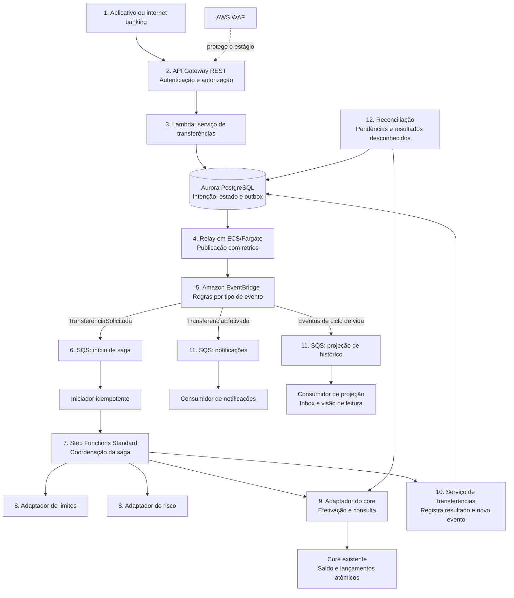
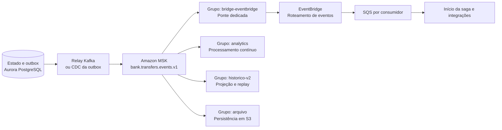
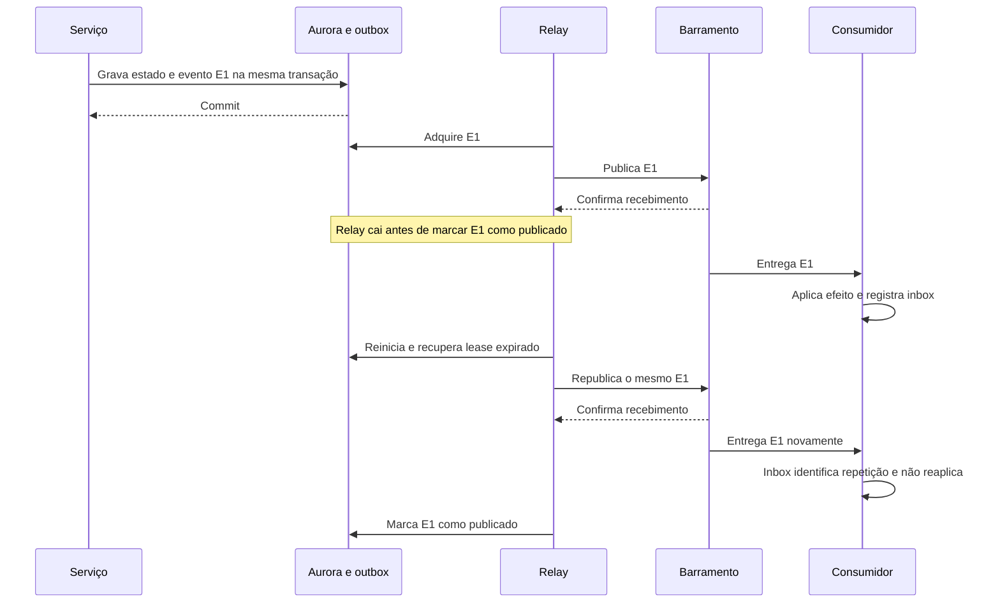
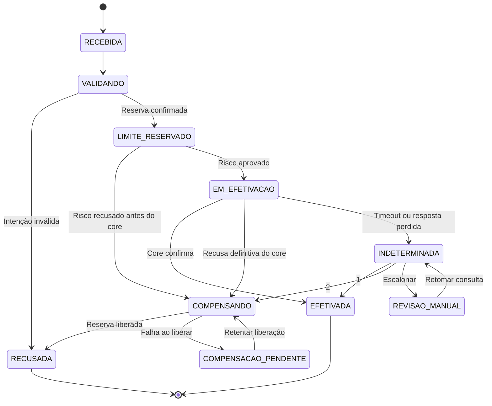
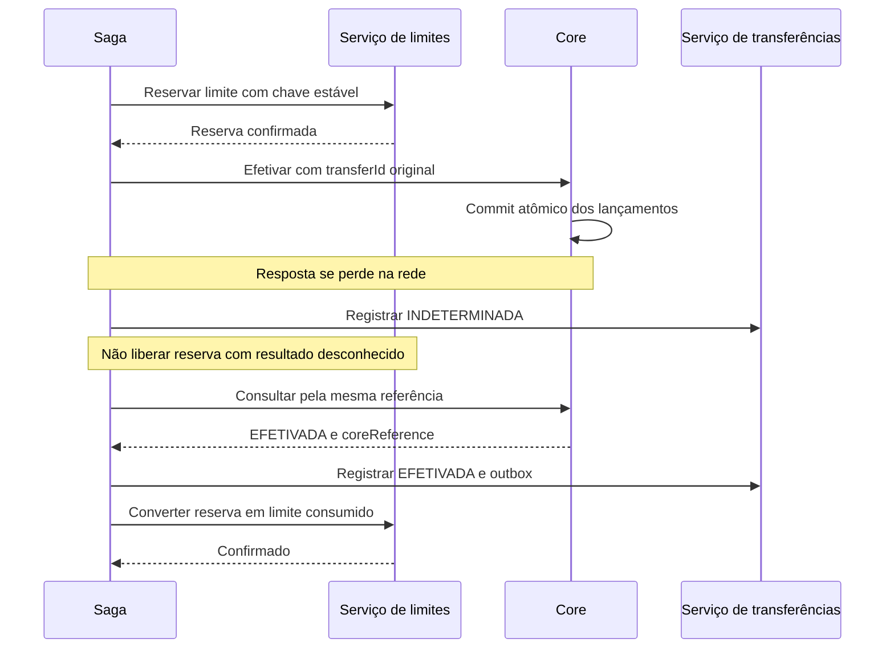
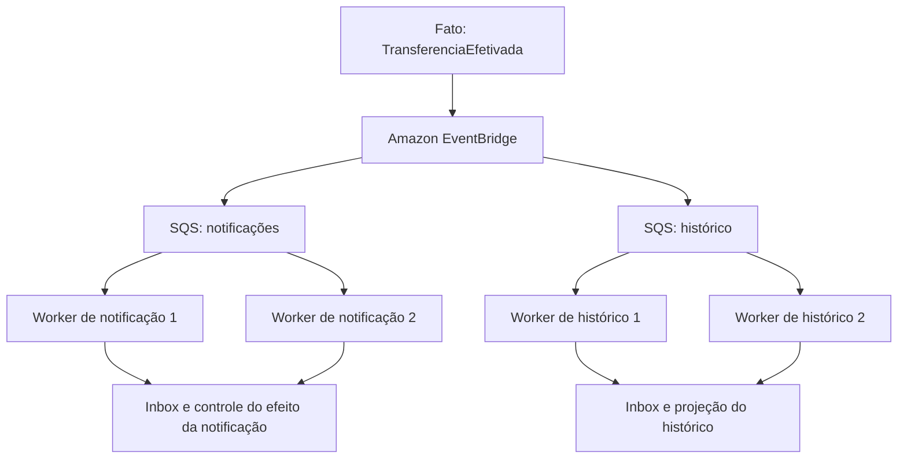
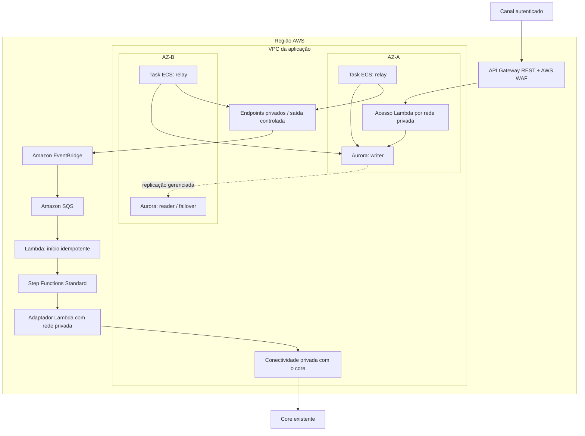
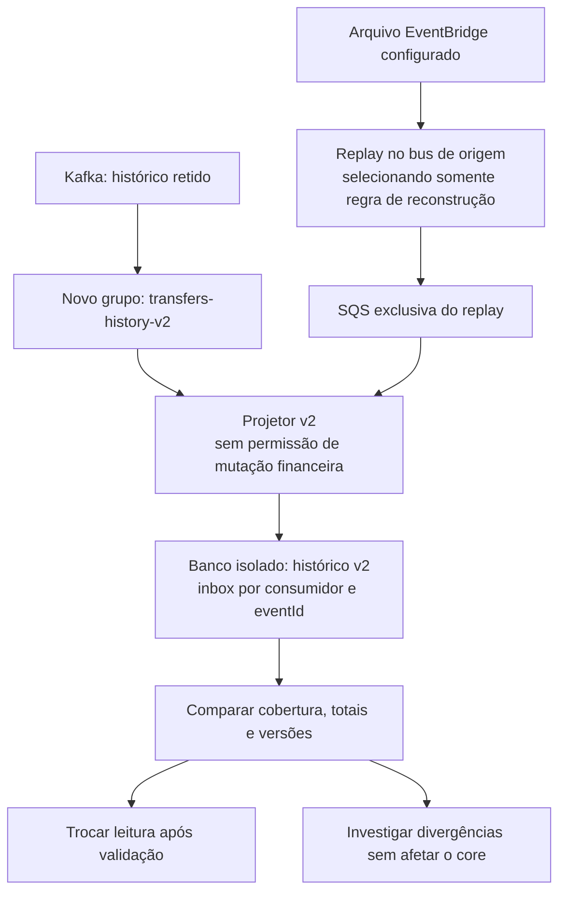

# Case 03 — Banking Event-Driven na AWS

> **Foco:** Amazon MSK, Amazon SQS, Amazon EventBridge, saga, transactional outbox, idempotência e consistência.  
> **Idioma:** português do Brasil. Nomes dos serviços AWS e identificadores de código foram preservados.  
> **Formato:** guia de estudo, decisões arquiteturais e simulação de entrevista.  
> **Referências consultadas em:** 28/09/2026.  
> **Caminho sugerido no repositório:** `cases/03-event-driven-banking.md`.

## Como usar este material

Este case continua os estudos de [processamento de pagamentos e Pix](01-payment-processing-pix.md) e [APIs de Open Finance](02-open-finance-apis.md). A pergunta agora é: **como vários sistemas bancários colaboram sem perder eventos, duplicar efeitos financeiros ou depender de uma cadeia de chamadas síncronas?**

O cenário será uma **transferência entre duas contas do mesmo banco**, com core bancário existente, validação de risco, limite operacional e consumidores independentes. Não estamos implementando o Pix nem substituindo a contabilidade do banco.

Há duas arquiteturas progressivas: uma base com **EventBridge + SQS + Step Functions**, e uma evolução com **MSK como log de distribuição de eventos**. A segunda existe para atender requisitos adicionais de streaming, múltiplos grupos de consumidores e reprocessamento; não para colocar três serviços de mensageria em todo fluxo.

Na primeira leitura, percorra as seções 1 a 7 e a tabela comparativa da seção 10. Depois aprofunde outbox, saga, duplicidade e recuperação. Por último, responda às 30 perguntas sem abrir as respostas.

**Objetivo:** conseguir explicar onde a operação fica durável, quem decide se houve movimentação financeira, quem repete o trabalho e o que acontece quando a confirmação se perde.

As metas, nomes de eventos e contratos são didáticos. Este documento não é uma arquitetura oficial AWS, uma implementação bancária homologada ou uma rubrica oficial de entrevista. L5 é o alvo de preparação informado. O laboratório utiliza dados e dinheiro fictícios; não execute os exercícios contra um core real.

---

## Sumário

1. [Problema de negócio e escopo](#s01)
2. [Vocabulário e modelo mental](#s02)
3. [Perguntas antes de desenhar](#s03)
4. [Requisitos, premissas e invariantes](#s04)
5. [Decisões da arquitetura-base](#s05)
6. [Arquiteturas em Mermaid](#s06)
7. [Fluxo explicado em 12 etapas](#s07)
8. [Contratos, outbox, inbox e idempotência](#s08)
9. [Saga, compensações e resultado desconhecido](#s09)
10. [EventBridge, SQS e MSK em profundidade](#s10)
11. [Papel e posicionamento dos serviços](#s11)
12. [Trade-offs que precisam ser defendidos](#s12)
13. [Rede, sub-redes e integração com o core](#s13)
14. [Segurança e governança dos eventos](#s14)
15. [Alta disponibilidade, recuperação regional e replay](#s15)
16. [Desempenho, capacidade e custos](#s16)
17. [Observabilidade, operação e implantação](#s17)
18. [Aplicação dos seis pilares Well-Architected](#s18)
19. [Roteiro de laboratório e testes](#s19)
20. [30 perguntas de entrevista com respostas comentadas](#s20)
21. [Apresentação da solução e simulação de 45 minutos](#s21)
22. [Checklist de domínio](#s22)
23. [Referências e leitura orientada](#s23)

---

<a id="s01"></a>
## 1. Problema de negócio e escopo

### Enunciado inicial

> Um banco quer modernizar a jornada de transferências internas. Atualmente, o aplicativo depende de chamadas encadeadas a cadastro, limites, risco, core, notificações e relatórios. A indisponibilidade de um sistema secundário compromete a jornada inteira. Como desenhar uma solução orientada a eventos na AWS, mantendo integridade financeira, rastreabilidade e capacidade de recuperação?

### Exemplo concreto

Uma cliente solicita transferir **R$ 500,00 da conta A para a conta B**, ambas do mesmo banco. A plataforma precisa verificar a autorização, controlar o limite operacional, avaliar risco, solicitar a efetivação ao core e comunicar o resultado.

Depois da efetivação, notificações, histórico de atendimento e análises precisam ser atualizados. Um problema no envio de e-mail **não pode desfazer a transferência**. Uma pane no serviço de relatórios também não deve impedir que outras solicitações sejam aceitas dentro de uma capacidade de recuperação segura.

### O que vamos construir

Construiremos a **orquestração da jornada e a distribuição de fatos de negócio**. O core existente continua sendo a autoridade sobre saldo disponível, lançamentos e efetivação da transferência.

| Responsabilidade | Dono na proposta |
|---|---|
| Autenticar a pessoa e verificar autorização sobre a conta | Plataforma de identidade e API do banco |
| Registrar intenção, progresso e correlação | Serviço de transferências |
| Reservar, consumir e liberar limite operacional | Serviço de limites |
| Aprovar ou recusar segundo regras de risco | Serviço de risco |
| Validar saldo e efetivar os lançamentos | Core bancário |
| Coordenar etapas e recuperação | Saga orquestrada |
| Entregar fatos a sistemas interessados | Plataforma de eventos |
| Produzir notificações e projeções | Consumidores independentes |

### Uma fronteira que não deve ser quebrada

**Neste cenário, o core efetiva débito e crédito como uma única operação financeira atômica.** É uma premissa contratual que precisa ser verificada, não uma propriedade obtida por usar AWS.

Não vamos criar um microserviço que debita A e outro que credita B e declarar que “a saga garante que o dinheiro nunca desaparece”. Se os lançamentos estiverem em domínios contábeis distintos, será necessário outro desenho, com contas de trânsito, reservas, regras de liquidação, tratamento de diferenças e validação pelos responsáveis pelo core.

A saga apresentada coordena serviços ao redor dessa fronteira. A distinção entre transações locais e coordenação distribuída é essencial: uma saga não fornece o isolamento de uma transação ACID global. [Fontes: saga][r05], [isolamento transacional][r30]

### Fora do núcleo

Não implementaremos integração direta com SPI, mensageria de bandeiras, algoritmos de risco, um ledger completo ou criptografia especializada de pagamentos. Também não adotaremos event sourcing como requisito: **publicar eventos sobre um banco de estado atual não transforma o sistema em event-sourced**. [Fonte: event sourcing][r45]

---

<a id="s02"></a>
## 2. Vocabulário e modelo mental

### Comando, evento e consulta

**Comando:** pedido para realizar algo. `EfetivarTransferencia` pode ser aceito ou recusado. Deve existir um responsável pela decisão.

**Evento:** fato que já ocorreu. `TransferenciaEfetivada` informa uma mudança confirmada; não pede que qualquer consumidor debite novamente a conta.

**Consulta:** leitura de uma informação. `ConsultarTransferencia` não deve provocar movimentação financeira.

Um evento pode disparar trabalho: `TransferenciaSolicitada` significa que registramos uma intenção, e a saga reage a esse fato. Isso não torna a solicitação equivalente à efetivação.

| Termo | Significado no case |
|---|---|
| EDA | Arquitetura orientada a eventos: componentes reagem a fatos publicados por outros componentes. |
| Produtor / consumidor | Quem publica / quem processa uma mensagem. |
| Broker | Componente de infraestrutura que recebe e disponibiliza mensagens. |
| Barramento de eventos | Roteia eventos para os interessados segundo regras. |
| Fila de trabalho | Mantém itens pendentes para trabalhadores de uma mesma responsabilidade. |
| Stream / log | Sequência retida de registros que diferentes consumidores podem percorrer. |
| Tópico / partição | No Kafka, categoria de registros / unidade de ordenação e distribuição. |
| Consumer group | Grupo de consumidores Kafka que divide o trabalho de leitura das partições. |
| Offset | Posição dentro de uma partição Kafka; não é um número global do banco. |
| Aggregate / agregado | Entidade cuja evolução precisa ser coordenada; aqui, uma transferência. |
| Saga | Coordenação de etapas com transações locais, recuperação e compensações de negócio. |
| Outbox | Registro do evento pendente gravado atomicamente com a mudança de negócio. |
| Relay | Publicador que lê a outbox e entrega os eventos ao transporte. |
| Inbox | Registro de mensagens já aplicadas por um consumidor. |
| Idempotência | Repetir uma operação identificada não repete seu efeito de negócio. |
| At-least-once | A arquitetura admite repetição de entrega; o consumidor precisa lidar com isso. |
| DLQ | Fila de falhas persistentes, que exige diagnóstico e recuperação. |
| Backpressure | Controle para não aceitar ou processar mais trabalho que uma dependência suporta. |
| Replay | Releitura de fatos históricos para reconstrução ou análise controlada. |
| CDC | Captura de alterações de um banco, por exemplo a partir de seu log. |
| Projeção | Visão derivada para consulta, como um histórico de transferências. |
| Ledger | Registro contábil autoritativo de lançamentos; não é sinônimo de tópico Kafka. |
| RTO / RPO | Tempo-alvo de recuperação / perda de dados admissível expressa em tempo. |

As diferenças operacionais entre filas, roteamento e logs são detalhadas nas documentações de SQS, EventBridge e Kafka. [Fontes: SQS][r07], [EventBridge][r01], [Kafka][r16]

### Três analogias úteis, com limites

**SQS é uma fila de tarefas:** trabalhadores retiram trabalho, processam e confirmam. Colocar três sistemas diferentes na mesma fila não faz todos receberem uma cópia.

**EventBridge é um distribuidor por interesse:** uma regra envia `TransferenciaEfetivada` à fila de notificações, outra à fila de projeções. O distribuidor não decide se o saldo era suficiente.

**MSK é um log compartilhado:** cada grupo de consumidores acompanha sua posição. Ler um registro não o remove para os outros grupos.

As analogias não substituem os contratos de entrega. **Nenhum desses serviços, sozinho, prova que um efeito externo ocorreu exatamente uma vez.**

---

<a id="s03"></a>
## 3. Perguntas antes de desenhar

Uma boa abertura seria:

> “Quero separar o que exige uma decisão imediata, o que pode convergir depois e quem é a autoridade financeira. Também preciso entender como o core identifica uma operação repetida e como consultamos uma transferência cujo resultado se perdeu.”

| Pergunta | Impacto na proposta |
|---|---|
| São transferências internas, Pix, TED ou uma jornada de crédito? | Muda a fronteira de efetivação e o significado de compensação. |
| O core faz débito e crédito atomicamente? | Define o que fica fora da saga e quais garantias precisam existir no core. |
| O core aceita referência idempotente e consulta por essa referência? | Determina a recuperação após timeout. |
| O cliente aceita `202 Accepted` e acompanhamento posterior? | Permite retirar a orquestração da conexão HTTP inicial. |
| O que significa “concluída” para o cliente? | Evita confundir aceitação, efetivação e notificação. |
| Qual o volume médio, pico e duração do pico? | Orienta capacidade do core, filas, banco e quotas. |
| Qual o prazo máximo para uma transferência pendente? | Define deadlines, alarmes e política de admissão. |
| A ordem precisa ser por transferência, conta ou global? | Muda particionamento, throughput e dependências. |
| Quantos consumidores existem e quais precisam de cópia própria? | Diferencia competição por trabalho de fan-out. |
| Quem precisa reler o passado e por quanto tempo? | Pode justificar MSK, arquivos ou projeções reconstruíveis. |
| Já existe plataforma Kafka e equipe que a opera? | Evita criar um cluster apenas porque “é um banco”. |
| Que ações podem ser compensadas e quais são irreversíveis? | Determina o fluxo da saga e os pontos de reconciliação. |
| Como reservas de limite expiram? | Expõe a corrida entre expiração e efetivação tardia. |
| Quais consumidores podem ficar atrasados sem bloquear o dinheiro? | Define desacoplamento real e prioridades. |
| Há transações em andamento durante failover regional? | Exige controle de propriedade e bloqueio da região antiga. |
| Que dados pessoais entram nos eventos e quem pode publicá-los? | Muda contratos, acesso, retenção e minimização. |
| Quem trata DLQs e divergências fora do horário comercial? | Define se a arquitetura é operacionalmente sustentável. |

Não faça um interrogatório de 20 minutos. Comece por **fronteira financeira, resposta síncrona/assíncrona, duplicidade, escala e recuperação**.

---

<a id="s04"></a>
## 4. Requisitos, premissas e invariantes

### Premissas didáticas

| Categoria | Hipótese para o exercício |
|---|---|
| Região inicial | `sa-east-1`; disponibilidade dos recursos e quotas será verificada antes do laboratório. |
| Escala | 100 transferências/s em média e 500/s no pico; não é uma capacidade já testada. |
| Eventos | Estimativa inicial de 6 eventos de ciclo de vida por transferência, a medir. |
| Resposta inicial | `202` após intenção e outbox duráveis; meta ilustrativa de p95 até 300 ms. |
| Conclusão | Meta ilustrativa de p95 até 5 s em condições normais; pendências têm prazo e tratamento próprios. |
| API | SLO ilustrativo de 99,95%, com definição explícita de respostas válidas. |
| Core | Oferece efetivação atômica, referência única e consulta autoritativa de resultado. |
| Risco | Pode aprovar, recusar ou ficar tecnicamente indisponível. Indisponibilidade não vira aprovação. |
| Limites | Reserva operacional idempotente, com consumo/liberação condicionais. |
| Disponibilidade | Base Multi-AZ; recuperação regional é uma decisão separada. |
| Dados | Valores inteiros em centavos, moeda explícita e identificadores de conta minimizados. |
| Ordenação | Por transferência quando necessário; nenhuma ordem global de todos os clientes. |
| Replay | Destinado inicialmente a projeções e análises, não à repetição de movimentações. |

O objetivo de aceitação não substitui o objetivo de conclusão. Uma API que responde `202` rapidamente e acumula transferências por horas **não está entregando o serviço esperado**.

### Invariantes a defender

1. Uma intenção identificada não pode causar duas efetivações no core.
2. Não existe evento `TransferenciaEfetivada` sem evidência durável do core.
3. Toda mudança local que exige publicação registra essa intenção na mesma transação.
4. Timeout de uma chamada mutável significa resultado potencialmente desconhecido.
5. Consumidor secundário indisponível não provoca reversão financeira automática.
6. Uma reserva incerta não é liberada apenas porque um timer expirou.
7. A mesma mensagem não repete o mesmo efeito local no consumidor.
8. Replay não tem permissão para executar novamente comandos financeiros.
9. A recuperação mantém a referência da operação original, inclusive após troca de Região.

Essas são regras da nossa proposta. As ferramentas serão escolhidas para sustentá-las; a existência de uma fila não as implementa por si só.

---

<a id="s05"></a>
## 5. Decisões da arquitetura-base

### Base: reduzir a complexidade inicial

**API Gateway REST regional → Lambda do serviço de transferências → Aurora PostgreSQL com outbox → relay → EventBridge → SQS → consumidores.**

Uma fila de início alimenta um iniciador idempotente de **Step Functions Standard**, que coordena limites, risco e integração com o core. Os adaptadores podem ser Lambda quando a integração for compatível; conexões persistentes ou bibliotecas específicas podem justificar ECS/Fargate.

Não existe obrigação de manter o ALB do Case 01: aqui escolhemos integração direta com Lambda. REST API permite associação com WAF; HTTP API é alternativa a comparar segundo os recursos realmente necessários. [Fonte: comparação de APIs][r49]

### Escolhas centrais

| Decisão | Motivo | Limite da escolha |
|---|---|---|
| Aurora PostgreSQL para estado e outbox | Evidencia a transação local e permite consultas operacionais. | Não vira o ledger do banco; exige capacidade, conexões e manutenção. |
| Relay em ECS/Fargate | Processo contínuo de leitura em lotes, com controle de lease e retries. | O código do relay continua sendo responsabilidade da equipe. |
| EventBridge | Encaminhar fatos por tipo/origem sem conhecer cada consumidor. | Não é uma fila por consumidor nem coordenador de transações. |
| SQS Standard por consumidor | Retenção de trabalho e isolamento de velocidade/falhas. | Duplicidade e desordem precisam ser toleradas. |
| Step Functions Standard | Coordenação explícita com etapas, esperas e caminhos de recuperação. | Não faz rollback de bancos e APIs externos. |
| Core existente | Preservar a autoridade financeira e as regras de saldo. | Seu contrato precisa ser suficiente para recuperar incerteza. |
| Projeções independentes | Separar leitura secundária da operação principal. | Podem estar atrasadas; nunca autorizam saldo por conta própria. |

A escolha de Aurora não invalida DynamoDB. `TransactWriteItems` também pode gravar estado e outbox atomicamente dentro de seu escopo. O padrão depende da atomicidade local, não de um produto específico. [Fontes: transações PostgreSQL][r29], [transações DynamoDB][r26]

### Evolução: quando incluir MSK

Na segunda arquitetura, o relay publica primeiro em **Amazon MSK**. Consumidores de streaming leem o tópico diretamente; uma ponte dedicada encaminha os eventos necessários ao EventBridge. O restante da distribuição para SQS e para a saga permanece.

O motivo deve ser concreto: diversos grupos precisam de offsets independentes, releitura frequente, processamento contínuo ou integração com uma plataforma Kafka já existente.

**Não faremos a aplicação gravar Aurora, publicar em Kafka e publicar em EventBridge como três operações independentes.** Isso recriaria o problema que a outbox deveria resolver.

---

<a id="s06"></a>
## 6. Arquiteturas em Mermaid

Os diagramas são lógicos. Serviços regionais não estão necessariamente dentro da VPC. Setas mostram integração, e não uma promessa de atomicidade entre os componentes.

### 6.1 Arquitetura-base



**Leitura:** há um ciclo intencional de evolução do domínio: o serviço grava estado, publica o fato e etapas posteriores produzem novos fatos. Regras por tipo evitam que um evento de conclusão reinicie a saga.

As filas têm DLQs próprias, omitidas aqui para legibilidade. Existe também DLQ de entrega do EventBridge aos alvos, que não é a mesma coisa que a DLQ de processamento do consumidor.

### 6.2 Evolução com MSK



Esta evolução **substitui o destino inicial do relay**. Não é uma segunda publicação não coordenada da aplicação. Uma migração entre os caminhos exige controle de corte e deduplicação por `eventId`.

O relay pode ser um produtor Kafka controlado pela equipe. CDC da tabela outbox, por exemplo com Debezium, é uma alternativa: captura-se uma estrutura de eventos de domínio, em vez de expor indiscriminadamente todas as tabelas do core. MSK Connect pode hospedar conectores compatíveis, mas configuração, permissões e compatibilidade do plugin continuam exigindo validação. [Fontes: Debezium][r31], [MSK Connect][r32]

---

<a id="s07"></a>
## 7. Fluxo explicado em 12 etapas

### 1. A pessoa solicita uma transferência

O canal envia origem, destino, valor e uma chave de idempotência. Exemplo didático:

```http
POST /transferencias
Authorization: Bearer <token-do-banco>
Idempotency-Key: req-7e7f82
Content-Type: application/json
```

```json
{
  "sourceAccountId": "acc-origem-01",
  "destinationAccountId": "acc-destino-02",
  "amountMinor": 50000,
  "currency": "BRL"
}
```

`50000` representa R$ 500,00 neste contrato. A origem precisa pertencer ao contexto autorizado; não basta aceitar o `accountId` enviado.

### 2. A entrada aplica controles

API Gateway valida o contrato e integra a autenticação com a identidade do banco. WAF ajuda a bloquear padrões maliciosos e abuso; não decide se a pessoa pode movimentar a conta.

Defina limites de admissão considerando o backlog e o core, não apenas a capacidade de aceitar HTTP. O cliente precisa saber quando a plataforma está temporariamente indisponível, em vez de receber uma promessa que não poderá ser cumprida.

### 3. Intenção e outbox são gravadas juntas

O serviço abre uma transação no Aurora, registra a intenção `RECEBIDA` e o evento `TransferenciaSolicitada`, e confirma a transação. A chave é única por solicitante/contexto, e a requisição normalizada tem um hash para detectar reuso conflitante.

Somente após o commit retorna `202 Accepted` com `transferId` e um endpoint de consulta. Se houver timeout da API após o commit, a repetição com a mesma chave recupera a mesma transferência.

**`202` significa que assumimos responsabilidade por acompanhar a intenção; não que o dinheiro foi transferido.**

### 4. O relay publica o evento pendente

O relay lê registros elegíveis da outbox, adquire uma posse temporária de processamento e publica. Na base, o destino é EventBridge; na evolução, MSK.

O registro só é marcado como publicado após confirmação positiva do destino. Uma confirmação perdida pode gerar nova publicação; o `eventId` continua igual. A outbox resolve a janela entre mudança local e intenção de publicação, mas não elimina todas as duplicidades. [Fontes: outbox AWS][r03], [outbox — definição do padrão][r04]

### 5. O EventBridge roteia por interesse

A regra de `TransferenciaSolicitada` envia à fila de início. Regras distintas tratam eventos de conclusão, recusa e pendência. É necessário testar padrões, permissões e recebimento real: um evento publicado sem regra correspondente não se torna automaticamente um incidente detectado.

Na evolução MSK, uma ponte faz essa publicação depois de ler o tópico. O sucesso no Kafka e o sucesso no EventBridge são confirmações diferentes.

### 6. A fila desacopla o início da saga

O iniciador recebe a mensagem da SQS, valida sua origem lógica, consulta a intenção e chama Step Functions com nome determinístico e entrada canônica. Retentativas não devem criar novas gerações de workflow por acidente.

Confirme o processamento da mensagem somente após confirmar que a execução correta começou ou já existe. O iniciador precisa recuperar falhas entre `StartExecution` e o registro local, não gravar “concluído” antes de iniciar.

A idempotência de `StartExecution` em Standard tem condições de nome, entrada e estado da execução; ela não substitui um registro de negócio durável. [Fonte: StartExecution][r23]

### 7. A saga verifica se pode prosseguir

O primeiro passo lê o estado atual e verifica proprietário/generation do workflow. Transferência já efetivada não deve voltar ao início. Uma execução de recuperação não compete silenciosamente com a original.

O workflow coordena as etapas, mas cada serviço continua verificando idempotência e precondições locais. Isso protege contra retries, interrupções e intervenções operacionais.

### 8. Limite é reservado e risco é avaliado

O serviço de limites reserva uma parcela do **limite operacional**, não debita o saldo. A reserva é identificada pela transferência e executada de forma atômica no próprio serviço. O serviço de risco retorna aprovação, recusa ou falha técnica.

Se houver recusa definitiva antes da efetivação, a saga libera a reserva. Se o serviço de risco estiver indisponível, aplica a política de espera, deadline e encerramento seguro; não converte erro técnico em aprovação.

### 9. O core recebe a ordem financeira

O adaptador envia `EfetivarTransferencia` com uma referência estável. O core valida saldo e regras aplicáveis e efetiva os lançamentos de forma atômica conforme a premissa.

Uma resposta definitiva negativa segue para liberação do limite. Um resultado positivo segue para finalização. **Um timeout segue para consulta/reconciliação, não para um débito novo nem para liberação automática da reserva.**

### 10. Resultado financeiro e evento são registrados

Confirmada a efetivação, o serviço registra a referência do core e `EFETIVADA`, junto com `TransferenciaEfetivada`, na mesma transação local. A saga confirma o consumo da reserva de limite, com retry idempotente.

Se a atualização de limite falhar, a transferência **continua financeiramente efetivada**. A reserva permanece protegendo a capacidade até convergir para consumida. O progresso da saga pode indicar `AJUSTE_LIMITE_PENDENTE`; isso não reclassifica a movimentação como recusada.

### 11. Consumidores independentes aplicam seus efeitos

Notificações e histórico recebem suas próprias cópias em filas distintas. Uma notificação repetida não deve gerar spam; uma projeção repetida não soma o mesmo valor duas vezes.

O consumidor grava sua inbox e a alteração local atomicamente quando ambos estão no mesmo banco. Uma chamada externa, como envio de SMS, exige deduplicação no provedor ou um contrato adicional; a inbox isolada não torna banco e provedor uma única transação.

### 12. A reconciliação fecha o ciclo

Um processo periódico e acionável busca operações antigas, divergências, publicações paradas e reservas pendentes. Consulta o core por referência e encaminha cada caso para recuperação automática segura ou análise humana.

O canal consulta o estado autorizado da transferência. Uma projeção de histórico pode mostrar defasagem; a confirmação financeira precisa se apoiar na fonte apropriada.

**Resumo das etapas:** aceitar com durabilidade → publicar sem janela silenciosa → coordenar → confirmar no core → distribuir fatos → reconciliar exceções.

---

<a id="s08"></a>
## 8. Contratos, outbox, inbox e idempotência

### 8.1 Um evento precisa de identidade própria

Exemplo de **envelope de domínio**, antes de ser colocado no campo `detail` do EventBridge:

```json
{
  "eventId": "0a0bbd5f-4c62-48de-9b42-49e3cda01165",
  "eventType": "TransferenciaEfetivada",
  "schemaVersion": 1,
  "aggregateType": "Transferencia",
  "aggregateId": "2b75c1e3-a5cd-41fe-bcb5-f7945c0e8be8",
  "aggregateVersion": 6,
  "occurredAt": "2026-09-28T14:05:01.250Z",
  "producer": "transfer-service",
  "correlationId": "2b75c1e3-a5cd-41fe-bcb5-f7945c0e8be8",
  "causationId": "cmd-efetivar-2b75c1e3-a5cd-41fe-bcb5-f7945c0e8be8",
  "data": {
    "amountMinor": 50000,
    "currency": "BRL",
    "sourceAccountRef": "acc-ref-01",
    "destinationAccountRef": "acc-ref-02",
    "coreReference": "core-ref-7712",
    "financialStatus": "EFETIVADA"
  }
}
```

Os valores são fictícios. O evento evita CPF, nome completo, credenciais e saldo detalhado desnecessário. Os identificadores minimizados ainda precisam de proteção e classificação.

| Campo | Por que existe |
|---|---|
| `eventId` | Identifica o mesmo fato em retentativas e transportes diferentes. |
| `aggregateId` | Agrupa a evolução da mesma transferência. |
| `aggregateVersion` | Ajuda a detectar regressão, concorrência ou lacunas conforme o contrato. |
| `schemaVersion` | Identifica o formato; não é a versão da transferência. |
| `correlationId` | Liga toda a jornada operacional. |
| `causationId` | Explica qual comando/evento provocou esse fato. |
| `occurredAt` | Momento do fato segundo o produtor; não prova ordenação global. |

O ID gerado pelo transporte não substitui `eventId`. Uma republicação ao EventBridge pode receber outro ID de infraestrutura. O consumidor deve usar a identidade de domínio preservada. [Fonte: PutEvents][r12]

**Contrato importa mais que nome bonito:** documente dono, significado, momento de emissão, consumidores, campos sensíveis, retenção, ordenação exigida e política de evolução.

### 8.2 O problema de duas escritas

Imagine este código conceitual:

```text
1. UPDATE transferencia SET status = 'EFETIVADA'
2. publicar TransferenciaEfetivada
```

Se o processo morrer entre 1 e 2, o banco sabe do resultado e os consumidores não. Inverter as linhas cria outro risco: publicar um fato que depois não é confirmado no banco.

Na outbox, a transação local inclui a atualização **e o registro do evento a publicar**. O envio externo ocorre depois. Essa é a mudança essencial; não existe um commit mágico que inclua Aurora e EventBridge. [Fontes: padrão AWS][r03], [padrão transactional outbox][r04]

### 8.3 Estrutura mínima de persistência

Modelo ilustrativo PostgreSQL, não um sistema bancário completo:

```sql
CREATE TABLE transfers (
    transfer_id UUID PRIMARY KEY,
    requester_id TEXT NOT NULL,
    request_key TEXT NOT NULL,
    request_hash TEXT NOT NULL,
    amount_minor BIGINT NOT NULL CHECK (amount_minor > 0),
    currency CHAR(3) NOT NULL,
    status TEXT NOT NULL,
    version BIGINT NOT NULL DEFAULT 1,
    workflow_generation INTEGER NOT NULL DEFAULT 0,
    core_reference TEXT,
    created_at TIMESTAMPTZ NOT NULL DEFAULT now(),
    updated_at TIMESTAMPTZ NOT NULL DEFAULT now(),
    UNIQUE (requester_id, request_key)
);

CREATE TABLE outbox_events (
    event_id UUID PRIMARY KEY,
    aggregate_id UUID NOT NULL REFERENCES transfers(transfer_id),
    aggregate_version BIGINT NOT NULL,
    event_type TEXT NOT NULL,
    schema_version INTEGER NOT NULL,
    payload JSONB NOT NULL,
    occurred_at TIMESTAMPTZ NOT NULL DEFAULT now(),
    published_at TIMESTAMPTZ,
    lease_token UUID,
    lease_until TIMESTAMPTZ,
    attempts INTEGER NOT NULL DEFAULT 0,
    UNIQUE (aggregate_id, aggregate_version, event_type)
);

CREATE INDEX outbox_pending_idx
    ON outbox_events (occurred_at)
    WHERE published_at IS NULL;
```

Cada serviço possui seus dados. O consumidor de histórico não deve atualizar diretamente `transfers`; ele mantém sua própria projeção. Também faltam aqui colunas e constraints de um produto real, como referências de contas e regras completas de estado.

### 8.4 Atualização condicional e evento na mesma transação

Exemplo parametrizado para PostgreSQL; `$1` a `$5` são parâmetros fornecidos pelo driver. A aplicação deve validar que existe evidência do core e que a transição é permitida **antes** de tentar a atualização.

```sql
BEGIN;

WITH changed AS (
    UPDATE transfers
       SET status = 'EFETIVADA',
           core_reference = $3,
           version = version + 1,
           updated_at = now()
     WHERE transfer_id = $1
       AND version = $2
       AND status IN ('EM_EFETIVACAO', 'INDETERMINADA')
    RETURNING transfer_id, version, core_reference
)
INSERT INTO outbox_events (
    event_id, aggregate_id, aggregate_version,
    event_type, schema_version, payload
)
SELECT $4::uuid, transfer_id, version,
       'TransferenciaEfetivada', 1,
       jsonb_build_object(
           'eventId', $4::uuid,
           'aggregateId', transfer_id,
           'aggregateVersion', version,
           'coreReference', core_reference,
           'correlationId', $5::text
       )
  FROM changed;

COMMIT;
```

O payload do SQL está reduzido para evidenciar a atomicidade. Antes da publicação, o serviço/relay precisa montar e validar o envelope completo da seção 8.1, incluindo todos os campos contratados; não publicar este fragmento como se fosse o contrato completo.

Se a versão não corresponder, nenhuma linha será alterada e nenhum evento será inserido. O código precisa tratar esse resultado: reler o estado e decidir se houve concorrência, repetição ou conflito. **Zero linhas atualizadas não significa automaticamente sucesso.**

O `event_id` desta transição deve ser recuperável em uma repetição. Depois de um commit cujo resultado se perdeu, consulte a mudança existente; não crie outro fato apenas porque uma nova tentativa gerou outro UUID.

Transações e controles concorrentes devem ser escolhidos segundo as invariantes. “Usar PostgreSQL” não torna um `SELECT` seguido de `UPDATE` concorrente automaticamente seguro. [Fontes: transações][r29], [isolamento][r30]

### 8.5 Como o relay trabalha sem prender o banco

A proposta de implementação é:

1. Em transação curta, selecionar um lote pendente, adquirir `lease_token` e `lease_until` e confirmar.
2. Fora dessa transação, publicar e aguardar confirmação por item.
3. Em nova transação curta, marcar o item confirmado, somente se o token ainda for o mesmo.
4. Repetir erros transitórios com backoff e jitter; isolar erros permanentes com evidência e alarme.
5. Recuperar leases expirados após queda do trabalhador.

`FOR UPDATE SKIP LOCKED` pode ajudar a distribuir registros entre trabalhadores. Entretanto, ele permite pular linhas ocupadas; **não garante a ordem por agregado**. Para uma sequência estrita, coordene a publicação por agregado/partição e bloqueie a versão seguinte enquanto uma anterior estiver pendente. [Fonte: PostgreSQL SELECT][r28]

Não mantenha uma transação de banco aberta esperando a rede responder. Isso aumenta retenção de locks e pressão de conexões. Um lease também não elimina publicações tardias de um processo antigo: duplicidade continua prevista no contrato.

### 8.6 Falha depois de publicar, antes de marcar



O desenho não evita a segunda entrega: ele evita que a segunda entrega provoque um segundo efeito local.

### 8.7 Confirmação por item e recuperação de publicação

Em `PutEvents`, um lote pode conter sucesso e falha. O relay examina o resultado de cada entrada, preserva os eventos não confirmados e repete apenas os casos necessários. Em timeout de toda a chamada, o resultado de alguns itens pode ser desconhecido; repetir com os mesmos IDs é a estratégia prevista.

Há um detalhe importante: a documentação registra que publicar em um barramento inexistente pode retornar HTTP 200 sem reportar os eventos como falhos. Portanto, além de validar respostas, o laboratório deve testar a existência do destino e um caminho completo de entrega com evento sentinela. [Fonte: PutEvents][r12]

`published_at` representa confirmação do **transporte escolhido**, não conclusão de todos os consumidores. A outbox continua precisando de retenção operacional, auditoria do relay e detecção de atrasos.

### 8.8 Inbox: o outro lado da confiabilidade

Para uma projeção local, use uma chave como `(consumer_name, event_id)` e grave, na mesma transação do consumidor, a inbox e a mudança da projeção.

```text
BEGIN
    tentar inserir ("historico-v1", eventId) na inbox
    se já existir: retornar sem reaplicar
    validar a versão e a política para eventos fora de ordem
    atualizar a projeção
COMMIT
confirmar a mensagem na fila ou avançar o offset
```

Se a validação ou a atualização falhar, toda a transação é revertida, inclusive a inbox. Se o commit ocorrer e a confirmação da mensagem se perder, a repetição encontra a inbox e não repete a alteração.

**Efeito externo exige outro contrato:** marcar a inbox antes de enviar SMS pode perder a mensagem; marcar depois pode reenviar. Use uma intenção local durável de notificação, uma chave idempotente aceita pelo provedor e reconciliação quando suportadas. Não prometa eliminação absoluta de duplicidade se o provedor não oferece os mecanismos necessários.

### 8.9 Idempotência em quatro fronteiras

| Fronteira | Identificador proposto | Proteção necessária |
|---|---|---|
| Cliente → API | Contexto autenticado + chave + hash da intenção | Unicidade atômica, autorização e resposta estável. |
| Publicador → transporte | `eventId` | Preservar a identidade em toda republicação. |
| Mensagem → consumidor | Consumidor + `eventId` | Inbox e efeito local atômicos. |
| Saga → core/limites | Transferência + nome da operação | Deduplicação persistente no responsável pelo efeito. |

O período de retenção precisa cobrir retries, atrasos, replay autorizado e recuperação. Não use o TTL de um cache como única barreira para repetir uma operação financeira antiga. [Fonte: APIs idempotentes][r42]

---

<a id="s09"></a>
## 9. Saga, compensações e resultado desconhecido

### 9.1 O que a saga resolve — e o que não resolve

A saga coordena a convergência de uma jornada composta de transações locais. Ela precisa saber quais passos ocorreram, o que pode ser repetido, o que deve ser compensado e o que exige seguir adiante até completar.

**Outbox resolve publicação ligada a uma mudança local. Saga resolve coordenação entre responsabilidades. Inbox resolve reaplicação de um fato no consumidor.** Um padrão não substitui os outros.

A proposta usa orquestração porque a jornada tem deadlines, resultado desconhecido e compensações que precisam ser visíveis. Em uma coreografia, essa lógica ficaria distribuída nos participantes. Coreografia pode funcionar, mas dependências e caminhos de erro ficam mais difíceis de acompanhar à medida que a jornada cresce. [Fontes: saga orquestrada][r05], [saga coreografada][r06]

### 9.2 Etapas e tratamento de falhas

| Etapa | Efeito | Falha antes de confirmar | Recuperação após efeito confirmado |
|---|---|---|---|
| Validar intenção | Verificação de contexto e estado | Rejeitar ou retentar leitura. | Não há compensação financeira. |
| Reservar limite | Ocupa limite operacional | Consultar por chave se o resultado for incerto. | Liberar se a transferência não será executada. |
| Avaliar risco | Decisão referenciada | Esperar ou encerrar conforme deadline. | Recusa definitiva permite liberar limite antes do core. |
| Efetivar no core | Movimenta dinheiro | Timeout exige consulta; não assumir falha. | Não desfazer porque outra etapa falhou. |
| Registrar resultado/evento | Atualiza nossa visão e outbox | Repetir a gravação condicional. | Evento pode ser republicado com o mesmo ID. |
| Consumir reserva | Converte reserva em uso efetivo do limite | Repetir com a mesma referência. | Ajuste é local ao serviço de limites. |
| Notificar | Comunica o fato | Retentar separadamente. | Nunca compensa a transferência. |

Limite operacional e saldo são coisas diferentes. A reserva reduz a capacidade disponível do limite, mas o core ainda valida saldo e efetiva os lançamentos.

### 9.3 Máquina de estados da jornada



**Transição 1:** a consulta autoritativa confirma a efetivação. **Transição 2:** a ausência de efeito é definitiva e a tentativa anterior foi impedida de efetivar tardiamente. Um timeout ou `NOT_FOUND` transitório não autoriza a transição 2.

O diagrama mostra o **estado principal da transferência**. O progresso da saga é outro atributo: uma transferência `EFETIVADA` pode ter `AJUSTE_LIMITE_PENDENTE` ou `NOTIFICACAO_PENDENTE`. Não regrida o estado financeiro para esconder uma falha operacional posterior.

### 9.4 Uma compensação não é um rollback de banco

Liberar uma reserva de limite é uma **nova operação**, com sua própria transação, chave idempotente e chance de falhar. Não apaga a história da reserva original.

Uma reversão financeira, quando o produto permite, também é uma nova operação autorizada, referenciada e auditável. Não deve ser disparada porque analytics ficou indisponível ou porque um workflow atingiu timeout.

A regra didática é: **antes da efetivação confirmada, compensar preparações quando for seguro; depois da efetivação, priorizar completar os registros e efeitos necessários**.

### 9.5 Timeout não autoriza compensação cega



Uma consulta que retorna “não encontrado” pode significar atraso ou processamento em andamento. Para concluir “não será efetivada”, precisamos do contrato do core: status terminal, cancelamento confirmado ou uma barreira que impeça uma tentativa antiga de efetivar depois.

Um timeout do Step Functions também não prova que o código externo parou. Uma função ou requisição iniciada antes do timeout pode ainda concluir. Por isso, deadlines, cancelamento e tokens de geração precisam ser verificados pelo sistema que aplica o efeito, e não apenas pela tela do orquestrador.

### 9.6 Reservas e concorrência

Duas transferências podem disputar o último R$ 500 de limite disponível. Fazer `GET limite`, calcular e depois atualizar sem proteção permite ultrapassar o limite. O serviço de limites precisa usar atualização condicional, lock apropriado ou transação serializável, com tratamento de conflito.

A reserva também não pode expirar e liberar capacidade enquanto uma efetivação está indeterminada. A política deve prever renovação/controladoria da reserva, estado pendente protegido e escalonamento. **Expiração técnica de um registro não é evidência de cancelamento financeiro.**

### 9.7 Por que Step Functions Standard?

Usamos Standard como coordenador durável, com histórico de execução e possibilidade de esperas/recuperação mais longas. Express atende outros perfis de volume e duração, mas não é intercambiável sem revisar semântica e custo. [Fonte: tipos de workflow][r22]

A expressão “exactly-once” na documentação de Standard descreve o modelo de execução do serviço. Ela **não inclui atomicamente** o banco do core, um SMS e a transação no Aurora. Retries explícitos, chamadas cujo retorno se perdeu e duplicação de entrada ainda exigem idempotência.

Para não criar dois workflows:

- Nome proposto: `trf-<identificador>-g0`, com caracteres permitidos.
- Entrada canônica contendo ID e geração; não incluir horário variável de cada tentativa.
- Registro durável de intenção de início, execução e geração no domínio.
- Antes de qualquer mutação, checagem do estado financeiro e da propriedade da execução.

Standard trata chamadas repetidas com o mesmo nome e entrada enquanto a execução está ativa; execuções encerradas e entradas diferentes têm comportamento distinto, e a janela de nome é limitada. A deduplicação de negócio deve sobreviver a essa janela. [Fonte: StartExecution][r23]

### 9.8 Tratamento de erros por categoria

| Categoria | Exemplo | Decisão proposta |
|---|---|---|
| Negócio | Risco recusado; limite insuficiente | Não insistir como se fosse pane; encerrar com motivo adequado. |
| Técnica transitória | Throttling; falha temporária de consulta | Backoff, jitter e número/prazo limitado de tentativas. |
| Resultado ambíguo | Timeout após enviar efetivação | Consultar/reconciliar antes de decidir. |
| Permanente de contrato | Evento incompatível; permissão incorreta | Isolar, alarmar e corrigir; retry infinito não ajuda. |
| Recuperação falhou | Não foi possível liberar reserva | Estado pendente explícito e procedimento operacional. |

`Retry` e `Catch` devem refletir essas classes. Um `Catch States.ALL → desfazer tudo` é uma política perigosa para este case. Também é preciso monitorar falhas da execução inteira que não passam pelo caminho de recuperação esperado. [Fontes: erros do Step Functions][r24], [retry com backoff][r43]

### 9.9 Orquestração e coreografia podem coexistir

A saga orquestra limite, risco e core. Depois, `TransferenciaEfetivada` dispara notificações e projeções por coreografia. Não há necessidade de um coordenador esperar cada relatório ou e-mail terminar.

**O limite não é “síncrono versus assíncrono”. É “etapa necessária para a decisão de negócio versus consequência independente de um fato confirmado”.**

---

<a id="s10"></a>
## 10. EventBridge, SQS e MSK em profundidade

### 10.1 Primeiro, escolha o problema; depois, o transporte

| Necessidade | Escolha inicial neste estudo | O que ainda precisa ser resolvido |
|---|---|---|
| Encaminhar fatos para diferentes domínios por conteúdo | EventBridge | Contrato, permissão, duplicidade, falha de entrega e consumidor. |
| Guardar trabalho até um consumidor conseguir executá-lo | SQS | Idempotência, capacidade, visibility timeout e recuperação. |
| Manter um log de eventos para grupos independentes e replay por posição | MSK/Kafka | Particionamento, retenção, offsets, schemas e operação dos clientes. |
| Coordenar etapas, decisões, esperas e compensações | Step Functions Standard | Semântica financeira, idempotência dos passos e recuperação do core. |
| Registrar alteração e intenção de publicação sem dupla escrita insegura | Transação local + outbox | Relay, atraso de publicação, duplicatas e reconciliação. |

Não existe um campeão universal. **Um barramento não substitui um workflow; uma fila não substitui uma transação; um log não substitui o sistema contábil.** As responsabilidades de EventBridge, SQS e Kafka são distintas. [Fontes: EventBridge][r01], [SQS][r07], [Kafka][r16]

### 10.2 EventBridge: distribuição de fatos

No case, o barramento recebe fatos como `TransferenciaSolicitada`, `TransferenciaEfetivada` e `TransferenciaRecusada`. As regras selecionam quais consumidores precisam deles.

Uma regra didática para notificações poderia ser:

```json
{
  "source": ["bank.transfers"],
  "detail-type": ["TransferenciaEfetivada"],
  "detail": {
    "schemaVersion": [1]
  }
}
```

O filtro reduz acoplamento: a transferência não precisa conhecer o endereço de cada consumidor. **O filtro não autentica o fato financeiro**; um produtor não autorizado não pode receber permissão para publicar eventos de efetivação simplesmente porque sabe preencher esse JSON.

O uso neste case não depende de ordem global de entrega. A versão de negócio e os estados válidos continuam no contrato, inclusive quando um alvo é SQS FIFO. Inserir FIFO depois de um trecho sem garantia de ordem não reconstrói a sequência original. [Fontes: EventBridge][r01], [FIFO][r08]

#### Três confirmações diferentes

| Confirmação | O que sabemos |
|---|---|
| `PutEvents` aceitou a entrada | O produtor recebeu confirmação daquele transporte; validar erros individuais e destino. |
| EventBridge entregou ao SQS | O trabalho chegou à fila; a aplicação consumidora ainda pode não ter feito nada. |
| Consumidor confirmou sua transação local | Aquele efeito local foi concluído; não prova a conclusão de outros consumidores. |

O EventBridge possui política de novas tentativas para falhas de entrega. Na configuração padrão documentada, erros recuperáveis podem ser tentados por até 24 horas e até 185 tentativas. Configure a política e a DLQ conforme o requisito, em vez de pressupor entrega eterna. [Fonte: retry de entrega][r13]

**Duas DLQs, dois problemas:**

- A **DLQ do alvo da regra** guarda eventos que o EventBridge não conseguiu entregar. Nesse uso, o serviço aceita uma fila SQS Standard como DLQ.
- A **DLQ da fila consumida** guarda mensagens que chegaram ao SQS, mas excederam a política de recebimentos sem processamento bem-sucedido.

Uma não substitui a outra. Erros de permissão podem exigir ação imediata, não apenas esperar o backoff. [Fontes: DLQ do EventBridge][r14], [DLQ do SQS][r10]

### 10.3 SQS: trabalho durável e controle de pressão

No consumo com SQS, receber uma mensagem não a remove definitivamente. Ela fica temporariamente invisível; após sucesso, o consumidor ou a integração confirma a remoção. Se o processamento não termina adequadamente, ela pode reaparecer. [Fonte: visibility timeout][r09]

Por isso, nossa sequência é:

1. Validar origem esperada, envelope, versão e campos obrigatórios.
2. Identificar o efeito pelo `eventId` e pelo nome do consumidor.
3. Aplicar inbox e efeito local na mesma transação.
4. Confirmar o processamento somente após o commit.

**O processamento pode ocorrer mais de uma vez; o efeito de negócio deve ser protegido.** Standard admite entrega ao menos uma vez. Mesmo com FIFO, a proteção da aplicação continua necessária. [Fontes: Standard][r07], [FIFO][r08]

#### Standard ou FIFO?

Standard é o ponto de partida para iniciar workflows idempotentes e consumir fatos que admitem tratamento por versão. FIFO é candidata quando precisamos serializar comandos de um mesmo agregado, com `MessageGroupId` bem definido.

Para um comando que precisa preservar a sequência de uma conta, poderíamos estudar `MessageGroupId=accountId`. Para o histórico de uma transferência, `transferId` pode ser suficiente. **Uma transferência envolve duas contas: escolher apenas a conta de origem como grupo não serializa todos os efeitos concorrentes sobre a conta de destino.** A atomicidade e o saldo continuam sob responsabilidade do core.

FIFO faz deduplicação de envio dentro de uma janela documentada de cinco minutos. Isso não constitui uma deduplicação financeira permanente, nem uma transação distribuída entre fila e banco. [Fonte: deduplicação FIFO][r08]

#### Uma fila por consumidor independente

Notificação e projeção não devem disputar a mesma mensagem em uma única fila. Duas aplicações lendo a mesma fila participam da distribuição de trabalho; isso não garante que cada aplicação receba sua própria cópia.



O objetivo do desenho é separar **fan-out entre capacidades** de **concorrência entre workers da mesma capacidade**. Na variante Kafka, consumidores de capacidades diferentes usam grupos diferentes; instâncias da mesma capacidade normalmente compartilham o grupo.

#### Lambda e falhas parciais

Com um lote de mensagens, não obrigue dez eventos corretos a repetir porque um falhou. Configure `ReportBatchItemFailures` na integração e devolva os identificadores das mensagens que precisam ser repetidas. Exemplo de formato:

```json
{
  "batchItemFailures": [
    {
      "itemIdentifier": "message-id-que-falhou"
    }
  ]
}
```

Para FIFO, a orientação é interromper o processamento após a primeira falha relevante e devolver também os itens não processados, preservando a sequência. Uma exceção não tratada pode fazer o lote inteiro ser considerado falho. [Fonte: erros de Lambda com SQS][r11]

A AWS recomenda dimensionar a visibilidade da fila para pelo menos seis vezes o timeout da função, adicionando a janela de batch quando aplicável. Isso é um ponto de partida, não uma garantia contra qualquer latência externa. O worker que inicia a saga precisa confirmar o **início durável**, não ficar bloqueado esperando toda a transferência. [Fonte: configuração Lambda/SQS][r48]

### 10.4 MSK: log particionado com consumidores independentes

MSK gerencia a infraestrutura do Apache Kafka, mas a aplicação ainda precisa decidir o significado de tópicos, chaves, grupos, schemas, retenção e confirmação de consumo.

No modelo de grupos clássicos de consumidores usado aqui, cada partição é atribuída a um consumidor ativo do grupo. Grupos diferentes mantêm posições independentes. A ordem relevante é a de registros em uma partição, não a de todos os eventos do cluster. [Fonte: modelo de Kafka][r16]

Exemplo proposto:

| Item | Convenção didática |
|---|---|
| Tópico | `bank.transfers.events.v1` |
| Chave Kafka | `transferId` |
| Valor | Envelope de evento de domínio, com `eventId` estável. |
| Grupo da ponte | `transfers-eventbridge-bridge-v1` |
| Grupo do histórico novo | `transfers-history-v2` |
| Grupo de analytics | `transfers-analytics-v1` |
| Grupo do arquivo de evidências | `transfers-archive-v1` |

**A chave não substitui o publicador correto.** Dois workers publicando versões 12 e 13 fora de ordem podem gravá-las fora de ordem na mesma partição. A seção de outbox exige serialização por agregado quando o contrato depende disso.

Também é preciso avaliar mudanças no número de partições: um particionador baseado no total de partições pode mapear a mesma chave para outra partição depois da alteração. Planeje a transição; não prometa uma única sequência histórica por chave sem testar esse comportamento.

#### Configuração para discutir, não para copiar sem teste

Para o exercício com **MSK Provisioned e brokers Standard**, estudaremos três AZs, fator de replicação 3, `min.insync.replicas=2` e produtor com `acks=all`. A intenção é não aceitar uma escrita cuja durabilidade esteja abaixo da política durante certas falhas, mesmo que isso reduza disponibilidade temporariamente. [Fontes: boas práticas MSK][r19], [clientes Kafka no MSK][r20]

No produtor, avaliaremos `enable.idempotence=true`, retries e configuração compatível de requisições em voo. A idempotência do produtor reduz duplicatas de determinados retries do protocolo; não reconhece necessariamente um novo envio da mesma operação de negócio por outra execução do relay. [Fonte: configurações do produtor][r17]

Na ponte, usaremos confirmação explícita de offsets após publicação confirmada. Para tópicos com produtores transacionais, `isolation.level=read_committed` é parte da avaliação. A escolha de `auto.offset.reset` deve ser explícita: começar no final pode perder o histórico esperado; começar no início pode provocar replay. [Fonte: configurações do consumidor][r18]

As configurações devem ser verificadas contra a versão de Kafka suportada e escolhida no MSK. Os links de Kafka 4.1 nas referências explicam os conceitos utilizados; **não constituem indicação automática da versão a implantar**.

### 10.5 Ponte MSK → EventBridge: onde surge outra janela de duplicidade

A ponte recebe registros do tópico e os transforma em entradas do EventBridge. Seu contrato é “publicar ao menos uma vez sem avançar silenciosamente sobre falhas”.

Sequência proposta:

1. Ler registros mantendo sua associação com tópico, partição e offset.
2. Validar schema e preservar `eventId`, `aggregateVersion` e correlação.
3. Publicar no EventBridge; verificar o resultado de cada entrada.
4. Repetir apenas falhas recuperáveis, sem perder o vínculo com o offset original.
5. Confirmar somente até o maior prefixo contínuo de registros efetivamente resolvidos em cada partição.

Exemplo: offsets 40, 41 e 42 foram lidos. Os eventos 40 e 42 foram aceitos; 41 falhou. **Não confirmar 43.** O ponto de retomada seguro continua em 41, até essa lacuna ser resolvida. O registro 42 pode reaparecer, e o consumidor precisa deduplicá-lo.

Se o processo cair depois do envio e antes de confirmar o offset, haverá repetição. Uma transação Kafka não torna o `PutEvents` uma escrita atômica com o commit do offset. [Fontes: offsets e transações Kafka][r16], [resultado de PutEvents][r12]

Uma mensagem inválida pode exigir quarentena durável para não bloquear toda a partição. Essa decisão deve registrar a lacuna e suas consequências. Para um comando financeiro cuja ordem não pode ser pulada, “mandar para uma DLQ e seguir” pode ser incorreto.

**Alternativa gerenciada:** EventBridge Pipes pode usar MSK como fonte e reduzir código de integração. Ainda precisamos validar transformação, agrupamento, autenticação, tratamento de falhas, ordenação e semântica do destino. Não presuma que uma origem ordenada torna todo o caminho posterior ordenado. [Fonte: MSK como origem de Pipes][r33]

### 10.6 Qual ordem realmente importa?

| Consumidor | Tratamento proposto |
|---|---|
| Projeção de estado atual | Atualiza por versão; um snapshot antigo não deve sobrescrever um novo. |
| Histórico de fatos | Deduplica por evento e preserva todos os fatos relevantes; não descarta automaticamente versões antigas. |
| Soma baseada em deltas | Precisa de todos os deltas aplicáveis; ignorar evento atrasado pode corromper o total. |
| Executor de comandos financeiros | Confere estado, pré-condições e referência no core; não depende apenas da ordem do transporte. |
| Analytics | Define janela de atraso, correção e reprocessamento conforme a métrica. |

Se o consumidor recebe somente `TransferenciaEfetivada`, não espera necessariamente todas as versões intermediárias do agregado. Uma diferença entre versões 4 e 8 pode ser efeito do filtro, e não perda. O contrato precisa dizer se a sequência entregue é completa ou seletiva.

### 10.7 Event-driven não significa event sourcing

Neste case, o Aurora armazena o estado operacional e a outbox registra fatos a publicar. Isso é uma aplicação orientada a eventos, **não automaticamente event sourcing**.

Event sourcing exigiria tratar o histórico de eventos como fonte a partir da qual o estado é reconstruído, incluindo evolução de schemas, snapshots e regras de reconstrução. Manter mensagens em Kafka não implementa sozinho esse padrão. [Fonte: event sourcing][r45]

Da mesma forma, retenção ou compactação de tópico não substitui por definição uma política de evidências financeiras. O histórico necessário para auditoria deve ser projetado separadamente, com completude, controle de acesso e retenção definidos.

---

<a id="s11"></a>
## 11. Papel e posicionamento dos serviços

A tabela descreve **a proposta deste case**, não a obrigação de usar todos os componentes.

| Componente | Papel adotado | O que não faz sozinho |
|---|---|---|
| Amazon API Gateway | Contrato de entrada, autenticação integrada, limites e resposta ao canal. | Não confirma a transferência porque retornou `202`. |
| AWS WAF | Proteção da API HTTP exposta, conforme associação suportada. | Não inspeciona cada registro Kafka ou autoriza lançamentos. |
| AWS Lambda | Aceitação da solicitação, início da saga, adaptadores curtos e consumidores. | Não torna uma chamada externa atômica com o banco. |
| Amazon Aurora PostgreSQL | Estado operacional, idempotência e outbox na mesma transação local. | Não é o novo ledger do banco. |
| Amazon RDS Proxy | Opção para gerenciamento de conexões entre Lambda e Aurora. | Não aumenta a capacidade transacional do banco sem limite. |
| Amazon ECS + AWS Fargate | Relay contínuo, ponte Kafka e adaptadores de longa duração. | Não elimina decisões de particionamento ou de idempotência. |
| AWS Step Functions Standard | Coordenação, decisões e recuperação da saga. | Não faz rollback do core como uma transação SQL. |
| Amazon EventBridge | Roteamento dos fatos para consumidores por regras. | Não executa todos os passos da saga só por receber um evento. |
| Amazon SQS | Buffer, concorrência controlada e recuperação de consumidores. | Não transforma qualquer efeito externo em exactly-once. |
| Amazon MSK | Variante com log Kafka, grupos independentes e replay por offset. | Não precisa existir na versão inicial. |
| Amazon MSK Connect | Hospedagem gerenciada de conectores Kafka, quando adotarmos CDC/conectores. | Não dispensa configuração, plugins compatíveis e monitoramento do conector. |
| AWS Glue Schema Registry | Alternativa para governança e evolução de schemas no caminho Kafka. | Não verifica toda regra de negócio ou dado financeiro. |
| Amazon S3 | Arquivo de evidências ou dados analíticos, com política própria. | Não deve virar bucket público de extratos e eventos. |
| Amazon CloudWatch | Métricas, logs, alarmes e correlação operacional. | Não prova integridade contábil apenas pela ausência de erros. |
| AWS CloudTrail | Rastreabilidade das ações AWS cobertas e configuradas. | Não é automaticamente o histórico de todas as transferências. |
| IAM, AWS KMS e Secrets Manager | Permissões, proteção criptográfica e gestão de segredos. | Não corrigem autorização de negócio implementada incorretamente. |
| Core bancário | Autoridade para saldo, atomicidade de débito/crédito e evidência de efetivação. | Não publica todos os eventos da nossa plataforma sem integração explícita. |

RDS Proxy, MSK Connect e Glue Schema Registry são opções a avaliar conforme o componente utilizado, não requisitos universais do padrão outbox. [Fontes: RDS Proxy][r51], [MSK Connect][r32], [Schema Registry][r46]

**Quem fala com quem:** a API não precisa abrir conexão com Kafka. Na variante MSK, quem publica é o relay da outbox. A saga não precisa aguardar e-mail. Os consumidores não devem escrever diretamente nas tabelas de propriedade do serviço de transferências.

---

<a id="s12"></a>
## 12. Trade-offs que precisam ser defendidos

### 12.1 EventBridge + SQS ou MSK?

Começaria com EventBridge + SQS quando o problema principal for integrar capacidades, absorver indisponibilidades de consumidores e operar com menor administração de uma plataforma Kafka.

Adicionaria MSK quando houver necessidade concreta de log particionado, consumidores que retomam por posição, reconstruções frequentes, integração Kafka existente ou processamento de streams. Não basta dizer “banco tem alto volume”. É preciso explicar volume, latência, retenção, modelo de consumo e experiência da equipe.

**Pergunta do cliente:** “Por que vocês estão me propondo Kafka?”

> “Porque três equipes precisam reler independentemente o mesmo histórico e já operam consumidores Kafka. Se a única necessidade fosse entregar notificações a dois sistemas, eu começaria com um barramento e filas.”

### 12.2 EventBridge ou SNS?

Para fan-out simples, vale avaliar SNS com uma fila por assinante. EventBridge entra na proposta por regras orientadas a eventos, integração entre domínios e recursos de arquivo/replay quando configurados. Não seria adequado manter EventBridge somente porque “é mais moderno”.

Essa é uma decisão de requisitos, sem transformar a tabela em comparação de todos os recursos de ambos os serviços. Antes de substituir o componente, validar filtros, permissões, custo, contratos e garantias do caminho escolhido.

### 12.3 SQS Standard ou FIFO?

Standard simplifica consumidores que já tratam duplicidade e versão. FIFO é útil para serialização por grupo, mas pode bloquear uma sequência atrás de uma mensagem problemática e exige dimensionar grupos/concurrency.

Uma fila global FIFO com um único grupo pode reduzir paralelismo desnecessariamente. Uma fila por conta pode explodir o número de recursos. Normalmente a discussão é sobre **chave de grupo**, não sobre criar uma fila física para cada conta. [Fontes: FIFO][r08], [DLQ e ordenação][r10]

### 12.4 Saga orquestrada ou coreografada?

Orquestração é a escolha deste núcleo porque queremos visualizar decisões, esperas, compensações e recuperações. A coreografia aparece nas consequências independentes da transferência.

Coreografar tudo pode funcionar, mas torna mais difícil explicar “quem sabe que a transferência está presa?”. Orquestrar absolutamente todos os relatórios pode criar acoplamento desnecessário. Não se trata de escolher um único padrão para todo o banco. [Fontes: saga orquestrada][r05], [saga coreografada][r06]

### 12.5 Saga ou transação local?

Se débito e crédito estão no mesmo core e podem ser confirmados atomicamente, preserve essa capacidade. Não separe os dois apenas para demonstrar microserviços.

Saga é usada entre fronteiras que não compartilham uma transação local. Ela traz estados intermediários observáveis e compensações, sem isolamento automático equivalente ao banco. Transações distribuídas também existem, mas sua viabilidade precisa ser avaliada com protocolos, participantes, latência e dependências reais; “nunca use 2PC” não substitui análise.

### 12.6 Aurora ou DynamoDB?

Aurora foi escolhido para tornar explícita a transação relacional entre estado e outbox. DynamoDB também pode implementar esse núcleo usando operações condicionais/transacionais e um modelo de acesso adequado.

Na alternativa DynamoDB, seria possível usar Streams para acionar a publicação, mas a janela documentada de retenção de Streams é de 24 horas. Para recuperação além dessa janela, o desenho precisa preservar a intenção de evento e ter varredura/reconciliação; “tenho Streams” não basta. [Fontes: transações DynamoDB][r26], [DynamoDB Streams][r27]

Evitaria manter Aurora e DynamoDB como duas fontes concorrentes do mesmo estado. Um banco de projeção separado é outra situação: existe uma fonte claramente definida e um contrato de atualização.

### 12.7 Polling da outbox ou CDC?

Polling é didático, explícito e permite começar sem pipeline de CDC. Seus custos incluem consultas recorrentes, índices, limpeza, leases e ordenação por agregado.

CDC pode diminuir polling de negócio e aproveitar o log de alterações, mas exige slots/logs, permissões, retenção, snapshot inicial, upgrades e tratamento de duplicidade. Debezium tem um componente específico para rotear registros de outbox. Ele não torna qualquer tabela arbitrária um contrato de eventos estável. [Fontes: Outbox Event Router][r31], [MSK Connect][r32]

**Decisão inicial:** polling. **Experimento avançado:** substituir pelo CDC mantendo o mesmo contrato e os mesmos testes de falha.

### 12.8 Lambda, ECS/Fargate ou EKS?

Usaria Lambda para etapas curtas e acionamento por eventos. ECS/Fargate é a escolha de estudo para loops de publicação/consumo Kafka e conexões de longa duração. EKS passa a fazer sentido quando a organização já possui uma plataforma Kubernetes e requisitos que justifiquem essa dependência.

Não precisamos colocar um ALB na frente de um relay que só lê outbox e publica eventos. Também não precisamos criar uma API HTTP para cada consumidor. A escolha deve refletir o fluxo real, não uma receita única de containers.

### 12.9 Step Functions Standard ou Express?

Standard é nossa escolha pela coordenação durável, esperas e recuperação. Express tem características diferentes de duração e execução; a alternativa exige reavaliar desenho, taxa, custo e garantias. A capacidade necessária deve ser comparada às quotas, não inferida apenas pelo nome “serverless”. [Fontes: tipos de workflow][r22], [quotas][r35]

Em taxas incompatíveis com o orçamento ou limites negociados do coordenador, podemos avaliar outro modelo de coordenação durável. Isso não elimina a complexidade; transfere parte dela para a aplicação e a operação.

### 12.10 Ordenação no transporte ou controle de versão?

Para projetar o estado atual, controle de versão pode ser suficiente. Para comandos dependentes ou aplicação de deltas, é necessário preservar ou reconstruir a sequência esperada.

O trade-off não é escolher entre “ordem” e “sem ordem”. É decidir **qual domínio precisa de qual ordem, onde ela pode ser perdida e como detectar uma lacuna**.

---

<a id="s13"></a>
## 13. Rede, sub-redes e integração com o core

### 13.1 O que está dentro da VPC?

No desenho-base, Aurora, conexões de funções Lambda configuradas para a VPC e tasks de relay/ponte usam rede privada. EventBridge, SQS e Step Functions são representados como serviços regionais, não como appliances instalados em uma subnet.

Configurar Lambda em uma VPC dá acesso aos recursos privados por esse caminho. Isso não significa que a função precisa receber IP público nem que colocá-la em uma subnet pública lhe concede acesso direto à internet. [Fonte: Lambda e VPC][r52]



O desenho é lógico: não detalha todas as interfaces, tabelas de rotas ou chamadas de controle. As caixas regionais não devem ser interpretadas como recursos morando dentro de uma AZ específica.

### 13.2 O cluster ECS não é uma fronteira de rede

As tasks estão nas sub-redes; o cluster agrupa logicamente serviços e tasks. O mesmo relay pode ter capacidade em duas AZs. Somente uma task deve deter, por vez, o lease que protege um item ou agregado quando a ordenação exigir isso.

O ECS Service mantém a capacidade desejada. Isso não significa que duas tasks podem publicar concorrendo sobre os mesmos registros sem locks/leases. Alta disponibilidade da execução e exclusão mútua do trabalho são problemas diferentes.

### 13.3 Como acessar serviços regionais sem abrir a aplicação

Avalie VPC endpoints para os serviços suportados e rotas de saída para dependências externas. No SQS, interface endpoints permitem acesso privado; ainda são necessárias permissões IAM e política de endpoint coerentes. [Fonte: conectividade privada SQS][r41]

Na variante containerizada, o bootstrap também importa: baixar imagens do ECR, obter segredos e enviar logs precisa de conectividade autorizada. Um caminho de dados correto com inicialização bloqueada não consegue recuperar tasks depois de uma falha.

Não é obrigatório adicionar NAT Gateway se todas as dependências forem atendidas por caminhos privados apropriados. Quando houver saída pública necessária, desenhe a redundância e o custo da solução adotada; não deixe toda a aplicação depender acidentalmente de um único componente zonal de saída.

### 13.4 Onde o MSK entra na variante avançada?

O exercício avançado usa brokers em três AZs, com clientes autorizados conectando por rede privada. Isso adiciona uma terceira zona ao desenho de Kafka, sem obrigar o serviço de transferência a executar exatamente um worker em cada broker.

**MSK não fica “atrás do API Gateway”.** A API recebe HTTPS; o relay/ponte usa o protocolo Kafka conforme a configuração do cluster. Grupos, tópicos e partições não são subnets.

Security groups e rotas permitem o caminho; autenticação/autorização Kafka permite a operação. Se o cluster utiliza IAM Access Control, o modelo de autorização deve considerar que ACLs Kafka não controlam identidades IAM da mesma forma. [Fonte: IAM no MSK][r40]

### 13.5 Conectividade com o core

A premissa é um core acessível por integração privada já existente ou a construir. Antes de escolher VPN, Direct Connect ou outro caminho, perguntar onde ele executa, quais protocolos aceita, qual redundância possui e quais limites de conexão/taxa impõe.

Exija contrato para `efetivar`, `consultarResultado` e, quando existir, `cancelarTentativa`. O caminho de consulta deve continuar disponível durante a recuperação. Uma rede redundante não corrige um endpoint sem referência idempotente e sem mecanismo confiável de consulta.

---

<a id="s14"></a>
## 14. Segurança e governança dos eventos

### 14.1 Confiança não pode vir apenas do JSON

Um evento contendo `status=EFETIVADA` não deve criar autoridade financeira por si só. O produtor autorizado precisa ser o serviço que validou a evidência do core e gravou a transição correspondente.

Controles propostos:

1. Separar roles da API, relay, saga, ponte, consumidores e operação de replay.
2. Permitir publicação apenas nos buses/tópicos e tipos de integração necessários.
3. Restringir entregas às filas esperadas e impedir produtores não autorizados.
4. Autorizar comandos no adaptador do core, não somente na borda HTTP.
5. Vincular toda mutação a referência, estado e identidade técnica auditáveis.

No EventBridge/SQS, use políticas e condições específicas do caminho escolhido, em vez de permissões amplas para qualquer origem. O desenho deve contemplar também acesso às chaves KMS quando esse modo de criptografia é usado. [Fonte: políticas de recursos do EventBridge][r39]

### 14.2 Dados mínimos, não um extrato completo em cada evento

O envelope carrega IDs opacos, valor em unidades mínimas, moeda, estado e versão quando necessários. Não precisa repetir CPF, nome completo, credenciais, token de sessão ou dados completos das contas em cada tópico.

Uma capacidade que necessita de mais informações pode consultar uma API autorizada. Esse trade-off deve considerar disponibilidade e retenção: evento pequeno reduz exposição e replicação; consulta adicional cria dependência.

Um valor em reais não deve virar `float` com arredondamento imprevisto. O contrato deste laboratório usa inteiro em centavos e moeda explícita. Conversões ou moedas com outra escala exigem revisão do modelo.

### 14.3 Versionamento de contratos

`schemaVersion` descreve a forma do evento. `aggregateVersion` descreve a evolução daquela transferência. Não são a mesma coisa.

A política proposta exige validação de contrato no produtor, testes de compatibilidade no CI e validação defensiva no consumidor. Uma mudança aparentemente pequena, como um novo valor de enum ou um campo antes opcional passando a obrigatório, pode quebrar consumidores.

No caminho Kafka, Glue Schema Registry é uma opção para administrar schemas e políticas de compatibilidade. Sua presença não substitui testes de semântica: um schema válido ainda pode carregar moeda errada ou uma transição impossível. [Fonte: Glue Schema Registry][r46]

### 14.4 Auditoria separada de depuração

Logs técnicos ajudam a explicar execução. A evidência de negócio deve registrar intenção, ator, versão, referência do core, decisões e correções, com acesso controlado.

Para retenção imutável, S3 Object Lock pode ser avaliado dentro de uma política definida de retenção e acesso. Não o habilite com prazos arbitrários no laboratório, nem afirme que um bucket bloqueado resolve sozinho conformidade ou completude da evidência. [Fonte: S3 Object Lock][r47]

A aplicabilidade de regras regulatórias e de privacidade precisa ser determinada pelo banco. Este case não declara uma arquitetura automaticamente conforme por usar criptografia, serviços AWS ou determinada duração de retenção.

### 14.5 Replay é uma operação privilegiada

A role que reconstrói uma projeção não deve poder iniciar transferência, liberar reserva, efetivar core ou enviar comunicações indiscriminadas. Isole credenciais, destinos e a namespace da nova projeção.

Não confie apenas em `replay=true` dentro de um evento enviado por qualquer produtor. O procedimento de replay deve ter autorização, aprovação quando aplicável, janela, limite de taxa e trilha de execução.

---

<a id="s15"></a>
## 15. Alta disponibilidade, recuperação regional e replay

### 15.1 Multi-AZ não resolve todas as falhas

Na versão inicial, há capacidade de execução em mais de uma AZ e configuração de Aurora com capacidade de failover apropriada. O mecanismo de armazenamento/recuperação do Aurora não dispensa testar reconexão, consultas em andamento e retries da aplicação. [Fonte: confiabilidade do Aurora][r50]

Para MSK Provisioned Standard, testar queda de broker/AZ junto das configurações de replicação e clientes escolhidas. A política de durabilidade pode bloquear publicação enquanto o conjunto mínimo de réplicas não é atendido. Esse bloqueio é preferível a aceitar uma durabilidade inferior à acordada, mas precisa aparecer no SLO e no comportamento de entrada. [Fontes: MSK][r19], [clientes][r20]

A capacidade restante também precisa aguentar a carga. “Tem duas AZs” não significa que a metade remanescente suporta automaticamente 100% do pico.

### 15.2 Comportamento durante falhas

| Falha | Comportamento desejado |
|---|---|
| EventBridge/MSK indisponível | Outbox cresce; aplicar limites de backlog e de aceitação, sem afirmar conclusão. |
| Relay cai após publicar | Evento reaparece; consumidores deduplicam. |
| Banco operacional indisponível | Não aceitar nova operação sem registro durável. |
| Iniciador cai após `StartExecution` | Nova tentativa reconhece execução/estado existentes. |
| Saga sofre throttling | Mensurar atraso; limitar entrada e recuperar, sem duplicar core. |
| Core efetivou e resposta se perdeu | Estado indeterminado, consulta e reconciliação por referência. |
| Notificações falham | Financeiro permanece efetivado; recuperar a capacidade de comunicação. |
| Consumer Kafka perde partições no rebalanceamento | Parar o trabalho correspondente, confirmar com segurança e tolerar repetição. |
| Projeção perde dados | Restaurar/reconstruir leitura, sem disparar comandos financeiros. |

Aceitar `202` durante uma pane prolongada só é aceitável se houver capacidade durável e prazo de conclusão compatível com o contrato. Não use uma fila como licença para prometer conclusão indefinida.

### 15.3 O que precisa ser recuperado em outra Região?

Recuperação regional inclui mais do que copiar eventos:

| Estado/dependência | Pergunta de recuperação |
|---|---|
| Transferências e idempotência | A Região secundária sabe quais intenções já foram aceitas? |
| Outbox | Quais eventos faltam publicar? Quais podem repetir após a restauração? |
| Saga | Qual passo estava em andamento e qual seu resultado externo? |
| Core | Quem pode efetivar agora? A referência continua única? |
| Reservas de limite | Quais continuam ativas e quais já foram consumidas? |
| Inbox/projeções | Como detectar efeitos previamente aplicados e reconstruir leituras? |
| Mensageria | Quais mensagens/eventos estão disponíveis e com qual atraso? |
| Segredos, chaves, rotas e permissões | A aplicação secundária consegue operar de fato? |

MSK Replicator replica dados e metadados suportados, incluindo offsets de grupos, de forma assíncrona. Isso não cria automaticamente RPO zero, nem replica toda a saga, o banco relacional e o estado do core como uma unidade. [Fonte: MSK Replicator][r21]

Para a versão de estudo, a evolução regional começa em **active-passive com uma autoridade de escrita por transferência**. Active-active exige resolver conflitos, propriedade e fencing onde os efeitos são aplicados; é um novo requisito, não apenas uma troca no DNS.

### 15.4 Restauração pode ressuscitar trabalho já concluído

Um backup do Aurora pode indicar outbox pendente para um evento que já havia sido publicado depois daquele backup. Um snapshot pode não conter uma marca de idempotência recente. A nova Região pode receber um evento cujo efeito já ocorreu no core.

Por isso, a recuperação deve preservar referências estáveis e consultar a autoridade financeira antes de reenviar mutações. A retenção das chaves no core e nos participantes precisa cobrir os cenários de recuperação acordados.

**Fencing** significa impedir o executor antigo de continuar realizando efeitos depois da troca de autoridade. Um campo na nossa tabela só funciona se o componente que aplica a mutação também respeitar esse contrato. Não temos como declarar exclusão global somente porque uma Lambda deixou de receber tráfego.

### 15.5 Replay seguro: reconstruir histórico, não transferir dinheiro de novo

Escolha um novo consumidor de leitura, banco/projeção isolados e permissões que não permitem efeitos financeiros. Preserve `eventId`; altere a identidade da capacidade de projeção, por exemplo `historico-v2`, para que a nova inbox não herde indiscriminadamente as marcas de outra projeção.



Kafka e arquivo EventBridge são **alternativas de origem** no desenho, não obrigação de ler simultaneamente os mesmos eventos dos dois.

No EventBridge, o arquivo precisa existir e ter capturado os eventos necessários. Replay retorna ao bus de origem, pode ser restrito a regras e não promete a ordem original. O campo `replay-name` ajuda a identificar esse tráfego, mas o isolamento de permissões continua obrigatório. [Fonte: arquivo e replay][r15]

No Kafka, o novo grupo só consegue reler o que ainda está retido e acessível. Compactação, expiração e transformações anteriores podem tornar impossível reconstruir a projeção desejada apenas daquele tópico.

### 15.6 Procedimento de recuperação proposto

1. Delimitar o tipo de incidente: transporte, consumidor, banco operacional, core ou Região.
2. Parar novas mutações quando não houver proteção de integridade suficiente.
3. Identificar operações em andamento por referência, não apenas por horário.
4. Restaurar conectividade e estado; definir qual executor tem autoridade.
5. Reconciliar resultados incertos com o core.
6. Retomar publicação/consumo com limite de taxa e monitoramento de duplicidade.
7. Verificar invariantes financeiras e cobertura das projeções antes de encerrar.

O procedimento deve ser ensaiado. Um RTO escrito no diagrama não substitui o tempo medido de recuperação.

---

<a id="s16"></a>
## 16. Desempenho, capacidade e custos

### 16.1 TPS de transferência não é TPS de toda a plataforma

As contas abaixo são exercícios, não benchmarks. Consideremos 100 transferências/s em média, pico de 500/s e seis eventos de ciclo de vida por transferência.

| Medida | Conta didática |
|---|---|
| Eventos médios | `100 × 6 = 600 eventos/s`. |
| Eventos no pico | `500 × 6 = 3.000 eventos/s`. |
| Tráfego lógico no pico, com 2 KiB por evento | `3.000 × 2.048 = 6.144.000 bytes/s`, aproximadamente 6,14 MB/s decimais. |
| Volume lógico diário na média | `600 × 2.048 × 86.400 = 106.168.320.000 bytes`, aproximadamente 106,17 GB ou 98,88 GiB. |
| Sete dias, antes de compressão e overhead | Aproximadamente 743,18 GB lógicos. |
| Três cópias desse volume | Aproximadamente 2,23 TB, antes de índices, overhead, folga e compressão. |

A última linha é uma conta conceitual de replicação; não é uma cotação nem o dimensionamento final de armazenamento faturado por uma modalidade MSK. O dimensionamento real depende de recursos, configuração e medições.

Se um evento corresponde a três entregas downstream, o trabalho do consumidor cresce novamente. Retries, replay, polling, consultas e reconciliação também consomem capacidade.

### 16.2 O coordenador pode ser o gargalo

Com 500 transferências/s e doze transições por execução, teríamos aproximadamente **6.000 transições/s**, antes de retries e caminhos mais longos. Isso precisa ser confrontado com as quotas da conta/Região e o custo do Standard.

Não declare a meta de 500/s validada sem ensaiar `StartExecution`, transições, concorrência, adaptadores e core. Quotas iniciais podem ser menores; aumentos devem ser solicitados e aprovados quando necessários. [Fonte: quotas Step Functions][r35]

No EventBridge, considere separadamente requisições `PutEvents`, eventos por lote e invocações dos alvos. Um lote reduz chamadas ao produtor, mas não elimina o trabalho de entrega a cada consumidor. [Fontes: quotas EventBridge][r34], [PutEvents][r12]

### 16.3 Fila absorve pico; não cria capacidade de processamento

Exemplo de backlog:

- Chegam 500 trabalhos/s; o consumidor consegue 300/s por dez minutos.
- Crescimento: `(500 − 300) × 600 = 120.000 trabalhos`.
- Depois, a entrada cai para 100/s, mantendo consumo de 300/s.
- Recuperação líquida: `300 − 100 = 200 trabalhos/s`.
- Tempo para esvaziar: `120.000 ÷ 200 = 600 segundos`, mais dez minutos.

Se a chegada continuar maior que o consumo, não existe recuperação espontânea. Monitorar somente CPU não revela o prazo de conclusão dos clientes.

A pergunta de negócio é: **esse atraso cabe na promessa feita ao retornar `202`?** Caso contrário, limitar entrada, elevar capacidade dentro do limite do core ou revisar o contrato.

### 16.4 Concorrência deve proteger o sistema mais frágil

O número de workers não pode ser escolhido ignorando conexões, latência e limites do core. Para uma etapa com 300 ms de ocupação média a 500 operações/s, a aproximação `taxa × tempo` sugere 150 operações simultaneamente em voo. Ainda faltam distribuição de latência, limites do parceiro e margem de falha.

É um exercício de fila/capacidade, não uma recomendação de configuração. Aplicar limites de concorrência na fila, no adaptador e no cliente do core. Um autoscaling que abre milhares de conexões contra um sistema pequeno pode transformar atraso administrável em indisponibilidade.

### 16.5 Custos que não aparecem no desenho de caixas

| Componente | O que medir antes de estimar |
|---|---|
| EventBridge | Quantidade/tamanho dos eventos, entregas, arquivo e replay. |
| SQS | Envios, recebimentos, deletes, polling, batches e tentativas. |
| Step Functions | Execuções, transições, tempo de espera e tipo de workflow. |
| Lambda | Invocações, duração, memória, concorrência e event source mappings aplicáveis. |
| Aurora | Capacidade, I/O, armazenamento, conexões, backup e disponibilidade. |
| ECS/Fargate | CPU/memória e tempo de execução dos relays/consumidores. |
| MSK | Modalidade, brokers/capacidade, armazenamento, retenção, transferência e replicação. |
| Rede | Tráfego entre AZs/Regiões, caminhos de saída e endpoints. |
| Observabilidade | Volume de logs, retenção, cardinalidade e consultas. |

Não fixamos preços neste documento. A comparação financeira deve usar a Região, a modalidade e a precificação vigentes no momento da implantação. No laboratório, MSK e Aurora podem gerar custo mesmo sem transações de teste.

### 16.6 Quotas e limites entram no aceite

Verificar explicitamente tamanho máximo de mensagens/eventos, chamadas por segundo, concorrência, retenção, grupos/partições e quantidade de recursos. Este laboratório adota **limite interno de 16 KiB por evento** para incentivar contratos pequenos; não afirma que esse é o limite da AWS.

Quotas dos serviços são consultadas nas respectivas documentações e na conta usada. [Fontes: EventBridge][r34], [Step Functions][r35], [SQS][r36]

---

<a id="s17"></a>
## 17. Observabilidade, operação e implantação

### 17.1 Métricas de negócio e técnicas não são intercambiáveis

| Indicador | Pergunta respondida |
|---|---|
| Solicitações duravelmente aceitas | Quantas intenções entraram de fato? |
| Tempo até efetivação/recusa | Quanto a pessoa espera pelo resultado? |
| Idade de transferências indeterminadas | Estamos resolvendo resultados ambíguos? |
| Reservas pendentes e idade | Existe capacidade operacional bloqueada sem solução? |
| Tentativas duplicadas impedidas | A proteção está sendo acionada com frequência anormal? |
| Divergências de reconciliação | Nossa visão coincide com o core? |
| Idade do registro pendente mais antigo da outbox | O produtor está conseguindo publicar? |
| Mensagens visíveis/em voo e idade na fila | Consumidores acompanham a entrada? |
| Erros de entrega e DLQs | Há interrupção no transporte ou no processamento? |
| Consumer lag por grupo/partição | Qual consumidor Kafka ficou para trás? |
| Throttling e atraso da saga | A coordenação tem capacidade suficiente? |
| Lag da projeção | A tela mostra um estado suficientemente atual? |

CloudWatch oferece métricas de SQS; MSK disponibiliza métricas de atraso dos grupos em condições documentadas. Acrescente medidas de negócio, porque lag zero não prova que uma transferência está correta. [Fontes: métricas SQS][r37], [consumer lag MSK][r38]

**Recusa por regra de negócio não é falha técnica.** O SLI de conclusão pode considerar uma recusa corretamente processada como resultado válido, mantendo separado o indicador de aprovação do produto.

### 17.2 Correlação de ponta a ponta

Usar `transferId`, `eventId`, `correlationId`, execução da saga e referência do core de forma coerente. Registrar a causalidade entre eventos e comandos, sem colocar tokens, senhas ou dados completos de contas em logs.

Um dashboard deve permitir partir de uma transferência e responder:

> “Ela foi aceita? Qual passo ocorreu? Qual foi a referência no core? O resultado é conhecido? O fato foi publicado? Quais consumidores estão atrasados?”

Não usar `eventId` ou `transferId` como dimensão de uma métrica para cada ocorrência sem avaliar cardinalidade e custo. Identificadores individuais normalmente pertencem aos registros consultáveis, enquanto métricas agregam por capacidade, estado, erro ou destino.

### 17.3 Runbook de DLQ

Antes de reenviar mensagens:

1. Identificar se é falha de entrega ou de processamento.
2. Preservar a mensagem original, seus IDs e metadados de erro.
3. Classificar causa: permissão, schema, bug, dependência, timeout ou conflito de negócio.
4. Corrigir a causa e verificar qual efeito já pode ter ocorrido.
5. Reprocessar uma amostra com limite de taxa e idempotência preservada.
6. Confirmar invariantes e monitorar o esvaziamento.

Trocar o `eventId` durante o redrive para “passar na deduplicação” destrói uma proteção importante. Quando for uma nova intenção de negócio, ela deve ser representada como uma nova operação autorizada, não disfarçada como correção técnica.

### 17.4 Implantações compatíveis

Proposta de sequência: expandir o contrato → implantar consumidores tolerantes → liberar produtores → retirar formatos antigos somente após a janela de retenção/replay acordada.

No relay, encerrar publicação e liberar/expirar leases de forma previsível. No consumidor Kafka, tratar rebalanceamentos e encerramento sem confirmar registros cujo efeito não foi concluído. Mudanças de schema e tópico devem ser ensaiadas com mistura de versões, pois eventos antigos continuam existindo. [Fontes: clientes MSK][r20], [configuração do consumidor][r18]

O pipeline deveria testar unitários de estado, contratos, migrações, idempotência, permissões negativas e recuperação. A aplicação “subiu com health check verde” não demonstra que a ponte publica no barramento certo.

### 17.5 Reconciliação é parte do produto

A proposta inclui um reconciliador que procura operações presas, consultas pendentes, workflows ausentes e divergências com o core. Ele não cria outra autoridade financeira; consulta evidências e executa transições permitidas.

O reconciliador também precisa de idempotência, controle de concorrência e prioridade. Rodá-lo simultaneamente com a saga não deve permitir que um registro antigo sobrescreva um resultado final.

---

<a id="s18"></a>
## 18. Aplicação dos seis pilares Well-Architected

Os seis pilares orientam a revisão; não são uma lista de serviços obrigatórios. A tabela aplica o framework ao cenário proposto. [Fonte: pilares Well-Architected][r44]

| Pilar | Decisão neste case | Evidência que eu pediria |
|---|---|---|
| Excelência operacional | Runbooks de DLQ, outbox e resultado indeterminado; CI com contratos e falhas. | Recuperação ensaiada e rastreamento completo de uma transferência. |
| Segurança | Roles por capacidade, eventos mínimos, autorização no core e replay isolado. | Testes mostrando que um consumidor de leitura não consegue efetivar transferências. |
| Confiabilidade | Outbox/inbox, referência estável, saga recuperável, Multi-AZ e reconciliação. | Falhas injetadas sem duplicação financeira nem perda silenciosa de trabalho. |
| Eficiência de performance | Particionamento por necessidade, batches, concorrência limitada pelo core. | Latência por percentil, idade de backlog e tempo de recuperação medidos. |
| Otimização de custos | MSK somente quando justificado; retenção e fan-out dimensionados. | Custo por transferência e custo de ociosidade/retomada conhecidos. |
| Sustentabilidade | Evitar dados e eventos redundantes; retenção útil; capacidade compatível com a demanda. | Redução de processamento sem utilidade e uso eficiente dos recursos mantidos. |

**Trade-off concreto:** exigir maior durabilidade de Kafka pode reduzir a disponibilidade de publicação durante uma falha. A arquitetura deve absorver essa interrupção de forma segura, e o cliente precisa compreender o que acontece com a aceitação e a conclusão das solicitações.

O FSI Lens complementa o framework com preocupações do setor financeiro. Não substitui os contratos do core, controles internos e requisitos aplicáveis ao banco. [Fonte: FSI Lens][r02]

---

<a id="s19"></a>
## 19. Roteiro de laboratório e testes

### 19.1 O que será simulado

O laboratório não movimenta dinheiro real. Ele usa identidades, contas e um core fictícios. Não serão usados dados reais de clientes, credenciais corporativas ou acesso ao ambiente do banco.

O objetivo é produzir evidências reproduzíveis de comportamento. Este documento contém o roteiro e exemplos de contrato; **não inclui uma aplicação completa, Terraform pronto ou infraestrutura já executada**.

### 19.2 Estrutura sugerida para uma implementação futura

```text
labs/03-banking-event-driven/
├── README.md
├── contracts/
│   ├── transfer-request.schema.json
│   └── transfer-event.schema.json
├── services/
│   ├── transfer-api/
│   ├── outbox-relay/
│   ├── workflow-starter/
│   ├── core-simulator/
│   ├── limits-simulator/
│   ├── risk-simulator/
│   ├── projection-consumer/
│   ├── reconciliation/
│   └── kafka-eventbridge-bridge/
├── workflows/
│   └── transfer-saga.asl.json
├── migrations/
├── infra/
└── tests/
    ├── contracts/
    ├── state-transitions/
    ├── integration/
    └── failure-scenarios/
```

Esses caminhos são uma proposta de organização, não arquivos gerados junto com este Markdown.

### 19.3 Etapa A — Integridade local antes da nuvem

Implementar a API de aceitação e as transações de estado/outbox em PostgreSQL local. O simulador do core mantém as duas contas no mesmo limite transacional e uma referência única por operação.

Contrato mínimo do simulador:

| Operação | Propriedade a testar |
|---|---|
| Efetivar transferência | Mesma referência e mesmos dados retornam o mesmo resultado; dados diferentes geram conflito. |
| Consultar resultado | Retorna evidência de efetivação, recusa definitiva ou estado ainda em andamento. |
| Simular falha antes do efeito | Nenhum lançamento acontece. |
| Simular falha após o efeito | O lançamento acontece, mas a resposta se perde. |
| Consultar tentativa ainda ativa | Não confundir ausência temporária de resultado com cancelamento garantido. |

O simulador também valida saldo disponível e atomicidade entre débito/crédito. Sem isso, deduplicar a transferência não impede duas transferências diferentes de gastarem o mesmo saldo concorrentemente.

**Invariantes de aceite local:** para cada referência, no máximo uma efetivação; soma dos saldos conservada no cenário sem tarifas; valores não negativos quando não há crédito permitido; resultado final coerente com a evidência do core.

### 19.4 Etapa B — EventBridge e SQS

Criar o barramento, as regras, as filas por consumidor, suas políticas e as duas classes de DLQ. Começar com taxa pequena e identidade técnica mínima.

Publicar eventos por meio do relay, não diretamente pela API depois do commit. Inspecionar `published_at`, idade da outbox, mensagens recebidas, inbox e efeito da projeção.

Configurar um teste de ponta a ponta: uma intenção fictícia conhecida deve chegar à projeção dentro de um prazo. O teste precisa falhar se o relay publicar no bus errado, mesmo que a chamada de publicação não indique erro.

### 19.5 Etapa C — Saga e core simulado

Implementar o início idempotente e a máquina de estados. Cada mutação tem referência estável e verificação de estado.

Testar sucesso, risco recusado, reserva negada, core definitivamente recusado, timeout antes/depois do efeito e falha na liberação da reserva. Testar também efetivação concluída com consumo de limite pendente, sem desfazer a transferência.

No começo, callbacks são desnecessários: adaptadores curtos podem retornar resultado, e estados de espera/consulta podem tratar pendências. Caso a jornada exija espera longa por resultado externo, avaliar integração por callback ou outro mecanismo suportado, protegendo o token e a correlação. [Fonte: padrões de integração Step Functions][r25]

### 19.6 Etapa D — MSK como evolução, não requisito do primeiro teste

Trocar o destino primário da outbox para MSK e adicionar a ponte dedicada. Manter os IDs e contratos para reaproveitar os testes anteriores.

Adicionar um segundo grupo que reconstrói o histórico em armazenamento isolado. Pausar esse grupo, deixar o primeiro continuar e depois retomá-lo. Isso evidencia a diferença entre grupos independentes e workers concorrentes.

Como alternativa de baixo escopo para aprender o protocolo, Kafka local pode exercitar chaves, partições e grupos. Isso **não valida** rede, IAM, capacidade, failover ou comportamento operacional do MSK na AWS.

### 19.7 Etapa E — Recuperação e evidências

Guardar para cada teste: entrada, falha injetada, IDs, estado no Aurora, referência no core, eventos publicados, efeito local e resultado da reconciliação. Os artefatos não devem conter segredos.

Não considerar somente “a mensagem chegou”. Verificar os invariantes depois que o sistema estabiliza.

### 19.8 Matriz de falhas e resultados esperados

| Nº | Experimento | Resultado esperado |
|---|---|---|
| 1 | Enviar a mesma intenção simultaneamente dez vezes. | Uma transferência e uma intenção inicial de evento; mesmas respostas de identidade. |
| 2 | Reutilizar a chave com outro valor. | Conflito; a transferência original não muda. |
| 3 | Falhar antes do commit de estado/outbox. | Nenhuma aceitação durável parcial. |
| 4 | Falhar depois do commit, antes da publicação. | Outbox pendente é publicada posteriormente. |
| 5 | Derrubar relay depois do ACK do transporte. | Duplicata possível, efeito consumidor único. |
| 6 | Dois relays tentarem publicar o mesmo agregado. | Lease/coordenação evita quebra da política de ordem; duplicidade continua tolerada. |
| 7 | Publicação em lote ter sucesso parcial. | Somente entradas pendentes são repetidas; nenhuma falha é marcada como publicada. |
| 8 | Configurar o bus de destino incorretamente. | Validação/canário detecta que o fluxo não chegou ao consumidor esperado. |
| 9 | Remover permissão de entrega à fila. | Alarme e DLQ de entrega quando configurada; diagnóstico não depende do worker. |
| 10 | Consumidor falhar em uma mensagem de batch. | Itens concluídos preservados, falhos retornam conforme configuração. |
| 11 | Worker cair depois do commit da inbox/projeção. | Reentrega reconhecida sem repetir o efeito local. |
| 12 | Core efetivar e perder resposta. | Estado indeterminado e posterior confirmação, sem segundo débito. |
| 13 | Consulta retornar ainda em processamento. | Nenhuma compensação prematura. |
| 14 | Risco recusar depois da reserva de limite. | Liberação idempotente; nenhuma efetivação no core. |
| 15 | Compensação falhar. | Estado de recuperação pendente, reserva protegida e alerta. |
| 16 | Consumir limite falhar após a efetivação. | Financeiro permanece efetivado; finalizar limite por recuperação. |
| 17 | Repetir evento de início após workflow encerrado. | Consultar registro/estado; não iniciar nova operação financeira. |
| 18 | Reordenar snapshots de estado na projeção. | Versão antiga não sobrescreve versão atual. |
| 19 | Reordenar deltas que exigem sequência. | Detectar lacuna e recuperar; não descartar delta silenciosamente. |
| 20 | Ponte Kafka publicar e cair antes do commit de offset. | Repetição tolerada; nenhum efeito financeiro duplicado. |
| 21 | Offset intermediário falhar em lote da ponte. | Não avançar confirmação para além da lacuna. |
| 22 | Consumidor ficar fora além da retenção disponível. | Detectar impossibilidade de replay completo e usar fonte de recuperação acordada. |
| 23 | Reprocessar histórico em nova projeção. | Nenhuma nova transferência, reserva ou notificação indevida. |
| 24 | Usuário tentar executar outra conta/trocar proprietário. | Negação de autorização, sem vazamento do estado anterior. |
| 25 | Falha de AZ/broker conforme modalidade testada. | Recuperação dentro do objetivo medido, sem violar durabilidade acordada. |
| 26 | Restaurar estado anterior a uma efetivação já feita. | Reconciliar com o core por referência antes de repetir mutações. |

### 19.9 O que não prometer após esse laboratório

Passar os testes sintéticos não comprova homologação bancária, conformidade regulatória, 99,95% de disponibilidade, 500 transferências/s ou RPO zero.

A evidência prova apenas os comportamentos e condições que foram realmente exercitados. Testes de carga, segurança, falhas regionais, integração real e operação prolongada são etapas adicionais.

Ao terminar, remover os recursos de laboratório e conferir cobrança e retenções. Não presumir que ausência de requisições significa ausência de custo.

---

<a id="s20"></a>
## 20. 30 perguntas de entrevista com respostas comentadas

Leia a pergunta, responda em voz alta e só depois abra a resposta. As respostas são exemplos de raciocínio para este cenário, **não uma rubrica oficial da AWS nem a única arquitetura aceitável**.

### Fundamentos e descoberta

<details>
<summary><strong>1. Por que usar arquitetura orientada a eventos nesse banco?</strong></summary>

Porque diferentes capacidades precisam reagir a fatos financeiros sem obrigar a transferência a esperar todas elas. Notificação, histórico e analytics podem evoluir e recuperar atrasos independentemente. A fila absorve indisponibilidade temporária de um consumidor; o evento estabelece um contrato entre domínios.

Isso não significa transformar todo comando em mensagem. A decisão financeira ainda tem dependências que precisam ser coordenadas, e o core continua garantindo atomicidade. Eu compararia o desacoplamento obtido com a complexidade de duplicidade, observabilidade, replay e consistência eventual.

**Aprofundamento:** quais duas capacidades podem atrasar sem alterar a efetivação da transferência?

</details>

<details>
<summary><strong>2. Quais seriam suas primeiras perguntas ao cliente?</strong></summary>

Confirmaria se a transferência é interna, qual sistema controla saldo e lançamentos, se o core oferece idempotência e consulta por referência, e qual resultado o cliente espera receber imediatamente. Perguntaria também volume, picos, prazo de conclusão, necessidade de ordem, retenção, replay e responsabilidades operacionais.

Essas respostas determinam se precisamos apenas de filas e barramento ou de um log Kafka; se uma saga é necessária; e o que fazer quando uma chamada externa termina com resultado desconhecido. Escolher a ferramenta antes dessas respostas poderia produzir um desenho bonito, mas incapaz de resolver a falha mais importante.

**Aprofundamento:** o que muda se o core não oferece consulta confiável do resultado?

</details>

<details>
<summary><strong>3. EventBridge, SQS e MSK não fazem a mesma coisa?</strong></summary>

Não no modelo proposto. EventBridge distribui fatos para destinos de acordo com regras. SQS mantém trabalho para uma capacidade consumir com controle de pressão. MSK mantém um log particionado com posições independentes para grupos de consumidores.

Eles têm áreas de sobreposição, mas modelos operacionais diferentes. Uma fila consumida não é automaticamente um histórico relível por um novo consumidor. Um tópico Kafka não implementa sozinho retries de negócio e compensação. Um barramento não substitui o estado da transferência.

Eu mostraria primeiro a arquitetura mínima e justificaria cada serviço adicional por uma necessidade mensurável. [Fontes: EventBridge][r01], [SQS][r07], [Kafka][r16]

**Aprofundamento:** qual serviço você removeria se o cliente só precisasse enviar e-mail após a transferência?

</details>

<details>
<summary><strong>4. Você usaria Kafka desde o primeiro dia?</strong></summary>

Não necessariamente. Começaria com EventBridge e filas se o problema fosse distribuir fatos e desacoplar consumidores. Adotaria MSK se o banco precisasse de replay frequente por posição, múltiplos grupos independentes, processamento de streams ou integração Kafka já existente.

A migração não seria uma dupla escrita improvisada da API para dois transportes. Eu preservaria outbox e contratos, escolhendo um destino primário e uma ponte explícita para os demais. Também colocaria no orçamento a operação dos clientes, a retenção, o particionamento e o procedimento de recuperação.

**Aprofundamento:** qual evidência justificaria o custo de manter o cluster e a ponte?

</details>

<details>
<summary><strong>5. Qual é a diferença entre comando e evento?</strong></summary>

Um comando solicita uma ação, por exemplo `EfetivarTransferencia`; ele pode ser recusado. Um evento registra um fato, por exemplo `TransferenciaEfetivada`, que só pode ser emitido pela capacidade autorizada depois da confirmação correspondente.

Usar um nome no passado não transforma uma intenção em fato. Se eu publicar `TransferenciaEfetivada` antes de receber evidência do core, os consumidores poderão liberar comprovantes ou atualizar relatórios incorretamente. No contrato, separaria tipo da mensagem, responsável, correlação e significado do estado.

**Aprofundamento:** `TransferenciaSolicitada` é fato sobre qual ação — o recebimento ou a movimentação do dinheiro?

</details>

### Outbox, inbox e consistência

<details>
<summary><strong>6. Por que não gravar no banco e publicar o evento logo depois?</strong></summary>

Porque o processo pode cair entre essas duas ações. O banco fica atualizado, mas os consumidores nunca descobrem a mudança. Inverter a ordem cria outro problema: o evento pode ser entregue e o banco falhar no commit.

Gravaria a alteração e a outbox na mesma transação local. O relay publica posteriormente e permite recuperação. Essa solução elimina a janela de dupla escrita daquele limite local, mas ainda pode publicar duplicado e exige monitorar pendências. Não prometo uma transação distribuída automática entre Aurora e mensageria. [Fonte: transactional outbox][r03]

**Aprofundamento:** o que acontece se o relay publica e cai antes de marcar `published_at`?

</details>

<details>
<summary><strong>7. Outbox garante entrega e processamento exatamente uma vez?</strong></summary>

Não. Ela vincula atomicamente a mudança local à intenção durável de publicação. Depois existem transporte, relay, destinatários e efeitos, com falhas independentes.

O relay pode reenviar depois de uma confirmação perdida. Um consumidor pode cair após aplicar o efeito, mas antes do ACK. Por isso, preservo `eventId`, uso inbox/efeito local na mesma transação e referências idempotentes nos sistemas externos. Ainda preciso de políticas de retenção e recuperação: outbox pendente esquecida indefinidamente não cumpre o prazo de conclusão. [Fontes: outbox][r04], [APIs idempotentes][r42]

**Aprofundamento:** em qual banco a inbox deve ficar para proteger uma atualização da projeção?

</details>

<details>
<summary><strong>8. Duas chamadas simultâneas usam a mesma chave com valores diferentes. Como tratar?</strong></summary>

A chave é escopada à identidade autorizada e está associada a um hash dos dados normalizados. A restrição de unicidade no banco decide qual criação vence. A segunda chamada consulta o registro e compara o conteúdo.

Se os dados forem os mesmos, retorna a identidade/estado da operação existente. Se forem diferentes, retorna conflito, sem alterar a operação original. Eu não usaria apenas “consultar se existe e depois inserir”, porque as duas chamadas podem observar ausência simultaneamente. Também não retornaria dados de uma transferência pertencente a outro solicitante.

**Aprofundamento:** a mesma chave pode ser válida para dois clientes diferentes?

</details>

<details>
<summary><strong>9. Como a inbox impede efeitos duplicados?</strong></summary>

Para um efeito local, gravaria o identificador do evento processado e a alteração da projeção na mesma transação. Se o processo cair antes do commit, ambos voltam. Se cair depois, a reentrega encontra a marca e não reaplica o efeito.

Essa resposta só cobre aquele banco. Se o efeito é enviar SMS ou chamar o core, gravar uma inbox antes ou depois da chamada deixa uma janela. Nesse caso, preciso de referência idempotente do provedor, estado intermediário e reconciliação do resultado ambíguo. [Fonte: limites e desenho de idempotência][r42]

**Aprofundamento:** o que ocorre se o provedor enviou o SMS, mas perdeu a resposta?

</details>

<details>
<summary><strong>10. Um lote de PutEvents retorna sucesso HTTP. Posso marcar toda a outbox?</strong></summary>

Não. Preciso examinar o resultado por entrada e manter pendente cada falha. A confirmação HTTP da chamada não representa automaticamente aceitação de todas as entradas.

Também validaria o destino na implantação e por um teste ponta a ponta. A documentação descreve um caso de bus inexistente em que a chamada pode responder sem indicar a falha da forma esperada pelo produtor. Portanto, não transformaria somente o HTTP 200 em evidência de entrega ao consumidor. [Fonte: PutEvents][r12]

**Aprofundamento:** quais métricas detectariam eventos marcados como publicados que nunca chegaram à capacidade esperada?

</details>

### Saga e integridade financeira

<details>
<summary><strong>11. Por que não fazer uma saga “debitar A → creditar B”?</strong></summary>

Porque o cenário já possui um core que realiza débito e crédito atomicamente. Separar essa operação criaria uma janela em que uma conta foi debitada sem a outra ter sido creditada, exigindo um desenho contábil muito mais complexo.

Eu preservaria a transação local do core e usaria a saga para coordenar as fronteiras externas: validações, limite operacional, risco, chamada ao core e recuperação. Se o problema exigisse múltiplos ledgers independentes, isso seria um novo escopo, com contas de trânsito, garantias e regras financeiras próprias.

**Aprofundamento:** quais responsabilidades não podem ser resolvidas apenas por um status em DynamoDB ou Aurora?

</details>

<details>
<summary><strong>12. O core efetivou, mas a aplicação recebeu timeout. O que acontece?</strong></summary>

O resultado é desconhecido para nós, não necessariamente negativo. Mantenho referência estável, registro estado indeterminado e consulto o core. Não emito recusa definitiva e não mando outro comando com um identificador novo.

Se a consulta confirmar a efetivação, registro a transição final com outbox. Se confirmar ausência definitiva de efeito e impedir uma execução tardia da tentativa anterior, a compensação das reservas pode ser considerada. Enquanto houver possibilidade de efeito em andamento, o sistema permanece em recuperação controlada.

**Aprofundamento:** o que significa um `NOT_FOUND` retornado poucos milissegundos depois do timeout?

</details>

<details>
<summary><strong>13. Posso liberar a reserva de limite assim que o workflow expirar?</strong></summary>

Não automaticamente. O timeout do coordenador não prova que o core cancelou ou que a chamada em voo deixou de poder efetivar. Liberar capacidade pode permitir novas operações enquanto a anterior ainda será concluída.

A reserva deve refletir o estado financeiro e o contrato de cancelamento. Para a proposta, mantenho uma pendência protegida, consulto o core e resolvo a reserva quando há evidência suficiente. O processo de expiração precisa tratar casos em andamento, renovação, escalonamento e ownership, não apenas apagar uma linha por TTL.

**Aprofundamento:** quem impede o executor antigo de efetivar depois que a reserva foi liberada?

</details>

<details>
<summary><strong>14. A transferência foi concluída, mas o e-mail falhou. Você compensa?</strong></summary>

Não a transferência. O efeito financeiro já foi confirmado e a notificação é uma consequência independente. Recupero o envio conforme a política do produto, preservando a proteção contra mensagens repetidas.

Compensação não deve ser disparada por qualquer erro posterior. É uma nova operação de negócio, autorizada e auditável, não um botão de rollback universal. Uma devolução financeira, quando cabível, tem intenção e regras próprias; não deve acontecer porque uma capacidade de comunicação está temporariamente indisponível. [Fonte: saga e compensação][r05]

**Aprofundamento:** como mostrar ao suporte que a transferência está efetivada, mas o comprovante ainda não foi comunicado?

</details>

<details>
<summary><strong>15. E se a própria compensação falhar?</strong></summary>

Mantenho um estado explícito de compensação pendente, a referência da operação compensatória e uma política de retry/consulta. Não marco o fluxo como completamente encerrado só porque a compensação foi solicitada.

No exemplo, uma reserva que não pôde ser liberada continua rastreável e gera alerta. A repetição da liberação deve ser idempotente. Depois de um prazo, pode exigir intervenção com trilha de auditoria. Compensação também é uma operação distribuída sujeita a resultado ambíguo, portanto segue as mesmas preocupações de identidade e recuperação.

**Aprofundamento:** como distinguir uma reserva realmente ativa de uma resposta de liberação perdida?

</details>

<details>
<summary><strong>16. Step Functions Standard já não garante exactly-once?</strong></summary>

O modelo documentado do Standard não elimina as fronteiras transacionais com o core e os bancos. Retries configurados, respostas perdidas e múltiplas entradas precisam de proteção. Uma execução concluída também não impede que alguém inicie outra operação de negócio sob um nome novo.

Eu manteria identidade determinística de execução, registro durável da intenção de início, geração controlada e idempotência por passo. Depois de uma falha, primeiro verificaria o estado financeiro e a execução existente. [Fontes: tipos de workflow][r22], [StartExecution][r23]

**Aprofundamento:** sua deduplicação ainda funciona quando a janela de unicidade do nome do serviço já passou?

</details>

### Mensageria, ordenação e Kafka

<details>
<summary><strong>17. Duas aplicações lendo a mesma SQS recebem todos os eventos?</strong></summary>

Não é o fan-out que queremos. Elas disputam trabalho da mesma fila; o desenho não garante uma cópia para a notificação e outra para o histórico.

Eu criaria uma fila por capacidade independente e distribuiria o evento a ambas. Dentro de cada fila, múltiplos workers aumentam a capacidade daquela mesma função. Cada consumidor possui sua própria inbox e pode ficar atrasado sem bloquear o outro.

No Kafka, a analogia útil é usar grupos diferentes para capacidades independentes e o mesmo grupo para instâncias que dividem o processamento. [Fonte: grupos Kafka][r16]

**Aprofundamento:** a deduplicação do histórico pode usar a mesma namespace da notificação?

</details>

<details>
<summary><strong>18. SQS FIFO elimina a necessidade de idempotência?</strong></summary>

Não. A deduplicação de envio possui escopo e janela específicos. A aplicação ainda pode aplicar um efeito e falhar antes de confirmar o consumo; o cliente também pode repetir a intenção depois da janela do serviço.

Além disso, FIFO não coloca o banco do consumidor e o serviço externo na mesma transação. Eu usaria grupos para a ordem necessária e manteria idempotência de negócio por referência durável. Para finanças, a retenção dessa proteção deve considerar retries tardios, replay e recuperação, não apenas cinco minutos. [Fontes: FIFO][r08], [visibility timeout][r09]

**Aprofundamento:** o que muda quando uma mensagem de um grupo vai para a DLQ e as próximas continuam?

</details>

<details>
<summary><strong>19. A chave Kafka é transferId. A ordem está resolvida?</strong></summary>

Somente parte do problema. A chave é usada para encaminhar registros a uma partição conforme o particionador. O relay ainda precisa publicar na ordem exigida; dois workers podem enviar a versão posterior primeiro.

Também preciso considerar mudanças de partições, processamento concorrente no consumidor, commit de offsets e trechos posteriores, como EventBridge. Cada componente pode preservar uma ordem diferente da que o negócio deseja. Para este case, declaro a ordem por transferência e valido versão no consumidor, sem assumir ordem global entre contas. [Fonte: particionamento Kafka][r16]

**Aprofundamento:** como você prova que a versão 12 foi publicada antes da 13?

</details>

<details>
<summary><strong>20. Posso descartar todo evento cuja versão seja menor que a atual?</strong></summary>

Depende do consumidor. Uma projeção de estado atual pode ignorar um snapshot supersedido para não regredir. Um histórico precisa guardar fatos antigos que ainda não registrou. Um acumulador de deltas pode ficar errado se simplesmente ignorar uma alteração atrasada.

O contrato deve dizer se os eventos são snapshots, deltas ou fatos independentes, e se o consumidor recebe a sequência completa. Uma lacuna de versão em um fluxo filtrado pode ser normal; em um fluxo completo de deltas, pode indicar perda ou atraso que precisa ser resolvido.

**Aprofundamento:** um evento com a versão mais recente contém informação suficiente para reconstruir todos os valores intermediários?

</details>

<details>
<summary><strong>21. Onde confirmar o offset da ponte Kafka → EventBridge?</strong></summary>

Depois da confirmação da publicação e somente até o maior prefixo contínuo concluído de cada partição. Se 40 e 42 foram enviados e 41 falhou, não posso confirmar uma posição que pule 41.

Ao cair depois de publicar, a ponte pode repetir eventos; por isso mantém `eventId`. Transações Kafka não incluem automaticamente o EventBridge. Se houver quarentena de uma mensagem inválida, a decisão deve ser durável, monitorada e compatível com a sequência exigida pelo negócio. [Fontes: Kafka][r16], [PutEvents][r12]

**Aprofundamento:** como manter associação entre resposta parcial de um batch e o offset original de cada item?

</details>

<details>
<summary><strong>22. Preciso de exatamente uma vez para movimentar dinheiro. Kafka resolve?</strong></summary>

Não sozinho. As garantias transacionais do Kafka possuem um limite definido, por exemplo operações dentro do próprio ecossistema de tópicos/offsets quando configuradas adequadamente. O saldo no core não passa a participar dessa transação apenas porque o comando veio de Kafka.

Eu procuraria efeito financeiro único por referência, atomicidade no core, deduplicação de entrada, transições condicionais e reconciliação de ambiguidades. Descreveria precisamente cada garantia em vez de usar “exactly-once ponta a ponta” como rótulo geral. [Fontes: garantias Kafka][r16], [APIs idempotentes][r42]

**Aprofundamento:** qual componente impede uma segunda efetivação se a primeira resposta se perdeu?

</details>

### Operação, segurança e escolhas

<details>
<summary><strong>23. A DLQ ficou cheia. Você reenvia tudo?</strong></summary>

Primeiro identifico a origem e a causa: falha de entrega, erro no consumidor, schema incompatível ou dependência externa. Preservo os IDs, verifico efeitos possivelmente aplicados e corrijo o problema.

Depois reprocesso com taxa limitada e observabilidade, começando por amostra. Não altero IDs para driblar a inbox e não reenvio comandos financeiros sem conferir seu estado. Em uma sequência ordenada, remover um evento problemático e continuar pode exigir recuperação específica, não apenas redrive. [Fontes: DLQ EventBridge][r14], [DLQ SQS][r10]

**Aprofundamento:** por que a DLQ do EventBridge não substitui a DLQ do consumidor?

</details>

<details>
<summary><strong>24. Como reconstruir um histórico sem transferir dinheiro novamente?</strong></summary>

Crio um consumidor de leitura com armazenamento e identidade próprios, sem permissão para mutações financeiras ou notificações. Releio o histórico disponível preservando `eventId`, valido cobertura/totais e só depois troco a leitura.

No Kafka, uso grupo/posição planejados. No EventBridge, verifico se o arquivo capturou os eventos e restrinjo o replay às regras adequadas do bus de origem. A replay não deve voltar indiscriminadamente ao iniciador da saga. [Fonte: arquivo/replay][r15]

**Aprofundamento:** de onde recuperar os eventos que já expiraram da origem escolhida?

</details>

<details>
<summary><strong>25. Como impedir um produtor de inventar TransferenciaEfetivada?</strong></summary>

Controlo quem pode publicar em cada caminho e quem pode registrar a transição autoritativa. O serviço publicador só emite o fato a partir de uma outbox associada à mudança confirmada. Consumidores validam contrato e contexto, mas não confiam apenas em uma string de status.

Roles, políticas de bus/tópico/fila, acesso ao banco e autorização do adaptador formam a fronteira de confiança. Um filtro de EventBridge não é autenticação do conteúdo. O core continua sendo a autoridade sobre a efetivação. [Fontes: políticas EventBridge][r39], [IAM MSK][r40]

**Aprofundamento:** um usuário com permissão de editar regras deveria também poder publicar fatos financeiros?

</details>

<details>
<summary><strong>26. O core processa 300/s e chegam 500/s. Basta aumentar os workers?</strong></summary>

Não. Aumentar concorrência além da capacidade pode elevar timeouts e retries sem melhorar throughput, aumentando o risco de sobrecarga. Eu limitaria o adaptador, mediria a idade do backlog e avaliaria o prazo de conclusão prometido ao cliente.

Se o pico é temporário e cabe no contrato, o buffer pode absorvê-lo. Se é sustentado, preciso ampliar o core, mudar a jornada ou controlar aceitação. A arquitetura deve explicar quando rejeita ou adia novas intenções; não deve esconder atraso indefinido atrás de `202`.

**Aprofundamento:** quanto tempo a fila leva para esvaziar depois do pico?

</details>

<details>
<summary><strong>27. Como saber se o sistema está saudável?</strong></summary>

Eu combinaria disponibilidade da API com prazo de conclusão, idade de estados indeterminados, divergências com o core, backlog da outbox, filas, DLQs e lag dos grupos Kafka. Também monitoraria reservas presas e atraso de projeção.

Infraestrutura verde com reconciliação parada não é suficiente. Um consumidor pode confirmar mensagens rapidamente e aplicar a regra errada. Por isso, invariantes de negócio e amostragem/reconciliação complementam métricas de transporte. [Fontes: métricas SQS][r37], [lag MSK][r38]

**Aprofundamento:** qual alarme dispara se os eventos são publicados no barramento errado sem falha HTTP?

</details>

<details>
<summary><strong>28. O banco exige RPO zero entre Regiões. MSK Replicator basta?</strong></summary>

Não. A replicação é assíncrona, e Kafka é apenas parte do estado. Aurora, execuções, reservas, deduplicação e core também participam da recuperação. Eu precisaria definir exatamente quais dados não podem ser perdidos e qual autoridade externa permite recuperar a verdade financeira.

Discutiria RTO/RPO por domínio, latência, disponibilidade e propriedade de escrita. Antes de mudar a Região ativa, impediria efeitos do executor antigo e reconciliaria operações ambíguas por referência. Não prometeria RPO zero a partir de uma seta de replicação. [Fonte: MSK Replicator][r21]

**Aprofundamento:** como recuperar uma efetivação que ocorreu depois do último backup operacional?

</details>

<details>
<summary><strong>29. O cliente já usa DynamoDB e Kubernetes. Você mantém Aurora e Lambda?</strong></summary>

Eu reavaliaria. A proposta inicial é um instrumento de estudo, não uma exigência. DynamoDB pode suportar estado, condições e outbox com modelo transacional apropriado; a recuperação precisa considerar a retenção de Streams. Uma plataforma Kubernetes bem operada pode hospedar relays e adaptadores com padrões já consolidados.

O que eu preservaria são os invariantes: aceitação durável, uma autoridade por dado, publicação recuperável, efeitos idempotentes e reconciliação. A escolha deve considerar padrões de acesso, equipe, custo e operação, não minha preferência por uma ferramenta. [Fontes: transações DynamoDB][r26], [Streams][r27]

**Aprofundamento:** quais testes devem continuar exatamente iguais depois da troca de tecnologia?

</details>

<details>
<summary><strong>30. O que entregaria em uma primeira fase para reduzir risco?</strong></summary>

Uma jornada interna restrita, com core simulado ou integração controlada, estado/outbox locais, EventBridge, filas por capacidade e saga pequena. Entregaria contratos, testes de duplicidade, timeout após efetivação, compensação pendente e replay de leitura isolado.

Antes de expandir, mediria latência, taxa suportada, reconciliação e custo por operação. Kafka, CDC e recuperação regional seriam adicionados quando requisitos e resultados justificassem. A primeira fase deve provar integridade e recuperação, não apenas a passagem de uma mensagem entre serviços.

**Aprofundamento:** qual falha você demonstraria ao cliente para provar que a solução não debita duas vezes?

</details>

---

<a id="s21"></a>
## 21. Apresentação da solução e simulação de 45 minutos

### 21.1 Resposta de abertura

> “Antes de escolher o barramento, quero confirmar quem mantém o saldo e qual operação estamos coordenando. Vou assumir uma transferência interna em que o core já faz débito e crédito atomicamente. Nossa plataforma recebe a intenção, coordena limite e risco, solicita a efetivação e distribui o resultado para outras capacidades.”

Essa abertura define o limite financeiro e evita propor uma saga entre lançamentos sem necessidade.

### 21.2 Explicação da proposta em aproximadamente três minutos

> “A entrada autentica o solicitante, valida a operação e grava a transferência, a chave de idempotência e um registro de outbox na mesma transação. Só depois respondo que a solicitação foi aceita. Isso não significa que o dinheiro já foi transferido.
>
> Um relay publica a outbox em EventBridge. Uma regra encaminha o início para SQS, e um consumidor inicia uma execução idempotente de Step Functions Standard. O workflow coordena uma reserva de limite operacional, a avaliação de risco e a chamada ao core com uma referência estável.
>
> Se o core confirmar, gravo o estado efetivado com outra outbox. Se recusar definitivamente antes de qualquer efeito, libero a reserva conforme a política. Se houver timeout, não concluo que falhou: consulto o resultado e mantenho uma pendência protegida. Uma falha posterior de notificação não desfaz uma transferência concluída.
>
> Os fatos alimentam filas independentes para notificações e projeções. Os consumidores tratam duplicidade com inbox e transações locais. Monitoro tempo de conclusão, outbox, filas, estados indeterminados e divergências com o core.
>
> Eu adicionaria MSK caso o banco precisasse de um log particionado com vários consumidores independentes e replay frequente. Nesse caso, o relay publica primeiro no Kafka e uma ponte alimenta EventBridge. A ponte confirma offsets somente depois de publicações resolvidas, preservando IDs e admitindo duplicatas.
>
> A versão inicial é Multi-AZ. Uma evolução regional precisa recuperar também banco, saga, referências e autoridade de execução; replicar Kafka não resolve tudo. Antes de aprovar a solução, eu demonstraria os testes de resposta perdida após efetivação, publicação duplicada e reconstrução do histórico sem novos efeitos financeiros.”

Não é necessário decorar o texto. Ele mostra uma sequência: **responsabilidade → integridade → fluxo → falhas → alternativas → evidências**.

### 21.3 Roteiro da entrevista simulada

| Tempo | Atividade |
|---|---|
| 0–5 min | Perguntar sobre core, tipo de transferência, resultado esperado e riscos. |
| 5–13 min | Propor arquitetura mínima e explicar o fluxo de aceitação/conclusão. |
| 13–23 min | Defender outbox, saga, idempotência e resultado desconhecido. |
| 23–31 min | Comparar EventBridge, SQS e MSK; tratar ordenação e replay. |
| 31–38 min | Simular falha de consumidor, core, AZ e recuperação regional. |
| 38–43 min | Explorar segurança, capacidade, custos e operação. |
| 43–45 min | Resumir decisões, riscos restantes e próximos testes. |

### 21.4 Perguntas para quem conduz o treino

Comece somente com o enunciado. Libere requisitos à medida que forem perguntados. Depois, use uma mudança por vez:

> “Nosso core pode efetivar e perder a resposta.”

> “O time de analytics quer reler três meses de eventos sem afetar as transferências.”

> “Um consumidor confirmou a mensagem, mas o banco dele ainda não tinha feito commit.”

> “Durante failover, a Região antiga continua conectada ao core.”

> “A área comercial quer aceitar todas as solicitações mesmo com o core fora por duas horas.”

O objetivo é observar como a proposta muda diante do requisito, não cobrar um serviço secreto.

### 21.5 Critérios de autoavaliação

A candidata deve conseguir conectar cada componente a um problema, distinguir fato de comando, localizar fronteiras de atomicidade e falar sobre falhas sem prometer garantias inexistentes.

Uma resposta forte também reconhece uma dependência que ainda precisa ser validada: contrato do core, capacidade, permissão, retenção ou recuperação. Dizer “preciso confirmar essa garantia com o time responsável” e explicar por quê é melhor do que presumir atomicidade global.

---

<a id="s22"></a>
## 22. Checklist de domínio

- [ ] Explico por que a saga deste case não divide o débito e o crédito do core.
- [ ] Distingo `202`, efetivação financeira e atualização da projeção.
- [ ] Localizo a transação que une estado e outbox.
- [ ] Explico a janela de duplicidade do relay e da ponte Kafka.
- [ ] Distingo a proteção da inbox local da idempotência de um provedor externo.
- [ ] Trato timeout como incerteza até obter evidência suficiente.
- [ ] Não libero reserva automaticamente durante uma efetivação ambígua.
- [ ] Não faço compensação financeira por falha de e-mail ou analytics.
- [ ] Justifico Standard/FIFO, barramento/filas e a necessidade ou não de MSK.
- [ ] Explico chave, partição, grupo e offset sem prometer ordem global.
- [ ] Distingo snapshot, delta e fato histórico no consumidor.
- [ ] Configuro e opero separadamente falha de entrega e falha de processamento.
- [ ] Reconstruo projeções sem autorizar comandos financeiros em replay.
- [ ] Distingo Multi-AZ, replicação assíncrona e recuperação regional completa.
- [ ] Dimensiono taxa de eventos, fan-out, backlog e limites do core.
- [ ] Proponho testes que comprovam invariantes, não apenas chegada de mensagens.

**Teste final:** explique o cenário de “core efetivou e a resposta se perdeu” em dois minutos, sem usar “exactly-once” como substituto do mecanismo.

---

<a id="s23"></a>
## 23. Referências e leitura orientada

### Trilha essencial

Comece pelo padrão outbox, saga orquestrada, entregas do SQS, tipos de Step Functions e idempotência de APIs. Depois leia Kafka e replay. A leitura deve responder às perguntas do case, não apenas acumular nomes de recursos.

| Tema | Referências principais |
|---|---|
| Modelo de eventos | [EventBridge][r01], [Kafka][r16], [event sourcing][r45]. |
| Consistência local | [Outbox na AWS][r03], [padrão outbox][r04], [transações PostgreSQL][r29]. |
| Saga e recuperação | [Orquestração][r05], [coreografia][r06], [idempotência][r42], [backoff][r43]. |
| Filas e duplicidade | [Standard][r07], [FIFO][r08], [visibilidade][r09], [DLQ][r10]. |
| Orquestrador | [Standard e Express][r22], [StartExecution][r23], [erros][r24], [integrações][r25]. |
| Publicação e entrega | [PutEvents][r12], [retries][r13], [DLQ EventBridge][r14], [arquivo/replay][r15]. |

### Aprofundamento e implantação

| Tema | Referências complementares |
|---|---|
| Kafka/MSK | [Produtor][r17], [consumidor][r18], [MSK Standard][r19], [clientes][r20], [replicação][r21]. |
| CDC e conectores | [Debezium Outbox Event Router][r31], [MSK Connect][r32], [EventBridge Pipes com MSK][r33]. |
| Lambda/SQS | [Falhas parciais][r11], [configuração do mapeamento][r48]. |
| Banco e alternativa DynamoDB | [SELECT/locks PostgreSQL][r28], [isolamento PostgreSQL][r30], [transações DynamoDB][r26], [Streams][r27]. |
| Segurança | [Políticas EventBridge][r39], [IAM no MSK][r40], [SQS privado][r41], [S3 Object Lock][r47]. |
| Rede e capacidade de aplicação | [API Gateway REST/HTTP][r49], [Aurora][r50], [RDS Proxy][r51], [Lambda na VPC][r52]. |
| Limites e observabilidade | [Quotas EventBridge][r34], [Step Functions][r35], [SQS][r36], [métricas SQS][r37], [lag MSK][r38]. |
| Governança e arquitetura | [Schema Registry][r46], [Well-Architected][r44], [FSI Lens][r02]. |

**Nota sobre versões:** documentações `latest`, `current` e `stable` podem mudar. Revalidar a versão de Kafka/MSK, a modalidade de cluster, a Região, quotas e integrações antes de implantar. Os números de carga e exemplos SQL/JSON deste documento são didáticos, não medições de capacidade.

**Limite do material:** não foram executados testes contra AWS, PostgreSQL, Kafka ou um core bancário para produzir este guia. Os experimentos da seção 19 são um plano de validação, não resultados já obtidos. O Markdown e os diagramas representam a proposta de estudo; não substituem revisão de segurança, testes de recuperação e homologação.

<!-- Referências primárias consultadas em 28/09/2026. -->

[r01]: https://aws.amazon.com/eventbridge/faqs/
[r02]: https://docs.aws.amazon.com/wellarchitected/latest/financial-services-industry-lens/financial-services-industry-lens.html
[r03]: https://docs.aws.amazon.com/prescriptive-guidance/latest/cloud-design-patterns/transactional-outbox.html
[r04]: https://microservices.io/patterns/data/transactional-outbox.html
[r05]: https://docs.aws.amazon.com/prescriptive-guidance/latest/cloud-design-patterns/saga-orchestration.html
[r06]: https://docs.aws.amazon.com/prescriptive-guidance/latest/cloud-design-patterns/saga-choreography.html
[r07]: https://docs.aws.amazon.com/AWSSimpleQueueService/latest/SQSDeveloperGuide/standard-queues-at-least-once-delivery.html
[r08]: https://docs.aws.amazon.com/AWSSimpleQueueService/latest/SQSDeveloperGuide/FIFO-queues-exactly-once-processing.html
[r09]: https://docs.aws.amazon.com/AWSSimpleQueueService/latest/SQSDeveloperGuide/sqs-visibility-timeout.html
[r10]: https://docs.aws.amazon.com/AWSSimpleQueueService/latest/SQSDeveloperGuide/sqs-dead-letter-queues.html
[r11]: https://docs.aws.amazon.com/lambda/latest/dg/services-sqs-errorhandling.html
[r12]: https://docs.aws.amazon.com/eventbridge/latest/userguide/eb-putevents.html
[r13]: https://docs.aws.amazon.com/eventbridge/latest/userguide/eb-rule-retry-policy.html
[r14]: https://docs.aws.amazon.com/eventbridge/latest/userguide/eb-rule-dlq.html
[r15]: https://docs.aws.amazon.com/eventbridge/latest/userguide/eb-archive.html
[r16]: https://kafka.apache.org/41/design/design/
[r17]: https://kafka.apache.org/41/configuration/producer-configs/
[r18]: https://kafka.apache.org/41/configuration/consumer-configs/
[r19]: https://docs.aws.amazon.com/msk/latest/developerguide/bestpractices.html
[r20]: https://docs.aws.amazon.com/msk/latest/developerguide/bestpractices-kafka-client.html
[r21]: https://docs.aws.amazon.com/msk/latest/developerguide/msk-replicator.html
[r22]: https://docs.aws.amazon.com/step-functions/latest/dg/choosing-workflow-type.html
[r23]: https://docs.aws.amazon.com/step-functions/latest/apireference/API_StartExecution.html
[r24]: https://docs.aws.amazon.com/step-functions/latest/dg/concepts-error-handling.html
[r25]: https://docs.aws.amazon.com/step-functions/latest/dg/connect-to-resource.html
[r26]: https://docs.aws.amazon.com/amazondynamodb/latest/developerguide/transactions.html
[r27]: https://docs.aws.amazon.com/amazondynamodb/latest/developerguide/Streams.html
[r28]: https://www.postgresql.org/docs/current/sql-select.html
[r29]: https://www.postgresql.org/docs/current/tutorial-transactions.html
[r30]: https://www.postgresql.org/docs/current/transaction-iso.html
[r31]: https://debezium.io/documentation/reference/stable/transformations/outbox-event-router.html
[r32]: https://docs.aws.amazon.com/msk/latest/developerguide/msk-connect.html
[r33]: https://docs.aws.amazon.com/eventbridge/latest/userguide/eb-pipes-msk.html
[r34]: https://docs.aws.amazon.com/eventbridge/latest/userguide/eb-quota.html
[r35]: https://docs.aws.amazon.com/step-functions/latest/dg/service-quotas.html
[r36]: https://docs.aws.amazon.com/AWSSimpleQueueService/latest/SQSDeveloperGuide/quotas-messages.html
[r37]: https://docs.aws.amazon.com/AWSSimpleQueueService/latest/SQSDeveloperGuide/sqs-available-cloudwatch-metrics.html
[r38]: https://docs.aws.amazon.com/msk/latest/developerguide/consumer-lag.html
[r39]: https://docs.aws.amazon.com/eventbridge/latest/userguide/eb-use-resource-based.html
[r40]: https://docs.aws.amazon.com/msk/latest/developerguide/iam-access-control.html
[r41]: https://docs.aws.amazon.com/AWSSimpleQueueService/latest/SQSDeveloperGuide/sqs-internetwork-traffic-privacy.html
[r42]: https://aws.amazon.com/builders-library/making-retries-safe-with-idempotent-APIs/
[r43]: https://docs.aws.amazon.com/prescriptive-guidance/latest/cloud-design-patterns/retry-backoff.html
[r44]: https://docs.aws.amazon.com/wellarchitected/latest/framework/the-pillars-of-the-framework.html
[r45]: https://microservices.io/patterns/data/event-sourcing.html
[r46]: https://docs.aws.amazon.com/glue/latest/dg/schema-registry.html
[r47]: https://docs.aws.amazon.com/AmazonS3/latest/userguide/object-lock.html
[r48]: https://docs.aws.amazon.com/lambda/latest/dg/services-sqs-configure.html
[r49]: https://docs.aws.amazon.com/apigateway/latest/developerguide/http-api-vs-rest.html
[r50]: https://docs.aws.amazon.com/AmazonRDS/latest/AuroraUserGuide/Aurora.Overview.Reliability.html
[r51]: https://docs.aws.amazon.com/AmazonRDS/latest/AuroraUserGuide/rds-proxy.html
[r52]: https://docs.aws.amazon.com/lambda/latest/dg/configuration-vpc.html
