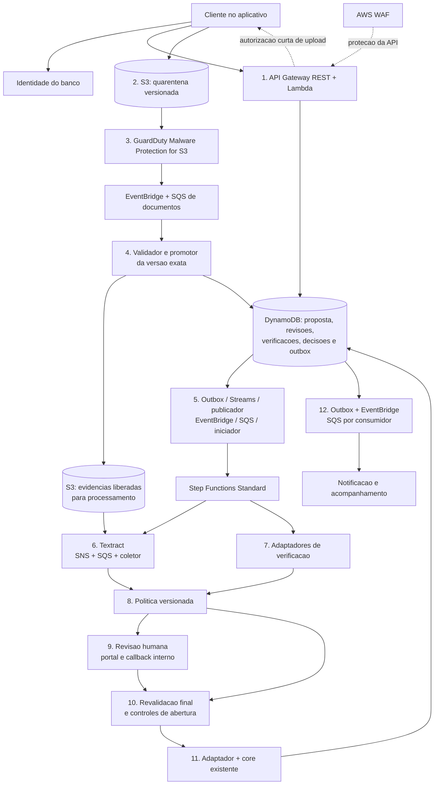
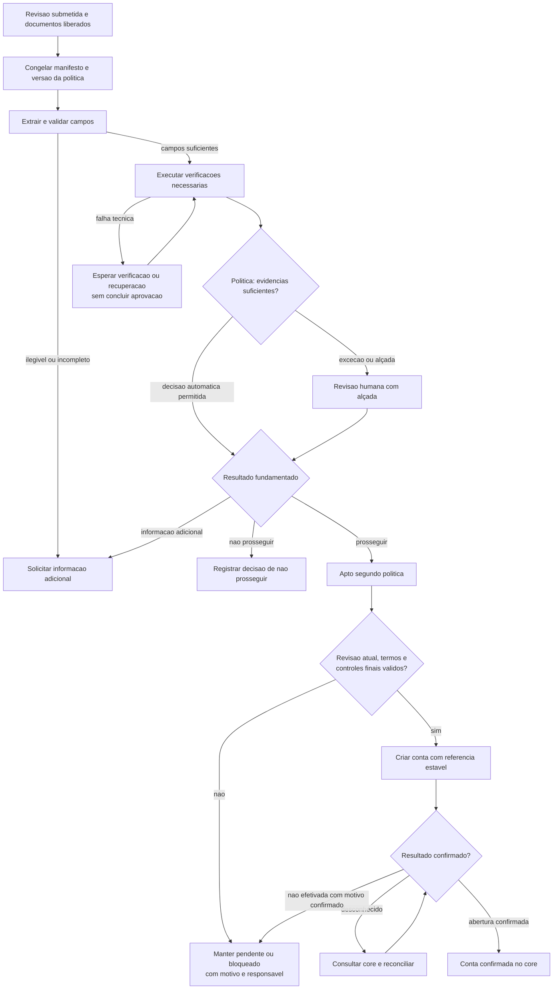
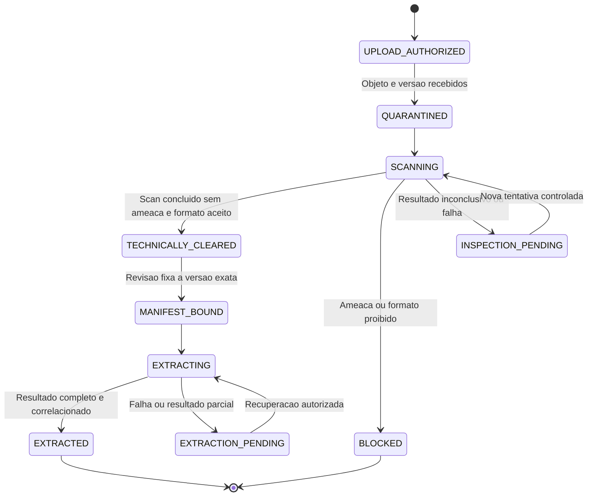
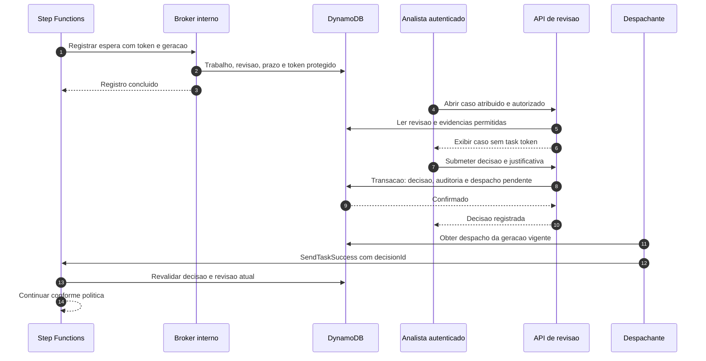
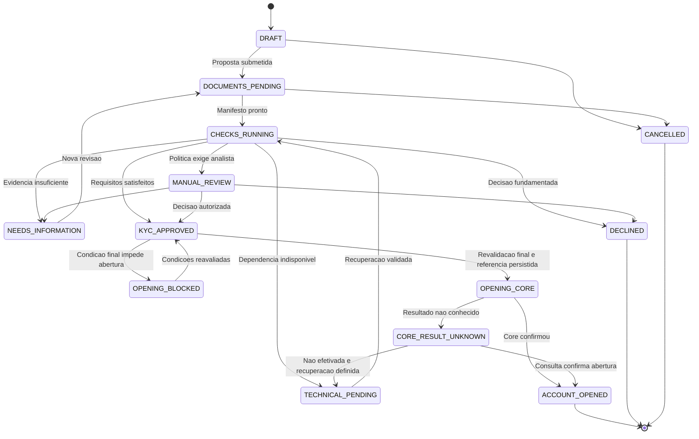
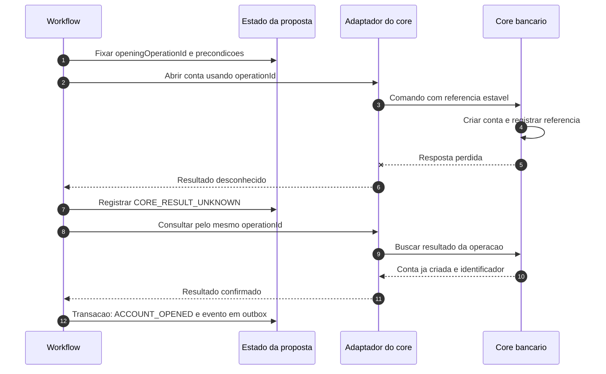
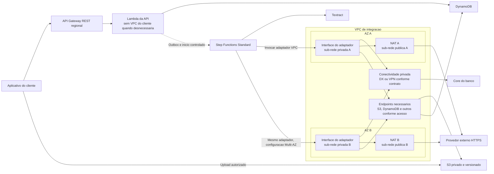
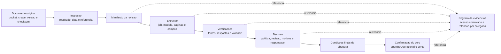

# Case 04 — KYC e abertura de conta na AWS

> **Foco:** arquitetura orientada a eventos, orquestração de workflows, documentos, verificação de identidade, revisão humana e conformidade.  
> **Idioma:** português do Brasil. Os nomes dos serviços AWS e os identificadores de código foram preservados.  
> **Formato:** guia de estudo, decisões arquiteturais e simulação de entrevista.  
> **Referências consultadas em:** 28/09/2026.  
> **Caminho sugerido no repositório:** `cases/04-kyc-account-opening.md`.

## Como usar este material

Este case continua a série de [pagamentos e Pix](01-payment-processing-pix.md), [Open Finance](02-open-finance-apis.md) e [Banking Event-Driven](03-event-driven-banking.md). Agora, o problema é **transformar uma solicitação e seus documentos em uma decisão rastreável de abertura de conta**, sem vazar dados, aprovar com verificações incompletas ou criar duas contas após uma falha.

A jornada será a abertura digital de **conta de depósitos à vista, individual, para pessoa física adulta**, em um banco brasileiro com core e políticas de risco existentes. Essa delimitação evita misturar conta de pagamento, crédito, menores de idade e cadastro de empresas na primeira versão.

Na primeira leitura, percorra as seções 1 a 7 e entenda as quatro responsabilidades: **receber evidências, verificar informações, decidir segundo uma política e efetivar a abertura no core**. Depois aprofunde documentos, callbacks, concorrência e recuperação. Por último, responda às perguntas sem abrir as respostas.

**Frase central:** “Consegui ler o documento” não significa “o documento é autêntico”, “a pessoa é quem diz ser” ou “a conta pode ser aberta”.

O documento é uma proposta didática, não uma arquitetura oficial AWS, uma implementação homologada, um parecer jurídico ou uma rubrica oficial de entrevista. L5 é o alvo de preparação informado. Metas, códigos de estado e contratos são exemplos. Jurídico, privacidade, segurança, prevenção a fraudes e PLD/FT precisam validar as políticas e a regulamentação aplicável antes de produção.

Não são necessários AWS Payment Cryptography, CloudHSM, um modelo de machine learning próprio ou agentes de IA para entender o núcleo. O principal serviço novo neste case é **Amazon Textract**, apresentado como ferramenta de extração — não como autoridade de identidade.

---

## Sumário

1. [Problema de negócio e escopo](#s01)
2. [Vocabulário e modelo mental](#s02)
3. [Perguntas antes de desenhar](#s03)
4. [Requisitos, premissas e invariantes](#s04)
5. [Decisões da arquitetura-base](#s05)
6. [Arquitetura e workflow em Mermaid](#s06)
7. [Fluxo explicado em 12 etapas](#s07)
8. [Documentos: upload, quarentena, versões e extração](#s08)
9. [Workflow, callbacks e revisão humana](#s09)
10. [Decisão, abertura no core e consistência](#s10)
11. [Papel e posicionamento dos serviços](#s11)
12. [Trade-offs que precisam ser defendidos](#s12)
13. [Rede, sub-redes e integração com o banco](#s13)
14. [Segurança, privacidade, auditoria e conformidade](#s14)
15. [Alta disponibilidade e recuperação regional](#s15)
16. [Desempenho, capacidade e custos](#s16)
17. [Observabilidade, operação e implantação](#s17)
18. [Aplicação dos seis pilares Well-Architected](#s18)
19. [Roteiro de laboratório e testes](#s19)
20. [30 perguntas de entrevista com respostas comentadas](#s20)
21. [Apresentação da solução e simulação de 45 minutos](#s21)
22. [Checklist de domínio](#s22)
23. [Referências e leitura orientada](#s23)

---

<a id="s01"></a>
## 1. Problema de negócio e escopo

### Enunciado inicial

> Um banco brasileiro quer modernizar sua abertura digital de contas. Hoje, documentos chegam por canais diferentes, analistas repetem conferências e o cliente não consegue acompanhar o andamento. A solução deve receber documentos com segurança, consultar fontes de verificação, encaminhar exceções para análise humana e abrir a conta no core existente. Como desenhá-la na AWS com disponibilidade, rastreabilidade e controles de conformidade?

### Exemplo concreto

Uma pessoa inicia a proposta pelo aplicativo. Informa os dados exigidos para o produto, envia os documentos solicitados e aceita os termos pertinentes. A plataforma confere a integridade dos arquivos, extrai informações, compara evidências e solicita as verificações previstas na política do banco.

Parte das propostas pode seguir uma decisão automatizada baseada em regras aprovadas. Outra parte exige informação adicional ou revisão humana. **Automatizar a jornada não significa aprovar automaticamente toda proposta.**

Quando a decisão estiver concluída, ainda será necessário verificar as condições finais para abertura e pedir ao core que crie a conta. Uma aprovação cadastral não equivale à confirmação de que a conta já existe.

### O que significa KYC neste contexto?

KYC, *Know Your Customer*, corresponde à prática de conhecer o cliente. No contexto regulatório considerado, não é apenas coletar uma foto: envolve identificação, qualificação e classificação, com procedimentos compatíveis com o risco. A Circular BCB nº 3.978 é uma referência central para esses procedimentos; a Resolução CMN nº 4.753 trata de contas de depósitos. [Fontes: procedimentos de KYC][r35], [contas de depósitos][r36]

O sistema apoiará esses controles. Não substituirá a responsabilidade institucional pela política nem a avaliação especializada de casos que a exijam.

### Fronteiras de responsabilidade

| Responsabilidade | Dono na proposta |
|---|---|
| Autenticar a sessão do aplicativo | Plataforma de identidade do banco; Cognito é uma possibilidade técnica |
| Registrar proposta, revisões e documentos esperados | Serviço de onboarding |
| Armazenar e liberar arquivos para processamento | Plataforma documental |
| Extrair texto e estruturas | Amazon Textract ou extrator homologado |
| Verificar informações e identidade | Serviços internos e fornecedores contratados para cada verificação |
| Definir critérios de aceitação, exceções e alçadas | Negócio, risco, PLD/FT, jurídico e privacidade |
| Executar a política e registrar justificativa | Serviço de decisão e analistas autorizados |
| Confirmar a criação da conta | Core bancário |
| Notificar o cliente | Consumidor independente de eventos |
| Preservar evidências e controlar acessos | Plataforma, segurança e governança, com responsabilidades definidas |

**Login válido não é KYC concluído.** Um cadastro em um diretório de usuários pode ser criado antes de a pessoa ser reconhecida como cliente do banco.

### Fora do núcleo

Não implementaremos um core novo, análise de crédito, definição de limites de crédito, uma base oficial de identidade, cadastro de pessoa jurídica e beneficiário final, integração direta com órgãos por scraping, ou um mecanismo de comunicação automática ao Coaf.

Biometria e prova de vida serão **capacidades opcionais conforme a jornada homologada**, não requisitos presumidos para toda conta. Também não usaremos um LLM para julgar identidade ou aprovar clientes.

**Extensão após a abertura:** atualização cadastral e reavaliação periódica ou por evento. A abertura é uma etapa de um relacionamento, não um selo de validade eterna para as informações coletadas.

---

<a id="s02"></a>
## 2. Vocabulário e modelo mental

### Quatro perguntas diferentes

| Pergunta | Exemplo de resposta | O que ainda falta |
|---|---|---|
| O arquivo pode ser processado? | Formato permitido, versão identificada, verificação de malware concluída | Saber o que ele contém e se é verdadeiro |
| O que está escrito? | Nome e campos extraídos com confiança informada pelo extrator | Verificar autenticidade e vínculo com a pessoa |
| As evidências atendem à política? | Verificações suficientes, atuais e consistentes, com decisão registrada | Efetivar a abertura |
| A conta foi criada? | Core confirmou uma conta para a referência da operação | Comunicar e manter o relacionamento |

Não comprima essas perguntas em um único campo `approved=true`.

| Termo | Significado prático neste case |
|---|---|
| Onboarding | Jornada de entrada: proposta, evidências, verificações, decisão e abertura |
| KYC | Procedimentos para conhecer o cliente e sustentar a decisão de relacionamento |
| PLD/FT | Prevenção à lavagem de dinheiro e ao financiamento do terrorismo |
| Diligência | Conjunto de verificações e medidas proporcionais à situação e ao risco |
| PEP | Pessoa exposta politicamente, categoria regulatória que exige tratamento previsto na política; não é sinônimo de fraude |
| Screening | Consulta e análise de possíveis correspondências em fontes autorizadas |
| OCR | Reconhecimento de texto em imagem/documento |
| Prova de vida | Avaliação de sinais de presença real na captura; não prova, sozinha, identidade civil |
| Proposta | Solicitação de abertura identificada por `applicationId` |
| Revisão da proposta | Conjunto versionado de dados e documentos submetidos à análise |
| Evidência | Artefato ou resultado com origem, identificação, versão e momento de obtenção |
| Quarentena | Área sem acesso por componentes que ainda não devem confiar no arquivo |
| Manifesto | Lista exata de documentos e versões que pertencem à revisão em análise |
| Workflow | Coordenação durável das etapas, esperas, decisões e recuperação |
| Callback | Retorno autenticado que informa que uma etapa assíncrona terminou |
| Task token | Token que permite concluir uma espera específica no Step Functions; deve ser protegido |
| Idempotência | Repetir a mesma operação identificada não repete seu efeito de negócio |
| Outbox | Registro durável do evento a publicar, gravado com a alteração de estado |
| Inbox | Registro de recebimentos/efeitos já aplicados para tratar duplicidade |
| Alçada | Competência exigida para executar determinada decisão |
| Segregação de funções | Separação de permissões para reduzir decisões ou alterações indevidas |
| Retenção | Período e condições de guarda de uma classe de informação |
| Legal hold | Suspensão da exclusão de determinadas evidências por motivo específico |
| RTO / RPO | Tempo-alvo para recuperação / perda de dados admissível expressa em tempo |

### Uma analogia útil

Imagine uma agência com quatro mesas: recepção de documentos, conferência, decisão e abertura da conta. Uma fotocopiadora na recepção pode ler tudo com nitidez e ainda assim não ter competência para autorizar a conta.

Na arquitetura, **Textract é parte da leitura; Step Functions coordena o trabalho; a política decide; o core confirma a abertura**. As regras de execução e os papéis não se tornam intercambiáveis só porque todos participam do mesmo fluxo. [Fontes: Textract][r08], [workflows][r03]

---

<a id="s03"></a>
## 3. Perguntas antes de desenhar

Uma abertura adequada seria:

> “Quero entender qual produto vamos abrir, quais evidências são necessárias, quem decide as exceções, quais verificações já existem e como o core confirma a abertura. Também preciso separar o prazo de aceitar a proposta do prazo de concluir a análise.”

| Pergunta ao cliente | Como a resposta altera a arquitetura |
|---|---|
| É conta de depósitos, conta de pagamento ou outro produto? | Define jornada, termos, integrações e requisitos aplicáveis |
| O público é PF adulta, menor de idade, estrangeiro ou PJ? | Muda representação, documentos e diligências |
| Quais documentos são necessários para cada situação? | Evita pedir tudo de todos e determina o manifesto |
| É possível verificar um dado sem guardar uma cópia integral do documento? | Pode reduzir coleta, armazenamento e exposição |
| Há um IdP, serviço cadastral e motor de regras existentes? | Permite integrar capacidades em vez de recriá-las |
| Qual fornecedor verifica identidade, autenticidade documental e fontes cadastrais? | Define contratos, evidências, latência, tratamento de erros e dependências |
| Biometria é necessária? Qual finalidade, base legal, alternativa e avaliação de qualidade? | Muda o tratamento de dados sensíveis e a experiência do usuário |
| Que casos podem seguir automaticamente e quais exigem revisão? | Define a política de decisão e a capacidade humana |
| Quais alçadas e duplas aprovações são exigidas? | Muda autorização, tela do analista e modelo de decisão |
| A proposta pode ser corrigida durante a análise? | Exige revisões, invalidação de resultados antigos e controle de concorrência |
| Qual o prazo de validade de cada verificação? | Impede abrir uma conta usando evidências desatualizadas |
| Como se executa a consulta institucional ao BC PROTEGE+ e outros controles aplicáveis? | Introduz uma condição final de abertura e tratamento de indisponibilidade |
| O core aceita referência idempotente e permite consulta por ela? | Determina a recuperação quando a confirmação se perde |
| Criar a conta já a deixa operacional ou existe ativação separada? | Define estados e o que pode ser comunicado ao cliente |
| Como evitar propostas concorrentes indevidas para a mesma pessoa/produto? | Exige regra de unicidade de negócio, além de idempotência HTTP |
| Quantas propostas/dia, páginas/proposta e revisões por proposta? | Dimensiona serviços documentais, fornecedores e armazenamento |
| Quanto tempo o cliente aceita esperar? | Orienta acompanhamento assíncrono, SLA de análise e notificações |
| Onde os dados e seus backups podem ficar? | Restringe região, fornecedores, suporte e recuperação regional |
| Qual retenção por documento, evidência, log e resultado? | Determina lifecycle, exclusão e eventual Object Lock |
| Quem atende pendências e incidentes? | Exige procedimentos operacionais, filas de trabalho e escalonamento |

**Não transforme discovery em interrogatório.** Comece por produto, responsabilidades, fontes de verificação, decisão e confirmação no core. Acrescente volume e recuperação para validar se a proposta é viável.

---

<a id="s04"></a>
## 4. Requisitos, premissas e invariantes

### Premissas didáticas

Estas metas servem para exercitar decisões. Não são limites AWS, exigências regulatórias nem resultados medidos.

| Categoria | Premissa da simulação |
|---|---|
| Produto | Conta de depósitos à vista individual para PF adulta |
| Região primária | `sa-east-1`, após validar recursos específicos, fornecedores e requisitos de dados |
| Volume | 10.000 propostas/dia; pico de entrada de 20 propostas/s |
| Documentos | Média de 3 páginas por proposta; até 8 MiB por arquivo na política didática |
| Aceitação | Meta de p95 inferior a 500 ms para registrar metadados, sem transferir o documento pela API |
| Jornada automatizada | Meta inicial de p95 inferior a 5 minutos após evidências completas e serviços disponíveis |
| Revisão humana | Meta de atendimento em até 1 dia útil; dependerá de equipe, casos e horários |
| Disponibilidade | Meta de 99,9% para registrar e consultar propostas; abertura exige dependências adicionais |
| Autorização | Cada cliente acessa apenas suas propostas; cada analista acessa os casos de sua competência |
| Revisões | Dados/documentos submetidos são congelados em uma revisão; correções criam outra |
| Core | Fornece criação por referência estável e consulta do resultado; validar essa premissa |
| Recuperação | Multi-AZ na base; RTO/RPO regionais precisam ser acordados por classe de dado |
| Decisão | Política versionada, evidências identificadas e trilha de responsabilidade |
| Laboratório | Somente pessoas, documentos, fontes de verificação e contas fictícias |

**Tempo de atendimento humano não é latência de infraestrutura.** Separar os indicadores evita declarar que a API falhou porque uma análise especializada levou horas.

### Invariantes que a solução precisa preservar

1. Um cliente não pode enviar, substituir ou consultar documentos de outra proposta sem autorização.
2. Um arquivo não pode avançar porque apenas existe no S3; a versão exata precisa passar pelos controles previstos.
3. Uma aprovação baseada na revisão 2 não pode autorizar silenciosamente a revisão 3.
4. Falha técnica, verificação pendente e reprovação de negócio são resultados diferentes.
5. Uma decisão deve indicar política, evidências, responsáveis e condições de validade.
6. Uma aprovação humana não pode ignorar uma restrição obrigatória de abertura.
7. A mesma operação de abertura não pode criar uma segunda conta por causa de retry.
8. Timeout do core não é prova de que a conta não foi criada.
9. Falha de notificação não deve desfazer a abertura confirmada.
10. Dados documentais e biométricos não podem circular desnecessariamente em eventos, logs ou históricos de workflow.

### Restrição atual que merece aparecer no desenho

O BC PROTEGE+ permite registrar a intenção de impedir abertura de contas. A página oficial informa a necessidade de consulta pelas instituições antes da abertura e o impedimento quando a proteção estiver ativa. Para este estudo, a abertura só avança com a verificação aplicável concluída, pelo canal institucional apropriado. Não inventaremos endpoints nem coletaremos a senha gov.br do cliente. [Fonte: BC PROTEGE+][r37]

---

<a id="s05"></a>
## 5. Decisões da arquitetura-base

A proposta começa com **API Gateway REST regional + Lambda**, documentos em **S3 privado e versionado**, estado em **DynamoDB** e orquestração em **Step Functions Standard**. **EventBridge e SQS** distribuem sinais e amortecem trabalho. Um conector isolado acessa o core existente.

Não há ALB obrigatório no caminho da API: nesta versão, o API Gateway integra-se às funções Lambda. ECS/Fargate permanece como alternativa para adaptadores com bibliotecas, processamento ou conexões que o justifiquem.

### Componentes centrais e opcionais

| Componente | Decisão e justificativa |
|---|---|
| Identidade do cliente | Integrar IdP existente; Cognito é alternativa para a identidade digital, não para concluir KYC |
| API Gateway REST + AWS WAF | Entrada de metadados, acompanhamento e solicitação de upload; REST permite associação de WAF [Fonte][r31] |
| Lambda | Validação de contrato, registro de estado, adaptadores curtos e callbacks |
| S3 em áreas separadas | Quarentena, evidências liberadas para processamento e resultados; permissões distintas |
| GuardDuty Malware Protection for S3 | Opção gerenciada da base para inspeção de malware; validar disponibilidade, permissões e formatos [Fonte][r17] |
| DynamoDB | Propostas, revisões, referências documentais, verificações, decisões, trabalhos e outbox |
| Step Functions Standard | Coordenação com esperas longas, ramificações e callbacks [Tipos][r03], [integrações][r04] |
| Textract | Extração de texto/formulários; usar a operação compatível com o documento e idioma |
| Serviços de verificação | Fontes internas/fornecedores homologados para identidade, autenticidade e controles cadastrais |
| Portal de revisão humana | Aplicação interna com identidade corporativa, MFA, autorização e trilha de decisão |
| Adaptador do core | Comandos idempotentes e consulta de resultado; acesso privado quando exigido |
| EventBridge + SQS | Roteamento de fatos e filas independentes para início, retomada, integração e notificações |
| Aurora | Alternativa se o domínio exigir relacionamentos, consultas e transações mais adequados ao modelo relacional |
| Rekognition Face Liveness | Extensão, não componente obrigatório; exige validação de região, jornada e privacidade |
| MSK | Não é necessário só porque a solução usa eventos; entra se houver requisitos específicos de log/streaming |
| Bedrock/GenAI | Fora da decisão central; possível apoio assistivo posteriormente, com avaliação e limites |

### Um requisito não deve depender do nome do produto

É necessário impedir processamento indevido de arquivos perigosos. Se GuardDuty Malware Protection for S3 não atender ao ambiente ou ao formato, essa responsabilidade precisa de outro mecanismo homologado, e não ser removida.

É necessário verificar identidade. Se Textract extrair corretamente o CPF, a responsabilidade de validação continua existindo. A regra é **preservar a capacidade de negócio e de segurança**, não apenas manter uma caixa no diagrama.

### Fonte de verdade

**DynamoDB:** estado operacional da proposta e evidências das decisões internas.  
**S3:** bytes e resultados referenciados por versão.  
**Serviços de verificação:** evidências das consultas executadas.  
**Core:** confirmação de que a conta foi criada.

Step Functions não substitui essas autoridades: uma execução encerrada não comprova, isoladamente, que todas as consequências externas foram confirmadas.

---

<a id="s06"></a>
## 6. Arquitetura e workflow em Mermaid

### 6.1 Visão geral

As setas representam dependências lógicas. DNS, certificados, IAM e criptografia não são necessariamente saltos no caminho do conteúdo. O upload vai diretamente para S3; a API recebe metadados e emite autorização limitada.



**O fluxo precisa de duas condições antes de iniciar a análise:** proposta submetida e manifesto documental liberado. Upload e submissão podem chegar em qualquer ordem; a aplicação reconcilia as duas condições no estado autoritativo.

### 6.2 Decisão e esperas do workflow



O ciclo de recuperação do desenho representa novas tentativas **limitadas por prazo e política**, não um loop infinito. Correções documentais criam uma nova revisão; a revisão anterior não passa a apontar automaticamente para o arquivo novo.

---

<a id="s07"></a>
## 7. Fluxo explicado em 12 etapas

### 1. Registrar a proposta e a identidade da sessão

O cliente autenticado chama `POST /propostas-abertura`. A API valida contrato, autorização, limites de uso e a chave de idempotência. O backend associa `applicationId` ao sujeito autenticado; não aceita um `customerId` arbitrário como prova de propriedade.

Um exemplo reduzido de corpo, sem dados pessoais reais:

```json
{
  "productCode": "DEPOSIT_ACCOUNT_INDIVIDUAL",
  "channel": "MOBILE",
  "declaredDataRef": "private-profile-record-81",
  "termsVersion": "account-terms-v4",
  "privacyNoticeVersion": "privacy-v3"
}
```

O registro de aceite de termos e de ciência do aviso deve ter origem e contexto confiáveis. O campo enviado pelo cliente, sozinho, não comprova toda a jornada. A base legal de cada tratamento será definida separadamente; não presumimos consentimento como base universal.

**Garantia:** mesma chave, mesmo sujeito e mesmo conteúdo retornam a proposta existente. Mesma chave com conteúdo incompatível gera conflito. A política de propostas concorrentes para a mesma pessoa/produto é outra regra de negócio.

### 2. Autorizar upload direto para quarentena

A aplicação cria `documentId` e `uploadId` opacos, escolhe uma chave S3 e fornece uma autorização curta para aquele envio. Neste exemplo, usamos formulário pré-assinado, com chave exata, tipo declarado e faixa de tamanho. A política é emitida pelo backend, não montada livremente pelo cliente. [Fontes: uploads pré-assinados][r13], [presigned POST][r14]

O usuário envia o arquivo ao bucket privado de quarentena. Não recebe `ListBucket`, leitura de documentos ou permissão de marcar o próprio arquivo como seguro.

**Ponto de atenção:** o WAF da API não inspeciona o conteúdo que foi enviado diretamente ao S3. Os controles documentais continuam necessários.

### 3. Detectar a chegada e inspecionar o objeto

A chegada do objeto permite registrar que há uma versão armazenada. Ela **não** libera OCR, leitura pelo analista nem abertura da conta.

GuardDuty Malware Protection for S3 realiza a inspeção configurada e publica o resultado no EventBridge. A regra encaminha os resultados relevantes para uma fila SQS de validação. O consumidor verifica origem, conta, recurso, bucket, chave e `versionId` esperado. [Fontes: proteção de malware][r17], [eventos de inspeção][r18]

Na política deste case, somente um resultado concluído e sem ameaças encontradas pode avançar ao próximo controle. Erro, acesso negado ou conteúdo não suportado permanecem pendentes/bloqueados. Isso não significa que “sem ameaças encontradas” prove ausência absoluta de risco.

### 4. Validar formato e promover a versão exata

Um componente com permissões restritas valida tamanho real, estrutura, tipo efetivo, limites de páginas e requisitos do produto. Validação de conteúdo deve ocorrer em ambiente isolado; arquivos não confiáveis não são abertos no computador do analista.

Após os controles, o componente copia a **versão específica aprovada tecnicamente** para a área de evidências liberadas. Registra origem e destino, versões, checksum e resultado. A cópia recebe chave própria; o cliente não pode sobrescrevê-la. Recomendações de upload seguro incluem múltiplos controles, e não confiança exclusiva na extensão ou no `Content-Type`. [Fonte: OWASP File Upload][r20]

“Liberado para processamento” é o nome apropriado. “Cliente aprovado” não é.

### 5. Submeter a revisão e iniciar o workflow

O cliente confirma a submissão. O backend congela um manifesto com as versões utilizadas. Quando a revisão estiver submetida e todos os documentos exigidos estiverem liberados, uma transação registra a elegibilidade e um evento na outbox.

DynamoDB Streams aciona um publicador. EventBridge roteia o evento para a fila de início; um iniciador chama `StartExecution` com nome estável para `applicationId + revision + generation`. A entrada da execução contém referências, não imagens ou um dossiê completo. [Fontes: outbox][r02], [transações][r23], [início idempotente][r06]

**Falha a tratar:** gravar a proposta e cair antes de iniciar o workflow. A outbox e a reconciliação de propostas elegíveis impedem que essa janela fique invisível.

### 6. Extrair texto e verificar qualidade

O workflow solicita a extração dos documentos liberados. Na versão assíncrona, o adaptador inicia `StartDocumentAnalysis`, registra `JobId` e aguarda conclusão por SNS → SQS → coletor. O coletor recupera as páginas de resultados e grava a saída em armazenamento privado. [Fontes: Textract assíncrono][r10], [Start][r11], [Get][r12]

Os dados extraídos são normalizados e comparados com o cadastro declarado. Campos ilegíveis ou ambíguos podem exigir reenvio ou revisão. O texto original e a correção do analista não devem se sobrescrever sem histórico.

Para RG, CIN ou CNH brasileiros, **não presumir suporte da API AnalyzeID**: a documentação consultada restringe essa API a passaportes e carteiras de motorista dos EUA. A extração geral tem suporte a texto em português, com limitações por recurso. [Fonte: limites do Textract][r09]

### 7. Executar verificações de identidade e cadastro

Adaptadores consultam as fontes previstas para o produto: consistência cadastral, autenticidade documental, vínculo da pessoa com a evidência e demais controles exigidos. Algumas verificações podem ocorrer em paralelo; outras dependem de um campo previamente confirmado.

Cada chamada registra um identificador interno, a revisão avaliada, a referência externa, o instante, o resultado normalizado e a versão conhecida da fonte/política. `INCONCLUSIVE`, `UNAVAILABLE` e `NOT_MATCHED` não se tornam todos `FAILED_KYC`.

**Premissa contratual:** fornecedores precisam ter critérios de uso, proteção de dados, disponibilidade e procedimentos de recuperação conhecidos. O desenho não transforma qualquer API pública em fonte confiável de identidade.

### 8. Aplicar uma política versionada

Um serviço de decisão recebe referências às evidências e aplica regras aprovadas. Pode concluir que a revisão está apta, que faltam informações, que precisa de análise especializada ou que não deve prosseguir.

Armazena `decisionId`, política, revisão, referências, motivos e condições de validade. Um percentual de OCR ou uma correspondência de nome não decide sozinho a abertura.

**Exemplo de regra didática:** um nome parecido encontrado em uma fonte gera necessidade de desambiguação, não confirmação automática de identidade nem conclusão de irregularidade.

### 9. Aguardar revisão humana quando necessária

Step Functions Standard pode aguardar um callback sem manter uma função Lambda executando. Um serviço interno registra o trabalho e protege o token de retomada. O portal usa identidade corporativa, autorização por caso e, quando exigido pela política, segunda aprovação. [Fonte: callback][r04]

O analista registra uma decisão fundamentada. O backend verifica revisão, alçada, prazo e concorrência antes de persistir o resultado. Um despachante autorizado conclui a espera com uma referência para essa decisão.

**O analista não recebe um link público que aprova uma conta diretamente com um task token.**

### 10. Revalidar condições imediatamente antes da abertura

O workflow verifica se a revisão ainda é a atual, se não houve cancelamento, se a decisão continua válida, se os termos aplicáveis foram aceitos e se os controles finais foram atendidos.

A consulta ao BC PROTEGE+ entra pelo mecanismo institucional apropriado. Proteção ativa interrompe a abertura, sem ser tratada como fraude ou como reprovação cadastral. Indisponibilidade da verificação não equivale a resposta negativa para a proteção. [Fonte: serviço oficial][r37]

A janela entre consultar e efetivar precisa ser tratada conforme o contrato institucional e as regras aplicáveis. Um booleano antigo em cache não substitui essa decisão.

### 11. Solicitar a abertura ao core e confirmar

O adaptador persiste `openingOperationId`, dados de correlação e o estado `OPENING_CORE`. Envia o comando ao core usando a mesma referência em tentativas da mesma operação.

Se houver confirmação, registra a conta retornada. Se houver timeout, usa `CORE_RESULT_UNKNOWN` e consulta o resultado. Não dispara outra abertura com um UUID novo.

**Fronteira:** a API de onboarding não informa “conta aberta” enquanto possuir apenas uma decisão de KYC favorável ou um comando aceito para processamento.

### 12. Publicar o resultado, comunicar e manter evidências

A atualização confirmada e seu evento são gravados juntos. Consumidores independentes atualizam o acompanhamento, enviam a comunicação autorizada e registram o início do relacionamento nos sistemas interessados.

Eventos carregam identificadores e versões, não PDFs, imagens faciais, CPF completo ou URLs pré-assinadas. A notificação consulta um modelo de comunicação aprovado; o cliente não precisa receber o dossiê interno de risco.

Outbox, consumidores idempotentes e reconciliação tratam entregas repetidas ou atrasadas. Uma falha do e-mail não encerra a conta nem muda o resultado da análise. [Fontes: outbox][r02], [Lambda/SQS][r29]

---

<a id="s08"></a>
## 8. Documentos: upload, quarentena, versões e extração

### 8.1 O documento tem uma identidade própria

Não identifique o documento apenas por `foto-frente.jpg`. Cada tentativa deve ter um `uploadId` emitido pelo servidor, vinculado ao dono da proposta, à revisão e ao tipo esperado de evidência.

O backend autoriza o envio depois de consultar a proposta. O cliente não escolhe um prefixo de outra pessoa, não define o resultado da inspeção e não escreve diretamente na área liberada para processamento.

A autorização de upload é limitada por chave, prazo, tamanho e condições do formulário. O `Content-Type` declarado ajuda a restringir o contrato, mas não comprova o formato real do conteúdo. Uma URL ou formulário pré-assinado pode ser reutilizado enquanto suas condições forem válidas; ele não se torna de uso único apenas porque a aplicação chama o endpoint de “upload único”. [Fontes: URLs pré-assinadas][r13], [POST pré-assinado][r14], [validação de arquivos][r20]

**Proposta de contrato:** a API retorna o formulário pré-assinado e registra o upload esperado. A aplicação envia o arquivo diretamente ao S3. Uma chamada posterior de conclusão pode melhorar a experiência, mas a palavra do navegador não substitui a verificação do objeto e da versão armazenados.

### 8.2 Quatro controles que não são intercambiáveis

| Controle | Responde a qual pergunta? | Não garante |
|---|---|---|
| Autorização de upload | Essa sessão pode anexar esse documento a essa proposta? | Que o arquivo é seguro ou autêntico |
| Validação técnica e antimalware | O arquivo pode ser processado de acordo com a política? | Que os dados declarados são verdadeiros |
| Extração | O que conseguimos ler, de qual página e com qual confiança? | Identidade ou autenticidade documental |
| Verificação e decisão | As evidências e consultas satisfazem a política aplicável? | Que a conta já foi criada no core |

Uma extensão `.pdf` pode esconder conteúdo indevido. Um PDF sem malware pode conter informação falsa. Um documento verdadeiro pode estar sendo apresentado por outra pessoa. São ameaças diferentes, com controles diferentes.

### 8.3 Estados do documento e proteção contra troca de versão



`TECHNICALLY_CLEARED` significa apenas liberação técnica para processamento. Não use um estado chamado `DOCUMENT_VALID` para representar simultaneamente antimalware, legibilidade e autenticidade.

**Ataque que o laboratório precisa simular:**

1. O arquivo de versão `v1` é enviado e inspecionado.
2. Outra gravação na mesma chave cria `v2`.
3. Chega o resultado de inspeção de `v1`.
4. Um consumidor ingênuo lê a chave sem informar versão e processa `v2`.

A defesa é correlacionar o resultado com **bucket + chave + versionId**, preservar checksum e promover somente a versão inspecionada. A notificação de inspeção do GuardDuty inclui a identificação do objeto; o S3 Versioning permite distinguir versões na mesma chave. [Fontes: resultado da inspeção][r18], [versionamento][r16]

Uma cópia para a área técnica deve usar a versão de origem explícita. O objeto de destino recebe sua própria identidade e versão. O manifesto guarda a linhagem entre ambos. Não permita que a aplicação cliente altere tags de liberação, versões selecionadas ou objetos no destino confiável. [Fonte: controle por tags][r19]

**Sem resultado não é “limpo”.** Falha, inspeção ignorada, conteúdo não suportado ou falta de acesso continuam impedindo o avanço. O mecanismo de liberação deve aceitar explicitamente um resultado de sucesso, e não aceitar “qualquer coisa diferente de malware”.

### 8.4 Manifesto imutável por revisão

O manifesto define exatamente o conjunto de evidências utilizado. Exemplo fictício:

```json
{
  "applicationId": "app-demo-004",
  "revision": 2,
  "manifestId": "manifest-demo-002",
  "submittedAt": "2026-09-28T12:00:00Z",
  "documents": [
    {
      "documentId": "doc-demo-front",
      "uploadId": "upload-demo-17",
      "documentType": "IDENTITY_FRONT",
      "source": {
        "bucket": "example-kyc-quarantine",
        "key": "uploads/app-demo-004/upload-demo-17",
        "versionId": "source-version-demo"
      },
      "clearedArtifact": {
        "bucket": "example-kyc-cleared",
        "key": "artifacts/doc-demo-front/scan-demo-81",
        "versionId": "cleared-version-demo"
      },
      "checksumAlgorithm": "SHA256",
      "checksumValue": "example-checksum-not-a-real-document",
      "inspectionResultId": "scan-demo-81"
    }
  ]
}
```

É um exemplo de dados, não um contrato obrigatório da AWS. Campos sensíveis complementares devem ter proteção compatível; os identificadores opacos não tornam o registro automaticamente anônimo.

Depois da submissão, a proposta não troca silenciosamente seu documento. Um novo envio gera **nova revisão** e invalida ou reaproveita verificações anteriores somente segundo regras explícitas de dependência. Uma avaliação da revisão 1 não aprova automaticamente a revisão 2.

Não use ETag como promessa universal de SHA-256 do arquivo. Registre o algoritmo e o checksum validados no seu contrato de integridade.

### 8.5 Submissão e chegada do scan podem acontecer em qualquer ordem

São duas condições independentes: a pessoa submeteu a revisão e os documentos obrigatórios daquela revisão estão tecnicamente liberados.

O serviço registra ambas e tenta a transição para `READY_FOR_CHECKS` por escrita condicional. A transação também cria a outbox `ApplicationReadyForChecks`. O evento só existe depois de ambas as condições terem sido confirmadas.

Se a inspeção terminar antes da submissão, aguarda-se a submissão. Se a submissão chegar primeiro, aguarda-se a inspeção. A segunda condição a chegar tenta a mesma transição. Um reconciliador verifica registros que ficaram pendentes por falha de processamento, sem criar uma nova revisão arbitrariamente.

### 8.6 Textract: escolha da operação e conclusão assíncrona

Para texto simples, avalie `StartDocumentTextDetection`. Para estruturas de formulário necessárias à jornada, avalie `StartDocumentAnalysis` com `FORMS`. A necessidade do documento e a qualidade obtida nos testes determinam a operação — não a suposição de que a opção mais complexa é sempre melhor.

**Não usamos `AnalyzeID` para afirmar validação de RG, CIN ou CNH brasileira.** A documentação consultada limita essa operação a documentos específicos dos Estados Unidos. O suporte de detecção de texto em português não equivale a suporte de todas as funcionalidades em português; escrita manual e Queries têm restrições adicionais. [Fonte: limites funcionais][r09]

Exemplo de solicitação assíncrona, com referências fictícias:

```json
{
  "DocumentLocation": {
    "S3Object": {
      "Bucket": "example-kyc-cleared",
      "Name": "artifacts/doc-demo-front/scan-demo-81",
      "Version": "cleared-version-demo"
    }
  },
  "FeatureTypes": ["FORMS"],
  "ClientRequestToken": "app-demo-004-r2-doc-front-extract-v1",
  "JobTag": "extract-demo-81",
  "NotificationChannel": {
    "SNSTopicArn": "arn:aws:sns:sa-east-1:123456789012:example-textract-completed",
    "RoleArn": "arn:aws:iam::123456789012:role/example-textract-notification"
  },
  "OutputConfig": {
    "S3Bucket": "example-kyc-extraction",
    "S3Prefix": "jobs/extract-demo-81"
  },
  "KMSKeyId": "arn:aws:kms:sa-east-1:123456789012:key/00000000-0000-0000-0000-000000000000"
}
```

O ARN da chave, a função IAM e os buckets são placeholders. Antes de executar, são necessárias permissões reais de leitura da versão, uso de chaves, publicação e escrita de resultados. O tópico SNS deve atender às condições documentadas do serviço. [Fontes: API de início][r11], [processamento assíncrono][r10]

O fluxo de término é **Textract → SNS → SQS → coletor**. O coletor correlaciona `JobId` com proposta, revisão, documento e versão. Verifica o estado final, busca todas as páginas do resultado e registra a extração durável antes de liberar a próxima etapa. `PARTIAL_SUCCESS` exige tratamento explícito; não equivale silenciosamente a todos os documentos lidos. [Fontes: processamento assíncrono][r10], [API de resultado][r12]

A idempotência do token de início tem prazo e contrato próprios. Repetir o mesmo token e parâmetros pode recuperar o mesmo job sem gerar outra notificação de conclusão. Portanto, a recuperação também consulta o job registrado; não depende de receber um segundo SNS. A retenção padrão de resultados do serviço não substitui a política de evidências do banco. [Fonte: contrato assíncrono][r10]

### 8.7 Legibilidade, confiança e autenticidade

| Situação | Tratamento proposto |
|---|---|
| Campo não encontrado | Solicitar evidência adicional ou revisar; não inventar valor |
| Leitura com baixa confiança | Conferência assistida e rastreável |
| Nome extraído difere do declarado | Normalizar apenas segundo regras explícitas; investigar divergência |
| Arquivo legível e sem ameaças | Pode seguir às verificações; ainda não é prova de autenticidade |
| Documento alterado ou resultado inconclusivo do fornecedor | Registrar a evidência e seguir a política; não converter em aprovação por conveniência |
| Modelo de extração mudou | Medir impacto em conjunto de testes e registrar versão usada |

O limiar de confiança é uma decisão baseada em erros observados e impacto de cada campo. “Acima de 95% aprova” seria uma política inventada, não uma regra geral de KYC.

---

<a id="s09"></a>
## 9. Workflow, callbacks e revisão humana

### 9.1 Por que Step Functions Standard?

O caso tem verificações assíncronas, retomadas e espera humana. Standard oferece persistência do andamento e os padrões de integração necessários. Express é útil para fluxos curtos compatíveis com seu modelo, mas não substitui automaticamente um workflow que aguarda um callback durante horas. [Fontes: tipos][r03], [padrões de integração][r04]

**Step Functions coordena; DynamoDB registra o negócio.** Não use exclusivamente o histórico de execução como cadastro autoritativo da proposta. A aplicação precisa consultar estados e evidências mesmo depois de reimplantar a máquina de estados ou recuperar um desastre.

| Informação | Registro autoritativo proposto |
|---|---|
| Documento utilizado | Manifesto da revisão e objetos versionados |
| Verificação realizada | Registro de verificação com fonte, data, resultado e validade |
| Decisão | Registro imutável com revisão, política e responsável |
| Etapa técnica em execução | Step Functions e registro de correlação |
| Conta criada | Core e referência confirmada na proposta |
| Token de callback | Registro interno protegido, associado à geração da espera |

Uma execução Standard não elimina os efeitos das tentativas de uma integração. Uma função pode chamar o core e falhar antes de responder; o core ainda precisa reconhecer a referência repetida.

### 9.2 Início da execução: duas gravações, uma recuperação

A outbox permite publicar o pedido de início depois de registrar a revisão elegível. O iniciador usa um nome estável derivado de `applicationId`, revisão e geração autorizada do workflow.

O contrato de `StartExecution` distingue uma execução Standard ainda em andamento de outra já encerrada, e considera também a entrada. Por isso, “ExecutionAlreadyExists” não é um erro a contornar adicionando um UUID aleatório. É um sinal para consultar a correlação existente e decidir se a revisão já foi processada. [Fonte: StartExecution][r06]

A retomada intencional de um caso encerrado exige nova geração, motivo, autorização e verificações de validade. A geração nova não significa criar nova conta.

### 9.3 Revisão humana com decisão persistida antes da retomada



O portal não recebe credenciais para `SendTaskSuccess`. A API do portal tampouco aceita um `approved=true` sem verificar identidade corporativa, atribuição, alçada, revisão e estado do caso.

A decisão e o item de despacho são registrados juntos. Se a chamada de callback falhar, o despachante tenta novamente segundo sua política. O auditor consegue distinguir **decisão registrada**, **callback entregue** e **abertura confirmada**.

Tokens são artefatos sensíveis. Não os coloque em URL de e-mail, log de aplicação, eventos destinados a vários times ou campos que o navegador possa ler. O principal autorizado a devolver o token deve cumprir a restrição de conta da integração. [Fonte: callback][r04]

### 9.4 Exemplo de estado de espera

Este JSON é um **fragmento ASL**, não uma máquina completa. Os próximos estados citados precisam existir na implementação. A função registra a espera de maneira idempotente; não fica executando enquanto o analista trabalha.

```json
{
  "AguardarRevisaoHumana": {
    "Type": "Task",
    "Resource": "arn:aws:states:::lambda:invoke.waitForTaskToken",
    "Parameters": {
      "FunctionName": "example-register-human-review",
      "Payload": {
        "applicationId.$": "$.applicationId",
        "revision.$": "$.revision",
        "workflowGeneration.$": "$.workflowGeneration",
        "executionArn.$": "$$.Execution.Id",
        "taskToken.$": "$$.Task.Token"
      }
    },
    "TimeoutSeconds": 172800,
    "ResultPath": "$.humanReviewReference",
    "Catch": [
      {
        "ErrorEquals": ["States.Timeout"],
        "ResultPath": "$.reviewError",
        "Next": "RegistrarRevisaoExpirada"
      },
      {
        "ErrorEquals": ["States.ALL"],
        "ResultPath": "$.reviewError",
        "Next": "RegistrarPendenciaOperacional"
      }
    ],
    "Next": "RevalidarDecisaoPersistida"
  }
}
```

As 48 horas são um prazo técnico ilustrativo. Não equivalem ao SLA de um dia útil, que exige calendário, feriados e escalonamento. A retomada após expiração precisa ser deliberada; expirar não aprova nem reprova o cliente.

Não configure heartbeat curto esperando que um analista o renove a cada minuto. Use heartbeat somente quando existir um trabalhador que implemente essa renovação corretamente. Trate erros e prazos de cada integração de acordo com sua semântica. [Fonte: tratamento de erros][r07]

### 9.5 Corridas que precisam de solução

**Resposta externa antes do registro da correlação.** Um coletor salva o resultado em uma inbox identificada e aguarda a associação. O fluxo não descarta o resultado por ainda não encontrar o token. A criação do job também tem referência estável para recuperação.

**Dois analistas respondem.** A escrita condicional verifica a versão do trabalho e seu estado. Só uma decisão daquele passo é aceita. Uma segunda alçada, quando exigida, é outro passo com outro papel, não uma corrida entre duas pessoas.

**A pessoa reenvia o documento durante a análise.** A nova revisão não herda a aprovação da anterior. A API rejeita uma decisão dirigida à revisão encerrada ou registra-a como histórica sem efeito na revisão ativa.

**A decisão foi persistida, mas o token expirou.** O registro continua existindo. O sistema reconcilia a espera e avalia se pode criar nova geração; não reutiliza o token para outro caso nem considera que uma conta foi aberta.

**Callback recebido duas vezes.** O segundo recebimento pode não ser aceito pela execução já retomada. O despachante usa a decisão persistida e a correlação para concluir o diagnóstico; não cria outro workflow de abertura.

### 9.6 Que trabalho deve ir ao humano?

A política pode encaminhar campos ilegíveis, evidências conflitantes, homônimos, necessidade de alçada ou exceção de procedimento permitida. O caso deve trazer as fontes necessárias, o motivo do encaminhamento e o que precisa ser resolvido.

O analista não é um mecanismo para ignorar falha técnica ou controle obrigatório. Uma tela com botão “aprovar assim mesmo” para indisponibilidade de consulta exigida transforma a revisão humana em desvio de controle.

**Princípio de operação:** a fila de revisão mede trabalho de decisão. Incidentes de integração devem ter fila e responsáveis próprios, para não consumir analistas de negócio sem lhes dar meios de resolver o problema.

---

<a id="s10"></a>
## 10. Decisão, abertura no core e consistência

### 10.1 Estados de negócio: a jornada não é um único booleano



É um modelo didático, não uma especificação exaustiva. Transições de cancelamento, expiração e erro precisam existir para todos os estados em que a política as permite. Estados terminais se referem àquela jornada/revisão; reapresentação é uma ação controlada.

`OPENING_BLOCKED` pode representar uma proteção de abertura ativa, sem declarar que o cliente falhou no KYC. `TECHNICAL_PENDING` não é recusa cadastral. O canal público pode agregar estados internos em uma mensagem adequada, mas o registro operacional preserva a diferença.

### 10.2 Decisão vinculada a uma política e a evidências

Uma decisão deve permitir responder: qual revisão, com quais documentos, consultas e regras levou a esse resultado? Exemplo de registro reduzido:

```json
{
  "decisionId": "decision-demo-219",
  "applicationId": "app-demo-004",
  "revision": 2,
  "policyVersion": "kyc-policy-demo-v7",
  "manifestId": "manifest-demo-002",
  "verificationIds": ["verify-demo-identity-12", "verify-demo-risk-34"],
  "outcome": "KYC_APPROVED",
  "reasonCodes": ["REQUIRED_CHECKS_SATISFIED"],
  "decidedBy": {"type": "AUTHORIZED_REVIEWER", "actorRef": "workforce-demo-51"},
  "decidedAt": "2026-09-28T14:00:00Z",
  "openingPreconditions": "MUST_BE_REVALIDATED_BEFORE_CORE_REQUEST"
}
```

O registro de exemplo não substitui a trilha de alçadas nem define validade universal. O banco decide quais consultas vencem, quais mudanças invalidam a decisão e quando é necessária nova avaliação.

Para mudanças de regra, registre a política usada em cada caso. Uma política nova pode demandar reanálise de propostas pendentes, mas não deve reescrever retroativamente o motivo da decisão antiga.

### 10.3 O intervalo entre aprovar e abrir

Antes de efetivar, uma escrita condicional verifica a revisão, o estado permitido, ausência de cancelamento e validade do conjunto de condições. Ela reserva a execução lógica da abertura e fixa `openingOperationId`.

Isso resolve concorrência **dentro da nossa base**. Não torna atômicos DynamoDB, consulta externa e core. As integrações precisam oferecer referência estável, consulta de resultado e regras institucionais para as janelas entre verificação e efetivação.

A indisponibilidade de uma verificação obrigatória interrompe a abertura. Não se reutiliza indefinidamente uma resposta histórica para “manter disponibilidade”. A aceitação da proposta pode continuar; a efetivação aguarda condição segura.

### 10.4 Timeout no core: a conta pode já existir



A reconsulta não deve criar outra conta. Se o core confirmar que o comando não foi efetivado e o contrato permitir repetição segura, a retomada usa a **mesma identidade de operação**, depois de revalidar as condições que ainda forem necessárias.

Se o core não oferece idempotência nem consulta confiável, isso é um risco de integração a resolver. Não há fila, saga ou atributo do Step Functions que transforme um comando externo opaco em uma operação comprovadamente única.

### 10.5 Cancelamento concorrente

Antes do envio ao core, o cancelamento pode impedir a transição para abertura. Depois do envio, pode haver uma operação em trânsito. A API deve dizer que o cancelamento está em avaliação e reconciliar o resultado.

Se a conta já foi criada, eventual encerramento é outra jornada, com requisitos próprios. Não apague a conta ou o cadastro para simular rollback técnico.

**Condição importante:** não encerre a conta recém-criada porque o consumidor de notificações falhou. A notificação é recuperável independentemente da efetivação.

### 10.6 Idempotência em três níveis

| Nível | Chave/condição proposta | O que protege |
|---|---|---|
| Requisição da API | Solicitante + operação + chave + hash do conteúdo | Repetição do envio pelo aplicativo |
| Workflow/documento/verificação | Proposta + revisão + etapa + geração autorizada | Evento duplicado, callback atrasado e reinício técnico |
| Abertura no core | `openingOperationId` e regra de unicidade do produto | Segunda conta causada pela mesma intenção |

A unicidade de produto não pode ser uma regra improvisada “um CPF, uma conta em todo o banco”. Tipos de relacionamento, produtos e situações legítimas precisam ser definidos pelo domínio.

### 10.7 Outbox, consumidores e reconciliação

O estado confirmado e o evento correspondente são gravados na mesma transação DynamoDB. O publicador pode enviar o mesmo evento mais de uma vez se perder a confirmação. Cada consumidor usa seu próprio registro de aplicação e uma chave de evento estável. [Fontes: transações][r23], [outbox][r02]

O publicador trata cada resultado de `PutEvents`; sucesso HTTP não é prova de que todas as entradas foram aceitas. A existência e a configuração do barramento fazem parte dos testes de infraestrutura. [Fonte: publicação de eventos][r28]

DynamoDB Streams é o disparador de baixa latência, não a única cópia recuperável da intenção. A outbox durável e um reconciliador permitem recuperar publicações não confirmadas quando uma interrupção ultrapassa a janela do stream. [Fonte: Streams][r24]

O mesmo cuidado vale para iniciar uma execução, entregar um callback e notificar o cliente. Há pontos de confirmação distintos; cada fronteira tem recuperação explícita.

**Replay permitido:** reconstruir uma projeção de acompanhamento a partir de eventos históricos, sem chamar o core. **Replay perigoso:** reenviar indiscriminadamente todos os comandos de abertura para “sincronizar a base”.

---

<a id="s11"></a>
## 11. Papel e posicionamento dos serviços

| Componente | Papel na proposta | Não resolve sozinho | Comportamento esperado durante falha |
|---|---|---|---|
| IdP existente / Amazon Cognito | Identidade da sessão e acesso ao aplicativo | KYC, autenticidade documental e autorização de um analista | Não criar uma sessão alternativa sem validação |
| Amazon API Gateway REST | Contrato de API, entrada autenticada, limites e integração com funções | Autorização sobre toda proposta apenas por existir um token | Erros controlados; repetição com idempotência |
| AWS WAF | Regras de proteção da API | Inspeção do corpo de um arquivo enviado diretamente ao S3 | Monitorar bloqueios e falsos positivos |
| AWS Lambda | Operações curtas: API, validação, coletores, despacho e adaptadores | Espera humana de horas dentro de uma execução | Retry seletivo e estado durável |
| Amazon S3 | Documentos e resultados versionados, privados e cifrados | Decisão de confiança sobre a pessoa | Não avançar sem a evidência exigida |
| GuardDuty Malware Protection for S3 | Inspeção antimalware dos objetos elegíveis | Autenticidade, identidade ou conformidade do cadastro | Resultado indefinido mantém quarentena |
| Amazon Textract | Extração de texto/estrutura do artefato liberado | Verificar identidade ou homologar documento brasileiro | Recuperar job ou encaminhar pendência |
| Amazon SNS | Notificar conclusão do processamento Textract | Coordenar toda a jornada | SQS e reconciliação preservam a recuperação |
| Amazon SQS | Buffer e processamento independente de trabalhos/notificações | Entrega global exatamente uma vez | Backlog, alarmes, DLQ e consumidores idempotentes |
| Amazon EventBridge | Roteamento de fatos para os interessados | Atomicidade com a base da proposta | Outbox, política de retry e DLQ de entrega |
| AWS Step Functions Standard | Coordenar verificações, espera, decisão e recuperação | Autoridade legal ou idempotência do core | Consultar registros e retomar de forma controlada |
| Amazon DynamoDB | Estado, revisões, correlações, decisões, inbox e outbox | Relacionamentos arbitrários sem modelagem | Escritas condicionais e não efetivar sem garantias |
| AWS KMS | Controle de chaves de criptografia integrado aos serviços | Autorização de negócio sobre uma proposta | Falha de descriptografia impede leitura; investigar permissões |
| AWS Secrets Manager | Segredos das integrações que realmente exigem segredo | Substituir identidade temporária quando ela está disponível | Rotação testada e tratamento de indisponibilidade |
| Amazon CloudWatch | Métricas, logs operacionais, alarmes e correlação | Dossiê completo e imutável de decisão | Observabilidade alternativa e alerta de lacunas |
| AWS CloudTrail | Auditoria de chamadas e acessos selecionados | Explicar automaticamente a justificativa do analista | Coleta e armazenamento com configuração explícita |
| Core bancário | Criar e consultar a conta de forma autoritativa | Decidir sozinho a política de onboarding | Reconciliação de resultado desconhecido |

As garantias concretas dependem das configurações, dos contratos e do tipo de integração. Por exemplo, notificações S3 e consumo Lambda/SQS admitem repetição; a aplicação não deve pressupor que recebeu um evento só uma vez. [Fontes: eventos S3][r15], [Lambda/SQS][r29]

### O que não entra por padrão

**MSK:** fica para uma necessidade real de streaming, retenção e grupos Kafka, não para transformar todo processo de documentos em plataforma Kafka.

**Aurora:** alternativa válida para um domínio relacional e transações SQL. Não adicionamos Aurora e DynamoDB para manter o mesmo estado sem uma razão de domínio e uma regra de autoridade.

**ECS/Fargate:** pode assumir inspeção especializada, bibliotecas nativas ou adaptadores de conexão persistente. Não é obrigatório para uma Lambda chamar um serviço gerenciado.

**CloudFront:** útil para interface web e conteúdo apropriado. Não publique documentos confidenciais com cache compartilhado só para “acelerar S3”. O acesso ao documento tem autorização e política próprias.

**Amazon Rekognition Face Liveness:** pode compor uma jornada biométrica homologada, quando justificada. Prova de vida, comparação facial e prova de identidade continuam sendo avaliações distintas, com limitações e revisão apropriada. Verifique suporte regional e os requisitos específicos antes de desenhar o componente na Região escolhida. [Fontes: Face Liveness][r44], [pré-requisitos][r45]

---

<a id="s12"></a>
## 12. Trade-offs que precisam ser defendidos

### 12.1 Step Functions × sequência de Lambdas em eventos

Na base, usamos Step Functions porque a jornada tem ordem, dependências, prazos e revisão humana. Uma coleção de funções pode ser suficiente para tarefas independentes, mas esconder estados em nomes de filas e cron jobs dificulta explicar quem aguarda quem.

**Trade-off:** o orquestrador traz um modelo explícito e dependência da plataforma, exige controle de versões e tem limites/custos de execução. A coreografia reduz coordenação central em processos simples, mas pode complicar diagnóstico de uma jornada longa. Não faça do orquestrador um cadastro gigante nem do barramento o dono das decisões.

### 12.2 Standard × Express

A espera humana e os callbacks favorecem Standard. Express pode atender uma subrotina curta de enriquecimento se suas garantias forem suficientes e a integração for compatível. Não use Express para uma aprovação que pode ocorrer amanhã. Consulte duração, tamanho de estado, histórico e quotas de cada tipo. [Fontes: tipos de workflow][r03], [quotas][r05]

### 12.3 Lambda × ECS/Fargate

Lambda reduz a administração de execução para operações curtas, com limites de concorrência que podem proteger dependências. Fargate é uma alternativa para processamento que exige duração maior, recursos e bibliotecas específicos ou sessões persistentes.

O limite de execução de uma Lambda não se estende porque ela foi chamada por Step Functions. Uma tarefa longa deve ser dividida ou executada em um modelo adequado; a espera pode ficar no workflow. [Fonte: timeout Lambda][r48]

### 12.4 DynamoDB × Aurora

DynamoDB se encaixa nos acessos principais por proposta, revisão, documento, etapa e correlação. Condições e transações permitem implementar guardas de estado.

Aurora pode ser preferível para consultas relacionais intensas, operações envolvendo muitos relacionamentos e experiência da equipe com SQL. Em ambos os casos, outbox e idempotência continuam necessárias para efeitos externos.

**Pergunta de entrevista:** “Como listar casos para analistas sem usar um índice eventualmente consistente como prova de autorização?” Use o índice para descobrir candidatos e releia o registro autoritativo ao atribuir ou decidir. A aplicação de uma decisão exige condição sobre versão e estado atual. [Fonte: consistência DynamoDB][r26]

### 12.5 Upload por API × diretamente no S3

O upload direto evita fazer a API transportar todo o arquivo e separa controle de acesso de transferência de bytes. Em troca, exige autorização prévia, política restrita, CORS adequado, correlação e processamento posterior.

Uma API intermediária pode oferecer inspeção síncrona de conteúdos pequenos ou integração específica, mas tem limites de payload, duração, custo e exposição operacional. Em nenhum modelo a ausência de malware comprova identidade.

### 12.6 POST pré-assinado × PUT pré-assinado

POST permite expressar condições de formulário, como faixa de tamanho. PUT pode ser conveniente para certos clientes e contratos. A decisão deve considerar limites realmente impostos pelo método, headers assinados, checksum e experiência móvel — não apenas qual snippet está mais curto. [Fontes: POST][r14], [URLs pré-assinadas][r13]

Em ambos, o servidor controla a chave e a associação com a proposta, e o consumo utiliza a versão selecionada. “URL expira em cinco minutos” não substitui vínculo ao recurso, proteção contra compartilhamento e controle posterior.

### 12.7 Antimalware gerenciado × scanner especializado

A proposta usa GuardDuty Malware Protection for S3 para evitar operar um motor do zero. A adequação depende de formatos, tamanhos, permissões, disponibilidade e comportamento frente a arquivos não suportados.

Um scanner contratado ou em Fargate pode atender requisitos adicionais, mas exige atualização, isolamento, capacidade, testes e operação. Preserve a mesma interface de resultado e o mesmo princípio de não liberar por ausência de resposta. [Fontes: visão do serviço][r17], [resultados e exceções][r18]

### 12.8 Polling × callback

Polling com frequência controlada é simples de depurar e útil para reconciliação. Fazer consultas contínuas enquanto um analista espera o dia seguinte custa dinheiro e aumenta ruído.

Callback reduz consultas desnecessárias, mas exige correlação, segurança do token, prazo e tratamento de resposta precoce/tardia. A combinação adotada é **callback para o caminho normal, consulta/reconciliação para recuperação**.

### 12.9 Regras determinísticas × revisão humana × IA generativa

Regras versionadas são explicáveis e adequadas a condições objetivas; sua qualidade depende de política e evidências. Pessoas resolvem exceções dentro de alçada, mas precisam de ferramentas, treinamento e capacidade.

IA generativa poderia resumir um dossiê em uma evolução controlada, com referências e revisão, mas não é necessária ao núcleo. Não delegue uma decisão adversa ou uma identidade não comprovada a uma resposta textual sem critérios, avaliação e governança.

### 12.10 Biometria × alternativa não biométrica

Biometria pode adicionar sinais à jornada, mas introduz dados sensíveis, requisitos de captura, riscos de erro e necessidades de acessibilidade. A decisão de usar não deve ocorrer apenas porque existe um SDK.

Defina finalidade, hipótese legal aplicável, minimização, armazenamento, avaliação de qualidade e canal alternativo permitido. O desempenho precisa ser testado na população e nos dispositivos do caso, sem inferir atributos pessoais não necessários. [Fontes: LGPD][r38], [discussão oficial sobre biometria][r39]

### 12.11 Disponibilidade do cadastro × disponibilidade da efetivação

Durante falha do core, pode ser seguro permitir que a pessoa inicie a proposta ou envie documentos. Isso não autoriza informar que a conta está aberta.

O trade-off não precisa ser “parar tudo” ou “ignorar a verificação”. A aplicação pode preservar trabalho, dar transparência sobre a pendência e limitar novas entradas quando não houver capacidade segura de recuperação.

### 12.12 Retenção imutável × exclusão e minimização

S3 Object Lock pode proteger categorias de evidência contra alteração ou remoção antes do prazo configurado. Isso deve seguir uma matriz de retenção e responsabilidades, não ser aplicado indiscriminadamente a todos os uploads, rascunhos e dados biométricos. [Fontes: Object Lock][r21], [considerações de operação][r22]

O uso de retenção imutável não dispensa exclusão posterior, segregação, controle de finalidade e tratamento de direitos. A hipótese legal e as obrigações aplicáveis devem orientar quais dados permanecem, por quanto tempo e por quê. [Fonte: LGPD][r38]

---

<a id="s13"></a>
## 13. Rede, sub-redes e integração com o banco

### 13.1 Serviços regionais não são todos recursos de uma subnet



O desenho é lógico: as caixas do adaptador representam a conectividade configurada para a função em sub-redes de duas AZs, não duas instâncias fixas administradas pelo usuário. Invocar Lambda pelo Step Functions não exige expor uma URL pública para a função.

O caminho inicial é **API Gateway → Lambda**. Não colocamos ALB e NLB em sequência sem necessidade. A camada privada existe para acessar o core ou recursos privados que realmente precisam dessa conectividade.

### 13.2 Saída e permissões

Uma Lambda associada à VPC não ganha acesso à internet simplesmente por selecionar uma subnet pública. Para os destinos que exigirem internet, o desenho precisa da saída apropriada; para serviços elegíveis, endpoints podem atender o acesso privado. [Fonte: Lambda e internet][r32]

No desenho com NATs zonais, cada subnet privada utiliza a saída da sua AZ para não depender da outra zona. A conectividade do core deve ter redundância e testes compatíveis com o compromisso de disponibilidade.

Gateway endpoints de S3 e DynamoDB atendem tráfego elegível originado na VPC e têm políticas próprias. Não são uma forma de conectar o navegador externo diretamente a uma interface privada do banco. [Fontes: endpoint S3][r33], [endpoint DynamoDB][r34]

**Cuidado com políticas de bucket:** um `Deny` genérico que só permite determinado VPC endpoint pode bloquear uploads pré-assinados externos ou acesso necessário de serviços AWS. Separe fluxos, buckets/prefixos e identidades; teste tanto o acesso permitido quanto o negado. “Privado” significa controle de acesso, não obrigatoriamente ausência de todo endpoint público do serviço.

### 13.3 Proteção da integração

Use TLS, autenticação do serviço, políticas de IAM mínimas e autorização do core. Uma conexão privada não substitui criptografia e autenticação. Quando o parceiro exigir mTLS, a gestão de certificados pertence ao adaptador e à plataforma de segurança, com renovação testada.

O canal de um fornecedor externo não deve ter acesso irrestrito ao bucket inteiro. Envie somente os dados necessários à verificação contratada, com finalidade e retenção acordadas. Respostas precisam de correlação, autenticidade e validação de formato.

### 13.4 Região e serviços opcionais

Antes do laboratório cloud, confirme recursos específicos em `sa-east-1`, quotas e condições de integração. Disponibilidade do serviço principal não implica suporte de todas as APIs, funcionalidades ou bibliotecas de captura naquela Região. Essa verificação é especialmente importante para inspeção gerenciada, extração e biometria opcional. [Fontes: endpoints Textract][r46], [Regiões GuardDuty][r47], [pré-requisitos de Face Liveness][r45]

Não mude silenciosamente o processamento de documentos para outra Região por causa de um recurso indisponível. A decisão precisa considerar transferência de dados, contrato, risco, latência e aprovação institucional.

---

<a id="s14"></a>
## 14. Segurança, privacidade, auditoria e conformidade

### 14.1 Evidência precisa de linhagem



Um log que diz `approved=true` não responde a essas perguntas. O dossiê precisa permitir reconstruir o raciocínio institucional autorizado sem liberar dados excessivos para qualquer operador.

### 14.2 Segregação de acesso

| Papel | Acesso necessário | Acesso a evitar |
|---|---|---|
| Cliente solicitante | Própria proposta, envio autorizado, acompanhamento | Propostas alheias, tags de liberação, tokens de workflow |
| Função de upload | Autorizar chave/prazo e registrar intenção | Aprovar KYC ou abrir conta |
| Inspeção/promotor | Ler versão da quarentena e gravar resultado técnico | Alterar política de crédito/risco ou decisão de identidade |
| Extrator/coletor | Artefatos liberados e resultado correlacionado | Listar todos os documentos sem necessidade |
| Analista | Casos atribuídos, evidências necessárias, decisão em sua alçada | Aprovar caso próprio ou burlar controle obrigatório |
| Despachante de callback | Token protegido da geração correta e decisão referenciada | Acesso irrestrito ao conteúdo documental |
| Adaptador do core | Comandos autorizados e consultas por referência | Decidir KYC com base em um parâmetro público |
| Operação | Métricas e referências para diagnóstico | Documentos completos por padrão em dashboards |

A autorização por objeto deve ocorrer no backend. Ocultar um botão no portal ou usar IDs difíceis de adivinhar não impede que alguém consulte outro `applicationId`.

### 14.3 O que não colocar em logs e eventos

Evite documentos, imagens faciais, texto integral extraído, CPF completo, senhas, tokens de sessão, tokens de callback, segredos e URLs pré-assinadas. Erros de fornecedores também podem conter PII e precisam de tratamento antes de serem enviados a logs gerais.

Use `applicationId`, `revision`, `verificationId`, `decisionId`, código de erro técnico e referências de evidência controladas. Esses identificadores também devem ter acesso e retenção adequados.

O histórico e os logs do Step Functions podem expor dados de entrada/saída. Mantenha apenas referências no estado e configure a política de logging conscientemente. A definição de que dados entram no workflow é mais segura do que depender exclusivamente de mascaramento posterior. [Fonte: logs Step Functions][r41]

### 14.4 Auditoria de infraestrutura × auditoria de negócio

CloudTrail registra ações cobertas pela configuração escolhida. Eventos de dados, como acesso a objetos, precisam de seleção apropriada e têm consequências de volume e custo. Não presuma que o histórico padrão de gerenciamento já registra toda leitura documental necessária. [Fonte: eventos de dados][r40]

A aplicação registra quem abriu o caso, quais evidências consultou, decisão, alçada, motivo e correlação. CloudTrail e auditoria de negócio se complementam; nenhum deles deve ser anunciado como substituto completo do outro.

### 14.5 Requisitos brasileiros: transformar obrigações em controles verificáveis

| Tema | Implicação arquitetural a discutir | Cuidado |
|---|---|---|
| Identificação, qualificação e classificação de risco | Verificações configuráveis, evidências, alçadas e atualização | Coletar documento não encerra o processo de conhecer o cliente |
| Abertura de conta de depósitos | Integridade e autenticidade das informações e procedimentos adequados ao produto | Não misturar regras de conta de pagamento ou crédito sem avaliar escopo |
| BC PROTEGE+ | Consulta institucional antes da abertura e tratamento de proteção ativa | Proteção ativa não significa fraude; falha de consulta não libera |
| LGPD: finalidade, necessidade e hipótese legal | Inventário de dados por etapa, minimização e acesso por função | Consentimento não é a única base nem uma autorização universal |
| Dados biométricos | Justificativa, base aplicável, proteção e avaliação específica | Não coletar biometria apenas porque existe uma API |
| Decisão automatizada e direitos | Rastreabilidade, explicação adequada e processo para direitos aplicáveis | Política opaca e irreproduzível dificulta governança |
| Retenção e preservação | Matriz por categoria, gatilho, prazo, legal hold e exclusão | Não atribuir um prazo único a todos os dados |
| Transferências de dados | Avaliar fornecedores, Regiões, contratos e mecanismos aplicáveis | LGPD não deve ser resumida a “tudo deve ficar no Brasil” |

As referências da Circular nº 3.978 e da Resolução nº 4.753 fundamentam a discussão, mas as compilações em PDF consultadas **não devem ser tratadas como certificação de toda a regulamentação vigente em 2026**. Confirme o texto vigente, alterações posteriores, atos complementares e o enquadramento da instituição no acervo normativo do Banco Central. A página oficial atual do BC PROTEGE+ é uma referência adicional para a jornada. [Fontes: KYC][r35], [contas][r36], [BC PROTEGE+][r37], [LGPD][r38]

### 14.6 PEP, homônimos e indícios

A condição de pessoa exposta politicamente exige o tratamento previsto na política e nas normas aplicáveis; **não é uma conclusão de ilegalidade ou reprovação automática**. Uma correspondência apenas de nome também não comprova que se trata da mesma pessoa. A arquitetura deve permitir desambiguação, fontes confiáveis, alçada e registro da decisão. [Fonte: procedimentos de qualificação][r35]

Fluxos de PLD/FT, análise de indícios e eventual comunicação aos responsáveis competentes são capacidades controladas da instituição. Não envie automaticamente uma comunicação de suspeita porque um OCR encontrou uma palavra ou um fornecedor retornou um nome semelhante.

O motivo interno detalhado e a mensagem pública ao solicitante podem ter níveis de divulgação diferentes, definidos com jurídico e compliance. Isso não justifica esconder falhas técnicas da própria operação.

### 14.7 Retenção, descarte e Object Lock

Diferencie rascunhos abandonados, arquivos rejeitados tecnicamente, evidências de proposta decidida, documentos de relacionamento ativo, dados biométricos e logs de acesso. Defina responsável, finalidade, marco inicial do prazo e hipóteses de preservação.

Object Lock, quando necessário, é aplicado a categorias e versões específicas com modo e prazo aprovados. Um erro em retenção imutável pode impedir a remoção durante o prazo; o laboratório não deve ativar uma retenção longa ou modo restritivo em dados reais para “testar compliance”. [Fontes: Object Lock][r21], [operação][r22]

TTL no DynamoDB ajuda no ciclo de vida, mas a exclusão não é imediata. Não use a presença física do item como autorização vigente nem o TTL isolado como comprovação de cumprimento de um prazo de exclusão. A aplicação verifica o prazo lógico, e o processo de descarte acompanha a remoção nas cópias aplicáveis. [Fonte: TTL][r27]

---

<a id="s15"></a>
## 15. Alta disponibilidade e recuperação regional

### 15.1 O que Multi-AZ deve preservar

A aplicação usa serviços gerenciados e, quando há integração na VPC, sub-redes e conectividade em mais de uma AZ. Mas disponibilidade da AWS não compensa um fornecedor único sem recuperação ou um core acessível por um único caminho.

As condições mínimas do caso durante falhas são: não perder a proposta já aceita, não liberar documento desconhecido, não aplicar decisão a outra revisão e não criar uma conta duplicada. Pode ser necessário pausar uma etapa para manter essas condições.

| Falha | Efeito aceitável | Efeito inaceitável |
|---|---|---|
| Inspeção indisponível | Documento permanece pendente | Liberar por timeout |
| Extração indisponível | Job recuperado ou revisão assistida permitida | Inventar campo ausente |
| Fornecedor KYC indisponível | Pendência técnica com prazo e escalonamento | Converter erro em aprovação ou fraude |
| Analista não disponível | Fila com SLA e capacidade visíveis | Desligar a revisão obrigatória |
| Core indisponível | Proposta pode estar aprovada, mas não efetivada | Dizer que a conta está aberta |
| Consumidor de e-mail indisponível | Notificação pendente | Reverter abertura confirmada |
| Banco de estado indisponível | Interromper mutações críticas | Abrir sem registrar referência e precondições |

### 15.2 RPO/RTO por tipo de dado

Documentos enviados, decisões, status de jobs e métricas não têm a mesma importância. Defina RPO/RTO para cada categoria, incluindo as dependências. Uma meta de API disponível em poucos minutos não implica recuperação do processo de análise com todas as evidências.

Backups e PITR do DynamoDB ajudam na recuperação da base. Replicação S3 ajuda a disponibilizar objetos em outro destino. **Eles não recriam automaticamente execuções do Step Functions, esperas com tokens ou a conectividade com o core.** [Fontes: PITR][r42], [replicação S3][r43]

### 15.3 Plano de recuperação regional proposto

1. **Declarar o evento e impedir dois escritores.** Desabilitar ou bloquear a efetivação na região antiga por mecanismo controlado; falha de DNS não é prova de que todos os workers antigos pararam.
2. **Restaurar a autoridade do estado.** Confirmar ponto de recuperação, registros faltantes e geração de recuperação. Não usar uma réplica atrasada como prova de que uma conta não existe.
3. **Verificar o conjunto de evidências.** Conferir manifestos, versões, resultados de inspeção, objetos replicados e capacidade de descriptografia. A falta de qualquer documento exigido impede avanço silencioso.
4. **Recuperar a integração com o core.** Consultar operações em estado desconhecido ou em trânsito antes de reenviar comandos.
5. **Recriar apenas workflows elegíveis.** Nova geração autorizada, preservando identidade de negócio, revisão e decisões ainda válidas.
6. **Reemitir esperas internas.** Tokens antigos não são transportados como se valessem para novas execuções. Respostas tardias devem ser tratadas pelo broker conforme geração.
7. **Revalidar condições temporais.** Consultas, decisões e proteções que venceram precisam de renovação conforme a política antes da abertura.
8. **Retomar por lotes controlados.** Monitorar duplicatas, backlog, quotas de fornecedores e discrepâncias. Manter trilha da recuperação.

O retorno à Região primária também precisa de plano: conciliar o que ocorreu na secundária e evitar reapresentar toda a fila antiga ao core.

### 15.4 Por que não começar em active-active?

Duas Regiões podem ampliar a disponibilidade, mas exigem resolver autoridade sobre proposta, revisão e abertura. Uma escrita condicional regional não é automaticamente um bloqueio global entre dois escritores independentes.

Para a primeira versão, priorizamos Multi-AZ, recuperação testável e uma autoridade de efetivação. A evolução regional depende dos RTO/RPO e do modelo de consistência escolhido. Não prometa abertura duplicada impossível apenas porque há replicação.

### 15.5 Exercício decisivo

> A Região primária caiu depois de chamar o core. A réplica não mostra `ACCOUNT_OPENED`. Posso abrir de novo na secundária?

**Não com essa evidência apenas.** Consultar a operação estável no core e reconciliar os registros é parte da recuperação. Ausência na réplica pode significar atraso ou perda da atualização local, não ausência da conta.

---

<a id="s16"></a>
## 16. Desempenho, capacidade e custos

### 16.1 Dimensionar propostas não é dimensionar requisições

Uma proposta gera autenticação, criação, uploads, leituras de status, inspeções, páginas de extração, consultas externas, decisões e eventos. O pico de propostas precisa ser convertido em demanda por dependência.

Com as hipóteses deste case:

| Cálculo ilustrativo | Resultado | O que representa |
|---|---|---|
| 10.000 propostas/dia × 3 páginas | 30.000 páginas/dia | Volume inicial para extração |
| 30.000 páginas/dia × 30 dias | 900.000 páginas/mês | Base de comparação de custo, antes de repetições |
| 10.000 propostas × 3 arquivos × média de 2 MiB | Cerca de 58,6 GiB/dia | Bytes originais; não inclui versões, cópias e resultados |
| 20 propostas/s × 3 documentos | 60 documentos/s no pico | Hipótese de chegada, não garantia de início imediato de todos os jobs |

Esses números não foram medidos em uma implementação. A quantidade de arquivos não é sempre igual à de páginas; o cenário acima iguala ambos apenas para facilitar a conta.

Quotas de API e concorrência precisam ser verificadas por serviço, operação e Região. Filas absorvem um pico por algum tempo, mas não criam capacidade infinita no fornecedor ou no analista. [Fontes: quotas Step Functions][r05], [Textract][r46]

### 16.2 O gargalo pode ser humano

Exemplo hipotético: 5% de 10.000 propostas exigem revisão, totalizando 500 casos/dia. A oito minutos por caso, são 4.000 minutos, aproximadamente **66,7 horas de trabalho produtivo por dia**.

Com seis horas produtivas por pessoa/dia, a divisão dá aproximadamente 11,1 equivalentes de analista. Arredondar para 12 apenas cobre a média aritmética: ainda faltam picos, ausências, segunda alçada, treinamento, qualidade e variabilidade dos casos. Não é um plano de contratação.

**Consequência arquitetural:** adicionar concorrência de Lambda não reduz automaticamente a espera na revisão. A plataforma precisa medir entrada, conclusão, tempo por tipo de caso e idade da fila humana.

### 16.3 Concorrência e espera

Como exercício de regime estável, 20 propostas/s com dois minutos médios dentro de uma etapa implicariam cerca de 2.400 propostas simultaneamente nessa etapa, pela relação `trabalho em andamento ≈ taxa de entrada × tempo médio`.

Não mantenha 2.400 Lambdas dormindo. Armazene o estado e aguarde em um mecanismo de workflow ou fila adequado. Para consulta externa, aplique limites de concorrência e taxa compatíveis com o contrato do provedor.

Uma execução humana pode durar horas sem usar CPU da aplicação continuamente. Ainda existem limites de workflows abertos, histórico e custo de transições que devem ser considerados. [Fontes: quotas][r05], [callback][r04]

### 16.4 Principais componentes de custo

| Componente | O que tende a dirigir o custo | Otimização que não remove controle |
|---|---|---|
| Textract | Páginas e tipo de análise | Processar somente revisões/documentos necessários; escolher a API adequada |
| Inspeção | Volume elegível de objetos e bytes | Restringir formatos/tamanho e evitar cópias redundantes de entrada |
| S3 | Armazenamento, versões, requisições e recuperação | Retenção por categoria e lifecycle aprovado |
| Step Functions | Tipo de workflow, transições e padrão de uso | Callback e limites de tentativas, sem polling excessivo |
| Lambda/Fargate | Duração, memória/CPU e concorrência | Medir perfil real de cada operação |
| DynamoDB | Leituras, escritas, transações, índices e backups | Chaves distribuídas e consultas direcionadas |
| Logs/auditoria | Volume, retenção e acessos registrados | Minimizar payload e separar evidência de debug |
| Fornecedores | Consultas, biometria e verificações contratadas | Reusar evidência ainda válida segundo política, não reusar resultado vencido |
| Equipe humana | Volume, tempo de decisão e alçadas | Melhorar qualidade da coleta e contexto do caso |
| Rede | NAT, endpoints, conectividade e transferência | Comparar padrões por volume e destino |

Não há preço unitário fixado neste guia. Monte estimativa atual por Região e contrato, incluindo produção, homologação, recuperação e observabilidade.

### 16.5 Payload, paginação e referências

PDFs e resultados completos de OCR ficam em armazenamento apropriado, não dentro do estado do Step Functions ou de mensagens distribuídas. O workflow recebe referências pequenas e autorizadas. Isso reduz exposição e evita pressionar limites de payload e histórico. [Fonte: quotas Step Functions][r05]

Resultados paginados precisam ser coletados completamente. “Processou o primeiro bloco” não significa “extraiu todo o documento”. Limite paralelismo, memória e tempo do coletor, e divida o trabalho quando necessário. [Fonte: GetDocumentAnalysis][r12]

### 16.6 Otimizações que rejeitaríamos

Não eliminaríamos inspeção, verificação obrigatória ou evidência para atingir a meta de cinco minutos. Não diminuiríamos a taxa de revisão apenas ajustando um limiar para produzir mais aprovações. Otimização deve demonstrar redução de tempo/custo **preservando a qualidade e os controles**, com métricas de erro e amostras revisadas.

---

<a id="s17"></a>
## 17. Observabilidade, operação e implantação

### 17.1 Quatro tempos diferentes

Meça separadamente tempo de aceitação da proposta, tempo esperando documentos, tempo de análise automática e tempo de espera/execução humana. Meça também a duração entre KYC aprovado e confirmação no core.

Uma API rápida pode esconder milhares de propostas paradas. Um workflow encerrado tecnicamente com sucesso pode ter resultado de negócio “aguardando informação”. Defina indicadores de forma que isso fique explícito.

| Indicador | Pergunta que ajuda a responder |
|---|---|
| Idade das propostas por estado | Onde a jornada está parada? |
| Tempo até liberação técnica do documento | A inspeção está acompanhando os uploads? |
| Taxa de arquivo ilegível/recaptura | A coleta no aplicativo está adequada? |
| Taxa de erro e latência por fornecedor | A dependência está degradada ou saturada? |
| Propostas em `TECHNICAL_PENDING` | Quantos casos aguardam recuperação, não decisão de risco? |
| Revisões manuais abertas e mais antiga | A operação humana consegue cumprir o prazo? |
| Decisões rejeitadas por revisão desatualizada | Existem corridas frequentes ou problema no portal? |
| Jobs sem conclusão correlacionada | Há notificações perdidas ou erro de associação? |
| Despachos de callback pendentes/expirados | A decisão foi registrada, mas o workflow não retomou? |
| Outbox não publicada e DLQs | Algum fato deixou de chegar aos interessados? |
| Operações `CORE_RESULT_UNKNOWN` | Precisamos reconciliar possível abertura? |
| Proteções de abertura ativas | Quantos casos estão legitimamente impedidos de abrir? |
| Acessos negados a evidências | Há falha de permissão ou tentativa indevida? |

IDs de proposta são bons para correlação controlada, mas não devem virar dimensão ilimitada de métricas. Use dimensões operacionais estáveis e logs/traces autorizados para investigação por caso.

### 17.2 Runbooks indispensáveis

**Fornecedor indisponível:** limitar novas consultas, manter pendência técnica, avaliar prazo e alternativa homologada, comunicar estado adequado. Não acionar aprovação de contingência fora da política.

**Documento bloqueado:** preservar evidência técnica necessária em área restrita, impedir download pelo analista, oferecer recaptura permitida. A operação não deve abrir o arquivo suspeito no notebook para “confirmar”.

**Callback parado:** localizar decisão, revisão e geração; verificar expiração e autorização; repetir somente o despacho elegível; registrar a recuperação.

**Core desconhecido:** consultar pela referência, comparar registro externo e local, escalar ausência de evidência. Nunca gerar nova referência para contornar o problema.

**DLQ:** identificar causa, corrigir, validar estado atual e reprocessar em lote controlado. Reenvio cego pode aplicar uma revisão antiga ou executar uma etapa que já ocorreu.

### 17.3 Implantação e mudanças de política

Versione código, definição do workflow, configuração de decisão, contratos de evento e extrator. Uma execução deve preservar referências suficientes para explicar qual versão usou.

Separe mudança técnica de mudança de política. Uma correção de timeout não deve mudar silenciosamente critérios de aceitação. Uma política nova precisa de revisão institucional, testes e critério sobre casos em andamento.

Use testes de contrato com fornecedores e core simulados. Implantação gradual mede erros, tempo por etapa e efeitos no trabalho humano. Rollback de código não apaga decisões já tomadas nem desfaz contas abertas.

### 17.4 Reconciliação programada

Um processo periódico verifica propostas elegíveis sem workflow, jobs sem conclusão, outbox pendente, revisão decidida sem callback e core sem resultado conhecido. Use consultas/índices para descobrir candidatos, mas confirme o estado autoritativo antes da ação.

Cada recuperador tem limite de trabalho, concorrência e chave idempotente. A rotina não deve competir ilimitadamente com o tráfego normal nem reconstruir uma proposta a partir de logs incompletos.

### 17.5 Continuidade do KYC após a abertura

A abertura encerra a jornada deste case, não todo o relacionamento. Atualização cadastral, revisão de informações e mudanças relevantes podem gerar outros workflows com objetivos e autoridades próprias. Eventos dessa evolução não devem ser reapresentados ao fluxo original como novos comandos de abertura. A atualização e a adequação ao risco são preocupações dos procedimentos institucionais. [Fonte: Circular nº 3.978][r35]

---

<a id="s18"></a>
## 18. Aplicação dos seis pilares Well-Architected

Os pilares organizam a revisão, não funcionam como selo automático de conformidade. [Fontes: seis pilares][r49], [FSI Lens][r01]

| Pilar | Aplicação no case | Evidência que eu pediria |
|---|---|---|
| Excelência operacional | Estados explícitos, runbooks, política versionada e responsabilidades entre tecnologia e negócio | Simulação de callback parado e recuperação de caso realista |
| Segurança | Autorização por proposta, quarentena, versões, IAM mínimo e redução de PII | Testes de acesso cruzado, troca de versão e leitura indevida |
| Confiabilidade | Idempotência, outbox, pendências seguras e reconciliação com o core | Teste de timeout depois da abertura e falha regional |
| Eficiência de desempenho | Processamento assíncrono, concorrência limitada e coleta adequada | Latência por etapa e capacidade dos fornecedores/analistas |
| Otimização de custos | Extração proporcional, retenção definida e serviços necessários | Custo por proposta concluída, por recaptura e por revisão |
| Sustentabilidade | Evitar reprocessamento de versões idênticas, polling contínuo e cópias sem necessidade | Medida de páginas reprocessadas, bytes retidos e tempo ocioso evitado |

**Exemplo de conflito entre pilares:** manter muitas cópias de evidência pode aumentar resiliência, custo e superfície de exposição. A solução não é escolher um único pilar, mas aplicar retenção, isolamento e recuperação conforme a criticidade.

**Exemplo de decisão madura:** “Vou reaproveitar uma extração da mesma versão e do mesmo contrato de extração quando isso for válido. Não vou reaproveitar uma consulta obrigatória vencida apenas para economizar uma chamada.”

---

<a id="s19"></a>
## 19. Roteiro de laboratório e testes

### 19.1 Escopo seguro

Use **pessoas, documentos, contas, fontes e respostas fictícias**. Crie documentos sintéticos marcados como demonstração, sem reproduzir documentos de pessoas reais. Não envie selfies de terceiros, CPF real, biometria real ou credenciais de produção.

Fornecedores de identidade, controles institucionais e core devem começar como mocks com resultados configuráveis. Isso testa arquitetura, não certifica KYC nem integração regulatória. O laboratório não deve consultar serviços oficiais usando credenciais pessoais ou scraping.

### 19.2 Fases progressivas

| Fase | Entrega | Critério de saída |
|---|---|---|
| A — Modelo | Proposta, revisão, documentos esperados e estados | Regras de transição e autoria definidas |
| B — Entrada segura | API, autorização, upload restrito e versionamento | Cliente não acessa proposta alheia nem área liberada |
| C — Gate documental | Resultado de inspeção simulado e promoção da versão correta | Falhas e versão trocada não avançam |
| D — Extração | Mock de job assíncrono; Textract real apenas em etapa opcional | Coleta completa e resultado vinculado ao documento |
| E — Workflow | Step Functions, verificações simuladas e revisão humana | Retomada não depende de Lambda esperando |
| F — Consistência | Outbox, deduplicação, callback persistido e core idempotente | Falhas não duplicam efeito nem perdem decisão |
| G — Operação | Métricas, DLQs e reconciliadores | Recuperação demonstrável por referência |
| H — Endurecimento | Políticas, limites, acessos e exercício de recuperação | Evidências dos testes negativos e riscos restantes |

O laboratório cloud gera custos. Use orçamento, tags, contas isoladas, permissões mínimas e rotina de limpeza. Não ative retenção imutável longa para simular auditoria. O projeto pode testar contratos localmente antes de provisionar serviços.

### 19.3 Matriz de 30 cenários de falha

| Nº | Experimento | Resultado esperado |
|---|---|---|
| 01 | Cliente troca `applicationId` pelo de outra pessoa | API nega sem expor dados do outro caso |
| 02 | Formulário de upload é usado fora do prazo ou acima do limite | Envio rejeitado conforme o contrato |
| 03 | Cliente tenta gravar na área liberada ou alterar tag de scan | Política nega a operação |
| 04 | Extensão permitida com conteúdo incompatível | Validação técnica bloqueia ou solicita novo envio |
| 05 | Scanner retorna ameaça | Documento não segue à extração nem ao portal comum |
| 06 | Scanner falha, ignora ou não suporta o arquivo | Estado pendente/bloqueado, nunca liberação automática |
| 07 | `v1` passa na inspeção; `v2` substitui a chave | Somente `v1` pode ser promovida com essa evidência |
| 08 | Evento de objeto é entregue duas vezes | Mesmo upload/versão não cria trabalhos duplicados |
| 09 | Submissão chega antes da inspeção e depois em ordem inversa | Ambas as ordens geram uma única revisão elegível |
| 10 | Um documento obrigatório não chegou | Workflow de análise não assume conjunto completo |
| 11 | Resposta de `StartDocumentAnalysis` se perde | Recuperação usa referência/token e job existentes |
| 12 | Notificação de conclusão chega antes da associação do job | Inbox preserva o resultado até correlacionar |
| 13 | Resultado Textract possui várias páginas de resposta | Coletor busca toda a paginação necessária |
| 14 | Job retorna resultado parcial | Regra explícita trata a incompletude; não aprova implicitamente |
| 15 | Extração lê texto válido de documento fictício adulterado | Extração não substitui verificação de identidade |
| 16 | Fornecedor retorna timeout | Pendência técnica, não recusa nem aprovação |
| 17 | Correspondência apenas por nome em fonte de risco | Desambiguação/alçada, não conclusão automática |
| 18 | Analista tenta decidir caso não atribuído ou fora da alçada | API nega e registra tentativa relevante |
| 19 | Dois analistas decidem o mesmo passo simultaneamente | Condição de versão evita decisões concorrentes aplicadas |
| 20 | Cliente cria nova revisão enquanto a antiga está em análise | Decisão antiga não aprova a revisão nova |
| 21 | Decisão é persistida; envio do callback falha | Despachante retoma sem perder decisão |
| 22 | Callback antigo chega após timeout e nova geração | Token/geração antiga não autoriza nova execução |
| 23 | Proteção de abertura está ativa | Abertura fica impedida sem rotular fraude |
| 24 | Consulta obrigatória de proteção está indisponível | Não efetiva com resultado presumido |
| 25 | Cancelamento concorre com o envio ao core | Antes do envio bloqueia; depois reconcilia operação em trânsito |
| 26 | Core cria conta e perde a resposta | Mesma referência permite confirmar sem outra conta |
| 27 | Estado atualiza; publicador cai antes/depois do envio | Outbox recupera; consumidor tolera repetição |
| 28 | E-mail/consumidor downstream falha persistentemente | Conta continua aberta; entrega segue recuperação/DLQ |
| 29 | Réplica regional está atrasada e token pertence à Região antiga | Recuperação consulta core e recria geração sem reabrir cegamente |
| 30 | Processo de descarte encontra legal hold ou retenção aplicável | Exceção controlada e auditável; sem exclusão indevida ou retenção silenciosa ilimitada |

### 19.4 Evidências a produzir

Guarde entradas sintéticas, estados antes/depois, número de chamadas ao core, IDs de job, revisão/versão selecionada e transições aceitas/negadas. A asserção de idempotência deve contar efeitos no mock autoritativo, não apenas respostas HTTP.

**Exemplo de asserção forte:** duas entregas do evento, um timeout e uma retomada resultam em **uma conta no core simulado**, uma referência de abertura e um evento de resultado com deduplicação correta.

**Exemplo de asserção insuficiente:** “O workflow terminou verde”. Isso não demonstra ausência de duplicatas, autorização correta ou preservação da evidência.

### 19.5 Testes de mutação e de versão

Remova temporariamente a condição de revisão, troque a leitura versionada por leitura da chave atual, aceite `UNKNOWN` como resultado seguro e omita a persistência da decisão antes do callback — uma alteração por vez, apenas no laboratório. Os testes devem falhar.

Teste mudanças de schema e política com casos em andamento. Uma migração deve reconhecer referências antigas ou mantê-las imutáveis; não pode interpretar uma decisão antiga usando outra versão de regras sem registro.

**Status deste documento:** roteiro de implementação e testes. Os experimentos AWS descritos não foram executados como parte da elaboração do guia.

---

<a id="s20"></a>
## 20. 30 perguntas de entrevista com respostas comentadas

Leia a pergunta, responda em voz alta e só então abra o comentário. As respostas são linhas de raciocínio para a proposta, não uma rubrica oficial da AWS.

<details>
<summary><strong>01. O que você perguntaria antes de escolher os serviços?</strong></summary>

Confirmaria produto, público, papel do banco, política existente, fontes de verificação, core, prazos, volumes e jornada humana. Perguntaria especialmente quem decide que o KYC está concluído e quem confirma a abertura.

**Por que importa:** conta de depósitos, conta de pagamento, crédito e cadastro de pessoa jurídica têm escopos diferentes. Escolher Textract antes dessas respostas pode otimizar a leitura do documento errado.

</details>

<details>
<summary><strong>02. Qual problema o Textract resolve e qual não resolve?</strong></summary>

Ele extrai conteúdo de documentos dentro de suas funcionalidades e limites. O resultado deve ser correlacionado com a versão utilizada e tratado quanto a completude e qualidade.

Ele não prova sozinho que o documento é autêntico, que foi apresentado pelo titular ou que a conta pode ser aberta. A decisão usa verificações e política próprias. [Fontes: Textract][r08], [limites][r09]

</details>

<details>
<summary><strong>03. Podemos usar AnalyzeID para validar qualquer documento brasileiro?</strong></summary>

Não devemos afirmar isso. A funcionalidade documentada de AnalyzeID tem escopo específico, diferente da detecção geral de texto em português. Para documentos brasileiros, a proposta avalia extração adequada e um mecanismo de verificação homologado para o documento e a jornada. [Fonte: limites][r09]

**Armadilha:** confundir “reconhece letras em português” com “valida CIN/CNH e identidade”.

</details>

<details>
<summary><strong>04. Por que enviar o documento diretamente ao S3?</strong></summary>

Para separar autorização e transferência de bytes, sem obrigar a API de negócio a transportar arquivos. O servidor emite um upload restrito a uma proposta e chave, e o documento permanece privado em quarentena.

Isso exige controles adicionais: tamanho, prazo, conteúdo real, versões, correlação, inspeção e acesso. O fato de o S3 aceitar o upload não significa que o workflow pode processá-lo imediatamente.

</details>

<details>
<summary><strong>05. A URL pré-assinada é de uso único? O WAF inspeciona esse upload?</strong></summary>

Não se presume uso único: as condições e a validade permitem repetição conforme o mecanismo. A aplicação precisa controlar tentativas e selecionar a versão correta. [Fonte: URLs pré-assinadas][r13]

O WAF associado à API não está automaticamente no caminho do upload direto ao S3. Por isso há inspeção documental própria, e não uma dependência implícita do WAF para examinar todo arquivo. [Fonte: associação WAF/API][r31]

</details>

<details>
<summary><strong>06. O scanner ficou indisponível. Podemos liberar o arquivo para manter o SLA?</strong></summary>

Não na política proposta. A etapa permanece pendente, com prazo e recuperação. Pode ser possível continuar recebendo propostas, mas não eliminar o controle de segurança do documento.

É importante distinguir disponibilidade de aceitação da proposta de conclusão segura. Um resultado ignorado ou desconhecido não satisfaz a condição de liberação.

</details>

<details>
<summary><strong>07. O scanner aprovou v1, mas agora a mesma chave aponta para v2. O que fazer?</strong></summary>

Usar a versão que foi efetivamente inspecionada e registrada no manifesto. O evento de v1 não autoriza processar v2. O promotor deve copiar/ler a origem versionada e preservar linhagem até o artefato de extração.

**Sinal de maturidade:** explicar o intervalo entre checar e usar o arquivo, não apenas dizer “habilitamos versionamento”.

</details>

<details>
<summary><strong>08. Como lidar com documentos chegando fora de ordem?</strong></summary>

Registrar cada documento esperado e seu resultado, independentemente da ordem. A revisão só fica elegível depois da submissão e da liberação de todo o conjunto obrigatório.

Uma condição de estado e a outbox evitam que o segundo evento crie duas análises. Um reconciliador detecta a revisão completa que não avançou por falha operacional.

</details>

<details>
<summary><strong>09. Por que Standard em vez de Express?</strong></summary>

Porque há tarefas duráveis e espera humana por callback. Express não é um substituto direto desse padrão de longa espera. A escolha pode mudar para subfluxos curtos, mas as garantias e limites devem ser avaliados separadamente. [Fontes: tipos][r03], [integrações][r04]

Também verificaria quotas, histórico, payload e volume de execuções em espera antes de aprovar capacidade.

</details>

<details>
<summary><strong>10. Como o sistema sabe que o Textract terminou?</strong></summary>

No caminho assíncrono adotado, Textract publica no SNS, que entrega a uma SQS. Um coletor correlaciona o job e busca o resultado completo. Se a notificação se perder ou a resposta de início for ambígua, o recuperador consulta a referência persistida.

Não inventaria um `textract.sync` nem concluiria que o job terminou porque a chamada de início respondeu com sucesso. [Fonte: processamento assíncrono][r10]

</details>

<details>
<summary><strong>11. Como esperar a decisão de um analista sem deixar Lambda executando?</strong></summary>

O workflow registra uma espera e um trabalho interno. A Lambda termina após esse registro. O analista decide pelo portal, a decisão é persistida e um despachante autorizado envia o callback.

A fila humana precisa de prazo, atribuição, alçada e escalonamento. O tempo de espera não é resolvido mantendo uma conexão HTTP aberta.

</details>

<details>
<summary><strong>12. Posso enviar o task token ao analista por e-mail?</strong></summary>

Não nesta arquitetura. O token permanece num registro interno protegido; o portal expõe um identificador de caso e exige autenticação e autorização. O callback é responsabilidade de um serviço da conta autorizada, após consultar a decisão persistida. [Fonte: callback][r04]

Um link contendo token compartilhável cria um caminho de aprovação difícil de controlar, revogar e auditar.

</details>

<details>
<summary><strong>13. Dois analistas aprovaram o mesmo caso. Como evitar a corrida?</strong></summary>

A gravação exige que a atribuição, alçada, revisão e versão do trabalho ainda sejam válidas. Uma escrita condicional aceita a primeira decisão elegível e rejeita a atualização concorrente.

Quando a política exige duas aprovações, modelamos duas alçadas com identidades e passos próprios. Não tratamos duas respostas concorrentes como dupla aprovação válida.

</details>

<details>
<summary><strong>14. O cliente trocou o documento enquanto o analista revisava. A aprovação vale?</strong></summary>

A aprovação se refere à revisão e ao manifesto examinados. Nova evidência cria outra revisão; as verificações que dela dependem precisam ser refeitas ou reaproveitadas segundo regra explícita.

A API rejeita a aplicação da decisão antiga à revisão atual. O histórico é preservado, mas não é autorização para a nova evidência.

</details>

<details>
<summary><strong>15. A decisão foi salva, mas SendTaskSuccess falhou. Perdi a aprovação?</strong></summary>

Não, porque a decisão de negócio está persistida antes do despacho. O sistema recupera o item pendente e verifica a geração da espera.

Se o token já não for válido, reconcilia execução e decisão antes de criar uma retomada autorizada. Não pede ao analista que aprove repetidamente nem considera que o core já abriu a conta.

</details>

<details>
<summary><strong>16. O fornecedor de identidade deu timeout. Isso é uma recusa?</strong></summary>

Não. É uma pendência técnica ou um resultado desconhecido da consulta. O fluxo aplica retry limitado, consulta por referência quando disponível e escalonamento.

Uma recusa exige uma decisão fundamentada segundo a política. Transformar todo erro em recusa prejudica a jornada; transformar todo erro em aprovação remove o controle.

</details>

<details>
<summary><strong>17. Uma correspondência de nome ou indicação de PEP significa fraude?</strong></summary>

Não. Correspondência de nome requer desambiguação, e a condição de PEP demanda tratamento conforme norma e política, sem concluir irregularidade por si só. A instituição define verificações e alçadas adequadas. [Fonte: Circular nº 3.978][r35]

O sistema guarda a fonte e a avaliação autorizada, em vez de converter um rótulo externo diretamente em recusa ou comunicação de suspeita.

</details>

<details>
<summary><strong>18. O KYC foi aprovado, mas o BC PROTEGE+ está ativo. A conta pode abrir?</strong></summary>

Não no cenário coberto. O controle final deve impedir a abertura enquanto a proteção aplicável estiver ativa. Isso não torna a pessoa fraudadora nem significa que o KYC estava incorreto. [Fonte: BC PROTEGE+][r37]

O fluxo mantém um estado de impedimento adequado e só reavalia mediante condições válidas. O analista não recebe um botão para ignorar a proteção.

</details>

<details>
<summary><strong>19. O core criou a conta e a resposta se perdeu. Posso tentar com outro ID?</strong></summary>

Não. Registrar `CORE_RESULT_UNKNOWN` e consultar a referência estável é o primeiro passo. Outra identidade pode provocar uma segunda abertura.

A resposta confirma que o core, não o status local nem o sucesso do workflow, é a autoridade sobre a conta. Sem consulta/idempotência no core, há uma lacuna contratual a resolver.

</details>

<details>
<summary><strong>20. O cliente cancelou enquanto o comando de abertura estava em trânsito. Como responder?</strong></summary>

Antes do envio, o cancelamento pode impedir a transição. Depois do envio, o sistema precisa reconciliar se a conta foi criada. A API deve representar a pendência, não prometer um cancelamento já consumado.

Se houve abertura, eventual encerramento é outra jornada autorizada. Não usamos exclusão técnica de registro para simular que nada aconteceu.

</details>

<details>
<summary><strong>21. Preciso de EventBridge, SQS e Step Functions ao mesmo tempo?</strong></summary>

Na proposta, cada um tem uma função: EventBridge roteia fatos, SQS mantém trabalho e desacopla consumidores, e Step Functions coordena etapas e esperas. Não são três nomes para a mesma responsabilidade.

Uma versão menor pode usar menos componentes, desde que preserve entrega, estado e recuperação. A justificativa deve vir do fluxo, não de uma lista obrigatória de serviços.

</details>

<details>
<summary><strong>22. Por que precisamos de outbox se DynamoDB e EventBridge são gerenciados?</strong></summary>

Porque atualizar a base e publicar no barramento são operações distintas. A função pode cair entre elas. A outbox registra o evento junto com a mudança e permite publicar depois.

A confirmação pode se perder, portanto duplicatas ainda existem. O consumidor precisa de idempotência. Gerenciamento da infraestrutura não transforma duas chamadas em uma transação única. [Fonte: outbox][r02]

</details>

<details>
<summary><strong>23. Cognito é suficiente para provar que o solicitante é o titular do documento?</strong></summary>

Não. A autenticação comprova controle de uma sessão/credencial conforme o método utilizado; KYC exige evidências e verificações próprias da jornada.

Também não basta validar um JWT para autorizar leitura de qualquer proposta. A API verifica o sujeito, o recurso e a ação permitida.

</details>

<details>
<summary><strong>24. Vamos pedir consentimento e guardar tudo indefinidamente?</strong></summary>

Não. Cada tratamento precisa de finalidade, necessidade e hipótese legal aplicável. Obrigações regulatórias e outros fundamentos não se confundem com consentimento genérico. Retenção exige regras por categoria e tratamento dos direitos pertinentes. [Fonte: LGPD][r38]

Arquiteturalmente, isso significa inventário de dados, matrizes de acesso e retenção, rastreabilidade de uso e descarte verificável.

</details>

<details>
<summary><strong>25. Object Lock em todos os buckets resolve auditoria e compliance?</strong></summary>

Não. Pode proteger versões de evidências contra alteração/remoção conforme a configuração, mas não garante que a informação era correta, a política adequada ou o acesso autorizado.

A retenção imutável deve ser selecionada por categoria e obrigação. Aplicar a tudo sem análise pode criar custo, exposição e conflito com o ciclo de vida definido. [Fontes: Object Lock][r21], [considerações][r22]

</details>

<details>
<summary><strong>26. Como recuperar as aprovações humanas depois de uma falha regional?</strong></summary>

Partiria das decisões, revisões e evidências persistidas. Verificaria o core e os registros possivelmente atrasados. Recriaria somente execuções elegíveis com nova geração e novas esperas, sem transportar tokens antigos como se ainda fossem válidos.

O plano precisa impedir dois escritores e revalidar condições que venceram. Replicar objetos não é migrar o estado vivo de um workflow.

</details>

<details>
<summary><strong>27. Como reduzir o tempo de abertura sem retirar verificações?</strong></summary>

Melhorando captura, paralelizando verificações independentes, limitando filas por dependência, evitando extração duplicada da mesma versão e oferecendo contexto completo ao analista.

Mediria tempo em cada etapa e erro/recaptura. Diminuir limiar de controle para aumentar aprovação não é uma otimização técnica neutra.

</details>

<details>
<summary><strong>28. Por que não usar MSK e agentes de IA já na primeira versão?</strong></summary>

Porque os requisitos iniciais são workflow, entrega de trabalho e decisão rastreável. Kafka pode se justificar para streaming/replay com consumidores que precisam desse modelo; agentes adicionam outras preocupações de comportamento e governança.

Não precisamos dessas capacidades para demonstrar o núcleo. A expansão deve resolver um problema identificado sem enfraquecer os controles já definidos.

</details>

<details>
<summary><strong>29. Quais métricas você apresentaria ao banco?</strong></summary>

Tempo de aceitação e conclusão separados, idade por estado, falhas de fornecedores, recaptura, backlog humano, despachos pendentes, resultados desconhecidos do core e qualidade das decisões segundo avaliação institucional.

Também mostraria custo por proposta e volume de evidências. Não usaria apenas CPU, nem mediria sucesso exclusivamente pela taxa de aprovação.

</details>

<details>
<summary><strong>30. Qual teste melhor demonstra que a arquitetura protege a abertura?</strong></summary>

Combinar uma revisão alterada, callback atrasado e timeout depois de o core efetivar. O sistema deve impedir que a decisão antiga aprove o caso novo e reconciliar uma única conta já criada pela operação correta.

A evidência é o estado autoritativo, a conta única no core simulado, a revisão utilizada e a trilha completa — não apenas um diagrama correto ou uma execução verde.

</details>

---

<a id="s21"></a>
## 21. Apresentação da solução e simulação de 45 minutos

### 21.1 Abertura da conversa com o cliente

> “Quero confirmar qual produto e público estamos atendendo, quais verificações a política exige, quais plataformas de identidade e core já existem e como o banco trata exceções. Também precisamos separar o prazo de receber a proposta do prazo de concluir uma decisão e abrir a conta.”

Essa abertura evita uma lista de serviços sem contexto. Depois das respostas, declare as premissas que ainda não foram confirmadas.

### 21.2 Apresentação em aproximadamente quatro minutos

> “Minha proposta separa quatro responsabilidades: receber evidências com segurança, verificar informações, decidir segundo a política do banco e efetivar a abertura no core.
>
> O aplicativo chama uma API autenticada para criar a proposta. O backend registra a revisão e autoriza um envio restrito para o S3. Os arquivos não passam diretamente para análise: ficam privados, versionados e em quarentena. Só a versão efetivamente inspecionada e aceita tecnicamente entra no manifesto da proposta.
>
> Quando a pessoa submete a revisão e todos os documentos obrigatórios estão prontos, registramos um evento de início junto com a mudança de estado. A outbox evita perder esse evento entre o banco de dados e o transporte.
>
> Step Functions Standard coordena extração, verificações e decisões. Textract ajuda a ler o conteúdo, mas não prova identidade. Consultas a serviços homologados e regras versionadas determinam o próximo passo. Falha técnica gera pendência; não significa aprovação nem recusa.
>
> Quando houver necessidade de revisão humana, o workflow aguarda sem manter uma Lambda executando. O analista acessa um portal autorizado, examina as evidências daquela revisão e registra sua decisão. Persistimos a decisão antes de entregar o callback. Um resultado antigo não pode aprovar documentos novos.
>
> Antes de abrir, revalidamos cancelamento, revisão, condições temporais e controles obrigatórios, incluindo o mecanismo institucional de proteção de abertura aplicável. A chamada ao core usa uma referência estável. Se a resposta se perder, consultamos essa referência; não abrimos outra conta com novo identificador.
>
> A confirmação do core atualiza o estado e produz eventos para consumidores independentes. E-mail, acompanhamento e outras projeções podem se recuperar sem desfazer a conta. A operação mede tempo por etapa, pendências, revisão humana e resultados desconhecidos, sem espalhar documentos ou tokens em logs.
>
> Para a versão inicial, começaria com serviços gerenciados e Multi-AZ nas dependências da VPC. Definiria recuperação regional a partir dos requisitos de perda e tempo aceitáveis, preservando decisões, evidências e a autoridade do core.”

É um roteiro de raciocínio, não uma fala para decorar palavra por palavra. Reduza ou aprofunde conforme as perguntas do entrevistador.

### 21.3 Agenda da simulação

| Tempo | Atividade | O que observar |
|---|---|---|
| 0–5 min | Descobrir produto, risco, dependências e metas | Perguntas que mudam a solução |
| 5–15 min | Apresentar arquitetura e 12 etapas | Papel de cada serviço, sem excesso de caixas |
| 15–27 min | Aprofundar documentos, workflow e revisão | Versão, callbacks, alçadas e resultado técnico |
| 27–37 min | Aplicar falhas e recuperação | Timeout no core, callback tardio e nova revisão |
| 37–42 min | Discutir custos, operação e conformidade | Gargalo humano, privacidade e limites da proposta |
| 42–45 min | Resumir decisões e riscos abertos | Comunicação clara e próximos critérios de validação |

### 21.4 Mudanças de requisito para praticar

**“Agora teremos empresas e beneficiário final.”** O escopo muda: modelos de pessoas, vínculos, documentação, alçadas e verificações precisam ser revistos. Não é só acrescentar CNPJ ao formulário.

**“Queremos concluir tudo em 30 segundos.”** Separar prazo desejado, caminho sem exceção e possibilidade de revisão. Não prometer conclusão de análise humana nesse prazo. Identificar o que pode ser pré-validado e o que precisa de compromisso diferente.

**“O core não oferece consulta por referência.”** Registrar a limitação e desenhar a evolução contratual ou reconciliação adequada. Não ocultar o risco com retries.

**“Precisamos de biometria obrigatória no novo produto.”** Discutir fundamento, finalidade, fornecedor, disponibilidade, captura, retenção, qualidade e alternativa permitida. Não confundir essa alteração com simples inclusão de um ícone.

**“Uma Região inteira não pode interromper a abertura.”** Exigir definição da autoridade global, consistência, conectividade, proteção contra dois escritores, evidências disponíveis e idempotência externa. O custo de complexidade precisa ser assumido conscientemente.

### 21.5 Como declarar incerteza de forma profissional

> “Consigo definir a fronteira e os controles da integração. Para afirmar o procedimento regulatório e a cobertura exata desse documento, preciso confirmar o contrato e a política com os responsáveis. Não trataria essa lacuna como uma aprovação implícita.”

Não conhecer uma API específica é diferente de não reconhecer o risco. A candidata deve explicar como validaria o ponto sem inventar suporte ou garantia.

---

<a id="s22"></a>
## 22. Checklist de domínio

### Essencial para a primeira simulação

- [ ] Explico KYC, documento tecnicamente liberado, decisão e conta aberta como coisas diferentes.
- [ ] Delimito o produto, a população e a responsabilidade do core.
- [ ] Justifico upload direto restrito, quarentena e seleção de versão.
- [ ] Explico o papel do Textract sem apresentá-lo como validador de identidade.
- [ ] Justifico Step Functions Standard e a espera humana.
- [ ] Separo indisponibilidade técnica, informação insuficiente e decisão desfavorável.
- [ ] Mostro como um timeout no core não gera outra abertura.
- [ ] Explico por que notificação e analytics não decidem o resultado do cadastro.

### Aprofundamento que diferencia a discussão

- [ ] Resolvo a corrida entre submissão, scan e troca do documento.
- [ ] Relaciono decisão, política, revisão e evidências.
- [ ] Persisto decisão antes do callback e protejo tokens.
- [ ] Trato expiração, duas alçadas, revisão nova e respostas tardias.
- [ ] Modelo outbox, duplicatas, falhas parciais e reconciliação.
- [ ] Distingo consentimento, hipótese legal, retenção e legal hold.
- [ ] Trato controles de abertura como precondições verificáveis, não campos decorativos.
- [ ] Defino o comportamento de recuperação regional sem transportar tokens antigos.
- [ ] Dimensiono fornecedores e revisão humana, não apenas Lambdas.
- [ ] Demonstro invariantes por testes, incluindo chamadas ao core simulado.

### O que não precisa decorar

Não é necessário memorizar todos os campos de `StartDocumentAnalysis`, números de normas, quotas de todas as Regiões ou uma lista de fornecedores. É necessário saber **qual pergunta fazer, onde verificar, qual risco permanece e como o fluxo se comporta durante a falha**.

---

<a id="s23"></a>
## 23. Referências e leitura orientada

### Primeira leitura: entender a arquitetura

Comece por [tipos de Step Functions][r03], [padrões de integração/callback][r04], [processamento assíncrono do Textract][r10], [outbox][r02] e [segurança de uploads][r20]. Relacione cada leitura a uma etapa do case, em vez de tentar aprender todos os serviços ao mesmo tempo.

### Segunda leitura: validar os contratos difíceis

Leia [limites funcionais do Textract][r09], [StartExecution][r06], [resultados da inspeção de S3][r18], [versionamento][r16], [consistência DynamoDB][r26] e [TTL][r27]. Essas referências ajudam a encontrar promessas indevidas como “documento sempre suportado”, “token vale para sempre” e “expirou, logo foi excluído”.

### Terceira leitura: governança e operação

Consulte [FSI Lens][r01], [LGPD][r38], [BC PROTEGE+][r37] e as referências normativas de [KYC][r35] e [contas de depósitos][r36]. As versões e o enquadramento exigem validação institucional. A discussão pública da ANPD sobre [biometria][r39] é contextual; não é apresentada aqui como uma nova norma vinculante.

**Data da consulta:** 28/09/2026. Documentação de serviço e regras institucionais podem mudar. Os PDFs normativos indicados são os documentos efetivamente consultados, não uma afirmação de consolidação integral atualizada. O [acervo normativo do Banco Central][r50] deve ser usado para confirmar vigência e alterações antes de qualquer implementação regulada.

### Índice das fontes

| Grupo | Referências |
|---|---|
| Arquitetura e padrões | [FSI Lens][r01], [outbox][r02], [seis pilares][r49] |
| Workflow | [tipos][r03], [integrações][r04], [quotas][r05], [StartExecution][r06], [erros][r07], [logs][r41] |
| Extração documental | [visão do Textract][r08], [limites][r09], [assíncrono][r10], [início][r11], [resultado][r12], [endpoints][r46] |
| Documentos e inspeção | [pré-assinados][r13], [POST][r14], [eventos][r15], [versões][r16], [GuardDuty S3][r17], [resultados][r18], [tags][r19], [OWASP][r20], [Regiões][r47] |
| Dados e eventos | [transações][r23], [Streams][r24], [Lambda/DynamoDB][r25], [consistência][r26], [TTL][r27], [PutEvents][r28], [Lambda/SQS][r29], [retry EventBridge][r30] |
| Rede e execução | [WAF/API][r31], [Lambda/VPC][r32], [endpoint S3][r33], [endpoint DynamoDB][r34], [timeout Lambda][r48] |
| Evidências e recuperação | [Object Lock][r21], [operação][r22], [CloudTrail][r40], [PITR][r42], [replicação S3][r43] |
| Identidade e conformidade | [Circular 3.978][r35], [Resolução 4.753][r36], [BC PROTEGE+][r37], [LGPD][r38], [ANPD/biometria][r39], [Face Liveness][r44], [pré-requisitos][r45], [acervo BCB][r50] |

---

[r01]: https://docs.aws.amazon.com/wellarchitected/latest/financial-services-industry-lens/financial-services-industry-lens.html "AWS Well-Architected Financial Services Industry Lens"
[r02]: https://docs.aws.amazon.com/prescriptive-guidance/latest/cloud-design-patterns/transactional-outbox.html "AWS Prescriptive Guidance — Transactional outbox pattern"
[r03]: https://docs.aws.amazon.com/step-functions/latest/dg/choosing-workflow-type.html "AWS Step Functions — Choosing workflow type"
[r04]: https://docs.aws.amazon.com/step-functions/latest/dg/connect-to-resource.html "AWS Step Functions — Service integration patterns"
[r05]: https://docs.aws.amazon.com/step-functions/latest/dg/service-quotas.html "AWS Step Functions — Service quotas"
[r06]: https://docs.aws.amazon.com/step-functions/latest/apireference/API_StartExecution.html "AWS Step Functions — StartExecution"
[r07]: https://docs.aws.amazon.com/step-functions/latest/dg/concepts-error-handling.html "AWS Step Functions — Error handling"
[r08]: https://docs.aws.amazon.com/textract/latest/dg/what-is.html "Amazon Textract — What is Amazon Textract?"
[r09]: https://docs.aws.amazon.com/textract/latest/dg/limits-document.html "Amazon Textract — Set quotas and functional limits"
[r10]: https://docs.aws.amazon.com/textract/latest/dg/api-async.html "Amazon Textract — Asynchronous processing"
[r11]: https://docs.aws.amazon.com/textract/latest/APIReference/API_StartDocumentAnalysis.html "Amazon Textract — StartDocumentAnalysis"
[r12]: https://docs.aws.amazon.com/textract/latest/APIReference/API_GetDocumentAnalysis.html "Amazon Textract — GetDocumentAnalysis"
[r13]: https://docs.aws.amazon.com/AmazonS3/latest/userguide/using-presigned-url.html "Amazon S3 — Presigned URLs"
[r14]: https://docs.aws.amazon.com/boto3/latest/reference/services/s3/client/generate_presigned_post.html "Boto3 — S3 generate_presigned_post"
[r15]: https://docs.aws.amazon.com/AmazonS3/latest/userguide/EventNotifications.html "Amazon S3 — Event notifications"
[r16]: https://docs.aws.amazon.com/AmazonS3/latest/userguide/Versioning.html "Amazon S3 — Versioning"
[r17]: https://docs.aws.amazon.com/guardduty/latest/ug/gdu-malware-protection-s3.html "Amazon GuardDuty — Malware Protection for S3"
[r18]: https://docs.aws.amazon.com/guardduty/latest/ug/monitor-with-eventbridge-s3-malware-protection.html "Amazon GuardDuty — S3 malware scan events"
[r19]: https://docs.aws.amazon.com/guardduty/latest/ug/tag-based-access-s3-malware-protection.html "Amazon GuardDuty — Tag-based access control"
[r20]: https://cheatsheetseries.owasp.org/cheatsheets/File_Upload_Cheat_Sheet.html "OWASP — File Upload Cheat Sheet"
[r21]: https://docs.aws.amazon.com/AmazonS3/latest/userguide/object-lock.html "Amazon S3 — Object Lock"
[r22]: https://docs.aws.amazon.com/AmazonS3/latest/userguide/object-lock-managing.html "Amazon S3 — Object Lock considerations"
[r23]: https://docs.aws.amazon.com/amazondynamodb/latest/developerguide/transaction-apis.html "Amazon DynamoDB — Transaction APIs"
[r24]: https://docs.aws.amazon.com/amazondynamodb/latest/developerguide/Streams.html "Amazon DynamoDB — Streams"
[r25]: https://docs.aws.amazon.com/lambda/latest/dg/with-ddb.html "AWS Lambda — DynamoDB Streams"
[r26]: https://docs.aws.amazon.com/amazondynamodb/latest/developerguide/HowItWorks.ReadConsistency.html "Amazon DynamoDB — Read consistency"
[r27]: https://docs.aws.amazon.com/amazondynamodb/latest/developerguide/TTL.html "Amazon DynamoDB — Time to Live"
[r28]: https://docs.aws.amazon.com/eventbridge/latest/userguide/eb-putevents.html "Amazon EventBridge — PutEvents"
[r29]: https://docs.aws.amazon.com/lambda/latest/dg/with-sqs.html "AWS Lambda — Amazon SQS"
[r30]: https://docs.aws.amazon.com/eventbridge/latest/userguide/eb-rule-retry-policy.html "Amazon EventBridge — Retry policy"
[r31]: https://docs.aws.amazon.com/apigateway/latest/developerguide/apigateway-control-access-aws-waf.html "Amazon API Gateway — AWS WAF integration"
[r32]: https://docs.aws.amazon.com/lambda/latest/dg/configuration-vpc-internet.html "AWS Lambda — Internet access for VPC-connected functions"
[r33]: https://docs.aws.amazon.com/vpc/latest/privatelink/vpc-endpoints-s3.html "Amazon VPC — Gateway endpoints for Amazon S3"
[r34]: https://docs.aws.amazon.com/vpc/latest/privatelink/vpc-endpoints-ddb.html "Amazon VPC — Gateway endpoints for DynamoDB"
[r35]: https://normativos.bcb.gov.br/Lists/Normativos/Attachments/50905/Circ_3978_v3_P.pdf "Banco Central — Circular 3.978, compilação PDF consultada"
[r36]: https://normativos.bcb.gov.br/Lists/Normativos/Attachments/50847/Res_4753_v3_L.pdf "Banco Central — Resolução CMN 4.753, compilação PDF consultada"
[r37]: https://www.gov.br/pt-br/servicos/proteger-se-com-o-bc-protege "Gov.br / Banco Central — BC PROTEGE+"
[r38]: https://www.planalto.gov.br/ccivil_03/_ato2015-2018/2018/lei/l13709.htm "Presidência da República — Lei Geral de Proteção de Dados Pessoais"
[r39]: https://www.gov.br/participamaisbrasil/ts-dados-biometricos "ANPD — Tomada de subsídios sobre dados biométricos"
[r40]: https://docs.aws.amazon.com/awscloudtrail/latest/userguide/logging-data-events-with-cloudtrail.html "AWS CloudTrail — Logging data events"
[r41]: https://docs.aws.amazon.com/step-functions/latest/dg/cw-logs.html "AWS Step Functions — CloudWatch Logs"
[r42]: https://docs.aws.amazon.com/amazondynamodb/latest/developerguide/PointInTimeRecovery_Howitworks.html "Amazon DynamoDB — Point-in-time recovery"
[r43]: https://docs.aws.amazon.com/AmazonS3/latest/userguide/replication.html "Amazon S3 — Replication"
[r44]: https://docs.aws.amazon.com/rekognition/latest/dg/face-liveness.html "Amazon Rekognition — Face Liveness"
[r45]: https://docs.aws.amazon.com/rekognition/latest/dg/face-liveness-prerequisites.html "Amazon Rekognition — Face Liveness prerequisites"
[r46]: https://docs.aws.amazon.com/general/latest/gr/textract.html "AWS General Reference — Amazon Textract endpoints and quotas"
[r47]: https://docs.aws.amazon.com/guardduty/latest/ug/guardduty_regions.html "Amazon GuardDuty — Regions and endpoints"
[r48]: https://docs.aws.amazon.com/lambda/latest/dg/configuration-timeout.html "AWS Lambda — Function timeout"
[r49]: https://docs.aws.amazon.com/wellarchitected/latest/framework/the-pillars-of-the-framework.html "AWS Well-Architected — Six pillars"
[r50]: https://www.bcb.gov.br/estabilidadefinanceira/buscanormas "Banco Central — Busca de normas"
