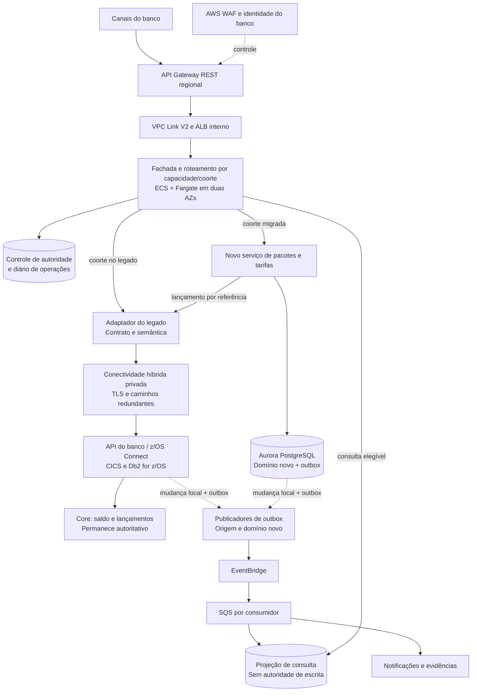
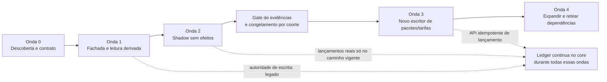
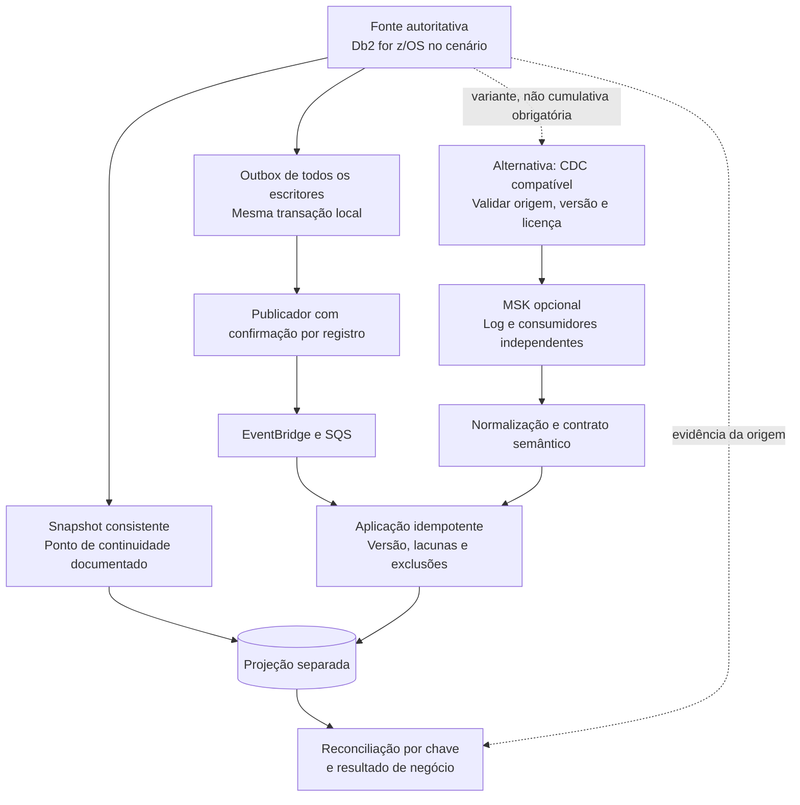
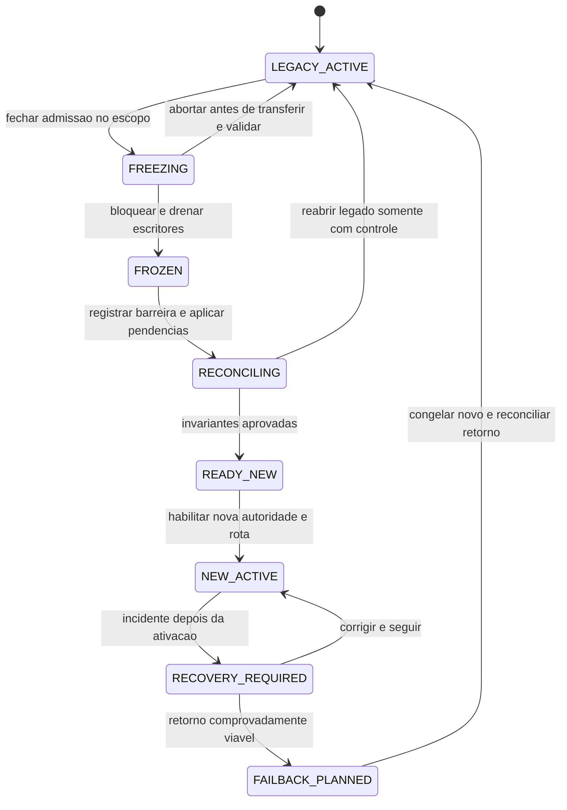
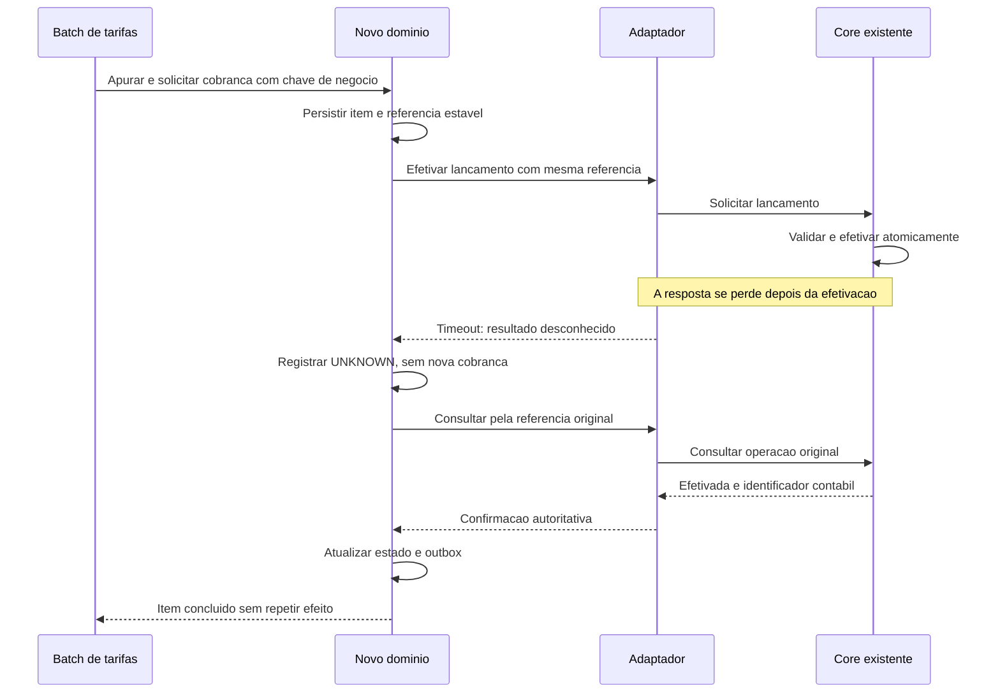
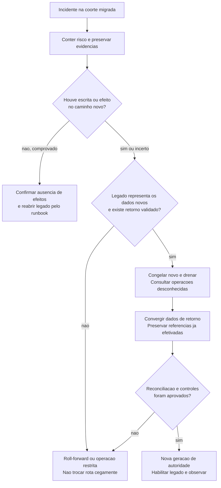
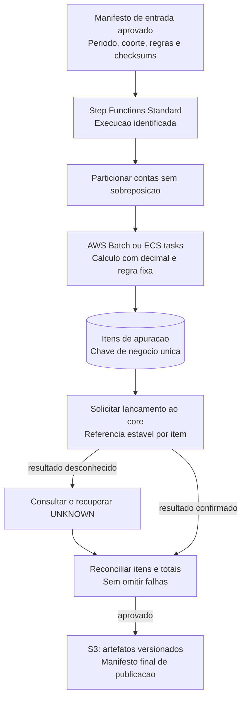
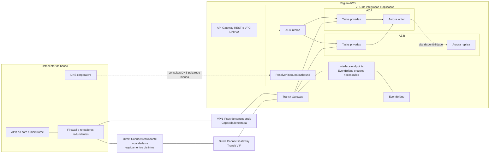

# Case 05 — Modernização de Core Banking na AWS

> **Foco:** mainframe, strangler fig pattern, convivência híbrida, extração de capacidades, consistência, migração de dados e transferência segura de autoridade.  
> **Idioma:** português do Brasil. Nomes dos serviços AWS, produtos e identificadores de código foram preservados.  
> **Formato:** guia de estudo, decisões arquiteturais e simulação de entrevista.  
> **Referências consultadas em:** 28/09/2026.  
> **Caminho sugerido no repositório:** `cases/05-modernizacao-core-banking.md`.

## Como usar este material

Este case continua os estudos de [pagamentos e Pix](01-payment-processing-pix.md), [Open Finance](02-open-finance-apis.md), [Banking Event-Driven](03-banking-event-driven.md) e [KYC e abertura de conta](04-kyc-abertura-de-conta.md). Agora, o desafio é **mudar uma parte do core enquanto o banco continua funcionando**.

A jornada escolhida é a modernização de **pacotes de serviços de conta e apuração de tarifas**, em um banco com mainframe existente. Começaremos por uma fachada e consultas, avançaremos para cálculos em paralelo sem efeitos reais e só depois transferiremos a responsabilidade de escrita de uma capacidade delimitada. Os lançamentos contábeis continuam no core durante essa primeira extração.

Na primeira leitura, percorra as seções 1 a 7 e as decisões da seção 12. Depois estude dados, cutover, batches e falhas. Por último, responda às perguntas sem abrir as respostas e apresente a solução em voz alta.

**Frase central:** “Modernizar não é apenas executar o código em outro lugar. É preservar o significado do negócio enquanto transferimos, de forma controlada, quem pode decidir e gravar cada informação.”

As metas, contratos, nomes de tabelas e políticas deste documento são didáticos. Não se trata de arquitetura oficial AWS, projeto bancário homologado, parecer regulatório ou rubrica oficial de entrevista. L5 é o alvo de preparação informado. O laboratório usa dados fictícios e um simulador de legado; não comprova compatibilidade com um mainframe real.

### Dois níveis de estudo

**Núcleo para defender no quadro:** fronteira de negócio, strangler, integração híbrida, um escritor por escopo, idempotência, validação, cutover e recuperação.

**Aprofundamento:** diferenças entre Db2 for z/OS e Db2 LUW, copybooks, CDC, batches, códigos de caracteres, ferramentas de transformação e detalhes de conectividade. Não é necessário decorar comandos de z/OS; é necessário reconhecer onde envolver especialistas e exigir uma prova de compatibilidade.

---

## Sumário

1. [Problema de negócio e escopo](#s01)
2. [Vocabulário e modelo mental](#s02)
3. [Perguntas antes de desenhar](#s03)
4. [Requisitos, premissas e invariantes](#s04)
5. [Decisões da arquitetura-base](#s05)
6. [Arquitetura e ondas em Mermaid](#s06)
7. [Fluxo explicado em 12 etapas](#s07)
8. [Dados, contratos, outbox e CDC](#s08)
9. [Autoridade, cutover, fencing e failback](#s09)
10. [Mainframe, regras de negócio e processamento batch](#s10)
11. [Papel e posicionamento dos serviços](#s11)
12. [Trade-offs que precisam ser defendidos](#s12)
13. [Rede e conectividade híbrida](#s13)
14. [Segurança, governança e evidências](#s14)
15. [Alta disponibilidade e recuperação regional](#s15)
16. [Desempenho, capacidade e custos](#s16)
17. [Observabilidade, operação e implantação](#s17)
18. [Aplicação dos seis pilares Well-Architected](#s18)
19. [Roteiro de laboratório e testes](#s19)
20. [30 perguntas de entrevista com respostas comentadas](#s20)
21. [Apresentação da solução e simulação de 45 minutos](#s21)
22. [Checklist de domínio](#s22)
23. [Referências e leitura orientada](#s23)

---

<a id="s01"></a>
## 1. Problema de negócio e escopo

### Enunciado inicial

> Um banco brasileiro mantém seu core em um mainframe. Mudanças em produtos dependem de ciclos longos, há conhecimento concentrado em poucas pessoas e a jornada digital exige consultas e evoluções frequentes. A instituição quer modernizar gradualmente na AWS, sem interromper a operação nem perder integridade financeira. Como você descobriria o escopo, desenharia a convivência e migraria uma primeira capacidade?

A resposta não começa com “vamos converter tudo para Java e colocar no EKS”. Primeiro, precisamos saber **qual resultado de negócio justifica a mudança** e qual parte pode ser separada com segurança.

### Ambiente assumido

Para tornar a discussão concreta, vamos assumir IBM Z com z/OS, programas COBOL, transações CICS, Db2 **for z/OS**, arquivos VSAM, jobs JCL e integrações IBM MQ. É uma hipótese do exercício, não uma descrição de todo banco ou de qualquer empregador da candidata. Mainframe é uma plataforma; COBOL é uma linguagem; CICS é um ambiente de processamento transacional. Esses nomes não são intercambiáveis. [Fontes: mainframe][r01], [CICS][r02]

O banco já tem identidade corporativa, equipes de segurança, operação do core, rede e governança. O projeto reutiliza essas capacidades quando adequadas; não as redesenha todas para justificar serviços novos.

### Exemplo concreto: pacote de serviços e tarifa mensal

Uma cliente troca seu pacote de serviços. O banco precisa preservar a data de vigência, as condições contratadas, as regras de isenção e o histórico. No fechamento do período, uma rotina calcula a tarifa e solicita o lançamento ao core.

O projeto pretende permitir mudanças de regras e evolução de canais com menor dependência do ciclo de release do monólito. Entretanto, um cálculo novo não pode gerar uma cobrança duplicada, ignorar uma isenção ou usar a regra de um período errado.

As regras de tarifas aqui são **fictícias**. O produto real, as informações ao cliente, as autorizações e as condições de cobrança precisam ser validados pelas áreas responsáveis. Não usaremos uma regra didática para recomendar cobrança real.

### Fronteira escolhida

| Responsabilidade | Antes | Após a primeira extração completa |
|---|---|---|
| Contratação e vigência do pacote para uma coorte migrada | Legado | Novo serviço de pacotes |
| Regras e apuração de tarifas daquela coorte | Legado | Novo domínio de tarifas |
| Prova da versão de regra e dos dados usados | Legado e arquivos | Evidências versionadas no novo domínio |
| Verificação de saldo e efetivação do lançamento | Core | **Continua no core** |
| Extrato contábil e fonte oficial dos lançamentos | Core | **Continua no core** |
| Consulta de histórico de pacotes | Legado | Projeção/API nova com política de atualidade |
| Outros produtos e coortes ainda não migrados | Legado | Legado |

**Apurar uma tarifa não é debitá-la.** O serviço pode determinar um valor devido; somente a confirmação da operação pelo core permite afirmar que o lançamento ocorreu.

### O que modernizamos — e o que não modernizamos

Nesta onda, extraímos uma capacidade real do core e seu ciclo de mudança. Não substituímos o ledger inteiro, não dividimos débito e crédito em serviços independentes e não declaramos o mainframe aposentado depois de uma API nova.

Uma futura migração do ledger exige outro conjunto de provas: fronteiras de transação, saldo disponível, lançamentos, reservas, fechamento contábil, operações entre coortes e recuperação. Uma saga não entrega isolamento ACID global por simplesmente coordenar duas APIs.

**Critério de sucesso de negócio:** conseguir evoluir a capacidade extraída com autonomia e integridade demonstradas, reduzindo dependências e custo conforme medições. “Quantidade de containers criados” não é o resultado final.

---

<a id="s02"></a>
## 2. Vocabulário e modelo mental

### Separar plataforma, aplicação e dado

Uma analogia útil é reformar uma agência que continua aberta. A recepção pode orientar pessoas entre salas antigas e novas. Mas, se dois caixas atualizarem independentemente o mesmo livro de registro, uma placa indicando o caminho correto não resolve o problema.

Na arquitetura, a **fachada direciona**, a **camada de adaptação traduz** e o **dono da capacidade autoriza a mudança de estado**. A migração precisa tratar os três papéis.

| Termo | Significado neste estudo |
|---|---|
| Core banking | Conjunto de capacidades centrais do banco; não necessariamente um único programa ou banco de dados |
| Mainframe / IBM Z | Plataforma computacional assumida no ambiente de origem |
| z/OS | Sistema operacional assumido no mainframe |
| COBOL | Linguagem de parte das aplicações do legado |
| CICS | Ambiente transacional que hospeda/executa aplicações online; não é o banco de dados |
| Db2 for z/OS | Banco Db2 executado no ambiente z/OS; não é equivalente ao Db2 LUW para fins de conectores |
| VSAM | Tecnologia de organização/acesso a conjuntos de dados no ambiente mainframe |
| JCL | Linguagem usada para definir execução de jobs no ambiente; não substitui a lógica dos programas chamados |
| Copybook | Definição reutilizável de estruturas e campos; importante para interpretar contratos e arquivos |
| EBCDIC / code page | Codificação e mapeamento de caracteres que precisam ser interpretados corretamente |
| COMP-3 | Representação decimal compactada que não pode ser tratada como texto arbitrário |
| IBM MQ | Plataforma de mensageria existente no cenário; não confundir com Amazon MQ |
| Strangler fig | Substituição incremental de capacidades, mantendo convivência durante a transição |
| Fachada | Contrato de entrada estável que encaminha a execução para a implementação adequada |
| Anti-corruption layer | Camada que traduz contratos e semântica entre modelos; “ACL” aqui **não** significa network ACL |
| Coorte | Grupo estável de entidades selecionado para uma onda de migração |
| Autoridade / source of truth | Componente autorizado a decidir e registrar a verdade de um domínio |
| Single writer | Um escritor autorizado por escopo de negócio, não “uma única instância de aplicação” |
| Outbox | Evento registrado na mesma transação local da mudança de negócio |
| CDC | Captura de alterações de dados; seu contrato depende do banco e da ferramenta |
| Snapshot | Fotografia de dados segundo um ponto de consistência definido |
| Watermark / checkpoint | Marcador de progresso cuja semântica precisa estar documentada |
| Shadow | Execução paralela para comparação, **sem efeitos reais de negócio** |
| Cutover | Transferência controlada da operação/autoridade para o novo caminho |
| Fencing | Mecanismo que impede um escritor antigo de continuar alterando dados |
| Epoch | Geração monotônica usada para identificar a autoridade vigente de um escopo |
| Failback | Retorno controlado ao ambiente anterior, com dados e autoridade reconciliados |
| Roll-forward | Corrigir e seguir no novo ambiente quando voltar seria mais arriscado ou inviável |
| Dual run | Coexistência operacional para comparação ou migração; não autoriza duas cobranças reais |
| Reconciliação | Comparação de estados e resultados com regras explícitas de equivalência |

A documentação de modernização da AWS enumera COBOL, copybooks, JCL, CICS, Db2 e VSAM como artefatos distintos da análise; a matriz do ambiente real precisa ser levantada antes da escolha das ferramentas. [Fonte: artefatos de mainframe][r23]

Strangler e anti-corruption layer são padrões complementares: um orienta a substituição progressiva; o outro protege modelos e contratos da propagação de detalhes do legado. [Fontes: strangler][r03], [camada de adaptação][r04]

### Três mudanças diferentes

**Mudar a hospedagem:** executar uma carga em outro ambiente, possivelmente mantendo boa parte de seu desenho.

**Mudar a aplicação:** reorganizar responsabilidades, contratos, ciclo de implantação e operação.

**Mudar a autoridade dos dados:** determinar quem aceita comandos e registra a verdade depois da transição.

Elas podem ocorrer em momentos distintos. Uma API nova na AWS chamando CICS ainda depende do core. Uma réplica de leitura também não torna a AWS responsável por autorizar uma movimentação financeira.

---

<a id="s03"></a>
## 3. Perguntas antes de desenhar

Uma abertura adequada seria:

> “Quero entender qual capacidade precisa mudar e qual benefício esperamos. Depois vou identificar quem escreve seus dados, como os jobs participam, quais contratos não podem mudar e que evidência será necessária para transferir a autoridade sem interromper o banco.”

| Pergunta ao cliente | Como a resposta altera a proposta |
|---|---|
| A meta é velocidade, redução de risco, custo, fim de suporte ou saída de um fornecedor? | Define prioridade e se a migração é a melhor intervenção |
| Qual capacidade tem regra própria e fronteira identificável? | Evita extrair por tabela ou por nome de programa sem autonomia real |
| O que precisa continuar no mainframe nesta onda? | Delimita a convivência e os benefícios possíveis |
| Quais plataformas, versões e licenças existem? | Determina suporte real de runtime, conectores e ferramentas |
| É Db2 for z/OS ou Db2 LUW? Há VSAM/IMS ou outro armazenamento? | Pode mudar completamente a viabilidade de CDC |
| Quem escreve os dados: CICS, JCL, APIs, MQ, operadores, parceiros? | Determina se conseguimos impedir o escritor antigo |
| Podemos modificar os pontos de escrita do escopo? | Viabiliza outbox e controles de cutover; caso contrário, exige alternativa |
| Há regras escondidas em jobs, parâmetros e arquivos? | Amplia descoberta e testes além do código online |
| Existem fechamento diário, mensal, anual e calendário de feriados? | Exige evidências em ciclos representativos, não só testes de um dia |
| Qual é a fronteira contábil atômica? | Determina o que não pode ser separado artificialmente |
| O core aceita referência idempotente e consulta por essa referência? | Define a recuperação após perda de resposta |
| Existe um gateway de APIs ou z/OS Connect já homologado? | Permite reutilizar integração em vez de inventar acesso direto ao banco |
| Qual tráfego aceita dados defasados? Quanto e de forma visível? | Separa projeções de consultas autoritativas |
| Podemos fazer uma pausa curta por coorte para a transferência? | Simplifica cutover; sem pausa o protocolo precisa ser mais sofisticado |
| Uma conta pode mudar de coorte durante um fechamento? | Exige regras de congelamento e ownership por período |
| Qual é a tolerância a divergências monetárias e cadastrais? | Define critérios objetivos de aprovação e bloqueio |
| Como retornar depois que o sistema novo tiver gravado dados? | Expõe requisitos de compatibilidade e failback desde o início |
| Há rede redundante, DNS híbrido e capacidade no caminho de contingência? | Define resiliência da dependência on-premises |
| Qual custo realmente desaparece quando um domínio sair? | Evita confundir redução de chamadas com redução contratual de custo |
| Quem assina o cutover e quem pode cancelá-lo? | Define segregação de funções e comando de incidente |
| Como serão preservadas evidências e atendidas solicitações de privacidade? | Influencia coleta, retenção e acesso aos ambientes de comparação |
| Qual critério permite desligar o componente antigo? | Impede uma convivência permanente sem benefício medido |

Não é necessário fazer todas as perguntas em sequência. Comece pelas respostas que alteram a fronteira de negócio, o mecanismo de dados ou a possibilidade de impedir escritas concorrentes.

---

<a id="s04"></a>
## 4. Requisitos, premissas e invariantes

### Premissas da simulação

As metas abaixo são hipóteses de estudo, não limites da AWS nem garantia de capacidade.

| Categoria | Premissa |
|---|---|
| Capacidade inicial | Pacotes de serviços e apuração de tarifas de contas individuais |
| Origem | COBOL/CICS, Db2 for z/OS, batches JCL; outras tecnologias são mapeadas como dependências |
| Autoridade financeira | Ledger, saldo e efetivação de lançamentos permanecem no core |
| Mudança no legado | Equipe consegue adaptar **todos os escritores do escopo** para outbox e bloqueio de autoridade |
| Integração | API privada existente ou adaptador homologado; core com chave de operação e consulta do resultado |
| Região inicial | `sa-east-1`, sujeita à análise institucional de dados, custo e dependências |
| Disponibilidade local | Duas AZs para aplicação e banco na AWS; resiliência do legado e da rede avaliada separadamente |
| Tráfego | Pico didático de 3.000 consultas/s e 500 comandos/s; jobs são dimensionados à parte |
| Atualidade da projeção | Meta inicial de até 5 segundos para consultas expressamente tolerantes; não para decisões de saldo |
| Latência | Meta didática de p95 até 250 ms para consulta local; caminho híbrido recebe orçamento próprio |
| Migração | Coortes estáveis, com possibilidade de uma janela curta de congelamento de escritas no escopo |
| Critério monetário | Zero divergência monetária não explicada nos casos e fechamentos validados |
| RTO/RPO | Definidos por classe de dado e dependência; não se promete perda zero apenas por usar Multi-AZ |
| Laboratório | Simulador de mainframe e valores fictícios; não se solicita mainframe real para aprender o padrão |

### Invariantes que não podem ser negociadas silenciosamente

1. Há **um escritor autorizado por capacidade e coorte**; réplicas de aplicação desse mesmo dono não violam essa regra.
2. Uma operação recebe uma referência estável, um destino e uma geração de autoridade. Retry não sorteia outro destino.
3. Timeout não prova que o core deixou de efetivar o lançamento.
4. Shadow não pode debitar, publicar notificações reais ou modificar o cadastro autoritativo.
5. Uma projeção não é promovida a escritora só porque está acessível e aparentemente atualizada.
6. Não habilitamos o novo escritor enquanto o antigo ainda puder gravar no mesmo escopo.
7. “Mesma quantidade de linhas” e “mesma soma total” não bastam para aprovar a migração.
8. Reiniciar um batch não pode repetir cobranças já efetivadas.
9. Uma mudança de regra preserva a vigência e o histórico; não reescreve silenciosamente um período encerrado.
10. Retornar ao ambiente antigo depois de novas escritas exige reconciliação e um protocolo, não apenas mudar uma rota.
11. A migração só é encerrada quando os consumidores e jobs restantes tiverem destino definido.
12. Uma falha no mecanismo de autoridade faz o sistema bloquear a mutação incerta; não autoriza “tentar nos dois lados”.

**Premissa que pode invalidar a arquitetura:** descobrir um job que escreve diretamente na tabela sem passar pelo bloqueio. Até corrigir, isolar ou retirar esse escritor, a coorte não pode ser transferida com segurança.

---

<a id="s05"></a>
## 5. Decisões da arquitetura-base

### 5.1 Começar pela capacidade, não pelo produto de migração

Escolhemos **strangler com fachada estável**, e não uma conversão integral do core. O contrato externo muda pouco; a implementação responsável por cada capacidade/coorte muda gradualmente.

O ingresso proposto é **Amazon API Gateway REST regional → VPC Link V2 → ALB interno → serviços em Amazon ECS com AWS Fargate**. A documentação atual permite ALB ou NLB na integração privada REST com VPC Link V2; NLB não é uma obrigação universal. AWS WAF é associado ao estágio REST, e não representado como um servidor intermediário. [Fontes: integração privada][r05], [WAF][r06]

### 5.2 Três responsabilidades de aplicação

**Fachada/roteador:** autentica ou recebe identidade já verificada, autoriza o objeto solicitado, consulta a atribuição de autoridade e fixa o destino da operação. Não decide regras de tarifa.

**Adaptador do legado:** traduz o contrato de domínio para a API do banco, trata códigos de resposta e preserva referências. Pode utilizar uma plataforma existente, como IBM z/OS Connect. Expor APIs para aplicações z/OS é uma capacidade desse produto; detalhes de versão e configuração precisam ser homologados. [Fonte: z/OS Connect][r07]

**Novo serviço de pacotes e tarifas:** assume as regras apenas para coortes formalmente transferidas. Mantém estado relacional, vigência, evidência do cálculo e outbox no Amazon Aurora PostgreSQL.

### 5.3 Separar três tipos de dado

| Armazenamento lógico | Finalidade | Quem pode escrever |
|---|---|---|
| Controle de migração e diário de operações | Coorte, geração, fase da migração, destino fixado, estado do pedido | Controlador autorizado e serviços com papéis delimitados |
| Projeção do legado | Cópia derivada para consultas ou comparação | Aplicador de eventos/importação; **não o usuário final** |
| Domínio novo de pacotes/tarifas | Estado autoritativo das coortes já migradas | Novo serviço sob a autoridade vigente |

Podem começar em esquemas separados para um laboratório. Produção pode exigir bancos ou clusters distintos por isolamento, recuperação e carga. **Compartilhar uma instância não autoriza compartilhar credenciais nem criar duas fontes de verdade.**

Aurora é escolhido pelo modelo relacional, vigências e transações locais. DynamoDB é uma alternativa válida para alguns padrões; não adicionaremos um segundo banco autoritativo ao mesmo dado sem necessidade.

### 5.4 Eventos de convivência

Na base, a equipe adapta os escritores Db2 do escopo para registrar a mudança e a **outbox na mesma transação local**. Um publicador existente ou novo, executado em um gateway de integração, envia eventos ao EventBridge. Filas SQS independentes desacoplam projeção, observabilidade de negócio e consumidores secundários.

No domínio novo, o mesmo princípio usa uma outbox no Aurora. Entrega repetida continua possível; cada consumidor precisa de deduplicação e transições consistentes. [Fonte: transactional outbox][r08]

**Não extrapolar a atomicidade:** inserir algo no Db2 não demonstra que uma alteração em VSAM foi incluída na mesma transação. Sistemas e gerenciadores de recurso precisam ser avaliados. A primeira fatia é deliberadamente restrita a uma fronteira transacional conhecida.

### 5.5 CDC é uma alternativa condicionada, não uma caixa mágica

Se não for possível instrumentar os escritores, investigamos um conector compatível com a origem e suas versões, licenças e logs. Nesta origem específica há uma restrição importante: **AWS DMS com Db2 for z/OS suporta carga completa, mas não CDC**. Db2 LUW possui outro contrato e não deve ser usado como prova de suporte a z/OS. [Fontes: Db2 z/OS][r09], [Db2 LUW][r10]

Por isso, o diagrama-base **não mostra DMS replicando continuamente o Db2 z/OS**. DMS pode ser avaliado para a carga inicial; continuidade usa outbox no cenário assumido, ou uma solução de CDC comprovadamente adequada em uma variante.

### 5.6 Serviços opcionais e situação das ferramentas

MSK só entra quando retenção de log, grupos independentes e replay justificarem sua operação. Step Functions coordena migração e jobs, não cada chamada síncrona ao CICS. AWS Batch pode executar cálculos em container; não traduz JCL automaticamente.

As ferramentas de transformação são aceleradores de descoberta e implementação, não substitutos de validação. AWS Transform for mainframe pode apoiar análise e modernização; o desenho de domínio, a compatibilidade e os resultados de negócio continuam sendo responsabilidades do projeto. [Fonte: AWS Transform][r11]

**Atenção ao ler tutoriais antigos:** na documentação consultada, as experiências managed e self-managed de AWS Mainframe Modernization estão fechadas para novos clientes. Migration Hub Refactor Spaces também não está aberto a novos clientes desde 07/11/2025. Esta proposta não depende desses serviços para uma nova implantação. A disponibilidade de produtos de fornecedores, contas já elegíveis e caminhos de contratação precisa ser verificada no momento do projeto. [Fontes: disponibilidade M2][r12], [aviso em strangler][r03]

---

<a id="s06"></a>
## 6. Arquitetura e ondas em Mermaid

### 6.1 Visão lógica de convivência

As setas representam relações lógicas. Route 53 resolve DNS; WAF e TLS são controles associados ao ingresso. O corpo de toda requisição não atravessa uma sequência “DNS → certificado → IAM”. Rede detalhada aparece na seção 13.



A projeção e o estado do domínio novo são separados. A figura não concede ao aplicador de réplica permissão para sobrescrever o dado autoritativo de uma coorte já migrada.

### 6.2 Ondas e mudança de autoridade



**Mudar uma porcentagem de tráfego não é a mesma coisa que migrar uma porcentagem de contas.** Comandos da mesma entidade precisam de destino estável. Canary aleatório pode ser usado para versões compatíveis de um mesmo serviço, não como substituto da transferência de autoridade.

---

<a id="s07"></a>
## 7. Fluxo explicado em 12 etapas

### Etapa 1 — Descobrir a capacidade e mapear todos os caminhos

Inventariar programas, tabelas, arquivos, jobs, chamadas, filas, operadores e consumidores. Relacionar cada artefato a uma regra de negócio. Um diagrama de código ajuda, mas entrevistas com quem fecha o mês e trata exceções são igualmente necessárias.

**Saída:** mapa de dependências e escritores, lista de riscos, critérios de sucesso e uma primeira fatia viável. Não há cutover enquanto um escritor relevante estiver desconhecido.

### Etapa 2 — Estabilizar o contrato e a integração híbrida

Criar ou reaproveitar a API de pacotes/tarifas. Definir identidades, autorização por conta, códigos de resultado, formato monetário, referências e comportamento de timeout. Testar conectividade, DNS e retorno antes de expandir o tráfego.

**Serviços:** API Gateway, ALB, ECS/Fargate, Direct Connect/VPN, Transit Gateway e Resolver conforme a topologia. Nenhum deles interpreta sozinho o significado de uma transação COBOL.

### Etapa 3 — Colocar a fachada, inicialmente encaminhando ao legado

O canal passa a usar o contrato estável. Inicialmente, todas as escritas continuam no legado. A fachada registra a referência, o destino e a geração da autoridade antes de solicitar a operação.

**Benefício:** mudar os consumidores uma vez e separar sua evolução da implementação. **Risco:** a fachada passa a ser uma dependência crítica; deve ser simples, redundante e observável.

### Etapa 4 — Preparar snapshot e continuidade das alterações

Definir uma extração consistente, transformações e um marco de continuidade. Na base, todos os escritores relevantes registram outbox local. A equipe prova que mudanças durante a carga não se perdem e que exclusões também são representadas.

**Saída:** fotografia identificada, manifesto, ponto de continuidade e retenção suficiente. “Comecei o CDC às 10h” sem semântica de commit não demonstra ausência de lacunas.

### Etapa 5 — Construir e validar a projeção de leitura

Consumidores aplicam eventos com identidade, versão e controles de ordem. A projeção serve apenas consultas autorizadas a usar dados derivados. Respostas incluem atualidade ou o canal apresenta a política acordada.

**Resultado esperado:** reduzir algumas consultas ao legado. Não autorizar débito com saldo copiado nem usar uma projeção antiga para decidir a vigência de uma contratação sem a garantia exigida.

### Etapa 6 — Executar a lógica nova em shadow

A mesma entrada e a mesma versão de regra são avaliadas no motor novo isolado. Comparam-se resultado, arredondamento, justificativa e efeitos esperados. O shadow não possui permissão para efetivar cobranças.

**Saída:** divergências classificadas e resolvidas, incluindo casos raros, períodos e combinações de isenção. Comparar “respondeu HTTP 200” não valida o cálculo.

### Etapa 7 — Selecionar uma coorte e aprovar os gates

Escolher entidades com dependências mapeadas. Garantir que o lote represente cenários reais sem começar pelo risco mais alto. Definir janela, responsáveis, comunicação, critério de abortar e tratamento de operações em andamento.

**Saída:** plano de transferência executável e ensaiado. O registro de coorte não pode mudar silenciosamente no meio de uma apuração mensal.

### Etapa 8 — Bloquear o escritor antigo e transferir a autoridade

Fechar a admissão de novas escritas no escopo, drenar as existentes, resolver resultados desconhecidos e registrar o último ponto consistente. Aplicar o restante das mudanças, reconciliar e só então habilitar o novo escritor com a nova geração.

**Ponto central:** a mudança precisa ser aplicada também no CICS, no batch e nos acessos administrativos pertinentes. Trocar apenas a rota da API não bloqueia o legado.

### Etapa 9 — Executar comandos no novo domínio

A fachada fixa a operação na autoridade nova. O serviço valida vigência e regras, grava sua decisão e outbox na transação local. Consultas críticas usam o estado autoritativo apropriado, não uma réplica cuja atualidade foi presumida.

**Exemplo:** uma troca de pacote registra vigência e condições. Uma apuração cria um item de cobrança, mas ainda não prova que houve lançamento.

### Etapa 10 — Solicitar o lançamento ao core e recuperar incertezas

O adaptador envia a referência de negócio estável ao core. Se a resposta se perder, consulta o resultado dessa referência; não envia o lançamento ao sistema antigo como alternativa nem cria uma nova chave para “destravar”.

**Estados separados:** apurado, enviado, resultado desconhecido, efetivado ou recusado. Retry seguro depende do contrato real do core, não de uma promessa do broker.

### Etapa 11 — Distribuir fatos e manter a compatibilidade necessária

Publicar eventos de mudança confirmada via outbox. Notificação, auditoria e projeções processam independentemente. Um consumidor legado que precise de dados migrados usa API ou uma projeção de compatibilidade, sem recuperar autoridade de escrita.

**Cuidado:** não criar um ciclo no qual a cópia de volta ao legado gera um novo “evento de origem” e retorna como outra alteração no domínio novo.

### Etapa 12 — Observar ciclos, ampliar e desativar com evidências

Comparar SLIs, custo, divergências e fechamentos. Expandir por coortes aprovadas. Retirar jobs e interfaces antigas somente depois de identificar todos os consumidores, atender retenção e testar recuperação.

**Conclusão da onda:** capacidade extraída e dependências retiradas. **Conclusão do programa:** somente quando os critérios de cada domínio e do ambiente completo forem cumpridos.

---
<a id="s08"></a>
## 8. Dados, contratos, outbox e CDC

### 8.1 Uma cópia de tabelas não é um domínio novo

Antes de migrar, identifique chaves de negócio, invariantes, vigências, quem pode corrigir registros e quais valores são derivados. Copiar cinquenta tabelas e dar acesso direto a todos os microserviços pode apenas transportar o acoplamento para a AWS.

Neste case, o domínio novo recebe conceitos como `AccountPackage`, `PricingRuleVersion`, `Assessment` e `PostingRequest`. Eles não precisam reproduzir os nomes abreviados de programas e campos do legado. A tradução pertence ao adaptador, com testes que comprovem equivalência.

### 8.2 Identificadores e valores monetários

Conta, agência e código de produto são identificadores: preservar zeros à esquerda pode ser indispensável. Quantias usam decimal de precisão/escala definidas ou unidades inteiras mínimas quando o produto permitir. Evite ponto flutuante binário para valores que exigem aritmética decimal exata. PostgreSQL oferece `numeric` para valores exatos; a regra de arredondamento continua sendo uma decisão de negócio. [Fonte: tipos numéricos][r13]

Em JSON, podemos transportar a quantia como string decimal e validar rigorosamente. Isso evita que uma biblioteca transforme silenciosamente o valor em um número de ponto flutuante. Não significa que toda API deve adotar esse formato: o contrato tem que ser consistente entre participantes.

Exemplo didático de comando:

```json
{
  "operationId": "op-pacote-000041",
  "accountId": "0000123456",
  "capability": "account-packages",
  "requestedPackageId": "pacote-essencial-demo",
  "effectiveFrom": "2026-10-01",
  "expectedAggregateVersion": 18,
  "requestHash": "sha256:hash-canonico-ilustrativo"
}
```

A identidade do solicitante e sua autorização vêm do contexto autenticado. Não acreditar em um `accountId` só porque ele está presente no corpo.

### 8.3 Registro da operação e execução remota

Para uma nova operação, o roteador grava **destino, escopo, geração e hash do pedido**. O domínio de destino também registra idempotência junto do efeito local. O diário da fachada auxilia a recuperação; não substitui o controle no lugar onde a mudança realmente ocorre.

| Estado do diário | Interpretação |
|---|---|
| `RECEIVED` | Pedido identificado, ainda sem decisão de despacho |
| `ROUTED` | Autoridade/destino fixados para a operação |
| `DISPATCHING` | Pode ter sido enviada ao destino; falha local não prova ausência de execução |
| `UNKNOWN` | Resultado precisa ser consultado no destino fixado |
| `SUCCEEDED` | Evidência autoritativa de conclusão registrada |
| `REJECTED` | Negativa de negócio confirmada |
| `CANCELLED_BEFORE_DISPATCH` | Cancelamento permitido somente com prova de que não foi executada |

Duas chamadas com a mesma chave e dados diferentes geram conflito. Uma chamada repetida com a mesma intenção reaproveita o registro. **Não resetar a chave só porque a tentativa anterior ficou lenta.** O princípio de retries com identidade estável é detalhado pela AWS Builders' Library. [Fonte: APIs idempotentes][r14]

### 8.4 Outbox na origem e no destino

Na base, o programa grava a alteração de pacote e o evento na mesma transação Db2. Todos os pontos de escrita relevantes, incluindo batches, precisam usar esse mecanismo. No novo domínio, a transação Aurora realiza o equivalente.

O publicador lê os registros pendentes e envia ao transporte. Se enviar e cair antes de confirmar a outbox, o evento poderá reaparecer. Portanto, o consumidor registra uma **inbox/deduplicação na mesma transação do efeito aplicado**, quando ambos estiverem no mesmo armazenamento transacional.

Não trate uma chamada de rede a EventBridge como parte automática da transação do banco. A outbox existe justamente para atravessar essa fronteira sem uma janela silenciosa de perda.

Exemplo de evento de domínio:

```json
{
  "eventId": "evt-pacote-000819",
  "eventType": "AccountPackageChanged",
  "schemaVersion": 1,
  "aggregateId": "account:0000123456",
  "aggregateVersion": 19,
  "authorityEpoch": 7,
  "sourceSystem": "legacy-packages",
  "operationId": "op-pacote-000041",
  "occurredAt": "2026-09-28T14:00:00Z",
  "data": {
    "packageId": "pacote-essencial-demo",
    "effectiveFrom": "2026-10-01"
  }
}
```

O exemplo é o contrato do evento, não a estrutura completa de `PutEvents`. O envelope do transporte pode envolvê-lo em `detail`. Identidade, versão e origem acompanham o evento; não se usa apenas o horário de chegada como ordem de negócio.

### 8.5 Publicação e consumo com confirmação explícita

O publicador examina falhas **por entrada** de `PutEvents`. HTTP bem-sucedido não significa que todas as entradas do lote foram aceitas. Só confirma os registros aceitos e repete as falhas com política controlada. [Fonte: PutEvents][r15]

Cada consumidor independente recebe sua fila. Não colocar atualização de projeção e notificação em uma única fila esperando que ambos recebam tudo. SQS Standard admite duplicatas; exclusão da mensagem ocorre depois de aplicar duravelmente o efeito. [Fonte: entrega SQS][r16]

Para eventos por agregado, usar uma destas estratégias, explicitamente escolhida:

| Contrato | Tratamento |
|---|---|
| Eventos com delta que exigem sequência | Só aplicar a próxima versão; manter lacunas pendentes e recuperar o faltante |
| Estado completo com versão monotônica | Aplicar somente versão mais nova, desde que sobrescrever não apague fatos históricos necessários |
| Eventos de lançamentos/histórico | Preservar cada fato; não descartar a versão anterior apenas porque chegou outra |

Uma condição `version > currentVersion` sozinha é insuficiente para um consumidor que precisa somar todos os deltas. A versão 21 não contém necessariamente o efeito perdido da versão 20.

### 8.6 Carga inicial com continuidade

Uma estratégia válida precisa explicar **de onde começa a fotografia, quais commits ela inclui e de onde a captura prossegue**. Há opções com snapshot consistente e checkpoint fornecidos por ferramentas, ou com uma pausa controlada por escopo. Não é necessário construir um protocolo caseiro se a plataforma já oferece um mecanismo homologado.

Procedimento conceitual:

1. Ativar/verificar captura de todas as mudanças relevantes antes de iniciar a fotografia.
2. Estabelecer um ponto de consistência documentado e um identificador da extração.
3. Exportar dados e manifesto, mantendo as mudanças posteriores disponíveis.
4. Importar a fotografia em área separada, sem torná-la autoritativa.
5. Aplicar mudanças segundo o contrato de continuidade, tratando interseção/duplicidade.
6. Provar que não há lacunas e reconciliar dados e resultados antes de servir ou transferir a operação.

**Também fazem parte da transferência:** registros de idempotência, referências de operações, histórico de vigência e evidências necessárias à recuperação. Migrar apenas o estado atual do pacote pode permitir que um retry antigo se torne uma nova operação. A identidade financeira utilizada no core permanece a mesma depois da mudança de dono.

**Cuidado com `MAX(id)`:** um identificador crescente pode ser reservado antes do commit. Duas transações podem confirmar fora dessa ordem. Um publicador que “já leu até 102” não pode ignorar para sempre o 101 que confirmou depois. Use varredura de pendências ou checkpoint com semântica de commit garantida; teste a concorrência.



A variante CDC não presume que o conector seja DMS. Para **esta** origem, DMS não fornece CDC. A verificação da matriz por banco, versão, tipo de dado e modo de carga é um gate de arquitetura, não uma tarefa deixada para o dia do cutover.

### 8.7 CDC não é automaticamente um evento de negócio

Uma alteração em `TB_PCT` não diz, por si só, se houve contratação, correção administrativa, reprocessamento, expiração ou migração. Um consumidor não deve transformar toda alteração de linha em uma nova cobrança.

Para a variante CDC, documente transações, tabelas relacionadas, deletes, DDL, LOBs, chaves, ordenação, retenção de logs, permissões e impacto na origem. Uma atualização que envolva várias tabelas pode precisar ser reconstruída antes de expor um estado coerente.

MSK pode servir como log para consumidores independentes, mas não descobre essas regras sozinho. Da mesma forma, instalar um conector genérico não prova suporte a Db2 for z/OS ou a VSAM. [Fonte: MSK][r17]

### 8.8 Reconciliação que detecta erros relevantes

Verificar contagem é útil, mas insuficiente. Uma migração com duas contas trocadas pode conservar a quantidade de registros e a soma das tarifas.

| Verificação | Erro que ajuda a detectar |
|---|---|
| Chave, campo e versão por entidade | Troca de conta, valor errado, atualização faltante |
| Vigência e histórico | Regra correta aplicada ao período errado |
| Quantias e política de arredondamento | Centavos divergentes ou truncamento |
| Inclusões e exclusões | Registros “ressuscitados” ou perda de cancelamentos |
| Fechamento por produto/coorte/período | Duplicação, lacunas e classificação errada |
| Referência de lançamento e status no core | Cálculo concluído sem efetivação, ou efeito duplicado |
| Amostra de casos raros mais testes completos de invariantes | Isenções, reversões e combinações pouco frequentes |

A validação de dados oferecida por ferramentas como DMS é um instrumento adicional. Ela não demonstra equivalência de regras COBOL, calendário, autorização ou fechamento financeiro. [Fonte: validação DMS][r18]

---

<a id="s09"></a>
## 9. Autoridade, cutover, fencing e failback

### 9.1 Quem pode escrever?

Defina o escopo com precisão. Exemplo: capacidade `account-packages`, coorte `coorte-001` e conjunto fixado de contas. Para cobrança por período, a atribuição do processamento daquele período também precisa ser estável.

```json
{
  "capability": "account-packages",
  "cohortId": "coorte-001",
  "phase": "LEGACY_ACTIVE",
  "owner": "legacy-packages",
  "authorityEpoch": 7,
  "admission": "OPEN",
  "membershipVersion": 3,
  "changeRequestId": "mig-2026-001"
}
```

O registro é uma decisão de controle. **Ele não é um bloqueio mágico distribuído.** Os escritores precisam rejeitar operações sem a autoridade correspondente, e o protocolo deve impedir que um serviço antigo continue aceitando chamadas de clientes em cache.

### 9.2 Fixar o destino da operação

O cliente não escolhe o backend. A fachada obtém o escopo do contexto autorizado, resolve a autoridade e grava a associação para uma operação nova. A condição de unicidade impede dois registros conflitantes para a mesma intenção.

Quando a operação já existe, a rota histórica prevalece sobre a nova regra global. Se a antiga autoridade já estiver encerrando o escopo, consulte ou reconcilie a operação; não a reexecute no novo destino sem um procedimento que prove ausência de efeito e transfira o registro com segurança.

Uma solicitação recebida durante a pausa pode ser recusada temporariamente ou aceita de forma durável como **pendente de despacho**, conforme o contrato. Receber `202` nesse caso não significa que a troca de pacote já ocorreu.

### 9.3 O que significa fencing de verdade

Uma `authorityEpoch=8` no cabeçalho só ajuda se o destino a verificar. São necessários controles nos pontos de escrita: verificação transacional local, desabilitação dos jobs do escopo, permissões adequadas, encerramento dos antigos despachantes e barreiras de implantação.

Para um banco relacional, o bloqueio de admissão deve sincronizar com as transações em execução. Este fragmento **conceitual PostgreSQL** ilustra a ideia local; não é código de cutover para copiar para Db2:

```sql
-- Caminho de escrita local: transação curta, sem chamada externa no meio.
BEGIN;
SELECT admission, authority_epoch
  FROM writer_gate
 WHERE scope_id = :scope_id
 FOR SHARE;
-- A aplicação verifica OPEN e a geração esperada.
-- Em seguida grava idempotência, mudança de negócio e outbox.
COMMIT;

-- Controlador: precisa esperar escritores locais que mantêm o bloqueio.
BEGIN;
SELECT admission
  FROM writer_gate
 WHERE scope_id = :scope_id
 FOR UPDATE;
UPDATE writer_gate
   SET admission = 'FROZEN'
 WHERE scope_id = :scope_id;
COMMIT;
```

No PostgreSQL, locks de linha têm modos compatíveis/conflitantes e são liberados no término da transação. O desenho real precisa testar bloqueios, isolamento, deadlocks e o comportamento após a espera. [Fonte: locking][r19]

O gate não resolve uma chamada ao core que saiu antes do congelamento e ainda está em resultado desconhecido. O procedimento também precisa drenar despachos e consultar operações remotas antes de transferir o escopo.

**Condição de interrupção:** se um operador, batch ou versão antiga de serviço puder ignorar o gate e gravar, o cutover não está pronto. Confiança em boa intenção não substitui controle no ponto de mutação.

### 9.4 Runbook de transferência por coorte

| Ordem | Ação | Evidência para prosseguir |
|---|---|---|
| 1 | Validar coorte, dependências, responsável e plano aprovado | Inventário, membership e versão do plano fixados |
| 2 | Fechar admissão de novos comandos no escopo | API e despachantes conhecem a pausa; comandos aceitos ficam duráveis |
| 3 | Bloquear escritores antigos, inclusive batch e administrativo | Gates, permissões e jobs verificados |
| 4 | Drenar transações e resolver `UNKNOWN` | Nenhum efeito remoto em dúvida para a fronteira transferida |
| 5 | Capturar barreira final de commits/eventos | Snapshot/checkpoint com semântica documentada |
| 6 | Aplicar todas as mudanças até a barreira | Ausência de lacunas e pendências relevantes |
| 7 | Reconciliar dados e invariantes | Relatório aprovado; divergências críticas zeradas |
| 8 | Preparar o novo dono com nova geração | Dado íntegro e gate novo ainda controlado |
| 9 | Habilitar o novo dono e publicar o roteamento | Antigo segue bloqueado; apenas um caminho aceita mutação |
| 10 | Liberar admissão e observar | SLIs, referências e transações de prova dentro dos critérios |
| 11 | Manter compatibilidade e evidências | Consumidores antigos funcionam sem reabrir autoridade |
| 12 | Encerrar a onda ou executar recuperação aprovada | Responsáveis confirmam o estado e a próxima ação |

Não há uma transação ACID entre o roteador, os dois bancos e o core. A sequência tolera pausas e falhas entre passos: **é preferível nenhum escritor por alguns instantes a dois escritores concorrentes**. O controlador é retomável e registra cada transição de forma idempotente.



As setas de retorno representam **procedimentos condicionados**, não atalhos automáticos. O estado final do controlador não prova sozinho a condição dos bancos; o controlador verifica os participantes antes de avançar.

### 9.5 Timeout depois de uma cobrança



O evento de timeout não autoriza estornar nem recalcular com uma nova chave. A política de consulta e retry precisa respeitar o comportamento do core e a possibilidade de uma confirmação tardia.

### 9.6 Rollback de código não é retorno de dados

| Ação | Quando pode fazer sentido | O que não garante |
|---|---|---|
| Voltar a imagem anterior do serviço | Contrato e esquema continuam compatíveis | Desfazer dados já gravados |
| Voltar consultas para a fonte antiga | Fonte continua íntegra e tem capacidade | Voltar comandos com segurança |
| Reabrir o legado antes de qualquer escrita nova | Novo nunca assumiu efeitos e estado foi conferido | Que não houve operação em trânsito |
| Failback depois de escritas novas | Há transformação reversa válida, convergência e bloqueio do novo escritor | Simplicidade equivalente a mudar DNS |
| Roll-forward | Corrigir no novo ambiente preserva melhor os dados | Dispensa investigação ou comunicação |

Uma restauração de backup antigo pode apagar contratações novas e referências de cobranças. Um redirecionamento para esse backup não é uma recuperação financeiramente correta.

### 9.7 Decisão de failback



Uma coorte que usa uma funcionalidade sem representação no legado pode não ter failback disponível. Isso deve ser aceito antes da liberação da funcionalidade, e não descoberto durante o incidente.

---

<a id="s10"></a>
## 10. Mainframe, regras de negócio e processamento batch

### 10.1 Não tratar o mainframe como uma caixa preta uniforme

Mapeie **transações online**, **processamento batch**, **armazenamento**, **segurança**, **mensageria** e **ferramentas operacionais** separadamente. É possível modernizar interfaces e práticas no próprio ambiente antes de decidir deslocar todas as cargas.

O novo serviço não precisa conhecer o nome de cada transação CICS. O adaptador pode apresentar uma API de negócio, preservar correlação e traduzir erros técnicos em estados compreensíveis. Essa camada deve ser testada com os especialistas do legado, não improvisada só pela equipe de cloud.

### 10.2 Regras que costumam escapar de uma tradução superficial

| Tema | Pergunta de validação |
|---|---|
| Vigência | A regra vale pela data da solicitação, do evento ou do fechamento? |
| Calendário | Fim de semana e feriado alteram a competência ou apenas o processamento? |
| Arredondamento | Arredonda por item, por conta ou no total? Em qual etapa? |
| Isenção | É por pacote, perfil, relacionamento ou período? Como é auditada? |
| Reprocessamento | Reaplicar a mesma entrada deve repetir a mesma decisão ou usar uma regra corrigida? |
| Dados ausentes | Espaço, zeros, código sentinela e `null` têm o mesmo significado? |
| Ordenação | Comparações dependem da collation ou de uma code page específica? |
| Correção retroativa | Corrige registro antigo ou cria ajuste rastreável? |
| Data operacional | O “dia bancário” é igual ao dia de calendário e ao fuso do servidor? |
| Limite numérico | Sinal, escala e overflow têm tratamento equivalente? |

Uma conversão que compila não responde a essas perguntas. A documentação de tipos e collations pode ajudar, mas a equivalência depende dos contratos reais e de casos de teste autorizados.

### 10.3 Copybooks, EBCDIC e estruturas numéricas

Não aplicar uma conversão UTF-8 indiscriminada ao arquivo inteiro. Um registro pode combinar texto em uma code page, números compactados e campos binários. O layout identifica quais bytes pertencem a cada campo.

O pipeline de transformação deve especificar origem, layout/versão, tamanho esperado, validação de campo e representação de destino. Conteúdos inválidos vão para investigação; não corrigir silenciosamente um identificador de conta para fazer o import terminar.

Zeros à esquerda, caracteres acentuados e ordenação precisam de testes. “Os dados aparecem legíveis” é evidência visual limitada, não prova de equivalência semântica.

### 10.4 Do JCL ao workflow

Migrar um job não é somente trocar `JOB` por `cron`. Descubra dependências, arquivos de entrada, condições de retorno, checkpoints, retries, janelas de indisponibilidade e integração com o fechamento.

No desenho proposto, Step Functions Standard coordena preparação, execução, validação e publicação. AWS Batch ou tasks ECS executam programas containerizados. O workflow não converte COBOL ou JCL por conta própria. Standard é adequado a coordenação durável e etapas longas; sua semântica não torna o efeito externo de uma task automaticamente único. [Fontes: Step Functions][r20], [AWS Batch][r21]

### 10.5 Um batch reiniciável de tarifas



A chave de unicidade de uma cobrança precisa representar **o fato de negócio**, por exemplo:

```text
accountId + feeConcept + competencePeriod + chargeKind
```

Não incluir `runId` na chave de uma cobrança ordinária: um novo run poderia gerar a mesma tarifa novamente. A versão de regra é evidência do cálculo, mas não deve, sem política explícita, permitir uma segunda cobrança ordinária do mesmo conceito e período.

Uma correção pode gerar um **ajuste separado**, autorizado e ligado à cobrança original. O ajuste tem sua própria identidade de negócio e não apaga o lançamento anterior.

### 10.6 Arquivos e publicação atômica para consumidores

S3 não é um filesystem POSIX para o qual se copia mecanicamente a lógica de diretórios compartilhados e locks de arquivo. Defina um protocolo: objetos de saída versionados, checksum, número esperado de itens, soma de controle e **manifesto final publicado apenas após aprovação**.

```json
{
  "manifestId": "tarifas-coorte001-2026-09-v1",
  "cohortId": "coorte-001",
  "period": "2026-09",
  "inputSnapshotId": "snapshot-0094",
  "ruleVersion": "pricing-demo-12",
  "status": "VALIDATED",
  "expectedAccountCount": 12000,
  "ordinaryChargeCount": 10340,
  "exemptAccountCount": 1660,
  "totalAmount": "103400.00",
  "currency": "BRL",
  "outputObjectVersion": "version-id-ilustrativo"
}
```

Os números são fictícios. Contagem e total no manifesto são controles adicionais; ainda é preciso validar por chave, regra e referência de lançamento.

Se um sistema antigo exige SFTP, AWS Transfer Family pode ser uma opção de transporte para S3/EFS, conforme o protocolo suportado. Ele não interpreta copybooks, valida regras de cobrança nem garante que um arquivo parcial seja uma publicação final. [Fonte: Transfer Family][r22]

### 10.7 Limite do shadow e do dual run

Comparar cálculos de duas implementações é útil. Fazer as duas debitarem para “ver se bate” não é. O ambiente de comparação deve usar destinos isolados, identidades sem permissão financeira e notificações desabilitadas por controle, não só por convenção.

Também não usar o resultado de um shadow que consultou dados em momentos diferentes para afirmar que a lógica está errada. Congele os insumos da comparação, registre a versão e classifique diferenças de tempo, dado, regra e implementação.

### 10.8 Ferramentas de análise e transformação

AWS Transform e ferramentas especializadas podem auxiliar descoberta, documentação, tradução e testes. O plano inclui revisão humana, análise de dependências, benchmarks e reconciliação dos resultados. [Fonte: documentação Transform][r23]

Uma biblioteca proprietária, uma interação com hardware, uma macro assembler ou um comportamento de runtime podem exigir trabalho específico. Não prometa “converter o core em um clique”. Também não assuma que uma instância EC2 comum executará nativamente z/OS e seus binários: arquitetura, runtime e licenciamento precisam ser explicitamente resolvidos.

---
<a id="s11"></a>
## 11. Papel e posicionamento dos serviços

O desenho não exige todos os serviços ao mesmo tempo. A tabela separa núcleo, dependências e alternativas.

| Componente | Papel na proposta | Onde aparece | O que não resolve sozinho |
|---|---|---|---|
| Amazon Route 53 | Resolução dos domínios | Serviço DNS, fora das sub-redes da aplicação | Transferência da autoridade dos dados |
| Amazon API Gateway REST | Contrato de entrada, autenticação integrada e limites | Serviço regional gerenciado | Interpretar regras COBOL ou garantir idempotência no core |
| AWS WAF | Proteção de requisições web conforme regras | Associado ao estágio REST | Autorização por conta ou segurança de toda conexão híbrida |
| VPC Link V2 | Integração privada entre API e backend | Conecta o ingresso ao load balancer | Conexão direta com o datacenter por si só |
| ALB interno | Distribuir HTTP/HTTPS para targets saudáveis | Sub-redes privadas de duas AZs | Decidir quem pode gravar uma coorte |
| Amazon ECS / AWS Fargate | Executar fachada, serviços e adaptadores | Tasks nas sub-redes privadas | Hospedar binários z/OS sem runtime compatível |
| Amazon ECR | Armazenar imagens e versões da aplicação | Serviço regional | Atualizar uma task apenas porque uma imagem foi enviada |
| Amazon Aurora PostgreSQL | Estado relacional, diário e transações locais | Sub-redes privadas, writer e réplica em AZs diferentes | Transação ACID abrangendo o core e todos os serviços |
| AWS Lambda | Aplicadores, validações e automações pequenas | Fora da VPC por padrão ou conectada quando necessário | Jobs arbitrariamente longos ou runtime COBOL completo |
| Amazon EventBridge | Roteamento de eventos de convivência | Barramento regional | Preservar ordem global ou validar regra financeira |
| Amazon SQS | Buffer e recuperação por consumidor | Serviço regional, acesso por endpoint conforme desenho | Processamento único do efeito externo |
| Amazon S3 | Extratos de migração, manifestos e evidências | Armazenamento regional de objetos | Filesystem compartilhado equivalente ao legado |
| AWS Step Functions Standard | Orquestrar migração e processamento batch | Serviço regional | Substituir o controle de escrita dos participantes |
| AWS Batch | Executar cargas batch containerizadas | Ambiente de computação configurado | Converter JCL ou impedir cobrança duplicada |
| AWS Direct Connect | Conectividade dedicada híbrida | Datacenter, localidades DX e AWS | Criptografia automática de todo o tráfego |
| AWS Site-to-Site VPN | Caminho IPsec, primário ou complementar | Rede híbrida/VGW/TGW conforme topologia | Mesma capacidade e latência do DX sem testes |
| AWS Transit Gateway | Agregar rotas e attachments | Serviço regional de rede | Autorização de negócio ou tradução de protocolos |
| Route 53 VPC Resolver | Resolver nomes entre ambientes | Endpoints inbound/outbound em VPC | Criar a conectividade que transporta esses pacotes |
| AWS KMS / Secrets Manager | Chaves gerenciadas e segredos | Serviços gerenciados | Revogar permissões indevidas dentro de um programa legado |
| CloudWatch / CloudTrail | Telemetria AWS e auditoria de chamadas cobertas | Serviços gerenciados | Registrar automaticamente todas as decisões financeiras |
| AWS DMS | Carga/migração conforme suporte da origem | Recurso/serviço configurado para acessar os endpoints | CDC de Db2 for z/OS no suporte nativo consultado |
| Amazon MSK | Log para streaming e múltiplos grupos | Cluster/acesso em rede conforme modalidade | Tornar todo conector compatível com mainframe |
| AWS Transform | Apoiar análise e modernização | Ferramenta do projeto | Provar equivalência funcional e financeira |
| AWS Transfer Family | Transferir arquivos pelos protocolos suportados | Endpoint de transferência | Interpretar semanticamente um arquivo bancário |
| IBM z/OS Connect / gateway existente | Integrar APIs com aplicações z/OS | Ambiente do banco | Converter o core inteiro em microserviços |
| IBM MQ | Integração existente, quando usada | Ambiente legado ou deployment específico | Ser automaticamente substituído por Amazon MQ |

**Amazon MQ não é IBM MQ gerenciado.** A documentação de Amazon MQ apresenta os engines ActiveMQ Classic e RabbitMQ. Reaproveitar aplicações IBM MQ exige analisar protocolo, API, semântica, operação e licenças; o nome parecido não demonstra compatibilidade. [Fonte: Amazon MQ][r24]

ECS Cluster é um agrupamento lógico. As tasks Fargate recebem interface de rede e são associadas às sub-redes. Não desenhe o cluster como se fosse o recurso que cria ou contém as sub-redes de rede. [Fonte: rede Fargate][r25]

---

<a id="s12"></a>
## 12. Trade-offs que precisam ser defendidos

### 12.1 Reter, mover, adaptar ou substituir?

Os “Rs” ajudam a organizar estratégias, não a decretar uma única abordagem para todo o banco. Uma aplicação pode permanecer, outra ser substituída por produto e uma terceira ser refatorada. [Fonte: estratégias de migração][r26]

| Escolha | Pode fazer sentido quando | Principal cuidado |
|---|---|---|
| Retain: manter | O domínio é estável e o benefício de mudança não paga o risco | Não confundir decisão consciente com abandono de suporte |
| Retire: retirar | A capacidade não tem consumidores nem obrigação operacional remanescente | Provar ausência de uso, inclusive sazonal |
| Rehost/replatform | O objetivo é alterar a plataforma preservando grande parte do comportamento | Validar runtime, licenças e dependências, especialmente em mainframe |
| Refactor/re-architect | Precisamos de fronteiras, autonomia e evolução estrutural | Investimento maior em descoberta e validação |
| Repurchase | Produto especializado atende melhor ao negócio | Migração de dados, integração e lock-in contratual |
| Relocate | A tecnologia de origem suporta deslocamento do ambiente com poucas mudanças | Não presumir aplicabilidade a qualquer plataforma |

Para o cenário, escolhemos refatoração incremental de uma capacidade e retenção temporária do ledger. Não é necessário adotar todos os Rs no mesmo projeto.

### 12.2 Strangler versus big bang

Strangler reduz o escopo de cada transferência e permite aprender com coortes. Em troca, mantém convivência, duplicidade temporária de operação e adaptação entre modelos. Big bang elimina uma parte dessa convivência, mas concentra risco, validação e janela de mudança.

A escolha de strangler não garante que cada corte seja pequeno: uma transação muito acoplada pode exigir refatoração interna antes de existir uma fronteira transferível.

### 12.3 Fachada versus acesso direto às tabelas

API de negócio preserva autorização, regras e compatibilidade. Leitura direta pode ser útil para extração controlada, mas expõe detalhes internos. Escrita direta no Db2 para “evitar o CICS” pode ignorar validações e processos que antes garantiam integridade.

O plano usa acesso de migração com permissões restritas e API de domínio para mutações de negócio. São propósitos e identidades diferentes.

### 12.4 Outbox versus CDC

| Critério | Outbox no escritor | CDC compatível com a origem |
|---|---|---|
| Mudança na aplicação | Normalmente necessária nos escritores | Pode reduzir alterações de código, dependendo da solução |
| Semântica | Pode publicar fatos de domínio explícitos | Frequentemente começa por mudanças de dados |
| Cobertura | Falha se algum escritor não gerar evento | Depende dos objetos, logs e tipos suportados |
| Atomicidade | Local à mudança e ao registro da outbox | Depende da captura e da exposição dos commits |
| Operação | Pendências, republicação e deduplicação | Logs, checkpoints, lag, retenção e conectores |
| Escolha da base | Sim: equipe pode adaptar a fatia Db2 | Alternativa quando houver prova de suporte |

Nenhuma das opções torna o consumidor exatamente uma vez. Não misturar dois mecanismos sobre o mesmo dado sem identidade, escopo e prevenção de duplicidade/loops bem definidos.

### 12.5 EventBridge/SQS versus MSK

EventBridge e filas funcionam bem para distribuir fatos a consumidores independentes e absorver indisponibilidades. MSK pode ser justificado por retenção de stream, replay frequente e múltiplos grupos com controle de posição.

“É um banco” não é justificativa suficiente para Kafka. O argumento deve incluir volume, acesso ao histórico, experiência operacional e necessidade de partições/ordem. Um log Kafka também não substitui a evidência autoritativa de que o core efetivou uma operação.

### 12.6 ECS/Fargate versus Lambda versus EKS

**ECS/Fargate:** base para adaptadores e serviços de longa duração, bibliotecas específicas, pools e controle de concorrência. Ainda exige empacotar corretamente a aplicação e entender limites das dependências.

**Lambda:** adequada a consumidores e automações curtas. A concorrência precisa proteger bancos e o legado; não usar autoscaling irrestrito contra uma API CICS limitada.

**EKS:** adequado quando já há plataforma Kubernetes madura ou requisitos concretos que a justifiquem. Não torna o protocolo de migração mais correto só por oferecer mais recursos de infraestrutura.

### 12.7 Aurora versus DynamoDB

Aurora é a base por relações, vigências e transações locais entre estado, idempotência e outbox. DynamoDB pode atender um diário ou domínio desenhado para padrões de acesso conhecidos, com operações condicionais.

A pergunta é “quais invariantes e consultas precisamos?”, não “qual banco é mais moderno?”. Evite acrescentar ambos por hábito e depois precisar sincronizar dois donos do mesmo estado.

### 12.8 Replicação de leitura versus transferência de escrita

Mover consultas pode trazer valor antes da extração completa. Porém, reduzir a carga de leitura do mainframe não prova que o domínio já está independente. Uma consulta sem tolerância a defasagem precisa de fonte e contrato apropriados.

Transferir escrita exige bloquear a origem e provar a integridade do novo dono. Esse passo tem um risco diferente de alterar a origem de um dashboard.

### 12.9 Roteamento aleatório versus coortes estáveis

Canary por porcentagem é útil para comparar versões compatíveis do mesmo serviço. Para dois donos possíveis de um dado, rotear cada chamada ao acaso pode dividir uma transação entre ambientes.

A base usa coorte e capacidade estáveis, validação no escritor e destino fixado por operação. Um feature flag pode ajudar a distribuir configuração, mas não é um lock financeiro.

### 12.10 Migração sem pausa versus pausa curta por escopo

Uma pausa delimitada simplifica drenagem, última cópia e reconciliação. Uma transferência sem interrupção exige protocolo mais complexo de encaminhamento, operações em voo e autoridade, além de testes adicionais.

A decisão pertence ao requisito de negócio. Não prometer “zero downtime” como propriedade automática do strangler. Defina indisponibilidade percebida, aceitação de pedidos e tempo de conclusão separadamente.

### 12.11 Corrigir divergência versus reproduzir um bug

Nem toda diferença entre novo e antigo é erro do novo. O legado pode ter comportamento inadequado. Entretanto, corrigir durante a migração sem aprovação mistura mudança funcional com transferência técnica.

Classifique a divergência, registre a política aprovada e preserve a rastreabilidade. Uma correção deliberada tem caso de teste, comunicação e tratamento de dados; não é uma exceção escondida no comparador.

### 12.12 Ferramentas gerenciadas versus integração própria

Preferir capacidade existente e suportada quando ela reduz risco. Mas verificar elegibilidade, regiões, contratos e disponibilidade. Um tutorial antigo não é evidência de que uma conta nova consegue contratar o mesmo serviço hoje.

A parte própria da proposta — facade, contratos, autoridade e validação — não desaparece porque se contrata uma ferramenta de conversão.

---

<a id="s13"></a>
## 13. Rede e conectividade híbrida

### 13.1 Topologia conceitual



O diagrama simplifica attachments e tabelas de rotas. Ele não significa que se configura “Transit Gateway dentro da subnet” nem que Direct Connect termina diretamente em uma task.

### 13.2 Direct Connect, DX Gateway e Transit Gateway

Nesta variante, o caminho usa **transit VIF → Direct Connect Gateway → Transit Gateway → VPC**. O desenho precisa de anúncios BGP, prefixos permitidos, rotas de ida/volta, segmentação e configuração dos attachments. [Fonte: associação DX/TGW][r27]

Um único circuito ou uma única localidade DX não atende automaticamente ao objetivo de resiliência. A documentação de resiliência do Direct Connect discute conexões em equipamentos/localidades diferentes e testes de failover. O SLA do componente não é o SLA do sistema bancário inteiro. [Fonte: resiliência DX][r28]

### 13.3 Link privado não significa tráfego cifrado

**Direct Connect não cifra o tráfego por padrão.** Use TLS de aplicação e, conforme a necessidade, VPN IPsec sobre a conectividade ou outras opções suportadas. MACsec, quando aplicável, protege um trecho específico e não deve ser apresentado como criptografia fim a fim de todas as dependências. [Fonte: criptografia DX][r29]

O caminho de contingência precisa ser testado com volume, MTU, timeouts, latência, jitter e firewall. Duas sessões BGP funcionando não demonstram que o fechamento mensal terminará pela VPN.

### 13.4 DNS híbrido

Route 53 VPC Resolver inbound permite consultas de origem externa para nomes resolvidos no contexto AWS; outbound encaminha consultas de workloads AWS a resolvedores externos conforme regras. Os endpoints dependem de conectividade e permissões de rede; não substituem DX/VPN. [Fonte: Resolver][r30]

Teste resolução e conexão separadamente. Um `nslookup` bem-sucedido não prova que a porta do serviço está acessível, que o certificado é válido ou que a transação foi autorizada.

### 13.5 Endpoints privados e uma armadilha com S3

O publicador on-premises pode alcançar um **interface endpoint do EventBridge** pela conectividade híbrida, com DNS e políticas apropriadas. IAM continua necessário; rede privada não concede permissão de `PutEvents`. [Fonte: endpoint EventBridge][r31]

Para S3, não presumir que um **gateway endpoint** da VPC é utilizável diretamente pelo datacenter através de DX, VPN ou TGW. A documentação restringe esse acesso. Para o caso híbrido, avaliar interface endpoint e resolução de nomes apropriados, ou outro caminho autorizado. [Fonte: endpoints S3][r32]

No ingresso privado do API Gateway, configurar HTTPS explicitamente quando exigido: usar VPC Link não implica que o trecho interno já esteja cifrado. Verificar hostname, certificado e configuração do backend conforme a integração. [Fonte: integração privada][r05]

Tasks locais que precisam de imagens ECR, logs e segredos também precisam de caminhos de saída: endpoints pertinentes e/ou NAT conforme o desenho. Não existe internet implícita numa subnet privada.

### 13.6 Segurança de rede não substitui autorização

Defina Security Groups, regras de firewall, rotas e identidades por finalidade. O usuário de migração pode ler um conjunto delimitado; o adaptador operacional pode executar a API autorizada; o shadow não tem acesso à API de lançamento.

Evite CIDRs sobrepostos, rotas assimétricas em caminhos com firewalls stateful e propagação de rotas excessiva. Um TGW central não significa que todos os ambientes devem se comunicar livremente.

### 13.7 Proteger o mainframe do sucesso do autoscaling

A capacidade do serviço cloud pode crescer antes da capacidade do CICS, do pool de conexões ou do enlace. Use limites de concorrência, pools, timeouts, filas quando o contrato permitir, backpressure e circuit breaker.

Em falha persistente, o circuit breaker evita novas tentativas imediatas e permite recuperação controlada. Não deve ser usado para enviar comandos ao outro escritor sem protocolo. [Fonte: circuit breaker][r33]

---

<a id="s14"></a>
## 14. Segurança, governança e evidências

### 14.1 Identidades separadas por responsabilidade

| Identidade | Pode fazer | Não deve fazer |
|---|---|---|
| Canal do cliente | Solicitar operações autorizadas sobre suas contas | Escolher livremente coorte, dono ou geração |
| Fachada | Consultar autoridade e registrar operações | Alterar regras de negócio diretamente no banco |
| Serviço de domínio | Gravar sua capacidade quando autorizado | Reabrir a autoridade antiga |
| Adaptador do core | Chamar APIs específicas e consultar referências | Executar comandos administrativos gerais |
| Agente de migração | Extrair/importar escopo aprovado | Tornar-se escritor operacional permanente |
| Publicador de outbox | Publicar eventos permitidos | Criar lançamentos diretamente |
| Comparador shadow | Ler insumos aprovados e registrar diferenças | Gerar cobranças ou notificações reais |
| Controlador de cutover | Executar transições aprovadas e rastreáveis | Autoaprovar mudança de alto risco sem segregação |

Credenciais temporárias são preferíveis a chaves AWS permanentes em scripts ou programas. IAM Roles Anywhere é uma opção para workloads externos compatíveis, usando certificados e credenciais temporárias; ainda exige governança da PKI, trust anchors e papéis. [Fonte: Roles Anywhere][r34]

### 14.2 Dados reais em migração e comparação

Minimizar dados extraídos, restringir acesso, proteger em trânsito e em repouso e registrar finalidade. Ambientes de laboratório usam dados sintéticos. Uma cópia “só para comparar” continua podendo conter dados sensíveis.

Tokenização ou mascaramento precisam preservar as propriedades necessárias ao teste sem revelar informações indevidas. Se alterar a distribuição dos dados, registrar a limitação do benchmark.

### 14.3 Auditoria de negócio e de infraestrutura

CloudTrail ajuda a registrar ações AWS cobertas. Não registra automaticamente o motivo de uma isenção de tarifa nem a confirmação de um lançamento em CICS. O projeto precisa de auditoria de domínio: referência, identidade, decisão, versão de regra, origem, geração e evidência autoritativa.

Logs operacionais não devem conter senhas, tokens, dados bancários completos ou arquivos inteiros. Uma referência de correlação pode ligar sistemas sem replicar todo o conteúdo em cada log.

### 14.4 Evidências de migração

Para cada coorte, preservar inventário de writers, aprovação, versão de código, manifesto, checkpoint, resultados de comparação, divergências aceitas, estado de gates e referência dos testes de recuperação.

S3 versionado pode armazenar os artefatos. Object Lock pode atender a necessidades específicas de retenção imutável, mas seus modos e períodos devem ser aprovados. Não ativar retenção irreversível de dados reais em um laboratório. [Fonte: Object Lock][r35]

### 14.5 Conformidade como responsabilidade institucional

Localização de dados, fornecedores, contratos, continuidade, privacidade e registros precisam ser avaliados pelas áreas competentes. A escolha de uma Região ou de um serviço AWS, isoladamente, não comprova conformidade do banco.

O FSI Lens é uma referência arquitetural para discutir preocupações do setor, não uma certificação automática do workload. [Fonte: FSI Lens][r36]

### 14.6 Ferramentas de IA e código legado

Antes de disponibilizar código, copybooks, configuração ou dados a uma ferramenta, validar políticas institucionais, escopo permitido, controles de acesso e tratamento das informações. Usar agentes ou transformação assistida não elimina revisão de código, testes de segurança e segregação de funções. A documentação de AWS Transform alerta que o processamento pode ocorrer em Região diferente daquela em que a ferramenta é utilizada; verificar esse comportamento e os controles aplicáveis antes de disponibilizar artefatos. [Fonte: processamento e regiões][r23]

---

<a id="s15"></a>
## 15. Alta disponibilidade e recuperação regional

### 15.1 Multi-AZ na AWS não elimina a dependência do datacenter

Aplicações em duas AZs e Aurora com instâncias distribuídas reduzem dependências de uma única zona. A configuração de failover, reconexão dos clientes e capacidade remanescente precisa ser validada. [Fonte: HA Aurora][r37]

Se o core está indisponível, o cálculo local pode continuar em alguns cenários, mas a confirmação de lançamento não. Defina explicitamente o que degrada: consulta de histórico, registro de intenção, cálculo, efetivação e atendimento não têm necessariamente a mesma disponibilidade.

### 15.2 Não confundir três recuperações

**Falha de AZ:** continuar com recursos saudáveis e reconectar ao banco promovido, se aplicável.

**Falha regional:** recuperar aplicação, dados, identidades, rede e capacidade em outra Região conforme RTO/RPO.

**Problema da migração:** decidir se corrige no novo domínio ou retorna a autoridade ao legado. Este último é o failback da seção 9, não um failover de infraestrutura comum.

### 15.3 RPO separado por classe de informação

| Classe | Risco da perda | Estratégia a discutir |
|---|---|---|
| Configuração de autoridade/epoch | Reativar escritor antigo ou rotear incorretamente | Recuperação consistente, verificação dos gates e bloqueio até convergir |
| Diário e idempotência | Repetir efeito já executado | Restaurar referências e consultar autoridade/core antes de liberar |
| Pacotes e vigências | Aplicar condição contratada errada | Backup, replicação e reconciliação por entidade/período |
| Itens de cobrança | Duplicar ou omitir solicitação | Preservar chaves e referências contábeis |
| Projeção de leitura | Exibir dado antigo | Reconstruir, comunicar atualidade e restringir uso |
| Outbox/inbox | Perder evento ou reaplicar efeito | Restaurar e recuperar com deduplicação e fonte de verdade |
| Evidências de migração | Perder prova de como a mudança ocorreu | Armazenamento e política de recuperação próprios |

Aurora Global Database pode ser uma opção regional, mas failover não planejado e switchover controlado têm condições distintas. Replicação assíncrona não deve ser apresentada como garantia incondicional de RPO zero. [Fonte: recuperação Aurora Global][r38]

### 15.4 Recuperar autoridade antes de reabrir comandos

Um banco restaurado de ontem pode dizer `epoch=7`, enquanto o core conhece operações da época 8. Não liberar automaticamente o writer restaurado com base apenas no estado local antigo.

O runbook precisa conferir o último estado confirmado nos participantes, identidade das operações e eventuais lacunas. Durante incerteza, bloquear novas mutações do escopo. O mecanismo de DR precisa preservar a mesma regra de um escritor que orientou a migração.

### 15.5 Ensaios necessários

Ensaiar perda de AZ, failover do banco, corte de DX, uso da VPN, DNS indisponível, certificado vencido, perda do publicador, atraso de projeção e recuperação de backup. Medir o serviço de negócio, não só “instância iniciou”.

Um ensaio de failover com tráfego sintético leve não demonstra que a rede de contingência suporta o fechamento mensal. Incluir o perfil de carga e as dependências representativas.

---

<a id="s16"></a>
## 16. Desempenho, capacidade e custos

### 16.1 Um orçamento de latência, não um número por serviço

Dividir o tempo observado entre ingresso, autorização, consulta de autoridade, aplicação, banco, rede híbrida e core. Evitar somar médias e declarar um p95; percentis da jornada precisam ser medidos de ponta a ponta.

Chamadas muito pequenas e encadeadas ao legado podem fazer a latência da rede dominar o tempo total. Às vezes, uma API de negócio um pouco mais abrangente é melhor que dez acessos remotos a campos isolados.

### 16.2 Concorrência ilustrativa

Para um trecho estável com **500 operações/s** e tempo médio de residência de **80 ms**, a relação aproximada entre taxa, tempo e trabalho em andamento sugere:

```text
concorrência média ≈ 500 × 0,080 = 40 operações em andamento
```

Isso não determina quantidade de tasks nem conexões permitidas. Picos, percentis, pools, filas e limitações do mainframe precisam de testes. É um ponto de partida para conversar sobre pressão nas dependências.

### 16.3 Tempo de transferência e validação

Uma carga hipotética de **2 TiB a 200 MiB/s sustentados** exige aproximadamente **2,91 horas só para transferir bytes**. Leitura da origem, transformação, criptografia, carga de índices, gravação, reprocessamento e reconciliação aumentam o prazo.

Não usar a largura nominal de um link como vazão útil garantida. Também não estimar a janela final copiando o volume total novamente se a estratégia prevê snapshot antecipado e fechamento por delta; medir o delta real e o tempo de validação.

### 16.4 Capacidade online e batch competem

Uma importação pode consumir I/O e CPU que as transações online precisam. Um comparador que consulta o legado para cada registro pode desfazer a economia da projeção. Limitar paralelismo e negociar horários com operação.

A pressão não desaparece porque o destino escala. O gargalo pode estar no log da origem, na extração, no serviço de criptografia, no gateway ou no número de sessões.

### 16.5 MIPS não se convertem linearmente em vCPU

Não existe uma regra universal “X MIPS equivalem a Y vCPUs”. Linguagem, compilador, I/O, serialização, paralelismo e comportamento do runtime mudam a relação. Use benchmarks do workload e resultados de negócio para dimensionar.

### 16.6 Custo por fase

| Fase | Custos que precisam aparecer no caso de negócio |
|---|---|
| Descoberta | Especialistas, análise, acesso a ambientes e documentação |
| Preparação | Rede, segurança, testes, observabilidade e integração |
| Coexistência | Legado + AWS + replicação + operação dupla + ferramentas/licenças |
| Expansão | Capacidade nova, equipes, suporte e tratamento de exceções |
| Retirada | Desativação, retenção de evidências, contratos e consumidores remanescentes |

Reduzir 20% das chamadas não significa reduzir 20% da fatura do mainframe. Compromissos, licenças, capacidade reservada e componentes compartilhados podem manter o custo até que um conjunto suficiente de dependências seja removido. Validar com finanças e fornecedores.

### 16.7 Itens AWS e externos a estimar

Tasks, Aurora/replicação, I/O e storage, API, mensagens, logs, endpoints, tráfego entre ambientes/AZs/Regiões, circuitos e portas, transferência inicial, retenção em S3, jobs e ferramentas de CDC. Estimar também o custo humano de administrar Kafka ou uma plataforma adicional.

Sem preços fixos neste guia: o cálculo depende de Região, modalidade, contrato e perfil. Comparar o custo total da capacidade antes/depois, incluindo o período de convivência.

### 16.8 Medir benefício que permanece

Indicadores propostos: tempo para alterar uma regra, taxa de falhas de mudança, dependências remanescentes, custo por mil consultas/apurações, duração do fechamento, horas de investigação e prazo de recuperação.

Um projeto que reduz custo de CPU mas aumenta incidentes e retrabalho pode não ter melhorado o resultado econômico.

---

<a id="s17"></a>
## 17. Observabilidade, operação e implantação

### 17.1 Correlacionar sem expor informação demais

Propagar `operationId`, `eventId`, capacidade, coorte, versão de regra e geração de autoridade. Registrar referências do core em armazenamento protegido. Campos de correlação não devem carregar CPF, dados completos de conta ou segredos.

Trace técnico ajuda a localizar latência. O diário de negócio é o que permite saber se a alteração foi confirmada, ficou incerta ou precisa de recuperação.

### 17.2 Métricas que orientam decisões

| Métrica | Pergunta respondida |
|---|---|
| Comandos por dono/coorte | Estamos escrevendo onde planejamos? |
| Rejeições por epoch/gate | Há clientes, jobs ou writers desatualizados? |
| `UNKNOWN` e idade da operação | Há efeitos financeiros sem resultado conhecido? |
| Idade da outbox e mensagens pendentes | Eventos confirmados ficaram sem distribuição? |
| Lag e lacunas de versão | A projeção é utilizável para sua finalidade? |
| Divergências por campo e regra | A lógica nova preserva o comportamento esperado? |
| Itens duplicados bloqueados | A recuperação está tentando repetir efeitos? |
| p95/p99 da API e da chamada híbrida | Onde a jornada consome o orçamento? |
| Conexões, concorrência e rejeições no legado | Estamos excedendo sua capacidade? |
| Duração de batch e atraso de fechamento | A operação cabe na janela de negócio? |
| Tráfego por caminho DX/VPN | A contingência está sendo usada e suporta a carga? |
| Dependências e chamadas ao caminho antigo | O que ainda impede a retirada? |

Não misturar recusa legítima de negócio com erro técnico. Também não considerar toda consulta à projeção um sucesso se o dado passou do limite de atualidade aceito.

### 17.3 Gates de release e gates de migração são diferentes

Um release do adaptador pode ser aprovado em testes de contrato e canary. Uma transferência de coorte exige adicionalmente writers controlados, dados reconciliados e recuperação ensaiada.

Usar infraestrutura como código e pipeline com revisão, build, testes, análise de imagem, contratos e implantação por digest. Enviar uma imagem ao ECR não atualiza automaticamente todos os serviços nem autoriza uma migração.

### 17.4 Mudanças de esquema e mensagens

Preferir alterações compatíveis durante convivência: adicionar campos opcionais antes de torná-los exigidos; preservar consumidores antigos; testar versões lado a lado. Um evento antigo pode reaparecer por retry ou replay após o deploy.

Para schema changes no banco, planejar expansão e contração, backfill, validação e remoção somente após consumidores deixarem de usar o campo. Não fazer uma mudança irreversível de schema e anunciar rollback instantâneo de imagem.

### 17.5 Configuração não é autoridade suficiente

AppConfig ou mecanismos semelhantes podem distribuir flags de funcionalidade com controle de implantação. O registro de ownership e a aceitação no escritor precisam de garantias próprias. Um cache de flag antigo não pode permitir uma segunda autoridade. [Fonte: AppConfig][r39]

### 17.6 Operação conjunta durante convivência

Definir plantão, responsáveis por coorte, canal de incidente e quem toma decisão de congelar. Uma equipe de cloud não consegue recuperar sozinha uma operação se ninguém do core consegue consultar a referência.

Runbooks devem incluir comandos seguros, condições prévias, validação do resultado e ponto de parada. “Reinicie o job” sem checar idempotência não é procedimento de recuperação.

### 17.7 Desativar sem esquecer processos sazonais

Inventariar consumidores mensais, trimestrais e anuais, extratos, arquivos, reconciliações, APIs internas e relatórios. Ausência de tráfego por uma semana não prova ausência de dependência.

O encerramento precisa de confirmação dos donos, observabilidade, destino dos dados, contratos/licenças ajustados e revisão dos acessos. Uma tabela antiga pode continuar retida como evidência, sem permanecer habilitada para mutações.

---

<a id="s18"></a>
## 18. Aplicação dos seis pilares Well-Architected

Os seis pilares ajudam a avaliar decisões, não a montar uma lista de produtos. [Fonte: pilares][r40]

| Pilar | Decisão neste case | Evidência que pediríamos |
|---|---|---|
| Excelência operacional | Runbooks retomáveis, gates, observabilidade por coorte e operação conjunta | Ensaio de migração/recuperação, responsáveis e post-mortems |
| Segurança | Identidades segregadas, rede cifrada, shadow sem efeitos e dados minimizados | Testes de negação, auditoria e revisão de acesso |
| Confiabilidade | Um escritor por escopo, idempotência, fencing, reconciliação e redundância | Falhas injetadas sem duplicidade ou perda silenciosa |
| Eficiência de desempenho | Projeções adequadas, controle de concorrência, batch dimensionado | Latências, throughput, lag e carga na origem |
| Otimização de custos | Ondas com benefício medido e retirada de dependências | TCO incluindo dual run e redução contratual comprovada |
| Sustentabilidade | Encerrar duplicação temporária, ajustar capacidade e retenção | Recursos ociosos retirados e processamento redundante reduzido |

### Tensões que uma boa resposta reconhece

Uma projeção melhora desempenho, mas exige governança de atualidade. Coexistência reduz o risco de um big bang, mas custa mais enquanto durar. Uma pausa curta pode reduzir muito a complexidade de transferência, mas precisa caber no contrato do cliente.

Não existe “o pilar vencedor”. Apresente o requisito, as alternativas e o custo que aceitamos para atender ao risco dominante.

---

<a id="s19"></a>
## 19. Roteiro de laboratório e testes

### 19.1 Objetivo e limite do laboratório

Construir um **simulador de legado**, uma fachada, um domínio novo e um controlador de migração. O simulador pode usar PostgreSQL para reproduzir transações, idempotência, outbox e gates. Isso ensina o protocolo; **não prova** comportamento de Db2, CICS, JCL ou conectores de mainframe.

Começar localmente e só depois implantar uma versão pequena na AWS. Não é necessário contratar Direct Connect nem ter um mainframe para estudar. A falha de rede pode ser simulada; o projeto real precisa testar sua rede real.

### 19.2 Componentes mínimos

Dois serviços de domínio com bancos separados, fachada com diário, publicador, consumidor de projeção, simulador de core e controle por coorte. Criar um calculador determinístico de tarifas fictícias e um batch com itens idempotentes.

A primeira etapa pode usar infraestrutura local. Na versão AWS, adicionar API Gateway, ECS/Lambda conforme escolha, Aurora ou banco de laboratório compatível, EventBridge/SQS, S3 e observabilidade. Serviços e custos são responsabilidade do ambiente de teste; não ativar recursos caros sem limite e plano de remoção.

### 19.3 Sequência de implementação

| Etapa do lab | Entrega verificável |
|---|---|
| 1. Legado simulado | Contrato, estado, gate e idempotência testados |
| 2. Fachada | Mesmo pedido recebe mesmo destino e resultado |
| 3. Outbox/inbox | Falha entre publicação e confirmação não duplica efeito |
| 4. Projeção | Importação e atualização com versões e lacunas |
| 5. Motor novo | Testes de regra e decimal com insumos fixos |
| 6. Shadow | Comparador sem permissão financeira |
| 7. Cutover | Congelamento, drenagem e nova geração |
| 8. Batch | Reinício por item sem cobrança dupla |
| 9. Falhas e retorno | Recuperação comprovada em cenários adversos |
| 10. Relatório | Evidências, limitações, métricas e próximos testes reais |

### 19.4 Trinta cenários de falha

| # | Injeção de falha ou condição | Resultado que deve ser demonstrado |
|---|---|---|
| 1 | Cliente repete comando com mesma chave | Uma intenção e um efeito |
| 2 | Mesma chave com pacote/vigência diferente | Conflito rejeitado sem alterar o original |
| 3 | Duas fachadas recebem a mesma operação simultaneamente | Associação única a destino/epoch |
| 4 | Core confirma, mas a resposta se perde | `UNKNOWN` seguido de consulta; nenhuma segunda cobrança |
| 5 | Task morre após despacho | Recuperação usa referência e destino originais |
| 6 | Publicador envia e cai antes de confirmar outbox | Duplicata tratada pelo consumidor |
| 7 | Uma entrada de `PutEvents` falha | Só entradas falhas são repetidas; outbox não é limpa indevidamente |
| 8 | Evento de versão posterior chega primeiro | Lacuna tratada conforme contrato; sem perda de deltas |
| 9 | Um evento desaparece temporariamente | Alarme e recuperação; projeção não é declarada atual |
| 10 | Exclusão ocorre durante carga inicial | Estado final não ressuscita o registro |
| 11 | Commit de ID menor termina depois de ID maior | Publicador não perde registro por checkpoint ingênuo |
| 12 | Log/checkpoint necessário já não está disponível | Rebase/reextração controlada, não continuidade fictícia |
| 13 | Job legado tenta escrever durante o congelamento | Escrita bloqueada ou cutover abortado |
| 14 | Writer antigo ignora a geração | Teste detecta violação e impede a promoção |
| 15 | Fachada usa configuração de rota em cache | Destino rejeita autoridade inválida; sem dual write |
| 16 | Cutover falha entre bloquear antigo e habilitar novo | Pausa segura e controlador retomável |
| 17 | Retry antigo chega depois da transferência | Consulta/recuperação do original; não reexecução cega no novo |
| 18 | Coorte muda no meio da apuração | Membership do período permanece estável ou mudança é bloqueada |
| 19 | Shadow tenta chamar API de lançamento | Permissão negada e evidência de isolamento |
| 20 | Conversão remove zeros da conta | Validação acusa incompatibilidade e bloqueia importação |
| 21 | Arredondamento diverge em um centavo | Divergência explicada/corrigida antes do gate |
| 22 | Duas contas trocam valores e o total continua igual | Comparação por chave detecta o erro |
| 23 | Batch reinicia com outro `runId` | Chave de negócio impede segunda cobrança ordinária |
| 24 | Arquivo de saída é parcialmente publicado | Consumidor espera manifesto final validado |
| 25 | DX falha e a VPN tem menor capacidade | Backpressure e degradação prevista, sem sobrecarga descontrolada |
| 26 | DNS híbrido ou certificado falha | Diagnóstico separa rede, resolução e TLS |
| 27 | Uma AZ ou writer Aurora falha | Reconexão segura e preservação da identidade das operações |
| 28 | Backup restaura registro de autoridade antigo | Mutação bloqueada até reconciliar gerações e participantes |
| 29 | Failback encontra dado novo não representável no legado | Retorno bloqueado; aplicar plano de continuidade/roll-forward |
| 30 | Job anual ainda usa componente candidato a retirada | Desativação impedida até migrar ou retirar a dependência |

### 19.5 Testes de regra sugeridos

Pacote trocado no último dia do período; isenção iniciada/encerrada; conta sem dados completos; correção após fechamento; fuso diferente entre sistemas; centavos limítrofes; valor negativo inválido; chave com zeros; evento antigo após alteração de schema; reprocessamento depois de um ajuste.

Os resultados esperados devem vir da política fictícia explicitamente escrita ou, em produção, do negócio responsável. Não escolher o resultado só porque o sistema antigo o produziu.

### 19.6 Critério de aprovação do laboratório

Demonstrar invariantes por registros verificáveis, e não só por prints da console. O relatório deve dizer o que foi executado, onde, com qual versão, resultado e limitação. Um teste local que usa PostgreSQL não deve ser descrito como “Db2 z/OS homologado”.

**Este documento fornece o roteiro; não afirma que os testes AWS, mainframe, rede ou ferramentas foram executados.**

---
<a id="s20"></a>
## 20. 30 perguntas de entrevista com respostas comentadas

Responda primeiro sem abrir as explicações. Elas são orientações de estudo, não respostas oficiais de uma entrevista AWS. Uma boa resposta conecta requisito, escolha, risco e evidência de validação.

<details>
<summary><strong>01. Por que não migrar o core inteiro de uma vez?</strong></summary>

Porque ainda não demonstramos que todas as regras, dados, consumidores e rotinas podem ser substituídos com segurança na mesma janela. Eu procuraria uma capacidade com fronteira de negócio testável e benefício concreto, e avançaria por ondas.

Isso não torna strangler universalmente superior. A convivência tem custo e complexidade. Compararia alternativas, incluindo modernizar no próprio ambiente, mover uma carga mais fechada ou adquirir um produto. No cenário proposto, a transferência incremental limita o escopo de cada mudança e permite validar fechamentos antes de expandir.

**Evite:** “Mainframe é antigo, então devemos tirar tudo de lá.” A idade da plataforma não é, sozinha, o requisito.

</details>

<details>
<summary><strong>02. Onde você começaria a descoberta?</strong></summary>

Pelo resultado de negócio e pelos caminhos que sustentam a capacidade escolhida. Mapearia programas, dados, jobs, filas, regras, consumidores, operadores e contratos. Depois identificaria quais componentes podem ser separados e quais invariantes dependem de uma transação conjunta.

Também entrevistaria operação e negócio. Um job mensal ou uma correção administrativa pode não aparecer em uma amostra curta de tráfego. O primeiro entregável seria um mapa de escritores e dependências com dúvidas explícitas, não um diagrama de vinte serviços AWS.

</details>

<details>
<summary><strong>03. Mainframe, COBOL e CICS são a mesma coisa?</strong></summary>

Não. Mainframe é a plataforma; COBOL é uma linguagem; CICS é um ambiente transacional; Db2 é um banco de dados. No cenário, z/OS é o sistema operacional e JCL descreve jobs. Cada camada tem dependências e estratégias de modernização próprias.

Converter um programa não migra automaticamente seu armazenamento, batch, mensageria, identidade e operação. Eu precisaria saber quais produtos e versões realmente estão presentes antes de escolher runtime e ferramentas.

</details>

<details>
<summary><strong>04. O que o strangler faz na prática?</strong></summary>

Ele permite substituir capacidades progressivamente. Introduzimos um contrato estável e direcionamos operações para a implementação vigente. Depois movemos partes delimitadas, validamos e retiramos o caminho antigo quando não houver dependências.

No nosso desenho, a fachada inicialmente envia tudo ao legado. Consultas elegíveis passam à projeção. Após shadow, controle de escritores e reconciliação, uma coorte passa a ter o novo domínio como dono de pacotes/tarifas.

**Ponto crítico:** o roteamento precisa refletir a autoridade; não pode criar dois donos do mesmo dado.

</details>

<details>
<summary><strong>05. Qual é a diferença entre fachada e anti-corruption layer?</strong></summary>

A fachada oferece a entrada estável e pode direcionar a implementação. A camada de adaptação traduz modelos e significados: formato de datas, identificadores, operações, estados e códigos de erro.

Um proxy que encaminha bytes não é necessariamente uma anti-corruption layer. Também não colocaria todas as regras de tarifa no adaptador; isso o transformaria em outro core difícil de retirar. O adaptador deve traduzir contratos, enquanto a regra pertence ao domínio responsável.

</details>

<details>
<summary><strong>06. Por que extrair pacotes e tarifas, mantendo o ledger?</strong></summary>

É uma fatia didática em que conseguimos discutir regras, vigências, batch e integração sem fingir que um ledger inteiro cabe em uma primeira onda. O benefício proposto é autonomia de evolução dessa capacidade.

O core continua validando e efetivando lançamentos. Eu só aceitaria essa fronteira se as dependências reais a tornassem viável. Se pacote, saldo, contratos e contabilização estiverem inseparáveis no ambiente, a primeira atividade pode ser reduzir o acoplamento interno antes da extração.

**Não concluir:** “O core está modernizado por completo.” Uma capacidade foi extraída.

</details>

<details>
<summary><strong>07. Podemos usar DMS para carga completa e CDC do Db2 do mainframe?</strong></summary>

Não presumiria. Primeiro identificaria o produto exato. Na documentação consultada, o endpoint de **Db2 for z/OS** do DMS suporta carga completa, mas não CDC. O contrato do Db2 LUW é diferente.

Para continuidade, nossa base usa outbox nos escritores do escopo. Outra possibilidade é um produto de CDC com suporte comprovado à origem, às versões, aos objetos e aos tipos usados. Eu incluiria prova de conceito, licença, impacto na origem e tratamento de log expirado antes de fechar a arquitetura.

</details>

<details>
<summary><strong>08. A equipe não pode alterar os programas COBOL. O plano ainda funciona?</strong></summary>

A premissa de outbox em todos os escritores deixa de valer. Eu investigaria CDC compatível, integração por eventos já existente, exposição de APIs adequada e possibilidade de uma pausa de migração. Também verificaria como bloquear escritas antigas sem alterar esses programas.

Se não conseguirmos capturar todas as mudanças nem impedir o escritor antigo, não prometeria transferência segura daquela capacidade. Poderíamos começar com leitura, mudar a fatia ou negociar uma intervenção mínima no legado. Reconhecer a premissa quebrada é melhor que esconder o problema em uma caixa “replicação”.

</details>

<details>
<summary><strong>09. Por que não escrever simultaneamente no Db2 e no Aurora?</strong></summary>

Uma chamada pode confirmar em um lado e falhar no outro. Sem um protocolo adequado, passamos a ter duas versões incompatíveis da verdade. Repetir a operação também pode produzir outro efeito.

A base mantém um dono por escopo, com outbox para distribuição e projeções derivadas. Quando a autoridade muda, o escritor antigo é bloqueado, os dados convergem e só então o novo passa a aceitar comandos. Não trataria duas chamadas de banco independentes como uma transação ACID global.

</details>

<details>
<summary><strong>10. O que acontece se a resposta do core se perder?</strong></summary>

Registro resultado desconhecido e consulto a mesma referência. A operação pode ter sido efetivada. Não crio outra chave, não mando ao legado por uma rota alternativa e não considero o timeout uma recusa.

O core precisa oferecer um contrato idempotente e uma forma de consulta adequada. Se isso não existir, a arquitetura exige uma camada adicional de controle ou procedimento de reconciliação; não prometo que a fila resolverá o problema.

</details>

<details>
<summary><strong>11. Podemos migrar 10% do tráfego usando peso no load balancer?</strong></summary>

Para versões compatíveis de um mesmo serviço, talvez. Para dois sistemas que podem ser donos distintos do mesmo dado, eu migraria **entidades/coortes estáveis**, não requisições aleatórias.

Todos os comandos da entidade precisam respeitar o dono vigente, e retries precisam preservar o destino original. O backend também verifica autoridade; depender só do roteador deixaria um job ou cliente antigo capaz de escrever no local errado.

</details>

<details>
<summary><strong>12. Como garantir que o escritor antigo realmente parou?</strong></summary>

Identificando e controlando cada caminho de mutação: online, batch, APIs, mensagens e administrativo. O bloqueio deve ocorrer no ponto adequado e sincronizar com transações em andamento. Depois dreno chamadas remotas e resolvo resultados desconhecidos.

Uma flag no gateway não bloqueia um job JCL que escreve diretamente. Uma epoch só tem valor se for validada pelo participante. Se um escritor consegue ignorar os controles, a promoção deve ser bloqueada até corrigirmos essa condição.

</details>

<details>
<summary><strong>13. O controlador caiu depois de bloquear o legado e antes de habilitar o novo. E agora?</strong></summary>

O escopo pode ficar temporariamente sem escritor, mas não com dois escritores. Retomo o controlador a partir do estado durável, verifico a condição real dos participantes e decido se continuo ou reabro o legado segundo o runbook.

Não deduzo a situação só da última mensagem de log. O protocolo deve ser idempotente, ter etapas verificáveis e permitir pausa segura. Alta disponibilidade do controlador é importante, mas não substitui essa lógica de recuperação.

</details>

<details>
<summary><strong>14. Por que não voltar a rota imediatamente se a versão nova apresentar erro?</strong></summary>

Porque ela pode já ter gravado estados ou provocado lançamentos que o legado não conhece. Alterar a rota não transporta esses dados nem preserva automaticamente sua semântica.

Antes de novas escritas, abortar pode ser mais simples. Depois delas, preciso congelar o novo, identificar efeitos, validar compatibilidade, convergir dados e reconciliar. Se o legado não representa a funcionalidade nova, o caminho pode ser corrigir e seguir no novo ambiente, com operação restrita enquanto necessário.

</details>

<details>
<summary><strong>15. A quantidade de linhas e o total de tarifas são iguais. Podemos aprovar?</strong></summary>

São controles úteis, mas insuficientes. Duas contas podem ter seus valores trocados e conservar o total. Também pode haver uma vigência errada que ainda não aparece no fechamento atual.

Compararia por chave, campos relevantes, versão, regra, período, referência de lançamento, inclusões e exclusões. Classificaria as divergências e testaria cenários raros. A aprovação precisa demonstrar invariantes de negócio, não apenas igualdade de volume.

</details>

<details>
<summary><strong>16. Como comparar a lógica nova sem cobrar duas vezes?</strong></summary>

Executaria o cálculo com dados e regras versionados em um ambiente shadow sem permissão de gerar efeitos reais. O comparador guarda resultados e justificativas. As chamadas a lançamento, notificação e alterações de cadastro ficam tecnicamente bloqueadas.

Comparar o sistema antigo às 10h e o novo às 10h05 com dados diferentes pode produzir uma falsa divergência. O teste precisa identificar os mesmos insumos e distinguir diferença de regra, tempo, dado e implementação.

</details>

<details>
<summary><strong>17. Como reiniciar um batch que processou metade das contas?</strong></summary>

Usaria checkpoint e estado por item, com chave de negócio que não muda entre execuções. Consultaria itens incertos no core e reexecutaria com segurança apenas o que o contrato permitir. O novo `runId` identifica a tentativa operacional, não uma nova cobrança.

Também preservaria coorte, período, regra e snapshot de entrada. Recomeçar o lote inteiro com novas referências financeiras pode duplicar a primeira metade; simplesmente pular tudo até um contador pode omitir itens que falharam.

</details>

<details>
<summary><strong>18. Podemos trocar COMP-3/EBCDIC por JSON usando uma conversão de texto?</strong></summary>

Não de forma indiscriminada. O layout pode misturar texto, números compactados e campos binários. Preciso do copybook, da code page e da versão do contrato para interpretar cada campo.

Testaria sinal, escala, zeros à esquerda, nulos/sentinelas, caracteres e ordenação. Uma transformação que gera texto legível ainda pode alterar uma conta ou arredondar dinheiro incorretamente. Registros inválidos devem gerar uma falha visível de validação, não uma correção silenciosa.

</details>

<details>
<summary><strong>19. Direct Connect já resolve segurança e alta disponibilidade?</strong></summary>

Não. O serviço não cifra o tráfego por padrão, e a resiliência depende da topologia. Planejaria proteção em trânsito, conexões/equipamentos/localidades apropriados e testes dos caminhos alternativos.

A VPN de contingência precisa de capacidade e comportamento conhecidos. Também avaliaria DNS, rotas, firewall, MTU e certificados. Um link operacional não prova que a API está autorizada nem que o batch termina na janela de negócio.

</details>

<details>
<summary><strong>20. Uma task escala, mas o core começa a rejeitar conexões. O que você faz?</strong></summary>

Limito concorrência e pools pela capacidade negociada com o core. Uso backpressure, timeout, retry com jitter e circuit breaker. Uma fila pode absorver trabalho quando o cliente aceita processamento posterior, mas deve ter limites de idade e volume.

Não aumento a concorrência indefinidamente para “esvaziar a fila”. Isso pode prolongar a indisponibilidade da dependência. O alvo é throughput sustentável do negócio, não ocupação máxima dos containers.

</details>

<details>
<summary><strong>21. Por que ECS/Fargate e não EKS?</strong></summary>

ECS/Fargate atende o cenário containerizado com uma carga operacional inicial menor para a equipe que não precisa de Kubernetes. Os serviços são adaptadores e domínios, não um requisito de orquestração específico de Kubernetes.

EKS seria uma opção se o banco já tiver uma plataforma madura ou necessidades que o justifiquem. A escolha não altera a obrigação de idempotência, fencing e reconciliação. Não adotaria EKS apenas por ser uma tecnologia mais abrangente.

</details>

<details>
<summary><strong>22. Aurora é obrigatório? DynamoDB não resolveria?</strong></summary>

Não é obrigatório. Escolhemos Aurora por relações, vigências e transações locais do domínio. DynamoDB pode funcionar com um modelo e padrões de acesso adequados, inclusive para controles específicos.

Eu compararia invariantes, consultas, concorrência, custo e operação. O erro seria usar dois bancos como donos concorrentes dos mesmos pacotes, ou escolher armazenamento antes de entender a semântica. Também distinguiria uma réplica de consulta da fonte autoritativa.

</details>

<details>
<summary><strong>23. Precisamos de MSK só porque o banco já usa eventos?</strong></summary>

Não. A base usa EventBridge e SQS para distribuição e desacoplamento. Consideraria MSK se retenção de log, replay frequente, partições e grupos independentes forem requisitos concretos.

Mesmo com MSK, o projeto ainda precisa definir como extrai dados do mainframe, transforma mudanças em fatos e confirma offsets sem perder trabalho. Kafka não substitui um conector homologado nem a autoridade contábil do core.

</details>

<details>
<summary><strong>24. Amazon MQ pode substituir IBM MQ sem alterações?</strong></summary>

Não assumiria. Amazon MQ oferece ActiveMQ Classic e RabbitMQ; não é IBM MQ gerenciado. É necessário avaliar protocolos, bibliotecas, persistência, transações, administração e contratos das aplicações.

A estratégia pode manter IBM MQ, criar uma ponte controlada ou migrar consumidores progressivamente. “Os dois têm MQ no nome” não é um critério de compatibilidade.

</details>

<details>
<summary><strong>25. Uma ferramenta converteu o COBOL e os testes unitários passaram. Está pronto?</strong></summary>

É uma evidência parcial. Ainda faltam integração, dados representativos, segurança, performance, jobs, calendários, arredondamento, casos raros e recuperação. Também preciso avaliar se os testes cobrem o comportamento esperado, e não apenas o código convertido.

Ferramentas como AWS Transform podem acelerar partes do trabalho. A aprovação exige equivalência e mudanças intencionais documentadas, com especialistas de negócio e do legado. Compilar e responder à API não demonstra fechamento financeiro correto.

</details>

<details>
<summary><strong>26. Qual é o risco de reconstruir a projeção com replay?</strong></summary>

Se o consumidor tiver efeitos reais, o replay pode reenviar notificações ou iniciar comandos novamente. Eu separaria projeção e efeitos, usaria destino isolado para reconstrução e controlaria permissões e eventos aceitos.

Também trataria versões de schema e mudanças de autoridade. Um evento histórico do legado não pode sobrescrever o dado autoritativo novo de uma coorte migrada. A política de replay deve dizer o que reconstrói, até qual ponto e como o resultado é promovido.

</details>

<details>
<summary><strong>27. Como recuperar uma Região sem reativar um escritor antigo?</strong></summary>

Recuperaria dados e controles de autoridade de forma coordenada. Conferiria as gerações vigentes nos participantes, operações desconhecidas e referências do core antes de reabrir mutações.

Um backup antigo ou uma réplica atrasada pode não conter a última transferência de coorte. A restauração não pode autorizar comandos por padrão. Enquanto houver dúvida, manteria o escopo restrito e reconciliaria. O RPO precisa incluir diário, idempotência e controle, não só tabelas de negócio.

</details>

<details>
<summary><strong>28. Como provar economia sem prometer uma redução fictícia?</strong></summary>

Mediria o custo total por fase e o benefício do domínio: velocidade de entrega, duração do fechamento, incidentes e custo operacional. Incluiria rede, ferramentas, licenças, especialistas e coexistência.

Depois confirmaria quais contratos e recursos do legado realmente podem ser reduzidos. Menos chamadas não implica queda proporcional de fatura. Eu trataria hipóteses de economia como hipóteses até que finanças e operação confirmassem as dependências removidas.

</details>

<details>
<summary><strong>29. Quando o componente antigo pode ser desligado?</strong></summary>

Quando não houver escritores nem consumidores operacionais sem destino definido, os ciclos relevantes tiverem sido validados, a recuperação estiver aprovada e dados/evidências tiverem política de guarda.

Verificaria também jobs anuais, arquivos de parceiros, relatórios, scripts de operadores e permissões. Uma semana sem chamadas não basta para um sistema com fechamento anual. A retirada é um gate formal da onda, com responsáveis e evidências.

</details>

<details>
<summary><strong>30. Você precisaria migrar o ledger depois. O que muda?</strong></summary>

Muda a fronteira financeira central. Precisaria modelar saldo disponível, reservas, lançamentos, atomicidade, fechamento, ajustes, operações entre contas/coortes e recuperação. Não reutilizaria automaticamente a mesma divisão do serviço de tarifas.

Duas contas em autoridades diferentes podem exigir um protocolo financeiro e contábil próprio, com regras de compensação, trânsito e liquidação. Uma saga que chama “debitar” e “creditar” não substitui esse desenho. Eu começaria outro discovery com donos do ledger, contabilidade, risco e operação, aproveitando os controles de migração já aprendidos.

</details>

---

<a id="s21"></a>
## 21. Apresentação da solução e simulação de 45 minutos

### 21.1 Uma apresentação de aproximadamente dois minutos

> “Eu não começaria substituindo todo o core. Primeiro escolheria uma capacidade com valor de negócio e fronteira testável. Neste exemplo, pacotes de serviços e apuração de tarifas, mantendo o ledger existente como autoridade sobre os lançamentos.
>
> Criaria uma fachada de contrato estável, com integração privada ao legado e um adaptador que preserve a semântica. Inicialmente, as escritas continuam no mainframe. Construiria uma projeção para consultas elegíveis e executaria o cálculo novo em shadow, sem permissão financeira.
>
> Na AWS, a base usa API Gateway, ALB interno e ECS/Fargate em duas AZs. Aurora guarda o domínio novo; outbox, EventBridge e SQS distribuem fatos. A continuidade dos dados precisa respeitar a origem real: DMS não oferece CDC nativo para Db2 for z/OS no suporte consultado, então a base usa outbox em todos os escritores do escopo.
>
> A transferência ocorre por coorte. Eu bloqueio os escritores antigos, dreno operações, aplico o restante das alterações e reconcilio antes de habilitar o novo dono. Cada operação mantém referência e destino estáveis. Se o core efetivar um lançamento e a resposta se perder, consulto a referência, em vez de cobrar novamente.
>
> Depois observo fechamentos, custo e dependências antes de expandir. O retorno ao legado só é simples antes de novas escritas; depois, exige um plano de convergência ou uma decisão de corrigir e seguir.”

Não decorar o texto. Explicar cada afirmação com o requisito e a evidência que a sustentam.

### 21.2 Ordem para construir o desenho no quadro

Começar com **canais → fachada → legado**. Marcar a autoridade atual. Acrescentar **novo domínio e seu armazenamento**, ainda sem autoridade. Depois desenhar projeção/eventos, conectividade e o mecanismo de transferência por coorte.

Somente então adicionar resiliência, observabilidade, batch e recuperação. O entrevistador precisa entender a sequência de evolução, não só uma fotografia final com muitos ícones.

### 21.3 Roteiro de 45 minutos

| Tempo | Atividade | Provocação do entrevistador |
|---|---|---|
| 0–5 min | Descoberta e objetivo de negócio | “Quero reduzir custo. Por onde você começa?” |
| 5–12 min | Escopo e fronteira de autoridade | “Por que o ledger continua no mainframe?” |
| 12–20 min | Convivência, dados e rede | “Meu banco é Db2 for z/OS. DMS resolve tudo?” |
| 20–30 min | Cutover e operações em andamento | “O batch antigo continua escrevendo. Posso mudar a rota?” |
| 30–38 min | Falhas, retorno e fechamento | “A versão nova já gravou dados. Quero voltar agora.” |
| 38–43 min | Segurança, custo e retirada | “Quando consigo cancelar o custo do componente antigo?” |
| 43–45 min | Resumo e dúvidas remanescentes | “Quais três provas faltam antes de aprovar?” |

### 21.4 Critérios de autoavaliação

| Dimensão | Resposta ainda superficial | Resposta mais robusta |
|---|---|---|
| Descoberta | Escolhe ferramenta antes de conhecer origem | Expõe versões, escritores e regras relevantes |
| Domínio | Divide por tabelas/programas | Explica fronteira e invariantes de negócio |
| Dados | “CDC deixa tudo igual” | Define suporte, continuidade, ordem e reconciliação |
| Cutover | “Mudo DNS ou peso” | Controla autoridade, drena e prova convergência |
| Recuperação | “Volto a imagem/backup” | Distingue código, dados e efeitos financeiros |
| Rede | “Direct Connect é privado, então está seguro” | Discute criptografia, redundância e capacidade alternativa |
| Operação | “CloudWatch monitora tudo” | Define métricas de negócio e runbooks conjuntos |
| Economia | “Cloud sempre reduz custo” | Apresenta TCO e critérios de retirada |

A tabela é uma ferramenta de estudo, não uma nota oficial nem uma promessa de aprovação.

---

<a id="s22"></a>
## 22. Checklist de domínio

### Antes de propor a arquitetura

- [ ] Consigo diferenciar mainframe, sistema operacional, linguagem, ambiente transacional e banco.
- [ ] Sei qual resultado de negócio justifica a mudança.
- [ ] Escolhi uma capacidade concreta e declarei o que permanece no core.
- [ ] Identifiquei todos os escritores, incluindo batch e administrativo.
- [ ] Sei quais regras, arquivos e períodos precisam de validação.
- [ ] Confirmei produto e versão da origem, sem confundir Db2 LUW com z/OS.

### Ao explicar a convivência

- [ ] Distingo fachada, adaptação semântica e domínio de negócio.
- [ ] Uma projeção não é apresentada como fonte de autorização financeira.
- [ ] Sei justificar outbox ou CDC compatível com a origem.
- [ ] Explico snapshot, continuidade, lacunas, duplicatas e exclusões.
- [ ] Sei onde os serviços AWS ficam e quais dependências são privadas/híbridas.
- [ ] Não trato Amazon MQ como IBM MQ gerenciado.
- [ ] Não dependo de produtos fechados para novos clientes sem verificar elegibilidade.

### Antes de transferir a autoridade

- [ ] A operação tem referência estável e destino fixado.
- [ ] Os escritores verificam autoridade e não apenas o roteador.
- [ ] O protocolo permite pausa segura entre etapas.
- [ ] Operações desconhecidas e despachos pendentes são tratados.
- [ ] Idempotência, referências e histórico necessários também migram.
- [ ] Shadow é isolado de efeitos reais.
- [ ] Reconciliamos por entidade, versão, regra e resultado, não só por totais.
- [ ] Sei explicar por que rollback de código não resolve failback de dados.

### Para operar e encerrar

- [ ] Batch é reiniciável por item sem repetir cobrança.
- [ ] Rede alternativa foi testada com capacidade e dependências representativas.
- [ ] RTO/RPO incluem controle, idempotência e integração com o core.
- [ ] Custos incluem convivência, ferramentas e contratos que ainda não podem ser retirados.
- [ ] Tenho critérios de desativação que incluem processos sazonais.
- [ ] Sei indicar quais premissas precisam de especialistas e prova de conceito.
- [ ] Consigo apresentar a solução sem depender de um diagrama cheio de produtos.

**Pergunta final:** “Se eu perder uma resposta exatamente durante a troca de autoridade, consigo provar onde a operação foi executada e impedir que seja executada novamente?”

Se a resposta depender apenas de “a rede deve funcionar” ou “a fila garante”, ainda falta resolver a parte principal do case.

---

<a id="s23"></a>
## 23. Referências e leitura orientada

### Ordem sugerida

**Primeira leitura:** padrões strangler e anti-corruption layer, limites de Db2 for z/OS no DMS, outbox e idempotência. Relacione cada fonte a uma decisão do case.

**Segunda leitura:** resiliência e criptografia do Direct Connect, DNS híbrido, Step Functions/AWS Batch e alta disponibilidade do banco.

**Aprofundamento:** ferramentas de mainframe, conversão de dados, CDC específico, governança, custos e recuperação regional. Validar novamente disponibilidade, região, versão e licenciamento antes de um projeto real.

| Ref. | Fonte primária | Por que consultar |
|---|---|---|
| r01 | [AWS — What is a mainframe?][r01] | Contexto da plataforma e distinção de camadas |
| r02 | [IBM — CICS Transaction Server][r02] | Papel do ambiente transacional |
| r03 | [AWS Prescriptive Guidance — Strangler fig][r03] | Substituição incremental e aviso sobre Refactor Spaces |
| r04 | [AWS Prescriptive Guidance — Anti-corruption layer][r04] | Tradução entre modelos e custo da adaptação |
| r05 | [API Gateway — Private integrations][r05] | ALB/NLB e integração privada de REST APIs |
| r06 | [API Gateway — AWS WAF][r06] | Associação de controles ao estágio REST |
| r07 | [IBM — z/OS Connect][r07] | APIs para aplicações z/OS |
| r08 | [AWS Prescriptive Guidance — Transactional outbox][r08] | Evitar perda entre gravação e publicação |
| r09 | [AWS DMS — Db2 for z/OS source][r09] | Carga completa, ausência de CDC e requisitos específicos |
| r10 | [AWS DMS — Db2 LUW source][r10] | Contrastar o suporte da outra plataforma |
| r11 | [AWS Transform for mainframe][r11] | Capacidades e posicionamento do produto |
| r12 | [AWS Mainframe Modernization — Availability change][r12] | Elegibilidade e mudanças de disponibilidade |
| r13 | [PostgreSQL — Numeric types][r13] | Precisão, escala e representação numérica |
| r14 | [AWS Builders' Library — Idempotent APIs][r14] | Identidade estável e repetição segura |
| r15 | [EventBridge — PutEvents][r15] | Tratamento de sucesso/falha por entrada |
| r16 | [Amazon SQS — At-least-once delivery][r16] | Necessidade de consumidores idempotentes |
| r17 | [Amazon MSK — Introduction][r17] | Log e consumidores Kafka como alternativa |
| r18 | [AWS DMS — Data validation][r18] | Instrumento de validação de dados e seus limites de propósito |
| r19 | [PostgreSQL — Explicit locking][r19] | Coordenação de escritores e congelamento local |
| r20 | [Step Functions — Workflow types][r20] | Escolha de Standard e limites da orquestração |
| r21 | [AWS Batch — Introduction][r21] | Execução de cargas batch em containers |
| r22 | [AWS Transfer Family — Introduction][r22] | Transporte de arquivos e integração |
| r23 | [AWS Transform — Mainframe documentation][r23] | Fluxo de trabalho e aprofundamento da ferramenta |
| r24 | [Amazon MQ — Introduction][r24] | Engines suportados; distinção de IBM MQ |
| r25 | [Amazon ECS — Fargate networking][r25] | Tasks, interfaces e sub-redes |
| r26 | [AWS — Migration strategies][r26] | Estratégias de migração sem escolha única universal |
| r27 | [Direct Connect — Transit gateways][r27] | Transit VIF, DX Gateway e TGW |
| r28 | [Direct Connect — Resiliency Toolkit][r28] | Redundância e exercícios de falha |
| r29 | [Direct Connect — Encryption][r29] | Ausência de criptografia por padrão e opções |
| r30 | [Route 53 — VPC Resolver][r30] | Resolução híbrida inbound/outbound |
| r31 | [EventBridge — Interface VPC endpoints][r31] | Acesso privado ao serviço |
| r32 | [Amazon VPC — S3 gateway endpoints][r32] | Limitações para acesso híbrido |
| r33 | [AWS Prescriptive Guidance — Circuit breaker][r33] | Proteção das dependências e recuperação |
| r34 | [IAM Roles Anywhere — Introduction][r34] | Credenciais temporárias para workloads externos |
| r35 | [Amazon S3 — Object Lock][r35] | Retenção imutável quando o requisito justificar |
| r36 | [Well-Architected — FSI Lens][r36] | Perspectiva arquitetural do setor financeiro |
| r37 | [Aurora — High availability][r37] | Configuração e recuperação local |
| r38 | [Aurora Global Database — Disaster recovery][r38] | Switchover, failover e riscos regionais |
| r39 | [AWS AppConfig — Introduction][r39] | Distribuição controlada de configuração |
| r40 | [AWS Well-Architected — Six pillars][r40] | Avaliação dos trade-offs |

### Limites e manutenção do guia

O arquivo apresenta uma arquitetura proposta e um roteiro de experimentos. Não executa migração, não confirma suporte de um conector contratado, não homologa código COBOL e não autoriza cutover. Os exemplos SQL são conceituais; os JSON são contratos didáticos. Os Mermaid representam fluxos e fronteiras lógicas, não um projeto executivo de rede.

Dados de disponibilidade de serviços e suporte a engines mudam. Em particular, rever r09, r10, r12 e r03 antes de reutilizar recomendações de ferramentas. Preservar no repositório a data da revisão e a justificativa das alterações.

[r01]: https://aws.amazon.com/what-is/mainframe/
[r02]: https://www.ibm.com/products/cics-transaction-server
[r03]: https://docs.aws.amazon.com/prescriptive-guidance/latest/cloud-design-patterns/strangler-fig.html
[r04]: https://docs.aws.amazon.com/prescriptive-guidance/latest/cloud-design-patterns/acl.html
[r05]: https://docs.aws.amazon.com/apigateway/latest/developerguide/set-up-private-integration.html
[r06]: https://docs.aws.amazon.com/apigateway/latest/developerguide/apigateway-control-access-aws-waf.html
[r07]: https://www.ibm.com/products/zos-connect
[r08]: https://docs.aws.amazon.com/prescriptive-guidance/latest/cloud-design-patterns/transactional-outbox.html
[r09]: https://docs.aws.amazon.com/dms/latest/userguide/CHAP_Source.DB2zOS.html
[r10]: https://docs.aws.amazon.com/dms/latest/userguide/CHAP_Source.DB2.html
[r11]: https://aws.amazon.com/transform/mainframe/
[r12]: https://docs.aws.amazon.com/m2/latest/userguide/mainframe-modernization-availability-change.html
[r13]: https://www.postgresql.org/docs/current/datatype-numeric.html
[r14]: https://aws.amazon.com/builders-library/making-retries-safe-with-idempotent-APIs/
[r15]: https://docs.aws.amazon.com/eventbridge/latest/userguide/eb-putevents.html
[r16]: https://docs.aws.amazon.com/AWSSimpleQueueService/latest/SQSDeveloperGuide/standard-queues-at-least-once-delivery.html
[r17]: https://docs.aws.amazon.com/msk/latest/developerguide/what-is-msk.html
[r18]: https://docs.aws.amazon.com/dms/latest/userguide/CHAP_Validating.html
[r19]: https://www.postgresql.org/docs/current/explicit-locking.html
[r20]: https://docs.aws.amazon.com/step-functions/latest/dg/choosing-workflow-type.html
[r21]: https://docs.aws.amazon.com/batch/latest/userguide/what-is-batch.html
[r22]: https://docs.aws.amazon.com/transfer/latest/userguide/what-is-aws-transfer-family.html
[r23]: https://docs.aws.amazon.com/transform/latest/userguide/transform-app-mainframe.html
[r24]: https://docs.aws.amazon.com/amazon-mq/latest/developer-guide/welcome.html
[r25]: https://docs.aws.amazon.com/AmazonECS/latest/developerguide/fargate-task-networking.html
[r26]: https://docs.aws.amazon.com/prescriptive-guidance/latest/large-migration-guide/migration-strategies.html
[r27]: https://docs.aws.amazon.com/directconnect/latest/UserGuide/direct-connect-transit-gateways.html
[r28]: https://docs.aws.amazon.com/directconnect/latest/UserGuide/resiliency_toolkit.html
[r29]: https://docs.aws.amazon.com/directconnect/latest/UserGuide/encryption-in-transit.html
[r30]: https://docs.aws.amazon.com/Route53/latest/DeveloperGuide/resolver.html
[r31]: https://docs.aws.amazon.com/eventbridge/latest/userguide/eb-related-service-vpc.html
[r32]: https://docs.aws.amazon.com/vpc/latest/privatelink/vpc-endpoints-s3.html
[r33]: https://docs.aws.amazon.com/prescriptive-guidance/latest/cloud-design-patterns/circuit-breaker.html
[r34]: https://docs.aws.amazon.com/rolesanywhere/latest/userguide/introduction.html
[r35]: https://docs.aws.amazon.com/AmazonS3/latest/userguide/object-lock.html
[r36]: https://docs.aws.amazon.com/wellarchitected/latest/financial-services-industry-lens/financial-services-industry-lens.html
[r37]: https://docs.aws.amazon.com/AmazonRDS/latest/AuroraUserGuide/Concepts.AuroraHighAvailability.html
[r38]: https://docs.aws.amazon.com/AmazonRDS/latest/AuroraUserGuide/aurora-global-database-disaster-recovery.html
[r39]: https://docs.aws.amazon.com/appconfig/latest/userguide/what-is-appconfig.html
[r40]: https://docs.aws.amazon.com/wellarchitected/latest/framework/the-pillars-of-the-framework.html
