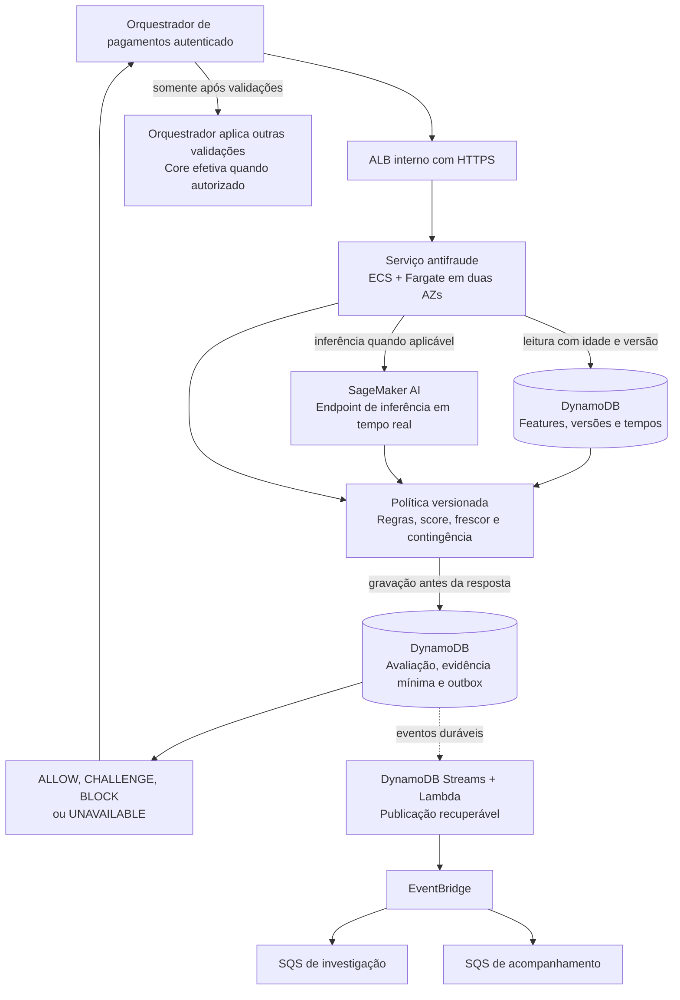
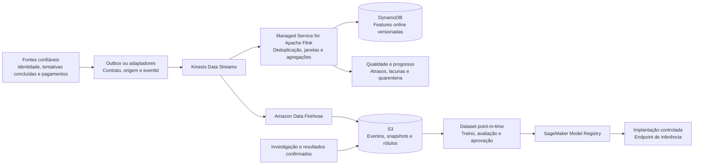
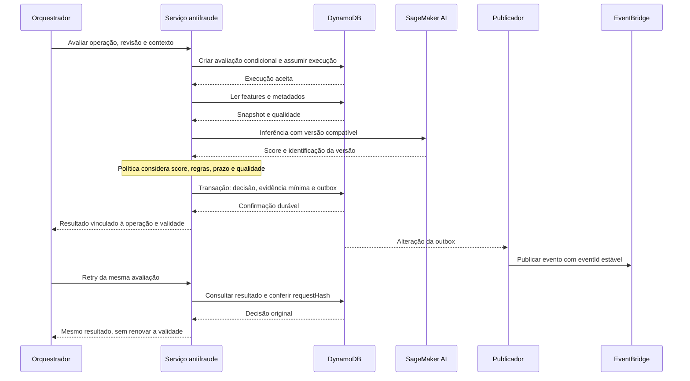
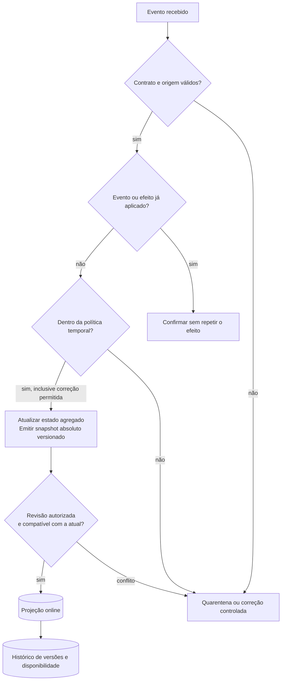
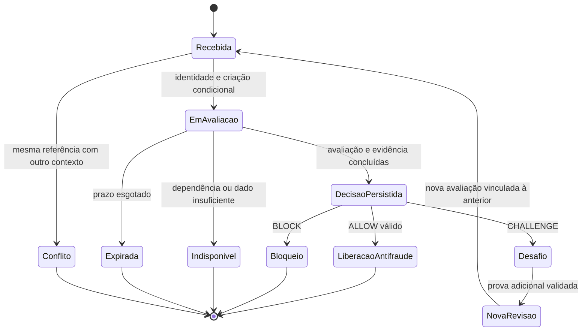
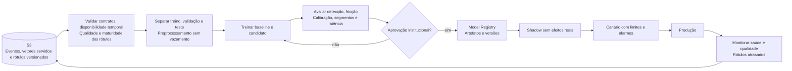
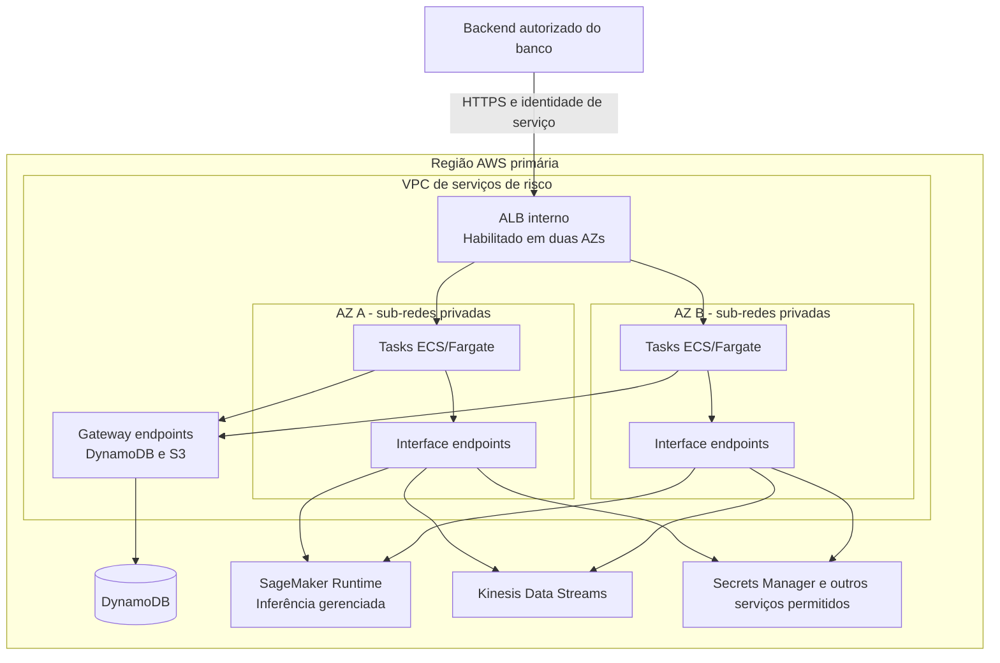
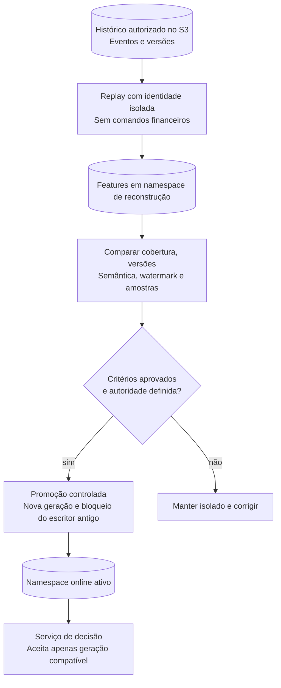

# Case 07 — Detecção de fraude em tempo real na AWS

> **Foco:** streaming, baixa latência, machine learning, eventos, qualidade das features, idempotência e decisões antifraude rastreáveis.  
> **Idioma:** português do Brasil. Os nomes dos serviços AWS e os identificadores de código foram preservados.  
> **Formato:** guia de estudo, decisões arquiteturais e simulação de entrevista.  
> **Referências consultadas em:** 28/09/2026.  
> **Caminho sugerido no repositório:** `cases/07-real-time-fraud-detection.md`.

## Como usar este material

Este case continua os estudos de [pagamentos e Pix](01-payment-processing-pix.md), [Open Finance](02-open-finance-apis.md), [Banking Event-Driven](03-event-driven-banking.md), [KYC](04-kyc-account-opening.md), [modernização do core](05-core-banking-modernization.md) e [GenAI para assessor financeiro](06-genai-financial-advisor.md). Agora, a pergunta é: **como avaliar o risco de uma transação antes de ela ser efetivada, usando sinais recentes, sem transformar uma falha técnica ou uma previsão imperfeita em uma decisão financeira indevida?**

Construiremos uma capacidade antifraude chamada pelo orquestrador de pagamentos do banco. O exemplo principal é uma transferência iniciada pelo aplicativo. O antifraude avalia; a política institucional determina a ação; o orquestrador e o core continuam responsáveis pela autorização e pela execução financeira.

Na primeira leitura, percorra as seções 1 a 7 e a tabela de trade-offs da seção 12. Depois estude as três questões que mais mudam a solução: **qual informação estava disponível na decisão, o que acontece quando o prazo acaba e como sabemos posteriormente se a previsão estava correta**. Por último, responda às perguntas sem abrir as respostas.

**Frase central:** “O stream atualiza o contexto; o modelo produz um sinal; a política decide como agir; o core continua sendo a autoridade financeira.”

O cenário é didático. Não é uma arquitetura oficial AWS, um detector pronto para produção, uma política de risco aprovada ou uma rubrica oficial de entrevista. L5 é o alvo de preparação informado. Valores, metas, clientes, modelos e contratos são fictícios. O laboratório utiliza dados sintéticos e não autoriza movimentação financeira real.

### Dois níveis de estudo

**Núcleo para defender no quadro:** separar decisão síncrona de atualização assíncrona; identificar a idade dos dados; combinar regras e ML; preservar evidências; tratar falhas e duplicatas; medir fraude e impacto sobre clientes legítimos.

**Aprofundamento:** event time, watermarks, checkpoints, gravações externas ao Flink, datasets point-in-time, rótulos atrasados, calibração, seleção de limiar, monitoramento e recuperação regional.

Não é necessário começar com redes neurais profundas, grafos, LLMs, EKS ou um motor de risco proprietário. Uma política de regras e um modelo tabular simples já permitem exercitar os problemas mais importantes.

### Atenção à disponibilidade dos produtos

A página oficial do **Amazon Fraud Detector** informa que o serviço deixou de aceitar novos clientes em **7 de novembro de 2025**. Ele não será uma dependência deste projeto novo. [Fonte: Amazon Fraud Detector][r01]

As páginas atuais de disponibilidade também informam que **SageMaker Model Monitor** e **SageMaker Clarify** não estão abertos a novos clientes; clientes existentes podem continuar utilizando-os. O guia, portanto, não depende desses recursos: propõe jobs de avaliação versionados, métricas próprias e serviços de armazenamento/execução. Isso não significa que Amazon SageMaker AI como um todo esteja indisponível. [Fontes: Model Monitor][r28], [Clarify][r29], [SageMaker AI][r40]

---

## Sumário

1. [Problema de negócio e escopo](#s01)
2. [Vocabulário e modelo mental](#s02)
3. [Perguntas antes de desenhar](#s03)
4. [Requisitos, premissas e invariantes](#s04)
5. [Decisões da arquitetura-base](#s05)
6. [Arquitetura e dois caminhos em Mermaid](#s06)
7. [Fluxo explicado em 12 etapas](#s07)
8. [Streaming, features, tempo e consistência](#s08)
9. [Decisão, idempotência, prazo e degradação](#s09)
10. [ML, rótulos, treinamento e avaliação](#s10)
11. [Papel e posicionamento dos serviços](#s11)
12. [Trade-offs que precisam ser defendidos](#s12)
13. [Rede, sub-redes e fronteiras de confiança](#s13)
14. [Segurança, privacidade e governança de decisões](#s14)
15. [Alta disponibilidade, recuperação regional e replay](#s15)
16. [Desempenho, capacidade e custos](#s16)
17. [Observabilidade, MLOps e implantação](#s17)
18. [Aplicação dos seis pilares Well-Architected](#s18)
19. [Roteiro de laboratório e testes](#s19)
20. [30 perguntas de entrevista com respostas comentadas](#s20)
21. [Apresentação da solução e simulação de 45 minutos](#s21)
22. [Checklist de domínio](#s22)
23. [Referências e leitura orientada](#s23)

---

<a id="s01"></a>
## 1. Problema de negócio e escopo

### Enunciado inicial

> Um banco brasileiro quer reduzir perdas por fraude em transações digitais. Hoje, regras estáticas produzem muitos bloqueios indevidos e parte dos sinais chega tarde demais. A solução deve avaliar cada operação em poucos milissegundos de processamento, considerar o histórico recente, operar continuamente e produzir evidências para investigação. Como você desenharia uma arquitetura na AWS que combine streaming, regras e machine learning?

“Poucos milissegundos” é uma expressão que precisa ser convertida em um **objetivo mensurável, com percentil e ponto de medição**. Também é necessário perguntar se queremos impedir a transação antes da execução ou apenas detectar um caso suspeito depois dela.

### Exemplo concreto

Uma cliente inicia uma transferência de **R$ 500,00** no aplicativo. O sistema identifica uma sessão autenticada, um dispositivo pouco conhecido e um beneficiário que ainda não faz parte do histórico daquela conta. Nenhum desses sinais, isoladamente, prova fraude.

O orquestrador consulta o antifraude antes de enviar a ordem ao core. O serviço considera a solicitação atual e indicadores históricos disponíveis naquele momento. Dependendo da política, devolve uma liberação antifraude, uma exigência de verificação adicional, um bloqueio ou uma indisponibilidade técnica.

Depois, o pagamento pode ser concluído, recusado por outro motivo ou cancelado. Dias depois, uma investigação pode confirmar fraude ou reconhecer um falso positivo. **A decisão inicial, o resultado financeiro e o rótulo posterior são registros distintos.**

### O que estamos construindo

| Responsabilidade | Autoridade na proposta |
|---|---|
| Autenticar a pessoa e autorizar a operação sobre a conta | Identidade, canal e orquestrador do banco |
| Validar a origem da chamada ao antifraude | Autenticação entre serviços e autorização da API interna |
| Manter indicadores derivados de eventos | Pipeline de features |
| Produzir uma previsão a partir de entradas | Modelo de ML versionado |
| Transformar sinais em ação de risco | Política institucional versionada |
| Exigir e validar autenticação adicional | Jornada de identidade do banco |
| Verificar saldo, limites financeiros e efetivar lançamentos | Orquestrador/core responsáveis |
| Investigar e confirmar resultados | Operação antifraude e fontes de evidência autorizadas |
| Aprovar modelos, limiares e contingências | Responsáveis de risco, negócio, segurança e governança |

**Um resultado `ALLOW` significa apenas que aquela avaliação antifraude permite prosseguir dentro do seu prazo e contexto.** Não substitui autorização sobre a conta, saldo, limites, validações regulatórias ou idempotência do pagamento.

### Duas situações que não devem ser confundidas

**Prevenção na autorização:** o cliente espera uma decisão. O sistema não pode ficar aguardando o encerramento de uma janela de cinco minutos no stream.

**Detecção e investigação posterior:** novos sinais podem justificar um caso, uma revisão ou medidas futuras. Isso não transforma retroativamente uma transferência concluída em “não executada”. Intervenções sobre conta ou recursos exigem outro fluxo autorizado.

### Fora do núcleo

Não implementaremos o ledger, criptografia de cartões, captura de biometria, comunicação automática a autoridades, um sistema completo de PLD/FT ou uma política real de bloqueio. Prevenção a fraude transacional e monitoramento de lavagem de dinheiro podem compartilhar sinais, mas não são a mesma finalidade ou decisão.

Também não usaremos Bedrock para julgar cada transferência. Este caso é de **ML preditivo tabular e política determinística**, não de geração de texto. Um assistente para investigadores seria uma extensão separada, com os controles do Case 06.

---

<a id="s02"></a>
## 2. Vocabulário e modelo mental

### Uma analogia

Imagine um posto de controle. Uma equipe atualiza indicadores sobre o movimento; outra precisa decidir se uma solicitação pode passar agora. O relatório histórico ajuda, mas não pode ser confundido com uma visão instantânea de tudo o que está acontecendo.

Na solução, o **stream prepara o contexto**, o **serviço de decisão consulta o que já está pronto**, e a **política sabe como agir quando o contexto está incompleto**.

| Termo | Significado neste case |
|---|---|
| Avaliação / assessment | Análise de uma operação específica, identificada e versionada |
| Feature | Variável usada na decisão: valor, idade do dispositivo, contagem histórica, entre outras |
| Feature online | Indicador disponível para consulta de baixa latência |
| Feature offline | Histórico de indicadores utilizado em treinamento e análise |
| Feature store | Capacidade de organizar, servir e acompanhar features; pode ter armazenamento online e offline |
| Inferência | Aplicação de um modelo treinado a novas entradas |
| Treinamento | Ajuste de parâmetros do modelo usando exemplos e uma função objetivo |
| Score | Saída numérica do modelo; não é automaticamente uma probabilidade calibrada |
| Política / regra | Critério institucional que determina a ação a partir dos sinais |
| Limiar / threshold | Ponto de corte da política; altera falsos positivos e falsos negativos |
| Rótulo / label | Resultado observado e classificado posteriormente, com origem e versão |
| Ground truth | Evidência de referência usada para avaliar previsões; também pode ter erros e revisões |
| Falso positivo | Operação legítima classificada como positiva para fraude na avaliação considerada |
| Falso negativo | Fraude classificada como negativa na avaliação considerada |
| Precision | Entre os positivos previstos, a proporção realmente positiva |
| Recall | Entre os positivos reais, a proporção identificada |
| Event time | Momento do evento segundo sua fonte, com requisitos de confiabilidade |
| Processing time | Momento em que o componente processa o evento |
| Watermark | Fronteira estimada de progresso em event time; não prova ausência absoluta de eventos atrasados |
| Janela | Intervalo usado para agregar eventos, por exemplo últimos cinco minutos |
| Checkpoint | Ponto consistente de recuperação do estado de processamento |
| Data drift | Mudança na distribuição das entradas em relação à referência |
| Concept drift | Mudança na relação entre as entradas e o resultado a prever |
| Training-serving skew | Diferença indevida entre o que o treinamento supõe e o que a produção fornece |
| Point-in-time | Construção de exemplos usando apenas informação disponível no momento pertinente |
| Shadow | Modelo candidato recebe entradas para comparação, sem decidir a ação real |
| Canary | Parte controlada do tráfego passa a usar uma versão candidata |
| Challenge / step-up | Verificação adicional antes de permitir que a jornada prossiga |
| Replay | Reprocessamento de eventos históricos, com isolamento dos efeitos de produção |

As separações entre inferência, armazenamento online/offline e métricas estão documentadas nos recursos de SageMaker AI e no material de classificação citado. [Fontes: inferência][r02], [Feature Store][r18], [métricas][r24]

### Quatro afirmações diferentes

| Afirmação | O que significa | O que não significa |
|---|---|---|
| “A feature respondeu em 3 ms” | A consulta foi rápida | Que a informação estava atualizada |
| “O score foi 0,8” | O modelo produziu aquele valor | Que há exatamente 80% de probabilidade de fraude |
| “A política bloqueou” | A regra determinou uma ação preventiva | Que a fraude foi comprovada |
| “O antifraude liberou” | A avaliação permitiu seguir | Que a transferência foi autorizada e liquidada |

**Frase para guardar:** disponibilidade, atualidade dos dados, qualidade estatística e correção da ação são quatro dimensões diferentes.

---

<a id="s03"></a>
## 3. Perguntas antes de desenhar

Uma abertura adequada seria:

> “Quero entender em qual ponto a decisão acontece, qual atraso é tolerado, quais sinais realmente estão disponíveis antes da transação e como o banco pretende agir quando não houver informação suficiente.”

| Pergunta ao cliente | Como a resposta muda a arquitetura |
|---|---|
| Queremos bloquear antes da execução ou investigar depois? | Define o caminho síncrono e o que pode ficar em fila |
| É transferência, cartão, login ou abertura de conta? | Altera os sinais, estados, prazo e possibilidades de intervenção |
| Quem continua responsável pela autorização e pelo saldo? | Evita atribuir ao modelo uma autoridade que ele não tem |
| Qual latência máxima e qual percentil, medidos onde? | Determina orçamento de tempo, localização e capacidade aquecida |
| O pico é de avaliações, eventos ou pagamentos? | São volumes diferentes e precisam ser dimensionados separadamente |
| Há concentração por conta, dispositivo, parceiro ou campanha? | Expõe hot keys, partições desbalanceadas e necessidade de proteção |
| Quais fontes chegam antes da avaliação? | Separa features utilizáveis de informações do futuro |
| Qual idade máxima é aceitável por feature? | Define políticas de frescor, ausência e degradação |
| Precisamos contar tentativas concorrentes ainda em andamento? | Pode exigir um controle atômico síncrono, além do streaming |
| Já existem regras, modelo e plataforma Kafka? | Orienta reaproveitamento e evita implantar serviços desnecessários |
| Como um caso vira fraude confirmada ou legítimo confirmado? | Define rótulos, atraso, proveniência e limitações da avaliação |
| Qual é o custo de bloquear um cliente legítimo? | Altera limiares, desafios e métricas de negócio |
| Existe jornada de autenticação adicional? | Torna `CHALLENGE` uma ação executável, não um rótulo decorativo |
| É possível manter a transação pendente? Por quanto tempo? | Define se revisão humana cabe no fluxo |
| Qual política vale quando modelo ou dados falham? | Evita inventar fail-open ou bloqueio total durante o incidente |
| Quem aprova a contingência e por quanto tempo ela vale? | Exige governança, limites e rastreabilidade |
| O resultado pode ser reutilizado depois de alterar o valor? | Define vínculo com operação, validade e revisão da avaliação |
| Quais evidências precisamos preservar? | Define dados mínimos, retenção, custo e auditoria |
| O serviço precisa sobreviver à perda de uma Região? | Altera replicação, autoridade e validação de modelos/features |
| Qual orçamento e qual equipe operará isso continuamente? | Determina uma complexidade sustentável |

Não faça todas as perguntas de uma vez. Comece por **ponto de decisão, prazo, autoridade, sinais e política de falha**.

---

<a id="s04"></a>
## 4. Requisitos, premissas e invariantes

### Hipóteses da simulação

As metas são didáticas, não garantias de serviços ou medições desta implementação.

| Categoria | Premissa inicial |
|---|---|
| Jornada | Transferência digital iniciada no aplicativo; avaliação antes da efetivação |
| Chamada | Backend do orquestrador autenticado; o aplicativo não chama diretamente o endpoint do modelo |
| Volume | Média de 200 avaliações/s e pico inicial de 2.000 avaliações/s |
| Eventos | Hipótese de três eventos normalizados por avaliação, em média, para o exercício de capacidade |
| Prazo | Meta de p99 de até 200 ms para a chamada antifraude completa, medida pelo orquestrador |
| Escopo da latência | Inclui rede, avaliação e gravação da decisão; não inclui posterior execução no core |
| Features | Meta inicial de atualização p95 até 1 s e p99 até 3 s, por fonte e feature elegível |
| Semântica do frescor | A idade tolerada é definida por feature; não há um prazo universal para todos os sinais |
| Disponibilidade | SLO didático de 99,95% para avaliações concluídas dentro do contrato; fallback reportado separadamente |
| Plataforma | Região primária a definir com o banco; São Paulo é hipótese, sujeita à matriz de recursos e quotas |
| Infraestrutura | Serviço de decisão distribuído em duas AZs; capacidade e inferência preparadas para falhas |
| Histórico | Dados minimizados, pseudonimizados e com retenção aprovada por classe |
| Modelo | Classificador tabular versionado, comparado contra uma política de regras |
| Governança | Política de bloqueio, desafio, contingência e promoção de modelo aprovada pelo banco |
| DR | Multi-AZ na base; RTO/RPO regionais devem ser aprovados antes da solução de contingência |

### Invariantes

1. O antifraude não autoriza débito, não valida saldo por conta própria e não substitui a autorização sobre a conta.
2. A decisão é vinculada à identidade do chamador, à operação, aos dados relevantes e à revisão avaliada.
3. Uma repetição da mesma avaliação não produz uma nova decisão contraditória nem um novo efeito financeiro.
4. Um resultado técnico ausente não é transformado silenciosamente em score zero ou fraude comprovada.
5. Não entregamos `ALLOW` antes de persistir a decisão e a evidência mínima exigida neste cenário.
6. Cada decisão identifica modelo, política, transformação e features utilizados — ou registra que o modelo não foi executado.
7. Uma feature ausente, antiga ou de versão incompatível aciona tratamento explícito.
8. Eventos repetidos não podem inflar contagens; eventos antigos não podem sobrescrever versões atuais silenciosamente.
9. Rótulos posteriores não alteram o que foi decidido no passado; acrescentam evidência versionada.
10. Replay, treinamento e shadow não podem efetivar transações nem enviar bloqueios reais.

### Três objetivos de confiabilidade

**Resposta técnica:** a API respondeu no prazo?

**Decisão sustentada:** a resposta usou sinais e versões que atendiam à política, ou uma contingência explicitamente aprovada?

**Resultado de negócio:** a política reduz perdas sem impor bloqueios e desafios desproporcionais a operações legítimas?

Retornar `UNAVAILABLE` rapidamente pode cumprir um timeout técnico, mas não deve inflar a métrica de decisões completas. Retornar `ALLOW` para todos aumenta disponibilidade aparente e destrói o objetivo antifraude.

---

<a id="s05"></a>
## 5. Decisões da arquitetura-base

### Caminho de decisão

A proposta inicial utiliza **ALB interno → Amazon ECS com AWS Fargate → DynamoDB para features e decisões → endpoint de inferência em tempo real do Amazon SageMaker AI**.

O serviço recebe a solicitação, valida autorização e idempotência, reúne as features permitidas, confere a atualidade, executa as regras/modelo aplicáveis, aplica a política e registra a decisão antes de responder.

Endpoints de inferência em tempo real são adequados a chamadas interativas de baixa latência. Isso não torna a meta de 200 ms automática: a capacidade, o modelo e todo o caminho precisam ser medidos. [Fonte: inferência em tempo real][r02]

### Caminho de atualização

**Fontes bancárias confiáveis → Amazon Kinesis Data Streams → Amazon Managed Service for Apache Flink → DynamoDB**.

O stream distribui eventos; o Flink mantém agregações e publica snapshots de features; o DynamoDB serve as projeções online. Em paralelo, **Amazon Data Firehose → S3** preserva o histórico necessário à análise e ao treinamento, conforme governança. Firehose pode acumular registros antes da entrega e não será uma dependência síncrona da autorização. [Fontes: Kinesis][r04], [Flink][r07], [Firehose][r34]

### Caminho de eventos de negócio

A finalização da avaliação grava **decisão + evidência mínima + outbox** atomicamente no DynamoDB. Um publicador, acionado por DynamoDB Streams, encaminha os eventos ao EventBridge. Há uma fila SQS por consumidor independente, como investigação e acompanhamento operacional.

Esse mecanismo admite reenvio e exige idempotência nos consumidores. A outbox permanece recuperável por varredura/reconciliação; não depende exclusivamente do prazo de retenção do stream de alterações. [Fontes: outbox][r13], [transações][r10], [DynamoDB Streams][r14]

### O que é obrigatório e o que é alternativa

| Capacidade | Escolha base | Alternativa ou evolução |
|---|---|---|
| Decisão online | ECS/Fargate, com capacidade aquecida | Lambda com estratégia de latência/capacidade; serviço já existente |
| Inferência | SageMaker AI real-time endpoint | Modelo compacto no processo da aplicação; runtime existente homologado |
| Features online | DynamoDB com metadados de versão/tempo | SageMaker Feature Store; cache apenas quando medições justificarem |
| Transporte de eventos | Kinesis Data Streams | MSK quando Kafka e seus requisitos justificarem a escolha |
| Agregação com estado | Managed Service for Apache Flink | Processamento mais simples quando não exigir janelas/estado sofisticados |
| Eventos de negócio | EventBridge + filas SQS por consumidor | Integração com barramento já existente |
| Histórico | S3 + catálogo/consultas governadas | Plataforma de dados institucional |
| Treinamento e avaliação | Jobs de processamento, treinamento e Pipelines | Pipeline MLOps institucional equivalente |
| Registro de modelos | SageMaker Model Registry | Registro governado já existente |
| Regras/política | Pacote versionado validado pelo banco | Serviço de decisão institucional |
| Investigação | Aplicação e fila de casos fora do hot path | Ferramenta antifraude existente |

**Não é necessário criar Kinesis e MSK para transportar a mesma sequência sem um motivo.** Tampouco precisamos de DynamoDB, Redis e Feature Store como três fontes concorrentes dos mesmos indicadores.

### Uma simplificação importante

A infraestrutura pode ser estudada em três incrementos:

**A. Regras e registros:** serviço de decisão, banco, prazo, política de falha e auditoria.

**B. ML tabular:** acrescentar inferência, dataset, validação e comparação contra as regras.

**C. Features de streaming:** acrescentar indicadores temporais, qualidade do pipeline, replay e recuperação.

Essa sequência permite entender o valor de cada capacidade antes de operar todos os serviços simultaneamente.

---

<a id="s06"></a>
## 6. Arquitetura e dois caminhos em Mermaid

Os diagramas representam responsabilidades e fluxos. Uma seta de consulta não significa que o serviço gerenciado está dentro da VPC. As fronteiras de rede aparecem na seção 13.

### 6.1 Decisão síncrona e efeitos posteriores



O núcleo de decisão não espera por e-mail, relatório ou analista. `CHALLENGE` retorna uma ação que o orquestrador deve executar em uma jornada própria; não mantém essa chamada HTTP aberta aguardando a pessoa.

### 6.2 Atualização contínua e aprendizado



A atualização de contexto acontece continuamente. A chamada atual usa as features **já disponíveis**, mais seus próprios atributos. Essa escolha exige explicitar a tolerância a atraso; não elimina a necessidade de controles síncronos quando um requisito exige contabilizar tentativas simultâneas.

---

<a id="s07"></a>
## 7. Fluxo explicado em 12 etapas

### 1. O orquestrador envia uma avaliação autenticada

O canal já identificou a pessoa e validou o contexto da operação. O backend envia uma referência estável, valor em unidade monetária mínima, moeda, referências opacas de conta/beneficiário e contexto de sessão apropriado.

O antifraude valida o chamador e sua permissão para avaliar aquela operação. Um `accountRef` digitado por alguém não autoriza consulta ao histórico correspondente. O dispositivo informado pelo cliente é um sinal com nível de confiança conhecido, não uma identidade comprovada apenas por aparecer no JSON.

### 2. O serviço fixa identidade, revisão e prazo

A combinação de instituição, operação e revisão identifica a avaliação. O backend calcula um hash canônico dos dados relevantes e estabelece um prazo monotônico de execução a partir do contrato do servidor.

Um registro condicional evita iniciar duas avaliações concorrentes como operações independentes. Requisição repetida com conteúdo diferente retorna conflito; não reaproveita uma liberação para outro valor ou beneficiário.

### 3. O histórico está sendo preparado em paralelo

Eventos confiáveis chegam ao Kinesis por produtores que identificam cada fato e preservam sua recuperação. O Flink deduplica, agrega e mantém indicadores por entidades autorizadas.

Nesta proposta, as contagens históricas usam **tentativas de negócio anteriores encerradas**, incluindo recusadas quando o contrato da feature assim determinar. Revisões intermediárias de uma avaliação, como um desafio ainda pendente, não são novas tentativas. A tentativa atual não é somada novamente como se já estivesse nesse histórico. Eventos de sessão e identidade seguem contratos próprios.

### 4. A aplicação obtém um snapshot utilizável

O serviço consulta os itens necessários no DynamoDB. A leitura retorna valores e metadados: referência temporal, momento de disponibilidade, versão da transformação e sinais de qualidade.

Os indicadores não precisam ter todos exatamente o mesmo horário, mas o contrato deve dizer quais diferenças são aceitas. Para features que precisam de consistência conjunta, publique um snapshot coerente por agregado ou use uma leitura transacional apropriada. Uma lista de leituras individuais não equivale automaticamente a uma fotografia atômica. [Fonte: transações][r10]

### 5. Frescor, ausência e compatibilidade são avaliados

Antes de chamar o modelo, a aplicação verifica se os campos obrigatórios existem, se o schema é compatível e se os dados/pipeline atendem à política. Não substitui valor ausente por zero sem o modelo e a política terem sido preparados para esse significado.

Uma conta sem atividade recente pode ter último evento antigo e pipeline saudável. Um pipeline parado pode oferecer dados aparentemente recentes se examinarmos apenas o timestamp da última gravação. Por isso, a avaliação combina referência temporal, cobertura e saúde da origem.

### 6. Regras e modelo produzem sinais

Regras determinísticas podem impedir uma avaliação inválida ou decidir casos previstos sem invocar ML. Nos demais, o serviço monta o vetor de entrada com a transformação correta e consulta o endpoint de inferência.

O modelo retorna score e identificação verificável do artefato/variante servida. Um endpoint com nome estável pode hospedar versões diferentes durante uma implantação. A evidência não pode registrar apenas o nome do endpoint.

### 7. A política converte sinais em ação

A política aprovada combina regras, score, qualidade das features, estado da jornada e modo de contingência. Produz `ALLOW`, `CHALLENGE` ou `BLOCK` quando existe decisão sustentada. Usa `UNAVAILABLE` ou erro técnico contratual quando não consegue decidir.

Limiar não é uma constante universal do serviço AWS. É uma decisão de negócio validada com dados, perdas, falsos positivos, capacidade de desafio/revisão e governança.

### 8. Decisão e evidência mínima são persistidas

Uma transação grava o resultado, a versão da política, os metadados do modelo, o snapshot mínimo de entradas necessário e um evento de outbox. O registro inclui se houve contingência e por quê.

O evento distribuído não precisa conter o vetor sensível completo. Pode carregar referências opacas para evidências acessíveis somente aos perfis autorizados. A gravação da avaliação usa condição de propriedade/revisão para impedir que um trabalhador antigo finalize após perder sua execução.

### 9. A resposta chega ao orquestrador dentro da validade

O orquestrador confere operação, hash/contexto, revisão e prazo do resultado. `ALLOW` permite continuar as demais validações; `BLOCK` impede aquela tentativa segundo a política; `CHALLENGE` inicia outra jornada; indisponibilidade técnica aciona contingência previamente aprovada.

Uma resposta tardia não deve liberar uma operação já cancelada, expirada ou substituída. O resultado pode ser consultado para reconciliação, sem virar uma autorização financeira reutilizável indefinidamente.

### 10. Eventos alimentam investigação e operação

O publicador entrega os eventos da outbox ao EventBridge e trata falhas por entrada. Filas independentes permitem que investigação e outros consumidores recuperem seu trabalho sem travar o antifraude.

Uma resposta HTTP bem-sucedida de `PutEvents` não dispensa verificar resultados individuais do lote. A política de retry do barramento e a DLQ tratam entrega, não a conclusão do trabalho de negócio. [Fontes: publicação][r15], [retry][r16]

### 11. Resultados financeiros e rótulos são correlacionados

O banco informa se a operação foi efetivada, recusada por outro motivo, cancelada ou permaneceu desconhecida. A investigação posteriormente registra evidências e rótulos.

`BLOCK` não é gravado automaticamente como fraude confirmada. Operação ainda não contestada não vira automaticamente legítima. Essas distinções evitam treinar um modelo que apenas reproduz a própria política anterior.

### 12. A plataforma mede, aprende e promove mudanças

Jobs montam datasets coerentes com o momento da decisão, avaliam candidatos e geram evidências. Uma aprovação governada permite shadow, canário e expansão. Modelo, política e transformação são implantados como conjunto compatível.

O retorno dos rótulos melhora a avaliação, mas não deve disparar publicação automática de qualquer modelo recém-treinado. Promover um classificador significa mudar decisões sobre clientes reais.

### Sequência resumida, com repetição da chamada



O diagrama mostra a jornada normal. Um timeout entre quaisquer duas linhas exige o tratamento de estado e prazo detalhado na seção 9; nenhuma seta representa uma transação distribuída entre o banco e o endpoint de ML.

---
<a id="s08"></a>
## 8. Streaming, features, tempo e consistência

### 8.1 Uma feature é um contrato, não apenas uma coluna

Considere `completed_attempts_5m`. Precisamos definir: tentativas de qual conta, em qual intervalo, encerradas em que condição, incluindo recusadas, deduplicadas por qual identificador e conhecidas até qual momento?

Neste exercício, a feature conta **tentativas de negócio encerradas**, publicadas pelo orquestrador. Uma repetição HTTP e uma revisão após desafio não são novas tentativas. Eventos de avaliação intermediária podem ir para auditoria, mas não incrementam automaticamente esse contador.

A tentativa atual entra como atributos da solicitação e ainda não integra esse histórico. Caso a jornada permita reavaliar uma tentativa já encerrada, será preciso outra semântica e exclusão/correlação explícita. Não basta somar `+1` em toda inferência.

| Feature didática | Fonte/semântica | Controle importante |
|---|---|---|
| Valor e moeda da operação | Solicitação autorizada pelo backend | Valor em unidade mínima e contrato monetário |
| Histórico de tentativas encerradas em cinco minutos | Eventos do orquestrador, por `attemptRef` | Não contar retries nem revisões como novas tentativas |
| Beneficiário já conhecido | Histórico autorizado de relacionamento | Distinguir “não existe” de “fonte indisponível” |
| Idade do vínculo de dispositivo | Serviço de identidade/dispositivo | Origem confiável e definição do que é um vínculo |
| Tempo desde a última mudança sensível | Evento de identidade | Event time confiável e cobertura da fonte |
| Padrão histórico de valores | Agregação de operações elegíveis | Janela, moeda, correções e exclusões versionadas |
| Indicador de dado ausente | Pipeline/serviço de decisão | Preservar no treinamento o mesmo significado |

Não fornecemos limiares reais de bloqueio. Os sinais são exemplos para discutir arquitetura e devem ser aprovados quanto à necessidade, qualidade, finalidade e impacto.

### 8.2 Evento normalizado

O contrato precisa distinguir identidade do evento, identidade da tentativa e revisão da avaliação. Um exemplo sintético:

```json
{
  "eventId": "evt-attempt-700-closed-1",
  "eventType": "PaymentAttemptClosed",
  "schemaVersion": "1",
  "institutionRef": "bank-demo",
  "attemptRef": "attempt-700",
  "accountRef": "acct-demo-17",
  "eventTime": "2026-09-28T11:59:58.400Z",
  "ingestedAt": "2026-09-28T11:59:58.700Z",
  "source": "payment-orchestrator",
  "sourceSequence": 815,
  "data": {
    "currency": "BRL",
    "amountMinor": 50000,
    "closingReason": "COMPLETED",
    "paymentResult": "EXECUTED"
  }
}
```

`paymentResult` está disponível para avaliar **eventos posteriores**, não para prever a tentativa antes de sua execução. O fato de uma informação existir no histórico final não a torna utilizável como feature no passado.

`sourceSequence` só representa ordem/cobertura se o produtor realmente garantir seu escopo e continuidade. Não invente uma sequência global juntando timestamps de vários sistemas.

### 8.3 Deduplicação não é opcional

Kinesis pode receber o mesmo fato mais de uma vez após uma incerteza do produtor. Essas cópias podem ter números de sequência diferentes. Portanto, a deduplicação usa a identidade de negócio do evento, não apenas a posição no transporte. Consumidores também podem reprocessar após recuperação. [Fonte: duplicatas no Kinesis][r05]

Há duas regras diferentes:

- **Evento repetido:** o mesmo `eventId` não deve ser aplicado duas vezes.
- **Fatos diferentes sobre a mesma tentativa:** uma revisão/correção não deve virar uma tentativa nova por ter outro `eventId`.

A política de retenção da deduplicação deve cobrir retries e recuperações previstos. Reprocessar um ano de histórico com um conjunto de deduplicação de dez minutos não é automaticamente seguro. Replay longo precisa de estado isolado e de uma regra própria de reconstrução.

### 8.4 Particionamento e ordenação

Escolhemos uma chave de partição opaca associada ao agregado, como instituição e conta, quando isso atende ao padrão de acesso. No Flink, podemos redistribuir registros para calcular features por dispositivo ou beneficiário.

Essa redistribuição tem custo e muda o domínio de ordenação. **Ordenar por conta não cria uma ordem total de todos os dispositivos e contas do banco.** Um dispositivo muito compartilhado também pode concentrar trabalho.

Enviar lotes exige verificar falhas individuais e tratar reenvios. `PutRecords` não deve ser usado como prova de que todos os registros chegaram em ordem absoluta. Quando a ordem importa, ela precisa ser especificada no contrato e tratada pelo consumidor. [Fontes: conceitos do Kinesis][r04], [PutRecords][r06]

Não resolva uma hot key acrescentando um sufixo aleatório sem avaliar como recompor a agregação. Distribuir a escrita pode eliminar a ordem ou a atomicidade que a regra pressupunha.

### 8.5 Tempo do evento, tempo de processamento e disponibilidade

Uma transação aconteceu às 12:00:00, mas o evento só chegou às 12:00:04. Uma avaliação às 12:00:02 não poderia tê-lo utilizado por esse pipeline.

Para uma feature histórica, registre pelo menos:

| Campo | Pergunta respondida |
|---|---|
| `eventTime` | Quando a fonte diz que o fato aconteceu? |
| `ingestedAt` | Quando a plataforma recebeu o evento? |
| `featureAsOf` / `windowEnd` | A qual momento a agregação se refere? |
| `computedAt` | Quando foi calculada? |
| `availableAt` | Quando aquela versão ficou disponível para consulta? |
| `featureSchemaVersion` | Qual interpretação dos campos está valendo? |
| `featureVersion` | Qual revisão do snapshot estamos lendo? |
| `pipelineGeneration` | Qual geração autorizada do pipeline publicou? |
| Indicadores de cobertura | Há lacunas, atrasos ou fontes indisponíveis? |

Um exemplo de snapshot:

```json
{
  "institutionRef": "bank-demo",
  "entityRef": "acct-demo-17",
  "featureSchemaVersion": "features-v3",
  "featureVersion": 815,
  "pipelineGeneration": 12,
  "featureAsOf": "2026-09-28T11:59:59.500Z",
  "computedAt": "2026-09-28T11:59:59.650Z",
  "availableAt": "2026-09-28T11:59:59.800Z",
  "features": {
    "completed_attempts_5m": 2,
    "known_beneficiary": false,
    "device_binding_age_seconds": 7200
  },
  "quality": {
    "sourceCoverage": "HEALTHY",
    "provisional": true,
    "missingFields": []
  },
  "expiresAt": "2026-09-28T12:00:02.500Z"
}
```

Os nomes são contratuais, não campos nativos que o DynamoDB ou o Flink preenchem automaticamente. O uso de `expiresAt` pela aplicação também não depende de o item já ter sido removido pelo mecanismo de TTL.

O instante de disponibilidade precisa ter uma definição verificável no protocolo de publicação; um timestamp atribuído antes de uma escrita que ainda vai demorar não prova quando o dado pôde ser lido. Para reproduzir decisões, a evidência do vetor efetivamente servido é a referência preferida. Não reconstrua uma precisão temporal que os registros não permitem demonstrar.

Online e histórico não são uma única transação só por participarem do mesmo diagrama. A exportação de decisões e snapshots para o S3 precisa de confirmação recuperável, identidade de versão e monitoramento de lacunas. Um consumidor autorizado pode arquivar a evidência imutável referenciada pela outbox. Treinamento só utiliza partições/versões cuja completude foi validada; não presume que todo evento publicado já chegou ao data lake.

### 8.6 Janelas e watermarks

Uma janela de cinco minutos descreve o intervalo observado, não uma obrigação de esperar cinco minutos antes de publicar qualquer resultado. Podemos emitir agregações **provisórias e incrementais**, atualizar quando chegam fatos atrasados e identificar qual versão foi servida.

Watermarks ajudam a coordenar progresso em event time. Fontes ociosas, eventos atrasados e políticas de idleness precisam ser considerados. Uma watermark não é prova de que nenhum evento anterior voltará a aparecer. [Fonte: práticas de streaming e watermarks][r08]

Neste desenho:

- A aplicação pode usar snapshots provisórios dentro da política aprovada.
- Eventos atrasados dentro da regra de correção produzem nova versão, sem apagar evidência da versão anterior.
- Eventos fora do horizonte operacional vão para análise/correção controlada, não são simplesmente descartados sem medição.
- Uma conta ociosa precisa de semântica de expiração de janela. Não deixe uma contagem de “últimos cinco minutos” congelada por horas apenas porque não chegou novo evento.



### 8.7 Leitura forte não conserta dados que ainda não chegaram

DynamoDB permite leituras fortemente consistentes em recursos suportados, como a tabela base; GSIs têm outra semântica. Mesmo uma leitura forte só observa o que foi gravado. Não recupera um evento ainda preso no produtor ou no pipeline. [Fonte: consistência de leitura][r11]

Por isso, precisamos de dois controles:

**Consistência do armazenamento:** qual versão gravada a leitura pode retornar?

**Atualidade e completude do negócio:** quais fatos foram efetivamente incorporados naquela versão?

TTL também não é uma barreira de acesso. A exclusão por TTL é assíncrona; a aplicação compara validade e qualidade antes de usar o item. [Fonte: TTL][r12]

### 8.8 Checkpoint do Flink não torna qualquer sink exatamente uma vez

O Flink mantém estado recuperável por checkpoints/snapshots. A garantia efetiva na escrita externa depende da integração e do contrato do destino; não surge apenas por habilitar checkpoints. [Fonte: tolerância a falhas][r09]

A proposta evita `ADD contador 1` sem proteção em cada entrega. Em vez disso, usa **snapshots absolutos**, revisão determinística e gravação condicional. Uma repetição da mesma revisão com o mesmo conteúdo é inofensiva; mesma revisão com conteúdo diferente é violação que deve gerar investigação.

Ainda existe um caso difícil: o destino recebeu a versão 100, mas o Flink voltou a um checkpoint anterior. O estado restaurado pode estar atrás do que já foi publicado. **Não basta aumentar a geração e sobrescrever a versão 100 com um contador incompleto.**

É necessário escolher e provar um protocolo: recuperar e alcançar o ponto consistente antes de publicar; reconstruir em namespace separado e promover depois de validar; ou adotar uma integração transacional compatível. A alternativa de reconstrução isolada é a usada no exercício de recuperação deste guia.

### 8.9 Tentativas concorrentes e limites realmente imediatos

Suponha duas solicitações simultâneas consultando o mesmo histórico. Ambas podem ver a mesma contagem antes de qualquer uma terminar. Isso é uma consequência da projeção assíncrona, não um defeito que “strong read” resolve.

Se a política exige um **limite rígido de admissões simultâneas**, acrescente um controle síncrono idempotente de reserva/admissão, com atualização atômica por escopo, validade e recuperação. Esse controle deve caber no orçamento e ser dimensionado para contas muito ativas.

Ele não substitui limites financeiros ou saldo do core. Também não transforma uma contagem em janela fixa numa janela deslizante exata. O requisito precisa indicar o que significa contar “agora”.

### 8.10 Feature Store como alternativa

SageMaker Feature Store pode separar armazenamento online de consulta e histórico offline. O modelo de `PutRecord` considera o tempo do evento na atualização; isso deve ser entendido antes de usar correções e versões. [Fontes: Feature Store][r18], [PutRecord][r19]

Nesta base usamos DynamoDB para tornar o contrato explícito e reduzir componentes novos. Feature Store se torna interessante quando o banco precisa compartilhar features entre vários modelos, organizar grupos e integrar o histórico de treinamento.

O produto não define por nós se uma feature é autorizada, se um evento atrasado corrige uma decisão, nem se o rótulo usado no treinamento já era conhecido. Essas continuam sendo regras de dados e negócio.

---

<a id="s09"></a>
## 9. Decisão, idempotência, prazo e degradação

### 9.1 Contrato da chamada

Exemplo sintético do corpo enviado pelo orquestrador:

```json
{
  "assessmentId": "assessment-701-r1",
  "operationRef": "operation-701",
  "attemptRef": "attempt-701",
  "assessmentRevision": 1,
  "institutionRef": "bank-demo",
  "accountRef": "acct-demo-17",
  "beneficiaryRef": "beneficiary-demo-52",
  "amountMinor": 50000,
  "currency": "BRL",
  "operationType": "INTERNAL_TRANSFER",
  "requestedAt": "2026-09-28T12:00:00.000Z",
  "context": {
    "sessionRef": "session-demo-18",
    "deviceBindingRef": "binding-demo-4",
    "channel": "MOBILE_APP"
  }
}
```

A identidade do chamador vem da autenticação, não de um campo confiado cegamente. O servidor confere a instituição, o acesso e o contexto; calcula o `requestHash` canônico; limita o prazo máximo e rejeita formatos inválidos.

O hash inclui os campos que alteram a decisão. Não use serialização com ordem instável de propriedades, arredondamento de ponto flutuante ou omissão silenciosa de campo relevante.

### 9.2 Registro de execução e concorrência

Uma criação condicional estabelece a avaliação `IN_PROGRESS`. Ela guarda hash, revisão, prazo e proprietário da execução. Repetições simultâneas não devem todas seguir para o modelo como se fossem solicitações independentes.

Uma lease pode permitir recuperação se o processo morrer. Seu vencimento, porém, não impede fisicamente um trabalhador antigo de continuar rodando. A finalização usa uma condição de **fencing/revisão** no banco: somente a execução ainda autorizada pode gravar o resultado final.

DynamoDB oferece transações locais e condições, mas a aplicação precisa definir esse protocolo. Um token de idempotência de uma API de infraestrutura não substitui a retenção de idempotência do negócio. [Fonte: transações do DynamoDB][r10]

### 9.3 Decisão imutável e evidência

Exemplo de resultado registrado:

```json
{
  "assessmentId": "assessment-701-r1",
  "operationRef": "operation-701",
  "assessmentRevision": 1,
  "requestHash": "cccccccccccccccccccccccccccccccccccccccccccccccccccccccccccccccc",
  "status": "COMPLETED",
  "action": "ALLOW",
  "mode": "NORMAL",
  "score": 0.18,
  "modelVersion": "fraud-tabular-v7",
  "modelArtifactDigest": "sha256:bbbbbbbbbbbbbbbbbbbbbbbbbbbbbbbbbbbbbbbbbbbbbbbbbbbbbbbbbbbbbbbb",
  "featureSchemaVersion": "features-v3",
  "featureVersion": 815,
  "pipelineGeneration": 12,
  "policyVersion": "policy-v12",
  "transformVersion": "transform-v5",
  "reasonCodes": ["POLICY_EVALUATED"],
  "evaluatedAt": "2026-09-28T12:00:00.080Z",
  "validUntil": "2026-09-28T12:00:02.000Z",
  "evidenceRef": "evidence-assessment-701-r1"
}
```

O score e a ação desse exemplo são fictícios e não estabelecem um limiar recomendado. O `validUntil` de dois segundos é apenas uma hipótese de contrato; produção exige validação do intervalo e das condições de reutilização.

A evidência deve permitir explicar a decisão. **Um hash sem os dados ou sem uma referência resolvível não permite reconstruí-la.** Grave o vetor mínimo realmente utilizado, seus tempos e versões em armazenamento protegido, com retenção aprovada. Para este case, esse conjunto é pequeno e pode ser persistido com a decisão; artefatos grandes requerem outro protocolo de durabilidade.

Se a política decidir apenas por regras, registre `modelExecuted=false` no contrato aplicável, score ausente e as regras executadas. Não invente um score para preencher dashboard.

### 9.4 Estados e ações não são a mesma coisa



`UNAVAILABLE` é um resultado técnico. A contingência pode produzir uma decisão específica quando a política aprovada permite e há dados/evidências suficientes; nesse caso, o registro indica `mode=DEGRADED`, a versão da contingência e as dependências faltantes.

Não use `BLOCK` para esconder todos os erros técnicos. Isso contamina métricas, investigações e futuros rótulos.

### 9.5 O que fazer em cada indisponibilidade

| Situação | Tratamento proposto | O que evitar |
|---|---|---|
| Endpoint do modelo indisponível | Política de contingência validada, com regras suficientes, limites e registro | Score zero por conveniência |
| Feature opcional ausente | Tratamento de missingness compatível com treino/política | Substituir por valor que muda o significado |
| Feature crítica antiga | Challenge, impedimento temporário ou outra contingência aprovada | Usar porque a consulta foi rápida |
| Banco de decisões indisponível | Não emitir `ALLOW` sem a evidência mínima exigida no case | Aprovar e “gravar depois quando voltar” |
| Stream atrasado | Medir impacto, marcar degradação, aplicar regra de frescor | Continuar exibindo pipeline saudável |
| Sistema de investigação fora | Enfileirar casos dentro de limites operacionais | Impedir todo pagamento por causa de dashboard |
| Identidade do chamador não validada | Rejeitar por segurança | Tratar rede interna como autenticação |
| Prazo esgotado | Encerrar a chamada segundo o contrato | Retry em cascata até alguém responder |

**Fail-open e fail-closed não são escolhas universais.** A contingência precisa refletir o produto, o risco e o que ainda conseguimos verificar. Um modo degradado não pode se tornar um caminho conhecido de aprovação irrestrita quando o sistema está sobrecarregado.

### 9.6 Resultado perdido ou tardio

O serviço pode persistir a decisão e perder a resposta. O retry com o mesmo contexto consulta o resultado original; não recalcula automaticamente com um modelo novo.

O modelo também pode terminar depois do prazo. O serviço tenta interromper trabalho desnecessário, mas deve assumir que a chamada remota pode ter continuado. A aplicação e o orquestrador aplicam prazo/revisão: **uma resposta tardia não ressuscita uma operação expirada**.

Se uma nova análise for necessária depois do vencimento, ela ganha nova revisão e referencia a anterior. O histórico permanece imutável. A idempotência da avaliação e a idempotência da transferência são controles diferentes e ambos são necessários.

### 9.7 Challenge e revisão humana

`CHALLENGE` só faz sentido quando há um serviço capaz de pedir e validar uma prova adicional. O resultado da autenticação deve ser vinculado à operação, ao valor, ao beneficiário e ao prazo pertinentes; um sucesso antigo de login não libera qualquer transferência futura.

A nova avaliação utiliza a prova validada pelo backend e uma nova revisão. Não basta o aplicativo enviar `challengePassed=true`.

**Revisão humana não cabe em 200 ms.** Em uma transferência que pode ficar pendente, o orquestrador pode manter a intenção sem executar o core, com prazo e cancelamento. Em uma integração que exige resposta imediata, a investigação posterior não pode ser apresentada como se tivesse ocorrido antes da autorização.

### 9.8 Outbox, publicação e recuperação

A decisão final e o evento de outbox são gravados na mesma transação. O publicador envia apenas dados mínimos, trata sucesso/falha por evento e marca o progresso de entrega. Pode cair depois de publicar e antes de confirmar; por isso, `eventId` permanece estável e os consumidores deduplicam.

DynamoDB Streams retém alterações por 24 horas. Uma parada maior exige recuperar os registros pendentes da outbox, não esperar que o stream mantenha tudo indefinidamente. [Fontes: outbox][r13], [Streams][r14]

Uma fila por responsabilidade evita que investigação e notificações disputem a mesma mensagem. Consumidores Lambda/SQS devem tratar falhas parciais e repetição de entrega. [Fonte: processamento de erros com SQS][r17]

---

<a id="s10"></a>
## 10. ML, rótulos, treinamento e avaliação

### 10.1 Por que um modelo tabular simples é suficiente para começar?

As entradas do primeiro exercício são estruturadas: valor, características do relacionamento, indicadores temporais e sinais de qualidade. Compare uma política de regras, um classificador simples e um candidato como XGBoost.

XGBoost utiliza árvores com gradient boosting e é uma opção de aprendizado supervisionado disponível no SageMaker AI. A escolha precisa ser demonstrada em dados representativos, não justificada pela popularidade do algoritmo. [Fonte: XGBoost][r21]

Para a entrevista, interessa saber explicar **como o candidato será medido, servido, versionado e retirado**, não decorar equações do algoritmo.

### 10.2 Rótulos precisam de origem, tempo e revisão

Um exemplo sintético de evidência posterior:

```json
{
  "labelId": "label-attempt-701-v2",
  "attemptRef": "attempt-701",
  "assessmentId": "assessment-701-r1",
  "labelVersion": 2,
  "label": "LEGITIMATE_CONFIRMED",
  "observedAt": "2026-10-05T15:00:00.000Z",
  "knownAt": "2026-10-05T15:05:00.000Z",
  "source": "authorized-investigation",
  "evidenceRef": "case-evidence-demo-90",
  "supersedes": "label-attempt-701-v1"
}
```

A data posterior é intencional: trata-se de um exemplo fictício de evidência que só fica disponível depois da avaliação, não de um evento real já observado.

O catálogo de rótulos pode incluir fraude confirmada, legítimo confirmado, contestado e desconhecido. Chargeback, reclamação, bloqueio e fraude comprovada não devem ser tratados como sinônimos sem uma regra validada sobre a fonte.

Casos ainda imaturos precisam de tratamento explícito. Esperar alguns dias sem reclamação pode fazer parte de uma política de rotulagem aprovada, mas o período, as exceções e a incerteza precisam estar documentados. Não os deduza do silêncio de uma tabela.

### 10.3 Dataset point-in-time: duas condições de tempo

Para treinar a avaliação feita às 12:00:02, só podemos usar sinais que **já estavam disponíveis às 12:00:02**.

Um evento ocorrido às 12:00:00 mas recebido às 12:00:04 pertence ao passado de negócio, porém ao futuro do que aquela decisão conhecia. Filtrar apenas `eventTime <= evaluatedAt` ainda pode vazar informação.

A regra conceitual é:

```text
Tempo do fato compatível com a previsão
E
Tempo de disponibilidade da versão menor ou igual ao momento da decisão
E
Mesma transformação e mesma semântica de ausência esperadas em produção
```

A melhor evidência inicial é o **vetor efetivamente servido** e registrado pela avaliação. Para reconstruções, mantenha revisões e tempos suficientes para joins corretos. Recursos de construção point-in-time do Feature Store ajudam na seleção temporal, mas não inventam a semântica de `knownAt`/`availableAt` da instituição. [Fonte: datasets no Feature Store][r20]

Não use como entrada o rótulo da investigação, a contestação futura, a confirmação final do pagamento ou uma correção posterior que não estava disponível. O rótulo futuro é o alvo do aprendizado, não uma feature do passado.

### 10.4 Separação temporal e vazamento entre conjuntos

Treino, validação e teste devem representar a ordem de implantação. O teste final fica em período não usado para escolher features, limiares ou hiperparâmetros.

Também avalie repetição por conta, dispositivo e beneficiário. A estratégia de separação depende do objetivo: generalizar para entidades já conhecidas não é o mesmo que generalizar para entidades nunca vistas. Relate ambos quando fizerem parte do tráfego esperado.

Transformações aprendidas — imputação, escala, encoding e seleção — são ajustadas no conjunto de treino e aplicadas aos outros. Ajustá-las com todos os dados antes da divisão gera vazamento. [Fonte: erros comuns e data leakage][r22]

### 10.5 Acurácia pode recompensar o modelo errado

Considere **100.000 operações fictícias**, das quais **1.000 são fraudes** e **99.000 são legítimas**. Um candidato identifica 80% das fraudes e sinaliza indevidamente 2% das legítimas.

| Realidade / previsão | Sinalizada como fraude | Não sinalizada |
|---|---:|---:|
| Fraude real | 800 verdadeiros positivos | 200 falsos negativos |
| Operação legítima | 1.980 falsos positivos | 97.020 verdadeiros negativos |

Cálculos deste exemplo:

```text
Recall = 800 / (800 + 200) = 80,00%
Precision = 800 / (800 + 1.980) = 28,78%
Taxa de falso positivo = 1.980 / 99.000 = 2,00%
Acurácia = (800 + 97.020) / 100.000 = 97,82%
```

Um sistema que classificasse **tudo como legítimo** teria 99% de acurácia e não identificaria fraude alguma. Portanto, não escolheríamos o modelo apenas pelo maior percentual de acerto.

Entre os alertas do candidato, cerca de 71,22% seriam falsos positivos. Isso é diferente da taxa de falso positivo de 2% entre todas as operações legítimas. A distinção importa para dimensionar a investigação. As fórmulas de precision, recall e acurácia estão no material de referência. [Fonte: métricas de classificação][r24]

Os números são aritmética de um conjunto sintético com rótulos conhecidos. Não demonstram a precisão de nenhum serviço ou modelo real.

### 10.6 Métricas para selecionar política e modelo

| Métrica | Por que interessa | Limitação a reconhecer |
|---|---|---|
| Precision e recall | Captura de fraude e qualidade dos alertas | Dependem de rótulos e prevalência |
| PR-AUC | Comparação ao longo de limiares em problema desbalanceado | Não define sozinha a ação operacional |
| Recall em um orçamento de falsos positivos | Liga detecção à fricção tolerada | Orçamento deve ser aprovado e medido |
| Captura/perda em valor financeiro | Diferencia casos de valores distintos | Exige valores e resultados confiáveis |
| Bloqueio e desafio de operações legítimas | Mede impacto sobre clientes | Resultado verdadeiro pode demorar |
| Aprovação após challenge e abandono | Mede custo da verificação adicional | Não prova fraude nos abandonos |
| Volume e idade da fila de investigação | Mostra se a política é operacionalmente executável | Fila baixa pode esconder descarte de casos |
| Latência, erro e uso de contingência | Mostra capacidade operacional | Não mede qualidade estatística |
| Métricas por segmentos aprovados | Revela degradação escondida na média | Amostras pequenas e privacidade exigem cuidado |

O limiar é escolhido em validação, com custos e restrições explícitos. O teste final não deve ser reutilizado repetidamente até “ficar bom”.

### 10.7 Score não é necessariamente probabilidade

Um modelo pode ordenar bem as operações e produzir scores mal calibrados. Dizer “score 0,8 significa 80% de chance de fraude” exige validação de calibração na população relevante.

Compare probabilidades previstas e frequências observadas, com amostras e períodos adequados. Calibração é um artefato versionado e pode mudar após alterações na distribuição. [Fonte: calibração][r23]

Não é necessário calcular uma explicação pesada em cada chamada se ela ultrapassa o orçamento. Preserve as entradas e o modelo para análise posterior; mantenha códigos de razão da política e explicações compatíveis com a jornada. Atribuição de feature também não prova causalidade.

### 10.8 O próprio bloqueio muda os dados observados

Se o banco bloqueia uma operação, não observa automaticamente o que teria acontecido caso ela tivesse sido executada. Essa intervenção produz seleção e limita comparações entre políticas.

Não treine `label=fraude` porque a política antiga bloqueou. Não conclua que todos os casos aprovados foram legítimos porque ainda não chegaram rótulos. Separe investigação, censura, atraso e evidência incompleta.

Avaliações controladas precisam ser autorizadas e limitar risco. Shadow ajuda a comparar scores sem alterar ações, mas não resolve sozinho a ausência de resultado contrafactual. O guia não propõe liberar transações perigosas para produzir rótulos.

### 10.9 Drift e desempenho do modelo são sinais diferentes

**Data drift:** mudou a distribuição das entradas — por exemplo, novos dispositivos, valores ou canais.

**Concept drift:** mudou a relação entre os sinais e o resultado de fraude.

Podemos detectar rapidamente mudanças em entradas, scores e campos ausentes. Para medir se o modelo passou a errar mais, geralmente precisamos de rótulos suficientemente maduros e de uma comparação válida. O material de qualidade de modelos explicita a necessidade de ground truth para confrontar previsões. [Fonte: qualidade de modelo][r30]

Um pico sazonal legítimo pode produzir drift sem exigir retreinamento imediato. Uma fraude nova também pode alterar a relação de risco sem uma mudança óbvia em médias globais.

### 10.10 Pipeline e aprovação



SageMaker Pipelines e Model Registry oferecem mecanismos para organizar etapas, versões e aprovação. Quem define os critérios e concede a autorização continua sendo a instituição. [Fontes: Pipelines][r26], [Model Registry][r25]

---
<a id="s11"></a>
## 11. Papel e posicionamento dos serviços

| Componente | Papel na proposta | O que não resolve sozinho |
|---|---|---|
| ALB interno | Entrada HTTPS e distribuição para o serviço de decisão | Autorização de negócio do chamador ou latência garantida |
| ECS | Organização e execução dos serviços containerizados | Consistência do estado financeiro ou da avaliação |
| Fargate | Capacidade de execução das tasks sem administrar instâncias do cluster | Eliminar planejamento de capacidade, imagens e dependências |
| DynamoDB de features | Servir indicadores com chave de acesso definida | Garantir que eventos recentes já chegaram |
| DynamoDB de avaliações | Guardar idempotência, decisão e evidência mínima | Decidir por conta própria se uma transferência pode ocorrer |
| Kinesis Data Streams | Transportar e reter eventos para consumidores | Dar ordem global ou eliminar duplicatas de negócio |
| Managed Service for Apache Flink | Agregações com estado, janelas e recuperação | Tornar qualquer escrita externa exatamente uma vez |
| SageMaker AI real-time endpoint | Servir um modelo de inferência | Definir a política de bloqueio ou provar qualidade estatística |
| S3 | Histórico, datasets, modelos e evidências protegidas | Tornar qualquer arquivo um dado confiável e autorizado |
| Amazon Data Firehose | Entrega gerenciada de eventos ao armazenamento analítico | Responder à decisão online sem buffering |
| EventBridge | Roteamento dos fatos relevantes a consumidores | Ser o saldo autoritativo ou a fila de revisão humana |
| SQS | Trabalho pendente por responsabilidade, com recuperação | Fazer todos os sistemas receberem cópia de uma única fila |
| Lambda | Adaptadores, publicadores e tarefas orientadas a eventos | Transformar uma chamada lenta em uma resposta de baixa latência |
| SageMaker Pipelines | Organização de preparação, treino e avaliação | Aprovação automática de qualquer candidato |
| Model Registry | Versões, artefatos e status de aprovação | Impedir um deploy fora do processo sem controles IAM/CI/CD |
| Jobs de avaliação + CloudWatch | Qualidade, drift, métricas e alertas implementados pela equipe | Produzir rótulos verdadeiros que ainda não chegaram |
| IAM, KMS e Secrets Manager | Permissões, proteção criptográfica e segredos | Autorização por conta, propósito e revisão de decisão |
| CloudTrail e logs de aplicação | Auditoria de infraestrutura e da operação | Registrar a razão de negócio sem instrumentação explícita |

### Quanto disso precisa aparecer na primeira apresentação?

Comece com **chamador → serviço → features → modelo → política → registro → resposta**. Depois acrescente stream, treinamento e consumidores. Segurança, prazo e observabilidade acompanham todos os passos.

A candidata não precisa enumerar quinze serviços antes de explicar o problema. Ela precisa justificar por que não colocou um pipeline de minutos no caminho de uma resposta de centenas de milissegundos.

### Produtos opcionais

**SageMaker Feature Store:** considerar quando houver compartilhamento e governança de features para vários modelos. A base já implementa os contratos de tempo e acesso em DynamoDB.

**ElastiCache:** considerar depois de medir. Um cache de leitura pode diminuir custo/latência, mas introduz outra política de invalidação e frescor. Não o transforme no único lugar que sabe qual decisão foi tomada.

**MSK:** considerar quando Kafka já fizer parte da plataforma ou seus protocolos, conectores e padrões de consumo forem requisitos. Não precisa ser adicionado apenas porque o cenário usa streaming. [Fonte: Amazon MSK][r35]

**Step Functions:** útil no treinamento, na investigação e em jornadas que esperam por pessoas. Não é uma obrigação no caminho síncrono inicial de 200 ms.

---

<a id="s12"></a>
## 12. Trade-offs que precisam ser defendidos

### 12.1 Regras × ML × combinação

| Escolha | Quando ajuda | Custo/limitação |
|---|---|---|
| Regras | Casos explícitos, interpretação direta, baseline e contingência | Cobertura limitada e manutenção diante de padrões novos |
| ML | Combina muitos sinais e pode aprender relações menos óbvias | Exige rótulos, avaliação, operação e acompanhamento |
| Combinação | Preserva restrições determinísticas e usa score onde agrega valor | Interações e precedência precisam ser versionadas e testadas |

Uma regra de segurança/autorização não deve ser relaxada porque o modelo deu score baixo. O classificador não corrige uma chamada não autorizada.

### 12.2 Kinesis × MSK

**Kinesis** é a escolha inicial por integração com o restante da solução e ausência de uma exigência de Kafka no enunciado. Precisamos estudar particionamento, throughput, retenção e consumidores.

**MSK** passa a ser natural quando o cliente já opera Kafka, depende de seu ecossistema de conectores, mantém contratos em tópicos e precisa preservar processos existentes. Não significa que a migração para Kafka elimina governança, versões ou efeitos repetidos.

O critério não é “qual é mais moderno”, mas **qual resolve os requisitos com a menor complexidade operacional sustentável**. [Fontes: Kinesis][r04], [MSK][r35]

### 12.3 Flink × processamento simples

Flink se justifica quando há janelas temporais, estado por chave, agregações contínuas e recuperação que a equipe precisaria reimplementar. Para uma transformação sem estado e baixo volume, um consumidor mais simples pode bastar.

Sua adoção traz conhecimento sobre checkpoints, serialização de estado, versões de operadores, backpressure, particionamento e sinks. Serviço gerenciado reduz trabalho de infraestrutura, não elimina a lógica de processamento. [Fontes: funcionamento][r07], [boas práticas][r08]

### 12.4 ECS/Fargate × Lambda

**ECS/Fargate:** processos contínuos, controle de pools/conexões e capacidade aquecida previsível. Exige dimensionamento mínimo, implantação e saúde do serviço.

**Lambda:** pode atender bem a eventos e APIs, mas o caminho de p99 estrito precisa considerar inicialização, concorrência, dependências e estratégia de capacidade. Não descarte automaticamente Lambda; compare medições da jornada completa.

A regra é não escolher a plataforma pela preferência pessoal. Um serviço já existente, bem operado e que atende ao contrato pode ser melhor que migrar toda a camada apenas para usar outro nome.

### 12.5 Modelo no processo × endpoint SageMaker AI

**Modelo no processo:** remove uma chamada de rede e pode ser adequado para um artefato pequeno, estável e rápido. Em contrapartida, acopla capacidade, implantação e biblioteca do modelo à aplicação.

**Endpoint separado:** permite escalar e implantar inferência independentemente, mas adiciona rede, autenticação e outra dependência. É a escolha base porque a evolução e a validação dos modelos são responsabilidades explícitas do cenário.

**Serverless, assíncrono e batch:** são opções diferentes de inferência e precisam ser escolhidas segundo padrão de tráfego e prazo. Não use um modo assíncrono como se desse, por definição, a resposta interativa no mesmo instante. [Fonte: opções de implantação][r03]

### 12.6 DynamoDB × Feature Store × cache

| Escolha | Ganho | Cuidado |
|---|---|---|
| DynamoDB | Contrato simples por chave, condições e integração com estado/outbox | Construir governança e histórico adequados |
| Feature Store | Organização e compartilhamento online/offline para ML | Entender event time, versões e integração com o serving |
| Cache | Otimização de leituras repetidas | Idade, invalidação, isolamento e recuperação sem transformar cache em verdade |

Nenhuma opção resolve sozinha o problema de “esse sinal ainda não chegou”. Consistência de leitura, tempo de evento e disponibilidade da feature continuam distintos.

### 12.7 Síncrono × assíncrono

A decisão usa consulta e inferência síncronas com limite de tempo. Atualização de histórico, investigação, notificações e treinamento ficam assíncronos.

A presença de uma fila não é um erro. O erro seria colocar a autorização atrás de um backlog sem que o cliente tivesse aceitado uma resposta pendente e um prazo diferente.

### 12.8 Fail-open × fail-closed × contingência graduada

Uma contingência graduada pode manter certas jornadas dentro de condições aprovadas, pedir desafio ou impedir temporariamente a operação. Sua escolha é parte da política de risco, não uma improvisação de código durante o incidente.

Ela tem prazo, autoridade de ativação, limites, métricas e critérios de saída. Segurança não se resume a bloquear tudo; disponibilidade não se resume a aprovar tudo.

### 12.9 Atualidade máxima × tolerância operacional

Exigir informação perfeita, completa e globalmente instantânea pode tornar o prazo inviável. Aceitar qualquer atraso torna o modelo cego a mudanças recentes.

A proposta usa contratos de frescor por feature, qualidade explícita e controles síncronos para invariantes realmente imediatas. Essa combinação deve ser avaliada com o modelo e com a política, não apenas pelo time de plataforma.

### 12.10 FSI não é apenas adicionar criptografia

A discussão também envolve **evidência da decisão, contestação, falso positivo, segregação de funções, versões e recuperação sem novos efeitos financeiros**. São essas perguntas que tornam o case financeiro, mesmo usando serviços comuns da AWS.

---

<a id="s13"></a>
## 13. Rede, sub-redes e fronteiras de confiança

### 13.1 Desenho de rede proposto



O desenho é simplificado: políticas, rotas, DNS, endpoints necessários ao ECR/observabilidade e tráfego de controle devem ser detalhados no projeto. O ALB é um recurso lógico habilitado em sub-redes; não são dois balanceadores independentes por desenharmos duas AZs.

### 13.2 O que fica nas sub-redes

As tasks Fargate recebem interfaces de rede e controles associados às sub-redes/security groups configurados. O cluster ECS é um agrupamento lógico; não é dono das sub-redes. [Fonte: networking das tasks][r32]

DynamoDB, Kinesis e o endpoint gerenciado de inferência não são desenhados como instâncias comuns da aplicação dentro dessas sub-redes. Interface endpoints e gateway endpoints estabelecem caminhos apropriados de acesso aos serviços.

Para Flink acessar recursos privados, configure sua conectividade VPC conforme os destinos e teste DNS, rotas, security groups e dependências de inicialização. [Fonte: Flink e VPC][r33]

### 13.3 Dois conceitos diferentes no SageMaker

**Interface VPC endpoint para SageMaker Runtime:** permite que o chamador acesse a API de inferência por conectividade privada.

**Configuração VPC do modelo/container:** trata de acesso do ambiente de execução do modelo a recursos da VPC. Não é a mesma configuração e não substitui o endpoint privado de acesso à API.

As permissões de invocação continuam sendo aplicadas por IAM; private DNS, políticas do endpoint e autenticação devem ser coerentes. Configurar VPC não implica que toda dependência ou acesso à internet ficou automaticamente bloqueado. [Fonte: interface endpoints][r31]

### 13.4 Regras de acesso sugeridas

O chamador pode invocar o serviço de avaliação, mas não ler diretamente a tabela de features de todas as contas. O serviço pode invocar apenas os endpoints de modelo aprovados e ler o conjunto necessário. O publicador de outbox pode publicar eventos, mas não alterar a política de decisão. O job de treinamento pode ler datasets autorizados, mas não emitir `ALLOW` nem invocar comandos financeiros.

Security Groups controlam conectividade. Autenticação entre serviços e autorização de negócio identificam **quem pode fazer o quê em nome de qual contexto**. As duas camadas são necessárias.

### 13.5 Rede híbrida e exposição externa

Se o orquestrador ainda estiver on-premises, latência e falhas do caminho híbrido entram no orçamento. Não mova o antifraude para uma Região distante e declare os 200 ms preservados sem medir.

Se a API precisar atender parceiros externos, API Gateway e WAF podem compor uma camada de exposição. Eles não são obrigatórios apenas porque toda arquitetura precisa parecer completa. O endpoint do modelo não deve ser entregue diretamente ao aplicativo ou parceiro como substituto da política antifraude.

### 13.6 Disponibilidade regional e quotas

Antes de fixar a Região, confirme modelos/runtimes, tipos de instância de inferência, recursos de streaming, endpoints privados e quotas na conta. A disponibilidade do nome “SageMaker” não comprova a disponibilidade de toda combinação de recurso, versão e capacidade desejada.

---

<a id="s14"></a>
## 14. Segurança, privacidade e governança de decisões

### 14.1 Mapa de dados e minimização

Para cada campo, documente finalidade, fonte, confiança, quem pode acessá-lo, retenção e necessidade real para o modelo/política. Prefira referências opacas de conta e cliente nos eventos; mantenha a associação identificável sob controle separado.

Pseudonimização não transforma automaticamente um histórico bancário em informação anônima. Combinações de comportamento, dispositivo e conta podem permitir identificação. A classificação deve ser validada pelas áreas responsáveis.

Não coloque PAN, CVV, senhas, tokens de sessão, documentos de KYC ou extratos completos no evento apenas para “ter mais features no futuro”. Essa coleta amplia risco e custo sem comprovar valor.

### 14.2 Autorização em todas as superfícies

| Superfície | Controle proposto |
|---|---|
| API antifraude | Chamador autenticado, instituição e operação autorizadas |
| Feature por conta/dispositivo | Acesso limitado à finalidade e ao escopo do serviço |
| Eventos de risco | Produtores autorizados, schema, fonte e referências confiáveis |
| Evidência de decisão | Perfis de investigação e auditoria, com acesso registrado |
| Dataset | Aprovação da finalidade, versão e minimização |
| Modelo e container | Artefato identificado, origem validada e promoção controlada |
| Política/limiar | Aprovação segregada e trilha de alteração |
| Replay | Identidade sem permissão para efeitos financeiros e ações de produção |

Uma política IAM ampla para “simplificar o notebook” não deve chegar ao ambiente que decide transações.

### 14.3 Proteção de logs e captura

Logs operacionais precisam de IDs de correlação, tempos, status e versões. Isso não exige gravar o vetor completo em cada linha.

Separe telemetria de operação e evidência protegida. Avalie explicitamente qualquer captura de entrada/saída de inferência, traces, amostras de erro e dados enviados a ferramentas de avaliação. Retenção de log de depuração não deve virar retenção definitiva de comportamento financeiro.

O evento distribuído pode conter `assessmentId`, resultado técnico/ação, versões e uma referência a evidência. Quem precisa do detalhe busca por um caminho autorizado. Não envie o mesmo payload sensível a notificações, analytics e suporte indiscriminadamente.

### 14.4 Proteção contra adulteração e envenenamento

Um produtor comprometido pode alterar sinais; um pipeline incorreto pode poluir o histórico; um rótulo indevido pode afetar modelos futuros. Valide origem, contratos, valores plausíveis, versões e alterações de distribuição. Separe a permissão de observar do poder de confirmar um rótulo.

Artefatos de treinamento, código de transformação e containers devem ser versionados e reproduzíveis. A identidade que publica um pacote de modelo não deve ter, por conveniência, o mesmo acesso para promovê-lo diretamente a produção.

### 14.5 Explicação, revisão e atendimento

A LGPD prevê, em seu art. 20, o direito de solicitar revisão de decisões tomadas unicamente com base em tratamento automatizado que afetem os interesses do titular, além de informações sobre critérios e procedimentos nos termos previstos. A aplicação concreta e as informações a fornecer devem ser definidas com jurídico, privacidade e negócio. [Fonte: LGPD][r37]

Não afirmamos que toda decisão deste exemplo exige um analista antes de responder, nem que expor integralmente o detector ao solicitante é obrigatório. A arquitetura oferece evidência, motivo apropriado, canal de revisão e controles de acesso para sustentar o processo institucional.

Importante: o texto vigente do art. 20 não deve ser confundido com redações antigas riscadas na página legislativa. O guia não transforma uma redação histórica em requisito atual.

### 14.6 Falsos positivos e tratamento desigual

Meça impacto por segmentos permitidos e relevantes, sem usar categorias sensíveis de forma irrefletida. Um agregado global pode esconder que uma atualização piorou muito a experiência de um grupo específico.

Features de localização, dispositivo e comportamento podem funcionar como proxies. Remover um campo sensível não prova ausência de viés. Avaliação, escolha de métricas e eventual uso de dados sensíveis para auditoria precisam de finalidade, governança e acesso apropriados.

O monitoramento de viés/explainability pode ser implementado em jobs versionados com métricas e bibliotecas adequadas. Não dependemos de Clarify para novos clientes. Bedrock Guardrails e avaliações generativas não substituem a análise de um classificador tabular de fraude. [Fonte: mudança de disponibilidade e alternativas][r29]

---

<a id="s15"></a>
## 15. Alta disponibilidade, recuperação regional e replay

### 15.1 Multi-AZ é o primeiro nível

Distribua a aplicação entre AZs e dimensione o que deve continuar funcionando quando uma delas falhar. A existência de duas tasks não prova que a task remanescente aguenta o pico.

A inferência precisa de capacidade disponível, configuração de alta disponibilidade compatível e testes de falhas. Não confunda duas AZs da aplicação com garantia de redundância do endpoint do modelo. Avalie também DynamoDB, rede privada, pipelines, quotas e dependências externas dentro de seu contrato. A documentação de resiliência do SageMaker orienta o uso da infraestrutura regional/AZ, mas não substitui o desenho e os testes da solução. [Fonte: resiliência][r39]

### 15.2 Quando o pipeline falha, o serviço pode continuar respondendo?

Pode, mas não necessariamente no modo normal. O serviço percebe dados antigos, ausência de cobertura ou geração não saudável e usa apenas os modos aprovados para essa situação.

Manter a última feature sem prazo não é alta disponibilidade; pode ser uma decisão baseada em contexto obsoleto. O SLO deve reportar o tempo em contingência e quais jornadas foram afetadas.

### 15.3 Backups não são recuperação completa

Precisamos de tabelas/evidências, eventos retidos, checkpoints/snapshots, artefatos de modelo, imagens, políticas, schemas e configuração. Também precisamos de quotas e permissões para reconstruir a capacidade.

Restaurar o modelo sem as features compatíveis pode produzir respostas aparentemente normais e semanticamente erradas. Restaurar o banco de decisões sem a mesma política de validade pode reexpor resultados expirados.

### 15.4 Multi-Region: o que precisa ser definido

Antes de duplicar infraestrutura, defina RTO/RPO por tipo de dado:

| Dado/capacidade | Questão de recuperação |
|---|---|
| Decisões emitidas | Qual perda é admissível? Como impedir resposta divergente para a mesma avaliação? |
| Features | Quanto atraso é aceitável? É possível reconstruir dentro do RTO? |
| Modelos e políticas | Estão disponíveis e compatíveis na Região de recuperação? |
| Rótulos/evidências | Como preservar origem, versão e cadeia de acesso? |
| Eventos | Até que ponto houve publicação e aplicação? Há lacunas? |
| Autoridade da avaliação | Quem pode finalizar durante e depois do failover? |

Não vamos presumir que todas as modalidades de tabelas globais têm as mesmas garantias. A documentação atual distingue modos de consistência; região, latência, transações e arquitetura de autoridade ainda precisam ser avaliadas para o modo selecionado. [Fonte: consistência do DynamoDB][r11]

Mesmo uma réplica atual de estado não prova que um pipeline remoto está com as mesmas features, pesos e limiares.

### 15.5 Reconstrução isolada e promoção



O replay não possui acesso ao core nem permissão para publicar comandos de bloqueio/execução nos destinos de produção. Não basta acrescentar `replay=true` no JSON e torcer para que todos os consumidores respeitem.

A promoção valida que a reconstrução alcançou a cobertura necessária e define qual escritor está autorizado. O sistema antigo não pode continuar publicando com uma geração desatualizada. Uma geração maior com estado incompleto também não deve ser promovida.

### 15.6 Failover da avaliação não é failover do pagamento

O orquestrador mantém a correlação e a autoridade da operação financeira. Um retry regional não deve criar outra transferência nem aceitar uma liberação incompatível com a avaliação anterior.

Se o resultado da avaliação existe, mas está temporariamente inacessível, a solução precisa decidir entre esperar/impedir temporariamente, recuperar por referência ou iniciar nova revisão sob regras explícitas. “Recalcular em qualquer Região e aceitar o resultado mais favorável” é uma quebra de integridade.

---

<a id="s16"></a>
## 16. Desempenho, capacidade e custos

### 16.1 Orçamento de tempo

Distribuição inicial **hipotética** para um prazo de 200 ms:

| Parcela | Reserva de projeto |
|---|---:|
| Entrada, autenticação e validação | 20 ms |
| Idempotência e obtenção de contexto | 40 ms |
| Inferência | 60 ms |
| Política e serialização | 10 ms |
| Persistência da decisão/evidência | 30 ms |
| Margem de rede, variabilidade e retorno | 40 ms |
| **Total** | **200 ms** |

Esses números são alocações de orçamento, **não percentis medidos de serviços AWS**. Somar p99 de componentes não produz, por definição, o p99 fim a fim. Meça a distribuição completa no ponto de vista do chamador, sob carga e falhas.

Defina timeouts internos menores que o prazo restante. Retries de SDK, cliente HTTP, balanceamento e aplicação devem ser analisados juntos; várias camadas repetindo podem ampliar carga e ultrapassar o deadline.

### 16.2 Throughput e concorrência

Se, em um experimento futuro, o tempo médio for 60 ms e houver 2.000 avaliações/s, a concorrência média aproximada será:

```text
Concorrência média = taxa média no intervalo × tempo médio
2.000 × 0,060 s = 120 avaliações simultâneas
```

Essa conta usa **médias**, não p99, e pressupõe um regime coerente de medição. Não dimensiona sozinha bursts, filas, conexões, tarefas nem capacidade em falha de AZ.

Meça o throughput sustentável por processo/instância, com o modelo real, payload, percentil alvo e margem. A quantidade de vCPUs não informa diretamente quantas inferências aquele artefato entrega.

### 16.3 Volume de eventos

Para a hipótese de três eventos por avaliação:

```text
Pico: 2.000 × 3 = 6.000 eventos/s
Com 1 KiB por evento: aproximadamente 5,86 MiB/s de payload

Média diária: 200 × 3 × 86.400 = 51.840.000 eventos/dia
Com 1 KiB por evento: aproximadamente 49,44 GiB/dia de payload
```

Isso não inclui metadados adicionais, duplicatas, índices, versões, réplicas ou compressão. A média de eventos por avaliação também deve considerar fontes independentes, como identidade, que não crescem necessariamente na mesma proporção.

Modos de capacidade, limites por shard/chave, leitura por consumidores e quotas devem ser conferidos na documentação e na conta. Mais consumidores ou uma chave muito concentrada podem exigir dimensionamento diferente do volume agregado. [Fontes: conceitos][r04], [quotas][r36]

### 16.4 O banco recebe mais operações do que o número de avaliações

Cada avaliação pode fazer criação condicional, leituras de features, persistência transacional, publicação e leituras de investigação. O pipeline atualiza features continuamente, mesmo quando não há uma avaliação imediata daquela entidade.

A estimativa de DynamoDB deve considerar tamanho de item, consistência, transações, índices, itens por agregado e frequência de atualização. Transações têm trabalho adicional em relação a operações simples; use a documentação e a calculadora para a configuração escolhida. [Fonte: transações][r10]

Atualizar uma feature a cada evento pode ser desnecessário se o contrato permite coalescer snapshots em pequenos intervalos. A economia só é aceitável quando o frescor e a detecção continuam atendendo ao objetivo.

### 16.5 A capacidade humana também limita a arquitetura

Em um exercício separado, suponha **100.000 avaliações/dia**, 1% encaminhado para revisão e seis minutos por caso:

```text
1.000 casos/dia × 6 min = 6.000 min = 100 horas de análise/dia
100 / 8 = 12,5 turnos de oito horas, antes de pausas, gestão e cobertura
```

Esse exercício não usa a média de 200 avaliações/s da infraestrutura. Ele mostra que a política de encaminhamento precisa respeitar a operação. Em volume maior, a equipe e o SLA precisam ser dimensionados novamente.

Não configure um limiar que gera mais casos que a equipe consegue tratar e chame isso de “human-in-the-loop”.

### 16.6 Componentes de custo

| Componente | Principais direcionadores |
|---|---|
| Inferência | Capacidade aquecida, modelo, instância, redundância e picos |
| ECS/Fargate | Tamanho/número de tasks, mínimo disponível e margem de falha |
| Kinesis/MSK | Escrita, leitura, retenção, partições e padrão de consumidores |
| Flink | Paralelismo, estado, checkpoints, conectores e taxa de atualização |
| DynamoDB | Leituras, transações, writes do pipeline, índices e retenção |
| S3/Firehose | Volume, buffering, formato, retenção e reprocessamentos |
| Rede | Endpoints privados, transferência, NAT quando necessário e acesso híbrido |
| MLOps | Treinamentos, avaliação, armazenamento de artefatos e ambientes paralelos |
| Operação | Investigação, rotulagem, incidentes e revisões de políticas |

Não há valores de preço fixados neste guia. Faça estimativa por Região e cenário de tráfego, incluindo o custo de operar em contingência e de manter shadow/canário.

### 16.7 Otimizações que não comprometem a decisão

Priorize modelos compactos que mantenham qualidade, reduza payloads, reutilize conexões, elimine leituras desnecessárias, faça inferência somente onde agrega valor e ajuste a frequência das features ao requisito.

Não reduza a durabilidade da decisão, remova autenticação ou use dado vencido apenas para melhorar a métrica de latência. Otimizar o número errado pode piorar o sistema financeiro.

---

<a id="s17"></a>
## 17. Observabilidade, MLOps e implantação

### 17.1 Quatro painéis diferentes

| Painel | Indicadores essenciais |
|---|---|
| Serviço de decisão | Taxa, p50/p95/p99, timeout, erros, execução concorrente, persistência |
| Pipeline de features | Lag, watermarks, idade por fonte, dados ausentes, duplicatas, checkpoint e sink |
| Política e jornada | ALLOW/BLOCK/CHALLENGE, contingência, prazo excedido, challenge concluído e abandono |
| Modelo e negócio | Precision/recall com rótulos maduros, perdas, falso positivo, calibração e segmentos |

Percentual de bloqueio não é percentual de fraude. Taxa de resposta HTTP não é qualidade da avaliação. Uma inferência rápida e numericamente válida pode estar recebendo colunas invertidas.

### 17.2 Correlação sem vazamento

Use `assessmentId`, `attemptRef`, `operationRef`, versão do modelo, política e geração de features. Acompanhe a decisão até o resultado financeiro e a investigação, sem espalhar CPF ou payload integral em todos os logs.

Mantenha métricas agregadas com cardinalidade controlada. Não crie uma série temporal por conta ou por transação no sistema de métricas apenas para facilitar uma consulta eventual.

### 17.3 Monitoramento sem depender de produtos fechados a novos clientes

A proposta usa jobs controlados, executados por exemplo em SageMaker Processing ou na plataforma de dados existente, que leem amostras/datasets autorizados no S3, calculam métricas e publicam resultados agregados no CloudWatch. Athena pode apoiar consultas ao histórico.

São rotinas separadas:

**Qualidade de dados:** tipos, nulidade, faixas, schemas e distribuição.

**Qualidade preditiva:** comparação entre previsões e rótulos já maduros.

**Impacto da política:** bloqueios, desafios, perdas, capacidade de revisão e segmentos.

**Explicabilidade:** análises versionadas sobre artefatos e entradas, fora do prazo crítico quando necessário.

Essa escolha permanece válida sem Model Monitor/Clarify como dependências para novos clientes. Os avisos oficiais apresentam alternativas com jobs, bibliotecas e métricas sob gestão da equipe. [Fontes: Model Monitor][r28], [Clarify][r29]

### 17.4 Manifesto de uma versão implantável

Um modelo não deve ser promovido apenas por um nome de arquivo. Exemplo de manifesto didático:

```json
{
  "releaseId": "fraud-release-demo-2026-09-28-01",
  "modelVersion": "fraud-tabular-v7",
  "modelArtifactDigest": "sha256:bbbbbbbbbbbbbbbbbbbbbbbbbbbbbbbbbbbbbbbbbbbbbbbbbbbbbbbbbbbbbbbb",
  "containerDigest": "sha256:aaaaaaaaaaaaaaaaaaaaaaaaaaaaaaaaaaaaaaaaaaaaaaaaaaaaaaaaaaaaaaaa",
  "featureSchemaVersion": "features-v3",
  "transformVersion": "transform-v5",
  "policyVersion": "policy-v12",
  "trainingDatasetVersion": "dataset-demo-2026-08-v4",
  "evaluationReportRef": "eval-demo-2026-09-v2",
  "approvalStatus": "APPROVED_FOR_SHADOW",
  "allowedEnvironment": "STUDY",
  "moneyMovementAllowed": false
}
```

Registre também, nos sistemas pertinentes, código, dependências, hiperparâmetros, sementes quando aplicáveis, origem dos rótulos e critérios de seleção. A reprodutibilidade tem limites de runtime e hardware; documente-os em vez de prometer identidade bit a bit sem verificar.

### 17.5 Shadow, canário e rollback

**Shadow:** o candidato recebe entradas autorizadas e comparáveis, registra score e latência, mas não determina a ação. Não publique seus resultados no mesmo tópico de comando que a produção.

**Canário:** uma coorte estável recebe a nova versão dentro de limites aprovados. Acompanhe saúde rapidamente e qualidade quando os rótulos amadurecerem. Ausência imediata de incidentes não comprova qualidade antifraude.

**Rollback:** retorna a um conjunto compatível de modelo, transformação e política. O retorno não desfaz automaticamente decisões ou pagamentos já concluídos. Casos afetados exigem identificação e tratamento institucional.

SageMaker AI oferece mecanismos de deployment guardrails para modalidades suportadas, com estratégias de mudança de tráfego e alarmes. Esses guardrails são de **implantação**, não os filtros de conteúdo do Bedrock. Os critérios de rollback de negócio continuam sendo definidos pela solução. [Fonte: deployment guardrails][r27]

### 17.6 Alarmes e runbooks

| Alarme | Primeira investigação | Ação possível, quando aprovada |
|---|---|---|
| Crescimento de p99 | Rede, banco, modelo, saturação e retries | Reduzir carga, ampliar capacidade ou ativar contingência |
| Aumento de features antigas | Fonte, shards, checkpoints, sink e relógios | Isolar pipeline, corrigir e limitar uso de dados |
| Pico de BLOCK | Versões, missingness, ordem de colunas, tráfego e regras | Suspender versão ou reverter pacote compatível |
| Crescimento de score médio | Mudança legítima, fraude, schema ou seleção | Investigar; não retreinar automaticamente |
| Fila de casos antiga | Volume, erros e capacidade humana | Escalar operação e rever encaminhamento aprovado |
| Falha de publicação | Outbox pendente, lotes, permissões e DLQ | Recuperar por eventId sem duplicar efeitos |
| Aumento de falso positivo confirmado | Segmentos, política, labels e períodos | Reavaliar limiar/modelo com governança |

---

<a id="s18"></a>
## 18. Aplicação dos seis pilares Well-Architected

Os seis pilares são excelência operacional, segurança, confiabilidade, eficiência de desempenho, otimização de custos e sustentabilidade. A tabela abaixo é a aplicação proposta ao case, não uma avaliação oficial da AWS. [Fonte: pilares][r38]

| Pilar | Aplicação concreta | Evidência a apresentar |
|---|---|---|
| Excelência operacional | Runbooks, versões completas, outbox recuperável, métricas de jornada e promoção controlada | Incidente simulado, release rastreável e recuperação documentada |
| Segurança | Autenticação do chamador, autorização por escopo, PII minimizada, isolamento de replay e segregação de aprovação | Testes negativos de acesso e trilha de alterações |
| Confiabilidade | Multi-AZ, idempotência, limite de tempo, contingência aprovada e reconstrução de features | Falhas injetadas sem respostas indevidas ou perda silenciosa |
| Eficiência de desempenho | Modelo adequado, contexto pré-computado, capacidade aquecida e orçamento fim a fim | Curvas de carga, p99, idade das features e capacidade na falha |
| Otimização de custos | Não duplicar transportes/bancos sem requisito; medir custo por avaliação e por caso investigado | Estimativa por componente e teste de alternativas |
| Sustentabilidade | Evitar modelos maiores sem ganho, treinos inúteis, dados redundantes e replay desnecessário | Comparação de recursos versus qualidade e retenção justificada |

### Uma pergunta por pilar

**Operação:** “Consigo explicar qual pacote tomou a decisão e repetir a análise de forma controlada?”

**Segurança:** “Uma identidade de treinamento consegue acessar o histórico inteiro ou executar ações de produção?”

**Confiabilidade:** “Como o sistema se comporta quando não sabe decidir?”

**Desempenho:** “A meta é do modelo isolado ou da avaliação vista pelo orquestrador?”

**Custo:** “Estamos economizando inferência e criando milhares de revisões manuais?”

**Sustentabilidade:** “Um modelo mais pesado entrega benefício suficiente para justificar recursos adicionais?”

---
<a id="s19"></a>
## 19. Roteiro de laboratório e testes

### 19.1 Segurança do exercício

Use conta sandbox, dados sintéticos e um simulador de orquestrador/core. Não utilize históricos reais de clientes, credenciais corporativas, documentos de identidade ou endpoints financeiros reais.

Defina orçamento, tags e rotina de desligamento. Endpoint de inferência aquecido, Flink, rede e outros componentes podem continuar gerando custo mesmo sem tráfego de teste. Confirme os produtos disponíveis e as quotas antes de provisionar.

Este guia **não contém uma aplicação bancária executável completa**. O roteiro descreve o que implementar e comprovar por etapas, sem apresentar componentes simulados como serviços de produção.

### 19.2 Etapa A — Contrato e decisões sem ML

Implemente um simulador que envia avaliações identificadas a uma API local. Use regras didáticas, três ações de negócio e um resultado técnico distinto. Registre requestHash, versão de política e validade.

Teste duplicidade, conflito de valor, resultado expirado e autorização por escopo. Só depois acrescente o modelo. Essa ordem evita atribuir problemas de contrato a machine learning.

**Critério de conclusão:** a mesma tentativa e revisão não gera duas decisões diferentes; falha técnica não vira liberação silenciosa.

### 19.3 Etapa B — Dados temporais e features

Gere uma sequência sintética com `eventTime`, `ingestedAt`, `attemptRef` e eventos repetidos/fora de ordem. Calcule uma feature simples e mantenha snapshots com tempos de disponibilidade.

Implemente uma referência offline determinística para comparar resultados. Teste contas sem atividade, atraso, correção e reenvio. Não comece com cinquenta features: duas ou três bem especificadas expõem os principais erros.

**Critério de conclusão:** contagens e versões obedecem à semântica, inclusive depois de repetir os mesmos eventos.

### 19.4 Etapa C — Classificação e avaliação local

Monte um dataset sintético com desequilíbrio de classes e rótulos conhecidos. Compare baseline trivial, regras e um classificador. Separe temporalmente os conjuntos e ajuste transformações apenas no treino.

Calcule matriz de confusão, precision, recall, taxa de falso positivo e custo de encaminhamento. Mostre um cenário em que a maior acurácia produz a pior detecção.

**Critério de conclusão:** o relatório explica qualidade e limitações sem confundir score, probabilidade e resultado financeiro.

### 19.5 Etapa D — Inferência e persistência na AWS

Implemente primeiro um endpoint pequeno e um serviço de avaliação, com identidade e rede limitadas. Faça transação de decisão/evidência/outbox e verifique o resultado com retries.

Meça latência no chamador, não apenas no log do modelo. Teste erro, timeout, ausência de campo e modelo incompatível. Não configure autoscaling como substituto de uma capacidade mínima testada.

**Critério de conclusão:** a latência e o modo degradado são observáveis; decisões permitidas têm evidência durável.

### 19.6 Etapa E — Streaming e consumidores

Adicione Kinesis e Flink. Faça o pipeline publicar snapshots versionados em vez de incrementos vulneráveis a reenvio. Inclua histórico S3, outbox recuperável e um consumidor SQS idempotente.

Interrompa produtores, processamento e publicação separadamente. Compare snapshots após recuperação com a referência offline. Reproduza falhas parciais em lotes.

**Critério de conclusão:** o sistema detecta dados incompletos, não aumenta contagens por duplicidade e recupera eventos pendentes sem novos efeitos.

### 19.7 Etapa F — Qualidade, implantação e recuperação

Crie jobs de avaliação que juntam previsões e rótulos maduros. Promova um candidato em shadow, valide a comparação e simule rollback para um pacote compatível.

Reconstrua features em namespace isolado. Só promova após conferir semântica, cobertura e autoridade. Mantenha esse ambiente sem permissão para executar uma transferência.

**Critério de conclusão:** há evidências de que o candidato e o replay não causam efeitos reais e de que a recuperação não serve um estado incompleto como atual.

### 19.8 Matriz de 30 cenários de teste

| ID | Falha ou provocação | Evidência esperada |
|---|---|---|
| T01 | Repetir a mesma avaliação em paralelo | Um resultado final por revisão; duplicatas recuperam a mesma decisão |
| T02 | Reutilizar assessmentId com outro valor | Conflito, sem reutilização da liberação |
| T03 | Usar conta de outra instituição | Negação antes de acessar features |
| T04 | Informar contexto de dispositivo não verificável | Sinal tratado com confiança apropriada, não identidade automática |
| T05 | Repetir evento com outro número de sequência de transporte | Efeito aplicado uma vez pelo contrato de negócio |
| T06 | Enviar duas revisões da mesma tentativa | Não contar automaticamente duas tentativas |
| T07 | Entregar evento antigo depois de um novo | Correção versionada ou quarentena; sem regressão silenciosa |
| T08 | Ociosidade de uma partição | Progresso observado e regra de idleness testada |
| T09 | Ausência de eventos por longo período | Janela não permanece artificialmente congelada como atual |
| T10 | Fonte para de produzir, mas API de leitura continua saudável | Sinal de cobertura/frescor impede modo normal indevido |
| T11 | Item expirado ainda presente por TTL | Aplicação rejeita/contorna conforme política de validade |
| T12 | Duas tentativas concorrentes veem o mesmo histórico | Limitação documentada; guard síncrono quando exigido |
| T13 | Reiniciar Flink após escrita externa e antes do checkpoint | Sem incremento duplicado; protocolo de recuperação validado |
| T14 | Restaurar estado mais antigo que o sink | Namespace isolado/catch-up; sem promoção de contador incompleto |
| T15 | Mesma featureVersion com outro conteúdo | Violação detectada e investigada |
| T16 | Hot key ou carga concentrada | Backpressure, latência e impacto no frescor medidos |
| T17 | Endpoint de ML fica indisponível | Contingência autorizada ou indisponibilidade explícita |
| T18 | Endpoint responde depois do prazo | Resultado não libera operação expirada |
| T19 | Banco falha antes da gravação final | Nenhum ALLOW sem evidência mínima durável |
| T20 | Resposta se perde depois da gravação final | Retry recupera a decisão sem renovar sua validade |
| T21 | Evento da outbox é publicado, mas confirmação se perde | Reenvio com mesmo eventId; consumidor idempotente |
| T22 | Parte de um lote falha | Apenas pendências são recuperadas segundo o contrato |
| T23 | Publicador fica parado além da retenção do stream de alterações | Recuperação pela outbox, sem dependência exclusiva do stream |
| T24 | Cliente declara challengePassed sem prova válida | Declaração ignorada/rejeitada; nova revisão só com prova autorizada |
| T25 | Rótulo ainda desconhecido ou contestado | Não virar automaticamente negativo/positivo no treino |
| T26 | Evento tinha data antiga, mas só ficou disponível após a decisão | Exclusão do exemplo point-in-time pertinente |
| T27 | Novo modelo espera outra ordem/schema de features | Bloqueio de versão ou rollback compatível |
| T28 | Modelo candidato em shadow tenta produzir ação real | Negação por identidade/destino, não apenas por flag |
| T29 | Falha de AZ ou caminho privado | Capacidade remanescente e contingência medidas no chamador |
| T30 | Replay histórico tenta publicar em destinos de produção | Acesso negado; reconstrução e promoção permanecem controladas |

Para cada teste, registre entradas sintéticas, versões, falha injetada, resultado esperado, resultado observado e evidência. “O dashboard ficou verde” não substitui verificar os invariantes.

---

<a id="s20"></a>
## 20. 30 perguntas de entrevista com respostas comentadas

Responda primeiro em voz alta. As respostas são orientações de estudo, não uma rubrica oficial de contratação.

<details>
<summary><strong>1. Por que separar o streaming da decisão de autorização?</strong></summary>

O streaming mantém o contexto preparado; a chamada síncrona usa esse contexto e os atributos atuais dentro de um prazo. Esperar a fila inteira ou o fechamento de uma janela pode ultrapassar o tempo da jornada. A separação exige declarar a idade tolerada dos indicadores e tratar dados atrasados.

**Aprofundamento:** quais sinais precisam ser síncronos porque não toleram esse atraso?

</details>

<details>
<summary><strong>2. A transferência atual já aparece nas features históricas?</strong></summary>

Não presumimos isso. Neste case, o histórico considera tentativas de negócio encerradas, deduplicadas por tentativa; a operação atual é uma entrada separada. Revisões após challenge não são novas tentativas. Qualquer feature que inclua a tentativa atual precisa especificar exatamente o ponto de inclusão e evitar dupla contagem.

**Aprofundamento:** o que muda quando duas tentativas da mesma conta chegam simultaneamente?

</details>

<details>
<summary><strong>3. Por que Flink, em vez de apenas uma Lambda consumidora?</strong></summary>

Flink é a hipótese quando precisamos de agregações com estado, janelas, event time e recuperação consistente do processamento. Uma transformação sem estado pode não justificar esse componente. O time ainda precisa dominar estado, versões, backpressure e destino externo; “gerenciado” não elimina essas decisões.

**Aprofundamento:** qual requisito mínimo faria você remover Flink da primeira versão?

</details>

<details>
<summary><strong>4. Kinesis ou MSK?</strong></summary>

Começaria pelo contexto do cliente. Kinesis atende à proposta sem exigir uma plataforma Kafka. MSK é uma alternativa quando Kafka, contratos, conectores e processos existentes justificam preservar esse ecossistema. Compararia operação, particionamento, retenção, consumo, custo e equipe. Não colocaria ambos apenas para demonstrar conhecimento.

**Aprofundamento:** a organização já tem Kafka homologado e equipe de suporte?

</details>

<details>
<summary><strong>5. Por que não colocar toda avaliação em SQS e esperar a resposta?</strong></summary>

É possível projetar uma jornada assíncrona, mas ela precisa de contrato de pendência e prazo compatível. Aqui, o chamador espera uma decisão curta antes de seguir; backlog de trabalho não deve controlar esse tempo sem limite. SQS continua útil para investigação e efeitos posteriores, que não precisam terminar na chamada.

**Aprofundamento:** um produto aceita manter a intenção pendente; como a arquitetura mudaria?

</details>

<details>
<summary><strong>6. Kinesis entregou a mesma tentativa duas vezes. Como não dobrar o contador?</strong></summary>

Usaria identidade de evento e identidade da tentativa, com semântica de atualização definida. Um transporte pode atribuir posições diferentes ao mesmo fato reenviado. A projeção precisa deduplicar o efeito de negócio e distinguir correção de novo evento. O horizonte de deduplicação deve ser compatível com recuperação e replay. [Fonte: duplicatas][r05]

**Aprofundamento:** e quando o evento tem outro eventId, mas representa a mesma tentativa?

</details>

<details>
<summary><strong>7. Uma janela de cinco minutos obriga a esperar cinco minutos?</strong></summary>

Não. Podemos publicar resultados incrementais/provisórios sobre aquele intervalo e registrar a versão usada. É necessário definir como tratar eventos atrasados, ociosidade e fechamento/correção. A palavra “tempo real” não elimina a diferença entre event time e processing time.

**Aprofundamento:** como a contagem envelhece quando a conta fica sem novos eventos?

</details>

<details>
<summary><strong>8. Uma leitura forte no DynamoDB garante feature atual?</strong></summary>

Ela ajuda a observar a versão gravada segundo a semântica suportada, mas não incorpora um evento que ainda não chegou ao banco. Por isso, verifico a referência temporal, a disponibilidade da versão e a cobertura do pipeline. Rapidez da leitura e frescor são indicadores diferentes. [Fonte: consistência][r11]

**Aprofundamento:** o item voltou em 2 ms, mas o produtor está parado há um minuto. O que fazer?

</details>

<details>
<summary><strong>9. Duas requisições simultâneas viram a mesma contagem. Isso viola a arquitetura?</strong></summary>

Não viola uma feature histórica assíncrona se essa limitação faz parte do contrato. Viola um requisito de limite rígido sobre tentativas em andamento, se foi prometido sem implementá-lo. Para esse requisito, adicionaria admissão/reserva síncrona, idempotente e atômica no escopo necessário, dentro do orçamento.

**Aprofundamento:** esse controle também substitui o limite financeiro do core?

</details>

<details>
<summary><strong>10. Flink com checkpoint garante exatamente uma escrita no DynamoDB?</strong></summary>

Não por si só. Checkpoint protege o estado do processamento; a garantia no destino depende do sink/protocolo. Reenvios podem ocorrer após falhas. Na proposta, usamos snapshots absolutos e controle de revisão, além de recuperação que não publique estado incompleto depois de restaurar um checkpoint antigo. [Fonte: recuperação do Flink][r09]

**Aprofundamento:** o sink já tem versão 100 e o checkpoint restaurado está na 90. Como recuperar?

</details>

<details>
<summary><strong>11. Uma feature está ausente. Podemos preencher com zero?</strong></summary>

Só quando zero e ausência tiverem o mesmo significado no contrato e o modelo/política tiverem sido preparados para isso. Frequentemente são coisas diferentes: nenhuma tentativa não é o mesmo que não conseguir consultar tentativas. Prefiro missingness explícita e tratamento versionado, com contingência para campos críticos.

**Aprofundamento:** como reproduzir no treino o significado que a produção usa?

</details>

<details>
<summary><strong>12. O modelo caiu. Você aprova tudo ou bloqueia tudo?</strong></summary>

Não inventaria a política durante o incidente. Precisamos de modos aprovados por jornada, com sinais mínimos, validade, limites e registro. Algumas situações podem permitir regras alternativas, outras exigem desafio ou impedimento temporário. O resultado técnico deve permanecer visível e não contaminar a métrica de fraude.

**Aprofundamento:** como impedir que a contingência se torne aprovação irrestrita sob sobrecarga?

</details>

<details>
<summary><strong>13. A decisão foi persistida, mas o chamador recebeu timeout. Deve recalcular?</strong></summary>

Primeiro recupero a avaliação pela identidade estável e confiro o hash/contexto. Se o resultado já existe, retorno a decisão original com a mesma validade. Recalcular com outra política poderia gerar respostas contraditórias. Se expirou e uma nova avaliação é autorizada, ela recebe nova revisão e referência à anterior.

**Aprofundamento:** isso também resolve duplicidade da transferência financeira?

</details>

<details>
<summary><strong>14. A mesma idempotency key chegou com outro beneficiário. O que ocorre?</strong></summary>

É um conflito. A decisão foi vinculada aos campos relevantes da operação; não pode ser reutilizada para um destinatário ou valor diferente. O hash canônico precisa cobrir esses campos e o escopo da instituição. Uma nova operação ou alteração legítima segue outro contrato/revisão, não uma mutação silenciosa.

**Aprofundamento:** quais campos são relevantes para o vínculo e quem os autentica?

</details>

<details>
<summary><strong>15. Um ALLOW antigo pode liberar a operação horas depois?</strong></summary>

Não no contrato proposto. A liberação tem validade e está vinculada à operação/revisão. O orquestrador verifica ambas, além de suas outras autorizações. Reutilizar o mesmo resultado após alterações de contexto ou expiração exigiria uma regra específica, não apenas um cache com chave de cliente.

**Aprofundamento:** o que acontece se a resposta chega depois de o usuário cancelar?

</details>

<details>
<summary><strong>16. Como pedir revisão humana sem estourar 200 ms?</strong></summary>

A chamada retorna uma ação ou pendência contratual; a pessoa não fica dentro desse prazo. O orquestrador mantém a intenção não executada somente se a jornada permitir, com prazo e cancelamento. Se a rede exige resposta imediata, investigação posterior deve ser tratada como outro processo.

**Aprofundamento:** challenge automático e revisão humana têm os mesmos estados?

</details>

<details>
<summary><strong>17. Score 0,8 significa 80% de probabilidade de fraude?</strong></summary>

Não necessariamente. Pode ser um score útil para ordenar casos sem estar calibrado como probabilidade. Para fazer essa interpretação, validaria calibração em dados representativos e maduros, com versão do calibrador quando aplicável. Mesmo uma probabilidade calibrada não determina sozinha a ação de negócio. [Fonte: calibração][r23]

**Aprofundamento:** um modelo que ordena bem pode ter probabilidades ruins?

</details>

<details>
<summary><strong>18. Um modelo com 99% de acurácia é bom para esse case?</strong></summary>

Depende da prevalência e dos erros. No exemplo com 1% de fraude, classificar tudo como legítimo dá 99% de acurácia e recall zero. Eu olharia precision, recall, falsos positivos, impacto monetário, fricção e capacidade de investigação, incluindo segmentos e incerteza.

**Aprofundamento:** qual métrica conectaria à capacidade de revisão da equipe?

</details>

<details>
<summary><strong>19. Todo pagamento bloqueado pode virar rótulo positivo no treinamento?</strong></summary>

Não. Bloqueio é a ação da política; fraude confirmada é uma conclusão posterior baseada em evidência. Usar a própria ação como verdade ensina o modelo a imitar a política e esconde falsos positivos. Preservaria fonte, maturidade, revisão e estados desconhecidos dos rótulos.

**Aprofundamento:** como medir casos cujo resultado foi impedido pela intervenção?

</details>

<details>
<summary><strong>20. Como impedir vazamento temporal no dataset?</strong></summary>

Uso apenas features disponíveis no instante da avaliação. Um evento pode ter acontecido antes, mas ter sido ingerido depois. Por isso, considero disponibilidade da versão, não só event time, e preservo vetores servidos quando possível. Transformações são ajustadas no treino e não com dados futuros. [Fonte: data leakage][r22]

**Aprofundamento:** uma correção histórica feita amanhã pode entrar na feature de ontem?

</details>

<details>
<summary><strong>21. Sem rótulos atuais, como sabemos que o modelo piorou hoje?</strong></summary>

Podemos observar erros, campos ausentes, drift de entradas, mudanças de scores e de ações. São sinais de investigação, não uma medida imediata de precisão real. Métricas de qualidade preditiva exigem rótulos e tratamento do atraso. Eu separaria alerta antecipado de confirmação estatística.

**Aprofundamento:** drift durante uma campanha legítima significa retreinar automaticamente?

</details>

<details>
<summary><strong>22. Como investigar um bloqueio de uma cliente legítima?</strong></summary>

Recupero a avaliação, o contexto autorizado, as versões e a evidência mínima utilizada. Verifico dados ausentes/antigos, regras acionadas, score, política e resultado do challenge. Registro a revisão da investigação sem apagar a decisão original e encaminho o atendimento pelo processo institucional apropriado.

**Aprofundamento:** um hash do vetor basta para explicar o resultado?

</details>

<details>
<summary><strong>23. Basta trocar o endpoint para voltar ao modelo anterior?</strong></summary>

Só se o conjunto anterior continuar compatível com schema, transformação, calibração e política. Rollback precisa de um pacote validado e dos contratos de dados. Também identifico avaliações feitas pela versão problemática; voltar o endpoint não desfaz pagamentos nem resolve automaticamente clientes impactados.

**Aprofundamento:** como detectar que a ordem das colunas mudou sem gerar erro HTTP?

</details>

<details>
<summary><strong>24. Por que não executar o modelo dentro da própria aplicação?</strong></summary>

É uma alternativa válida para modelos pequenos e runtimes compatíveis; pode reduzir latência de rede. Em contrapartida, acopla capacidade e implantação da API à inferência. O endpoint separado facilita ciclos e escalabilidade independentes. Eu compararia custo, latência, tamanho do artefato e operação antes de decidir.

**Aprofundamento:** a equipe atual já sabe operar inferência dentro dos containers?

</details>

<details>
<summary><strong>25. Precisamos obrigatoriamente de SageMaker Feature Store?</strong></summary>

Não. A base usa DynamoDB com contrato explícito de features e histórico protegido. Feature Store pode agregar valor quando muitos modelos compartilham features online/offline e precisam de organização comum. A ferramenta não elimina decisões sobre frescor, disponibilidade temporal, autorização ou correções.

**Aprofundamento:** quais capacidades passariam a ser responsabilidade da equipe sem ele?

</details>

<details>
<summary><strong>26. Por que não usar diretamente Amazon Fraud Detector?</strong></summary>

O cenário é um projeto novo e a disponibilidade precisa ser conferida. A página oficial informa o encerramento da admissão de novos clientes em novembro de 2025. Por isso, a proposta se baseia em capacidade de inferência, streaming e política própria, sem depender desse produto. Clientes existentes exigem avaliação específica. [Fonte: disponibilidade][r01]

**Aprofundamento:** como identificar esse risco ao reutilizar uma arquitetura de blog antiga?

</details>

<details>
<summary><strong>27. Como monitorar o modelo sem Model Monitor e Clarify?</strong></summary>

Com jobs versionados para qualidade, métricas, rótulos maduros e explicabilidade, usando dados autorizados, ferramentas adequadas e observabilidade. Esses recursos específicos têm avisos de disponibilidade para novos clientes; a obrigação de monitorar continua existindo. Não substituiria um classificador tabular por guardrails de texto. [Fontes: avisos][r28], [r29]

**Aprofundamento:** quem é responsável por manter e validar as métricas implementadas?

</details>

<details>
<summary><strong>28. Duas AZs garantem que a latência continua boa quando uma falha?</strong></summary>

Não. A capacidade remanescente precisa sustentar o tráfego no prazo, e as dependências também precisam de redundância e limites adequados. Testaria distribuição, pools, inferência, banco, rotas e recuperação de carga. Autoscaling leva tempo e não substitui a margem que o requisito de falha exige.

**Aprofundamento:** quais dependências continuam sendo comuns às duas AZs?

</details>

<details>
<summary><strong>29. Como reprocessar histórico sem bloquear clientes novamente?</strong></summary>

Uso identidade, destinos e namespace isolados, sem permissões de ação financeira ou comandos de produção. O replay constrói features ou relatórios, é comparado à referência e só pode alimentar o online por uma promoção controlada. Uma flag de teste no evento não é a única barreira de segurança.

**Aprofundamento:** como evitar que um snapshot antigo sobrescreva o atual depois do replay?

</details>

<details>
<summary><strong>30. Como defender o valor do projeto sem prometer “eliminar fraudes”?</strong></summary>

Apresentaria uma hipótese mensurável: melhorar detecção/perda em valor dentro de limites de falso positivo, latência e operação. Começaria por baseline, experimento controlado, rótulos confiáveis e expansão progressiva. Reportaria incerteza, fricção e custo total, não apenas quantidade de transações bloqueadas ou modelos treinados.

**Aprofundamento:** em que evidência você apoiaria a decisão de não colocar ML na primeira entrega?

</details>

---

<a id="s21"></a>
## 21. Apresentação da solução e simulação de 45 minutos

### 21.1 Resposta de abertura

> “Vou separar a decisão antes da transferência da atualização do histórico. Primeiro quero confirmar prazo, volume, sinais disponíveis e política de contingência. O core continua responsável pelo dinheiro. O antifraude responde uma avaliação vinculada à operação, com evidências e validade.”

### 21.2 Explicação de aproximadamente dois minutos

> “A aplicação de pagamentos chama um serviço privado de avaliação em duas AZs. Ele valida o chamador e a idempotência, consulta features pré-calculadas com tempo e versão, executa regras e um modelo tabular quando apropriado e aplica a política aprovada. Antes de responder, grava decisão e evidência mínima de forma durável.
>
> Em paralelo, eventos confiáveis entram em um stream. Um processador com estado deduplica, mantém agregações temporais e atualiza o armazenamento online. O histórico alimenta treinamento e investigação. A decisão não espera a janela de streaming terminar.
>
> As maiores preocupações são dados atrasados, eventos repetidos, resultado perdido e indisponibilidade do modelo. Cada uma tem tratamento explícito. Score ausente não vira risco zero; uma liberação expirada não pode ser reutilizada. Challenge e análise humana seguem jornadas fora do prazo da chamada.
>
> Para provar valor, comparo regras e modelos usando dados point-in-time e rótulos maduros. Meço detecção, impacto sobre operações legítimas, perda financeira, latência e custo. A promoção é progressiva e o replay não tem permissão para produzir ações reais.”

Essa fala deve mudar conforme os requisitos descobertos. Não é um texto para repetir sem ouvir o cliente.

### 21.3 Agenda da simulação

| Tempo | Objetivo | Provocação do entrevistador |
|---|---|---|
| 0–5 min | Descobrir escopo, autoridade e risco | “Detectar depois já resolve ou precisamos impedir antes?” |
| 5–10 min | Fixar metas e premissas | “Os 200 ms incluem o banco e a rede?” |
| 10–18 min | Desenhar os dois caminhos | “Por que não colocar tudo em uma fila?” |
| 18–25 min | Discutir tempo, duplicatas e concorrência | “Duas operações viram a mesma contagem. E agora?” |
| 25–32 min | Explorar ML, métricas e rótulos | “Temos 99% de acurácia. Podemos publicar?” |
| 32–38 min | Pressionar falhas e segurança | “O modelo caiu; o cliente precisa transferir.” |
| 38–43 min | Discutir recuperação e custo | “O checkpoint voltou, mas a tabela já estava adiantada.” |
| 43–45 min | Resumir decisões e próximos passos | “Quais testes impediriam o go-live?” |

### 21.4 Ordem sugerida para desenhar no quadro

Primeiro: **orquestrador, serviço de avaliação, features, modelo/política e decisão**.

Depois: **fontes → stream → processamento com estado → features**.

Por último: **histórico, treinamento, investigação, observabilidade e fronteiras de rede**.

Numere a jornada e indique quais setas estão dentro do prazo síncrono. Uma arquitetura cheia de caixas sem essa separação deixa a pergunta principal sem resposta.

### 21.5 O que observar na resposta

Uma resposta sólida explicita premissas, distingue risco de execução financeira, reconhece atraso dos dados, limita retries e explica a métrica de negócio. Também admite quando o modelo não sabe e como isso é tratado operacionalmente.

Sinais de fragilidade: prometer exatamente uma vez sem delimitar a garantia; tratar bloqueio como rótulo de fraude; aprovar por timeout; confundir DynamoDB forte com feature instantânea; copiar um serviço de tutorial sem verificar disponibilidade; ignorar clientes legítimos bloqueados.

---

<a id="s22"></a>
## 22. Checklist de domínio

### Negócio e jornada

- [ ] Consigo distinguir prevenção antes da autorização de investigação posterior.
- [ ] Sei explicar por que ALLOW não significa transferência efetivada.
- [ ] Defini o que CHALLENGE faz e onde termina o prazo síncrono.
- [ ] Sei quem aprova política, limiar e contingência.

### Tempo, estado e eventos

- [ ] Diferencio event time, processing time e availableAt.
- [ ] Sei como um evento atrasado afeta o próximo resultado sem apagar o passado.
- [ ] Distingo avaliação, revisão, tentativa e evento.
- [ ] Evito contar retries e desafios como novas tentativas sem regra explícita.
- [ ] Sei por que strong read e TTL não resolvem frescor sozinhos.
- [ ] Explico quando é necessário controle síncrono para concorrência.
- [ ] Entendo a fronteira entre checkpoint e efeito no sink externo.
- [ ] Tenho recuperação da outbox além da notificação do stream.

### Modelo e dados

- [ ] Consigo explicar treino, inferência, score e política sem tratá-los como sinônimos.
- [ ] Sei por que 99% de acurácia pode ser inútil.
- [ ] Diferencio precision, recall e taxa de falso positivo.
- [ ] Sei por que score não é automaticamente probabilidade.
- [ ] Distingo bloqueio, contestação e fraude confirmada.
- [ ] Evito vazamento de dados futuros no treinamento.
- [ ] Reconheço atraso e seleção dos rótulos.
- [ ] Sei separar drift de entrada de degradação confirmada do modelo.

### Operação e segurança

- [ ] Defini o comportamento quando modelo, feature ou persistência falham.
- [ ] Uma decisão repetida mantém contexto, revisão e prazo original.
- [ ] Consigo relacionar a decisão ao pacote de modelo, política e transformação.
- [ ] Replay, shadow e treinamento não têm permissão de ação financeira.
- [ ] Acesso a features e evidências é autorizado e minimizado.
- [ ] Testei a capacidade que sobra após falha, não apenas a existência de duas AZs.
- [ ] O rollback preserva compatibilidade de modelo e dados.
- [ ] Custos incluem inferência aquecida, pipeline, dados e investigação humana.
- [ ] Verifiquei disponibilidade e quotas dos recursos na conta/Região.
- [ ] Sei explicar uma versão inicial sem componentes desnecessários.

---

<a id="s23"></a>
## 23. Referências e leitura orientada

### Primeiro: entender as fronteiras

Leia a documentação de [inferência em tempo real][r02], [Kinesis][r04], [Flink][r07] e [consistência do DynamoDB][r11]. Tente responder: onde o trabalho é síncrono, onde há atraso e quem guarda a decisão?

Depois, aprofunde [duplicatas][r05], [tolerância a falhas do Flink][r09] e [outbox][r13]. Esses textos sustentam a discussão de recuperação, não uma promessa genérica de exatamente uma vez.

Para ML, priorize [métricas de classificação][r24], [vazamento de dados][r22], [calibração][r23], [Model Registry][r25] e [Pipelines][r26]. Aprender essas diferenças vale mais que decorar o nome de um algoritmo.

Por fim, confirme os avisos de disponibilidade de [Amazon Fraud Detector][r01], [Model Monitor][r28] e [Clarify][r29] antes de seguir tutoriais. Uma página antiga pode continuar explicando um serviço que não está disponível para um projeto novo.

### Catálogo de fontes primárias

| Ref. | Fonte | Uso no estudo |
|---|---|---|
| r01 | [AWS — Amazon Fraud Detector][r01] | Aviso de disponibilidade para novos clientes |
| r02 | [SageMaker AI — Real-time inference][r02] | Inferência interativa e endpoint |
| r03 | [SageMaker AI — Model deployment options][r03] | Comparação de modalidades de inferência |
| r04 | [Kinesis Data Streams — Key concepts][r04] | Streams, shards, registros e capacidade |
| r05 | [Kinesis — Handling duplicate records][r05] | Duplicidade de produtores e consumidores |
| r06 | [Kinesis API — PutRecords][r06] | Publicação em lote e resultados individuais |
| r07 | [Managed Service for Apache Flink — How it works][r07] | Processamento com estado |
| r08 | [Managed Flink — Best practices][r08] | Watermarks, ociosidade e operação |
| r09 | [Managed Flink — Fault tolerance][r09] | Checkpoints e snapshots |
| r10 | [DynamoDB — Transaction APIs][r10] | Condições, transações e limites da atomicidade |
| r11 | [DynamoDB — Read consistency][r11] | Leituras e modalidades de consistência |
| r12 | [DynamoDB — TTL][r12] | Expiração e exclusão assíncrona |
| r13 | [AWS Prescriptive Guidance — Transactional outbox][r13] | Estado e publicação recuperável |
| r14 | [DynamoDB Streams][r14] | Captura de alterações e retenção |
| r15 | [EventBridge — PutEvents][r15] | Publicação e falhas por evento |
| r16 | [EventBridge — Retry policy][r16] | Entrega, retries e DLQ |
| r17 | [Lambda — Handling errors with SQS][r17] | Falhas parciais e recuperação de consumidores |
| r18 | [SageMaker Feature Store — Concepts][r18] | Online e offline |
| r19 | [Feature Store API — PutRecord][r19] | Semântica de atualização e event time |
| r20 | [Feature Store — Create a dataset][r20] | Construção temporal de datasets |
| r21 | [SageMaker AI — XGBoost][r21] | Modelo tabular candidato |
| r22 | [scikit-learn — Common pitfalls][r22] | Preprocessamento e data leakage |
| r23 | [scikit-learn — Probability calibration][r23] | Score e probabilidade |
| r24 | [Google ML Crash Course — Accuracy, precision and recall][r24] | Métricas de classificação |
| r25 | [SageMaker AI — Model Registry][r25] | Versões, aprovação e rastreabilidade |
| r26 | [SageMaker AI — Pipelines][r26] | Workflow de ML |
| r27 | [SageMaker AI — Deployment guardrails][r27] | Promoção e rollback de implantação |
| r28 | [Model Monitor — Availability change][r28] | Disponibilidade e alternativas de monitoramento |
| r29 | [Clarify — Availability change][r29] | Disponibilidade e alternativas de avaliação |
| r30 | [SageMaker AI — Model quality monitoring][r30] | Relação entre previsão e ground truth; leitura conceitual, com aviso de disponibilidade |
| r31 | [SageMaker AI — Interface VPC endpoint][r31] | API/Runtime privados e distinção de configuração VPC |
| r32 | [ECS — awsvpc task networking][r32] | Rede das tasks |
| r33 | [Managed Flink — VPC][r33] | Conectividade com recursos privados |
| r34 | [Amazon Data Firehose — What is this service?][r34] | Entrega ao armazenamento analítico |
| r35 | [Amazon MSK — What is MSK?][r35] | Alternativa baseada em Kafka |
| r36 | [Kinesis — Quotas and limits][r36] | Planejamento de capacidade |
| r37 | [Planalto — Lei nº 13.709/2018, LGPD][r37] | Proteção de dados e revisão de decisões automatizadas |
| r38 | [AWS Well-Architected — The six pillars][r38] | Organização das decisões arquiteturais |
| r39 | [SageMaker AI — Disaster recovery and resiliency][r39] | Referência de resiliência do serviço |
| r40 | [What is Amazon SageMaker AI?][r40] | Escopo da plataforma |

### Limites deste material

Os serviços, capacidades e avisos foram consultados nas fontes acima na data do cabeçalho. Disponibilidade, quotas, runtimes e contratos podem mudar; devem ser verificados para a conta e Região antes da implantação.

As arquiteturas, metas, políticas e esquemas são propostas de estudo. Não houve treinamento sobre dados reais, benchmark dos serviços, implantação AWS ou validação de um detector bancário neste documento. Os exemplos numéricos demonstram cálculos, não performance observada.

A meta final é conseguir defender **como a decisão é produzida, com quais dados, dentro de qual prazo, sob qual autoridade e com qual capacidade de recuperação**.

[r01]: https://aws.amazon.com/pt/fraud-detector/
[r02]: https://docs.aws.amazon.com/sagemaker/latest/dg/realtime-endpoints.html
[r03]: https://docs.aws.amazon.com/sagemaker/latest/dg/deploy-model-options.html
[r04]: https://docs.aws.amazon.com/streams/latest/dev/key-concepts.html
[r05]: https://docs.aws.amazon.com/streams/latest/dev/kinesis-record-processor-duplicates.html
[r06]: https://docs.aws.amazon.com/kinesis/latest/APIReference/API_PutRecords.html
[r07]: https://docs.aws.amazon.com/managed-flink/latest/java/how-it-works.html
[r08]: https://docs.aws.amazon.com/managed-flink/latest/java/best-practices.html
[r09]: https://docs.aws.amazon.com/managed-flink/latest/java/how-fault.html
[r10]: https://docs.aws.amazon.com/amazondynamodb/latest/developerguide/transaction-apis.html
[r11]: https://docs.aws.amazon.com/amazondynamodb/latest/developerguide/HowItWorks.ReadConsistency.html
[r12]: https://docs.aws.amazon.com/amazondynamodb/latest/developerguide/TTL.html
[r13]: https://docs.aws.amazon.com/prescriptive-guidance/latest/cloud-design-patterns/transactional-outbox.html
[r14]: https://docs.aws.amazon.com/amazondynamodb/latest/developerguide/Streams.html
[r15]: https://docs.aws.amazon.com/eventbridge/latest/userguide/eb-putevents.html
[r16]: https://docs.aws.amazon.com/eventbridge/latest/userguide/eb-rule-retry-policy.html
[r17]: https://docs.aws.amazon.com/lambda/latest/dg/services-sqs-errorhandling.html
[r18]: https://docs.aws.amazon.com/sagemaker/latest/dg/feature-store-concepts.html
[r19]: https://docs.aws.amazon.com/sagemaker/latest/APIReference/API_feature_store_PutRecord.html
[r20]: https://docs.aws.amazon.com/sagemaker/latest/dg/feature-store-create-a-dataset.html
[r21]: https://docs.aws.amazon.com/sagemaker/latest/dg/xgboost.html
[r22]: https://scikit-learn.org/stable/common_pitfalls.html
[r23]: https://scikit-learn.org/stable/modules/calibration.html
[r24]: https://developers.google.com/machine-learning/crash-course/classification/accuracy-precision-recall
[r25]: https://docs.aws.amazon.com/sagemaker/latest/dg/model-registry.html
[r26]: https://docs.aws.amazon.com/sagemaker/latest/dg/pipelines.html
[r27]: https://docs.aws.amazon.com/sagemaker/latest/dg/deployment-guardrails.html
[r28]: https://docs.aws.amazon.com/sagemaker/latest/dg/model-monitor-availability-change.html
[r29]: https://docs.aws.amazon.com/sagemaker/latest/dg/clarify-availability-change.html
[r30]: https://docs.aws.amazon.com/sagemaker/latest/dg/model-monitor-model-quality.html
[r31]: https://docs.aws.amazon.com/sagemaker/latest/dg/interface-vpc-endpoint.html
[r32]: https://docs.aws.amazon.com/AmazonECS/latest/developerguide/task-networking-awsvpc.html
[r33]: https://docs.aws.amazon.com/managed-flink/latest/java/vpc.html
[r34]: https://docs.aws.amazon.com/firehose/latest/dev/what-is-this-service.html
[r35]: https://docs.aws.amazon.com/msk/latest/developerguide/what-is-msk.html
[r36]: https://docs.aws.amazon.com/streams/latest/dev/service-sizes-and-limits.html
[r37]: https://www.planalto.gov.br/ccivil_03/_ato2015-2018/2018/lei/l13709.htm
[r38]: https://docs.aws.amazon.com/wellarchitected/latest/framework/the-pillars-of-the-framework.html
[r39]: https://docs.aws.amazon.com/sagemaker/latest/dg/disaster-recovery-resiliency.html
[r40]: https://docs.aws.amazon.com/sagemaker/latest/dg/whatis.html
