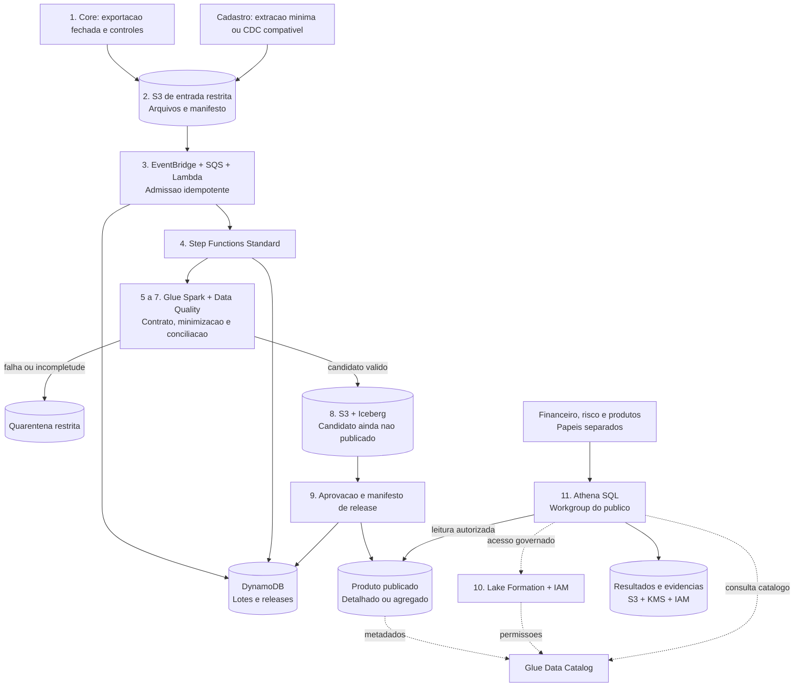
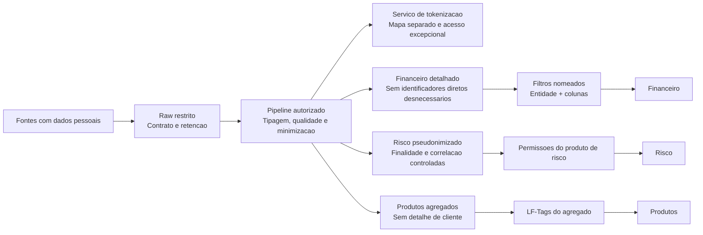
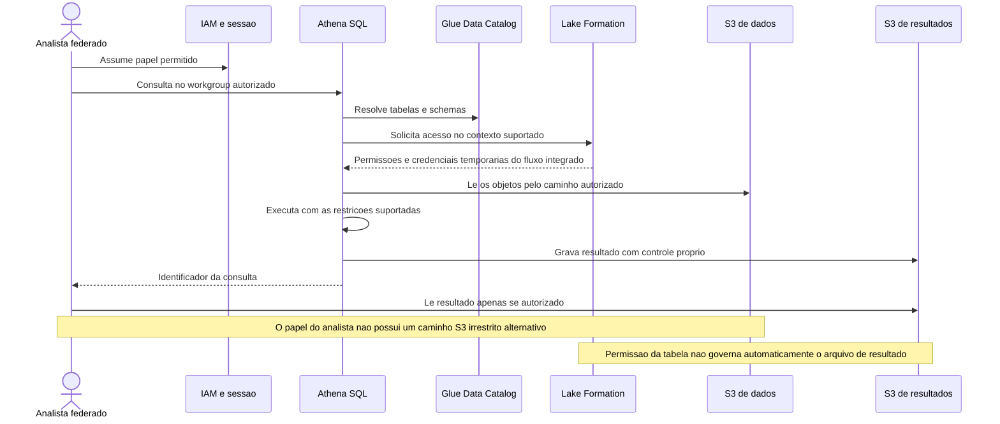
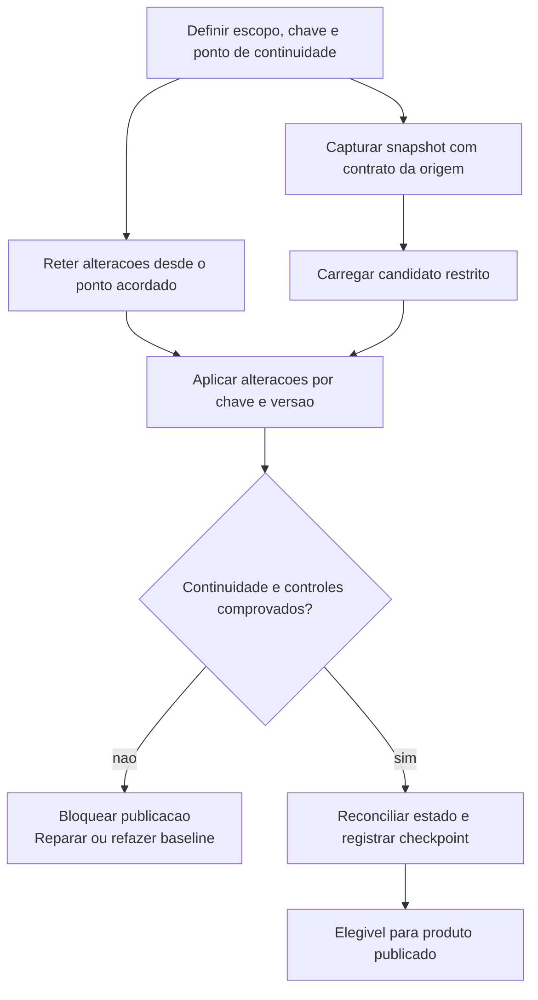
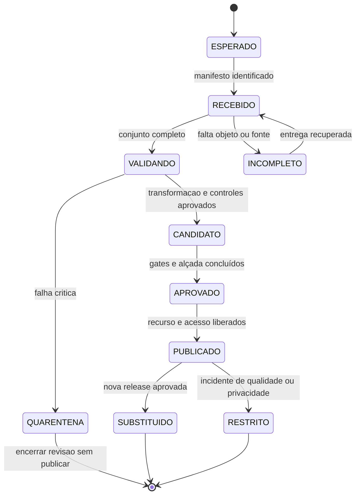
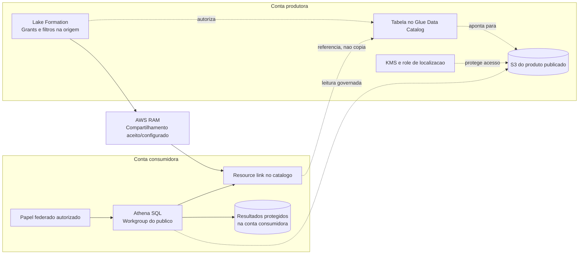
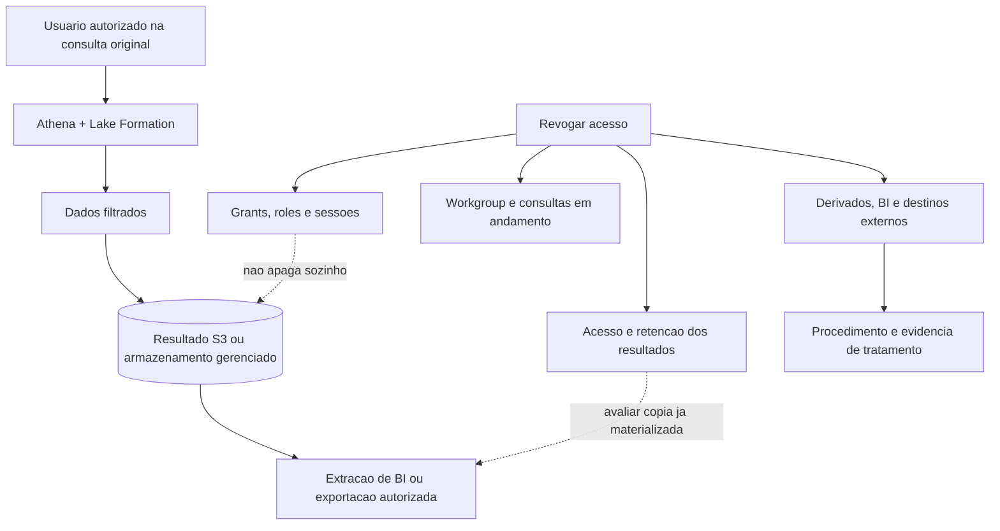
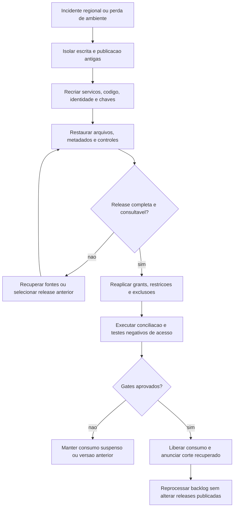

# Case 08 — Data Lake financeiro na AWS

> **Foco:** governança de dados, proteção de PII, AWS Lake Formation, qualidade financeira, analytics e publicação rastreável.  
> **Idioma:** português do Brasil. Os nomes dos serviços AWS e os identificadores de código foram preservados.  
> **Formato:** guia de estudo, decisões arquiteturais e simulação de entrevista.  
> **Referências consultadas em:** 28/09/2026.  
> **Caminho sugerido no repositório:** `cases/08-data-lake-financeiro.md`.

## Como usar este material

Este case continua os estudos de [pagamentos e Pix](01-payment-processing-pix.md), [Open Finance](02-open-finance-apis.md), [Banking Event-Driven](03-banking-event-driven.md), [KYC](04-kyc-abertura-de-conta.md), [modernização do core](05-modernizacao-core-banking.md), [GenAI para assessor financeiro](06-genai-assessor-financeiro.md) e [detecção de fraude](07-fraud-detection-tempo-real.md). Agora, a pergunta é: **como transformar dados de vários sistemas em análises financeiras confiáveis, sem transformar a centralização em acesso irrestrito às informações dos clientes?**

Construiremos uma plataforma analítica para **conciliação de lançamentos, acompanhamento financeiro e análises de risco**, com produtos de dados e públicos distintos. O core permanece responsável por saldos e lançamentos. O lake conserva evidências, transforma, publica e permite analisar; não passa a autorizar pagamentos porque contém uma cópia dos dados.

Na primeira leitura, percorra as seções 1 a 7 e a comparação de serviços da seção 12. Depois aprofunde três fronteiras: **quando um dado pode ser publicado, quem pode consultá-lo e para onde vai o resultado da consulta**. Por último, responda às perguntas sem abrir as respostas e apresente a arquitetura em voz alta.

**Frase central:** “O S3 armazena, o catálogo descreve, o pipeline valida, o Lake Formation governa os acessos integrados e a área responsável aprova o significado financeiro do que foi publicado.”

Este documento é um cenário didático, não uma arquitetura oficial AWS, uma plataforma homologada, um parecer jurídico ou uma rubrica oficial de entrevista. L5 é o alvo de preparação informado. Volumes, prazos, clientes, contas, entidades jurídicas, regras e contratos são fictícios. O laboratório usa somente dados sintéticos. A política de retenção, as finalidades de tratamento e os requisitos regulatórios reais precisam de validação institucional.

### Dois níveis de estudo

**Núcleo para defender no quadro:** fontes autoritativas → ingestão com contrato → área restrita → qualidade e minimização → produto publicado → acesso autorizado → resultado protegido → evidência e operação.

**Aprofundamento:** CDC, snapshots Iceberg, fechamento entre tabelas, filtros do Lake Formation, permissões efetivas, compartilhamento entre contas, extrações de BI, retenção e reconstrução regional.

Não é necessário começar com MSK, EMR, Redshift, um catálogo corporativo adicional e todas as opções de streaming. A arquitetura-base usa serviços gerenciados e um fluxo batch bem definido; as extensões têm requisitos explícitos.

---

## Sumário

1. [Problema de negócio e escopo](#s01)
2. [Vocabulário e modelo mental](#s02)
3. [Perguntas antes de desenhar](#s03)
4. [Requisitos, premissas e invariantes](#s04)
5. [Decisões da arquitetura-base](#s05)
6. [Arquitetura e fronteiras em Mermaid](#s06)
7. [Fluxo explicado em 12 etapas](#s07)
8. [Ingestão, contratos, CDC e qualidade financeira](#s08)
9. [Lake Formation, identidade e autorização efetiva](#s09)
10. [PII, produtos de dados, Iceberg e publicação](#s10)
11. [Papel e posicionamento dos serviços](#s11)
12. [Trade-offs que precisam ser defendidos](#s12)
13. [Rede, contas e compartilhamento](#s13)
14. [Segurança, resultados de consultas e retenção](#s14)
15. [Alta disponibilidade, recuperação regional e reprocessamento](#s15)
16. [Desempenho, capacidade e custos](#s16)
17. [Observabilidade, operação e implantação](#s17)
18. [Aplicação dos seis pilares Well-Architected](#s18)
19. [Roteiro de laboratório e testes](#s19)
20. [30 perguntas de entrevista com respostas comentadas](#s20)
21. [Apresentação da solução e simulação de 45 minutos](#s21)
22. [Checklist de domínio](#s22)
23. [Referências e leitura orientada](#s23)

---

<a id="s01"></a>
## 1. Problema de negócio e escopo

### Enunciado inicial

> Um banco brasileiro mantém lançamentos no core, informações cadastrais em outro sistema e eventos operacionais nos canais digitais. Financeiro, risco e produtos produzem relatórios diferentes sobre os mesmos períodos. Há planilhas com dados de clientes, consultas pesadas nas origens e pouca rastreabilidade sobre quais dados geraram cada número. Como construir um data lake financeiro na AWS com qualidade, governança, proteção de informações pessoais e acesso para analytics?

A resposta não deve começar com “vamos copiar todos os bancos para o S3”. Primeiro, precisamos descobrir **quais decisões e relatórios dependem desses dados, qual é a fonte oficial e qual informação cada consumidor realmente precisa**.

### Exemplo concreto

O financeiro precisa explicar o movimento de uma entidade jurídica no dia anterior. A área de risco precisa de uma série histórica de comportamento, sem nome ou CPF na rotina de exploração. Produtos precisa acompanhar volumes por canal, sem visualizar transações identificáveis de clientes.

Uma transferência pode aparecer como solicitação no aplicativo, autorização no serviço de pagamentos e lançamento no core. Somar as três ocorrências como três movimentos financeiros produziria um relatório incorreto, mesmo com um pipeline tecnicamente saudável.

**Chegar ao lake não torna o dado financeiro definitivo.** A autoridade depende do domínio e do contrato da fonte.

### Produtos iniciais

| Produto de dados | Origem autoritativa | Público | Conteúdo e condição de uso |
|---|---|---|---|
| Lançamentos conciliados D-1 | Exportação fechada do core | Financeiro autorizado por entidade | Detalhe necessário, referências opacas e evidência de fechamento |
| Histórico de comportamento | Lançamentos e eventos identificados por tipo | Risco autorizado | Identificadores pseudonimizados, versões e instante de disponibilidade |
| Volumes por canal | Eventos operacionais e/ou lançamentos, sem misturar métricas | Produtos | Agregados revisados, com restrições a grupos excessivamente pequenos |
| Evidência de um fechamento | Manifests, snapshots, regras e saída aprovada | Auditoria e responsáveis | Pacote de reprodução de uma versão específica do relatório |

A primeira entrega será **lançamentos conciliados D-1**. A atualização intradiária de indicadores é uma evolução e será explicitamente rotulada como provisória quando ainda não houver fechamento da fonte.

### Fronteiras de responsabilidade

| Responsabilidade | Dono na proposta |
|---|---|
| Confirmar saldo e lançamento | Core e sistemas financeiros de origem |
| Definir a extração, o período e os totais de controle | Dono da fonte com o financeiro |
| Entregar arquivos/eventos identificáveis e recuperáveis | Integração da origem |
| Validar contratos, transformar e reconciliar | Pipeline de dados |
| Aprovar definições, qualidade e publicação | Dono do produto de dados e área responsável |
| Definir finalidade e acesso | Negócio, governança, privacidade e segurança |
| Aplicar permissões no caminho analítico integrado | IAM, Lake Formation e engine compatível |
| Proteger arquivos, chaves e resultados materializados | S3, KMS, IAM e controles do consumidor |
| Preservar evidências e responder a incidentes | Operação, segurança e responsáveis pelo dado |

### Fora do núcleo

Não construiremos um ledger, um data lake que alimenta diretamente a autorização de fraude em milissegundos, todos os relatórios regulatórios do banco ou um sistema de anonimização infalível. Também não copiaremos imagens de documentos de KYC, credenciais ou extratos completos só porque existe espaço no S3.

O projeto inicial não exige uma migração completa do data warehouse. Um warehouse existente pode continuar atendendo workloads específicos enquanto novos produtos são publicados pelo lake.

**Critério de sucesso:** reduzir divergência e tempo para obter análises autorizadas, demonstrando origem, qualidade e uso correto. Ter muitos terabytes centralizados não é, sozinho, resultado de negócio.

---

<a id="s02"></a>
## 2. Vocabulário e modelo mental

### A analogia do arquivo financeiro

Imagine um arquivo com recepção, área de conferência, acervo publicado e salas de consulta. Receber uma caixa não autoriza todos a abri-la; escrever “conferido” na etiqueta não prova que os valores estão certos; permitir uma consulta não torna qualquer cópia produzida automaticamente protegida.

Na arquitetura, as zonas organizam o ciclo do dado. As políticas determinam acesso. Os testes demonstram qualidade. Os controles dos resultados tratam o que saiu da consulta.

| Termo | Significado neste case |
|---|---|
| Data lake | Plataforma de armazenamento e consumo de dados de diferentes origens e formatos |
| Lakehouse | Uso de formatos de tabela, metadados e engines para oferecer capacidades analíticas sobre o lake |
| Data warehouse | Ambiente analítico estruturado, com modelo e execução orientados às necessidades de consulta |
| Produto de dados | Dataset com dono, finalidade, contrato, qualidade, acesso, suporte e ciclo de vida |
| Raw / landing | Entrada restrita que preserva o contrato recebido, dentro da política de retenção |
| Quarentena | Dados ou lotes ainda não elegíveis para publicação, por problema ou validação pendente |
| Curated | Dados transformados, tipados e validados para usos definidos |
| Serving / consumo | Produto pronto para um consumidor, com semântica e permissões explícitas |
| ETL / ELT | Transformar antes de carregar no destino de consumo / carregar e transformar no ambiente analítico |
| Data Catalog | Metadados sobre bases, tabelas, schemas e localizações; não é o armazenamento das linhas |
| Crawler | Componente que descobre estruturas; não é a autoridade de aprovação do contrato |
| PII | Informação que identifica ou permite relacionar uma pessoa, direta ou indiretamente |
| Pseudonimização | Substituição de identificadores, preservando possibilidade de ligação sob condições específicas |
| Anonimização | Tratamento cuja avaliação depende do risco de identificação e do contexto; não é sinônimo de hash |
| Tokenização | Substituição por referência controlada, com política para correlação e eventual reversão |
| LF-Tag | Tag do Lake Formation usada para organizar e conceder acesso a recursos do catálogo |
| TBAC | Controle de acesso baseado em tags, no mecanismo aplicável |
| Filtro de dados | Restrição de linhas, colunas ou células em operações e engines suportadas |
| Resource link | Referência no catálogo a um recurso compartilhado; não é uma cópia dos dados |
| CDC | Captura de alterações; inclui semântica de operação, ordem e recuperação |
| Snapshot | Versão consistente de uma tabela ou extração, segundo o mecanismo utilizado |
| Manifesto de entrada | Lista de arquivos e controles que define um lote esperado |
| Manifesto de publicação | Relação das versões que compõem uma entrega analítica aprovada |
| Lineage / linhagem | Relação entre fonte, transformação, produto e utilização |
| Data contract | Contrato de schema, semântica, qualidade, disponibilidade e evolução |
| Data freshness | Idade dos dados em relação ao ponto de negócio que se pretende observar |
| Data quality | Qualidade segundo regras técnicas e de negócio, não apenas ausência de erro no job |
| Workgroup | Agrupamento do Athena para configurações, acesso operacional e controle de workloads |
| Time travel | Consulta a uma versão histórica disponível de uma tabela |
| Release | Versão publicada de um produto ou fechamento, identificada e reproduzível |
| RTO / RPO | Tempo-alvo de recuperação / perda de dados admissível, expressa em tempo |

Lake Formation trabalha com o Glue Data Catalog e serviços analíticos integrados; ele não é um novo banco onde as linhas são armazenadas. O catálogo mantém metadados, enquanto o armazenamento desta proposta continua no S3. [Fontes: Lake Formation][r01], [Data Catalog][r03]

### Quatro afirmações diferentes

| Afirmação | O que demonstra | O que ainda não demonstra |
|---|---|---|
| “O arquivo chegou” | Houve uma entrega | Que todo o lote e todas as fontes chegaram |
| “O job terminou” | A execução concluiu conforme seu código | Que a transformação preservou os valores corretos |
| “O dado foi classificado” | Há informação sobre a sensibilidade | Que o acesso e a exportação estão protegidos |
| “A consulta foi autorizada” | Aquele caminho aceitou a leitura | Que o resultado pode ser reutilizado por qualquer pessoa |

**Modelo mental:** catálogo não é qualidade; criptografia não é autorização; pseudônimo não é anonimato; réplica analítica não é fonte oficial de saldo.

---

<a id="s03"></a>
## 3. Perguntas antes de desenhar

Uma boa abertura seria:

> “Quero entender quais relatórios e decisões vamos atender, quem confirma os valores, quão atuais eles precisam estar e quais públicos podem ver cada nível de detalhe. Também preciso saber como cada fonte identifica um lote completo e uma correção posterior.”

| Pergunta ao cliente | Como a resposta altera a arquitetura |
|---|---|
| Qual é o primeiro produto de dados e quem responde por ele? | Evita começar por uma plataforma sem consumidor ou dono |
| O objetivo é conciliação, BI, treinamento de ML ou decisão online? | Muda latência, modelo, qualidade e forma de acesso |
| Qual sistema é autoritativo para cada métrica? | Impede somar fatos de diferentes estágios da mesma transação |
| “D-1” significa qual data contábil, fuso e janela de fechamento? | Define cortes e tratamento de eventos recebidos após meia-noite |
| Há totais de controle, sequência e lista de arquivos na origem? | Permite detectar ausência, duplicação e alteração de lote |
| A origem oferece exportação, API, eventos ou CDC suportado? | Determina a integração viável e seu impacto operacional |
| A origem é PostgreSQL, Db2 LUW ou Db2 for z/OS? | Evita presumir compatibilidade de conectores pelo nome da família |
| Correções alteram uma linha ou geram novo lançamento? | Define histórico, versão, estorno e regra de deduplicação |
| Qual informação pessoal é necessária em cada produto? | Orienta minimização e separação de datasets |
| Quais entidades jurídicas, carteiras ou unidades cada papel pode acessar? | Exige restrição por linha e identificação do principal real |
| Um analista precisa de CPF ou apenas de correlação estável? | Pode retirar identificadores diretos do caminho de consumo |
| Como os usuários entram: federação, roles, aplicação ou BI? | Define a identidade efetivamente vista pelo engine |
| Os consumidores fazem download, CTAS, UNLOAD ou extrações de BI? | Amplia o perímetro para resultados e cópias derivadas |
| Já existem permissões amplas em S3 e no catálogo? | Pode exigir migração do modelo de acesso antes de publicar |
| Qual retenção se aplica a raw, tabelas, resultados e evidências? | Evita guardar tudo para sempre ou apagar evidência necessária |
| Como são tratados pedidos de correção, exclusão e bloqueio? | Exige localizar versões e destinos derivados |
| Quais tabelas precisam representar o mesmo fechamento? | Exige um contrato de versão além de commits independentes |
| Qual o volume diário, tamanho dos arquivos e número de consultas? | Orienta particionamento, compactação, execução e orçamento |
| Qual o RTO/RPO por produto e até onde a fonte permite replay? | Define recuperação sem presumir que objetos replicados bastam |
| Quem pode mudar tags, grants, regras de qualidade e classificação? | Define segregação de funções e proteção contra privilégio indireto |

Priorize inicialmente produto, autoridade financeira, atualidade e autorização. São as respostas que mais alteram a solução.

---

<a id="s04"></a>
## 4. Requisitos, premissas e invariantes

### Premissas didáticas

| Categoria | Premissa de trabalho |
|---|---|
| Produto inicial | Fechamento analítico D-1 de lançamentos conciliados, por entidade jurídica |
| Fonte financeira | Exportação do core após seu fechamento, com manifesto e controles aprovados |
| Fonte cadastral | PostgreSQL compatível com o conector, com campos mínimos e histórico de vigência |
| Eventos digitais | Extensão para métricas operacionais; não substituem os lançamentos do core |
| Região primária | `sa-east-1`, sujeita à compatibilidade, disponibilidade e política institucional |
| Volume para dimensionamento | 200 GB/dia de entrada, antes de compressão e cópias; hipótese, não medição |
| Consumo | 50 analistas; até 10 consultas simultâneas no exercício inicial |
| Prazo D-1 | Produto disponível até 08h no calendário de negócio, se as fontes cumprirem o contrato |
| Evolução intradiária | Alvo de até 15 minutos de atraso, com indicador explícito de completude |
| Qualidade financeira | Nenhuma publicação como “conciliada” com controle crítico reprovado |
| Autorização | Financeiro por entidade; risco pseudonimizado; produtos com agregados separados |
| Privacidade | Sem nomes, CPFs ou documentos brutos nos produtos que não os exigem |
| Recuperação | Exercício inicial de RTO regional de 4h; RPO e replay definidos por classe de dado |
| Custos | Orçamento de armazenamento, transformação, consultas, auditoria e transferência |

As metas são hipóteses de estudo, não SLAs da AWS. O atraso precisa ser medido **da disponibilidade da informação na origem até sua publicação utilizável**, não só da chegada ao S3 até o fim do job.

### Invariantes

1. O lake não altera o resultado financeiro autoritativo para fazer a conciliação “fechar”.
2. Um lote repetido com a mesma identidade e o mesmo conteúdo não duplica registros; identidade repetida com conteúdo diferente gera conflito.
3. Dados incompletos não são publicados como um fechamento completo.
4. Regra crítica de negócio reprovada bloqueia a publicação, mesmo com um score geral de qualidade alto.
5. O principal não recebe acesso bruto ao S3 como atalho para contornar os filtros analíticos.
6. Todo produto tem dono, finalidade, classificação, contrato e política de retenção.
7. O relatório oficial aponta a versão das fontes, transformações e tabelas usadas.
8. Resultado materializado e extração de BI recebem controle próprio; não presumimos herança automática das permissões da origem.
9. Um pedido legítimo de eliminação considera snapshots, versões, réplicas e derivados, respeitando retenções aplicáveis.
10. O retorno de uma falha não publica um dado sem reconstruir as mesmas restrições de acesso.

### Como tratar indisponibilidade de uma fonte

Se o core não produzir o fechamento, a plataforma pode manter a versão aprovada anterior e apresentar o atraso. Um painel provisório pode continuar disponível **como provisório**, com fonte e corte identificados. Não substituímos silenciosamente um fechamento faltante por “o que deu para carregar”.

---

<a id="s05"></a>
## 5. Decisões da arquitetura-base

A base será **S3 + Glue + Glue Data Catalog + Lake Formation + Athena SQL**, com Step Functions para coordenação, DynamoDB para controle de lotes/releases, e eventos apenas para iniciar e acompanhar o processamento.

### O que entra primeiro

| Componente | Decisão e responsabilidade |
|---|---|
| S3 de entrada restrita | Recebe arquivos e manifestos sob contrato, sem acesso geral de analistas |
| EventBridge, SQS e Lambda | Registram a chegada do manifesto e iniciam trabalho recuperável |
| Step Functions Standard | Coordena validação, transformação, testes, aprovação e publicação |
| Glue Spark + Glue Data Quality | Transforma dados e executa regras técnicas e financeiras complementares |
| S3 com Parquet em tabelas Iceberg | Armazena produtos com versões e evolução controlada |
| Glue Data Catalog | Registra schemas, tabelas e localização dos produtos |
| Lake Formation | Concede acesso ao catálogo/dado em engines integrados, com política explícita |
| Athena SQL | Consulta datasets publicados, usando workgroups compatíveis com seus públicos |
| DynamoDB | Guarda controle de ingestão, estados, conflitos e manifestos de releases; não o ledger |
| IAM, KMS e CloudTrail | Identidades, criptografia e evidências de acesso/alteração |
| Macie | Detecção complementar de dados sensíveis, não porta única de aprovação |

A integração Step Functions–Glue permite aguardar jobs pelo padrão `.sync`. O workflow carrega referências a objetos e execuções, não arquivos financeiros inteiros em seu estado. [Fonte: integração Glue][r05]

### O que fica como alternativa ou evolução

**DMS:** usado para uma origem comprovadamente compatível, com contrato de snapshot e continuidade. Para o core assumido, o batch fechado é a fonte inicial. Não dependemos de CDC de mainframe não demonstrado.

**Kinesis/Firehose/MSK:** entram quando o produto exige ingestão contínua e a origem a suporta. Não reduzem automaticamente o prazo de um fechamento que depende de validações e fontes batch.

**Redshift:** avaliado para marts e BI com características que justifiquem o custo e a cópia adicional. Não é obrigatório para começar a consultar dados no S3.

**EMR:** alternativa quando controle do runtime, bibliotecas, cargas ou operação existente justificar. Não cria governança automaticamente.

**S3 Tables:** alternativa de armazenamento gerenciado de tabelas. A base usa buckets S3 de uso geral para deixar visíveis os papéis de dados, catálogo, engine e manutenção. A matriz de integração e permissões deve ser revalidada numa adoção de table buckets. [Fonte: S3 Tables][r40]

### Decisão de formato e versão

No estudo, os produtos usam **Apache Iceberg no formato v2**, arquivos Parquet e Glue Data Catalog. O runtime do Glue e a versão do engine Athena são fixados e testados em conjunto. “Versão do Glue”, “versão da biblioteca Iceberg” e “format-version da tabela” não são o mesmo número.

A documentação do Athena limita sua operação com Iceberg a tabelas v2 e enumera restrições de engine, catálogo e autorização. A documentação do Glue mostra que o suporte de Iceberg varia por runtime. Por isso, atualizar o formato não será uma mudança automática de rotina. [Fontes: Athena/Iceberg][r10], [Glue/Iceberg][r09]

### Decisão de autorização

Dados detalhados terão grants nomeados e filtros explícitos por papel, com colunas permitidas. Produtos agregados separados poderão usar LF-Tags. **Não vamos presumir que um grant amplo por tag será reduzido por um filtro restritivo concedido em paralelo.** Essa decisão será aprofundada na seção 9.

---

<a id="s06"></a>
## 6. Arquitetura e fronteiras em Mermaid

Os diagramas são visões lógicas. S3, Lake Formation, Data Catalog e Athena são serviços gerenciados; as caixas não representam appliances instalados em uma subnet do cliente.

### 6.1 Visão geral



### 6.2 Camadas e minimização



Essa separação é uma decisão de desenho, não uma propriedade automática de chamar buckets de bronze, silver e gold. Um bucket chamado `gold` pode conter dados excessivos e permissões ruins.

### 6.3 Caminho da autorização de leitura



Lake Formation usa uma role de registro de localização para o acesso integrado e a concessão de credenciais temporárias. **Essa integração não impede uma chamada direta ao S3 que já seja permitida por outras políticas.** O desenho precisa fechar esse caminho alternativo. [Fonte: acesso aos dados subjacentes][r02]

---

<a id="s07"></a>
## 7. Fluxo explicado em 12 etapas

### 1. Definir o produto, a fonte oficial e o corte

O dono do produto define quais fatos compõem o fechamento. Identifica a entidade jurídica, o período contábil, a moeda, a regra de sinal, a completude esperada e quem aprova exceções.

**Não começa pela ferramenta:** o que significa “volume transferido”? Valor solicitado, autorizado, efetivado, liquidado ou devolvido? O contrato precisa escolher e nomear.

**Evidência esperada:** contrato versionado, fonte responsável, critérios de aceitação e regras financeiras aprovadas.

### 2. Receber arquivos com manifesto

A origem entrega arquivos em chaves únicas no S3 e publica por último um manifesto que lista os objetos esperados. O manifesto inclui identidade do lote, versões quando aplicável, checksums, contagem e totais de controle.

Uma gravação isolada de arquivo não dispara a publicação de um período inteiro. A integração valida se quem entregou tem permissão para aquela fonte e se o conjunto corresponde ao contrato.

**Falha importante:** manifesto chegou, mas falta um arquivo. O lote permanece incompleto; a ausência não vira zero financeiro.

### 3. Admitir o lote de forma idempotente

O evento do manifesto chega ao consumidor de admissão. Ele registra no DynamoDB a identidade do lote e o hash do manifesto por escrita condicional. Mesmo ID e mesmo conteúdo reutilizam o processamento; mesmo ID com hash diferente abre conflito.

A entrega de notificações S3 pode se repetir. O controle usa identidade de negócio e estado durável, não assume uma única execução por evento. Uma varredura de lotes esperados cobre eventos perdidos no encadeamento ou configurações incorretas. [Fonte: eventos S3][r04]

### 4. Validar contrato e elegibilidade

O workflow verifica fonte, schema, tipo, codificação, arquivos, versão e limites de tamanho. A role de transformação lê apenas as entradas previstas. Campo novo potencialmente pessoal bloqueia a publicação até classificação e revisão, em vez de ser propagado pelo crawler para todos.

A Lambda coordena trabalho pequeno; o job de dados processa o lote. Bytes financeiros não são colocados em mensagens ou no histórico inteiro do Step Functions.

### 5. Normalizar preservando significado

O Glue transforma códigos, tipos e timestamps segundo o contrato. Mantém `source_system`, identidade do registro, versão, período de negócio e instante de ingestão.

Valores monetários usam escala definida. Identificadores como CPF e conta não viram inteiros que perdem zeros à esquerda. O pipeline não interpreta “último arquivo que chegou” como a última versão de negócio.

### 6. Minimizar e pseudonimizar

Campos desnecessários são removidos antes do produto analítico. Quando a finalidade precisa de correlação, utiliza-se uma referência controlada, não nome/CPF por conveniência. A tabela de reversão ou serviço de tokenização fica em outro perímetro.

Detecção de PII do Glue e varreduras do Macie ajudam a encontrar desvios, mas não substituem classificação por contrato. A descoberta automatizada do Macie pode usar amostragem; não significa inspeção universal de cada versão histórica. [Fontes: detecção no Glue][r13], [classificação no Macie][r14]

### 7. Validar qualidade técnica e financeira

Executam-se regras de preenchimento, domínio, unicidade, integridade referencial, completude e reconciliação. Comparam-se totais por entidade, moeda, conta e tipo de movimento conforme o produto, não só o total global.

**Um lote com 99 de 100 regras aprovadas não pode ser publicado se a regra reprovada for a conciliação crítica.** O score do Glue Data Quality é um indicador; o gate de publicação é uma decisão explícita do workflow. [Fonte: Glue Data Quality][r11]

### 8. Construir uma versão candidata

O pipeline escreve as tabelas candidatas em área sem grants de consumo. Registra os snapshots e as versões de código, schema e regras. Validação concluída não significa que os usuários já enxergam aquela tabela.

Se houver mais de uma tabela, o conjunto candidato identifica todas as versões usadas. Um commit bem-sucedido em `lancamentos` não prova que `contas` e `classificacao_contabil` correspondem ao mesmo fechamento.

### 9. Publicar uma release aprovada

Um publicador separado valida os gates e cria a release imutável do produto. No núcleo D-1, o resultado de fechamento é materializado como uma tabela de consumo autocontida, com período e release identificados; sua exposição só ocorre após validação.

Para produtos com múltiplas tabelas, consumidores oficiais usam o manifesto com versões fixadas. Não alegamos uma transação atômica que inclua todos os grants do Lake Formation, catálogo e objetos S3.

**Falha segura:** candidato inválido não substitui a última release aprovada.

### 10. Conceder acesso pelo papel adequado

O principal recebe apenas o produto e o nível de detalhe necessários. O financeiro pode ter filtro de entidade e lista explícita de colunas. Produtos recebe agregado separado. Analistas não recebem `INSERT`, `ALTER`, poder de mudar a localização da tabela ou assumir a role de ingestão.

O conjunto efetivo de permissões é testado com casos negativos. Um grant amplo paralelo pode tornar o filtro restritivo irrelevante; a política não deve depender de uma interpretação intuitiva de “o mais restritivo vence”. [Fontes: permissões][r21], [notas de filtragem][r18]

### 11. Consultar e proteger o resultado

O Athena executa a consulta em workgroup compatível com o público e grava o resultado em destino protegido. Resultado, histórico SQL, exportação e extração de BI são tratados como novos artefatos com sensibilidade e retenção.

Na base, usamos bucket S3 de resultados administrado pelo banco para estudar essa fronteira. A alternativa atual de resultados gerenciados do Athena é discutida depois; não é obrigatório manter bucket próprio em todo desenho. [Fontes: workgroups][r30], [resultados gerenciados][r29]

### 12. Operar, provar e revisar

A operação acompanha chegada esperada, atraso, completude, qualidade, uso, custos, permissões e descarte. Um fechamento preserva a cadeia de evidência: fontes → transformação → versões → aprovação → consulta/saída.

Mudanças de schema, finalidade, acesso ou retenção passam por revisão. Uma correção financeira produz nova release e explica a diferença; não altera silenciosamente o histórico de um relatório aprovado.

---
<a id="s08"></a>
## 8. Ingestão, contratos, CDC e qualidade financeira

### 8.1 Três formas de ingestão, três contratos

| Forma | Boa aplicação | Cuidado principal |
|---|---|---|
| Exportação batch fechada | Fechamento contábil e fontes que oferecem arquivos controlados | Provar conjunto completo e semântica do corte |
| CDC | Acompanhar alterações de uma origem suportada | Snapshot inicial, continuidade, operações, ordem e recuperação |
| Eventos de domínio | Analisar fatos de negócio publicados pela aplicação | Duplicatas, versões, atraso e significado do evento |

Nenhum mecanismo elimina a necessidade de reconciliar. CDC replica mudanças; ele não cria automaticamente um produto financeiro com regras de negócio corretas. Eventos podem ser mais expressivos, mas precisam existir e ser publicados confiavelmente.

#### Sobre o mainframe dos cases anteriores

Não desenhe `Db2 for z/OS → DMS CDC → S3` como uma capacidade presumida. A documentação consultada de DMS para essa origem permite **Full Load**, mas não CDC. Um conector diferente, outbox, arquivos ou outra integração precisa ser validado com o ambiente real. [Fonte: Db2 for z/OS][r08]

No presente cenário, o core entrega um fechamento batch. O CDC opcional é aplicado ao PostgreSQL de cadastro, respeitando requisitos e impacto sobre a origem, incluindo retenção dos logs de replicação. [Fonte: PostgreSQL como origem][r06]

### 8.2 Contrato de um produto de dados

O contrato não é só `coluna: tipo`. Ele define a interpretação dos campos, a qualidade mínima e a resposta operacional quando algo muda.

Exemplo **interno e didático**, não schema de uma API AWS:

```json
{
  "datasetId": "financeiro.lancamentos_fechados",
  "contractVersion": "1.0.0",
  "owner": "financeiro-contabil",
  "sourceOfTruth": "core-postings-export",
  "purpose": "conciliacao-e-fechamento-interno",
  "grain": ["source_system", "posting_id", "posting_version"],
  "businessTime": {
    "dateField": "business_date",
    "timezone": "America/Sao_Paulo",
    "cutoffDefinedBy": "calendario-contabil-versionado"
  },
  "money": {
    "amountField": "amount_minor",
    "currencyField": "currency",
    "scale": 2,
    "supportedCurrencies": ["BRL"],
    "directionField": "direction"
  },
  "criticalChecks": [
    "manifest-complete",
    "posting-identity-unique",
    "debit-credit-reconciled",
    "account-level-reconciled",
    "required-sources-complete"
  ],
  "classification": "confidential-personal-pseudonymized",
  "retentionPolicyId": "POL-FIN-EXEMPLO-v1",
  "consumerSchemaEvolution": "explicit-allowlist-and-review"
}
```

`scale: 2` vale para o exemplo em BRL, não para qualquer instrumento ou moeda. Cálculos de juros, câmbio e precificação podem exigir outras escalas e regras de arredondamento.

O identificador de política de retenção aponta para uma decisão institucional. Não significa que exista uma duração universal dedutível do nome da tabela.

### 8.3 Manifesto de entrada e reentrega

Exemplo de lote sintético com seis lançamentos:

```json
{
  "batchId": "core-banco-a-2026-09-25-r1",
  "source": "core-postings-export",
  "contractVersion": "1.0.0",
  "entityId": "BANCO_A",
  "businessDate": "2026-09-25",
  "sourceClosureId": "fechamento-20260925-001",
  "complete": true,
  "files": [
    {
      "bucket": "banco-exemplo-raw",
      "key": "core/2026-09-25/r1/part-0001.jsonl",
      "versionId": "versao-sintetica-001",
      "sha256": "aaaaaaaaaaaaaaaaaaaaaaaaaaaaaaaaaaaaaaaaaaaaaaaaaaaaaaaaaaaaaaaa",
      "rowCount": 6
    }
  ],
  "controls": [
    {
      "currency": "BRL",
      "debitAmountMinor": 54000,
      "creditAmountMinor": 54000,
      "rowCount": 6
    }
  ]
}
```

O hash e o versionId acima são marcadores fictícios. Em uma entrega real, devem corresponder exatamente ao objeto recebido. O checksum prova integridade em relação a uma referência confiável; não prova que o conteúdo financeiro estava correto na origem. Um manifesto malicioso com hash recalculado continua malicioso.

**Reentrega correta:** mesmo lote, mesmos arquivos e versões reutilizam a ingestão existente. Um reparo autorizado recebe nova revisão, referencia a anterior e registra o motivo. Não sobrescreve silenciosamente o objeto sob o mesmo nome de fechamento.

O produtor entrega o manifesto após os arquivos, mas o consumidor ainda verifica a existência e integridade de todos eles. O marcador `complete: true` é uma declaração da origem, não uma substituição dos testes.

### 8.4 CDC não é uma tabela atual pronta para consulta

No destino S3, DMS pode gravar registros de carga e alterações. A documentação descreve operações e configurações próprias e informa que, por padrão, mudanças ficam separadas por tabela sem preservar a ordem de transações entre elas. A interpretação requer configuração e transformação explícitas. [Fonte: DMS com destino S3][r07]

Exemplo de **envelope normalizado pelo nosso adaptador**, não saída literal garantida do DMS:

```json
{
  "source": "cadastro-postgresql",
  "sourceTable": "customer_segment",
  "operation": "UPDATE",
  "entityKey": "cliente-token-017",
  "sourceVersion": "0000000000000042",
  "sourceCommitPosition": "posicao-nativa-do-conector",
  "sourceCommitTime": "2026-09-25T19:00:00Z",
  "ingestedAt": "2026-09-25T19:00:04Z",
  "schemaVersion": "1",
  "after": {
    "segment": "VAREJO",
    "validFrom": "2026-09-25"
  }
}
```

`sourceVersion` precisa vir de uma sequência confiável ou ser construída conforme a semântica do conector. Não geramos essa versão a partir do relógio de ingestão para fingir ordem de origem.

O materializador precisa interpretar inserções, atualizações e exclusões. A regra “pegar o último timestamp” é insuficiente quando há relógios diferentes, atrasos, empates ou precisão reduzida. A ordem de chegada ao S3 não é autoridade transacional.

### 8.5 Snapshot e continuidade sem buraco

Uma migração inicial de tabela precisa estabelecer um snapshot de referência e a posição a partir da qual as alterações serão aplicadas. O procedimento exato depende da origem e do conector; o desenho não presume snapshot global consistente de todos os sistemas do banco.



Uma falha com perda do trecho de log não pode ser resolvida avançando o checkpoint até a posição mais recente. Isso pula fatos. É preciso recuperar o intervalo ou refazer um baseline reconciliado.

**Consumir CDC de cadastro não altera retrospectivamente todo relatório financeiro.** Para uma análise por segmento na data do lançamento, o join usa a vigência acordada. Para “classificação atual”, usa outra regra. As duas perguntas são legítimas, mas não equivalentes.

### 8.6 Qualidade técnica e qualidade financeira

Um ruleset simples de DQDL pode começar assim:

```text
Rules = [
  IsComplete "posting_id",
  IsComplete "business_date",
  IsComplete "entity_id",
  IsComplete "account_token",
  IsComplete "amount_minor",
  IsComplete "direction",
  ColumnValues "currency" in ["BRL"],
  ColumnValues "direction" in ["DEBIT", "CREDIT"],
  ColumnValues "amount_minor" >= 0
]
```

A sintaxe segue a referência DQDL; sua execução no runtime escolhido faz parte do laboratório. A unicidade neste modelo é composta e deve ser testada sobre a chave completa, não com `IsUnique "posting_id"` quando diferentes fontes reutilizam identificadores. [Fonte: DQDL][r12]

Além desse ruleset, implemente testes de contrato e negócio:

| Teste | Exemplo de falha detectada |
|---|---|
| Identidade composta única | Reprocessamento incluiu duas vezes o mesmo lançamento e versão |
| Conjunto completo de arquivos | Manifesto lista três objetos, mas só dois foram recebidos |
| Fonte esperada | Um arquivo de homologação apareceu no caminho de produção |
| Total por moeda e entidade | Conversão de centavos para reais feita duas vezes |
| Totais por conta e rubrica | Valores atribuídos às contas erradas sem mudar o total geral |
| Integridade referencial temporal | Lançamento ligado a uma classificação que não valia naquela data |
| Continuidade | Faltou um intervalo de alterações antes do checkpoint |
| Tratamento de estorno | O job descartou o estorno como duplicata de mesmo valor |
| Classificação de campo novo | CPF foi incluído numa coluna antes inexistente |
| Semântica do período | UTC foi usado como data contábil sem considerar o calendário |

### 8.7 Exemplo: o total fecha e o dado está errado

Considere o conjunto fictício:

| ID | Conta | Direção | Centavos | Observação |
|---|---|---|---:|---|
| P1 | A | DEBIT | 50.000 | Transferência |
| P2 | B | CREDIT | 50.000 | Contrapartida da transferência |
| P3 | A | DEBIT | 2.000 | Tarifa |
| P4 | RECEITA | CREDIT | 2.000 | Contrapartida da tarifa |
| P5 | A | CREDIT | 2.000 | Estorno de P3 |
| P6 | RECEITA | DEBIT | 2.000 | Estorno de P4 |

Débitos e créditos totalizam **54.000 centavos cada**. A movimentação líquida de A é −50.000; de B, +50.000; de RECEITA, zero. Esses valores são movimentos no conjunto, não saldos finais das contas.

Se o pipeline trocar A e B em P1/P2, os totais globais continuam iguais. O resultado financeiro por conta fica errado. Por isso, conciliação financeira exige dimensões e identidades, não apenas `SUM(amount)`.

O estorno também não é um erro a apagar: é um novo fato relacionado ao lançamento original. A visão de líquido pode somá-los; a trilha precisa explicar ambos.

### 8.8 Quarentena não é descarte invisível

Um pipeline que remove “as linhas ruins” e publica o restante pode distorcer o fechamento. Para um produto financeiro completo, a rejeição de um registro crítico bloqueia o lote ou exige uma regra institucional de publicação parcial claramente identificada.

A quarentena preserva o motivo, o lote e a localização restrita. O dashboard operacional mostra o impacto e o responsável. A correção gera uma execução rastreável; não exige dar acesso bruto a todos os analistas para que descubram o problema.

---

<a id="s09"></a>
## 9. Lake Formation, identidade e autorização efetiva

### 9.1 O que Lake Formation resolve

Lake Formation centraliza permissões sobre recursos do catálogo e permite controles granulares em serviços integrados. O desenho combina essas permissões com IAM e acesso à localização registrada. Ele não autentica sozinho a pessoa que usa o banco e não aplica filtros a qualquer programa que consiga ler arquivos no S3. [Fonte: visão geral][r01]

**Pergunta obrigatória:** qual principal é visto pelo engine? Um usuário federado, uma role específica da equipe, uma role compartilhada pelo BI ou uma identidade propagada por uma integração suportada?

Se todos os usuários acessarem pela mesma role com acesso amplo, o Lake Formation não descobre automaticamente qual cliente ou carteira cada pessoa deveria enxergar. A integração de identidade precisa transportar um contexto confiável ou selecionar um principal de menor privilégio.

### 9.2 Cinco camadas diferentes de permissão

| Camada | O que controlamos | Erro que queremos evitar |
|---|---|---|
| Identidade/federação | Quem assume cada role e com quais condições | Analista assumindo role de pipeline |
| IAM do serviço | Ações de Athena, Glue, Lake Formation e recursos operacionais | Usuário escolhendo qualquer workgroup ou alterando o catálogo |
| Lake Formation | Recursos e dados autorizados no fluxo integrado | SELECT amplo anulando a intenção do filtro |
| S3 e KMS | Acesso físico aos arquivos e chaves | Leitura direta dos objetos brutos fora do engine |
| Resultados e BI | Acesso às novas cópias e à aplicação consumidora | Pessoa revogada baixando uma extração já materializada |

`DATA_LOCATION_ACCESS` não é uma permissão de leitura de linhas. Ela se relaciona à criação de recursos de catálogo que apontam para determinadas localizações. O analista também não deve receber a role usada para registrar o local. [Fonte: localização e acesso][r02]

Além do `SELECT` apropriado, o caminho integrado requer a permissão IAM `lakeformation:GetDataAccess` e as ações necessárias de Athena/catálogo. Para `GetDataAccess`, a documentação exige `Resource: "*"`; isso não significa conceder `s3:GetObject` irrestrito ao usuário nem substituir os grants de dados. A ação autoriza a solicitação no mecanismo, enquanto o escopo dos dados continua sendo verificado. [Fonte: acesso integrado][r02]

### 9.3 Papéis da proposta

| Papel | Pode | Não deve poder |
|---|---|---|
| Ingestão da fonte | Gravar objetos no escopo da fonte e manifestos | Consultar todo o lake ou aprovar um produto |
| Transformação | Ler entradas específicas e gravar candidatos | Conceder acesso a analistas por conta própria |
| Publicação | Validar gates, registrar produto e aplicar permissões aprovadas | Corrigir valores arbitrariamente para fechar um lote |
| Financeiro BANCO_A | Consultar colunas autorizadas da entidade BANCO_A | Consultar BANCO_B, mudar filtros ou ler raw |
| Risco | Consultar produto pseudonimizado autorizado | Reverter tokens sem outro processo |
| Produtos | Consultar agregados aprovados | Recuperar detalhe de clientes por acesso alternativo |
| Auditoria | Ler evidências previstas e executar consultas autorizadas | Assumir que “auditor” significa acesso irrestrito a tudo |
| Administração de segurança | Administrar o escopo delegado e acessos emergenciais | Operar silenciosamente sem trilha ou revisão |

Uma role de ETL com acesso amplo dentro do seu domínio é um principal de alta confiança. Restringir quem pode alterar seu código, seu `PassRole`, dependências, parâmetros e destinos é tão importante quanto restringir consultas.

### 9.4 Filtro explícito de linhas e colunas

Exemplo de payload de criação de um filtro com `CreateDataCellsFilter`. Os identificadores são fictícios e a tabela deve existir no catálogo:

```json
{
  "TableData": {
    "TableCatalogId": "111122223333",
    "DatabaseName": "financeiro_publicado",
    "TableName": "lancamentos_r20260925_001",
    "Name": "financeiro-banco-a-sem-identificacao-direta",
    "RowFilter": {
      "FilterExpression": "entity_id = 'BANCO_A'"
    },
    "ColumnNames": [
      "posting_id",
      "business_date",
      "entity_id",
      "account_token",
      "direction",
      "amount_minor",
      "currency",
      "release_id"
    ]
  }
}
```

**Criar o filtro não concede acesso.** É necessário associar a permissão `SELECT` ao recurso filtrado e ao principal correto, além das permissões operacionais mínimas. A role não recebe também `SELECT` irrestrito na mesma tabela. [Fontes: filtros][r17], [permissões][r21]

O filtro acima restringe linhas e projeta colunas. Ele não transforma um CPF visível em `***.***.***-**`. Se o produto exigir um campo mascarado, materialize a forma aprovada em uma coluna/tabela própria ou use uma capacidade de transformação explicitamente compatível; não atribua ao filtro uma função que ele não executa.

**Preferência de segurança:** lista de colunas incluídas, não apenas lista de exclusões. Quando a origem acrescentar `cpf_responsavel`, uma lista de inclusões não a divulga automaticamente.

### 9.5 LF-Tags não são um segundo filtro que sempre restringe

LF-Tags permitem conceder acesso a recursos por classificações como `domain=finance` e `sensitivity=internal`. Isso ajuda quando há muitos recursos com política comum. Não são simplesmente as mesmas tags IAM ou etiquetas dos objetos S3. [Fonte: LF-TBAC][r19]

Na base, usamos LF-Tags para **produtos agregados com política homogênea**. Para tabelas detalhadas que exigem predicado por entidade e colunas específicas, usamos grants nomeados com filtros.

A documentação da integração Athena–Lake Formation informa que não se aplicam data filters quando se usa LF-Tags para gerenciar essas permissões. Além disso, grants de linhas podem combinar permissões por união. **Não construa um modelo que dependa de `SELECT por tag em tudo` intersectado automaticamente com `filtro BANCO_A`.** [Fontes: Athena e Lake Formation][r20], [restrições de filtros][r18]

Uma migração entre modelos inclui inventário, testes dos grants efetivos e remoção controlada das permissões antigas. Atribuir uma tag pode conceder acesso imediatamente a vários principais; quem pode editar tags está alterando a segurança, não apenas documentação.

### 9.6 Três armadilhas de grants

**Grant amplo paralelo.** O papel recebe todas as linhas por uma permissão e BANCO_A por outra. O filtro restritivo não é uma negação global. Valide o acesso efetivo, não a existência de um filtro bonito no console.

**Role com escrita e filtro de leitura.** Uma identidade com poderes de alterar tabela, arquivos ou política não deve ser tratada como leitora restrita. A documentação enumera incompatibilidades entre certos privilégios e filtragem por colunas. Separar leitor e escritor evita depender dessa configuração ambígua.

**Chaves de partição.** Há restrições de filtragem por coluna envolvendo partition keys. Não coloque identificadores que pretendia esconder na estrutura de partição, em nomes de objetos ou metadados visíveis. [Fonte: limites de filtragem][r18]

### 9.7 Modelo legado e modo híbrido

Ambientes existentes podem manter `IAMAllowedPrincipals` e defaults que delegam o controle ao IAM. Publicar uma nova tabela e acreditar que só os grants recém-criados importam é arriscado. Inspecione configurações de bases novas **e permissões dos recursos já existentes**. [Fonte: configuração inicial][r23]

O modo híbrido permite coexistência entre caminhos IAM e Lake Formation por opt-in. Ele é útil para migração, mas não significa que todos os leitores passaram a ser governados pelos filtros. O inventário precisa identificar quem continua no caminho anterior. [Fonte: hybrid access mode][r22]

Para os novos produtos deste case, adotamos o modo governado definido desde a criação. O laboratório não liga permissões amplas como solução permanente para erros de acesso.

### 9.8 Engines e workloads não são intercambiáveis

A base utiliza **Athena SQL**, não presume o mesmo comportamento no Athena for Apache Spark. A matriz de suporte depende de engine, formato, operação, versão e tipo de filtro. [Fonte: integração Athena][r20]

No Glue, o suporte de fine-grained access control em runtimes recentes tem configurações e custos próprios. A documentação diferencia leitura com controles finos de DDL/DML/escrita, que continuam exigindo permissões IAM apropriadas. Assim, o writer do pipeline não é uma role de analista filtrada com um comando de escrita acrescentado. [Fonte: Glue com Lake Formation][r39]

### 9.9 Revogação é uma jornada, não apenas um botão

Ao retirar um acesso, examine sessões, grants diretos e indiretos, workgroups, queries em andamento, resultados, links, extrações e destinos externos. O compromisso de revogação precisa indicar o que ocorre com uma consulta que já começou.

Não prometa apagar da memória humana ou do computador um CSV baixado legitimamente antes da revogação. Reduza exportações, imponha políticas de destino, monitore uso e trate incidentes. A autorização da próxima consulta e o ciclo de vida das cópias são controles diferentes.

---

<a id="s10"></a>
## 10. PII, produtos de dados, Iceberg e publicação

### 10.1 Coletar menos é melhor do que mascarar tudo depois

Comece pela finalidade. Para conciliar um lançamento, talvez seja suficiente uma referência de conta e uma identidade de operação. Para medir adoção de produto, talvez baste um agregado. Copiar nome, endereço, CPF, documentos e texto livre amplia exposição sem necessariamente melhorar a análise.

No desenho, cadastro mínimo e lançamentos são datasets separados. O join é concedido quando necessário, não para qualquer pessoa com acesso a uma das partes. Mesmo colunas sem identificador direto podem permitir inferência quando combinadas.

**Token opaco não é autorização.** Descobrir ou adivinhar `account_token` não dá direito de consultar aquela conta.

### 10.2 Pseudonimização não é anonimização

Um hash simples de CPF pode ser comparado com o conjunto de valores possíveis. Mesmo sem reversão direta, um identificador estável permite ligar comportamento entre tabelas. Não chamamos esse produto de anônimo apenas porque o nome foi removido.

O estudo utiliza pseudonimização para reduzir exposição, mantendo a classificação e os controles de dados pessoais. Anonimização exige avaliação do contexto e dos meios de identificação; não resulta automaticamente de criptografia, máscara visual ou troca de coluna. [Fontes: LGPD][r15], [orientação sobre anonimização][r16]

Para a arquitetura proposta, o serviço de tokenização mantém a associação em perímetro separado, restringe reversão e registra finalidade. Tokens podem ser delimitados por domínio/finalidade para evitar correlação universal. A estratégia de rotação precisa preservar joins autorizados e explicar que versões podem ser correlacionadas.

### 10.3 Como usar Glue PII e Macie sem falsa segurança

**No pipeline:** classificação por schema e regras de conteúdo aprovadas; inspeção de campos inesperados e texto livre. As funções de detecção do Glue ajudam, mas reconhecimento de padrões precisa de avaliação com documentos e formatos brasileiros. Uma coluna amostrada como “não pessoal” não recebe autorização universal. [Fonte: detecção de PII][r13]

**Na operação:** Macie investiga objetos no S3 dentro de seu escopo, formatos, permissões e limites. A documentação informa que a análise considera a versão mais recente do objeto, não todas as versões históricas. O serviço é um controle detective; não remove PII nem substitui a barreira de publicação. [Fonte: classificação de dados][r14]

**Quando houver achado:** identificar produto e versões afetadas, restringir acesso quando necessário, inspecionar resultados já gerados, corrigir pipeline e avaliar o incidente. Não basta editar o rótulo de uma coluna e encerrar o chamado.

### 10.4 Por que Iceberg neste caso?

O produto precisa de atualizações/correções, versões de tabela e evolução controlada. Iceberg oferece metadados de tabela que apontam para conjuntos de arquivos. Na integração escolhida, commits e snapshots permitem raciocinar sobre uma versão identificada, em vez de consultar uma pasta que muda durante o processamento.

Essa propriedade é **por tabela**. Não a extrapolamos para “todas as tabelas do fechamento foram atualizadas juntas”. A implementação e o catálogo escolhidos precisam respeitar o mecanismo de concorrência suportado. [Fontes: Glue/Iceberg][r09], [Athena/Iceberg][r10]

Para um conjunto pequeno de arquivos append-only sem updates e com publicações imutáveis, tabelas externas Parquet simples poderiam atender. Iceberg não é uma escolha obrigatória para todo bucket.

### 10.5 Candidato, release e identidade de publicação



As transições são uma proposta do case. `APROVADO` e `PUBLICADO` ficam separados porque ainda pode faltar completar a exposição controlada. Eventos de publicação são derivados de estado durável e reconciliados; uma mensagem perdida não faz o registro aprovado desaparecer.

### 10.6 Uma implementação simples para o fechamento D-1

Para reduzir ambiguidades, o primeiro produto oficial é uma **tabela materializada autocontida por release**. Ela inclui campos financeiros necessários e classificações já resolvidas segundo o corte. Não obriga o consumidor a fazer join livre com várias tabelas “atuais”.

O pipeline constrói essa tabela em namespace restrito, testa conteúdo e permissões esperadas, e só então concede acesso ao recurso. O registro `published_release` aponta para seu identificador após a exposição estar pronta. Falha no meio pode deixar uma release aprovada ainda não anunciada, mas não autoriza conteúdo não validado.

A tabela publicada não recebe atualizações posteriores; uma retificação cria outra release. Isso é uma convenção controlada por permissões de escrita e processo, não uma promessa que decorre apenas de colocar “immutable” no nome.

**Trade-off:** materialização duplicada custa armazenamento e trabalho, mas facilita a prova de fechamento. Para muitos períodos, particionamento, retenção e catálogo precisam ser planejados para não gerar milhares de recursos sem gestão.

### 10.7 Publicação com múltiplas tabelas

Quando o produto exigir tabelas separadas, o manifesto identifica snapshots compatíveis. O job que gera o relatório oficial lê essas versões, não o ponteiro “latest” de cada tabela em momentos diferentes.

Exemplo de contrato interno de release:

```json
{
  "releaseId": "fin-20260925-r001",
  "productId": "fechamento-financeiro",
  "status": "APPROVED",
  "businessDate": "2026-09-25",
  "sourceClosures": ["fechamento-20260925-001"],
  "inputs": [
    {
      "table": "curated.lancamentos",
      "snapshotId": "100000000000000001"
    },
    {
      "table": "curated.classificacao_contabil",
      "snapshotId": "100000000000000002"
    }
  ],
  "outputTable": "financeiro_publicado.lancamentos_r20260925_001",
  "codeVersion": "git-sha-ficticio",
  "rulesetVersion": "dq-finance-v3",
  "contractVersion": "1.0.0",
  "criticalChecksPassed": true,
  "approvedBy": "papel-financeiro-publicador",
  "approvedAt": "2026-09-26T09:30:00Z"
}
```

Os snapshot IDs são strings nesse contrato para não depender da precisão numérica de consumidores JSON. A query os converte para o formato aceito pelo engine, depois de validar a origem do manifesto.

Exemplo conceitual de leitura por versão no Athena:

```sql
-- Identificadores fictícios: substitua por snapshots reais e autorizados.
SELECT
    entity_id,
    currency,
    SUM(CASE WHEN direction = 'CREDIT' THEN amount_minor ELSE -amount_minor END)
        AS movimento_liquido_minor
FROM curated.lancamentos FOR VERSION AS OF 100000000000000001
WHERE business_date = DATE '2026-09-25'
GROUP BY entity_id, currency;
```

O Athena oferece consultas por versão/tempo em Iceberg. Isso depende de os metadados e arquivos necessários ainda existirem e de a identidade poder consultar a tabela. Retenção de snapshot precisa acompanhar a exigência de reprodução; time travel não é uma política de arquivo eterno. [Fonte: consultas históricas][r32]

O manifesto tampouco é um filtro de segurança. Quem pode executar SQL livre sobre tabelas com outras versões ainda precisa de autorização adequada. A camada de relatório oficial impõe o conjunto aprovado; usuários ad hoc não recebem o poder de redefinir o significado de “oficial”.

### 10.8 Correção de período e dados tardios

Um lançamento tardio pode pertencer ao período de negócio anterior. O pipeline não o encaixa silenciosamente no relatório já assinado. Aplica a regra institucional: retificar a release, registrar ajuste no período corrente ou apresentar versão complementar, conforme o contrato.

A diferença entre releases deve ser explicável por registros: entradas adicionadas, corrigidas, removidas ou reclassificadas, com motivo e origem. Comparar apenas o total final pode ocultar compensações entre erros.

**Pergunta de entrevista:** “O dado novo é mais recente, mas é a versão que o relatório deveria usar?” Atualidade e adequação ao corte são coisas diferentes.

### 10.9 Manutenção de tabelas e histórico

Compactação reduz fragmentação, mas não deve alterar valores ou a identidade financeira dos registros. A limpeza de snapshots remove referências históricas; arquivos ainda necessários a snapshots retidos não podem ser removidos arbitrariamente. A manutenção do formato precisa coordenar retenção e execução. [Fonte: manutenção Iceberg][r31]

Não aplique uma regra genérica de expiração S3 que apague arquivos ativos de uma tabela Iceberg só porque passaram de certa idade. Da mesma forma, não mova automaticamente todo arquivo antigo para uma classe que o engine não consegue consultar imediatamente, ignorando referências atuais.

Object Lock será considerado para **pacotes de evidência e relatórios aprovados**, com política específica, não em toda tabela de trabalho sujeita a correção e manutenção. Retenção, legal hold e operações de limpeza precisam ser compatíveis. [Fonte: Object Lock][r33]

---
<a id="s11"></a>
## 11. Papel e posicionamento dos serviços

| Serviço/recurso | Papel no case | O que não resolve sozinho |
|---|---|---|
| Amazon S3 | Entrada, tabelas, candidatos, resultados e evidências com políticas separadas | Semântica financeira, identidade dos leitores ou qualidade |
| AWS Glue Data Catalog | Schema e metadados de recursos consultáveis | Aprovação de produto ou lineage completa de todo o banco |
| AWS Lake Formation | Permissões e filtros no caminho integrado compatível | Controle de qualquer leitura direta ao S3 ou de toda cópia exportada |
| AWS Glue Spark | Transformação distribuída e construção dos produtos | Correção do código e adequação da regra financeira |
| AWS Glue Data Quality | Execução de regras e registro de resultados | Decidir que uma falha crítica pode ser ignorada |
| Glue crawlers | Descoberta de schema em escopo controlado | Autorizar automaticamente novos campos em produção |
| Amazon Athena SQL | Consulta analítica sem administrar um cluster dedicado | Garantia de atualidade, custo baixo para qualquer query ou isolamento de resultados sem configuração |
| Athena workgroups | Separação operacional, configuração e limites de workloads | Substituir a autorização das tabelas e dos objetos de resultado |
| Apache Iceberg | Formato de tabela com versões e evolução | Transação global entre todas as tabelas e fontes |
| Parquet | Organização colunar dos arquivos | Política de acesso ou significado do campo |
| AWS Step Functions Standard | Coordenação durável da jornada de publicação | Fazer o dado ficar completo quando a origem não entregou |
| Amazon EventBridge | Roteamento de eventos operacionais do pipeline | Armazenar a verdade financeira de cada linha |
| Amazon SQS | Buffer e recuperação de trabalho de admissão | Exactly-once de todos os efeitos do pipeline |
| AWS Lambda | Validação leve, admissão, controle e automações | Substituir o processamento distribuído de grandes lotes |
| Amazon DynamoDB | Controle de lotes, leases, conflitos e releases | Fonte oficial dos lançamentos financeiros |
| AWS DMS | Extração/captura de fontes suportadas | Compatibilidade com qualquer mainframe ou transformação de negócio completa |
| Amazon Macie | Detecção de informações sensíveis em objetos elegíveis | Inspeção universal, anonimização ou bloqueio de toda divulgação |
| AWS KMS | Chaves e criptografia dos recursos configurados | Impedir que um principal autorizado divulgue dado em texto claro |
| IAM e federação | Identidades e permissões das ações/roles | Aplicar automaticamente uma finalidade humana a uma role compartilhada |
| AWS RAM | Compartilhamento dos recursos compatíveis entre contas | Copiar dados ou conceder todos os acessos derivados necessários |
| AWS CloudTrail | Evidências de chamadas e eventos configurados | Demonstrar sozinho a exatidão de cada relatório |
| Amazon CloudWatch | Logs, métricas, alarmes e acompanhamento operacional | Definir quais falhas de negócio são aceitáveis |
| Direct Connect / VPN | Conectividade com origens e ambiente corporativo | Confidencialidade de toda conexão sem configuração e protocolo adequados |
| Amazon Redshift | Alternativa para warehouse/marts e workloads justificados | Herdar automaticamente toda política após dados serem copiados para tabelas locais |
| BI corporativo | Dashboards e exploração para públicos definidos | Repassar automaticamente identidade individual ou purgar extrações revogadas |

O Data Catalog pode ser alimentado por APIs e contratos explícitos; crawlers não são obrigatórios. No núcleo financeiro, criar tabelas a partir de contratos revisados facilita detectar mudança de schema antes de expô-la. [Fonte: catálogo e crawlers][r03]

---

<a id="s12"></a>
## 12. Trade-offs que precisam ser defendidos

### 12.1 Lake, lakehouse ou warehouse?

**Lake em arquivos simples:** adequado quando o dado é principalmente append-only, os contratos e releases são simples e não há necessidade de atualizações frequentes de tabelas. A operação pode ser menor, mas consistência de publicações e manutenção ficam no desenho.

**Lakehouse com Iceberg:** escolha da base para versões, correções e múltiplas engines compatíveis. Acrescenta metadados, manutenção, testes de compatibilidade e governança de snapshots.

**Warehouse:** avaliado para modelos e workloads analíticos que se beneficiem de um ambiente dedicado. Pode coexistir com o lake. Copiar para um mart implica novo ciclo de autorização, atualização e retenção.

A decisão não é “S3 sempre mais barato” nem “Redshift sempre mais rápido”. Compare consultas representativas, concorrência, operação, governança e custo total.

### 12.2 Glue × EMR × processamento próprio

Começamos com Glue pela execução gerenciada e integração ao catálogo. EMR pode ser adequado quando o banco precisa de maior controle de runtime ou já possui uma plataforma de Spark sustentada. Um serviço containerizado simples pode atender lotes pequenos sem exigir Spark.

O critério é **volume, bibliotecas, duração, frequência, suporte e permissões necessárias**, não a quantidade de serviços citados no quadro.

### 12.3 Batch × CDC × streaming

Um fechamento D-1 pode ter menos complexidade e boa confiabilidade com exportação batch controlada. CDC atende atualização incremental quando suportado, mas exige continuidade e materialização. Streaming faz sentido para eventos e produtos cujo valor depende de baixa latência.

Não use o caminho intradiário como prova de completude contábil sem os controles da fonte. Tampouco espere um job D-1 para decidir fraude antes de autorizar um pagamento; essa é a fronteira do Case 07.

### 12.4 ETL × ELT

Carregar dados identificáveis em uma área restrita antes de transformar pode ser necessário para recuperação. Isso não justifica disponibilizar essa área aos usuários de ELT. A escolha precisa indicar **quem pode executar código sobre o dado bruto e quais destinos esse código pode escrever**.

Para campos dispensáveis, prefira minimizar na própria origem. Quanto menos informação desnecessária chegar, menor a superfície de proteção e descarte.

### 12.5 Filtragem lógica × produtos fisicamente separados

Filtros evitam duplicar toda tabela para cada público, mas dependem de engines e grants corretos. Produtos materializados separados custam armazenamento e atualização, porém reduzem o risco de um join ou caminho alternativo revelar detalhe desnecessário.

Neste case, usamos filtro para o financeiro detalhado e um agregado próprio para produtos. Não obrigamos um usuário de dashboard de volume a consultar uma tabela que contém todas as transações identificáveis.

### 12.6 Grants nomeados × LF-Tags

Nomeados são mais explícitos para poucos produtos sensíveis e políticas específicas. LF-Tags facilitam uma política comum sobre muitos recursos. A estratégia escolhida precisa respeitar os limites de combinação com filtros e impedir grants amplos não intencionais. [Fontes: LF-TBAC][r19], [Athena e filtros][r20]

Não invente centenas de tags por cliente para simular um sistema transacional de autorização. Nesse caso, talvez o consumo deva ocorrer por uma aplicação/serviço ou por produtos com fronteiras diferentes.

### 12.7 Uma conta × compartilhamento entre contas

O laboratório começa numa conta com roles separadas para demonstrar as políticas. Em ambiente institucional, separar produtores, consumidores e auditoria reduz domínios de falha e delegação excessiva, mas adiciona RAM, catálogo, chaves, configuração e operação.

Uma conta separada não torna automaticamente o dado seguro. Uma role compartilhada com `s3:GetObject` amplo pode atravessar a fronteira mal configurada.

### 12.8 Resultado S3 próprio × resultado gerenciado do Athena

O bucket próprio permite discutir retenção, trilha e integração existentes, mas exige configurar localização, acesso e limpeza. Resultados gerenciados dispensam o bucket próprio para esse uso, têm retenção de 24h e não suportam reutilização de resultados. As permissões continuam ligadas ao workgroup, não a um isolamento mágico por pessoa. [Fonte: resultados gerenciados][r29]

Escolha depois de entender retenção, uso de API, consultas sensíveis e isolamento entre usuários. CTAS/UNLOAD e dados extraídos continuam sendo destinos distintos a governar.

### 12.9 Consulta direta × extração para BI

Consulta direta mantém a decisão de acesso no caminho consultado, desde que o principal e a integração estejam corretos. Uma extração reduz dependência e pode melhorar experiência, mas materializa uma nova cópia que exige controles próprios.

As integrações de BI com Lake Formation têm configurações específicas. Não presuma que a permissão do autor do dataset corresponde à autorização de todos os visualizadores. [Fonte: integração BI/Lake Formation][r41]

### 12.10 Crawler automático × contrato controlado

Crawler é útil para descoberta inicial e áreas exploratórias restritas. Para produto financeiro, uma mudança detectada não deve ser promovida automaticamente. Um campo novo pode alterar compatibilidade, revelar PII ou mudar a semântica de uma coluna.

Nossa escolha é usar o contrato como autoridade. Descoberta e inferência fornecem sinais para uma revisão, não permissão de publicação.

### 12.11 Raw preservado × minimização

Preservar evidências ajuda a reproduzir e corrigir. Preservar tudo indefinidamente aumenta custo e exposição. A solução define retenção por classe, acesso excepcional e dados estritamente necessários.

A política pode preservar um pacote de fechamento e eliminar temporários antes. Não precisa impor o mesmo prazo a todas as camadas.

### 12.12 S3 de uso geral × S3 Tables

A base explicita os mecanismos em buckets de uso geral com Iceberg. S3 Tables oferece recursos especializados para tabelas e pode reduzir parte da manutenção. A escolha exige verificar integração, permissões, operações e requisitos do consumidor, não apenas trocar o ícone. [Fonte: S3 Tables][r40]

**Resumo para entrevista:** cada serviço adicional precisa responder a um requisito que a versão anterior não atende satisfatoriamente.

---

<a id="s13"></a>
## 13. Rede, contas e compartilhamento

### 13.1 Não desenhar tudo dentro da VPC

As fontes podem estar on-premises, em outras contas ou em serviços gerenciados. Jobs que acessam bancos privados precisam de conectividade, resolução DNS e regras adequadas. Recursos regionais como S3, catálogo e Lake Formation não passam a “morar na subnet” porque usamos endpoints privados.

O desenho de rede separa:

- caminho da origem até a ingestão;
- caminho do processamento até fontes e serviços necessários;
- caminho dos usuários até analytics;
- caminho de auditoria e de resultados.

VPC endpoints reduzem a dependência de saída pública quando disponíveis e corretamente configurados. Endpoint policy, IAM, bucket policy, chaves e permissões do serviço continuam necessários. Um endpoint não concede acesso a dados por si só.

### 13.2 Origem híbrida

Para fontes no banco, considerar conexão redundante, rotas, DNS, portas e autenticação do banco de dados. O caminho de contingência precisa suportar uma vazão suficiente para o atraso aceitável; “tem uma VPN” não demonstra recuperação do volume normal.

Direct Connect não cifra o tráfego por padrão. TLS e, conforme o desenho, opções como IPsec/MACsec precisam ser avaliados para a proteção em trânsito. O canal privado e a criptografia são decisões diferentes. [Fonte: Direct Connect][r43]

Credenciais de origem ficam em mecanismo de segredos apropriado, com rotação e escopo mínimo. O conector não precisa de privilégios administrativos universais para ler um conjunto delimitado de dados.

### 13.3 Compartilhamento entre contas



Lake Formation usa AWS RAM no compartilhamento compatível entre contas. Aceitação e delegação variam conforme a relação entre as contas e o modo de compartilhamento. O consumidor precisa receber as permissões apropriadas, não apenas descobrir que o recurso existe. [Fonte: cross-account][r24]

**Resource link não concede a permissão do alvo.** São necessárias permissões sobre o link e sobre o recurso compartilhado. Excluir o link não apaga o dado da conta produtora. [Fonte: resource links][r25]

O tratamento de KMS depende de quem efetivamente acessa os objetos no fluxo. Quando um principal usa uma chave em outra conta, key policy e IAM precisam permitir as operações aplicáveis. Não conceda `Decrypt` indiscriminado aos analistas como resposta genérica a qualquer erro de consulta; investigue a identidade e a integração reais. [Fonte: KMS cross-account][r26]

### 13.4 Matriz de compatibilidade antes da produção

| Item | O que registrar na decisão |
|---|---|
| Região | Disponibilidade dos serviços e recursos usados |
| Engine | Athena SQL engine escolhido; Glue runtime/bibliotecas fixados |
| Formato | Iceberg v2, formatos de arquivo e tipos de dados aceitos |
| Catálogo | Glue Data Catalog e mecanismo de concorrência compatível |
| Operações | Leitura, escrita, histórico, manutenção, CTAS/UNLOAD e compartilhamento |
| Filtros | Linhas/colunas/células efetivamente suportadas |
| Identidade | Principal de cada consulta e forma de federação |
| Criptografia | Chave, role de localização e políticas envolvidas |
| Cross-account | Versões/configurações de compartilhamento, links e grants |
| Evidência | Testes positivos e negativos com os principais reais |

Uma arquitetura funcional para um administrador no console não demonstra que o modelo de acesso do usuário final está correto.

---

<a id="s14"></a>
## 14. Segurança, resultados de consultas e retenção

### 14.1 O caminho alternativo pelo S3

Se o analista pode ler todos os arquivos Parquet usando S3 diretamente, uma restrição por linha no Athena deixa de ser uma barreira efetiva contra esse caminho. O layout precisa separar roles de ingestão, registro, processamento e consumo.

Não use uma negação global mal planejada que também bloqueie a role legítima do Lake Formation. A política deve identificar os caminhos permitidos, ser testada ponta a ponta e negar os alternativos indevidos. O objetivo é governar o acesso, não quebrar o serviço até alguém anexar `AdministratorAccess`.

### 14.2 Resultados são dados

A documentação do Athena afirma que os locais de resultados S3 não podem ser registrados no Lake Formation e que as permissões das tabelas não protegem automaticamente esses resultados. [Fonte: limitações Athena/Lake Formation][r27]

No caminho com bucket próprio, controle bucket, prefixos, workgroups e chaves de acordo com públicos equivalentes. Um resultado que contém somente BANCO_A não deve ficar em um bucket que todo o banco pode ler.

Há uma armadilha concreta: quem possui `s3:GetObject` no resultado pode recuperá-lo mesmo se `athena:GetQueryResults` estiver negado. Portanto, bloquear apenas a API do Athena não fecha a exposição do arquivo. [Fonte: GetQueryResults][r28]



### 14.3 Workgroups, histórico e identidade

Separe workgroups por workload e por públicos com acesso compatível aos resultados e histórico. Imponha as configurações do workgroup quando aplicável, em vez de permitir que o cliente escolha um bucket arbitrário sem revisão. [Fonte: workgroups][r30]

SQL pode conter dados pessoais em literais. Uma consulta como `WHERE cpf='...'` pode vazar informação pelo histórico mesmo que a tabela seja protegida. Prefira referências opacas e caminhos de consulta que não incluam identificadores diretos desnecessários. Logs de parâmetros e mensagens de erro entram na mesma avaliação.

**Não confundir:** separar workgroups ajuda no isolamento operacional e dos artefatos; não cria autorização por linha nas tabelas. Essa responsabilidade continua na política de dados e na identidade do engine.

### 14.4 CTAS, UNLOAD e extrações

`CREATE TABLE AS SELECT`, exportações e cópias para outros ambientes produzem novos recursos. Conceder permissão de leitura não significa autorizar qualquer destino de escrita. O fluxo de extração precisa de aprovação, localização permitida, criptografia e retenção próprias.

Uma view comum não será tratada como mecanismo de segurança suficiente se o usuário continua podendo consultar a tabela subjacente. Recursos especializados de views governadas têm contratos próprios e não são presumidos no núcleo. [Fonte: limitações de Athena com Lake Formation][r27]

No BI, um autor pode consultar com uma identidade e publicar para vários visualizadores. Valide o dataset, a propagação de identidade ou as regras próprias da camada de BI. Importar dados para uma extração não mantém uma consulta viva ao Lake Formation a cada visualização. [Fonte: integração de BI][r41]

### 14.5 Criptografia e gestão de chaves

Criptografar raw, curated, temporários, resultados, controles e evidências conforme a política. Use separação de chaves quando isso sustentar domínios de acesso e operação; não crie uma chave por linha sem necessidade.

KMS não evita que uma identidade legitimamente autorizada leia texto claro. Revogar ou apagar uma chave também pode destruir a capacidade de recuperar dados necessários. Rotação, acesso emergencial e eliminação precisam ser tratados como operações controladas, não como atalhos para governança.

### 14.6 Retenção por classe, não “guardar tudo por dez anos”

| Classe | Pergunta para a política |
|---|---|
| Raw de origem | Quanto tempo é necessário para recuperar e provar a ingestão? |
| Candidato rejeitado | Quais evidências são necessárias e por quanto tempo? |
| Curated operacional | Qual histórico atende ao produto e quais correções/exclusões são exigidas? |
| Snapshot Iceberg | Por quanto tempo precisamos de time travel/reprodução? |
| Relatório aprovado | Qual obrigação e qual versão exata devem ser preservadas? |
| Resultado ad hoc | Qual a menor retenção compatível com o uso? |
| Extração de BI | Quem a utiliza e como é removida/restrita? |
| Log e auditoria | Qual conteúdo mínimo e período necessário para a finalidade? |
| Backup e réplica | Como recuperar sem restaurar permissões ou dados indevidamente? |

A LGPD prevê finalidades, necessidade e regras para conservação, tratamento e direitos dos titulares. Não presuma consentimento como única hipótese legal, nem exclusão irrestrita como obrigação absoluta em qualquer caso. A política aplicável depende da finalidade e das obrigações da instituição. [Fonte: LGPD][r15]

### 14.7 Exclusão lógica não é eliminação de todas as cópias

Um `DELETE` na tabela pode retirar a linha da visão atual, mas versões históricas ainda podem referenciá-la. A limpeza de snapshots precisa ser coordenada com a manutenção de arquivos, obrigações de retenção e consultas em andamento. [Fonte: manutenção Iceberg][r31]

No S3 versionado, um DELETE sem versionId normalmente cria um delete marker, não remove permanentemente todas as versões do objeto. As versões não correntes e réplicas precisam ser tratadas conforme a política. [Fonte: exclusão de versões][r42]

Um processo de eliminação deve identificar o pedido, sua validação, o escopo autorizado, exceções legais, datasets e derivados, bloqueio de novo uso quando aplicável, execução, verificação e evidência. Ao restaurar um backup, reaplicar o registro de exclusões/restrições antes de expor dados evita ressuscitar registros indevidamente.

### 14.8 Object Lock e evidência

Object Lock protege versões contra certas alterações/exclusões conforme modo, retenção e legal hold. Ele não certifica a correção do relatório e não transforma todo bucket num registro financeiro validado. [Fonte: Object Lock][r33]

A proposta limita esse mecanismo a pacotes de evidência cuja preservação foi definida. Não ativa retenção rígida indiscriminada em arquivos temporários, candidatos e tabelas que precisarão ser mantidas ou corrigidas.

### 14.9 Auditoria com minimização

Exemplo de registro interno de consulta, sem SQL completo nem dados pessoais:

```json
{
  "auditEventId": "audit-20260926-000017",
  "principalRole": "financeiro-banco-a-reader",
  "sessionCorrelationId": "sessao-opaca-231",
  "workgroup": "financeiro-banco-a",
  "queryExecutionId": "id-ficticio-da-query",
  "productId": "fechamento-financeiro",
  "releaseId": "fin-20260925-r001",
  "authorizationPolicyVersion": "fin-read-v4",
  "purposeCode": "conciliacao",
  "requestedAt": "2026-09-26T11:00:00Z",
  "outcome": "SUCCEEDED",
  "resultClassification": "confidential-personal-pseudonymized",
  "resultRetentionPolicyId": "POL-QUERY-EXEMPLO-v1"
}
```

Esse registro complementa, não substitui, logs dos serviços. Eventos de dados do CloudTrail, como `GetObject`, não são registrados por padrão em trails/event data stores; é preciso configurar escopo e considerar custo. [Fonte: data events][r34]

Mudanças de grants, registro de localizações e outras ações do Lake Formation também precisam ser monitoradas. A evidência técnica de uma chamada não prova sozinha a finalidade alegada; por isso, o produto e o fluxo de concessão registram o contexto institucional. [Fonte: CloudTrail no Lake Formation][r35]

---

<a id="s15"></a>
## 15. Alta disponibilidade, recuperação regional e reprocessamento

### 15.1 Recuperar o produto, não apenas os arquivos

S3, catálogo, permissões, chaves, código, checkpoints, regras e calendário de negócio fazem parte da recuperação. Um bucket copiado sem schema e sem autorização pode não ser consultável; um catálogo restaurado apontando para arquivos incompletos pode produzir erros ou dados parciais.

A replicação S3 é assíncrona. Ela não equivale à replicação transacional de um catálogo inteiro com grants, releases e estado de workflow. [Fonte: replicação S3][r36]

### 15.2 Matriz de recuperação

| Objeto | Recuperação proposta | Prova necessária |
|---|---|---|
| Manifestos e arquivos de entrada | Réplica/backup e reentrega da fonte | Arquivos e versões do lote completo |
| Tabelas Iceberg | Dados, metadados e catálogo compatíveis | Snapshot legível com todas as referências |
| Código e regras | Artefatos versionados e infraestrutura como código | Mesma transformação e mesma política aprovada |
| Grants, tags e identidade | Reaplicação controlada | Testes de acesso permitido e negado |
| KMS | Estratégia de chaves e permissões do destino | Leitura real sem ampliar indevidamente o acesso |
| Estado de lotes e releases | Backup/registro durável e reconciliação | Não republicar nem duplicar um lote já concluído |
| Resultados oficiais | Pacote de evidência ou geração reproduzível | Hash, release e aprovação correspondentes |
| Restrições e exclusões | Registro de obrigações reaplicado | Dado excluído/restrito não reaparece no consumo |

### 15.3 RTO/RPO por classe

O exercício assume RTO regional de quatro horas para voltar a servir uma release aprovada. Não estamos prometendo que todo dado recebido imediatamente antes da falha estará pronto nesse prazo.

Para raw recuperável pela fonte, o RPO pode ser compensado por reentrega com limites de prazo e retenção. Para uma aprovação ou restrição de acesso, perder estado pode ser inaceitável mesmo que arquivos possam ser reconstruídos. **A mesma política de RPO não serve automaticamente para todos os objetos.**

### 15.4 Fluxo de retomada



Não liberamos acesso primeiro para “depois corrigir os filtros”. Uma recuperação que expõe dados a pessoas indevidas é falha de recuperação, mesmo que as queries executem rápido.

### 15.5 Replay isolado

Reprocessamento usa identidade de lote, versão do código e destino candidato isolado. Ele não deve sobrescrever uma release aprovada ou reenviar automaticamente relatórios a destinatários externos.

Se a política ou o código mudou, o replay pode produzir resultado diferente. Isso não é necessariamente erro: pode ser uma retificação. Mas deve ser comparado, aprovado e publicado como outra versão, com a diferença explicada.

### 15.6 Conectividade ou origem indisponível

Manter a última versão aprovada, informar o corte e monitorar a idade da informação pode ser melhor do que impedir toda análise. Para um consumidor que depende de informação atual, a API/painel deve indicar indisponibilidade ou bloquear uso da versão velha conforme o contrato.

Não crie silêncio operacional: sem evento não significa que não houve movimento. Pode significar que o produtor parou, o conector perdeu acesso ou o período ainda não foi fechado.

---

<a id="s16"></a>
## 16. Desempenho, capacidade e custos

### 16.1 Separar métricas de entrada, transformação e consulta

**Ingestão:** GB por dia, número de objetos, distribuição de tamanho, taxa de mudança, backlog e impacto na origem.

**Processamento:** duração por etapa, volume lido/escrito, shuffle, paralelismo, skew, arquivos gerados, número de retries e tempo até publicação.

**Consulta:** bytes lidos, tempo de planejamento/execução/fila, concorrência, joins, filtros, tamanho de resultado e frequência de uso.

Uma única medida “tempo do Glue” não caracteriza a experiência do analista nem a pontualidade do fechamento.

### 16.2 Cálculo de armazenamento didático

Adotando unidades decimais apenas para o exercício:

```text
Entrada: 200 GB/dia
30 dias de raw: 200 × 30 = 6.000 GB = 6 TB

Hipótese de compressão/transformação: saída principal equivalente a 25% da entrada
Curated diário estimado: 200 × 0,25 = 50 GB
30 dias de curated: 50 × 30 = 1.500 GB = 1,5 TB

Subtotal ilustrativo: 7,5 TB
```

Não é uma previsão de fatura. Ainda faltam candidatos, versões antigas, snapshots, compactações, resultados, evidências, réplicas e backups. A taxa de 25% é hipótese a medir com os dados reais. Evite somar TB decimal a TiB como se fossem unidades iguais.

### 16.3 Custo de consulta e layout

Uma consulta que varre 1.000 GB e passa a ler 10 GB após mudanças corretas lê 100 vezes menos dados nesse exemplo. Isso não promete redução idêntica do custo total da plataforma nem da latência, pois há outras parcelas e gargalos.

Otimizações candidatas incluem projeção de colunas, formato colunar, compressão, particionamento adequado, arquivos de tamanho saudável e consultas bem modeladas. A documentação do Athena distingue otimização dos dados e das queries. [Fonte: performance do Athena][r37]

**Não particionar por CPF ou conta individual.** Além da exposição, a alta cardinalidade pode produzir muitos arquivos/prefixos pequenos. No exemplo, começar avaliando particionamento temporal alinhado ao padrão de consulta. Bucketing e outras estratégias exigem teste, não são regras universais.

### 16.4 Pequenos arquivos e compactação

Suponha 50 GB/dia de curated em arquivos de 1 MB. Isso representa aproximadamente 50.000 arquivos por dia em unidades decimais. Com arquivos próximos de 250 MB, seriam cerca de 200, ignorando distribuição, metadados e limites reais.

O tamanho ideal depende de engine, paralelismo e consultas. Não substitua todo layout por um único arquivo enorme. A compactação usa orçamento e precisa coexistir com leitura, retenção e writers.

### 16.5 Custos frequentemente esquecidos

| Parcela | Pergunta prática |
|---|---|
| Glue | Qual duração, quantidade de workers, frequência e custo do retrabalho? |
| FGAC em Glue | O job precisa desse modo e de sua configuração mínima? |
| Athena | Quantas consultas leem o período inteiro sem necessidade? |
| S3 requests | Quantos objetos pequenos, LISTs, GETs e cópias são gerados? |
| KMS | Qual volume de operações e desenho de criptografia? |
| Macie | Qual o escopo e a frequência necessários? |
| CloudTrail | Quais data events precisam de registro e quanto volume geram? |
| DMS | Quais recursos e impacto do backlog na origem? |
| Rede | Há tráfego cross-region, saídas, NAT ou transferências evitáveis? |
| BI/warehouse | Extrações, capacidade e duplicação são justificadas? |
| Retenção | Quantas cópias históricas não têm mais uma finalidade? |

A documentação de Glue FGAC inclui uma configuração mínima de quatro workers no modo descrito. Isso reforça que “ativar governança” tem implicações de runtime e custo que devem entrar no dimensionamento. [Fonte: Glue/Lake Formation][r39]

### 16.6 Proteção contra consultas abusivas

Use workgroups, limites de workload, alarmes e revisão de consultas recorrentes. Defina quem pode executar exportações grandes e onde elas podem ser gravadas. Um teto de bytes ajuda no custo; não substitui o filtro que impede ler a entidade errada.

Para SLAs rigorosos de BI com alta concorrência, compare Athena com capacidade/modelagem alternativas. Não adote um warehouse antes de medir, mas também não force um engine de consultas exploratórias a atender todo perfil de carga.

### 16.7 Reduzir custo sem retirar controles essenciais

Cortar auditoria, abrir S3 para evitar integração ou remover reconciliação para acelerar o job não é otimização aceitável. Melhorar layout, eliminar cópias sem finalidade, reutilizar produtos agregados e evitar reprocessamentos integrais pode reduzir custo preservando controles.

---

<a id="s17"></a>
## 17. Observabilidade, operação e implantação

### 17.1 Métricas técnicas e de negócio

| Categoria | Indicadores úteis |
|---|---|
| Fontes | Lotes esperados/recebidos, fontes silenciosas, atraso de entrega, continuidade de CDC |
| Pipeline | Tempo por etapa, falhas, retries, backlog, quarentena, conflitos de lote |
| Qualidade | Falhas críticas, diferenças de controle, duplicatas, joins sem correspondência |
| Produto | Idade da última release, pontualidade D-1, consumidores afetados, retificações |
| Acesso | Falhas e concessões, mudanças amplas, uso de roles privilegiadas, tentativas de bypass |
| Privacidade | Campos novos, achados de PII, derivados sem dono, pedidos de eliminação pendentes |
| Consultas | Tempo de fila, p95/p99, volume lido, resultados excessivos, custo por produto |
| Recuperação | Tempo do restore testado, cobertura de replay, diferenças após restauração |

A métrica “100% dos jobs terminaram” pode coexistir com “nenhum lote do core chegou”. Meça também o que deveria ter acontecido.

### 17.2 Lineage que explica um número

Para uma célula relevante de um relatório, a equipe deve conseguir identificar: produto, release, conjunto de registros de origem, regras de transformação, calendário, versão de código, validações, aprovações e consulta.

O catálogo fornece metadados, mas não pressupomos que ele reconstrua sozinho todas as transformações externas, planilhas, SQL ad hoc e exportações. Instrumente jobs e contratos para registrar a linhagem necessária. Uma ferramenta adicional pode ajudar em escala; não substitui identificadores consistentes nos pipelines.

### 17.3 Alarmes com resposta definida

**Fonte ausente:** acionar integração e dono da fonte; impedir rótulo de completude; informar atraso aos consumidores.

**Controle financeiro divergente:** bloquear publicação, abrir evidência e comparar por dimensões; não “corrigir total” com um ajuste sem origem.

**Acesso inesperado:** restringir o caminho, preservar trilhas, identificar resultados derivados e seguir processo de incidente.

**Snapshot removido indevidamente:** suspender manutenção, identificar releases afetadas, recuperar dados/metadados necessários ou declarar impossibilidade de reprodução daquela versão até o reparo.

### 17.4 Implantação e mudança de schema

O pipeline de entrega valida código, contratos, schemas, consultas, políticas e cenários negativos. Um novo campo não deve aparecer automaticamente no produto público do domínio.

Para uma mudança compatível, manter leitores existentes, testar novo produtor e registrar versão. Para mudança de semântica — por exemplo, `amount` passa de reais para centavos — usar migração explícita e contrato novo. Adicionar um sufixo de versão sem avisar consumidores não resolve a quebra.

A liberação do código pode usar ambiente de teste e execução paralela em candidatos. Não enviar dados brutos de produção a um ambiente de desenvolvimento menos protegido para facilitar validação.

### 17.5 Testes de acesso como parte do CI/CD

Asserções exemplares:

```text
financeiro-banco-a pode consultar entity_id=BANCO_A
financeiro-banco-a nao ve entity_id=BANCO_B
financeiro-banco-a nao ve coluna de identificador direto
financeiro-banco-a nao le arquivo raw pelo S3
financeiro-banco-a nao assume role de ETL
produtos nao consulta detalhe de lancamentos
produtos nao recupera resultado de query do financeiro
usuario revogado nao executa nova consulta autorizada
```

Esses testes precisam ser executados com credenciais representativas do principal final. Um teste feito com a role de administrador do pipeline não valida o comportamento dos leitores.

### 17.6 Rollback de código e rollback de dados

Voltar uma imagem de job não restaura automaticamente o schema, a tabela, as permissões ou a release antiga. O plano de mudança indica o que pode ser revertido e quando uma retificação é mais adequada.

Uma release publicada errada pode exigir suspensão e comunicação, não só uma nova execução silenciosa. Consumidores podem ter gerado relatórios ou modelos com a versão anterior. Lineage e registro de consumo permitem identificar o alcance.

---

<a id="s18"></a>
## 18. Aplicação dos seis pilares Well-Architected

Os seis pilares orientam a revisão da arquitetura. A tabela abaixo é uma aplicação proposta ao cenário, não uma checklist oficial de homologação. [Fonte: pilares Well-Architected][r38]

| Pilar | Aplicação ao case | Evidência que eu pediria |
|---|---|---|
| Excelência operacional | Contratos, runbooks, IaC, owners, métricas do produto e testes negativos | Incidente simulado com responsável e recuperação reproduzível |
| Segurança | Minimização, roles separadas, LF, fechamento de bypass S3, resultados protegidos | Principal restrito falha em todas as rotas alternativas indevidas |
| Confiabilidade | Lotes idempotentes, completude, releases, replay, recuperação de catálogo e permissões | Mesmo lote repetido não altera o total; DR restaura dados e acessos corretos |
| Eficiência de desempenho | Formato/layout adequados, compactação, query representativa e escala medida | Teste de consultas reais com percentis e bytes lidos |
| Otimização de custos | Retenção por finalidade, workgroups, redução de cópias e processamento incremental | Custo por produto/release e consultas recorrentes monitorado |
| Sustentabilidade | Menos dados e cópias desnecessários, reprocessamento seletivo, execução proporcional | Redução de leitura/processamento sem eliminar controles obrigatórios |

**Conflito para discutir:** preservar histórico facilita auditoria, mas aumenta exposição e consumo de recursos. A solução não é escolher “guardar tudo” ou “apagar tudo”; é definir classes, finalidades, retenções e evidência suficiente.

---

<a id="s19"></a>
## 19. Roteiro de laboratório e testes

### 19.1 Segurança e limites do laboratório

Use conta sandbox, orçamento e dados sintéticos. Não carregue CPF real, extrato real, arquivos do empregador ou dados da família. Não ative Object Lock em modo rígido com retenção longa para um exercício descartável.

O laboratório prova partes do desenho, não conformidade bancária. Os exemplos de JSON são contratos/payloads didáticos; não constituem infraestrutura pronta para produção. Scripts e SQL precisam ser adaptados às versões efetivamente escolhidas.

### 19.2 Entrega A — Produto mínimo e conciliação

Crie os seis lançamentos sintéticos da seção 8 e um manifesto real com hash calculado sobre o arquivo gerado. Adicione uma segunda entidade jurídica para testar isolamento. Defina data, direção, moeda, identidade e versão de cada lançamento.

Prepare S3 de raw/candidato/publicado/resultados com permissões separadas. Implemente admissão idempotente no controle e um pipeline pequeno que valide o manifesto, normalize e construa o produto candidato.

O objetivo inicial não é throughput: é demonstrar que lote duplicado, arquivo faltando e conta trocada não geram publicação incorreta.

### 19.3 Exemplo local: diferença que o total global não enxerga

O código abaixo usa apenas a biblioteca padrão e dados fictícios. Ele é uma demonstração de conciliação, **não um parser completo de exportações bancárias**.

```python
from collections import defaultdict
from copy import deepcopy
from typing import Any

Row = dict[str, Any]


def summarize(rows: list[Row]) -> tuple[dict[str, int], dict[str, int]]:
    seen: set[str] = set()
    totals: dict[str, int] = {"DEBIT": 0, "CREDIT": 0}
    movements: dict[str, int] = defaultdict(int)
    for row in rows:
        posting_id = row["id"]
        if not isinstance(posting_id, str) or posting_id in seen:
            raise ValueError("Identidade invalida ou duplicada")
        seen.add(posting_id)
        amount = row["amount_minor"]
        direction = row["direction"]
        if type(amount) is not int or amount < 0:
            raise ValueError("O exemplo requer centavos inteiros nao negativos")
        if direction not in totals:
            raise ValueError("Direcao invalida")
        account = row["account"]
        if not isinstance(account, str) or not account:
            raise ValueError("Conta invalida")
        totals[direction] += amount
        sign = 1 if direction == "CREDIT" else -1
        movements[account] += sign * amount
    return totals, dict(movements)


source: list[Row] = [
    {"id": "P1", "account": "A", "direction": "DEBIT", "amount_minor": 50000},
    {"id": "P2", "account": "B", "direction": "CREDIT", "amount_minor": 50000},
    {"id": "P3", "account": "A", "direction": "DEBIT", "amount_minor": 2000},
    {"id": "P4", "account": "RECEITA", "direction": "CREDIT", "amount_minor": 2000},
    {"id": "P5", "account": "A", "direction": "CREDIT", "amount_minor": 2000},
    {"id": "P6", "account": "RECEITA", "direction": "DEBIT", "amount_minor": 2000},
]

candidate = deepcopy(source)
candidate[0]["account"] = "B"
candidate[1]["account"] = "A"

source_totals, source_movements = summarize(source)
candidate_totals, candidate_movements = summarize(candidate)

assert source_totals == {"DEBIT": 54000, "CREDIT": 54000}
assert source_movements == {"A": -50000, "B": 50000, "RECEITA": 0}
assert source_totals == candidate_totals
assert source_movements != candidate_movements

print("Totais globais conferem, mas a conciliacao por conta REPROVA o candidato.")
```

Esse exemplo valida uma hipótese de negócio. Não testa Lake Formation, Spark, Iceberg, integração de rede ou recuperação na AWS.

### 19.4 Entrega B — Catálogo e autorização

Registre somente a localização e as tabelas previstas. Configure as roles de pipeline, publicador, financeiro e produtos. Não deixe `IAMAllowedPrincipals` amplo por conveniência nos recursos do exercício governado.

Crie o filtro nomeado para a entidade A e conceda SELECT filtrado ao leitor. Crie produto agregado separado para produtos. Use grants/tags coerentes com a estratégia da seção 9.

Execute as mesmas queries com roles diferentes. Depois tente S3 direto, troca de workgroup, leitura de resultados alheios e acesso à role de ingestão. O resultado esperado é evidência de negação, não apenas uma mensagem de sucesso no console de grants.

### 19.5 Entrega C — Iceberg e publicação

Crie tabela candidata v2 usando o runtime homologado. Publique uma primeira release, guarde as versões usadas e gere um relatório. Introduza uma retificação sintética e publique outra release sem sobrescrever a primeira.

Prove que o relatório antigo pode ser reproduzido enquanto suas dependências estiverem retidas. Remova a dependência em ambiente descartável e demonstre que um registro de snapshot sem arquivos acessíveis não recupera o dado por si só.

No caso com filtros, metadados especiais de Iceberg como `$files` e `$snapshots` podem ter restrições adicionais. A role de controle pode necessitar acesso distinto; não corrija o erro abrindo a tabela inteira ao leitor filtrado. [Fonte: limitações Iceberg/Athena][r10]

### 19.6 Entrega D — Continuidade, privacidade e recuperação

Simule cadastro incremental, evento repetido, campo pessoal novo e correção tardia. Depois restaure o produto em outro ambiente de teste, reaplique grants e execute os testes de acesso antes de anunciar recuperação.

A expansão cross-account deve ser feita somente depois de provar a política em uma conta, para distinguir problemas de modelagem de problemas de RAM, links, chaves e rede.

### 19.7 Matriz de 30 cenários de falha

| # | Experimento | Resultado esperado |
|---:|---|---|
| 1 | Mesmo manifesto entregue duas vezes | Uma identidade de lote; nenhum dado duplicado |
| 2 | Mesmo batchId com hash diferente | Conflito registrado e publicação bloqueada |
| 3 | Um objeto listado não existe | Lote incompleto; ausência não vira zero |
| 4 | Checksum do arquivo não corresponde | Rejeição, trilha e solicitação de reentrega |
| 5 | Fonte de homologação usa caminho de produção | Identidade/contrato não autorizado; ingestão negada |
| 6 | Um lançamento aparece duas vezes | Detecção pela chave completa, sem dupla contagem |
| 7 | Mesmo valor em dois lançamentos legítimos | Ambos preservados; deduplicação não usa só valor/horário |
| 8 | Trocar contas de débito/crédito sem mudar total | Conciliação por conta reprova |
| 9 | Incluir estorno de lançamento anterior | Histórico e referências preservados; líquido coerente |
| 10 | Deslocar data UTC para outro dia contábil | Regra de calendário detecta/classifica corretamente |
| 11 | Acrescentar coluna de CPF inesperada | Bloquear promoção até classificação e contrato revisado |
| 12 | Inserir PII em campo livre | Controle de conteúdo identifica ou teste demonstra lacuna a corrigir |
| 13 | Atualização de CDC chega depois de versão mais nova | Estado não regride por ordem de chegada |
| 14 | Perder intervalo de CDC | Não avançar checkpoint silenciosamente; recuperar ou refazer baseline |
| 15 | Uma das tabelas requeridas não fechou | Não publicar conjunto como completo |
| 16 | Falhar após gravar candidato e antes de publicar | Candidato não acessível aos consumidores; retomada idempotente |
| 17 | Falhar após aprovação e antes do anúncio | Reconciliação conclui exposição/anúncio sem alterar conteúdo |
| 18 | 99 regras aprovam e uma crítica reprova | Gate bloqueia publicação independentemente do score |
| 19 | Financeiro A consulta entidade B | Linhas indevidas não retornam |
| 20 | Conceder acidentalmente SELECT amplo em paralelo | Teste negativo detecta expansão; release de política reprovada |
| 21 | Ler Parquet pelo S3 com role do analista | Negação; sem bypass do filtro |
| 22 | Analista tenta assumir role do writer | Negação por trust policy/IAM e trilha |
| 23 | Negar GetQueryResults, mantendo GetObject no resultado | Teste evidencia exposição; política do resultado corrigida |
| 24 | Revogar usuário com extração de BI existente | Nova consulta bloqueada e cópia derivada tratada por política própria |
| 25 | Criar resource link sem grant do alvo | Consulta falha; não “corrigir” com S3 amplo |
| 26 | Filtro exclui coluna nova, mas outro grant a inclui | Teste do conjunto efetivo detecta divulgação |
| 27 | Apagar linha apenas da visão atual | Verificar snapshots/versões; não declarar eliminação total |
| 28 | Lifecycle remove arquivo Iceberg ainda referenciado | Teste detecta snapshot quebrado e reprova a política de limpeza |
| 29 | Restaurar dados sem grants/restrições | Consumo permanece fechado até testes de autorização passarem |
| 30 | Fonte fica silenciosa e jobs existentes terminam | Alarme de lote esperado/atualidade dispara; painel não declara normalidade |

Não execute cenários de exposição em dados reais. O objetivo dos testes negativos é demonstrar a falha de uma configuração em sandbox e corrigi-la antes de produção.

### 19.8 Critérios de aceite do exercício

A entrega está pronta quando há uma release reproduzível, critérios críticos aprovados, ausência de bypass demonstrada, resultados protegidos, procedimento de retificação e uma recuperação ensaiada. Aprovar somente o fluxo feliz é insuficiente.

Ao finalizar, remover recursos do laboratório, temporários e permissões de teste conforme o plano. Confirmar que não há jobs recorrentes, replicações, resultados ou retenções rígidas gerando custo desnecessário.

---
<a id="s20"></a>
## 20. 30 perguntas de entrevista com respostas comentadas

Tente responder em voz alta antes de abrir cada resposta. O objetivo é defender critérios e limites, não decorar uma frase idêntica ao texto.

<details>
<summary><strong>1. Por que não copiar todos os bancos para um bucket S3 e liberar Athena?</strong></summary>

Porque armazenamento centralizado não estabelece qualidade, finalidade, identidade, autorização nem significado das métricas. Eu começaria por um produto com consumidor e fonte autoritativa definidos, identificaria os campos necessários e criaria uma ingestão recuperável.

Depois separaria entrada restrita de produto publicado, validaria contratos e controles financeiros, e concederia somente o acesso necessário. Também protegeria resultados e exportações. A abordagem reduz tanto o risco de exposição quanto o de construir um grande acervo de dados que ninguém consegue interpretar corretamente.

**Aprofundamento:** se o cliente pede “todos os dados para uma finalidade futura”, eu investigaria quais usos justificam cada classe e quem assume o custo e a responsabilidade de mantê-la.

</details>

<details>
<summary><strong>2. Qual é a diferença entre S3, Glue Data Catalog, Lake Formation e Athena?</strong></summary>

Na proposta, S3 armazena os objetos; Glue Data Catalog descreve tabelas, schemas e localizações; Lake Formation governa permissões no caminho integrado; Athena SQL executa consultas. O Glue ETL transforma os dados, sendo outra responsabilidade dentro da mesma família de serviços.

Uma tabela catalogada pode apontar para dados errados. Um arquivo criptografado pode ser lido por alguém com privilégios excessivos. Uma query bem-sucedida pode produzir um número incorreto. Cada serviço precisa de configuração e do contrato de negócio apropriados. [Fontes: catálogo][r03], [Lake Formation][r01]

**Aprofundamento:** eu explicaria a identidade do leitor e o papel de IAM/S3/KMS, em vez de dizer que Lake Formation substitui todos eles.

</details>

<details>
<summary><strong>3. Posso somar eventos de pagamento aprovado para produzir o relatório de liquidação?</strong></summary>

Não sem verificar o contrato. Aprovação, efetivação, liquidação, estorno e devolução são fatos distintos. Um pagamento aprovado pode não se efetivar; um evento pode se repetir; outro sistema pode registrar uma etapa posterior da mesma operação.

Eu definiria qual fonte confirma o fenômeno que o relatório mede, preservaria referências e tipos de evento e reconciliaria com essa autoridade. Neste case, o fechamento usa lançamentos do core com controles da origem. Eventos digitais podem explicar o funil operacional, mas não são somados como se todos fossem movimentos financeiros finais.

**Aprofundamento:** manter métricas separadas é melhor do que criar uma coluna genérica `status=success` que perde a semântica.

</details>

<details>
<summary><strong>4. O banco tem Db2 for z/OS. Basta usar DMS para CDC?</strong></summary>

Não. A compatibilidade precisa ser verificada para a origem exata. A documentação consultada de DMS para Db2 for z/OS permite Full Load e não CDC. Isso é diferente de presumir suporte por conhecer outro produto da família Db2. [Fonte: Db2 for z/OS][r08]

Eu avaliaria o mecanismo de exportação existente, um conector comprovadamente compatível, eventos ou outra estratégia com especialistas do mainframe. O primeiro produto deste case usa batch fechado do core e não depende desse CDC.

**Aprofundamento:** além da conectividade, verificaria licença, impacto na origem, codificação, tipos, janela e capacidade de reentrega. Um teste de conexão não comprova a migração contínua.

</details>

<details>
<summary><strong>5. Como sabemos que o lote está completo?</strong></summary>

Pelo contrato de entrega e por verificações. O manifesto identifica objetos, versões, contagens, controles e fechamento da fonte. O consumidor confirma que todos os itens esperados existem, correspondem ao conteúdo informado e passam pelas regras.

Também existe um calendário/lista de lotes esperados para detectar silêncio da origem. Sem isso, um dia sem entrega poderia ser confundido com um dia sem movimento. O marcador `complete=true` e o evento S3 são sinais do fluxo, não prova suficiente de completude financeira.

**Aprofundamento:** para várias fontes, cada uma precisa declarar seu corte. Não chamaria a junção de “fechada” enquanto uma dependência crítica ainda estiver provisória.

</details>

<details>
<summary><strong>6. O mesmo arquivo chegou duas vezes. Como evitar duplicidade?</strong></summary>

Eu usaria identidade de lote e de registro, com comparação de conteúdo e versão. A admissão reutiliza o processamento quando batchId e manifesto são iguais. Mesmo ID com conteúdo diferente abre conflito. Na materialização, a chave composta do fato evita duplicar uma operação após reprocessamento.

Não deduplicaria apenas por valor, conta e horário: duas operações legítimas podem coincidir nesses campos. Também não dependeria do ID do evento S3 como identidade financeira, pois reentregas e versões têm outro significado.

**Aprofundamento:** o publicador precisa ser idempotente. Impedir dois jobs simultâneos não basta se uma falha ocorrer depois de gravar a tabela e antes de atualizar o controle.

</details>

<details>
<summary><strong>7. CDC gravado em S3 já está pronto para SELECT como estado atual?</strong></summary>

Não necessariamente. O destino pode conter a carga inicial e alterações com operações distintas. É preciso interpretar inserção, atualização e exclusão, reconstruir a versão adequada por chave e verificar continuidade. No DMS para S3, detalhes de ordenação e formato dependem da configuração. [Fonte: destino S3][r07]

Eu manteria o log de entrada sob retenção e materializaria um produto de estado ou histórico com regras explícitas. Um `SELECT *` sobre todos os registros de mudança pode duplicar clientes ou ressuscitar linhas excluídas.

**Aprofundamento:** a sequência usada para resolver concorrência deve representar a origem/conector, não o instante de chegada ao bucket.

</details>

<details>
<summary><strong>8. Como evoluir de D-1 para indicadores a cada 15 minutos?</strong></summary>

Primeiro eu confirmaria quais métricas precisam desse prazo e se as fontes conseguem fornecê-las. Depois avaliaria CDC, microbatch ou streaming, controles de atraso e publicação incremental. O produto teria uma informação de corte e completude, separada do fechamento oficial.

O prazo deve incluir origem, transporte, processamento, validação e disponibilidade para consulta. Executar o Glue mais frequentemente não resolve uma fonte que só fecha à noite. Também consideraria custo, pequenos arquivos, retenção de logs e capacidade de replay.

**Aprofundamento:** para decisões em milissegundos, eu não utilizaria essa mesma consulta ao lake; construiria um caminho operacional apropriado, como no Case 07.

</details>

<details>
<summary><strong>9. Que cuidados você teria com dinheiro e datas?</strong></summary>

Definiria moeda, escala, direção, arredondamento e unidade. No exemplo, centavos inteiros em BRL com direção explícita; em outros produtos, decimal com precisão adequada. Não usaria ponto flutuante binário como representação financeira sem justificativa.

Também separaria instante técnico, data contábil, vigência e momento de ingestão. Fuso e calendário de negócio precisam estar no contrato. Uma alteração na precisão de timestamp não pode redefinir sozinha a ordem de transações.

**Aprofundamento:** numa junção histórica, é necessário decidir se o segmento do cliente é o atual ou o vigente na data do fato. Ambas as perguntas podem existir, mas seus números não são intercambiáveis.

</details>

<details>
<summary><strong>10. Débitos e créditos totais conferem. A conciliação terminou?</strong></summary>

Não. O exemplo da seção 8 mostra que trocar as contas de dois lançamentos preserva o total global e produz atribuição incorreta. Eu compararia identidades, contagens, moeda, entidade, conta, rubrica e outras dimensões relevantes.

Também trataria estornos e revisões como fatos com referência, não apagaria evidências para que o saldo líquido parecesse correto. A granularidade do teste depende da afirmação que o relatório pretende sustentar.

**Aprofundamento:** as diferenças precisam ser rastreáveis até registros. Um “ajuste de conciliação” sem origem documentada pode esconder um defeito do pipeline em vez de corrigi-lo.

</details>

<details>
<summary><strong>11. O score de qualidade foi 99%. Você publicaria?</strong></summary>

Depende de quais regras falharam, não apenas do percentual. Para um fechamento, falha de completude ou conciliação crítica bloqueia publicação. Uma métrica auxiliar pode permitir entrega com aviso, se houver política aprovada.

Eu classificaria regras por criticidade e colocaria o gate no workflow. O score ajuda a acompanhar tendência; não decide sozinho se o produto está apto para uso financeiro. O Glue Data Quality fornece resultados de avaliação, mas a política de publicação continua sendo nossa. [Fonte: Data Quality][r11]

**Aprofundamento:** descartaria a solução “remover linhas ruins e publicar o resto” quando ela rompe o compromisso de fechamento completo.

</details>

<details>
<summary><strong>12. Iceberg garante que todo o fechamento entre tabelas é atômico?</strong></summary>

Não é essa a garantia que eu assumiria. O desenho trabalha com versões/commits de tabela, não com uma transação global que inclua todas as fontes, tabelas, grants e arquivos de relatório.

Para o primeiro produto, eu materializaria uma release autocontida e a publicaria após os gates. Quando houver múltiplas tabelas, o relatório oficial usa um manifesto com snapshots compatíveis. Não consulta o `latest` de cada uma independentemente.

**Aprofundamento:** a escolha do runtime e do formato deve ser testada; a documentação do Athena descreve seu suporte específico a Iceberg v2. A validade de um recurso no formato não implica suporte em qualquer engine. [Fonte: Athena/Iceberg][r10]

</details>

<details>
<summary><strong>13. Como reproduzir um relatório de três meses atrás?</strong></summary>

Preservando o conjunto necessário: entradas e cortes, snapshots ou saída imutável, código, regras, parâmetros, calendário, manifesto e aprovação. Eu definiria a retenção de acordo com a obrigação real e testaria a reprodução.

Guardar apenas SQL não basta se as tabelas mudaram. Guardar apenas o snapshotId também não basta se os arquivos/metadados foram eliminados. O time travel usa versões que continuam disponíveis. [Fonte: consultas históricas][r32]

**Aprofundamento:** eu distinguiria reprodução histórica autorizada de acesso amplo a versões antigas com PII. A política precisa permitir o uso correto sem reabrir dados para todos os consumidores.

</details>

<details>
<summary><strong>14. Como restringir o financeiro às linhas de uma entidade e a algumas colunas?</strong></summary>

Começaria pelo principal efetivo da consulta. Para a tabela detalhada, criaria filtro de linhas por entidade e lista explícita de colunas, associado ao SELECT do principal apropriado. Testaria com esse principal e não concederia acesso bruto ao S3 ou privilégios de writer.

Também verificaria grants paralelos e limitações do engine. Criar o filtro no catálogo, sozinho, não concede a permissão nem garante que não exista outro acesso amplo. [Fontes: filtros][r17], [permissões][r21]

**Aprofundamento:** eu trataria novos campos com allowlist/revisão e evitaria colocar informações a ocultar em chaves de partição, nomes de objetos ou metadados expostos.

</details>

<details>
<summary><strong>15. Posso conceder SELECT amplo por LF-Tag e reduzir com um data filter?</strong></summary>

Não construiria a política com essa suposição. O suporte de data filters e LF-Tags tem restrições documentadas, e permissões podem ampliar o acesso efetivo em vez de formar a interseção imaginada. [Fontes: Athena/Lake Formation][r20], [notas de filtros][r18]

Na base, separo produtos agregados governados por tags de tabelas detalhadas com grants nomeados e filtros. Ao migrar a estratégia, inventario os grants antigos, testo a política nova e removo os acessos amplos que não devem permanecer.

**Aprofundamento:** controle de quem atribui tags é controle de acesso. Uma mudança de classificação pode expor várias tabelas sem modificar o código dos consumidores.

</details>

<details>
<summary><strong>16. Ativar modo híbrido protege automaticamente os leitores existentes?</strong></summary>

Não. O modo híbrido permite coexistência de caminhos de autorização e envolve opt-in. Alguns principais podem continuar utilizando o modelo anterior. Eu identificaria quem está em cada caminho e testaria o acesso efetivo. [Fonte: hybrid access mode][r22]

Também revisaria `IAMAllowedPrincipals`, permissões default para novos recursos e grants existentes. A remoção deve ser planejada para não interromper consumidores sem necessidade, mas não deixaria um acesso antigo amplo escondido atrás da configuração nova.

**Aprofundamento:** para um produto novo, prefiro estabelecer a política governada desde a criação em vez de abrir tudo e prometer restringir depois.

</details>

<details>
<summary><strong>17. O BI consulta com uma role compartilhada. Como aplicar autorização por usuário?</strong></summary>

Precisamos entender a integração. Se o engine só enxerga uma role ampla, ele não deduz automaticamente quem está diante do dashboard. Eu verificaria se há propagação de identidade suportada, papéis separados, regras do BI ou produtos fisicamente distintos.

Para extrações, revisaria quem pode importar, publicar e visualizar a cópia. A permissão do autor não pode ser tomada como autorização de todos os usuários finais. [Fonte: BI/Lake Formation][r41]

**Aprofundamento:** um teste deve começar com a identidade do visualizador e terminar no dado retornado, incluindo cache e downloads. Não basta testar a conexão do BI ao Athena com uma conta administrativa.

</details>

<details>
<summary><strong>18. O analista recebeu AccessDenied no Athena. Posso liberar GetObject no bucket?</strong></summary>

Não como correção genérica. Primeiro identificaria o recurso e a camada que negou acesso: workgroup, catálogo, Lake Formation, link, chave ou role de localização. Abrir leitura de todo o S3 pode permitir contornar os filtros e expor dados brutos.

O objetivo é corrigir a permissão mínima do caminho esperado. Lake Formation não bloqueia uma leitura direta ao S3 que outras políticas autorizam. [Fonte: dados subjacentes][r02]

**Aprofundamento:** eu manteria testes que comprovem a falha da leitura direta pelo principal do analista. Um grant emergencial precisa de prazo, escopo, aprovação e trilha, não se tornar a arquitetura permanente.

</details>

<details>
<summary><strong>19. Criptografar tudo com KMS resolve a proteção de PII?</strong></summary>

Não. Criptografia protege uma parte do ciclo, mas um principal autorizado pode receber o dado em texto claro. Ainda precisamos de finalidade, minimização, autorização, segregação, proteção de resultados, auditoria e retenção.

Eu separaria também administração de chave de acesso ao dado quando apropriado, e trataria dependências de recuperação. Apagar uma chave como reação rápida pode inutilizar informações que ainda precisam ser preservadas.

**Aprofundamento:** em cross-account, permissões de chave e IAM precisam corresponder ao principal que realmente acessa a informação. Nem toda falha de consulta exige conceder decrypt diretamente a todos os analistas. [Fonte: KMS entre contas][r26]

</details>

<details>
<summary><strong>20. Remover nome e aplicar SHA-256 no CPF torna o dataset anônimo?</strong></summary>

Não automaticamente. O espaço de identificadores pode permitir comparação, e correlações com outras informações podem reidentificar pessoas. Um token estável também permite ligar histórico entre tabelas.

Eu trataria o produto como pseudonimizado, manteria controle e avaliaria a necessidade de correlação e reversão por finalidade. Anonimização depende de uma avaliação mais ampla dos meios de identificação e do contexto. [Fontes: LGPD][r15], [anonimização][r16]

**Aprofundamento:** até um agregado pode revelar uma pessoa quando o grupo é muito pequeno ou quando consultas sucessivas permitem inferência. “Não há uma coluna de nome” não é evidência suficiente.

</details>

<details>
<summary><strong>21. Macie não encontrou PII. Podemos publicar sem outras verificações?</strong></summary>

Não. A análise depende de escopo, acesso, formatos e estratégia de inspeção. A descoberta automatizada pode usar amostragem, e a documentação não promete varrer todas as versões históricas de cada objeto. [Fonte: Macie][r14]

Eu manteria classificação por contrato, minimização no pipeline, testes com padrões brasileiros e controle de publicação. Macie funciona como defesa adicional para identificar desvios e apoiar a investigação, não como certificado universal de ausência de dados pessoais.

**Aprofundamento:** um finding deve levar à avaliação do produto e dos derivados afetados. Corrigir só o arquivo atual pode deixar resultados antigos acessíveis.

</details>

<details>
<summary><strong>22. Um titular pede exclusão. Basta executar DELETE na tabela?</strong></summary>

Não. Primeiro o pedido e o escopo precisam ser avaliados segundo as finalidades e retenções aplicáveis. Quando a eliminação for devida, o plano considera visão atual, snapshots, arquivos, versões S3, backups, réplicas e resultados derivados.

Uma exclusão lógica pode não eliminar versões históricas. No S3 versionado, DELETE sem versão pode criar apenas um marcador. [Fontes: exclusão S3][r42], [manutenção Iceberg][r31]

**Aprofundamento:** guardaria evidência do tratamento sem preservar desnecessariamente o dado eliminado. Ao restaurar um backup, reaplicaria restrições e exclusões antes de reabrir o consumo.

</details>

<details>
<summary><strong>23. Neguei GetQueryResults. Por que o usuário ainda baixou o CSV?</strong></summary>

Porque o resultado pode estar no S3 com uma política que permite `GetObject`. A documentação do Athena explicita esse caminho: negar a API de resultado não impede a leitura direta do objeto quando ela é autorizada. [Fonte: GetQueryResults][r28]

Eu alinharia workgroup, bucket/prefixo, chaves e IAM, impediria destinos indevidos e separaria públicos incompatíveis. Também revisaria histórico SQL e resultados anteriores.

**Aprofundamento:** resultados gerenciados mudam a forma de armazenar e autorizar esse artefato, mas não tornam todo usuário do mesmo workgroup indistinguível do ponto de vista de requisitos de privacidade. Precisamos escolher o modelo conforme o isolamento necessário.

</details>

<details>
<summary><strong>24. Revogar Lake Formation remove o acesso a uma extração de BI já existente?</strong></summary>

Não é uma garantia que eu assumiria. A extração é uma cópia materializada com outro mecanismo de acesso. Revogação de futuras consultas, tratamento de consultas em andamento e revogação dos derivados são ações relacionadas, mas distintas.

Eu registraria destinos e responsáveis, limitaria exportações e definiria como bloquear/remover resultados e datasets de BI. Arquivos já baixados exigem controles organizacionais e resposta apropriada; não podem ser “desbaixados” pelo Lake Formation.

**Aprofundamento:** o requisito de revogação precisa indicar prazo e escopo. Prometer “imediato em todos os lugares” sem inventário de cópias é um compromisso que a arquitetura não demonstrou.

</details>

<details>
<summary><strong>25. Criei um resource link, mas a consulta entre contas falha. O que conferir?</strong></summary>

Eu verificaria compartilhamento/aceitação, grants do recurso original, permissões do link, principal consumidor, engine, IAM e criptografia. Um resource link é uma referência; sua criação não concede o acesso ao alvo. [Fontes: cross-account][r24], [resource links][r25]

Também checaria a configuração de compartilhamento e quem pode delegar o acesso na conta receptora. Não resolveria dando ao consumidor uma role ampla da conta produtora.

**Aprofundamento:** o resultado da consulta pode ser gravado na conta consumidora. Isso precisa de política própria; compartilhar a tabela não transfere automaticamente o controle do produtor sobre todas as cópias futuras.

</details>

<details>
<summary><strong>26. Posso usar a mesma role restrita de analista para escrever dados pelo Glue?</strong></summary>

Eu separaria esses papéis. O leitor restrito não deve alterar tabela, arquivos ou grants. O writer do pipeline precisa de permissões específicas de escrita e é um principal de alta confiança, com código e destinos controlados.

No Glue, a integração de FGAC para leitura não deve ser confundida com autorização automática de DDL/DML/escrita por filtros. A documentação explica essa separação. [Fonte: Glue/Lake Formation][r39]

**Aprofundamento:** controlar `PassRole`, quem altera o job e que código pode ser executado evita que o pipeline se torne um mecanismo de extração de dados em benefício de quem não tem permissão direta.

</details>

<details>
<summary><strong>27. Como reduzir a conta sem enfraquecer governança?</strong></summary>

Eu mediria custo por produto: ingestão, processamento, armazenamento, consultas, cópias, auditoria e transferência. Depois reduziria dados desnecessários, consultas que varrem tudo, pequenos arquivos e reprocessamentos integrais.

Retenção por finalidade e produtos agregados reutilizáveis ajudam. Workgroups oferecem controles operacionais. Para workloads previsíveis, compararia alternativas com consultas reais e concorrência representativa. [Fontes: otimização][r37], [workgroups][r30]

**Aprofundamento:** não removeria reconciliação, auditoria necessária ou controles de acesso para economizar. Um dado barato que expõe clientes ou produz relatório incorreto não atende ao requisito de negócio.

</details>

<details>
<summary><strong>28. A replicação S3 garante o DR do lake?</strong></summary>

Não sozinha. Eu precisaria recuperar objetos, metadados Iceberg, catálogo, grants, chaves, código, checkpoints, releases e políticas de restrição/exclusão. A replicação de objetos é assíncrona e não constitui uma transação global com esses componentes. [Fonte: replicação S3][r36]

O teste de recuperação deve abrir uma release consistente, reproduzir controles financeiros e executar acessos permitidos e negados antes de liberar usuários. Se só a última versão aprovada puder ser servida, o corte recuperado deve ficar explícito.

**Aprofundamento:** separar o RPO de dados que podem ser reenviados pela origem do RPO de aprovações e restrições evita tratar tudo como se fosse apenas mais um arquivo.

</details>

<details>
<summary><strong>29. Por que meu leitor filtrado não consegue consultar $snapshots ou $files?</strong></summary>

Essas tabelas de metadados podem revelar informações que não respeitam as mesmas restrições de linhas/colunas da consulta de dados. O Athena documenta limitações de acesso a metadados Iceberg quando existem filtros ou permissões parciais. [Fonte: Iceberg/Athena][r10]

Eu verificaria a operação suportada e separaria a função operacional de manutenção da função de consumo. O analista talvez não precise dessas tabelas. A role de controle pode consultar metadados sob outra política sem ampliar o acesso do leitor.

**Aprofundamento:** nem todo AccessDenied é um defeito a eliminar. Alguns são exatamente o comportamento de proteção que o desenho exige.

</details>

<details>
<summary><strong>30. Como você prova que esse projeto foi bem-sucedido?</strong></summary>

Eu apresentaria resultados por produto: menor tempo para obter análise confiável, menos divergências, releases no prazo, acessos corretos demonstrados, evidências reproduzíveis e custo sustentável. Também mostraria cenários de falha e recuperação, não só um dashboard funcionando.

Para o primeiro fechamento, exigiria fonte e corte definidos, lote completo, controles críticos aprovados, publicação versionada, leitores restritos e resultados protegidos. Mediria consumidores atendidos e incidentes, sem usar volume armazenado como principal indicador.

**Aprofundamento:** a arquitetura pode ser ampliada depois. Uma entrega pequena e controlada cria confiança para novos domínios melhor do que um projeto que centraliza tudo antes de provar o primeiro uso.

</details>

---

<a id="s21"></a>
## 21. Apresentação da solução e simulação de 45 minutos

### 21.1 Explicação inicial em aproximadamente quatro minutos

> “Eu começaria escolhendo um produto: o fechamento D-1 de lançamentos de uma entidade. Confirmaria a fonte autoritativa, a data contábil, a moeda, os controles da origem e quais usuários precisam de detalhe. Não colocaria todos os dados pessoais disponíveis no lake.
>
> A origem entrega arquivos e um manifesto em uma área S3 restrita. A admissão é idempotente: ela registra o lote e seu conteúdo antes de iniciar um workflow. O Step Functions coordena validação e jobs Glue. O pipeline verifica contrato, tipos, completude, identificação dos registros e controles financeiros. Dados incompatíveis ficam em quarentena; uma falha crítica não é escondida por um score médio alto.
>
> Depois de minimizar e pseudonimizar o que for necessário, eu construo o produto candidato em tabelas Iceberg compatíveis com Glue e Athena. A versão de cada entrada e transformação fica registrada. O produto só é exposto após os gates. Para simplificar o primeiro fechamento, eu publicaria uma release autocontida; em um conjunto de tabelas, o relatório usaria snapshots fixados num manifesto.
>
> O catálogo descreve as tabelas e o Lake Formation aplica a política no caminho analítico suportado. Financeiro tem acesso por entidade e colunas; produtos recebe agregados separados. Eu não daria aos analistas acesso direto amplo ao S3, pois isso contornaria os filtros. Também separaria leitores de writers e administradores de grants.
>
> A consulta do Athena gera um resultado que precisa de proteção própria. Eu revisaria workgroups, destinos S3, chaves, histórico e extrações de BI. Revogar uma tabela não elimina automaticamente um arquivo já gerado.
>
> Por fim, acompanharia atraso de fontes, conciliação, publicações, acessos e custo por produto. A recuperação inclui arquivos, metadados, catálogo, permissões e restrições. Antes de liberar um ambiente restaurado, executaria novamente testes de qualidade e de acesso. A meta não é apenas consultar dados: é explicar de onde veio o número, quem pode vê-lo e como mantemos essa garantia durante falhas.”

O texto é um roteiro de raciocínio, não uma resposta para decorar palavra por palavra.

### 21.2 Roteiro da entrevista simulada

| Tempo | Atividade |
|---|---|
| 0–7 min | Descobrir produto, autoridade, atualidade, públicos, PII e fonte |
| 7–15 min | Desenhar ingestão, camadas, validação e publicação |
| 15–24 min | Explicar Lake Formation, IAM, filtros e resultados |
| 24–33 min | Tratar CDC, duplicidade, conciliação, snapshots e versões |
| 33–40 min | Explorar falha regional, privacidade, custos e alternativas |
| 40–45 min | Resumir decisões, riscos, dependências e primeiro passo de implantação |

### 21.3 Informações que o entrevistador pode liberar depois

**Primeira mudança:** “O core é mainframe e só produz uma extração completa à noite.” A candidata deve revisar a expectativa de tempo real, não inventar um conector universal.

**Segunda mudança:** “Produtos não precisa de detalhe, mas risco precisa correlacionar o mesmo cliente ao longo do tempo.” Espera-se separar agregado de pseudonimização e discutir finalidade/acesso.

**Terceira mudança:** “Um analista consegue baixar resultados de outro usuário.” A resposta precisa sair da tabela e alcançar workgroup, S3/resultado gerenciado e identidade.

**Quarta mudança:** “Uma retificação chegou depois da aprovação.” Espera-se versionar, explicar diferenças e evitar sobrescrita silenciosa.

**Quinta mudança:** “A região caiu e só copiamos o bucket.” A candidata deve identificar catálogo, chaves, permissões, metadados e testes ausentes.

### 21.4 Critérios de autoavaliação

| Dimensão | Sinal de domínio |
|---|---|
| Negócio | Diferencia fato operacional, lançamento, corte e produto publicado |
| Arquitetura | Explica serviços por responsabilidade, sem empilhar todos |
| Segurança | Identifica principal, filtros, bypass e derivados |
| Dados | Entende continuidade, versões, qualidade e conciliação |
| Operação | Prevê silêncio da fonte, retificação, recuperação e custo |
| Comunicação | Faz perguntas relevantes, declara premissas e explica limites |

São critérios de estudo, não critérios oficiais de contratação da AWS.

---

<a id="s22"></a>
## 22. Checklist de domínio

### Negócio e dados

- [ ] Consigo definir o primeiro produto e sua fonte autoritativa.
- [ ] Distingo dado provisório, fechamento e retificação.
- [ ] Explico por que eventos de autorização não equivalem a lançamentos liquidados.
- [ ] Sei definir data contábil, escala monetária, corte e granularidade.
- [ ] Demonstro por que o total global pode conferir com contas erradas.
- [ ] Trato estorno, revisão e duas operações legítimas de mesmo valor.

### Pipeline e publicação

- [ ] Explico manifesto, completude e admissão idempotente.
- [ ] Sei o que muda entre batch, CDC e evento de domínio.
- [ ] Não presumo CDC para Db2 for z/OS no DMS.
- [ ] Separo candidato, aprovado e publicado.
- [ ] Registro snapshots e não prometo atomicidade global entre tabelas.
- [ ] Consigo reproduzir uma release ou explicar suas dependências ausentes.

### Governança e privacidade

- [ ] Distingo Data Catalog, Lake Formation, IAM, S3 e KMS.
- [ ] Sei qual identidade chega ao engine e quais grants ela acumula.
- [ ] Não combino tags e filtros com uma regra de interseção imaginária.
- [ ] Testo acesso direto ao S3 e a roles privilegiadas.
- [ ] Protejo resultados, histórico SQL, CTAS/UNLOAD e BI.
- [ ] Distingo pseudonimização de anonimização.
- [ ] Não trato Macie ou PII detection como prova de ausência de dados pessoais.
- [ ] Entendo que exclusão da visão atual não remove todos os históricos.

### Operação

- [ ] Monitoro lotes esperados e não só jobs executados.
- [ ] Tenho gate crítico independente do score geral de qualidade.
- [ ] Separo recuperação de objetos, catálogo, grants, chaves e controles.
- [ ] Restauro restrições e exclusões antes de abrir acesso.
- [ ] Explico custos de leitura, transformação, cópias e retenção.
- [ ] Consigo justificar quando adotar Redshift, EMR, streaming ou S3 Tables.
- [ ] Proponho uma primeira entrega menor, mensurável e controlada.

**Pergunta final:** “Consigo demonstrar, para uma release e um usuário, por que esse número está correto e por que somente esse conjunto de informações pode chegar a ele?”

---

<a id="s23"></a>
## 23. Referências e leitura orientada

As fontes abaixo sustentam capacidades, limites e conceitos utilizados. O cenário, as metas, as matrizes de decisão, os contratos internos e os testes foram elaborados para estudo. A disponibilidade e o comportamento de recursos dependem de região, engine, versão e configuração; revalide a combinação escolhida antes de implementar.

### Leitura inicial

Comece por [Lake Formation][r01], [acesso aos dados subjacentes][r02], [filtros][r17] e [limitações de Athena com Lake Formation][r27]. A pergunta dessa leitura é: **qual acesso está sendo controlado e qual caminho ainda pode existir fora dele?**

Depois leia [Data Quality][r11], [Iceberg no Athena][r10] e [consultas históricas][r32]. A pergunta é: **qual versão foi publicada e como provar sua correção?**

Para aprofundar, estude [destino S3 do DMS][r07], [permissões entre contas][r24], [resultados gerenciados][r29] e [manutenção Iceberg][r31]. Por último, relacione [LGPD][r15] e a política institucional aos datasets concretos, sem tentar extrair uma regra universal de retenção de um tutorial técnico.

### Fontes por assunto

| Referência | Tema e leitura útil |
|---|---|
| [01][r01] | Visão geral de Lake Formation e relação com serviços analíticos |
| [02][r02] | Role de localização, credenciais temporárias e acesso direto ao S3 |
| [03][r03] | Data Catalog, metadados e crawlers |
| [04][r04] | Entrega de notificações de eventos S3 |
| [05][r05] | Coordenação de jobs Glue pelo Step Functions |
| [06][r06] | PostgreSQL como origem do DMS |
| [07][r07] | S3 como destino DMS, formatos e ordenação de alterações |
| [08][r08] | Limitação de CDC em Db2 for z/OS no DMS |
| [09][r09] | Suporte de Iceberg por runtime Glue |
| [10][r10] | Suporte e restrições de Iceberg no Athena |
| [11][r11] | Glue Data Quality, avaliações e scores |
| [12][r12] | Sintaxe e regras DQDL |
| [13][r13] | Detecção de dados pessoais no Glue |
| [14][r14] | Classificação de dados e escopo de inspeção do Macie |
| [15][r15] | Texto da LGPD: definições, princípios, tratamento, direitos e conservação |
| [16][r16] | Orientação sobre anonimização e pseudonimização |
| [17][r17] | Filtros de linhas, colunas e células no Lake Formation |
| [18][r18] | Limites de filtros e combinação de permissões |
| [19][r19] | Controle de acesso com LF-Tags |
| [20][r20] | Integração Athena/Lake Formation e limites de filtros |
| [21][r21] | Tipos e escopo das permissões Lake Formation |
| [22][r22] | Modo híbrido e opt-in de principais |
| [23][r23] | Configuração inicial e permissões legadas/default |
| [24][r24] | Compartilhamento de recursos entre contas |
| [25][r25] | Resource links e diferença entre referência e grant |
| [26][r26] | Permissões KMS entre contas |
| [27][r27] | Resultados, views e restrições de Athena com Lake Formation |
| [28][r28] | GetQueryResults e leitura direta do resultado em S3 |
| [29][r29] | Armazenamento gerenciado de resultados do Athena |
| [30][r30] | Workgroups, configurações e controle de workloads |
| [31][r31] | Manutenção e expiração de snapshots Iceberg |
| [32][r32] | Consultas por versão e por tempo |
| [33][r33] | Object Lock e proteção de versões |
| [34][r34] | Eventos de dados do CloudTrail e configuração explícita |
| [35][r35] | Auditoria de ações Lake Formation |
| [36][r36] | Replicação de objetos S3 |
| [37][r37] | Otimização de performance no Athena |
| [38][r38] | Seis pilares do Well-Architected |
| [39][r39] | Fine-grained access control no Glue e separação de escrita |
| [40][r40] | S3 Tables como alternativa de armazenamento de tabelas |
| [41][r41] | Integração da camada de BI com Lake Formation |
| [42][r42] | Exclusão de versões e delete markers em S3 |
| [43][r43] | Criptografia em Direct Connect |

### Notas de escopo das referências

As seções de manutenção do Apache Iceberg ilustram conceitos e procedimentos de uma versão publicada do projeto. Isso não significa que todo procedimento daquela página pode ser executado pelo Athena ou pelo runtime Glue escolhido. A matriz de compatibilidade continua sendo uma etapa do projeto.

As referências jurídicas e de privacidade informam o raciocínio, mas não substituem a análise das obrigações específicas de cada instituição, produto e finalidade. Não há recomendação neste guia de copiar dados de clientes para um laboratório ou de usar informações do empregador em repositório público.

### Limites de validação deste material

A validação do arquivo é distinta da homologação da arquitetura. O laboratório descreve o que implementar e testar; não houve implantação de lake financeiro, execução de jobs Glue ou concessão de permissões reais em conta AWS como parte da elaboração deste guia. Os exemplos são para estudo, com dados e identificadores fictícios.

**Verificações locais realizadas:** parsing do Markdown, links internos, 43 definições de referência, seis exemplos JSON e estrutura do payload de `CreateDataCellsFilter` contra o modelo do SDK instalado, sem chamada AWS. O exemplo Python de conciliação foi executado, incluindo testes adicionais de entradas inválidas, e os cálculos ilustrativos foram conferidos. Os oito blocos Mermaid passaram por checagens estruturais; sua renderização visual não foi validada. SQL, DQDL, permissões efetivas e a matriz de 30 cenários ainda precisam ser executados no laboratório AWS.

[r01]: https://docs.aws.amazon.com/lake-formation/latest/dg/what-is-lake-formation.html
[r02]: https://docs.aws.amazon.com/lake-formation/latest/dg/access-control-underlying-data.html
[r03]: https://docs.aws.amazon.com/glue/latest/dg/catalog-and-crawler.html
[r04]: https://docs.aws.amazon.com/AmazonS3/latest/userguide/EventNotifications.html
[r05]: https://docs.aws.amazon.com/step-functions/latest/dg/connect-glue.html
[r06]: https://docs.aws.amazon.com/dms/latest/userguide/CHAP_Source.PostgreSQL.html
[r07]: https://docs.aws.amazon.com/dms/latest/userguide/CHAP_Target.S3.html
[r08]: https://docs.aws.amazon.com/dms/latest/userguide/CHAP_Source.DB2zOS.html
[r09]: https://docs.aws.amazon.com/glue/latest/dg/aws-glue-programming-etl-format-iceberg.html
[r10]: https://docs.aws.amazon.com/athena/latest/ug/querying-iceberg.html
[r11]: https://docs.aws.amazon.com/glue/latest/dg/glue-data-quality.html
[r12]: https://docs.aws.amazon.com/glue/latest/dg/dqdl.html
[r13]: https://docs.aws.amazon.com/glue/latest/dg/detect-PII.html
[r14]: https://docs.aws.amazon.com/macie/latest/user/data-classification.html
[r15]: https://www.planalto.gov.br/ccivil_03/_ato2015-2018/2018/lei/l13709.htm
[r16]: https://www.serpro.gov.br/lgpd/menu/protecao-de-dados/dados-anonimizados-lgpd
[r17]: https://docs.aws.amazon.com/lake-formation/latest/dg/data-filtering.html
[r18]: https://docs.aws.amazon.com/lake-formation/latest/dg/data-filtering-notes.html
[r19]: https://docs.aws.amazon.com/lake-formation/latest/dg/tag-based-access-control.html
[r20]: https://docs.aws.amazon.com/lake-formation/latest/dg/athena-lf.html
[r21]: https://docs.aws.amazon.com/lake-formation/latest/dg/lf-permissions-reference.html
[r22]: https://docs.aws.amazon.com/lake-formation/latest/dg/hybrid-access-mode.html
[r23]: https://docs.aws.amazon.com/lake-formation/latest/dg/initial-lf-config.html
[r24]: https://docs.aws.amazon.com/lake-formation/latest/dg/cross-account-permissions.html
[r25]: https://docs.aws.amazon.com/lake-formation/latest/dg/resource-links-about.html
[r26]: https://docs.aws.amazon.com/kms/latest/developerguide/key-policy-modifying-external-accounts.html
[r27]: https://docs.aws.amazon.com/athena/latest/ug/lf-athena-limitations.html
[r28]: https://docs.aws.amazon.com/athena/latest/APIReference/API_GetQueryResults.html
[r29]: https://docs.aws.amazon.com/athena/latest/ug/managed-results.html
[r30]: https://docs.aws.amazon.com/athena/latest/ug/workgroups-manage-queries-control-costs.html
[r31]: https://iceberg.apache.org/docs/1.8.0/spark-procedures/
[r32]: https://docs.aws.amazon.com/athena/latest/ug/querying-iceberg-time-travel-and-version-travel-queries.html
[r33]: https://docs.aws.amazon.com/AmazonS3/latest/userguide/object-lock.html
[r34]: https://docs.aws.amazon.com/awscloudtrail/latest/userguide/logging-data-events-with-cloudtrail.html
[r35]: https://docs.aws.amazon.com/lake-formation/latest/dg/logging-using-cloudtrail.html
[r36]: https://docs.aws.amazon.com/AmazonS3/latest/userguide/replication.html
[r37]: https://docs.aws.amazon.com/athena/latest/ug/performance-tuning.html
[r38]: https://docs.aws.amazon.com/wellarchitected/latest/framework/the-pillars-of-the-framework.html
[r39]: https://docs.aws.amazon.com/glue/latest/dg/security-lf-enable.html
[r40]: https://docs.aws.amazon.com/AmazonS3/latest/userguide/s3-tables.html
[r41]: https://docs.aws.amazon.com/quick/latest/userguide/lake-formation.html
[r42]: https://docs.aws.amazon.com/AmazonS3/latest/userguide/DeletingObjectVersions.html
[r43]: https://docs.aws.amazon.com/directconnect/latest/UserGuide/encryption-in-transit.html
