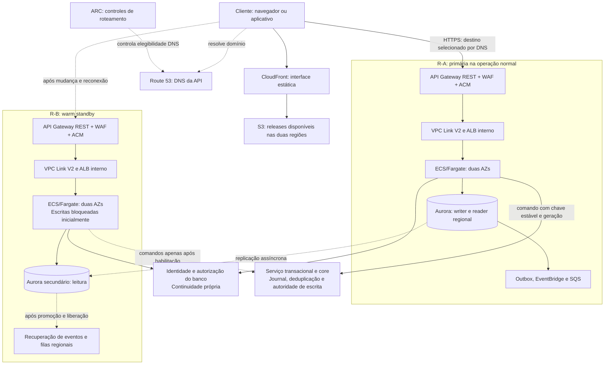
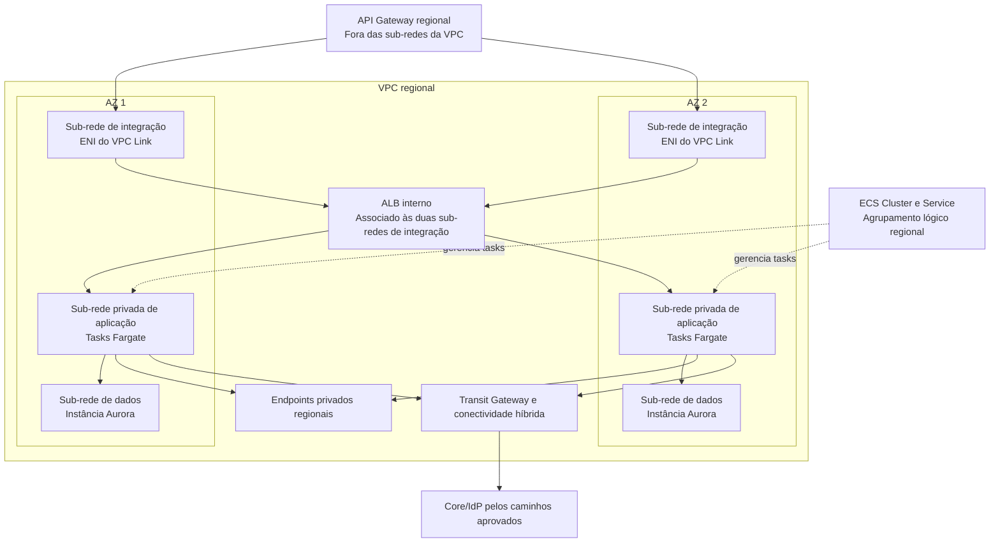
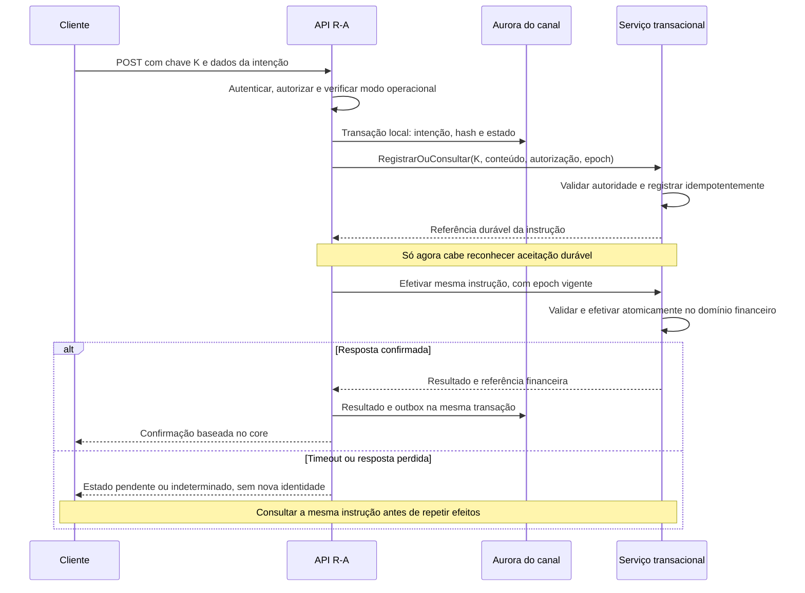
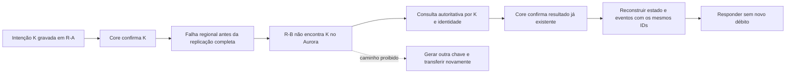
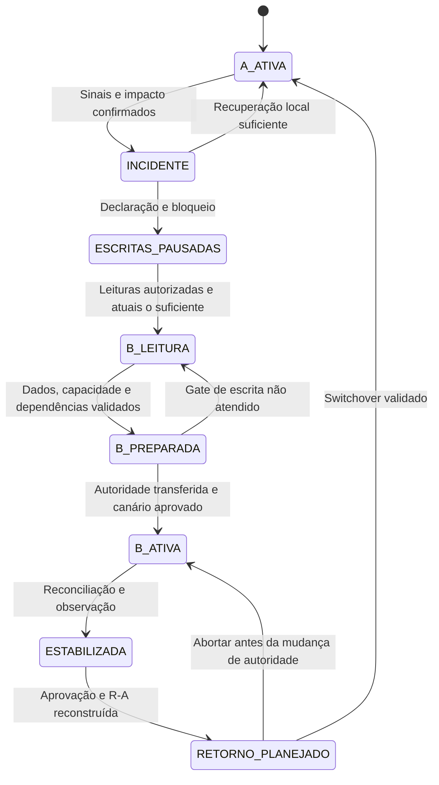
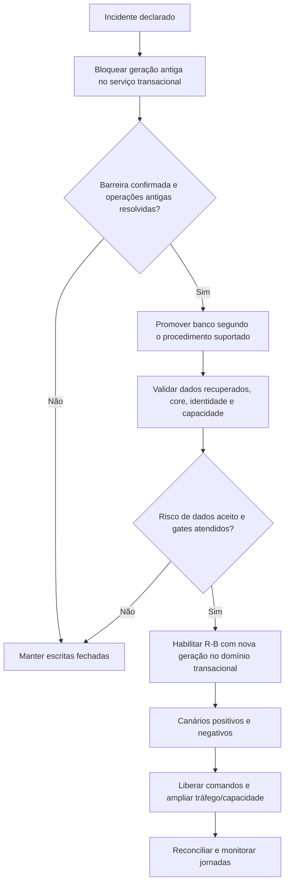
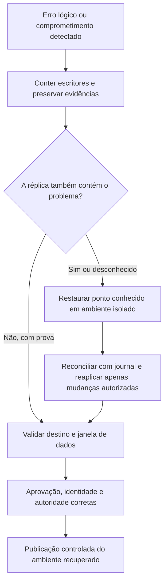

# Case 09 — Internet Banking Multi-Region na AWS

> **Foco:** RTO/RPO, recuperação de desastres, failover, consistência, integridade financeira e operação entre regiões.  
> **Idioma:** português do Brasil. Nomes dos serviços AWS e identificadores de código foram preservados.  
> **Formato:** guia de estudo, decisões arquiteturais e simulação de entrevista.  
> **Referências consultadas em:** 28/09/2026.  
> **Caminho sugerido no repositório:** `cases/09-internet-banking-multi-region.md`.

## Como usar este material

Este case continua a série de [pagamentos e Pix](01-payment-processing-pix.md), [Open Finance](02-open-finance-apis.md), [Banking Event-Driven](03-banking-event-driven.md), [KYC](04-kyc-abertura-de-conta.md), [modernização do core](05-modernizacao-core-banking.md), [GenAI](06-genai-assessor-financeiro.md), [detecção de fraude](07-fraud-detection-tempo-real.md) e [data lake financeiro](08-data-lake-financeiro.md).

Agora, o desafio é **recuperar o canal digital depois de uma falha regional sem perder o significado de uma confirmação, duplicar uma transferência ou permitir que duas regiões tomem decisões conflitantes**.

Construiremos a continuidade do **Internet Banking**, não a migração completa do ledger. O core e a identidade do banco já existem e precisam ter sua própria estratégia de continuidade. Colocar duas cópias do frontend na AWS não recupera um core indisponível.

Na primeira leitura, percorra as seções 1 a 7 e os trade-offs da seção 12. Depois aprofunde três fronteiras: **qual informação sobreviveu, quem pode escrever e o que podemos prometer ao cliente enquanto recuperamos o restante**. Por último, responda às perguntas sem abrir as respostas e apresente a solução em voz alta.

**Frase central:** “Mudar o destino do tráfego não transfere, por si só, a autoridade de escrita nem prova que os dados estão completos.”

O cenário, metas, nomes de APIs, valores e contratos são didáticos. Não é arquitetura oficial AWS, projeto bancário homologado, parecer jurídico ou rubrica oficial de entrevista. L5 é o alvo de preparação informado. O laboratório usa dados e dinheiro fictícios; os tempos propostos não são garantias dos serviços.

### Dois níveis de estudo

**Núcleo para defender no quadro:** Multi-AZ em cada região → região de recuperação preparada → classificação dos dados → escritor único → bloqueio do escritor antigo → promoção → recuperação gradual → reconciliação → retorno planejado.

**Aprofundamento:** ARC, DNS e conexões antigas, Aurora Global Database, idempotência perdida na réplica, quorum/fencing, credenciais, filas regionais, corrupção replicada, capacidade de contingência e falhas parciais.

Não é necessário começar com EKS, service mesh, um protocolo de consenso próprio ou um banco global novo. A proposta-base usa **ECS/Fargate e Aurora Global Database**, com **Route 53 e ARC** para o direcionamento. O contrato do serviço transacional do banco é tão importante quanto os serviços AWS.

---

## Sumário

1. [Problema de negócio e escopo](#s01)
2. [Vocabulário e modelo mental](#s02)
3. [Perguntas antes de desenhar](#s03)
4. [Requisitos, premissas e invariantes](#s04)
5. [Decisões da arquitetura-base](#s05)
6. [Arquitetura e recuperação em Mermaid](#s06)
7. [Fluxo explicado em 12 etapas](#s07)
8. [Dados, RPO, idempotência e reconciliação](#s08)
9. [Autoridade de escrita, split-brain e fencing](#s09)
10. [Runbooks de switchover e failover](#s10)
11. [Papel e posicionamento dos serviços](#s11)
12. [Trade-offs que precisam ser defendidos](#s12)
13. [Rede, DNS e dependências regionais](#s13)
14. [Segurança, sessões, acesso de emergência e privacidade](#s14)
15. [Backups, corrupção, recuperação completa e failback](#s15)
16. [Desempenho, capacidade e custos](#s16)
17. [Observabilidade, operação e implantação](#s17)
18. [Aplicação dos seis pilares Well-Architected](#s18)
19. [Roteiro de laboratório e testes](#s19)
20. [30 perguntas de entrevista com respostas comentadas](#s20)
21. [Apresentação da solução e simulação de 45 minutos](#s21)
22. [Checklist de domínio](#s22)
23. [Referências e leitura orientada](#s23)

---

<a id="s01"></a>
## 1. Problema de negócio e escopo

### Enunciado inicial

> Um banco brasileiro oferece Internet Banking e aplicativo com consulta de saldo, extrato e transferências. A aplicação já utiliza múltiplas zonas de disponibilidade, mas depende de uma única região. O banco quer continuar atendendo durante uma falha regional e comprovar seus objetivos de recuperação, sem duplicar operações nem enfraquecer a segurança. Como desenhar uma solução Multi-Region na AWS?

A primeira resposta não deve ser “usaria Route 53 com failover e duas bases”. Precisamos definir **o que deve continuar funcionando, em quanto tempo e com qual integridade**.

### Exemplo concreto

Às 10h00, a região primária fica parcialmente isolada. Algumas pessoas ainda possuem conexões abertas com ela. A réplica na região secundária está alguns segundos atrasada. Uma cliente havia solicitado uma transferência de R$ 500,00: o core concluiu a operação, mas a resposta não chegou ao aplicativo.

O aplicativo tenta novamente, agora pela região secundária. Essa região não encontra o registro local da operação, porque ele estava no trecho não replicado.

**Pergunta central:** ausência na réplica significa que podemos criar outra transferência? Não. Precisamos consultar a autoridade financeira usando a mesma identidade de operação.

### Jornadas contempladas

| Jornada | Comportamento esperado na recuperação |
|---|---|
| Abrir a interface | Conteúdo estático disponível, com mensagem honesta sobre as funcionalidades |
| Autenticar e consultar permissões | Somente com os controles exigidos; contingência não remove MFA ou autorização |
| Consultar saldo | Resposta atual do core; dado histórico identificado como histórico, nunca apresentado como saldo disponível atual |
| Consultar extrato | Fonte autoritativa ou projeção com atualidade explícita, conforme contrato da tela |
| Solicitar transferência | Apenas quando a região estiver habilitada a escrever e as dependências críticas estiverem aptas |
| Consultar operação incerta | Recuperar pelo identificador estável no serviço transacional, não criar outra intenção |
| Alterar preferência visual | Pode ter um RPO menos rigoroso, previamente aceito |
| Enviar notificações | Recuperação assíncrona, sem interferir na integridade do lançamento |

### Fronteiras de responsabilidade

| Responsabilidade | Autoridade na proposta |
|---|---|
| Identidade, sessão, bloqueios e autorização sobre a conta | Plataforma institucional de identidade e autorização |
| API, contexto da jornada e estado operacional do canal | Internet Banking |
| Registro durável de instruções financeiras e deduplicação externa | Serviço transacional do banco, junto ao domínio do core |
| Saldo, lançamentos e efetivação | Core bancário |
| Destino de novas conexões ao canal | Route 53 com controles do ARC |
| Writer do banco do canal | Topologia administrada do Aurora Global Database |
| Região autorizada a emitir comandos financeiros | Controle de autoridade aplicado no domínio transacional |
| Declaração de desastre e liberação de funcionalidades | Operação e responsáveis de negócio, com critérios aprovados |

### Fora do núcleo

Não construiremos outro ledger, não substituiremos a continuidade do core e não faremos duas regiões debitar a mesma conta independentemente. Também não prometemos perda zero de todas as tabelas por usar replicação assíncrona.

O cenário-base assume que **a falha de R-A não elimina simultaneamente o core, seu journal transacional e a identidade institucional**. Essa independência deve ser demonstrada pelo banco. Se essas dependências também caírem, o modo de recuperação muda: pode haver interface e informação limitada, mas não novas transferências.

---

<a id="s02"></a>
## 2. Vocabulário e modelo mental

### RTO e RPO respondem a perguntas diferentes

**RTO — Recovery Time Objective:** quanto tempo de interrupção admitimos antes de recuperar uma jornada no nível de serviço definido.

**RPO — Recovery Point Objective:** qual intervalo de alterações admitimos perder no conjunto de dados considerado. É um objetivo, não a medição automática de qualquer métrica de replicação.

Se o incidente começa às 10h00 e transferências voltam de forma validada às 10h11, o tempo observado foi 11 minutos. Se a base recuperada contém todas as alterações apenas até 09h59min40s, há uma janela potencial de 20 segundos no armazenamento — a apuração por registros determina o que realmente faltou.

As definições e os métodos de recuperação variam por componente; a documentação do Aurora distingue os objetivos e o comportamento de operações planejadas e não planejadas. [Fonte: recuperação do Aurora][r02]

| Termo | Significado prático |
|---|---|
| Região | Localidade AWS com múltiplas AZs; delimita recursos regionais |
| Availability Zone / AZ | Domínio de isolamento dentro de uma região |
| Alta disponibilidade / HA | Capacidade de continuar atendendo falhas contempladas pelo desenho |
| DR | Recuperação de desastre: procedimento, recursos, dados, pessoas e critérios de retorno |
| RTO observado | Tempo medido entre a interrupção definida e a recuperação validada |
| RPO observado | Perda apurada em relação às alterações reconhecidas pela fonte |
| Backup | Ponto recuperável conservado para restauração |
| Réplica | Cópia mantida por propagação de alterações; pode receber também um erro lógico |
| Pilot light | Componentes centrais preparados, mas parte da aplicação ainda precisa ser ativada |
| Warm standby | Ambiente funcional em capacidade reduzida, pronto para expansão |
| Hot standby | Termo usado aqui para reserva já dimensionada; defina a capacidade em vez de confiar apenas no rótulo |
| Active-active | Mais de um ambiente serve tráfego; é preciso dizer se isso inclui leituras, escritas ou ambos |
| Switchover | Troca planejada, com origem e destino aptos à coordenação |
| Failover | Transferência em resposta a falha, possivelmente com informação incompleta |
| Failback | Retorno controlado ao ambiente anterior |
| Split-brain | Dois lados se comportam como autoridade para o mesmo escopo sem coordenação suficiente |
| Fencing | Rejeição efetiva de ações de uma autoridade antiga |
| Epoch | Geração monotônica da autoridade; não é horário do relógio |
| Quorum | Quantidade/regra de participantes necessária para uma decisão consistente |
| Single writer | Um domínio de escrita autorizado por escopo; não significa uma única task |
| Replication lag | Atraso medido da propagação de alterações |
| Freshness | Atualidade do dado para o uso de negócio, incluindo etapas anteriores à replicação |
| Read-your-writes | Uma leitura posterior respeita uma alteração reconhecida ao mesmo cliente |
| Data plane | Operações que entregam o serviço, como atender chamadas ou atualizar um controle já criado |
| Control plane | Operações de configuração, criação e alteração de recursos |
| Static stability | Continuar atendendo sem depender de mudanças emergenciais na infraestrutura |
| Fail-open / fail-closed | Continuar permitindo / negar uma operação quando um controle não consegue decidir |
| Journal transacional | Registro autoritativo das instruções e resultados, suficiente para consulta e recuperação |
| Watermark | Marcador de progresso com semântica definida; não prova completude se houver lacunas |
| Runbook | Procedimento executável com pré-condições, responsáveis, passos e critérios de parada |

As quatro estratégias clássicas de DR e a distinção entre controle e atendimento estão descritas pela AWS. Estabilidade estática procura reduzir dependências de mudanças durante falhas. [Fontes: estratégias][r01], [static stability][r11]

### Quatro afirmações que não são equivalentes

| Afirmação | O que ainda precisa ser provado |
|---|---|
| “O health check respondeu 200.” | Que a jornada completa funciona e pode escrever com segurança |
| “O DNS aponta para R-B.” | Que conexões antigas não continuam em R-A e que R-B tem autoridade |
| “O banco secundário foi promovido.” | Que identidade, core, aplicações, segredos, filas e capacidade estão prontos |
| “O RPO do banco é baixo.” | Que a última operação confirmada, sua evidência e seus efeitos foram recuperados |

**Ideia para guardar:** recuperação do tráfego, recuperação dos dados e recuperação da autoridade são trabalhos relacionados, mas diferentes.

---

<a id="s03"></a>
## 3. Perguntas antes de desenhar

Uma abertura adequada seria:

> “Vou separar as jornadas de consulta e de movimentação, definir RTO/RPO por tipo de informação e mapear o que continua dependente do core e da identidade. Depois escolho a estratégia regional e mostro como impedimos escritas conflitantes.”

| Pergunta ao cliente | Como a resposta muda a arquitetura |
|---|---|
| O desastre inclui uma AZ, uma região, comprometimento da conta ou corrupção de dados? | Uma réplica regional não resolve todos esses incidentes |
| Quais funcionalidades são prioritárias durante a contingência? | Permite recuperar consultas antes de comandos e analytics |
| RTO conta desde a falha ou desde a declaração manual? | Evita esconder o tempo de detecção e decisão |
| Qual capacidade precisa existir dentro do RTO? | Distingue “uma chamada passou” de recuperação utilizável |
| Qual RPO vale para preferência, intenção, lançamento e evidência? | Impede aplicar o mesmo compromisso a tudo |
| O cliente recebeu “aceito”, “concluído” ou apenas “recebido”? | Determina o compromisso durável que precisa sobreviver |
| O core recebe uma chave idempotente estável e permite consulta por ela? | Define como recuperar respostas perdidas |
| O core pode rejeitar comandos de uma região antiga no ponto de efetivação? | Define se o failover de escrita é seguro |
| O core/IdP continuam disponíveis se R-A ficar isolada? | Expõe dependências fora do desenho da AWS |
| Como ficam sessões, MFA, bloqueios e autorizações durante a troca? | Evita reabrir acessos revogados |
| Alguma leitura pode estar desatualizada? Por quanto e com qual sinalização? | Define uso de réplica e modo degradado |
| Quais países e regiões podem armazenar/processar cada classe de dado? | Restringe destinos antes de escolher o banco ou a replicação |
| Podemos pausar escritas enquanto confirmamos a autoridade? | Explicita o trade-off entre disponibilidade e integridade |
| Quem autoriza aceitar uma possível perda de dados? | Define alçada, não uma decisão improvisada no console |
| Há clientes com conexões longas, cache DNS próprio ou endpoints fixos? | Altera a migração efetiva do tráfego |
| A região de reserva está dimensionada e tem quotas aprovadas? | Testa a viabilidade do RTO |
| Há jobs, filas, webhooks e agendamentos que escrevem sem passar pela API? | Amplia o escopo do fencing |
| Como um release, segredo ou regra errada chega às duas regiões? | Trata falhas correlacionadas de software/configuração |
| Existe restauração testada, além da replicação? | Cobre corrupção, exclusão e comprometimento |
| Precisamos voltar à região original imediatamente? | Evita um failback precipitado |

Não é necessário recitar toda a tabela. Comece pelas perguntas que podem inviabilizar uma estratégia.

---

<a id="s04"></a>
## 4. Requisitos, premissas e invariantes

### Metas didáticas

| Categoria | Meta ou premissa do exercício |
|---|---|
| Regiões | R-A primária e R-B recuperação; São Paulo e Norte da Virgínia são apenas um exemplo sujeito à aprovação de localização dos dados e suporte dos recursos |
| Contas AWS | Uma conta de workload nas duas regiões na base; conta separada para proteção de backups/evidências |
| Rede | Uma VPC por região; pelo menos duas AZs por VPC; endereços sem sobreposição |
| Carga | Pico de 4.000 requisições/s no canal, das quais 200/s são comandos financeiros |
| Disponibilidade | SLO didático mensal de 99,95% por jornada essencial, com método de medição definido |
| Consultas essenciais | RTO regional alvo de 5 minutos, com capacidade mínima acordada e atualidade explícita |
| Comandos financeiros | RTO alvo de 15 minutos, condicionado à validação dos gates de segurança, core e capacidade |
| Capacidades secundárias | Meta de até 4 horas para recuperar backlog/rotinas não críticas, sujeita ao volume |
| Estado não financeiro do canal | RPO alvo de até 30 segundos; tolerância precisa ser aprovada e monitorada |
| Lançamentos confirmados | Nenhuma perda admitida no core; essa garantia pertence ao contrato de durabilidade/DR do core |
| Instrução financeira reconhecida como aceita | Registro durável no serviço transacional antes do `202`; não depende apenas de Aurora assíncrono |
| Replicação do canal | Aurora Global Database com propagação inter-regional assíncrona |
| Estratégia inicial | Warm standby regional, com consultas limitadas antes da liberação das escritas |
| Entrada em contingência | Procedimento assistido por automação, com decisão e evidências registradas |
| Retorno | Sem failback automático apenas porque R-A voltou a responder |

**Os 30 segundos são objetivo do projeto, não uma garantia fornecida automaticamente pelo Aurora.** Se o atraso ultrapassar o limite, ou sua medição deixar de ser confiável, a solução deve acionar a política prevista: restringir alterações, declarar risco ao objetivo e/ou aumentar a proteção. Não basta manter o painel verde.

### O contrato necessário com o domínio transacional

Para a arquitetura proposta funcionar, o banco fornece estas capacidades:

1. Registrar ou recuperar uma instrução pela combinação estável de identidade, canal e chave de idempotência, verificando seu conteúdo.
2. Manter referência, conteúdo necessário, evidência de autorização e resultado além da perda de R-A, segundo o objetivo aprovado.
3. Efetivar a operação de maneira idempotente e permitir consultar/listar o journal para reconciliação.
4. Aplicar a autoridade vigente no mesmo limite de consistência em que registra/efetiva comandos.
5. Executar um procedimento de bloqueio e drenagem que prove que uma geração antiga não fará novos commits depois da barreira.

Essas são **pré-condições de negócio e implementação**, não recursos implícitos do API Gateway, Aurora ou ARC. Se o core não as oferece, será necessário adaptar a arquitetura, revisar a aceitação assíncrona ou manter escritas interrompidas até uma recuperação segura. Um adaptador em memória não cria essas garantias.

### Invariantes

- Uma confirmação financeira só é apresentada com evidência autoritativa de efetivação.
- A mesma instrução não ganha uma nova identidade porque o cliente mudou de região.
- Ausência na réplica não prova ausência no core.
- Só a região/geração autorizada pode registrar ou efetivar novos comandos financeiros.
- Leituras históricas não são apresentadas como saldo disponível atual.
- Failover não remove autenticação, MFA, autorização por conta, prevenção a fraude ou requisitos de evidência.
- Réplicas antigas, consumidores e jobs não retomam efeitos reais automaticamente.
- Perda de metadados reconstruíveis não pode ser confundida com perda de lançamentos confirmados.

---

<a id="s05"></a>
## 5. Decisões da arquitetura-base

### Escolha: recuperação ativo-passiva, com retomada por funcionalidade

Na operação normal, **R-A atende o tráfego principal**. R-B mantém uma cópia funcional, dados replicados, identidade integrada, conectividade com o core e capacidade reduzida. A região reserva participa continuamente de testes e verificações de prontidão, sem emitir comandos financeiros reais como um segundo escritor.

Durante a recuperação, R-B pode atender uma jornada de leitura limitada antes de receber a autoridade de escrita. Isso não transforma a proposta em active-active financeiro.

| Estratégia | Preparação | Benefício | Risco/custo a discutir |
|---|---|---|---|
| Backup e restore | Backups, artefatos e IaC | Menor custo recorrente | Restaurar e provisionar pode não caber no RTO |
| Pilot light | Dados e componentes essenciais ativos | Reduz tempo em relação à reconstrução completa | Ainda exige ativação de parte relevante da aplicação |
| Warm standby | Aplicação funcional com capacidade reduzida | Permite validar continuamente e expandir | Expansão e promoção continuam sendo dependências |
| Active-active | Duas regiões atendendo o escopo definido | Usa ambas e pode reduzir desvio de prontidão | Complexidade de estado, autoridade, custo e falhas correlacionadas |

As categorias são documentadas pela AWS; seus tempos efetivos dependem da implementação e dos testes. [Fonte: estratégias de DR][r01]

### Caminho regional

`API Gateway REST regional → VPC Link V2 → ALB interno → ECS com Fargate → Aurora do canal / APIs do banco`.

A documentação atual permite integração privada de REST API com ALB usando VPC Link V2. Isso evita manter NLB só por uma restrição de integração legada. O desenho exige configurar TLS também na integração quando esse for o requisito; o fato de estar dentro da VPC não cifra HTTP automaticamente. [Fonte: integração privada][r12]

### Componentes centrais e opcionais

| Componente | Decisão |
|---|---|
| Route 53 + ARC routing control | Direcionar novas conexões com controles previamente preparados |
| API Gateway REST, WAF e certificados regionais | Mesmo contrato público e proteção nas duas regiões |
| ECS/Fargate | Serviços de canal e adaptadores sem estado de sessão exclusivo em memória |
| Aurora PostgreSQL Global Database | Estado operacional, idempotência local, metadados e outbox do canal; um writer regional |
| Serviço transacional/core | Referência financeira autoritativa e barreira de escrita por região/geração |
| EventBridge + SQS regionais | Notificações e trabalhos derivados; recuperação explicitamente planejada |
| S3 + CloudFront | Interface estática e artefatos; sem usar cache compartilhado para respostas financeiras pessoais |
| ECR, KMS, Secrets Manager, observabilidade | Recursos e permissões preparados em cada região |
| Backups protegidos | Recuperação de corrupção/erro e cenário de comprometimento |
| Global Accelerator | Alternativa de ingresso quando o endpoint e o caso justificarem |
| DynamoDB Global Tables | Alternativa para domínios compatíveis; exige escolher e entender MREC/MRSC |
| ElastiCache | Opcional para cache descartável; nunca única fonte de sessão crítica ou idempotência financeira |
| EKS, MSK, banco global adicional | Não exigidos na versão inicial |

O Aurora Global Database mantém um cluster primário e secundários regionais; **aplicações em duas regiões não significam dois writers independentes nesse banco**. [Fonte: Aurora Global Database][r03]

### O que deixamos pronto antes da falha

Certificados, domínios, endpoints privados, imagens, rotas, políticas IAM/KMS, parâmetros, alarmes, quotas, conexões com o core e execução do runbook precisam existir e ser verificados. Usar IaC não significa que seja aceitável descobrir durante o incidente que ainda é necessário criar tudo.

Warm standby reduz recursos ociosos, mas não é estaticamente estável para toda a carga se depende de escalar. O objetivo de 15 minutos exige medir essa dependência ou manter mais capacidade ativa. [Fonte: static stability][r11]

---

<a id="s06"></a>
## 6. Arquitetura e recuperação em Mermaid

Os diagramas são modelos lógicos para estudo. Setas de DNS, replicação e controle não representam todas o caminho do corpo da requisição. R-A e R-B são papéis operacionais que podem trocar.

### 6.1 Visão Multi-Region



### 6.2 Uma VPC regional, repetida em R-A e R-B



As duas instâncias Aurora pertencem ao mesmo cluster regional. As setas não significam que cada task escolhe uma base diferente: a aplicação usa endpoints conforme o papel do banco. Em R-B, as instâncias são readers até a promoção. Saída à internet, quando necessária, usa caminhos controlados adicionais não detalhados aqui.

### 6.3 Aceitação e confirmação de uma transferência



### 6.4 Uma operação que não chegou à réplica



### 6.5 Estados da recuperação



### 6.6 Gates para abrir escritas em R-B



O tráfego de consulta pode ser desviado antes, com escrita bloqueada. A sequência exata de operações do banco depende do engine e da API suportada; não improvise um procedimento de promoção baseado apenas neste fluxo lógico.

### 6.7 Corrupção não é tratada como simples falha regional



### 6.8 Failback é outra transferência planejada

```mermaid
sequenceDiagram
    participant O as Operação
    participant B as R-B ativa
    participant A as R-A reconstruída
    participant T as Serviço transacional
    O->>A: Recriar/verificar como secundária de R-B
    B-->>A: Replicação e verificação de completude
    O->>A: Testar release, permissões, core e capacidade
    O->>T: Bloquear nova escrita e drenar geração de R-B
    O->>B: Pausar writers, jobs e publicação com efeitos
    O->>A: Executar switchover suportado do banco
    O->>T: Autorizar R-A com nova geração
    O->>A: Validar canários e rejeição de comandos antigos
    O->>O: Alterar roteamento e observar
    Note over A,B: R-B permanece reserva; não há mescla cega das duas histórias
```

---

<a id="s07"></a>
## 7. Fluxo explicado em 12 etapas

### 1. Preparar as duas regiões

IaC cria a topologia regional, políticas, integrações, certificados, métricas e recursos de recuperação. O release só é considerado recuperável quando as imagens e configurações necessárias estão disponíveis em R-B e uma task consegue iniciar sem buscar dependências exclusivas de R-A.

O ECR oferece replicação regional, mas conteúdo preexistente e configurações de repositório exigem atenção. Validamos o **digest da imagem no destino**, não apenas a existência da regra de replicação. [Fonte: ECR][r22]

### 2. Entregar a interface e resolver a API

CloudFront entrega o frontend versionado. A API usa um domínio estável configurado regionalmente nos dois destinos. Route 53 responde o endereço apropriado; o corpo da chamada segue por HTTPS para o destino resolvido.

ARC controla a elegibilidade do destino por health checks associados aos registros. Ele **não é um proxy pelo qual o pagamento passa**. [Fonte: routing control][r05]

### 3. Autenticar e autorizar na região atendente

WAF e API Gateway aplicam controles de entrada. O backend verifica a identidade, a autorização sobre a conta e o contexto exigido para a ação. O usuário não recebe acesso adicional porque a chamada chegou à região de contingência.

A configuração regional precisa preservar o contrato de issuer/audience, as chaves e a política de sessão. Ausência de informação de bloqueio não é interpretada automaticamente como “cliente liberado”.

### 4. Atender consultas segundo a atualidade exigida

Saldo disponível vem da autoridade que pode afirmá-lo. Extrato histórico pode usar uma projeção quando esse for o contrato, com data de referência. Uma leitura de réplica que não encontra uma transferência recente deve consultar o journal ou declarar que o resultado está em atualização.

Não use a tela de consulta desatualizada para decidir se há saldo para um novo comando.

### 5. Registrar a intenção com identidade estável

O cliente mantém a mesma chave durante retries da mesma intenção. O servidor delimita o escopo por identidade e canal, verifica o conteúdo e registra o estado operacional local. A chave não é substituída por um UUID regional novo depois do desastre.

Uma mesma chave com valor ou beneficiário incompatível é conflito, não uma atualização do pagamento anterior. Essa separação entre identidade da tentativa e conteúdo é importante em APIs idempotentes. [Fonte: retries e idempotência][r14]

### 6. Obter aceitação durável no domínio transacional

Antes de reconhecer `202 Accepted` como “o banco assumiu a instrução”, a aplicação recebe prova de registro durável no serviço transacional. Esse registro conserva os dados mínimos necessários e permite recuperação independentemente do Aurora perdido.

Se a chamada de registro expirar, o resultado é indeterminado. Consultamos a mesma chave. Uma linha local em Aurora assíncrono não sustenta sozinha a promessa de RPO zero para instruções aceitas.

### 7. Efetivar e publicar o resultado

O core valida as regras e a autoridade e efetiva idempotentemente. O canal atualiza estado e outbox em uma transação local. Um publicador envia eventos a EventBridge/SQS; consumidores tratam duplicatas.

Outbox fecha a janela de dupla escrita **naquele banco**. Ela não torna sua replicação inter-regional síncrona nem protege um evento que ainda não sobreviveu fora da região perdida. [Fonte: outbox][r15]

### 8. Replicar e medir a prontidão

Aurora replica estado do canal. Imagens, segredos, objetos, permissões e configuração têm mecanismos próprios; não são transportados por replicação do banco.

Monitoramos atraso e idade da última amostra, mais a capacidade real de R-B consultar o core, obter credenciais e executar canários. Métrica velha não equivale a atraso zero. A documentação do Aurora oferece métricas e funções distintas de durabilidade, RPO e visibilidade. [Fonte: monitoramento][r04]

### 9. Detectar e classificar o incidente

Operação combina sintéticos externos, erros por jornada, sinais da aplicação, replicação e dependências. Uma task ruim pede recuperação local; um core compartilhado fora do ar não é consertado desviando a API; corrupção pede contenção e restauração.

O relógio do RTO começa no impacto definido, não quando alguém termina uma reunião e clica em “declarar incidente”.

### 10. Bloquear escrita antiga e preparar R-B

O domínio transacional confirma uma barreira que rejeita novas ações de R-A/geração antiga. Jobs e caminhos alternativos também entram no escopo. O banco secundário é promovido pelo procedimento suportado, com avaliação explícita da perda possível.

Leituras podem começar antes, se forem autorizadas e tiverem semântica honesta. Novos comandos aguardam os gates da seção 10.

### 11. Liberar gradualmente e verificar

Depois de dados, autoridade, identidade, core, capacidade e canários aprovados, R-B recebe a nova geração de escrita. Route 53/ARC direciona clientes; os que ainda chegam a R-A não podem provocar novos efeitos financeiros.

Limitamos carga e acompanhamos resultados, não apenas quantidade de respostas HTTP 200. O procedimento não termina no status “banco promovido”.

### 12. Reconciliar e planejar o retorno

O journal ajuda a reconstruir operações, eventos e resultados ausentes. A equipe compara contagens e identidades, investiga divergências e preserva a história antiga isolada quando necessário.

R-A só volta como secundária validada. O retorno ao papel principal é um switchover planejado, com outra transferência de autoridade — não o efeito colateral de um health check voltar a ficar verde.

---

<a id="s08"></a>
## 8. Dados, RPO, idempotência e reconciliação

### 8.1 Não existe um único RPO para “o Internet Banking”

| Dado | Fonte autoritativa | Consequência de uma lacuna | Tratamento proposto |
|---|---|---|---|
| Preferência de tema e layout | Banco do canal | Cliente pode precisar refazer a escolha | Tolerância limitada e explícita |
| Rascunho ainda não enviado | Canal/dispositivo conforme contrato | Rascunho pode não existir após recuperação | Não mostrar como instrução aceita |
| Instrução reconhecida como aceita | Journal transacional durável | Quebra da promessa ao cliente se desaparecer | Registrar antes de reconhecer aceitação |
| Transferência efetivada | Core | Perda financeira/contábil se esquecida | Durabilidade do core e reconstrução da visão do canal |
| Estado local de uma transferência | Aurora do canal | Tela pode ficar incompleta | Consultar/reconciliar com referência estável |
| Permissão, bloqueio e revogação | Sistema de autorização | Acesso indevido se usar versão antiga | Verificação exigida por risco; negar quando não há confiança suficiente |
| Evento de notificação | Outbox + fato financeiro original | Comunicação atrasada ou repetida | Reconstrução e idempotência do consumidor |
| Comprovante | Resultado autoritativo + template versionado | Arquivo pode ainda não ter sido replicado | Regerar apenas de dados confirmados, com referência e versão |
| Evidência de autorização | Domínio que aceitou a instrução | Não conseguir provar o comando | Guardar com a aceitação durável, não apenas em logs locais |

**O banco do canal pode perder alguns segundos de metadados e ainda assim nenhum lançamento confirmado ser perdido.** Isso exige outra fonte autoritativa sobrevivente e um processo de reconstrução. Não é uma característica automática da réplica.

### 8.2 O que uma réplica assíncrona não garante

Um commit reconhecido em R-A pode ainda não ter chegado a R-B. Durante uma interrupção, promover R-B não inventa esse commit. A operação planejada de switchover sincroniza os clusters antes da troca; o failover não planejado pode envolver perda de dados. [Fonte: operações de recuperação][r02]

Por isso, existem duas respostas diferentes:

- “Tenho RPO zero em um switchover saudável e planejado do banco.”
- “Tenho RPO zero para todos os dados durante a perda abrupta da primária.”

A primeira não demonstra a segunda.

`rds.global_db_rpo`, nas configurações suportadas de Aurora PostgreSQL, permite controlar uma janela de RPO com impacto potencial sobre commits na primária. Não o trate como uma opção genérica que elimina latência, indisponibilidade e todas as condições de perda. Valide engine, versão, valores permitidos e comportamento sob partição. [Fonte: gerenciamento de RPO][r02]

### 8.3 Chave da intenção versus ID regional

Exemplo de comando didático. A identidade do cliente e as contas autorizadas são obtidas/verificadas no servidor; não confiamos em um `customerId` livre no body.

```json
{
  "idempotencyKey": "intent-7e39f1",
  "sourceAccountRef": "acct-origem-ficticia",
  "destinationAccountRef": "acct-destino-ficticia",
  "amountMinor": 50000,
  "currency": "BRL",
  "authorizationEvidenceRef": "auth-evidence-ficticia-17"
}
```

**Chave de deduplicação de negócio:** `(instituição, sujeito autenticado, canal, idempotencyKey)`.

**Hash semântico:** representação canônica do valor, moeda, origem, destino e demais campos que alteram a intenção. Normalize cuidadosamente campos, tipos e versões. Não deduplique só pelo valor: duas transferências legítimas de R$ 500 podem ser intenções diferentes.

A chave e seu vínculo ao conteúdo precisam chegar ao serviço transacional. O `operationId` interno de Aurora pode ser útil, mas não pode ser a única forma de reconhecer a intenção depois da perda desse banco.

Não inclua `region` ou `epoch` no identificador de negócio usado para deduplicar. Eles descrevem a tentativa/autoridade, não uma nova intenção financeira.

### 8.4 Três confirmações distintas

| Resposta | Compromisso da API |
|---|---|
| Validação local concluída | Formato/contexto inicial aceitos; ainda não é aceitação durável pelo banco |
| `202 Accepted`, com referência autoritativa | O domínio transacional registrou duravelmente a instrução e a acompanha conforme o contrato |
| Resultado de efetivação confirmado | O core confirmou o efeito ou uma recusa final identificada |

Exemplo de aceitação, ainda sem afirmar movimentação:

```json
{
  "requestKey": "intent-7e39f1",
  "coreInstructionRef": "instruction-ficticia-910",
  "status": "ACCEPTED",
  "financialEffect": "NOT_CONFIRMED",
  "acceptedAt": "2026-09-28T13:59:59Z",
  "statusPath": "/instrucoes/intent-7e39f1"
}
```

**O caminho de consulta é autorizado pelo sujeito**, não uma forma de qualquer pessoa descobrir operações adivinhando chaves.

Se o core não oferece um registro de instrução separado, uma alternativa é só reconhecer sucesso após a efetivação síncrona e definir cuidadosamente os resultados indeterminados. Não invente um `202` durável cuja única cópia pode desaparecer. Instruções agendadas, ordens futuras e pagamentos que o banco se comprometeu a executar precisam de armazenamento com garantias correspondentes.

### 8.5 Tabela de falhas e recuperação

| Momento da falha | Possível estado real | Ação segura |
|---|---|---|
| Antes do registro local | Nenhuma operação recebida | Retry com a mesma chave |
| Depois de Aurora, antes do serviço transacional | Apenas intenção local | Não há aceitação durável prometida; conferir autoridade e registrar idempotentemente |
| Durante o registro transacional | Registro pode existir | Consultar a mesma chave; timeout não prova inexistência |
| Depois da aceitação, antes da efetivação | Instrução pendente durável | Recuperar seu estado, prazo e autorização de continuidade |
| Durante a efetivação | Efeito pode ter ocorrido | Consultar o resultado autoritativo |
| Depois do efeito, antes de atualizar Aurora | Core final, canal atrasado | Reconstruir canal e outbox |
| Depois de publicar evento, antes de marcar envio | Evento pode ser duplicado | Repetir com o mesmo ID; consumidor idempotente |
| Depois do failover, antes de reconciliar tudo | Dados parciais na visão | Consultas com fallback; não inferir recusa ou criar identidade nova |

Uma instrução pendente não é executada automaticamente meses depois de um restore. Sua validade, autorização, eventual cancelamento e regra de retomada precisam ser avaliadas.

### 8.6 Leitura depois da escrita

A confirmação de uma transferência pode preceder a atualização de um extrato replicado. A interface pode mostrar o comprovante confirmado enquanto informa que o extrato está sendo atualizado. Não deve mudar para “transferência inexistente” ao alternar de região.

Estratégias possíveis na proposta:

1. Consultar o serviço transacional pela referência retornada.
2. Exigir uma versão mínima da projeção e aguardar dentro de um limite.
3. Encaminhar uma leitura estrita à fonte autoritativa quando disponível.
4. Exibir estado explícito de atualização em vez de uma resposta incorreta.

A API de leitura também pode retornar contexto de atualidade:

```json
{
  "accountRef": "acct-origem-ficticia",
  "viewType": "STATEMENT_PROJECTION",
  "asOf": "2026-09-28T14:00:05Z",
  "sourceCheckpoint": "journal-partition-2:8841",
  "isCurrentAvailableBalance": false,
  "mode": "DEGRADED_READ",
  "entries": []
}
```

Esse payload não é um contrato para omitir movimentações sem aviso. A tela precisa comunicar a limitação e oferecer a consulta autoritativa de operações pendentes.

### 8.7 Reconciliação por identidade, não só por total

A recuperação compara o journal do domínio transacional, o estado recuperado do canal e seus eventos. Precisamos saber:

- quais instruções foram aceitas;
- quais foram efetivadas, recusadas, canceladas ou continuam pendentes;
- quais resultados o cliente pode ter recebido;
- quais registros locais e eventos faltam;
- quais consumidores já realizaram seus efeitos.

Uma soma de R$ 10.000 correta não prova que as contas e operações estão corretas. Compare identificadores, conteúdo, versões, estado, moeda, conta e referências de autorização. Use checkpoints contíguos ou mapas por partição: “vi o maior número 900” não prova que 897 e 898 foram recuperados.

### 8.8 Eventos, filas e janelas de perda

Na base, EventBridge e SQS são implantados regionalmente. Uma fila com o mesmo nome em R-B não contém automaticamente o backlog de R-A. Não usamos a memória dessa fila como única evidência de uma obrigação financeira aceita.

Recuperamos eventos a partir do fato autoritativo, preservando a identidade lógica. Exemplo:

```json
{
  "eventId": "transfer-confirmed:core-commit-841",
  "eventType": "TransferenciaConfirmada",
  "schemaVersion": 1,
  "coreInstructionRef": "instruction-ficticia-910",
  "coreCommitRef": "core-commit-841",
  "recoveryGeneration": 44,
  "replayed": true,
  "financialCommand": false
}
```

`replayed=true` não autoriza qualquer consumidor a ignorar controles. A identidade do fato permanece a mesma; consumidores de projeção podem reaplicar idempotentemente. Um consumidor de notificação precisa de seu próprio registro de entrega/contrato com o provedor. Um e-mail pode exigir tratamento de duplicata visível; isso é diferente de tolerar uma transferência duplicada.

EventBridge global endpoints é uma opção para continuidade de ingestão de eventos e replicação entre barramentos. **Não promove o banco, não muda a autoridade do core e não recupera automaticamente consumidores ou mensagens já retidas em filas regionais.** [Fonte: global endpoints][r20]

A janela de deduplicação de envio do SQS FIFO é de cinco minutos; não a use como prova de idempotência de negócio após um desastre ou replay de horas. [Fonte: FIFO][r35]

---

<a id="s09"></a>
## 9. Autoridade de escrita, split-brain e fencing

### 9.1 Falha regional pode ser parcial

R-A pode perder acesso à internet pública e continuar acessando o core. Ou manter conexões antigas com alguns clientes, perder comunicação com R-B e continuar executando jobs. Um monitor externo não conseguir chegar a R-A não prova que ela parou.

Se R-B começar a escrever enquanto R-A ainda tem autorização, temos dois emissores para o mesmo domínio. A camada financeira precisa rejeitar a geração antiga, mesmo se um cliente usar um endpoint regional fixo.

### 9.2 Três gates diferentes

| Gate | Responsabilidade | Não substitui |
|---|---|---|
| Roteamento | Reduzir/enviar tráfego a um destino | Bloqueio financeiro, pois existem caches e caminhos alternativos |
| Aplicação/banco do canal | Evitar processamento e escrita local fora do modo permitido | Autoridade final no core se um worker antigo continuar |
| Domínio transacional | Recusar comandos de região/geração inválidas no ponto durável | Recuperação de consultas, cache e metadados de outros domínios |

Não transforme `GET /health = 200` em autorização para debitar.

### 9.3 Exemplo de geração de autoridade

```json
{
  "scope": "internet-banking-transfers",
  "activeRegion": "R-B",
  "epoch": 44,
  "mode": "WRITE_ENABLED",
  "changeRef": "dr-change-ficticia-2026-09-28",
  "previousEpochFenced": 42,
  "drainBarrierRef": "core-barrier-ficticia-608"
}
```

Esse é um **contrato lógico**, não um recurso nativo do Aurora nem um token que qualquer frontend possa definir. A autoridade é alterada por um fluxo restrito. A chamada de aplicação traz contexto autenticado que o domínio transacional verifica contra o estado vigente.

Um procedimento possível:

1. Estado inicial: `R-A, epoch=42, WRITE_ENABLED`.
2. Operação de contenção: `nenhuma região, epoch=43, WRITE_DISABLED`.
3. Barreira comprovada: comandos da geração 42 já terminaram antes da barreira ou foram impedidos de efetivar depois dela.
4. Após validação de R-B: `R-B, epoch=44, WRITE_ENABLED`.

O salto de geração não altera a chave da transferência. Um retry em 44 de uma intenção registrada em 42 consulta/continua a mesma intenção conforme seu estado.

### 9.4 O detalhe decisivo: verificar no commit

Este fluxo é insuficiente:

`consultar flag → ficar pausado por 2 minutos → gravar no core`.

A autoridade pode mudar durante a pausa. A verificação deve estar ligada atomicamente à operação durável, ou usar um mecanismo equivalente que impeça a efetivação antiga. Uma implementação possível no domínio transacional serializa a mudança de autoridade com as operações que a utilizam.

Isso não exige necessariamente um único lock global para todo o banco. O escopo pode ser particionado, desde que as invariantes de contas e operações entre escopos sejam mantidas. Essa evolução exige projeto próprio; não basta adicionar `regionId` em uma tabela.

**Fencing de banco do canal e fencing financeiro são diferentes.** O procedimento suportado do Aurora administra a topologia do banco. A documentação descreve sua tentativa de write fencing no failover gerenciado como best effort e alerta para split-brain. Portanto, não afirmamos que a promoção torna impossível qualquer escrita no primário antigo. [Fonte: recuperação Aurora][r02]

O gate financeiro protege o efeito externo. Um Aurora antigo isolado e depois recuperado deve permanecer fora do serviço e não ter suas alterações locais mescladas cegamente com a nova história. Seu eventual registro local não substitui a confirmação autoritativa de aceitação ou efetivação no core.

### 9.5 Como impedir dois operadores de liberar regiões diferentes?

A alteração de autoridade precisa de compare-and-set/serialização e controle de alçada. Dois operadores usando a mesma geração esperada não podem ambos obter sucesso com destinos diferentes.

A evidência de incidente, a aprovação e a API que efetivamente muda autoridade são coisas distintas. Um comentário em um chamado não impede um segundo script.

Quando não há autoridade acessível com consistência suficiente, **a proposta mantém comandos financeiros fechados**. O produto pode recuperar consultas, mas não deve inventar uma eleição por “a outra região não respondeu ao ping”.

### 9.6 ARC não é um lock financeiro

ARC fornece controles de roteamento e regras de segurança. Podemos evitar transições perigosas no painel e preparar atualizações em lote. Porém, esses controles não leem a transação no core nem invalidam automaticamente um worker antigo. [Fontes: ARC][r05], [safety rules][r07]

Também há uma armadilha de DNS: quando todos os registros relevantes estão não saudáveis, Route 53 pode responder mesmo assim; em um par failover com ambos não saudáveis, a documentação informa o retorno da primária. **“Desligar os dois controles” não é um mecanismo confiável para bloquear toda a aplicação.** [Fonte: seleção de registros][r08]

A pausa financeira deve ser aplicada no backend/domínio transacional. O DNS continua tendo uma resposta, inclusive para uma experiência de manutenção ou leitura autorizada.

### 9.7 Flags replicadas eventualmente não são consenso

Duas réplicas com `activeRegion=A` e `activeRegion=B` durante uma partição não formam um árbitro. Mesmo uma leitura forte local não transforma automaticamente uma replicação eventual em exclusão mútua global.

Na variante DynamoDB MREC, condições são avaliadas contra a versão local e conflitos inter-regionais usam last-writer-wins. Isso não é uma prova de que só uma região admitiu o comando. MRSC tem semântica distinta, mas também restrições de regiões e operações. [Fonte: Global Tables][r16]

O princípio do case é: **descreva qual componente pode afirmar a autoridade e que garantias ele tem durante a falha considerada**. Não esconda esse componente atrás da palavra “flag”.

---

<a id="s10"></a>
## 10. Runbooks de switchover e failover

### 10.1 Três tipos de decisão

| Situação | Primeira ação | Por que não desviar tudo imediatamente |
|---|---|---|
| Falha de instância/task/AZ | Recuperação local e proteção da capacidade | Uma troca regional pode aumentar o incidente |
| Isolamento regional ou dependência regional crítica | Avaliar destino e acionar runbook regional | É necessário conhecer dados, autoridade e dependências |
| Corrupção, credencial comprometida ou release malicioso | Conter e preservar evidências | A réplica pode carregar o mesmo problema |

Automatizar observação e ações bem definidas é desejável. Automatizar uma decisão sem precondições verificáveis só faz o erro acontecer mais rápido.

### 10.2 Pré-condições permanentes

Antes de qualquer incidente, mantenha:

- inventário versionado das dependências e dos recursos de R-A/R-B;
- APIs e comandos de recuperação testados para os engines/versões realmente usados;
- ARNs e endpoints do ARC acessíveis ao operador sem depender de descoberta na região falha;
- acesso operacional independente da jornada normal indisponível;
- capacidade mínima e caminho de expansão demonstrados;
- thresholds de atraso, autorização, capacidade e erros;
- responsáveis por declarar, executar, validar e eventualmente abortar;
- procedimento de reconciliação e de continuidade sem escrita.

A AWS recomenda preparar os cinco endpoints regionais do cluster de routing control e usar seu data plane para ler/alterar os controles, com tentativa de outros endpoints quando necessário. [Fonte: boas práticas ARC][r06]

### 10.3 Switchover planejado

Quando as duas regiões estão saudáveis, podemos controlar melhor a transferência:

1. Congelar mudanças de schema/configuração incompatíveis com a troca.
2. Validar R-B, conectividade, identidade, release, permissões e capacidade.
3. Pausar admissão de novos comandos no escopo definido.
4. Bloquear/drenar a geração antiga no serviço transacional e resolver comandos em voo.
5. Pausar publishers, jobs e outros writers pertinentes do canal.
6. Esperar sincronização e executar o switchover suportado do Aurora.
7. Atualizar/validar endpoints e conexões, inclusive pools antigos.
8. Habilitar R-B com nova geração no serviço transacional.
9. Executar testes positivos e negativos; só então abrir comandos gerais.
10. Direcionar tráfego, acompanhar clientes antigos e reconciliar.

O switchover do Aurora é desenhado para sincronizar antes da troca; isso não equivale a ausência de interrupção. Há mudança de papéis e conexões que precisam se restabelecer. [Fonte: switchover][r02]

### 10.4 Failover não planejado: passos e provas

| Passo | Ação | Evidência necessária para prosseguir |
|---|---|---|
| 1 | Registrar início do impacto e classificar a falha | Linha do tempo e jornadas afetadas |
| 2 | Declarar contenção e pausar comandos | Gate financeiro fechado, tentativa de região antiga rejeitada |
| 3 | Confirmar barreira no serviço transacional | Geração antiga não pode produzir novos commits após a barreira |
| 4 | Verificar R-B, core, IdP e rede | Testes de leitura/autorização a partir de R-B, sem usar dependência oculta em R-A |
| 5 | Determinar último ponto confiável e risco de perda | Amostras com horário, checkpoints, escopo e incertezas |
| 6 | Obter alçada para recuperação de dados | Aprovação do risco; não apenas aceite genérico de “DR” |
| 7 | Executar failover suportado do banco | Destino writer confirmado; topologia e conexões verificadas |
| 8 | Reconciliar intervalo crítico e preparar capacidade | Instruções ambíguas tratadas; capacidade suficiente para o escopo a abrir |
| 9 | Habilitar nova autoridade em R-B | Nova geração reconhecida, antiga rejeitada |
| 10 | Executar canários e desvios de tráfego | Consulta correta, comando sintético único, acesso indevido negado |
| 11 | Abrir o escopo acordado progressivamente | SLOs, fila, carga do core e erro dentro dos limites |
| 12 | Estabilizar e recuperar secundários | Reconciliar divergências, notificar operação e preservar R-A isolada |

A recuperação de leitura pode ocorrer em paralelo a alguns passos, usando a base secundária como leitura e o core quando necessário. Ela tem gate próprio e não autoriza atalhos na escrita.

### 10.5 Gates que interrompem a liberação de comandos

| Gate não atendido | Comportamento |
|---|---|
| Não foi possível impedir efeitos da geração antiga | Somente leitura autorizada, sem nova escrita financeira |
| Core não responde ou não confirma seu próprio estado | Não tratar chamada local como transferência concluída |
| IdP/autorizações não permitem decisão confiável | Negar/restringir a jornada; não aceitar qualquer JWT só por estar assinado |
| R-B não tem quota/capacidade | Manter limites e ampliar antes de declarar recuperação integral |
| Dados não financeiros recuperados têm perda acima da tolerância | Escalar decisão por domínio; não esconder o desvio |
| Ausência de evidência necessária à autorização | Recuperar evidência ou manter aquela operação suspensa |
| Logs/auditoria críticos não podem ser persistidos como exigido | Aplicar a política aprovada para ações sensíveis |
| Divergência de versão/schema | Corrigir ou limitar rotas antes da abertura |

**RTO é um objetivo importante, não uma autorização para violar invariantes quando o cronômetro chega a 15 minutos.** Ultrapassar o alvo deve ser visível; produzir dinheiro duplicado para “cumprir o RTO” não é recuperação.

### 10.6 Orquestração do runbook

Na primeira implementação, o runbook pode ser executado com automação idempotente e aprovações explícitas. Cada etapa registra estado, tentativa, resultado e pré-condição. Uma etapa “promover banco” repetida depois de um timeout deve primeiro consultar o papel atual — não promover outro destino cegamente.

**ARC Region switch** é uma opção para organizar e executar planos de recuperação entre regiões. Não confundir esse recurso com **routing control**, que tratamos no DNS, nem com mecanismos de recuperação de AZ. A escolha do orquestrador não elimina as provas de negócio do runbook. [Fonte: Region switch][r40]

Nenhum procedimento deste documento deve virar script destrutivo automático em uma conta real sem homologação. Em especial, não desanexe/promova clusters manualmente apenas para simular o desenho; use o método suportado e testado para a versão adotada.

---

<a id="s11"></a>
## 11. Papel e posicionamento dos serviços

| Serviço/capacidade | Onde entra | O que resolve | O que não resolve |
|---|---|---|---|
| Amazon Route 53 | DNS do canal | Seleciona o destino segundo os registros/política | Migração de conexões abertas e exclusão mútua financeira |
| Amazon ARC routing control | Controle do roteamento | Atualizações de controles e safeguards previamente preparados | Promoção do banco ou validação de saldo |
| API Gateway REST regional | Entrada em cada região | Contrato de API, autorização integrada, quotas e integração privada | Replicação de configuração por simplesmente existir outro endpoint |
| AWS WAF | Associado ao estágio regional | Filtragem de tráfego e regras de proteção | Autorização de negócio e bloqueio de writers internos |
| ACM | Certificados dos endpoints | TLS com certificados válidos nos recursos apropriados | Copiar automaticamente toda configuração para R-B |
| VPC Link V2 + ALB interno | Entrada privada para a aplicação | Integração e distribuição entre targets regionais | Tornar a aplicação Multi-Region por si só |
| ECS + Fargate | Serviços e adaptadores nas sub-redes privadas | Execução de containers distribuídos por AZ | Capacidade ilimitada instantânea ou recuperação do core |
| Aurora Global Database | Estado relacional do canal | Replicação regional e mecanismos de troca de primária | RPO zero universal em falha abrupta ou ledger externo |
| Serviço transacional/core | Sistema institucional integrado | Instruções, autoridade e efeitos financeiros | Recuperação de toda a experiência do Internet Banking |
| EventBridge + SQS | Trabalho posterior por região | Desacoplamento, roteamento e buffering | Cópia automática de todos os efeitos e backlogs entre regiões |
| S3 + CloudFront | Interface estática, artefatos e evidências | Armazenamento e distribuição controlada | Failover automático de todo método de API |
| ECR | Imagens regionais | Disponibilidade dos releases para reinício/escala | Garantir que o release está funcional no destino |
| Secrets Manager | Segredos e integrações por região | Distribuição controlada e replicação configurada | Mudar automaticamente um hostname de banco embutido no segredo |
| KMS | Proteção dos dados e chaves por região | Criptografia e políticas de uso | Replicação de dados ou autorização da aplicação |
| CloudWatch + CloudTrail | Métricas, alarmes e auditoria de APIs AWS | Visibilidade técnica e evidência operacional | Substituir a trilha financeira do core |
| AWS Backup / mecanismos do engine | Recuperação de pontos anteriores | Restauração e proteção de cópias | Provar correção do dado sem validação |
| Direct Connect/VPN, TGW e Resolver | Conectividade híbrida | Caminhos e resolução para dependências do banco | Continuidade do sistema remoto se ele também estiver fora |

WAF precisa de associação regional adequada à API. ECS/Fargate suporta distribuição entre AZs, mas o comportamento real e a capacidade precisam ser verificados. [Fontes: WAF][r33], [ECS][r21]

---

<a id="s12"></a>
## 12. Trade-offs que precisam ser defendidos

### 12.1 Visão comparativa

| Discussão | Escolha inicial | Quando reconsiderar |
|---|---|---|
| Multi-AZ × Multi-Region | Os dois, com responsabilidades diferentes | Não adicionar uma região antes de corrigir fragilidades básicas por AZ |
| Warm × hot standby | Warm, com meta e capacidade mínima explícitas | RTO não comporta expansão ou indisponibilidade de control plane |
| Active-passive × active-active | Um emissor financeiro por escopo | Negócio exige atendimento em ambos e há autoridade/estado compatíveis |
| Failover automático × assistido | Automatizar passos; decisão com gates | Testes comprovam condições suficientes para automatizar também a decisão |
| Route 53/ARC × Global Accelerator | DNS/ARC combina com API Gateway regional | Endpoints suportados e requisitos de IP/roteamento justificam GA |
| Aurora × DynamoDB | Modelo relacional do canal e transações locais | Padrões de acesso e garantias de tabela justificam alternativa |
| Replicação assíncrona × síncrona | Assíncrona para estado recuperável do canal | Compromisso não aceita nenhuma perda de um registro sem outra autoridade |
| ECS/Fargate × Lambda | Containers e adaptadores de longa duração | Workload simples e perfil de concorrência favorecem Lambda |
| Cache local × cache replicado | Cache descartável por região | Medições demonstram benefício sem torná-lo autoridade |
| Sessão reaproveitada × novo login | Respeitar política e informações disponíveis | Risco exige nova autenticação/step-up na contingência |
| Journal externo × somente banco do canal | Reaproveitar autoridade do banco | Banco do canal assume a obrigação e precisa de durabilidade apropriada |
| Uma conta × contas separadas | Uma conta de workload e backups segregados | Ameaça de comprometimento exige maior isolamento, respeitando suporte de cada replicação |
| Retorno rápido × permanecer em R-B | Permanecer até estabilizar | Exigência de localização/capacidade justifica retorno, ainda com validação |
| Mais disponibilidade × menos divergência | Proteger integridade de comandos | Negócio define outro contrato para dados não financeiros |

### 12.2 “Por que não active-active em tudo?”

Duas regiões podem atender leituras independentes e conteúdo público. Podem também executar APIs stateless em paralelo encaminhando escritas para uma autoridade única. Isso melhora determinadas falhas, mas não remove a dependência dessa autoridade.

Active-active de escrita sobre as mesmas contas exige regras de coordenação, deduplicação, saldo e conflito. “Depois reconciliamos” não é uma resposta suficiente para duas autorizações que já consumiram o mesmo limite ou saldo.

Uma evolução pode particionar clientes em células com autoridade por coorte. Operações entre coortes voltam a exigir coordenação. O case-base evita adicionar esse problema antes de demonstrar uma recuperação regional correta.

### 12.3 Aurora write forwarding não cria dois writers

Write forwarding permite encaminhar escritas recebidas por um secundário à primária, nas combinações suportadas. A existência desse encaminhamento não transforma R-B em uma primária independente nem elimina a necessidade de recuperar R-A/promover outro writer quando a autoridade está indisponível. [Fonte: write forwarding][r17]

Não usaremos o recurso para fingir que a latência inter-regional deixou de existir.

### 12.4 DynamoDB Global Tables: qual modo?

**MREC:** replicação eventual, resolução last-writer-wins e condições avaliadas localmente. É inadequado tratar duas escritas condicionais locais como um lock global.

**MRSC:** oferece semântica forte inter-regional e RPO zero para o conjunto suportado. A documentação consultada exige três regiões, com três réplicas ou duas réplicas e witness, dentro dos conjuntos permitidos. Não inclui São Paulo nesses conjuntos e não oferece operações transacionais MRSC.

Portanto, não substituímos automaticamente `Aurora em São Paulo + réplica nos EUA` por “DynamoDB MRSC nas mesmas regiões”. Região, modelo de dados, operações, latência e escopo do RPO mudam a decisão. [Fonte: modos e restrições][r16]

Mesmo um banco com replicação síncrona não torna atômico um débito em outro sistema. O efeito externo continua exigindo contrato e idempotência.

### 12.5 Global Accelerator não é um endpoint genérico para qualquer serviço

Os endpoints de aceleradores padrão incluem ALB, NLB, EC2 e Elastic IP. **API Gateway não é um endpoint direto dessa lista.** Adotar GA pode exigir mudar o ingresso para um recurso suportado, em vez de apenas desenhar `GA → API Gateway`. [Fonte: endpoints GA][r09]

IPs estáticos e roteamento ajudam na experiência, mas não fornecem lock financeiro, replicação do banco ou autorização de failover.

### 12.6 CloudFront origin failover não resolve o POST de transferência

O mecanismo de origin failover do CloudFront aplica-se a `GET`, `HEAD` e `OPTIONS`, não a qualquer operação mutável como `POST`. No case, o usamos para a camada estática, não como explicação da recuperação de uma transferência. [Fonte: CloudFront][r10]

Separar interface e API também ajuda a apresentar manutenção honesta quando a parte transacional está fechada.

---

<a id="s13"></a>
## 13. Rede, DNS e dependências regionais

### 13.1 Topologia independente por região

Cada região tem sua VPC, sub-redes de aplicação/dados/integração, endpoints, security groups e caminhos híbridos. Uma task de R-B não deve precisar atravessar R-A para acessar ECR, segredos, logs ou o core.

As AZs pertencem a uma região. Não desenhe uma subnet que atravessa regiões. ECS Cluster é agrupamento regional; o serviço e suas tasks são implantados em cada região separadamente.

A replicação gerenciada do Aurora não deve ser representada como se dependesse obrigatoriamente de um peering de aplicação entre nossas VPCs. A conectividade dos clientes do banco e dos adaptadores é outro requisito.

### 13.2 Caminho híbrido

A proposta prevê acesso ao core a partir de R-A e R-B, com redundância e capacidade avaliadas. O desenho detalhado pode usar Direct Connect com locais redundantes, Direct Connect Gateway, Transit Gateway e VPN de contingência, conforme a rede institucional.

Não basta dizer “tenho duas conexões”: verifique operadora, equipamento, local físico, rotas e ponto de entrada no banco. O Resiliency Toolkit do Direct Connect orienta modelos de redundância e testes. [Fonte: Direct Connect resiliente][r25]

Direct Connect não cifra o tráfego por padrão. A proteção usa TLS e/ou mecanismos como IPsec/MACsec conforme os requisitos e as possibilidades do caminho. [Fonte: criptografia em trânsito][r26]

**Teste de contingência:** a VPN sustenta o tráfego essencial ou só um ping? A transição de rotas mantém retorno simétrico conforme os firewalls? O DNS privado funciona a partir de R-B?

### 13.3 DNS: TTL não é RTO

O TTL orienta cache de resolução. Conexões existentes, pools, comportamento do SDK/aplicativo e reuso de endereços podem prolongar o atendimento no destino anterior. Alterar DNS não encerra uma transação em andamento.

O runbook mede clientes reais, incluindo aplicativo com conexão persistente e resolução antiga. O tempo de recuperação precisa considerar reconexão, não apenas a propagação de uma nova resposta DNS. A AWS destaca essas limitações nas práticas de ARC. [Fonte: DNS e conexões][r06]

Ao usar aliases, verifique o TTL aplicável ao destino em vez de supor que qualquer valor pode ser configurado livremente no registro. O teste deve observar o comportamento real da árvore DNS utilizada.

### 13.4 Domínios e TLS

Configurar o mesmo nome público nos endpoints regionais não elimina a necessidade de certificados, mappings e policies válidos em cada região. As regras de certificados diferem entre domínios regionais e edge-optimized; este case usa API regional. [Fonte: custom domains][r13]

Um endpoint padrão `execute-api` pode permitir acesso fora do domínio customizado. Quando adequado, desabilite-o e teste o efeito. Isso reduz caminhos alternativos, mas não substitui autenticação e gate de escrita em qualquer rota restante. [Fonte: endpoint padrão][r34]

### 13.5 Resolução de nomes do banco

Route 53 VPC Resolver e endpoints/regras de encaminhamento podem integrar DNS do banco às VPCs. Prepare caminhos que não dependam de um resolver existente apenas em R-A. [Fonte: Resolver][r27]

Uma falha de DNS pode parecer falha do core, do segredo ou do banco. Separe métricas e testes de resolução, estabelecimento de conexão, TLS e execução da operação.

### 13.6 Endpoints do banco e pools

Aurora oferece um global writer endpoint que acompanha o papel primário nas operações suportadas. Isso reduz configuração a alterar, mas clientes ainda precisam resolver o destino e restabelecer conexões. RDS Proxy, quando usado, tem endpoints e associações que também precisam ser tratados por região. [Fonte: conexões Aurora][r18]

Não mantenha um pool conectado ao writer anterior esperando que o DNS mova conexões TCP existentes. Recrie conexões com backoff/jitter e limites. Também não deixe um writer antigo passar a usar o novo banco apenas porque o endpoint global mudou: o modo operacional e as credenciais/gates do serviço continuam sendo necessários.

### 13.7 Credenciais de serviço

Configure SDKs e acesso ao STS para endpoints regionais quando pertinente. VPC endpoints do STS exigem configurar corretamente o endpoint regional no cliente. [Fonte: STS privado][r28]

Teste renovação de credenciais durante o incidente, não apenas o uso de uma credencial já obtida antes dele. Uma task que funcionou por 30 minutos e depois perdeu acesso pode revelar uma dependência não contemplada.

---

<a id="s14"></a>
## 14. Segurança, sessões, acesso de emergência e privacidade

### 14.1 Autenticado não significa autorizado para esta operação

A sessão identifica o usuário. O comando ainda precisa provar autorização sobre a conta, contexto de autenticação e demais regras. Um failover não pode transformar uma conta bloqueada em liberada porque a cópia da informação está atrasada.

Na proposta, o sistema institucional de autorização é a autoridade. Informações locais podem apoiar performance dentro de um contrato de validade, mas comandos sensíveis não ignoram a impossibilidade de obter a decisão exigida.

### 14.2 Sessões e tokens

| Situação | Tratamento do case |
|---|---|
| Token ainda válido e controles necessários disponíveis | Revalidar assinatura, issuer, audience, expiração e autorização da ação |
| Token válido, mas bloqueio/revogação não pode ser verificado conforme a política | Restringir/recusar a ação sensível |
| Chave de assinatura rotacionada antes da falha | Ter estratégia de distribuição e retenção de chaves de verificação compatível |
| Refresh token depende de sistema indisponível | Não ampliar validade arbitrariamente para mascarar a falha |
| MFA/step-up não está disponível | Não substituir por uma aprovação silenciosa |
| Sessão em cache regional perdida | Reautenticar conforme o contrato, sem perder a identidade da intenção de pagamento |

Não assumimos que criar um segundo diretório de usuários copia automaticamente senhas, MFA, issuer ou sessões. Uma solução de identidade Multi-Region precisa ter comportamento e suporte próprios comprovados. Não é necessário escolher um produto novo de identidade para explicar este case.

### 14.3 Segredos e chaves

Secrets Manager suporta replicação de segredos, mas um valor que contém `host=db-em-R-A` não passa a apontar para R-B por ter sido copiado. Separe o que é segredo do que é descoberta/configuração regional e teste rotação e promoção. [Fonte: replicação de segredos][r23]

KMS multi-Region keys compartilha material criptográfico entre chaves relacionadas, mas políticas, grants, aliases e estados têm gerenciamento próprio. Uma chave relacionada não copia dados nem aplica automaticamente a mesma autorização. Na base, use as chaves e o método de replicação adequados a cada serviço; MRK não é obrigatório para toda cópia regional. [Fonte: KMS][r24]

O teste de prontidão precisa incluir **decriptar e usar** um objeto/segredo no destino com o papel da aplicação. “A chave existe” não basta.

### 14.4 Acesso de emergência

O operador precisa de um caminho aprovado que não dependa exclusivamente do IdP ou da região em falha. Esse caminho tem permissões mínimas, segregação, custódia, monitoramento e teste periódico.

A recomendação do ARC é preparar acesso de DR e reduzir dependências de descoberta/console durante a recuperação. A implementação deve seguir a política de segurança da organização; não armazene chaves de longa duração no repositório ou no próprio Markdown. [Fonte: preparação ARC][r06]

Aprovar o failover não concede permissão para desativar toda auditoria, apagar evidências ou remover controles de autorização financeira.

### 14.5 Proteção em ambas as regiões

WAF, limites, logs seguros, proteção de segredos, isolamento de rede e detecção precisam existir também na reserva. Replicar uma aplicação sem sua política de proteção pode transformar R-B em um caminho de ataque.

Mesmo com o DNS apontando para R-A, teste chamadas dirigidas a R-B: elas devem seguir o mesmo contrato de acesso e rejeitar mutações não habilitadas.

### 14.6 Dados pessoais e localização

Antes de aprovar R-B, inventarie PII em bancos, logs, traces, backups, cópias de S3, eventos e arquivos de suporte. Autorizar apenas o bucket de dados não aprova implicitamente uma cópia dos logs contendo informações de clientes.

A escolha de país/região depende dos requisitos institucionais, contratuais e jurídicos aplicáveis. Não presumimos que todo dado bancário precisa ficar no Brasil, nem que qualquer replicação internacional é automaticamente permitida.

Minimize dados em health checks e métricas. Um canário não deve expor nome, CPF, saldo de pessoa real ou token em dashboard público. Use identidades e valores sintéticos controlados.

### 14.7 Evidência financeira e logs técnicos

CloudTrail apoia auditoria de operações AWS. Ele não substitui o journal que informa quem autorizou uma transferência, seu beneficiário, valor e confirmação do core.

Para cada troca de região, preserve a evidência de quem decidiu, quais gates foram avaliados, qual geração foi encerrada, qual destino foi liberado e quais divergências permaneceram abertas. O período de retenção precisa ser definido pelo responsável; não adotamos um prazo universal inventado para todo banco.

---

<a id="s15"></a>
## 15. Backups, corrupção, recuperação completa e failback

### 15.1 Replicação não é proteção completa contra erro lógico

Um `DELETE` indevido ou um programa que calcula errado pode ser replicado corretamente. Ter R-B atualizada com o erro não fornece um ponto saudável de recuperação.

A arquitetura combina réplica para disponibilidade regional, backups/PITR para versões anteriores e controles contra comprometimento. A estratégia depende do tipo de falha, não do desejo de usar sempre o mesmo botão. [Fonte: DR e proteção de dados][r01]

### 15.2 Recuperação isolada

Para corrupção, o plano é:

1. Conter a origem do erro e os caminhos que continuam produzindo alterações.
2. Conservar logs e cópias relevantes sem permitir sua reintrodução automática.
3. Identificar um ponto recuperável com evidência, não apenas “o backup de ontem”.
4. Restaurar em ambiente isolado, com saídas que impedem efeitos reais.
5. Comparar com o journal financeiro e com fontes autorizadas.
6. Reaplicar somente mudanças válidas, com os mesmos identificadores e regras de autorização/validade.
7. Verificar permissões, bloqueios e retenção antes de publicar o ambiente.
8. Transferir autoridade pelo procedimento aprovado.

**Restore não pode ressuscitar permissão revogada nem executar uma ordem que já foi cancelada.** A história recuperada precisa ser reconciliada com o que ocorreu depois do ponto restaurado.

### 15.3 Backups em domínio de proteção separado

A proposta mantém cópias protegidas em outra conta, quando suportado pelo recurso e pela política. AWS Backup oferece cópias entre contas com pré-requisitos próprios, incluindo configurações organizacionais e permissões. Não assuma que todo tipo de recurso aceita qualquer combinação de cópia/restauração. [Fonte: backup cross-account][r37]

Vault Lock e S3 Object Lock são controles de proteção contra alterações/exclusões conforme o modo configurado. Não provam que o conteúdo guardado está correto, e algumas configurações de compliance são difíceis ou impossíveis de desfazer dentro da retenção. No laboratório, não habilite retenção irreversível sem compreender o custo e o ciclo de vida. [Fontes: Vault Lock][r29], [Object Lock][r36]

### 15.4 Testar restauração, não só criação de backup

Uma execução de backup bem-sucedida comprova que aquele processo terminou, não que a aplicação recuperada atende. Teste schema, chaves, permissões, queries, vínculo com o core, evidência e tempo.

AWS Backup Restore Testing pode organizar testes de recursos suportados; a validação de negócio e a prevenção de efeitos reais continuam sendo nossas responsabilidades. [Fonte: restore testing][r30]

### 15.5 S3 e comprovantes

CRR do S3 é assíncrono. A replicação live não transporta automaticamente todo objeto que já existia antes da configuração; há mecanismos de replicação em lote para esse histórico. [Fonte: S3 replication][r19]

Para o frontend, uma release só é promovida depois de validar todos os assets no destino. Para comprovantes, um arquivo ausente pode ser gerado de novo a partir do resultado autoritativo e template correto. Não regenere um comprovante a partir de um estado local ambíguo.

### 15.6 Quando R-A volta

R-A deve voltar **fechada para efeitos reais**. Verifique:

- aplicações antigas e conexões que sobreviveram;
- filas com comandos ou notificações pendentes;
- jobs e timers prestes a disparar;
- banco anterior e alterações não presentes em R-B;
- checkpoints, credenciais, versões e configuração;
- evidência que precisa ser preservada antes de reconstrução.

O failover gerenciado do Aurora tem comportamento próprio de reintegração do antigo primário. A equipe precisa seguir o procedimento suportado, avaliar a história divergente e preservar o que for necessário — não anexar manualmente duas histórias como se fossem merge de Git. [Fonte: recuperação Aurora][r02]

### 15.7 Failback

Se R-B está estável, não é obrigatório voltar imediatamente. Primeiro, restaure o nível de proteção, transformando R-A em secundária confiável. Depois, planeje a troca com sincronização, pausa, barreira, switchover, canários e nova autoridade.

Uma alteração para voltar o DNS sem preparar os dados pode direcionar clientes a uma cópia antiga. Uma promoção sem fencing pode permitir um worker de R-B continuar ativo. O retorno exige os mesmos cuidados da ida.

### 15.8 Escopos de desastre que duas regiões não eliminam

| Falha | Proteção adicional necessária |
|---|---|
| Mesmo bug implantado nos dois lados | Deploy progressivo, compatibilidade e rollback testado |
| Credencial administrativa ampla comprometida | Segregação, custódia, detecção e backups protegidos |
| Core ou IdP compartilhado indisponível | Continuidade própria desses sistemas ou modo limitado |
| Erro de dados propagado | PITR, reconciliação e restauração isolada |
| Regra de autorização errada globalmente | Governança de política e controles de mudança |
| Operador executa runbook no recurso errado | Identificação inequívoca, pré-condições e confirmação independente |
| Provedor externo não aceita chamadas de R-B | Contrato, allowlist e teste anterior ao incidente |

Multi-Region aumenta as opções de recuperação. Não transforma todos os modos de falha em eventos independentes.

---

<a id="s16"></a>
## 16. Desempenho, capacidade e custos

### 16.1 Um orçamento de RTO, não um número de marketing

Um plano precisa atribuir tempo a atividades, responsáveis e dependências. A tabela abaixo é **uma hipótese para treinamento**, não o resultado de um teste ou o tempo prometido por qualquer serviço.

| Atividade no caminho crítico de escrita | Orçamento ilustrativo |
|---|---:|
| Detectar impacto na jornada | 60 s |
| Declarar incidente e autorizar procedimento | 90 s |
| Bloquear autoridade antiga e obter barreira do core | 120 s |
| Promover dados e completar a capacidade necessária | 180 s |
| Validar dados, identidade, endpoints e permissões | 90 s |
| Liberar canários e confirmar recuperação para clientes | 120 s |
| **Total sequencial ilustrativo** | **660 s = 11 min** |

A meta de 15 minutos deixa 4 minutos de margem nessa hipótese. Na prática, algumas tarefas podem ocorrer em paralelo, outras têm dependências e várias têm caudas longas. O caminho crítico precisa ser medido em exercícios; não some médias independentes e chame o resultado de p99.

O retorno das consultas essenciais tem seu próprio caminho crítico e sua meta de 5 minutos. Ele só é declarado quando identidade, acesso e leitura permitida funcionam sob a capacidade acordada. Não depende necessariamente de liberar a escrita financeira.

**Se a barreira de escrita demora 20 minutos, a meta de 15 minutos foi descumprida.** Não retire a etapa da medição nem autorize dois escritores para fazer o cronômetro parecer melhor.

### 16.2 SLO não é RTO

Em um mês didático de 30 dias:

```text
30 × 24 × 60 = 43.200 minutos
43.200 × (1 − 0,9995) = 21,6 minutos
```

Um SLO de 99,95% corresponde a um orçamento de indisponibilidade de 21 minutos e 36 segundos **nesse modelo baseado em tempo**. Um SLI real pode ser baseado em requisições, por jornada, e resultar em outra interpretação do orçamento.

RTO é a meta de recuperação de um cenário. SLO é uma meta de qualidade ao longo de um período. Uma recuperação de 11 minutos pode cumprir o RTO e ainda consumir grande parte do orçamento mensal. Nenhuma dessas metas transforma disponibilidade do fornecedor em disponibilidade ponta a ponta do banco.

### 16.3 Capacidade do standby: um exercício

Suponha que um teste futuro demonstre 500 requisições/s por task no mix de tráfego e latência pretendidos. Por prudência, a política de dimensionamento utiliza 60% desse resultado:

```text
Capacidade de projeto por task = 500 × 0,60 = 300 requisições/s
Tasks para 4.000 requisições/s = teto(4.000 / 300) = 14
```

Isso ainda não permite perder metade das tasks e manter o mesmo pico. Para tolerar a perda de qualquer uma de duas AZs sem adicionar compute, seriam necessárias **14 tasks por AZ, 28 por região**, nesse modelo simplificado.

Agora imagine R-B com 8 tasks, 4 por AZ:

```text
Capacidade agregada hipotética = 8 × 300 = 2.400 requisições/s
Capacidade após perda de uma AZ = 4 × 300 = 1.200 requisições/s
```

Essa configuração pode atender uma jornada essencial limitada, por exemplo 1.000 consultas/s, mas não os 4.000 pedidos/s totais. Banco de dados, API Gateway, rede e core também precisam suportar a carga; multiplicar tasks não prova isso.

Há duas decisões possíveis: pagar antecipadamente pela capacidade completa ou depender de expansão dentro do RTO e limitar o serviço até ela terminar. A segunda não é gratuita em risco. **Quotas aprovadas não equivalem a capacidade efetivamente pronta**, e uma arquitetura que precisa criar recursos durante a falha tem mais dependências de recuperação. [Fonte: estabilidade estática][r11]

### 16.4 O significado de uma janela de 30 segundos

Com 200 comandos financeiros/s, uma janela de 30 segundos representa até 6.000 comandos passando pelo sistema nesse intervalo:

```text
200 × 30 = 6.000
```

Isso não significa que 6.000 operações foram perdidas, nem que o ledger perdeu dinheiro. É uma estimativa da população que pode exigir análise quando o estado local do canal não acompanhou a evidência autoritativa. Determine quais foram recebidas, registradas, efetivadas, confirmadas ao cliente e replicadas.

Não use apenas “20 segundos de lag” para declarar qual foi o efeito financeiro de um incidente.

### 16.5 Retomada e tempestade de retries

A recuperação pode receber simultaneamente tráfego novo, repetição de clientes, reconstrução de projeções e backlog. Defina prioridades: consulta de resultado de operação incerta deve competir de forma controlada com analytics e notificações.

Retries precisam de limite de tentativas/prazo, backoff com jitter e uma camada claramente responsável. Retentar em todos os níveis pode multiplicar carga; repetir um comando não idempotente pode repetir o efeito. [Fonte: controle de retries][r39]

Para um backlog ilustrativo de 180.000 mensagens, consumo de 1.500/s e chegada de 1.000/s:

```text
Capacidade líquida de drenagem = 1.500 − 1.000 = 500 mensagens/s
Tempo ideal de drenagem = 180.000 / 500 = 360 s = 6 min
```

O cálculo pressupõe taxas constantes, mensagens de custo semelhante e ausência de outras restrições. Se a taxa de chegada iguala ou supera a de consumo, não existe drenagem nesse regime. DLQs e tentativas caras também alteram o resultado.

### 16.6 Componentes de custo

| Componente | Por que custa mesmo sem atender usuários em R-B |
|---|---|
| Aurora e réplicas | Armazenamento, instâncias, operações e replicação da configuração escolhida |
| ECS/Fargate | Capacidade mínima preparada para o serviço essencial |
| ALB, conectividade e endpoints | Infraestrutura regional mantida para receber e integrar chamadas |
| ARC e DNS | Mecanismos de preparação e controle de recuperação |
| ECR, S3, backups e evidências | Cópias, retenção, recuperação e transferência de dados |
| Segurança | Chaves, segredos, logs e controles em mais de um ambiente |
| Testes | Canários, exercícios, restaurações temporárias e carga |
| Pessoas | Plantão, manutenção de runbooks, análise de divergências e treinamento |

Não há uma porcentagem universal de “custo do DR”. Calcule por jornada, volume, retenção, região, engine e tamanho do standby. A comparação correta inclui a perda de negócio evitada e o custo de sustentar a complexidade.

**Pergunta de entrevista:** “Se cortarmos metade do orçamento, qual requisito muda?” Uma resposta responsável explicita o aumento de RTO, a redução de capacidade ou de escopo — não promete a mesma resiliência com recursos removidos sem evidência.

---

<a id="s17"></a>
## 17. Observabilidade, operação e implantação

### 17.1 Medir serviço, proteção e capacidade de recuperação

| Dimensão | Exemplos de sinais |
|---|---|
| Experiência | Login, saldo atual, extrato autorizado, registro e consulta de transferência |
| Integridade | Mesma chave com conteúdos diferentes, duplicatas evitadas, comandos de epoch antigo rejeitados |
| Incerteza | Quantidade e idade de operações sem resultado conclusivo |
| Replicação | Lag apropriado ao engine, checkpoint observado e idade da última medição |
| Autoridade | Região vigente, epoch, estado do bloqueio, barreira e responsável pela alteração |
| Capacidade | Tasks saudáveis, conexões, saturação, quotas e latência do core |
| Dependências | IdP, DNS privado, KMS, segredos, rede híbrida e APIs bancárias |
| Assíncrono | Idade da outbox, fila mais antiga, DLQ, checkpoints de reconstrução |
| Recuperação | Tempo de cada gate, última restauração válida e último exercício concluído |

O alarme de lag deve considerar a idade da amostra: um valor baixo que parou de atualizar não prova uma réplica atual. A documentação do Aurora distingue métricas e funções por engine; valide o indicador usado no runbook e seu ponto de observação. [Fonte: monitoramento global][r04]

### 17.2 Health checks com significado limitado

Separe liveness de readiness. Um processo vivo pode estar sem autorização para escrever. Um componente de leitura saudável não comprova a capacidade de autenticar e efetivar uma transferência.

O endpoint externo de saúde não precisa revelar versões, permissões ou detalhes de clientes. Ele pode expor um estado mínimo, enquanto os critérios detalhados ficam em telemetria protegida.

Para testes sintéticos, utilize identidades e dados próprios de teste. Um canário não deve movimentar dinheiro de clientes nem ignorar os controles de autorização só porque é monitoramento.

### 17.3 Registro do exercício ou incidente

Exemplo **fictício** de evidência, após a conclusão de um exercício:

```json
{
  "exerciseId": "dr-lab-009",
  "scenario": "partial-isolation-region-a",
  "impactStartedAt": "2026-09-28T13:00:00Z",
  "essentialReadsRecoveredAt": "2026-09-28T13:04:00Z",
  "financialWritesRecoveredAt": "2026-09-28T13:11:00Z",
  "previousWriter": "R-A",
  "newWriter": "R-B",
  "previousEpoch": 42,
  "newEpoch": 44,
  "coreFenceEvidence": "barrier-009",
  "databasePromotionEvidence": "promotion-009",
  "channelUncertainWindowSeconds": 20,
  "confirmedCoreOperationsMissingAfterReconciliation": 0,
  "reconciliationStatus": "COMPLETE_FOR_TEST_POPULATION",
  "validatedCapacityRps": 4000,
  "dataClassification": "SYNTHETIC"
}
```

A ausência de perda só pode ser afirmada para uma população identificada e reconciliada. Não generalize um laboratório com 100 operações para todo o histórico real do banco.

Guarde também o que não funcionou: passos manuais, permissões faltantes, eventos fora da janela, tempos superiores ao orçamento e decisões de contingência.

### 17.4 Observação fora da região afetada

A equipe precisa acessar runbooks, contatos, identificação dos recursos e evidências sem depender exclusivamente de R-A. Uma cópia de dashboards que continua consultando apenas endpoints da região indisponível não atende a esse objetivo.

Planeje responsáveis, canal de comunicação e uma fonte protegida do estado do incidente. Múltiplas pessoas executando procedimentos sem coordenação podem causar uma segunda falha.

### 17.5 Implantação segura em dois ambientes

Utilize artefatos identificados por versão e digest, infraestrutura como código e verificações regionais. Mantenha compatibilidade entre APIs, schemas, eventos e versões do aplicativo durante a convivência.

Não aplique uma alteração destrutiva no banco e o mesmo código novo em ambas as regiões simultaneamente apenas para manter “simetria”. Homogeneidade de configurações necessárias não obriga implantar o mesmo defeito nos dois lados ao mesmo tempo.

A replicação do ECR não deve ser presumida para imagens que já existiam antes da configuração. A release verifica explicitamente o digest no destino antes de considerá-lo recuperável. [Fonte: replicação ECR][r22]

Para a interface estática, use assets versionados e manifesto de release consistente. O bucket não precisa ser público: CloudFront pode acessar S3 por Origin Access Control, com política adequada. Isso não autoriza armazenar respostas privadas no cache público. [Fonte: CloudFront e S3 privado][r38]

### 17.6 Critérios para declarar o DR operacional

Um painel verde não basta. Exija, no mínimo, identificação da falha coberta, escopo de usuários atendidos, teste de autenticação, resultado de canários, controle de autoridade, capacidade validada, reconciliação pendente conhecida e proteção restabelecida.

A volta do serviço pode ocorrer antes da recuperação integral dos eventos históricos. Nesse caso, comunique exatamente o que voltou e o que continua degradado.

---

<a id="s18"></a>
## 18. Aplicação dos seis pilares Well-Architected

Os pilares são utilizados como perguntas de revisão da proposta, não como uma lista de ícones. [Fonte: AWS Well-Architected Framework][r32]

| Pilar | Aplicação neste case | Evidência esperada |
|---|---|---|
| **Excelência operacional** | Runbooks versionados, responsáveis, pré-condições e recuperação ensaiada | Linha do tempo, revisão pós-exercício e ações corretivas concluídas |
| **Segurança** | Identidade preservada, acesso de emergência restrito, dados e chaves governados | Testes de acesso negado, evidência de autorização e revisão de permissões |
| **Confiabilidade** | Multi-AZ por região, autoridade exclusiva, idempotência, restore e failback | Falha parcial testada sem duplicar efeitos; restauração validada |
| **Eficiência de desempenho** | Capacidade mínima explícita e mix de carga realista na retomada | Latência e throughput sob falha, não apenas em operação normal |
| **Otimização de custos** | DR proporcional à criticidade, sem duplicar tudo por padrão | Custo por jornada e comparação das alternativas de RTO/capacidade |
| **Sustentabilidade** | Dimensionamento orientado a necessidade, expiração de ambientes de teste e retenção adequada | Recursos temporários removidos e capacidade ociosa justificada pelo risco |

Há tensões legítimas. Manter capacidade extra consome recursos, mas pode ser necessário para eliminar uma dependência de expansão durante a falha. Reduzir retenção economiza armazenamento, mas precisa preservar a recuperação e as obrigações aplicáveis. A decisão explicita o requisito e a evidência, não escolhe um pilar ignorando os demais.

---

<a id="s19"></a>
## 19. Roteiro de laboratório e testes

### 19.1 Objetivo e limites

O laboratório usa contas, saldos e identidades **sintéticos**. Primeiro, demonstre a semântica em código local. Depois, implemente uma pequena aplicação em duas regiões com um simulador de core separado. Não comece provocando falhas em um banco real.

O simulador não comprova o DR do core, do IdP ou do Aurora. Ele ajuda a testar contratos e a identificar que evidência será exigida da implementação real.

### 19.2 Etapas sugeridas

| Fase | Trabalho | Critério de conclusão |
|---|---|---|
| 1. Contratos locais | Chave estável, conteúdo vinculado, consulta e autoridade | Repetição não duplica efeito; geração antiga não grava |
| 2. Aplicação regional | API, serviço, armazenamento de canal e simulador financeiro | `202`, confirmado e desconhecido têm semânticas distintas |
| 3. Segunda região | Mesmos contratos, identidade, segredos, imagens e permissões | Canários passam sem depender de recursos exclusivos de R-A |
| 4. Replicação | Aurora Global Database e cópias aplicáveis | Lag, checkpoints e falhas de configuração são observáveis |
| 5. Roteamento | Domínios, Route 53, ARC e modos de serviço | Leitura pode retornar sem abrir escrita; chamadas antigas permanecem seguras |
| 6. Falha parcial | Isolar componentes de R-A mantendo um worker antigo vivo | Core rejeita autoridade antiga, inclusive após B assumir |
| 7. Perda de estado | Remover/simular ausência de intenção na cópia de canal | Mesmo comando consulta a operação já existente no core |
| 8. Corrupção e retorno | Restore isolado e failback planejado | Dados corretos, acesso correto e ausência de efeitos duplicados |

Para injeção de falhas com AWS FIS, limite o escopo, tenha hipótese e defina condições de parada. FIS pode usar alarmes CloudWatch como stop conditions; isso não substitui autorização, avaliação de impacto ou um plano de recuperação. [Fonte: FIS][r31]

### 19.3 Exemplo executável: efeito único e geração de autoridade

O exemplo abaixo usa somente a biblioteca padrão do Python 3.10+. Ele modela **a fronteira atômica de efetivação do core**, não toda a API de registro durável, a autenticação nem o DR real.

A trava em memória representa uma operação serializada: a escrita e a troca de autoridade não podem se intercalar dentro dessa fronteira. Em produção, essa garantia precisa existir no sistema durável responsável, inclusive diante de falhas e partições. Uma trava Python em cada região **não** oferece essa garantia.

Salve como `simulacao_dr.py` e execute `python simulacao_dr.py`:

```python
from concurrent.futures import ThreadPoolExecutor
from dataclasses import dataclass
from threading import RLock


class FencedError(RuntimeError):
    """A chamada não possui a autoridade de escrita vigente."""


class ConflictError(RuntimeError):
    """Chave reutilizada com conteúdo diferente ou epoch inesperado."""


@dataclass(frozen=True)
class Command:
    subject: str  # Contexto já autenticado, não um campo confiado do navegador.
    key: str
    source: str
    target: str
    amount_minor: int
    currency: str = "BRL"


@dataclass(frozen=True)
class Receipt:
    reference: str
    amount_minor: int
    status: str = "CONFIRMED"


class CoreModel:
    """Modelo local e não durável. Não usar como core ou lock distribuído."""

    def __init__(self) -> None:
        self._lock = RLock()
        self._region = "R-A"
        self._epoch = 42
        self._balances = {"account-a": 100_000, "account-b": 0}
        self._owners = {"account-a": "alice", "account-b": "bob"}
        self._journal: dict[tuple[str, str, str], tuple[Command, Receipt]] = {}

    def fence(self, expected_epoch: int) -> int:
        with self._lock:
            if self._epoch != expected_epoch or self._region is None:
                raise ConflictError("Autoridade mudou ou já está bloqueada")
            self._region = None
            self._epoch += 1
            # Nenhum execute anterior segue pendente fora desta trava.
            return self._epoch

    def activate(self, region: str, expected_epoch: int) -> int:
        if region not in {"R-A", "R-B"}:
            raise ValueError("Região inválida")
        with self._lock:
            if self._epoch != expected_epoch or self._region is not None:
                raise ConflictError("Ativação exige o bloqueio esperado")
            self._region = region
            self._epoch += 1
            return self._epoch

    def execute(self, region: str, epoch: int, cmd: Command) -> Receipt:
        with self._lock:
            if region != self._region or epoch != self._epoch:
                raise FencedError("Escrita recusada pela autoridade vigente")
            if not all(isinstance(v, str) and v.strip() for v in
                       (cmd.subject, cmd.key, cmd.source, cmd.target)):
                raise ValueError("Identificadores obrigatórios")
            if type(cmd.amount_minor) is not int or cmd.amount_minor <= 0:
                raise ValueError("Valor deve ser inteiro positivo em centavos")
            if cmd.currency != "BRL":
                raise ValueError("Moeda fora do escopo")
            if cmd.source == cmd.target:
                raise ValueError("Origem e destino precisam ser distintos")
            if cmd.source not in self._owners or cmd.target not in self._owners:
                raise ValueError("Conta inexistente")
            if self._owners[cmd.source] != cmd.subject:
                raise PermissionError("Origem não autorizada para o sujeito")

            scoped_key = (cmd.subject, "internet-banking-transfer", cmd.key)
            previous = self._journal.get(scoped_key)
            if previous is not None:
                old_cmd, receipt = previous
                if old_cmd != cmd:
                    raise ConflictError("Chave já usada com outro conteúdo")
                return receipt
            if self._balances[cmd.source] < cmd.amount_minor:
                raise ValueError("Saldo insuficiente")

            receipt = Receipt(f"core-{len(self._journal) + 1}", cmd.amount_minor)
            # Efeito, journal e fencing compartilham esta fronteira atômica.
            self._balances[cmd.source] -= cmd.amount_minor
            self._balances[cmd.target] += cmd.amount_minor
            self._journal[scoped_key] = (cmd, receipt)
            return receipt

    def query(self, authenticated_subject: str, key: str) -> Receipt | None:
        with self._lock:
            entry = self._journal.get(
                (authenticated_subject, "internet-banking-transfer", key)
            )
            return entry[1] if entry is not None else None

    def snapshot(self) -> tuple[dict[str, int], int]:
        with self._lock:
            return dict(self._balances), len(self._journal)


def expect_error(error_type: type[Exception], function, *args) -> None:
    try:
        function(*args)
    except error_type:
        return
    raise AssertionError(f"Esperava {error_type.__name__}")


def main() -> None:
    core = CoreModel()
    cmd = Command("alice", "intent-7e39f1", "account-a", "account-b", 50_000)

    # Vinte entregas concorrentes da mesma intenção, um único efeito.
    with ThreadPoolExecutor(max_workers=8) as pool:
        receipts = list(pool.map(lambda _: core.execute("R-A", 42, cmd), range(20)))
    assert len(set(receipts)) == 1
    assert core.snapshot() == ({"account-a": 50_000, "account-b": 50_000}, 1)

    # A cópia de canal some; o estado financeiro autoritativo permanece.
    channel_copy = {cmd.key: "UNKNOWN"}
    channel_copy.clear()
    assert not channel_copy

    expect_error(ConflictError, core.fence, 41)
    closed_epoch = core.fence(42)
    assert closed_epoch == 43
    expect_error(FencedError, core.execute, "R-A", 42, cmd)
    expect_error(FencedError, core.execute, "R-B", 44, cmd)

    new_epoch = core.activate("R-B", closed_epoch)
    assert new_epoch == 44
    assert core.execute("R-B", new_epoch, cmd) == receipts[0]
    expect_error(FencedError, core.execute, "R-A", 42, cmd)
    expect_error(ConflictError, core.activate, "R-A", closed_epoch)

    altered = Command("alice", cmd.key, "account-a", "account-b", 49_999)
    expect_error(ConflictError, core.execute, "R-B", new_epoch, altered)
    unauthorized = Command("bob", "other", "account-a", "account-b", 100)
    expect_error(PermissionError, core.execute, "R-B", new_epoch, unauthorized)
    assert core.query("bob", cmd.key) is None
    assert core.query("alice", cmd.key) == receipts[0]
    assert core.snapshot() == ({"account-a": 50_000, "account-b": 50_000}, 1)
    print("OK: efeito único, conteúdo vinculado e geração antiga bloqueada.")


if __name__ == "__main__":
    main()
```

**O que o exemplo demonstra:** idempotência atravessa a troca de região; uma cópia local ausente não exige novo débito; a mesma chave com outro valor é conflito; o escritor antigo não consegue efetivar após o bloqueio.

**O que não demonstra:** persistência após queda do processo, consenso distribuído, autenticação de usuários, latência de rede, replicação do Aurora, disponibilidade do core ou cumprimento de RTO/RPO. `activate` representa uma decisão já aprovada: o código não consulta automaticamente os gates de banco, identidade e capacidade.

O journal tem retenção ilimitada só para simplificar o exercício. Em produção, a política precisa tratar retries tardios, referências já utilizadas e recuperação sem reabrir uma intenção antiga como nova.

### 19.4 Matriz de 30 testes

Cada teste deve registrar pré-condição, falha injetada, resultado esperado, duração, evidência e limpeza. Nenhum teste abaixo foi executado na AWS apenas por estar descrito aqui.

| ID | Situação | Resultado que precisa ser demonstrado |
|---|---|---|
| T01 | Perder uma AZ de R-A | Atendimento pela outra AZ na capacidade declarada, sem failover regional desnecessário |
| T02 | Isolar API de R-A mantendo worker vivo | Worker antigo perde autoridade antes de R-B efetivar comandos |
| T03 | Core confirma, mas resposta e estado local se perdem | Retry com a mesma chave recupera o resultado sem novo lançamento |
| T04 | API retorna `202` antes do registro durável no core | Teste deve falhar: contrato de aceitação foi violado |
| T05 | Reutilizar a chave com outro valor | Conflito explícito, sem alteração da operação original |
| T06 | Duas regiões tentam a mesma intenção simultaneamente | Autoridade e idempotência impedem duplicação do efeito |
| T07 | Operação antiga está em andamento na troca de epoch | Barreira aguarda sua conclusão ou impede commit tardio |
| T08 | Dois operadores tentam promover destinos conflitantes | Transição condicional permite somente a sequência autorizada |
| T09 | Ambos os health checks DNS ficam não saudáveis | Aplicação continua bloqueando escritas; DNS não é usado como kill switch |
| T10 | Cliente mantém conexão/endereço antigo | Nenhuma escrita indevida passa pelo caminho sobrevivente |
| T11 | R-B sem permissão KMS sobre um recurso necessário | Canary impede declarar recuperação completa |
| T12 | Segredo replicado aponta para hostname de R-A | Dependência é detectada antes da abertura de escrita |
| T13 | Imagem histórica não foi replicada ao ECR de R-B | Verificação de release falha; runbook não presume imagem disponível |
| T14 | IdP indisponível ou token não validável | Jornada permanece limitada, sem bypass de autenticação |
| T15 | Sessão foi revogada antes da falha | Região de recuperação não restaura acesso a partir de estado antigo |
| T16 | R-B suporta apenas parte da carga | Serviço é explicitamente limitado até validar capacidade plena |
| T17 | Uma AZ de R-B falha durante a recuperação | Capacidade e dependências restantes atendem ao escopo declarado |
| T18 | Replicação para e a última amostra de lag é baixa | Telemetria reconhece amostra vencida; não declara RPO atendido |
| T19 | Corrupção lógica já chegou à secundária | Não promover como solução do dado; restaurar isoladamente |
| T20 | Backup existe, mas role não consegue restaurar/descriptografar | Teste de restore identifica falha de recuperabilidade |
| T21 | Documento anterior à configuração de replicação S3 está ausente | Verificação de manifesto detecta e recupera o histórico necessário |
| T22 | Outbox/filas de R-A têm eventos não presentes em R-B | Reconstrução por evidência sem repetir comandos financeiros |
| T23 | Evento confirmado é entregue novamente após vários minutos | Consumidor aplica deduplicação durável; não depende só da janela FIFO |
| T24 | Core fica indisponível junto com R-A | Leitura limitada/indisponibilidade explícita; sem efetivação especulativa |
| T25 | Plano depende de API de criação indisponível | Identificar dependência e manter somente capacidade já preparada |
| T26 | O primeiro endpoint de controle do ARC não responde | Procedimento utiliza os endpoints preparados conforme runbook |
| T27 | DNS/rotas híbridas em R-B dependem de R-A | Teste isola e expõe a dependência circular |
| T28 | Antigo primário retorna com jobs e timers | Quarentena impede ativação espontânea e efeitos atrasados |
| T29 | Failback solicitado sem sincronização e reconciliação | Gates bloqueiam a volta; operação continua em R-B |
| T30 | Tempo de recuperação excede o objetivo | Registro mostra violação real, causa, escopo afetado e ação corretiva |

### 19.5 Encerramento do laboratório

Remova recursos temporários após preservar as evidências necessárias. Confira clusters globais, instâncias, tasks, endpoints, rotas, backups, retenções e controles que continuam gerando custo. Limpeza não deve apagar a capacidade de estudar o resultado, mas também não deve deixar infraestrutura de recuperação sem responsável.

---

<a id="s20"></a>
## 20. 30 perguntas de entrevista com respostas comentadas

Tente responder antes de expandir. As respostas são linhas de raciocínio para este cenário, não uma rubrica oficial da AWS. Uma escolha diferente pode ser válida quando sustentada por outros requisitos e evidências.

<details>
<summary><strong>1. O cliente pede Internet Banking Multi-Region. Qual é sua primeira pergunta?</strong></summary>

Eu perguntaria quais jornadas precisam continuar: login, consulta, registro de uma instrução ou efetivação financeira. Depois definiria RTO, RPO, volume e dependências por jornada. Também confirmaria se o core e a identidade sobrevivem à falha considerada.

Duas interfaces disponíveis não significam que o cliente consegue acessar sua conta ou transferir. Sem essa delimitação, uma arquitetura pode cumprir o RTO de uma página estática e falhar no objetivo real.

</details>

<details>
<summary><strong>2. Por que Multi-AZ não resolve a perda de uma região?</strong></summary>

Multi-AZ distribui recursos entre zonas de uma região. O case quer cobrir também um domínio de falha regional, para o qual precisamos de capacidade e dependências utilizáveis em outro local.

Eu manteria Multi-AZ em cada região. Fazer Multi-Region com uma única task ou uma única zona no destino troca um risco regional por uma recuperação local frágil. Também avaliaria se o incidente realmente exige sair da região: uma falha local pode ter recuperação mais simples e segura.

</details>

<details>
<summary><strong>3. Por que começar com warm standby e não active-active?</strong></summary>

Os objetivos didáticos permitem alguns minutos de recuperação, e o canal pode ter um escritor regional por vez. Warm standby mantém uma cópia funcional preparada, sem exigir escrita simultânea entre regiões.

Essa escolha não vale por ser “sempre mais barata”. Eu compararia custo, capacidade mínima, expansão necessária e complexidade operacional. Se o cliente exigir atendimento pleno imediato sem mudanças de capacidade, o standby precisa ser maior ou a estratégia precisa evoluir.

</details>

<details>
<summary><strong>4. RTO de 15 minutos e SLO de 99,95% são a mesma coisa?</strong></summary>

Não. RTO descreve a recuperação de um cenário; SLO descreve qualidade ao longo de um período e de um indicador. Uma recuperação pode cumprir o RTO e consumir parte relevante do orçamento do SLO.

Eu mediria desde o impacto real até o serviço voltar no escopo declarado. Não começaria o relógio quando alguém abre a console. Também separaria consulta essencial de escrita financeira: elas podem voltar em momentos diferentes.

</details>

<details>
<summary><strong>5. O banco exige RPO zero. Você aceita o requisito?</strong></summary>

Primeiro, eu perguntaria zero para quais dados e para qual falha. Operação confirmada no ledger, instrução aceita, preferências do usuário e notificações não têm necessariamente o mesmo contrato.

No case, a continuidade do registro financeiro pertence ao core, que precisa demonstrar a garantia. O Aurora do canal tem replicação assíncrona entre regiões; não vou prometer ausência de perda de todo o seu estado em uma falha imprevista. Um requisito global de RPO zero exige reavaliar fronteiras de confirmação, replicação, latência e disponibilidade.

</details>

<details>
<summary><strong>6. Aurora Global Database garante RPO zero?</strong></summary>

Não como afirmação irrestrita. Switchover planejado e failover após desastre têm contratos diferentes. Eu distinguiria o procedimento sincronizado, suas pré-condições e a possibilidade de dados não replicados no evento imprevisto. [Fonte: recuperação Aurora][r02]

Além disso, a garantia da base não inclui filas, IdP, core ou um comprovante em outro armazenamento. O objetivo ponta a ponta depende do conjunto de confirmações e das fontes autoritativas.

</details>

<details>
<summary><strong>7. A base promovida está consistente. Isso significa que está completa?</strong></summary>

Não. Uma base pode apresentar um estado transacional válido e ainda não conter as últimas alterações da região anterior. Consistência interna e completude em relação ao que foi confirmado são perguntas diferentes.

Eu identificaria o ponto recuperado, a janela incerta e os sistemas capazes de reconstruir as informações. Uma consulta de histórico pode receber uma indicação de atualidade; um saldo disponível para autorizar nova saída não pode ser inferido de uma projeção atrasada.

</details>

<details>
<summary><strong>8. A operação não está na base de R-B. Posso criar outra?</strong></summary>

Não apenas por essa ausência. O registro pode ter sido perdido na replicação enquanto o core já concluiu o efeito. A aplicação deve consultar ou reutilizar a mesma referência idempotente no serviço autoritativo.

A recuperação precisa preservar a intenção original e seu conteúdo. Ações repetidas pelo usuário não devem ganhar uma identidade financeira nova só porque a interface esqueceu o resultado. Quando faltam evidências suficientes, o estado permanece incerto até reconciliação.

</details>

<details>
<summary><strong>9. Devo colocar a região ou o epoch na chave de idempotência?</strong></summary>

Não na identidade que representa a mesma intenção de negócio. Região e geração mudam durante o failover; incluí-las criaria uma chave nova e poderia permitir um segundo efeito.

Eu escoparia a chave ao solicitante autenticado, canal/tipo de operação e intenção, vinculando o conteúdo relevante. Região e epoch ficam como contexto de execução e autoridade. Repetir a chave com outro valor deve ser conflito, não uma atualização silenciosa.

</details>

<details>
<summary><strong>10. O core respondeu com timeout. A transferência falhou?</strong></summary>

Não sabemos ainda. Timeout informa que não obtivemos uma resposta dentro do prazo; o core pode ter efetivado o lançamento. Eu consultaria o resultado pela referência estável e evitaria uma segunda intenção.

O status precisa permitir incerteza visível e recuperação. Retentar pode ser seguro quando o contrato idempotente autoriza repetir a mesma operação. Não classificaria automaticamente como recusada nem avisaria que o dinheiro não saiu sem evidência.

</details>

<details>
<summary><strong>11. Quando a API pode responder 202 Accepted neste case?</strong></summary>

Quando a instrução já estiver registrada no serviço transacional que sustenta o contrato de aceitação após a perda de R-A. `202` não afirma que a transferência foi efetivada; afirma que foi aceita para acompanhamento conforme esse contrato.

Gravar somente em uma cópia local assíncrona e depois prometer que a instrução não pode desaparecer é inconsistente. Se o core não oferece registro durável separado, eu revisaria a jornada: confirmação síncrona de resultado ou outra fronteira de aceitação comprovadamente recuperável.

</details>

<details>
<summary><strong>12. Route 53 mudou o tráfego. Por que ainda precisamos de fencing?</strong></summary>

Porque conexões, endereços em cache, endpoints alternativos, jobs e workers antigos podem continuar existindo. O roteamento não participa do commit financeiro.

Fencing retira a autoridade de produzir o efeito, mesmo quando o emissor antigo permanece vivo. O controle deve ser imposto no domínio responsável pelo dado/efeito. A troca do DNS reduz ou redireciona chamadas, mas não é prova de exclusão mútua.

</details>

<details>
<summary><strong>13. Desligar os dois controles do ARC bloqueia todo o tráfego?</strong></summary>

Não deve ser tratado como um kill switch. A escolha do Route 53 quando todos os registros estão não saudáveis não equivale necessariamente a não devolver endereço. O par de failover tem um comportamento documentado para essa condição. [Fonte: Route 53][r08]

Eu usaria regras de segurança para o roteamento e modos explícitos no backend para manutenção/leitura, além da autoridade financeira. Uma função de bloqueio precisa continuar válida mesmo que alguém alcance a aplicação diretamente.

</details>

<details>
<summary><strong>14. Basta conferir o epoch no início da requisição?</strong></summary>

Não. A requisição pode validar a geração antiga, ficar aguardando e efetivar depois da mudança. Isso cria uma janela entre a verificação e o efeito.

Eu exigiria verificação serializada com o commit, ou mecanismo equivalente que rejeite o escritor antigo na fronteira durável. O epoch é um identificador útil, não uma garantia por existir em um JSON. Sua aplicação depende do protocolo do serviço transacional.

</details>

<details>
<summary><strong>15. O que fazer com comandos antigos já em andamento?</strong></summary>

A barreira precisa demonstrar que eles terminaram antes da transferência de autoridade ou não podem mais efetivar depois dela. Desativar novas entradas não drena automaticamente o trabalho aceito.

Eu correlacionaria instruções pendentes, resultados e referências de commit. R-B pode consultar e recuperar essas operações; não deve tratá-las como novas. Se não for possível estabelecer a barreira, a escrita financeira permanece bloqueada.

</details>

<details>
<summary><strong>16. Dois operadores dispararam failovers diferentes. Quem ganha?</strong></summary>

A mudança de autoridade deve ser condicional à geração esperada, com transição serializada e alçada. Apenas uma sequência pode obter a autoridade válida; a outra detecta que suas premissas mudaram e para.

O controle do incidente evita ações descoordenadas, mas a segurança não pode depender apenas de as pessoas conversarem. A API que altera autoridade e o procedimento de promoção precisam resistir a execução repetida, parcial ou concorrente.

</details>

<details>
<summary><strong>17. Active-active exige que as duas regiões escrevam o mesmo dado?</strong></summary>

Não necessariamente. É possível atender requisições nas duas regiões e manter escrita com autoridade definida, ou particionar domínios/clientes entre escritores distintos. Essas opções não são iguais a multi-writer sobre as mesmas entidades.

Eu explicitaria qual parte é ativa: frontend, consulta, aplicação ou decisão transacional. Se a necessidade for escrita simultânea sobre o mesmo saldo, será necessário um contrato de coordenação e consistência próprio, não apenas balanceamento global.

</details>

<details>
<summary><strong>18. DynamoDB Global Tables resolveria automaticamente o problema entre São Paulo e Virgínia?</strong></summary>

Não. É necessário escolher o modo de consistência e verificar os recursos/regiões suportados. MREC não transforma uma condição local em consenso global. MRSC tem conjuntos regionais e limitações específicos; a documentação consultada não inclui São Paulo em seus conjuntos. [Fonte: Global Tables][r16]

Mesmo uma garantia forte de uma tabela não torna atômico um lançamento em um core externo. Eu avaliaria o contrato de negócio, as operações suportadas e a fronteira de confirmação, em vez de trocar o nome do banco no diagrama.

</details>

<details>
<summary><strong>19. Global Accelerator pode apontar diretamente para API Gateway?</strong></summary>

Não é um endpoint direto suportado na lista documentada de standard accelerators. A lista inclui ALB, NLB, instâncias EC2 e Elastic IP. [Fonte: endpoints][r09]

Se a solução exigir Global Accelerator, eu redesenharia a entrada em torno de um recurso suportado e verificaria autenticação, WAF, certificados e observabilidade. Não conectaria dois ícones incompatíveis apenas para obter IP estático no desenho.

</details>

<details>
<summary><strong>20. CloudFront origin failover pode repetir o POST de transferência em outra origem?</strong></summary>

Não se deve projetar a recuperação financeira dessa forma. O origin failover documentado limita-se a GET, HEAD e OPTIONS; não cobre o POST como mecanismo automático de continuidade. [Fonte: CloudFront][r10]

Mesmo que um cliente ou proxy implemente uma repetição, ela precisa respeitar idempotência, autorização e autoridade. CloudFront continua útil para o frontend estático, sem assumir a semântica de uma transferência.

</details>

<details>
<summary><strong>21. O token ainda é válido, mas a sessão foi revogada antes da falha. Podemos aceitar?</strong></summary>

A validade criptográfica e temporal do token não resolve a política de revogação e autorização. Eu verificaria como o banco propaga e aplica essas decisões na recuperação.

Restaurar uma base antiga de sessões pode ressuscitar acessos indevidos. Se a informação necessária para uma ação sensível não está disponível com a atualidade exigida, aplico a contingência aprovada, como reautenticação ou bloqueio da ação. Não relaxo a política silenciosamente para melhorar disponibilidade.

</details>

<details>
<summary><strong>22. Replicar o banco é suficiente para recuperar a aplicação?</strong></summary>

Não. Precisamos de compute, imagens, DNS, certificados, identidade, permissões, segredos, chaves, conectividade, parâmetros e capacidade. Filas e outros estados também precisam de estratégia própria.

Eu provaria isso com uma jornada em R-B usando apenas suas dependências aprovadas. Um canário que ainda lê um segredo, resolve um hostname ou acessa o core por R-A pode dar uma falsa sensação de prontidão.

</details>

<details>
<summary><strong>23. O segredo foi replicado e a chave é Multi-Region. Por que ainda falha?</strong></summary>

A replicação pode preservar um hostname da região antiga dentro do segredo. A configuração da aplicação precisa usar o destino correto. Da mesma forma, chaves KMS relacionadas não tornam automaticamente iguais as políticas e permissões regionais. [Fontes: segredos][r23], [KMS][r24]

Eu testaria a chamada real a partir da identidade de execução de R-B. A existência de um recurso no inventário não comprova que a aplicação consegue usá-lo.

</details>

<details>
<summary><strong>24. O standby atende 30% da carga. O DR está pronto?</strong></summary>

Está preparado para, no máximo, o escopo que foi testado nessas condições. Pode ser suficiente para consultas essenciais limitadas, mas não para afirmar recuperação completa do pico.

Eu definiria quais jornadas têm prioridade, como controlar admissão e quanto tempo a expansão leva. Também testaria a perda de uma AZ no destino. A necessidade de expandir durante a falha deve aparecer no risco e no orçamento de RTO.

</details>

<details>
<summary><strong>25. Terraform recria tudo. Por que manter recursos prontos?</strong></summary>

Infraestrutura como código é essencial para consistência e reconstrução, mas a execução depende de APIs, permissões, quotas, capacidade e tempo. Criar a infraestrutura durante o incidente não é igual a utilizá-la já existente.

A proposta usa automação para preparar e verificar. No caminho crítico, reduz mudanças necessárias. Não afirma independência absoluta de control planes: promoção do banco e outras ações continuam sendo dependências explícitas do runbook.

</details>

<details>
<summary><strong>26. As filas de R-B têm os mesmos nomes. O backlog já está recuperado?</strong></summary>

Não. Nome e configuração não transportam mensagens. Precisamos saber onde está a evidência dos eventos e como reconstruir o que falta.

No case, o journal financeiro permite recuperar fatos confirmados. A outbox local ajuda a publicação normal, mas também precisa ser analisada dentro da janela de perda. Eventos reconstruídos preservam identidade; consumidores tratam duplicatas e não transformam fatos históricos em comandos financeiros novos.

</details>

<details>
<summary><strong>27. Uma exclusão errada foi replicada. Você faria failover?</strong></summary>

Não como correção do conteúdo. A secundária pode estar saudável e conter exatamente o mesmo erro. Eu conteria a causa, preservaria evidências e restauraria uma versão válida em ambiente isolado.

Depois, seria necessário reconciliar as alterações legítimas posteriores ao ponto restaurado, verificar acesso e evitar efeitos duplicados. Replicação trata um conjunto de falhas; backups e restauração tratam outros. Não são substitutos perfeitos.

</details>

<details>
<summary><strong>28. A região primária voltou. Por que não voltar automaticamente?</strong></summary>

Ela pode ter dados antigos, comandos pendentes, configurações erradas ou o problema original. Voltar imediatamente pode causar outro incidente.

Eu manteria R-B estável, restabeleceria a proteção e prepararia R-A como destino confiável. O failback exige sincronização, controle de autoridade, pausa/barreira, promoção apropriada, reconexão e canários. Não existe obrigação técnica de voltar antes de demonstrar essas condições.

</details>

<details>
<summary><strong>29. Como provar que o teste não perdeu nem duplicou transferências?</strong></summary>

Eu definiria previamente a população sintética de intenções, chaves, conteúdos e resultados esperados. Compararia registros aceitos, commits, respostas observadas, estados locais e eventos por identidade, não apenas por soma de valores.

O teste inclui concorrência, perda de resposta, ausência de registro na réplica, worker antigo vivo e repetição após a janela de deduplicação do transporte. Reportaria separadamente perda de metadados, operações incertas e efeitos financeiros. “Nenhuma exceção no log” não é a prova.

</details>

<details>
<summary><strong>30. O RTO vai estourar porque não conseguimos provar o bloqueio antigo. O que você faz?</strong></summary>

Mantenho os comandos financeiros fechados, recupero o que for seguro e comunico a violação do objetivo. Aciono os responsáveis pelo core e pelo incidente para resolver a autoridade e reconciliar o trabalho em andamento.

O requisito não deve ser reinterpretado como permissão para duplicar efeitos. Depois, revisamos o desenho, a capacidade de fencing e o orçamento do procedimento. Essa decisão precisa estar acordada antes do incidente, não improvisada quando o cronômetro terminar.

</details>

---

<a id="s21"></a>
## 21. Apresentação da solução e simulação de 45 minutos

### 21.1 Enunciado para o entrevistador

> “Somos um banco e queremos que o Internet Banking sobreviva à falha de uma região AWS. Precisamos de consultas e transferências, sem perda de integridade. Mostre como você descobre os requisitos, desenha a recuperação e comprova que ela funciona.”

Não entregue todas as premissas de uma vez. Espere perguntas sobre core, identidade, RTO/RPO, capacidade e significado da confirmação.

| Minutos | Foco | Provocação possível |
|---|---|---|
| 0–5 | Descobrir jornadas e requisitos | “O aplicativo precisa funcionar. Isso não é suficiente?” |
| 5–12 | Arquitetura-base e dependências | “Por que não active-active para tudo?” |
| 12–20 | Estado e confirmação | “A réplica não tem o registro, mas o core já debitou.” |
| 20–28 | Falha parcial e autoridade | “R-A perdeu internet, mas seu worker continua vivo.” |
| 28–35 | Recuperação operacional | “O destino está pronto, mas só atende metade da carga.” |
| 35–40 | Segurança e retorno | “A sessão revogada reapareceu; podemos ignorar por enquanto?” |
| 40–45 | Evidências, custos e conclusão | “Como demonstra RTO/RPO e o que mudaria com menos orçamento?” |

### 21.2 Uma apresentação de aproximadamente três minutos

> “Eu começaria separando as jornadas: login e consultas, aceitação de instruções e efetivação financeira. Definiria RTO, RPO e capacidade para cada uma, além de confirmar a continuidade independente do core e da identidade.
>
> Para as metas deste exercício, proponho uma região principal e um warm standby, ambos Multi-AZ. A aplicação usa APIs regionais, serviços ECS/Fargate e Aurora Global Database para o estado do canal. Route 53 e ARC controlam o direcionamento; eles não decidem quem pode efetivar uma transferência.
>
> O core continua responsável pelo efeito financeiro e pelo registro durável das instruções aceitas. A mesma intenção mantém sua chave entre regiões. Se o resultado se perder, consultamos essa referência em vez de criar outra transferência. O Aurora do canal pode perder alterações não replicadas em uma falha imprevista, por isso não trato sua ausência como prova de que o core não executou.
>
> Durante o incidente, posso retomar consultas autorizadas antes de reabrir comandos. Para escrever em R-B, preciso provar que a autoridade antiga foi bloqueada, que os comandos em andamento foram resolvidos ou impedidos de efetivar e que o destino tem dados, identidade, permissões e capacidade válidos.
>
> A recuperação inclui reconciliação e reconstrução dos eventos com deduplicação. Backups protegidos cobrem corrupção que a réplica também pode receber. Quando R-A voltar, ela não retoma automaticamente: primeiro é reintegrada de forma segura, depois planejamos o retorno.
>
> Eu comprovaria a solução com perda de resposta, worker antigo vivo, réplica atrasada, falhas de identidade e testes de capacidade. Mediria desde o impacto até a jornada voltar para o usuário, e reportaria explicitamente o que ainda está degradado.”

### 21.3 O que desenhar primeiro

Comece com cliente, duas regiões, canal regional, replicação do estado e core/IdP existentes. Em seguida, acrescente direção de escrita, fronteira de confirmação e recuperação. Só depois detalhe ARC, segredos, filas e backups.

Não tente desenhar todos os serviços antes de explicar quem pode gravar e o que sobrevive. O propósito do diagrama é tornar as decisões visíveis, não ocupar o quadro.

### 21.4 Sinais de uma resposta bem fundamentada

A candidata reconhece premissas, rejeita garantias indevidas, separa efeito de resposta HTTP, mantém consistência no tratamento de retries e explica como validar o destino. Ela sabe justificar um modo limitado em vez de fingir que toda dependência foi recuperada.

Não é necessário decorar uma API de promoção ou o nome de todas as métricas. É necessário saber quais garantias precisam ser verificadas antes de executar a operação.

---

<a id="s22"></a>
## 22. Checklist de domínio

Use como autoavaliação. Uma marca só vale quando você consegue dar um exemplo e explicar uma falha.

- [ ] Distingo Multi-AZ, Multi-Region, RTO, RPO e SLO.
- [ ] Defino recuperação por jornada, incluindo capacidade e atualidade dos dados.
- [ ] Explico por que o DR do canal não substitui o DR do core e da identidade.
- [ ] Comparo backup/restore, pilot light, warm standby e active-active com requisitos.
- [ ] Distingo switchover planejado de failover imprevisto.
- [ ] Não confundo estado consistente com histórico completo.
- [ ] Preservo a identidade da intenção entre regiões e gerações.
- [ ] Sei explicar o contrato de `202`, confirmado e resultado desconhecido.
- [ ] Reconheço que DNS, ARC e promoção do banco não bastam para invalidar um efeito externo.
- [ ] Sei demonstrar uma falha parcial com worker antigo ainda ativo.
- [ ] Explico fencing, barreira e verificação ligada ao commit.
- [ ] Não uso uma flag replicada eventualmente como prova de escritor único.
- [ ] Diferencio MREC e MRSC sem presumir suporte a qualquer par de regiões.
- [ ] Identifico dependências regionais escondidas em DNS, segredos, imagens e permissões.
- [ ] Consigo justificar capacidade mínima e dependências de expansão do standby.
- [ ] Incluo sessões revogadas, autorização e acesso de emergência na recuperação.
- [ ] Trato filas, outbox, replay e consumidores como estados que exigem recuperação própria.
- [ ] Distingo replicação de proteção contra corrupção e exclusão.
- [ ] Planejo failback com dados e autoridade, não apenas tráfego.
- [ ] Proponho testes e evidências para perda, duplicação, RTO e capacidade.

**Pergunta final de autoavaliação:** “Se a região antiga estiver viva, isolada e com trabalho pendente, meu argumento de segurança ainda funciona?”

---

<a id="s23"></a>
## 23. Referências e leitura orientada

As referências foram consultadas em **28/09/2026**. Verifique novamente regiões, versões, limites, permissões e condições de recuperação antes de implementar. Documentação de produto não substitui validação ponta a ponta.

### Ordem sugerida

**Primeira leitura — raciocínio de recuperação.** Estude os padrões de DR, estabilidade estática e idempotência. Depois revise os contratos de switchover/failover do Aurora. [DR][r01] · [Estabilidade][r11] · [Idempotência][r14] · [Aurora][r02]

**Segunda leitura — roteamento e consistência.** Leia ARC, seus procedimentos operacionais e o comportamento dos health checks do Route 53. Compare com as garantias e restrições das Global Tables. [ARC][r05] · [Operação ARC][r06] · [Safety rules][r07] · [Route 53][r08] · [DynamoDB][r16]

**Terceira leitura — dependências e recuperação completa.** Valide endpoints, imagens, segredos, chaves, rede, backups e restauração. São os detalhes que frequentemente não aparecem na primeira versão de um diagrama. [ECR][r22] · [Segredos][r23] · [KMS][r24] · [Rede][r25] · [Restore testing][r30]

### Índice das fontes

| Referência | Documento oficial | Pergunta que ajuda a responder |
|---|---|---|
| r01 | [Disaster recovery options in the cloud][r01] | Qual estratégia atende ao objetivo? |
| r02 | [Aurora: switchover e failover][r02] | O que acontece com dados e topologia na promoção? |
| r03 | [Aurora Global Database][r03] | Qual é o modelo global do banco? |
| r04 | [Monitoramento do Aurora Global Database][r04] | Qual indicador acompanha replicação e atualidade? |
| r05 | [ARC routing control][r05] | Como dirigir o tráfego durante recuperação? |
| r06 | [Boas práticas de operação do ARC][r06] | Como reduzir dependências durante a falha? |
| r07 | [Safety rules do ARC][r07] | Como limitar mudanças de roteamento indevidas? |
| r08 | [Seleção de registros com health checks][r08] | O que acontece quando todos estão não saudáveis? |
| r09 | [Endpoints do Global Accelerator][r09] | Quais recursos podem ser destinos diretos? |
| r10 | [CloudFront origin failover][r10] | Quais métodos e situações são suportados? |
| r11 | [Static stability][r11] | O que precisa estar preparado antes da falha? |
| r12 | [Integração privada do API Gateway][r12] | Como conectar a API ao ALB interno? |
| r13 | [Domínios personalizados de APIs REST][r13] | Como preparar certificados e domínios regionais? |
| r14 | [Making retries safe with idempotent APIs][r14] | Como distinguir repetição de uma nova intenção? |
| r15 | [Transactional outbox][r15] | Como persistir estado e intenção de evento juntos? |
| r16 | [DynamoDB Global Tables: funcionamento][r16] | O que MREC e MRSC realmente garantem? |
| r17 | [Aurora global write forwarding][r17] | Encaminhar escrita cria outro escritor? |
| r18 | [Conexão ao Aurora Global Database][r18] | Como o cliente encontra o escritor após a troca? |
| r19 | [Replicação do S3][r19] | Qual histórico é replicado e por qual mecanismo? |
| r20 | [EventBridge global endpoints][r20] | Como recuperar a entrada de eventos entre regiões? |
| r21 | [ECS Availability Zone rebalancing][r21] | Como distribuir tasks e manter a resiliência local? |
| r22 | [Replicação do ECR][r22] | A imagem necessária existe no destino? |
| r23 | [Replicação de segredos][r23] | O valor replicado aponta para a dependência correta? |
| r24 | [Chaves KMS Multi-Region][r24] | Quais propriedades são compartilhadas ou independentes? |
| r25 | [Direct Connect Resiliency Toolkit][r25] | Como tratar falhas de conectividade híbrida? |
| r26 | [Criptografia em trânsito no Direct Connect][r26] | Conexão privada é equivalente a conexão cifrada? |
| r27 | [Route 53 VPC Resolver][r27] | Como resolver nomes híbridos sem dependência circular? |
| r28 | [VPC endpoints e STS][r28] | Como usar o endpoint regional apropriado? |
| r29 | [AWS Backup Vault Lock][r29] | Como proteger retenção contra alterações? |
| r30 | [AWS Backup Restore Testing][r30] | Como exercitar restauração dos recursos suportados? |
| r31 | [AWS FIS: condições de parada][r31] | Como limitar um experimento de falha? |
| r32 | [AWS Well-Architected Framework][r32] | Como revisar a proposta pelos seis pilares? |
| r33 | [AWS WAF em APIs REST][r33] | Como proteger a entrada regional? |
| r34 | [Desativar o endpoint padrão de API REST][r34] | Como reduzir caminhos que contornam o domínio escolhido? |
| r35 | [SQS FIFO: deduplicação][r35] | Qual é o escopo da janela do transporte? |
| r36 | [S3 Object Lock][r36] | Como proteger versões de objetos? |
| r37 | [Backup entre contas][r37] | Quais pré-requisitos e permissões são necessários? |
| r38 | [CloudFront com S3 privado][r38] | Como distribuir a interface sem abrir o bucket? |
| r39 | [Controlar e limitar retries][r39] | Como evitar uma tempestade na recuperação? |
| r40 | [ARC Region switch][r40] | Como uma orquestração de recuperação difere do roteamento? |

[r01]: https://docs.aws.amazon.com/whitepapers/latest/disaster-recovery-workloads-on-aws/disaster-recovery-options-in-the-cloud.html
[r02]: https://docs.aws.amazon.com/AmazonRDS/latest/AuroraUserGuide/aurora-global-database-disaster-recovery.html
[r03]: https://docs.aws.amazon.com/AmazonRDS/latest/AuroraUserGuide/aurora-global-database.html
[r04]: https://docs.aws.amazon.com/AmazonRDS/latest/AuroraUserGuide/aurora-global-database-monitoring.html
[r05]: https://docs.aws.amazon.com/r53recovery/latest/dg/routing-control.html
[r06]: https://docs.aws.amazon.com/r53recovery/latest/dg/route53-arc-best-practices.regional.html
[r07]: https://docs.aws.amazon.com/r53recovery/latest/dg/routing-control.safety-rules.html
[r08]: https://docs.aws.amazon.com/Route53/latest/DeveloperGuide/health-checks-how-route-53-chooses-records.html
[r09]: https://docs.aws.amazon.com/global-accelerator/latest/dg/about-endpoints.html
[r10]: https://docs.aws.amazon.com/AmazonCloudFront/latest/DeveloperGuide/high_availability_origin_failover.html
[r11]: https://docs.aws.amazon.com/whitepapers/latest/aws-fault-isolation-boundaries/static-stability.html
[r12]: https://docs.aws.amazon.com/apigateway/latest/developerguide/set-up-private-integration.html
[r13]: https://docs.aws.amazon.com/apigateway/latest/developerguide/how-to-custom-domains.html
[r14]: https://aws.amazon.com/builders-library/making-retries-safe-with-idempotent-APIs/
[r15]: https://docs.aws.amazon.com/prescriptive-guidance/latest/cloud-design-patterns/transactional-outbox.html
[r16]: https://docs.aws.amazon.com/amazondynamodb/latest/developerguide/V2globaltables_HowItWorks.html
[r17]: https://docs.aws.amazon.com/AmazonRDS/latest/AuroraUserGuide/aurora-global-database-write-forwarding.html
[r18]: https://docs.aws.amazon.com/AmazonRDS/latest/AuroraUserGuide/aurora-global-database-connecting.html
[r19]: https://docs.aws.amazon.com/AmazonS3/latest/userguide/replication.html
[r20]: https://docs.aws.amazon.com/eventbridge/latest/userguide/eb-global-endpoints.html
[r21]: https://docs.aws.amazon.com/AmazonECS/latest/developerguide/service-rebalancing.html
[r22]: https://docs.aws.amazon.com/AmazonECR/latest/userguide/replication.html
[r23]: https://docs.aws.amazon.com/secretsmanager/latest/userguide/replicate-secrets.html
[r24]: https://docs.aws.amazon.com/kms/latest/developerguide/multi-region-keys-overview.html
[r25]: https://docs.aws.amazon.com/directconnect/latest/UserGuide/resiliency_toolkit.html
[r26]: https://docs.aws.amazon.com/directconnect/latest/UserGuide/encryption-in-transit.html
[r27]: https://docs.aws.amazon.com/Route53/latest/DeveloperGuide/resolver.html
[r28]: https://docs.aws.amazon.com/IAM/latest/UserGuide/reference_sts_vpc_endpoint_create.html
[r29]: https://docs.aws.amazon.com/aws-backup/latest/devguide/vault-lock.html
[r30]: https://docs.aws.amazon.com/aws-backup/latest/devguide/restore-testing.html
[r31]: https://docs.aws.amazon.com/fis/latest/userguide/stop-conditions.html
[r32]: https://docs.aws.amazon.com/wellarchitected/latest/framework/welcome.html
[r33]: https://docs.aws.amazon.com/apigateway/latest/developerguide/apigateway-control-access-aws-waf.html
[r34]: https://docs.aws.amazon.com/apigateway/latest/developerguide/rest-api-disable-default-endpoint.html
[r35]: https://docs.aws.amazon.com/AWSSimpleQueueService/latest/SQSDeveloperGuide/FIFO-queues-exactly-once-processing.html
[r36]: https://docs.aws.amazon.com/AmazonS3/latest/userguide/object-lock.html
[r37]: https://docs.aws.amazon.com/aws-backup/latest/devguide/create-cross-account-backup.html
[r38]: https://docs.aws.amazon.com/AmazonCloudFront/latest/DeveloperGuide/private-content-restricting-access-to-s3.html
[r39]: https://docs.aws.amazon.com/wellarchitected/latest/reliability-pillar/rel_mitigate_interaction_failure_limit_retries.html
[r40]: https://docs.aws.amazon.com/r53recovery/latest/dg/region-switch.html
