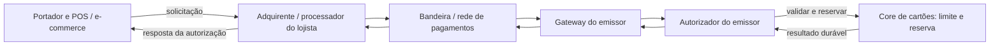
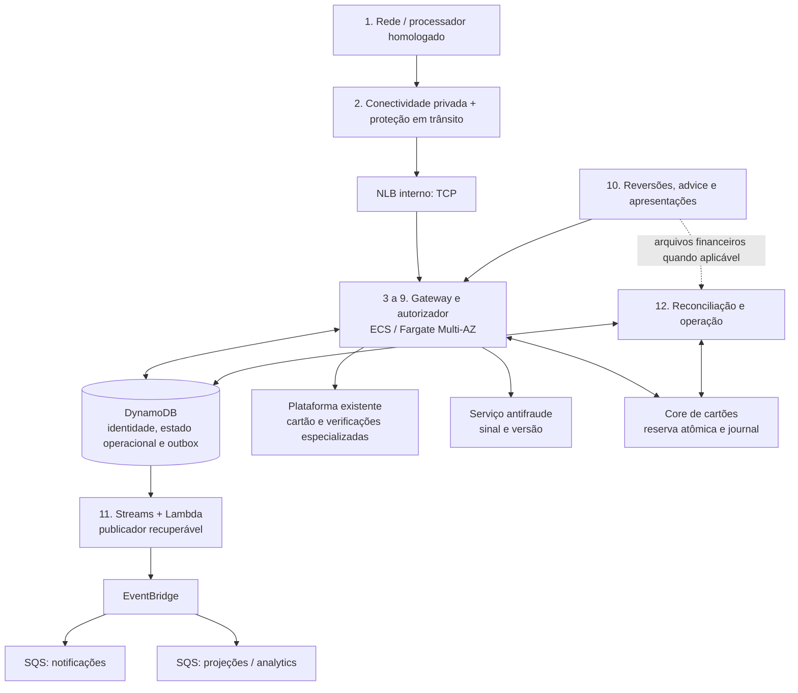
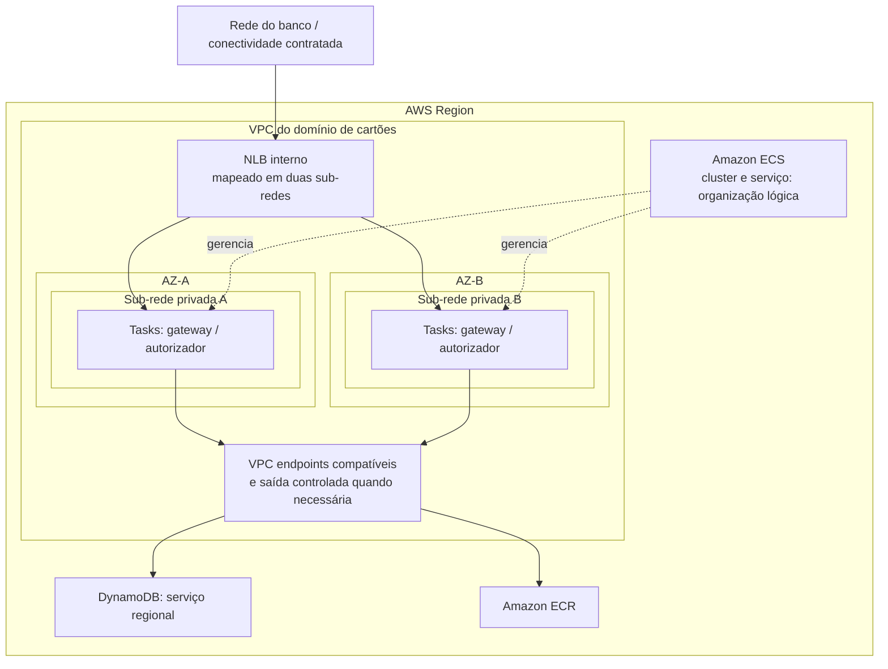
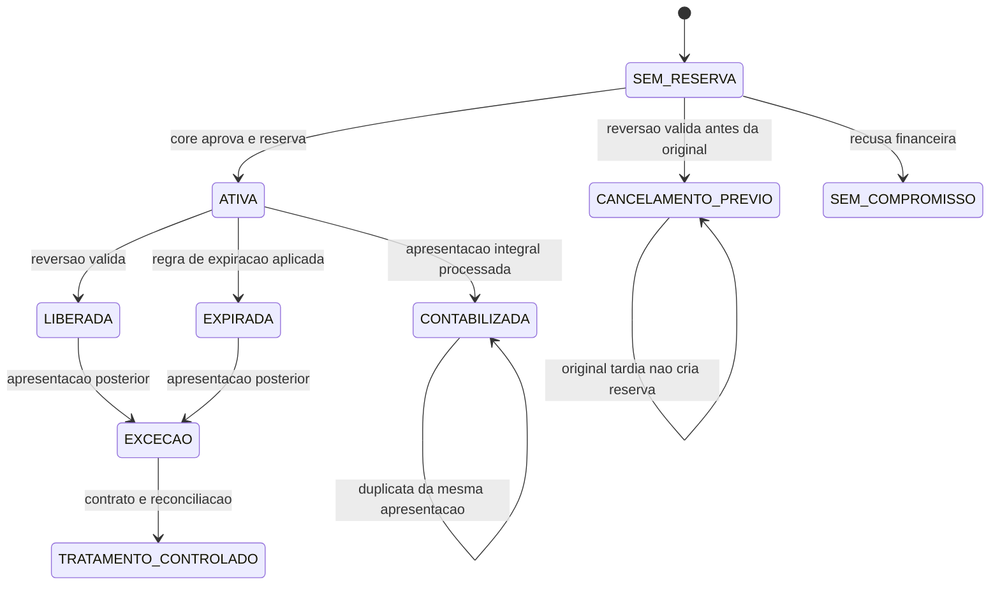
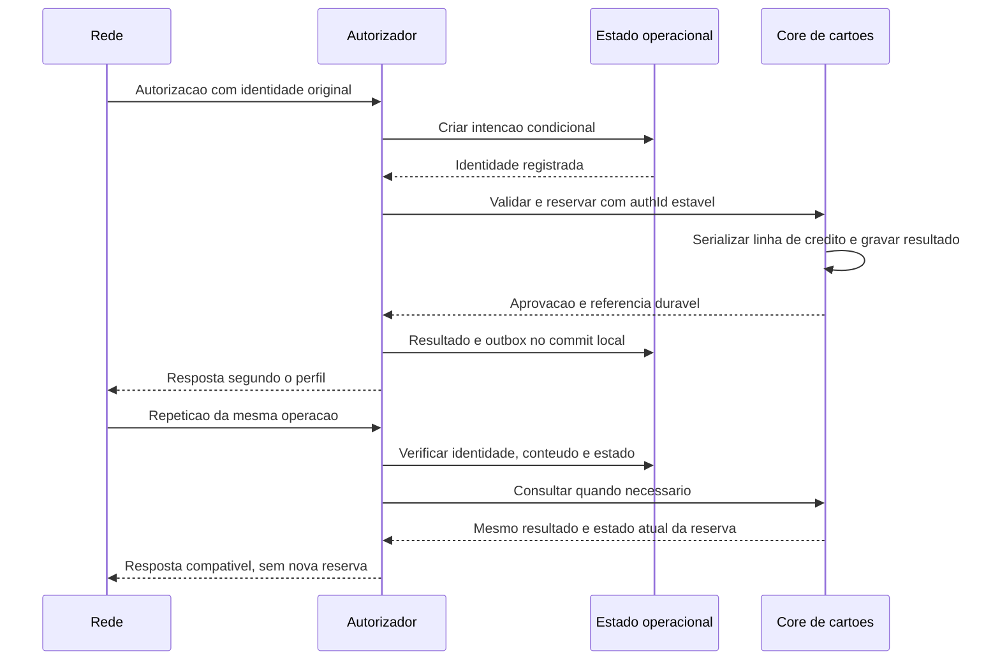
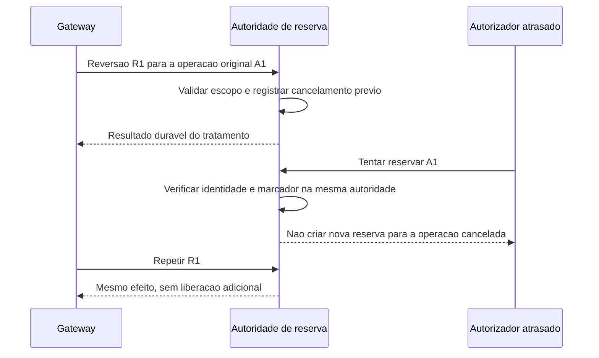
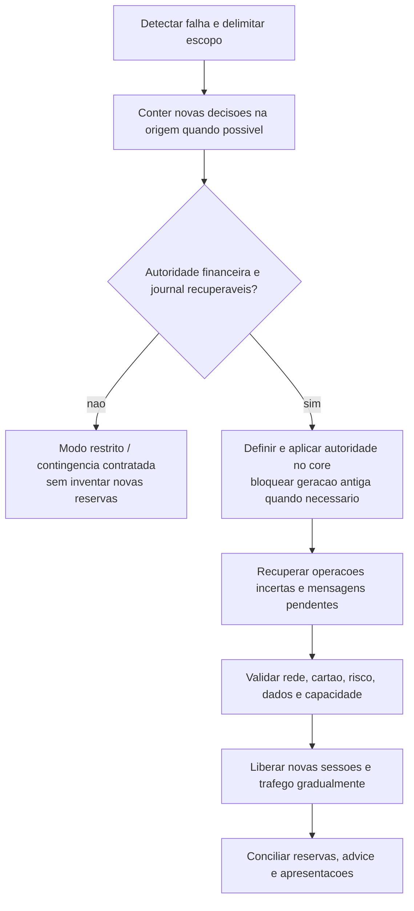

# Case 10 — Plataforma de autorização de cartões na AWS

> **Foco:** adquirente, bandeira, banco emissor, autorização, reserva de limite, captura, reversão, PCI DSS, ISO 8583 e alta disponibilidade.  
> **Idioma:** português do Brasil. Nomes dos serviços AWS, protocolos e identificadores de código foram preservados.  
> **Formato:** guia de estudo, decisões arquiteturais e simulação de entrevista.  
> **Referências consultadas em:** 28/09/2026.  
> **Caminho sugerido no repositório:** `cases/10-card-authorization-platform.md`.

## Como usar este material

Este case fecha a série iniciada em [pagamentos e Pix](01-payment-processing-pix.md), [Open Finance](02-open-finance-apis.md), [Banking Event-Driven](03-event-driven-banking.md), [KYC](04-kyc-account-opening.md), [modernização do core](05-core-banking-modernization.md), [GenAI](06-genai-financial-advisor.md), [antifraude](07-real-time-fraud-detection.md), [data lake financeiro](08-financial-data-lake.md) e [Internet Banking Multi-Region](09-multi-region-internet-banking.md).

Agora, estamos do lado do **banco emissor do cartão**, não do gateway contratado pelo lojista. Precisamos decidir uma autorização, preservar a reserva de limite e acompanhar mensagens posteriores, mesmo quando uma conexão cai ou uma resposta chega tarde.

O exemplo principal é uma compra online de **R$ 500,00 com cartão de crédito**, em uma jornada que separa autorização da apresentação financeira posterior. O core de cartões já existe. Construiremos a camada de autorização e sua integração; não implementaremos um ledger nem uma bandeira.

Na primeira leitura, percorra as seções 1 a 7. Depois estude as três fronteiras mais importantes: **quem pode reservar limite, o que uma resposta perdida significa e como uma autorização se relaciona com reversão e apresentação financeira**. Por último, responda às perguntas sem abrir as respostas.

**Frase central:** “Aprovar uma autorização não é liquidar a compra. Uma reserva deve existir uma vez, uma reversão deve liberar apenas o que pode ser liberado e uma resposta perdida não apaga o que o core já confirmou.”

Este é um cenário didático, não uma arquitetura oficial AWS, uma implementação homologada por bandeira, um parecer de conformidade ou uma rubrica oficial de entrevista. L5 é o alvo de preparação informado. Valores, metas, nomes de APIs, códigos e políticas são exemplos. O laboratório utiliza dados sintéticos e não se conecta a redes reais de pagamento.

### Dois níveis de estudo

**Núcleo para defender no quadro:** cadeia de cartões → integração autenticada → validação e risco → reserva atômica no core → resposta no prazo → mensagens posteriores → reconciliação → continuidade com autoridade única.

**Aprofundamento:** perfil ISO 8583, sessões persistentes, delimitação de mensagens, STAN/RRN, advice, stand-in, reservas parciais, apresentação tardia, requisitos PCI e desligamento de containers.

**AWS Payment Cryptography e CloudHSM não são componentes que a candidata precisa dominar neste case.** As verificações especializadas são fornecidas pela plataforma de cartões existente, com responsabilidade contratual explícita. Não substituímos essas verificações por KMS nem presumimos que deixaram de ser necessárias.

---

## Sumário

1. [Problema de negócio e escopo](#s01)
2. [Vocabulário e modelo mental](#s02)
3. [Perguntas antes de desenhar](#s03)
4. [Requisitos, premissas e invariantes](#s04)
5. [Decisões da arquitetura-base](#s05)
6. [Arquitetura e cadeia de cartões em Mermaid](#s06)
7. [Fluxo explicado em 12 etapas](#s07)
8. [Contratos, idempotência, limite e reservas](#s08)
9. [ISO 8583, sessões, timeouts e respostas tardias](#s09)
10. [Reversão, captura, clearing, settlement e reconciliação](#s10)
11. [Papel e posicionamento dos serviços](#s11)
12. [Trade-offs que precisam ser defendidos](#s12)
13. [Rede, sub-redes e integração com a bandeira](#s13)
14. [Segurança, PCI DSS, dados e responsabilidades](#s14)
15. [Alta disponibilidade, recuperação regional e stand-in](#s15)
16. [Desempenho, capacidade e custos](#s16)
17. [Observabilidade, operação e implantação](#s17)
18. [Aplicação dos seis pilares Well-Architected](#s18)
19. [Roteiro de laboratório e testes](#s19)
20. [30 perguntas de entrevista com respostas comentadas](#s20)
21. [Apresentação da solução e simulação de 45 minutos](#s21)
22. [Checklist de domínio](#s22)
23. [Referências e leitura orientada](#s23)

---

<a id="s01"></a>
## 1. Problema de negócio e escopo

### Enunciado inicial

> Um banco emissor quer modernizar na AWS sua plataforma de autorização de cartões. As compras chegam por uma integração com a rede de pagamentos, parte dela baseada em sessões persistentes. A solução precisa responder rapidamente, verificar o cartão e o risco, reservar limite sem duplicidade e continuar operando durante falhas. Depois, deve tratar reversões, apresentações financeiras e conciliação. Como você desenharia essa arquitetura?

Não comece com “API Gateway, Lambda e DynamoDB”. Primeiro, identifique o **lado da cadeia**, o produto, o protocolo, a autoridade sobre o limite e a obrigação assumida quando respondemos “aprovado”.

### Qual é a diferença em relação ao Case 01?

No Case 01, nossa plataforma recebia uma intenção do lojista e consultava um provedor de pagamentos. Aqui, o emissor precisa responder sobre **um cartão que ele emitiu** e coordenar a decisão com o sistema que controla sua linha de crédito.

| Perspectiva | Pergunta principal |
|---|---|
| Lojista/gateway | “Como cobrar e acompanhar a compra sem criar uma segunda cobrança?” |
| Adquirente | “Como aceitar e encaminhar a transação do estabelecimento?” |
| Bandeira/rede | “Como intercambiar mensagens e aplicar as regras do arranjo?” |
| Emissor | “Posso autorizar esta operação e assumir a correspondente reserva/obrigação?” |
| Core de cartões | “Qual limite está comprometido e quais lançamentos efetivamente existem?” |

Em uma integração real, uma empresa pode acumular funções e processadores podem operar componentes para outras instituições. O diagrama representa responsabilidades, não uma lista obrigatória de empresas distintas.

### Exemplo concreto

Uma cliente possui limite disponível de R$ 1.000,00 e tenta comprar R$ 500,00. A plataforma verifica a mensagem, consulta as capacidades de cartão e risco e solicita ao core uma reserva identificada.

O core confirma a reserva. A resposta de aprovação é preparada, mas a conexão cai antes de o outro lado recebê-la. Outra mensagem chega posteriormente: pode ser uma repetição da autorização, uma reversão, um advice ou uma apresentação financeira. **Não podemos decidir o tratamento olhando apenas para o valor e o número mascarado do cartão.**

O exemplo progride por quatro situações: resposta normal; resposta perdida; reversão antes ou depois da reserva; apresentação que transforma o compromisso em lançamento. Documentações de emissão ilustram a diferença entre autorização, retenção temporária e transação posterior, mas seus contratos não são regras universais de todas as bandeiras. [Fontes: autorização][r03], [etapas de pagamento][r02]

### Escopo inicial

Adotamos cartão de crédito, compra doméstica em BRL, autorização online e uma apresentação integral posterior. O produto utiliza um modelo de duas etapas para separar a autorização do processamento financeiro. Não assumimos que todo cartão, inclusive débito ou pré-pago, opere assim.

Parcelamento, pré-autorização de hotel, gorjetas, câmbio, incrementos, autorização parcial, múltiplas apresentações, transações offline e single-message são extensões. Elas aparecem nas perguntas de descoberta e nos pontos de evolução; não serão improvisadas a partir da regra de uma compra simples.

### Fronteiras de responsabilidade

| Responsabilidade | Dono na proposta |
|---|---|
| Identificar o participante conectado e validar o perfil de mensagem | Gateway/switch homologado do emissor |
| Resolver o cartão e verificar elementos especializados | Plataforma de cartões existente |
| Produzir o sinal de risco | Serviço antifraude existente |
| Aplicar a política de autorização | Serviço autorizador, com regras aprovadas |
| Verificar elegibilidade financeira final e reservar limite atomicamente | Core/domínio transacional de cartões |
| Manter evidência operacional e coordenar recuperação | Serviço autorizador e reconciliador |
| Definir semântica de mensagem, prazos e procedimentos de exceção | Contrato e homologação da rede/produto |
| Aplicar apresentações, reversões e lançamentos financeiros | Core e processadores responsáveis por cada etapa |
| Aprovar contingência e assumir exposição de risco | Emissor, negócio, risco e parceiros aplicáveis |

**O autorizador não é proprietário de uma segunda cópia independente do limite disponível.** Ele pode manter uma projeção, mas a decisão que compromete limite ocorre na autoridade definida.

### Fora do núcleo

Não faremos implementação de algoritmos de cartão, custódia de chaves especializadas, emissão física, ledger completo, sistema de chargeback ou liquidação entre participantes. Não ensinaremos a enviar mensagens para uma bandeira sem adesão e homologação.

O contrato de um core idempotente é uma **premissa que deve ser demonstrada**. Se ele não existir, não esconderemos o problema atrás de uma tabela DynamoDB. O projeto precisa incluir a adaptação transacional ou redefinir o que pode ser garantido.

---

<a id="s02"></a>
## 2. Vocabulário e modelo mental

### As pessoas e os componentes

| Termo | Significado neste case |
|---|---|
| Portador | Pessoa que utiliza o cartão |
| POS | *Point of Sale*: terminal ou sistema de ponto de venda; aqui, a maquininha é um exemplo |
| Lojista / merchant | Estabelecimento que aceita a compra |
| Adquirente / acquirer | Participante que atende a aceitação pelo estabelecimento |
| Processador | Prestador/componente que processa operações para adquirente ou emissor; especifique de qual lado |
| Bandeira / scheme | Arranjo/rede e regras de intercâmbio; não é sinônimo de banco emissor |
| Emissor / issuer | Instituição responsável pelo cartão e pela relação com o portador |
| Switch / gateway de cartões | Interpreta, correlaciona e encaminha mensagens conforme o perfil contratado |
| Core de cartões | Sistema autoritativo de limite, reservas, contas e lançamentos neste cenário |
| CDE | *Cardholder Data Environment*: ambiente de dados de cartão cujo escopo precisa ser avaliado |
| PAN | Número principal da conta do cartão; não deve aparecer nos exemplos ou logs deste laboratório |
| SAD | Dados sensíveis de autenticação; seu tratamento exige controles específicos |

### As operações

| Termo | Significado e limite da interpretação |
|---|---|
| Autenticação | Evidência sobre participante/cartão/portador; não comprova limite disponível |
| Autorização | Decisão sobre uma operação, conforme as regras e o contexto do produto |
| Hold / reserva | Comprometimento temporário de limite ou fundos segundo o produto |
| Captura | Confirmação da cobrança no lado lojista/adquirente; pode gerar a apresentação financeira |
| Presentment / apresentação | Registro financeiro apresentado para processamento no ciclo de compensação |
| Clearing / compensação | Validação e apuração das obrigações entre participantes, conforme o arranjo |
| Settlement / liquidação | Cumprimento financeiro das obrigações de liquidação |
| Authorization reversal | Mensagem de reversão associada à autorização; pode liberar a reserva aplicável |
| Refund / devolução | Operação de crédito/devolução posterior; não é simplesmente apagar uma autorização |
| Chargeback | Processo de contestação, com regras e evidências próprias |
| Advice | Comunicação de um fato/resultado previsto no protocolo; não é necessariamente uma nova solicitação de autorização |
| Stand-in | Processamento substitutivo autorizado para determinadas condições de indisponibilidade |
| Idempotência | Repetir uma operação identificada não deve repetir seu efeito |
| Reconciliação | Comparar registros/evidências e resolver diferenças de forma controlada |

**“Estorno” é uma palavra ambígua.** Na entrevista, pergunte se significa liberar uma reserva, devolver uma compra contabilizada ou tratar uma contestação. Esses fluxos não têm o mesmo comando, prazo ou efeito.

### ISO 8583 sem decorar uma tabela de campos

ISO 8583 define estrutura e formato para intercâmbio de mensagens de transações originadas em cartões. A própria descrição da ISO esclarece que o método de transporte e a liquidação estão fora do escopo da norma. Usar TCP persistente é uma escolha do **perfil de integração**, não algo que decorre automaticamente do nome ISO 8583. [Fonte: ISO][r01]

| Termo | Como interpretar |
|---|---|
| MTI | Indicador de tipo de mensagem, interpretado conforme versão e perfil |
| Bitmap | Indica a presença de elementos de dados no formato aplicável |
| Campo/DE | Elemento cujo formato, tamanho e semântica precisam estar contratados |
| STAN | Referência de rastreamento usada em perfis de cartão; não presumir unicidade global |
| RRN | Referência de recuperação utilizada no perfil; não substitui toda a chave da operação |
| Referência original | Dados que permitem correlacionar repetição, reversão ou mensagem subsequente |
| Framing | Regra de delimitação das mensagens no fluxo de bytes |
| Sign-on / echo | Exemplos de gerenciamento de sessão definidos pelo perfil |

Não é necessário decorar que um determinado MTI “sempre” significa um fluxo em qualquer rede. Uma versão de norma, uma bandeira e um processador podem exigir particularidades diferentes. Peça a especificação efetivamente homologada.

### Quatro afirmações diferentes

| Afirmação | O que ainda não prova |
|---|---|
| “O 3DS autenticou a pessoa.” | Que o emissor aprovou ou que há limite para comprar |
| “O core reservou R$ 500.” | Que a resposta chegou ao lojista |
| “O lojista capturou a compra.” | Que todos os participantes já liquidaram as obrigações |
| “A reserva expirou.” | Que nenhuma apresentação financeira posterior poderá chegar |

O EMV 3DS é voltado à autenticação em compras sem presença física do cartão. A decisão financeira é outra responsabilidade. [Fonte: EMVCo][r08]

---

<a id="s03"></a>
## 3. Perguntas antes de desenhar

Uma abertura possível:

> “Quero confirmar nosso papel como emissor, o produto e o perfil de integração. Depois vou identificar quem controla o limite, qual é a garantia da reserva, o prazo da rede e como consultamos uma autorização cuja resposta se perdeu.”

| Pergunta | Como a resposta altera a arquitetura |
|---|---|
| Somos emissor, processador do emissor ou gateway de lojista? | Define a decisão e a responsabilidade financeira |
| Crédito, débito, pré-pago ou combinação? | Muda a autoridade sobre fundos e a máquina de estados |
| Dual-message ou single-message? | Determina a separação entre autorização e processamento financeiro |
| Qual versão/perfil ISO, ou API, será usado? | Define parser, sessões, campos, correlação e homologação |
| Quem inicia as conexões? Quantas são permitidas por site? | Muda ingresso, egress, failover e balanceamento |
| Qual prazo exato da resposta e quem o mede? | Define timeouts internos, admissibilidade e respostas tardias |
| Existem echo, sign-on, limites de mensagens em voo e sequência de sessão? | Orienta gateway e testes de reconexão |
| Qual volume por mensagem, cartão, conexão e participante? | Revela hotspots que TPS agregado não mostra |
| O core verifica e reserva em uma única operação atômica? | Define se duas compras concorrentes podem exceder limite |
| O core deduplica e permite consulta pela referência estável? | Torna recuperável o timeout após commit |
| Uma reversão pode anteceder o pedido original? Como correlacionar? | Exige tratamento de ordem e marcador de cancelamento |
| Como são tratadas expiração, apresentação tardia e captura parcial? | Determina reservas, exceções e reconciliação |
| Quais verificações de cartão/criptografia já existem? | Permite reutilizar a capacidade especializada |
| Qual regra quando antifraude, core ou link fica indisponível? | Evita inventar fail-open sem autorização institucional |
| Há stand-in contratado? Qual exposição, escopo e protocolo de retorno? | Muda a origem de decisões e a recuperação |
| Há dados de cartão brutos no ponto que vamos operar? | Delimita CDE, acesso, logs e evidências |
| Qual RTO/RPO por decisão, reserva e lançamento? | Define continuidade financeira, não apenas uptime da API |
| As dependências suportam duas AZs e a região secundária? | Expõe pontos únicos fora dos containers |
| Como obter arquivos/relatórios de clearing e totais de controle? | Permite demonstrar completude e conciliação |
| Quem aprova release e certifica mudança de protocolo? | Define pipeline, evidências e janela operacional |

**Não é preciso fazer vinte perguntas de uma vez.** Priorize produto, autoridade financeira, contrato de repetição e prazo. As demais refinam as decisões.

---

<a id="s04"></a>
## 4. Requisitos, premissas e invariantes

### Hipóteses da simulação

As metas abaixo são números de exercício, não desempenho medido de um serviço AWS nem SLA de uma bandeira.

| Dimensão | Hipótese inicial |
|---|---|
| Produto | Crédito em BRL, autorização online e apresentação integral posterior |
| Região | Uma região escolhida com o banco; `sa-east-1` no laboratório, mediante disponibilidade dos componentes |
| Disponibilidade local | Aplicação e conectividade desenhadas para perda de uma AZ |
| Pico normal | 1.000 novas autorizações/s; reversões, consultas e repetições são tráfego adicional |
| Evolução | Bursts de 3.000 autorizações/s, sujeitos a novo dimensionamento e contrato do core |
| Latência | Objetivo didático de p99 até 250 ms na cadeia de processamento sob nossa responsabilidade |
| Prazo externo | Valor definido com a rede, incluindo transporte e intermediários; não será inferido dos 250 ms |
| Disponibilidade de serviço | SLO didático de 99,99% para respostas técnicas válidas e tempestivas, com critérios explícitos |
| Core | Reserva atômica, journal durável, deduplicação e consulta por identidade estável |
| Cartão/risco | Serviços existentes, identificáveis por versão e com contingência aprovada |
| Dados | Sem PAN/SAD em DynamoDB, eventos, métricas ou exemplos do guia |
| Regional | Evolução com standby e autoridade financeira preservada; não haverá dois escritores independentes do mesmo limite |
| Reconciliação | Prazos separados para desconhecidos online, reversões e fechamentos financeiros |

Uma recusa legítima por limite não é falha técnica. Entretanto, classificar indisponibilidade como “recusado por limite” apenas para melhorar o SLO é incorreto e atrapalha investigação.

### Invariantes que a arquitetura precisa preservar

1. **Uma identidade de autorização representa uma intenção identificável.** Repetição não cria outra reserva.
2. **A mesma identidade com valor, moeda ou cartão incompatível é um conflito.** Não se altera a operação original silenciosamente.
3. **Verificar limite e reservar são uma decisão atômica do domínio financeiro.** Ler uma projeção e gravar depois não basta.
4. **Não emitimos aprovação financeira sem evidência durável da autoridade.** Uma task saudável não substitui essa confirmação.
5. **Timeout não prova recusa nem ausência de reserva.** O resultado incerto precisa de consulta/recuperação.
6. **Reversão não pode liberar limite duas vezes nem ressuscitar uma operação cancelada.** Concorre sob a mesma autoridade da reserva.
7. **Converter reserva em lançamento não compromete duas vezes o mesmo valor.** Cada apresentação tem identidade e efeito próprios.
8. **Expiração de reserva não apaga o histórico da autorização.** A apresentação posterior segue tratamento definido, não descarte automático.
9. **Notificação e analytics não participam da confirmação financeira.** Podem convergir depois, com eventos recuperáveis.
10. **Região antiga e região nova não podem assumir o mesmo limite independentemente.** Roteamento e autoridade são controles distintos.

### RPO por dado, não por logotipo de serviço

| Dado | Garantia a exigir |
|---|---|
| Reserva e seu identificador financeiro | Não perder silenciosamente uma obrigação confirmada; demonstrar recuperação no domínio do core |
| Resultado financeiro original | Consulta durável mesmo depois de falha de task ou troca de região |
| Observação de transporte | Preservar o que sabemos sobre recebimento/envio, sem afirmar entrega ao portador sem prova |
| Projeção operacional | Pode ser reconstruída do journal, desde que a indisponibilidade/reconstrução seja suportada |
| Eventos de notificação | Recuperação posterior e deduplicação; não repetir efeitos financeiros |
| Configuração de risco | Versão aprovada disponível, com política para indisponibilidade e obsolescência |

“RPO zero para reservas” é um **requisito do sistema completo**. Não é uma propriedade obtida ao habilitar uma réplica assíncrona do DynamoDB do autorizador.

---

<a id="s05"></a>
## 5. Decisões da arquitetura-base

### Caminho síncrono

A rede/processador se conecta por um caminho privado homologado a um **Network Load Balancer interno com listener TCP**. O tráfego é encaminhado a tasks **Amazon ECS com AWS Fargate**, em duas AZs. O gateway termina e valida a conexão protegida, interpreta a mensagem e aciona a lógica de autorização.

Gateway e autorizador são **papéis lógicos distintos**. Na versão mínima, podem integrar a mesma implantação homologada. A separação em serviços diferentes só será feita quando permitir isolamento, evolução ou escala que compensem a chamada adicional e a operação.

O serviço usa **DynamoDB para identidade operacional, progresso e outbox**. A decisão financeira final é realizada pelo **core de cartões existente**, que valida e reserva de forma atômica. O antifraude fornece um sinal dentro de um prazo; não atualiza limite.

### Por que não API Gateway no meio da sessão ISO?

O transporte assumido é TCP persistente. API Gateway REST e WAF atendem necessidades HTTP, não substituem o gateway que interpreta esse protocolo. Uma API administrativa pode usar esses serviços em uma interface separada.

No desenho escolhido, **mTLS é validado no target**, porque um listener TLS do NLB não implementa autenticação mútua. O listener TCP permite passagem do tráfego cifrado ao componente responsável. [Fontes: NLB][r13], [recursos do WAF][r32]

### Fargate é uma hipótese de implantação, não uma obrigação

Precisamos validar com o fornecedor: suporte a container, bibliotecas, licenças, recursos de sistema, armazenamento, limites de desligamento, gestão de certificados e comportamento das sessões.

Se a solução exige algo que Fargate não atende, **ECS sobre EC2 ou uma implantação especializada podem ser escolhas melhores**. “Não administrar instâncias” não justifica escolher um runtime incompatível com o produto.

### Caminho assíncrono

Mudanças operacionais relevantes geram uma **outbox no mesmo commit local do estado no DynamoDB**. DynamoDB Streams e Lambda publicam eventos no EventBridge. Uma fila SQS por capacidade atende notificações, projeções operacionais e integração com analytics.

Essa atomicidade é **local**. Ela não torna atômica a chamada anterior ao core. A recuperação entre core e autorizador depende da identidade financeira e da consulta durável contratadas.

### O que é essencial e o que é alternativa

| Componente | Decisão |
|---|---|
| NLB TCP + gateway homologado | Base para o perfil de conexão assumido |
| ECS/Fargate Multi-AZ | Execução, condicionada à prova de compatibilidade |
| Core com journal e reserva atômica | Autoridade financeira; dependência essencial |
| DynamoDB | Estado operacional e outbox, não segunda autoridade sobre limite |
| EventBridge + SQS | Distribuição de fatos e trabalho posterior |
| S3 | Evidências/arquivos permitidos e reconciliação, nunca dump indiscriminado do protocolo |
| IAM, criptografia, segredos, logs e métricas | Controles transversais necessários |
| Aurora | Alternativa para o estado local se consultas relacionais e transações do domínio justificarem |
| ElastiCache | Otimização de dados permitidos; não guarda sozinho a verdade de reservas |
| MSK | Evolução para log compartilhado/replay; não necessário no caminho síncrono inicial |
| Step Functions | Possível coordenação de investigação, conciliação e jobs; não obrigatório em cada autorização |
| API Gateway/WAF | Canal HTTP administrativo, não o front door do TCP deste exercício |

**Uma arquitetura menor, com contratos financeiros claros, é preferível a várias bases sem definição de autoridade.**

---

<a id="s06"></a>
## 6. Arquitetura e cadeia de cartões em Mermaid

Os diagramas são lógicos. Não representam certificação de rede nem todos os componentes do CDE. Linhas tracejadas indicam informação/gestão ou etapa posterior conforme a legenda; não são automaticamente sub-redes ou AZs.

### 6.1 Quem participa da autorização



No fluxo online normal, o emissor toma a decisão segundo as suas políticas. Autorização offline ou stand-in são exceções previstas contratualmente, não um motivo para dizer que “a bandeira nunca decide”.

### 6.2 Caminhos principal e posterior



A resposta à rede retorna pela sessão apropriada. O envio ao EventBridge não é condição para a compra estar aprovada. O vínculo com o core e o resultado durável são.

### 6.3 Posicionamento de rede e execução



O NLB é um recurso lógico com presença nas sub-redes selecionadas, não um dispositivo fora de todas as AZs. O cluster ECS não contém nem cria as sub-redes. Tasks em modo `awsvpc` recebem interfaces de rede e controles associados. [Fonte: rede das tasks][r16]

### 6.4 Ciclo simplificado da reserva



Esse diagrama descreve **reserva**, não todos os estados do pagamento. `UNKNOWN` pertence à nossa observação do resultado de uma chamada; o core pode já ter uma reserva ativa. Reembolso e contestação não serão adicionados como “voltar para SEM_RESERVA”.

---

<a id="s07"></a>
## 7. Fluxo explicado em 12 etapas

### 1. A compra chega pela cadeia de aceitação

O POS ou checkout inicia a jornada, que percorre adquirente/processador e rede até o emissor. O nosso serviço não recebe, neste cenário, um `POST /payments` diretamente do navegador do lojista.

**Responsabilidade:** conhecer a origem, o produto e o perfil contratual. A referência da compra deve sobreviver a retransmissões da rede sem confundir outra compra de mesmo valor.

### 2. A conexão é autenticada e admitida

O caminho privado entrega o tráfego ao NLB TCP. O target verifica a identidade do participante, os certificados e as regras do canal; a aplicação aplica limites de sessão e de mensagens em voo.

Conectividade privada não basta como autorização. Também não presume criptografia: Direct Connect não cifra o tráfego por padrão. A proteção em trânsito faz parte explícita da proposta. [Fonte: Direct Connect][r29]

### 3. O gateway interpreta e normaliza a mensagem

O parser valida tamanho, framing, versão, tipo, bitmap e campos conforme o perfil homologado. Dados financeiros são convertidos para representações sem ambiguidade de moeda e casas decimais.

Verificações especializadas são encaminhadas à capacidade de cartões existente. A aplicação usa identificadores opacos e resultados permitidos, evitando propagar campos sensíveis para o restante da plataforma.

**Erro de protocolo não é recusa por saldo.** A resposta correta depende do contrato da integração.

### 4. A identidade operacional é registrada

O autorizador constrói/resolve um `authId` estável a partir da identidade original de negócio e do contexto da rede. Registra conteúdo normalizado e fingerprint, respeitando minimização de dados.

Uma escrita condicional impede que duas tasks criem duas intenções locais para o mesmo identificador. A operação ainda não está financeiramente aprovada. A orientação Well-Architected para operações mutáveis idempotentes se aplica também à integração seguinte, não apenas ao ingresso. [Fonte: idempotência][r28]

### 5. Elegibilidade e verificações do cartão são avaliadas

A plataforma de cartões verifica o que lhe cabe: estado do cartão, contexto de uso e elementos de autenticação/validação previstos no produto. O autorizador não implementa verificação de PIN/CVV com uma função caseira.

A aprovação dessa etapa não reserva limite. E uma informação de cartão em cache não pode ignorar bloqueios novos: a decisão final deve considerar uma versão/consulta atual conforme a política de consistência.

### 6. O risco é consultado dentro do orçamento de tempo

O serviço antifraude retorna sinais e contexto. A política decide se permite prosseguir, recusa ou usa uma contingência aprovada. O prazo da consulta precisa deixar tempo para a reserva e a resposta.

No POS, não se presume que existe uma jornada interativa adicional equivalente a abrir uma tela no aplicativo. Qualquer ação de desafio precisa ser suportada pelo canal e pela rede. Não converta automaticamente uma sugestão de ML em um código universal ISO.

### 7. O core valida e reserva atomicamente

O autorizador envia a mesma identidade financeira e conteúdo ao core. O core verifica a elegibilidade final, os compromissos existentes, a autoridade de origem e o prazo aceito; cria a reserva e a evidência de resultado em uma decisão transacional.

Duas compras distintas de R$ 800 com somente R$ 1.000 disponíveis não podem passar porque duas tasks consultaram o mesmo saldo antigo. **A serialização é por recurso financeiro compartilhado**, não apenas por `authId`.

### 8. O resultado e a evidência operacional são persistidos

No caminho normal, o serviço grava a decisão confirmada, a referência da reserva, as versões aplicadas e a outbox local antes de transmitir a resposta. Não grava a mensagem bruta como atalho para auditoria.

Se o core confirmou e a atualização local falhou, existe uma janela de resultado incompleto no autorizador. O tratamento é recuperar pelo `authId`, não reservar outra vez. A transação do DynamoDB não engloba a chamada de rede ao core. [Fonte: transações do DynamoDB][r20]

### 9. A resposta é enviada no prazo e na sessão corretos

O gateway produz a resposta correspondente ao perfil homologado. Registra o estágio de envio sem afirmar que o portador a viu. Um `write()` no socket bem-sucedido não prova a conclusão da jornada remota.

Se o prazo acaba, seguimos a política técnica da rede e preservamos a condição de incerteza quando necessária. Uma mensagem atrasada não recebe autorização financeira nova apenas para “tentar fazer a tela funcionar”.

### 10. Mensagens posteriores seguem seus próprios contratos

Repetição, reversão, advice e apresentação não são o mesmo comando. Cada uma precisa de identidade, vínculo com a operação original e validação apropriados.

A captura ocorre no lado da aceitação. Nosso emissor processa a apresentação e os efeitos de sua responsabilidade; não criamos uma chamada universal “emissor captura no lojista”. Nas extensões, uma autorização pode se relacionar com mais de uma transação financeira. [Fontes: etapas][r02], [transações][r04]

### 11. Eventos derivados alimentam consumidores independentes

Outbox, publicador, EventBridge e filas distribuem fatos sanitizados. Notificação e analytics recebem mensagens com `eventId` e versão, e os consumidores precisam tratar repetição.

Não colocamos “reservar limite” como trabalho solto em uma fila genérica antes da resposta online. O desacoplamento não deve esconder a obrigação de responder dentro do prazo. [Fontes: outbox][r23], [entrega do SQS][r26]

### 12. Reconciliação e operação fecham a jornada

Rotinas procuram resultados desconhecidos, reservas não liberadas quando deveriam, apresentações não associadas, divergências de totais e eventos sem confirmação. Elas usam evidências do core e do parceiro, não somente o log da task.

A operação acompanha disponibilidade técnica, latência, aprovação, recusa, reversão e exposição pendente como indicadores diferentes. O case não termina quando o serviço devolve uma resposta: termina quando sabemos recuperar e explicar cada efeito.

---

<a id="s08"></a>
## 8. Contratos, idempotência, limite e reservas

### 8.1 Dois domínios de estado, com autoridades diferentes

É útil separar o que o autorizador **observou** do que o domínio financeiro **efetivou**.

| Informação | Fonte autoritativa |
|---|---|
| Mensagem válida recebida em determinado canal | Journal operacional do gateway |
| Regra e versão usadas na avaliação | Serviço de política e evidência da avaliação |
| Sinal de risco obtido | Serviço antifraude e referência da avaliação |
| Reserva criada, liberada ou consumida | Core/domínio transacional de cartões |
| Resposta preparada/enviada | Gateway; não equivale a prova de recebimento remoto |
| Decisão comunicada pelo stand-in | Mensagem/evidência do participante responsável, conforme contrato |
| Apresentação e lançamento | Processo financeiro e core |

Não resolvemos uma divergência dizendo “o DynamoDB está mais recente, então ele vence o core”. O timestamp mais novo não transforma uma observação em autoridade sobre limite.

### 8.2 Contrato normalizado de autorização

O exemplo abaixo representa a mensagem **depois** da validação do gateway. Não é uma especificação ISO 8583, um payload de bandeira ou uma API pública para o lojista.

```json
{
  "authId": "auth_demo_0001",
  "operationKind": "PURCHASE_AUTHORIZATION",
  "network": "REDE_DE_TESTE",
  "participantRef": "participante_demo_01",
  "originalReference": "orig_demo_20260928_001",
  "cardRef": "card_ref_demo_42",
  "creditAccountRef": "credit_ref_demo_09",
  "merchantRef": "merchant_demo_08",
  "amountMinor": 50000,
  "currency": "BRL",
  "channel": "ECOMMERCE",
  "receivedAt": "2026-09-28T14:00:00Z",
  "deadlineAt": "2026-09-28T14:00:01Z",
  "protocolProfileVersion": "perfil-lab-v1"
}
```

A diferença de um segundo no exemplo é **apenas uma hipótese do simulador**. Não estabelece o timeout de uma rede real.

Valores monetários são inteiros na unidade mínima adotada para a moeda ou um tipo decimal apropriado. O fato de BRL usar centavos neste exercício não autoriza presumir duas casas decimais em todas as moedas. Não use ponto flutuante binário para comparar compromissos financeiros.

`cardRef` é uma referência opaca resolvida por um serviço confiável. Não é o PAN com uma função de hash pública aplicada. A mesma referência não deve ser exposta indiscriminadamente em analytics se permitir correlacionar a pessoa fora da finalidade autorizada.

### 8.3 Qual é a chave de idempotência?

O `authId` identifica a operação original dentro do domínio do emissor. Sua derivação/mapeamento considera a rede, o participante, a referência original, o contexto temporal e os demais elementos exigidos pelo perfil.

**STAN sozinho, RRN sozinho, código de autorização sozinho ou valor + cartão não são premissas suficientes de unicidade.** Descubra reinicializações, reutilização de identificadores e diferenças entre repetição e novo pedido. Um UUID gerado a cada recebimento também falha: transforma a mesma operação em duas identidades.

Use dois conceitos separados:

- **Identidade de negócio:** decide se estamos diante da mesma operação.
- **Fingerprint de conteúdo:** verifica se a repetição preserva os campos relevantes, como cartão, valor, moeda, tipo e estabelecimento quando aplicável.

Campos de transporte, número da tentativa, trace ID e instante de recebimento podem mudar legitimamente no retry. Incluí-los indiscriminadamente na identidade elimina a deduplicação. Excluí-los da identidade não significa ignorar conflitos em valor ou moeda.

### 8.4 Registro local e conflito

Uma estrutura possível no DynamoDB é `PK=AUTH#<authId>` e itens identificados por finalidade: `META`, evidências autorizadas e eventos de outbox. Uma condição de criação protege a identidade; atualizações com versão esperada protegem transições.

O backend verifica, nesta ordem: identidade do chamador, escopo do cartão/operação, existência do registro e equivalência do fingerprint. Não devolve o resultado de outra pessoa apenas porque recebeu uma chave conhecida.

Duas tasks podem receber a mesma autorização. Uma cria o registro e inicia a avaliação; a outra consulta o estado. Se a primeira morre, a recuperação usa um protocolo de posse/versão local para retomar trabalho. **Uma lease local expirada não prova que a chamada anterior ao core não vai terminar.** A segurança final depende também da idempotência do core.

O token de idempotência de uma API de infraestrutura não deve ser confundido com a identidade financeira. Por exemplo, `ClientRequestToken` de `TransactWriteItems` tem janela documentada de dez minutos. A retenção de uma autorização e de suas referências deve seguir o negócio, não esse prazo. [Fonte: transações do DynamoDB][r20]

### 8.5 O contrato financeiro mínimo

O core deveria oferecer capacidades equivalentes a:

| Operação conceitual | Garantia a demonstrar |
|---|---|
| `AutorizarEReservar(authId, conteúdo, autoridade, prazo)` | Validação e compromisso atômicos, com resultado durável |
| `ConsultarAutorizacao(authId)` | Resultado original, reserva atual e vínculos financeiros recuperáveis |
| `ReverterAutorizacao(reversalId, originalRef, escopo)` | Liberação idempotente ou marcador anterior à reserva, conforme contrato |
| `AplicarApresentacao(presentmentId, conteúdo)` | Lançamento único e ajuste correto da reserva correspondente |
| `ConsultarJournal(checkpoint)` | Recuperação e conciliação com prova de continuidade |

Esses nomes são didáticos. É aceitável que um produto comercial exponha outra interface; o que importa é demonstrar a semântica.

Se `ConsultarAutorizacao` usa réplica eventualmente consistente, “não encontrado” logo após timeout pode não ser conclusivo. A consulta para resolver resultado incerto precisa atingir a autoridade ou ter um contrato de completude. A mesma cautela vale para procurar a operação por um GSI eventual do DynamoDB. [Fonte: consistência de leitura][r21]

### 8.6 Reserva e decisão no mesmo limite

Considere uma linha de crédito fictícia:

| Momento | Limite total | Valores lançados | Reservas ativas | Disponível simplificado |
|---|---:|---:|---:|---:|
| Antes da compra | R$ 1.000 | R$ 0 | R$ 0 | R$ 1.000 |
| Autorização de R$ 500 aprovada | R$ 1.000 | R$ 0 | R$ 500 | R$ 500 |
| Mesma autorização recebida de novo | R$ 1.000 | R$ 0 | R$ 500 | R$ 500 |
| Apresentação integral contabilizada | R$ 1.000 | R$ 500 | R$ 0 | R$ 500 |

Para esse modelo simples:

`disponível = limite total - lançamentos que comprometem limite - reservas ativas`.

A fórmula não substitui um produto real, que pode ter pagamentos de fatura, créditos, limites adicionais, parcelamento, moedas e regras de recomposição. Seu objetivo é mostrar que **reservar e depois contabilizar não significa subtrair a mesma compra duas vezes**.

Agora considere duas operações distintas de R$ 800 chegando simultaneamente. Deduplicar cada `authId` não resolve a disputa entre elas. O core precisa coordenar ambas na linha de crédito compartilhada. A transação deve ser capaz de aprovar uma e recusar a outra conforme a política, sem uma janela em que ambas leiam R$ 1.000 como livres.

### 8.7 Resultado financeiro confirmado

```json
{
  "authId": "auth_demo_0001",
  "originalDecision": "APPROVED",
  "decisionVersion": 1,
  "reservationRef": "hold_demo_0001",
  "reservationState": "ACTIVE",
  "reservedAmountMinor": 50000,
  "currency": "BRL",
  "coreJournalRef": "journal_demo_0042",
  "coreCommitVersion": 42,
  "policyVersion": "issuer-policy-lab-v3",
  "riskAssessmentRef": "risk_demo_001",
  "authorityEpoch": 17
}
```

O código de resposta de rede não foi incluído porque precisa ser mapeado segundo o perfil. `APPROVED` é um estado interno de negócio, não um MTI ou um código que se deve transmitir literalmente.

### 8.8 Sequência normal e repetição



A consulta ao core no retry não precisa ser obrigatória em todos os casos; depende de a evidência local ser suficiente e atual para a resposta permitida. Entretanto, não se pode usar um cache de “aprovado” para reativar uma reserva que já foi revertida.

### 8.9 Não comprimir tudo em `status=APPROVED`

Uma estrutura mais útil separa dimensões:

| Dimensão | Exemplos |
|---|---|
| Decisão original | `APPROVED`, `DECLINED`, ainda não resolvida |
| Observação do autorizador | `KNOWN`, `CORE_RESULT_UNKNOWN`, `RECOVERING` |
| Transporte | `NOT_SENT`, `SEND_ATTEMPTED`, `SENT_WITHOUT_END_TO_END_PROOF` |
| Reserva atual | `ACTIVE`, `REVERSED`, `EXPIRED`, `CONSUMED` |
| Financeiro posterior | `NOT_PRESENTED`, `PRESENTED`, `POSTED`, `EXCEPTION` |
| Origem da decisão efetiva | Emissor, advice/stand-in previsto no contrato |

A decisão original continua no histórico mesmo depois de uma reversão. O que muda é a reserva e o tratamento atual. Isso evita duas falhas: perder a evidência de que o emissor aprovou e devolver cegamente uma aprovação antiga como se ainda fosse uma autorização utilizável.

### 8.10 Outbox e recuperação além do fluxo feliz

A gravação local de estado e outbox é atômica no DynamoDB. O publicador pode falhar depois de enviar o evento e antes de registrar a confirmação; o consumidor deve deduplicar por `eventId` e versão. Essa é uma janela normal de recuperação do padrão, não uma falha resolvida por trocar a fila. [Fonte: outbox][r23]

Há três janelas diferentes:

| Janela | Recuperação |
|---|---|
| Core confirmou, estado local não foi finalizado | Consultar core pelo `authId`; reconstruir evidência e outbox sem nova reserva |
| Outbox existe, evento não foi entregue | Publicador retoma item pendente |
| Evento foi entregue, confirmação do publicador se perdeu | Pode publicar de novo; consumidor impede segundo efeito |

DynamoDB Streams retém registros por 24 horas. Por isso, nesta proposta a outbox **continua durável e pesquisável por pendência**, com um varredor de recuperação; o stream acelera a publicação, mas não é o único inventário de trabalho. [Fonte: Streams][r24]

`PutEvents` exige tratar falhas por entrada, não apenas o status HTTP da chamada. Configuração errada de barramento também pode resultar em descarte, portanto teste a entrega ponta a ponta e monitore os consumidores, não somente o número de chamadas bem-sucedidas. [Fonte: publicação EventBridge][r25]

```json
{
  "eventId": "evt_demo_0001",
  "eventType": "CardAuthorizationApproved",
  "schemaVersion": 1,
  "aggregateId": "auth_demo_0001",
  "aggregateVersion": 2,
  "occurredAt": "2026-09-28T14:00:00Z",
  "data": {
    "authorizationRef": "auth_demo_0001",
    "reservationRef": "hold_demo_0001",
    "decisionSource": "ISSUER",
    "policyVersion": "issuer-policy-lab-v3"
  }
}
```

Não incluímos PAN, CVV, PIN, imagem do cartão ou payload ISO bruto. Nem mesmo todo consumidor precisa saber o valor: publique apenas o necessário para sua finalidade ou forneça uma API autorizada de enriquecimento.

---

<a id="s09"></a>
## 9. ISO 8583, sessões, timeouts e respostas tardias

### 9.1 O que perguntar ao time de integração

A pergunta “suporta ISO 8583?” é insuficiente. Precisamos de uma matriz com edição/perfil, transporte, codificação, delimitação, tipos de mensagem, campos obrigatórios, tamanhos, referências originais, segurança, timeout e testes de homologação.

Uma sessão pode carregar múltiplas mensagens. No TCP, não é correto assumir que **uma leitura do socket corresponde a uma mensagem inteira**. O gateway precisa acumular bytes, interpretar o framing, impor limites e tratar fragmentação ou agrupamento, conforme o contrato.

Essa implementação deve vir de um componente comprovado/homologado, não de um parser improvisado para a entrevista. O papel do arquiteto é identificar requisitos e exigir as provas de comportamento, inclusive para entradas malformadas.

### 9.2 Três tempos diferentes

| Relógio/prazo | O que controla |
|---|---|
| Timeout da operação | Até quando faz sentido concluir aquela avaliação e responder |
| Idle timeout da conexão | Quanto tempo uma conexão sem tráfego pode permanecer no caminho |
| Validade da reserva | Até quando o compromisso financeiro permanece ativo, segundo o produto |

Aumentar o idle timeout não aumenta legitimamente o prazo de autorização. Manter a sessão viva também não renova o hold de uma compra.

O NLB documenta idle timeout TCP padrão de 350 segundos, ajustável dentro de uma faixa. É necessário compatibilizar essa configuração com os demais equipamentos e o comportamento do cliente. Um keepalive não substitui o heartbeat de aplicação quando o perfil exige esse último. [Fonte: idle timeout][r15]

### 9.3 Sessão persistente e balanceamento

O NLB distribui conexões, não entende o `authId` em cada mensagem. Uma conexão longa pode concentrar muitas operações em uma task enquanto outras ficam ociosas. Aumentar o número de tasks não redistribui automaticamente as mensagens de uma sessão já estabelecida.

É preciso combinar: quantidade de sessões permitidas pela rede, distribuição por sessão, filas internas limitadas, concorrência do autorizador e capacidade do core. Se houver despacho interno a workers, a resposta continua associada à sessão e à correlação corretas.

A AWS discute especificamente resiliência de conexões de pagamento duradouras e impactos de reconexão e deploy. Isso reforça a necessidade de testar o protocolo, e não somente uma API HTTP de health check. [Fonte: conectividade de pagamentos][r19]

### 9.4 O timeout após a reserva

```mermaid
sequenceDiagram
    participant R as Rede
    participant A as Task autorizadora
    participant C as Core de cartoes
    participant B as Task de recuperacao
    R->>A: Autorizar operacao A1
    A->>C: Reservar com authId A1
    C->>C: Commit da reserva e do resultado
    C--xA: Resposta perdida
    A--xR: Prazo ou conexao encerra
    Note over A,C: O resultado observado e incerto; a reserva pode existir
    R->>B: Repeticao ou mensagem posterior correlacionada
    B->>C: Consultar A1 na autoridade
    C-->>B: Reserva existente e decisao original
    B->>B: Aplicar tratamento do perfil e atualizar evidencias
    B-->>R: Resposta permitida, sem reservar novamente
```

`UNKNOWN` é um estado interno de conhecimento. Não significa que a rede aceita uma resposta textual “UNKNOWN” nem que o core possui necessariamente esse estado.

```json
{
  "authId": "auth_demo_0001",
  "observation": "CORE_RESULT_UNKNOWN",
  "originalDecision": null,
  "transportOutcome": "DEADLINE_EXCEEDED",
  "nextAction": "QUERY_CORE_BY_ORIGINAL_ID",
  "retryMustReuseAuthId": true,
  "newFinancialReservationAllowed": false,
  "lastAttemptRef": "attempt_demo_002"
}
```

A recuperação deve distinguir: core confirmou; core recusou; core comprova que não aceitou; consulta indisponível; consulta inconclusiva. **Não encontrado em uma réplica atrasada** não equivale ao terceiro caso.

### 9.5 Prazo encerrado não cancela execução remota

O autorizador pode parar de esperar, mas a chamada ao core já enviada ainda pode terminar. Por isso, a operação carrega prazo/contexto e mantém a identidade estável. Mesmo com verificação de deadline, o sistema precisa tratar o caso de commit próximo ao limite temporal.

A política deve definir o que fazer com uma reserva conhecida depois que já não é possível emitir uma resposta útil: consulta, reconciliação, advice ou reversão segundo o contrato. Não liberamos o limite só porque nosso cronômetro acabou; isso pode conflitar com uma confirmação recebida em outra parte da cadeia.

Também não enviamos uma aprovação tardia sem verificar a semântica do canal. O parceiro pode já ter processado outro resultado. A decisão efetiva é reconciliada por eventos e evidências, não pelo princípio de “última resposta enviada vence”.

### 9.6 Retry em três camadas pode multiplicar tráfego

Uma tentativa pode ser repetida pela rede, pelo gateway e pelo SDK de uma dependência. Se cada camada faz três tentativas, o resultado pode ser muito maior do que o volume original e exceder o prazo.

A proposta define um orçamento de tentativas por operação e um dono da recuperação. Repetir leitura de estado e repetir comando financeiro têm riscos distintos. O comando financeiro só é repetido com identidade estável e contrato idempotente conhecido.

Depois do timeout do cliente, a recuperação não precisa continuar no mesmo caminho síncrono. Ela pode ocorrer em fila própria e ritmo controlado, preservando prioridade para consultas e reversões relevantes, conforme a política.

### 9.7 Deploy com sessões abertas

O procedimento de implantação deve retirar uma capacidade de receber trabalho novo, drenar mensagens em andamento, coordenar o encerramento da sessão e só então terminar a task. Há cenários em que o parceiro precisa abrir uma sessão substituta antes.

O tempo de deregistration do load balancer e o tempo de parada do container são configurações diferentes. A documentação do ECS trata connection draining; para tasks Fargate, `stopTimeout` tem máximo documentado de **120 segundos**, com padrão de 30 segundos quando não configurado. Não podemos planejar “deixar a task mais seis horas após SIGTERM” nesse mecanismo. [Fontes: draining][r17], [ContainerDefinition][r18]

Isso não torna Fargate inadequado automaticamente. Exige um ciclo de sessão que possa ser concluído de forma segura ou uma escolha diferente de implantação. A meta é preservar operações e permitir reconexão controlada, não prometer que nenhum socket jamais cairá.

### 9.8 Falha de transporte e falha financeira

| Evidência | Interpretação segura |
|---|---|
| TCP conectou | Há conectividade inicial; a sessão de aplicação ainda pode estar inapta |
| Echo respondeu | O parceiro respondeu ao teste previsto; isso não confirma capacidade de reserva |
| Chamada ao core expirou | O resultado pode ser desconhecido |
| Core retornou recusa durável | Há uma decisão financeira consultável |
| Resposta foi escrita no socket | Houve tentativa/aceitação local de envio, não prova universal de entrega final |
| Reversão foi recebida | Existe pedido autenticado a tratar; ainda falta efetivação e correlação |
| Target está unhealthy | O roteamento pode mudar; isso não cancela suas chamadas financeiras em andamento |

O NLB pode operar em **fail-open** quando todos os targets ficam não saudáveis em condições documentadas. Portanto, health check não é um mecanismo suficiente para proibir comandos financeiros; essa proibição deve existir no componente e na autoridade que os aceita. [Fonte: health checks do NLB][r14]

---

<a id="s10"></a>
## 10. Reversão, captura, clearing, settlement e reconciliação

### 10.1 Reversão de autorização não é devolução de compra contabilizada

Para o fluxo simples, a reversão válida pede o desfazimento do compromisso de autorização, conforme a situação da reserva. Ela possui identidade própria e referência à operação original.

```json
{
  "reversalId": "rev_demo_001",
  "originalAuthId": "auth_demo_0001",
  "originalReference": "orig_demo_20260928_001",
  "operationKind": "FULL_AUTHORIZATION_REVERSAL",
  "amountMinor": 50000,
  "currency": "BRL",
  "reasonCategory": "COMMUNICATION_FAILURE",
  "receivedAt": "2026-09-28T14:00:04Z",
  "protocolProfileVersion": "perfil-lab-v1"
}
```

O motivo é um exemplo interno; os códigos reais e a necessidade de campo de valor dependem do perfil. Não aceite uma reversão apenas porque o cliente informou um `authId`: autentique o participante e confira se tem legitimidade sobre aquela operação.

### 10.2 Matriz de tratamento proposta

| Estado encontrado na autoridade | Tratamento conceitual |
|---|---|
| Reserva ativa correspondente | Liberar a parcela permitida e registrar o resultado uma vez |
| Mesma reversão já aplicada | Recuperar o resultado, sem devolver limite novamente |
| Reserva já liberada por outra reversão equivalente | Não liberar de novo; preservar referências e responder conforme o perfil |
| Autorização ainda não existe, mas a original é identificável | Registrar marcador válido para impedir uma reserva tardia incompatível |
| Referência original ambígua ou conteúdo incompatível | Exceção/procedimento do perfil; não adivinhar uma compra pelo valor |
| Reserva já consumida por lançamento | Não apagar o lançamento; seguir processo financeiro apropriado |
| Apenas projeção local diz que existe | Consultar a autoridade antes de concluir o efeito financeiro |

Essa matriz é um contrato de desenho a validar com a plataforma do emissor. Não substitui a especificação de reversões de uma bandeira.

### 10.3 Reversão antes da autorização

Mensagens podem atravessar caminhos diferentes e falhas podem alterar a ordem observada. A proteção importante é não tratar uma reversão original válida como um simples no-op apenas porque a reserva ainda não está visível.



O marcador deve ser encontrado pela mesma identidade usada na reserva e estar protegido pelas mesmas regras de concorrência. Um tombstone só no cache de uma task não impede outra task de reservar.

Também não se deve produzir marcadores amplos como “não autorizar nenhum pagamento desse cartão hoje”. Isso cancelaria compras legítimas diferentes. O escopo precisa ser precisamente o da operação original validada.

### 10.4 Concorrência entre reserva, reversão e apresentação

Não há garantia de que um consumidor executará todos os comandos na ordem desejada. Nossa regra é serializar transições do mesmo compromisso no domínio financeiro, com versões e condições.

Se a reserva vence a corrida, a reversão seguinte libera o hold. Se a reversão válida vence, a tentativa tardia respeita o marcador. Se a apresentação já gerou um lançamento, a reversão não o transforma retroativamente em inexistente.

Isso não exige serializar o banco inteiro. A fronteira de concorrência deve cobrir a linha de crédito e os efeitos que disputam aquele recurso. Sistemas com cartões adicionais e limites compartilhados precisam mapear a conta de crédito real, não serializar apenas pelo cartão físico.

### 10.5 Captura é uma etapa do lado da aceitação

O lojista/adquirente confirma a cobrança conforme seu contrato. O emissor recebe a apresentação e processa as obrigações correspondentes. O instante em que cada API de um processador chama algo de `capture` ou `transaction` varia; por isso separamos o vocabulário do produto das responsabilidades financeiras.

A documentação de plataformas de emissão contém exemplos de captura parcial, múltipla e acima do valor inicialmente autorizado em situações previstas. Esses exemplos mostram por que **uma única coluna `captured=true` é insuficiente para todo produto**, não autorizam aplicar as mesmas exceções em qualquer arranjo. [Fonte: transações de emissão][r04]

### 10.6 Apresentação com identidade própria

```json
{
  "presentmentId": "present_demo_001",
  "sourceBatchRef": "batch_demo_20260929_01",
  "sourceSequence": 27,
  "originalAuthId": "auth_demo_0001",
  "merchantRef": "merchant_demo_08",
  "amountMinor": 50000,
  "currency": "BRL",
  "financialDate": "2026-09-29",
  "receivedAt": "2026-09-29T08:00:00Z",
  "recordRevision": 1
}
```

O identificador financeiro não deve ser substituído pelo nome do arquivo. O mesmo registro pode ser reenviado em outro arquivo e um lote corrigido pode conter revisão, não duplicata literal. A fonte precisa definir a semântica de correção, sequência e identidade.

O core aplica o lançamento e ajusta a reserva de forma consistente. No exemplo integral, a reserva de R$ 500 deixa de contar como pendente quando os R$ 500 passam a integrar o valor contabilizado. Não são dois gastos diferentes.

### 10.7 Uma compra, vários ciclos

| Ciclo | Evidência que o sustenta | O que não se deve concluir |
|---|---|---|
| Autorização | Decisão e reserva identificadas | Que o lojista já recebeu os recursos |
| Captura no adquirente | Confirmação de processamento da aceitação | Que a liquidação interbancária terminou |
| Apresentação/clearing | Registro financeiro recebido e processado | Que toda divergência de liquidação foi resolvida |
| Lançamento no cartão | Evidência do core e vínculo com a apresentação | Que a reserva deve continuar integralmente ativa |
| Settlement | Evidência do fluxo de liquidação aplicável | Que não pode haver devolução ou disputa futura |

O acompanhamento do settlement pode ocorrer em sistemas existentes fora deste projeto. Nesse caso, mantenha o vínculo e a conciliação, sem criar uma falsa confirmação apenas porque o job de captura terminou.

### 10.8 Expiração e apresentação tardia

A reserva pode expirar conforme regras do produto, categoria, rede e situação da autorização. Não fixe sete dias como regra universal. A documentação de authorization holds da Adyen exemplifica prazos dependentes da situação. [Fonte: holds][r05]

O encerramento do hold não apaga uma obrigação ou impede fisicamente uma apresentação posterior. A documentação de emissão da Stripe, por exemplo, contempla capturas tardias. Na arquitetura real, essas situações são processadas segundo o contrato e a política de exceções, com evidência para conciliação. [Fonte: autorização e expiração][r03]

**Não reexecute a autorização original para fazer a apresentação “caber” no modelo.** Isso pode comprometer limite de novo e produzir outra decisão de risco sobre uma compra já ocorrida.

O DynamoDB TTL não serve como mecanismo de expiração financeira: a remoção é assíncrona. Guarde prazos e execute transições de negócio explícitas e idempotentes no core. TTL pode apoiar limpeza posterior de registros cuja retenção já foi aprovada. [Fonte: TTL][r22]

### 10.9 Devolução e contestação

Uma devolução posterior gera um efeito de crédito identificado. O lançamento original permanece auditável. A correlação pode exigir referências além da autorização; nem todo registro do mundo real terá vínculo perfeito na primeira tentativa.

Chargeback envolve outro processo de disputa e evidências, não “rodar a reversão ISO novamente”. O autorizador fornece rastreabilidade, mas não assume a competência de julgar toda contestação.

No laboratório, não implementaremos devolução e disputa. Uma tentativa de usar `reverse()` sobre uma compra já contabilizada gera um caso para tratamento; isso é uma **limitação explícita do simulador**, não uma política para recusar direitos ou obrigações no sistema real.

### 10.10 Advice e decisões substitutivas

Um advice deve ser autenticado, identificado e aplicado segundo sua semântica. Não trate toda mensagem que informa uma aprovação como pedido para executar novamente risco e reserva.

Existem contratos em que a rede envia uma decisão que modifica o resultado observado inicialmente pelo processador. A documentação de scheme advice da Adyen demonstra esse tipo de fluxo. No nosso desenho, registramos a origem, a precedência contratual e a relação com a decisão anterior, em vez de sobrescrever o histórico com “último evento vence”. [Fonte: scheme advice][r07]

### 10.11 Conciliação em três níveis

**Operacional:** quais solicitações ficaram sem resultado conhecido, quais reversões aguardam confirmação e quais respostas não têm evidência financeira correspondente.

**Por operação:** reserva, apresentação, lançamento e devolução vinculados com identidade, valor, moeda e versão; exceções explícitas quando o vínculo não pode ser comprovado.

**Por lote/período:** quantidade, somas separadas por moeda e tipo, continuidade de sequências, arquivos faltantes, duplicatas, totais de controle e diferenças de liquidação.

Não basta que o total global feche. Dois lançamentos trocados entre contas preservam a soma e continuam errados. Da mesma forma, comparar valores em moedas diferentes numa soma única não comprova consistência.

A reconciliação precisa de fila de casos, responsável, prazo, alçada e trilha de correção. Um dashboard vermelho sem dono não é um mecanismo de recuperação.

---

<a id="s11"></a>
## 11. Papel e posicionamento dos serviços

Esta tabela responde a duas perguntas de entrevista: **“por que existe?”** e **“o que ele não resolve?”**

| Serviço/capacidade | Papel no case | Limite importante |
|---|---|---|
| Network Load Balancer | Distribuir conexões TCP para targets da integração | Não interpreta ISO, não decide risco e não garante entrega final |
| Amazon ECS | Gerenciar services, tasks e implantação | O cluster é lógico; não substitui VPC ou sub-rede |
| AWS Fargate | Executar containers sem administrar hosts EC2 | Compatibilidade do switch e ciclo de parada precisam ser demonstrados |
| Amazon ECR | Distribuir imagens versionadas | Uma imagem disponível não prova homologação do protocolo |
| DynamoDB | Identidade, estado operacional, versões e outbox | Não vira autoridade de limite por conter uma cópia dele |
| DynamoDB Streams | Sinalizar mudanças para publicação | Retenção limitada; não é o único mecanismo de recuperação da outbox |
| AWS Lambda | Publicar eventos, consumir filas e executar verificações curtas | Não hospeda a sessão TCP longa que foi assumida no gateway |
| Amazon EventBridge | Rotear fatos sanitizados conforme interesse | Não fornece commit financeiro junto ao core |
| Amazon SQS | Amortecer trabalho posterior e controlar recuperação | Fila não transforma efeito externo em exatamente uma vez |
| Amazon S3 | Guardar arquivos/evidências permitidos e datasets de laboratório | Não deve receber cópia bruta de tudo o que passou no protocolo |
| AWS KMS | Gerenciar chaves de criptografia dos dados da aplicação | Não substitui funções criptográficas especializadas de cartão |
| AWS Secrets Manager | Armazenar/rotacionar segredos conforme integração | Não autoriza o uso comercial de uma credencial nem elimina o processo de rotação |
| CloudWatch | Métricas, alarmes e logs operacionais filtrados | CPU normal não comprova integridade das reservas |
| CloudTrail | Histórico de atividades de conta/APIs cobertas | Não substitui o journal de aprovação, reversão e lançamento |
| Direct Connect / VPN | Conectividade híbrida e contingência planejada | Privado não significa cifrado; caminhos precisam de diversidade e testes |
| Transit Gateway | Roteamento entre redes quando a topologia justificar | Não replica estado financeiro nem elimina limites de capacidade |
| API Gateway + WAF | Interface HTTP de gestão/consulta, se necessária | Não serão adicionados como “proteção de ISO TCP” |
| Core e plataforma de cartões | Limite, reservas, verificações e lançamentos | Sua continuidade e semântica precisam estar no contrato do projeto |
| Antifraude | Sinal/contexto de risco | Não comprova limite e não confirma liquidação |

CloudTrail oferece registros de atividades de conta e APIs; a evidência de negócio deve ser produzida pela aplicação e pela autoridade financeira. Essa distinção é especialmente importante em uma auditoria de “por que esta compra foi aprovada?”. [Fonte: CloudTrail][r33]

### O conjunto mínimo para apresentar

No quadro, comece com **rede → NLB → gateway/autorizador → core**. Acrescente **estado/idempotência** e **risco**. Depois mostre eventos, observabilidade e Multi-AZ.

Não é necessário desenhar todos os serviços de segurança como caixas na linha de dados. IAM, KMS e a política de logging são controles transversais. Explicar sua aplicação é mais relevante do que colocá-los entre duas setas.

---

<a id="s12"></a>
## 12. Trade-offs que precisam ser defendidos

### 12.1 NLB ou ALB/API Gateway?

**NLB** atende o transporte TCP assumido. **ALB/API Gateway** fariam sentido se a fronteira exposta pelo processador fosse HTTP e o contrato exigisse recursos dessas interfaces.

A escolha não é “NLB é mais avançado” ou “ALB entende pagamentos”. É aderência ao protocolo, à segurança e ao comportamento da sessão. Um mesmo banco pode ter ambos em caminhos diferentes.

**O que faria mudar:** um processador que termina ISO em sua própria infraestrutura e entrega ao banco uma API HTTPS autenticada. Nesse caso, a nossa fronteira muda e a arquitetura deve ser redesenhada, não apenas renomeada.

### 12.2 ECS/Fargate, ECS/EC2 ou EKS?

| Opção | Quando considerar | Custo/risco a explicar |
|---|---|---|
| ECS/Fargate | Switch homologado para esse runtime, operação simples e sessões administráveis | Limites do runtime, capacidade por sessão e desligamento |
| ECS sobre EC2 | Requisitos de host, controle de sistema ou software que o exijam | Patch, imagens, capacidade e recuperação das instâncias |
| EKS | Plataforma Kubernetes consolidada e requisitos que justifiquem sua adoção | Mais componentes operacionais e novas falhas possíveis |

Uma preferência pessoal por Kubernetes não é justificativa suficiente. Uma exigência comprovada do fornecedor é uma restrição real. O objetivo é uma plataforma operável e homologável, não maximizar flexibilidade abstrata.

### 12.3 Containers ou Lambda no caminho principal?

Na premissa de sessão TCP de longa duração, a conexão pertence a um componente residente. Lambda pode executar a lógica atrás de uma interface interna em outro desenho, mas isso não elimina a necessidade do gateway nem o custo/latência da invocação adicional.

Lambda continua útil no trabalho assíncrono. A decisão deve ser tomada por perfil de carga, conexão e prazo, não pela oposição genérica “serverless versus não serverless”. Fargate também reduz a administração de infraestrutura, mas com outro modelo de execução.

### 12.4 DynamoDB ou Aurora para o estado operacional?

**DynamoDB** favorece acessos por chave e transições condicionais previsíveis no modelo proposto. **Aurora** pode ser adequado quando o domínio local exige relações, consultas e transações SQL complexas.

Nos dois casos, a regra continua: **o armazenamento operacional não ganha automaticamente uma transação com o core externo**. Se o projeto migrar também a autoridade de reservas, será outro escopo, que precisa demonstrar isolamento, integridade, disponibilidade e reconciliação.

Uma consulta analítica pesada sobre operações antigas não é motivo para degradar o armazenamento do caminho online; publique uma projeção própria para esse uso.

### 12.5 Cache ou consulta autoritativa?

Pode ser razoável manter parâmetros estáveis e versões aprovadas em cache. Já bloqueio de cartão, limite disponível e estado de uma operação incerta têm exigências diferentes.

Uma leitura forte do DynamoDB garante a semântica de leitura documentada para aquele armazenamento. Não atualiza um dado que foi copiado do core há cinco minutos. **Consistência da consulta e atualidade do negócio são dimensões separadas.** [Fonte: leitura do DynamoDB][r21]

Defina idade máxima, versão, invalidação e comportamento na ausência de informação. A frase “vamos usar Redis para deixar rápido” não responde à pergunta “quem impede gasto acima do limite?”.

### 12.6 Autorizar com filas ou com chamada síncrona?

O parceiro espera a decisão dentro de um prazo. Uma fila pode existir internamente para controle de concorrência, desde que limitada e incluída no orçamento. Isso é diferente de aceitar backlog arbitrário e responder quando der.

As filas de SQS da arquitetura-base recebem **trabalho posterior e recuperação**, não uma obrigação de autorização sem deadline. A confirmação de enfileiramento não equivale à aprovação financeira.

### 12.7 SQS Standard, FIFO, EventBridge ou MSK?

EventBridge distribui eventos por regras. SQS mantém trabalho pendente para uma capacidade. MSK oferece um log particionado para múltiplos consumidores e replay, quando esse requisito existir.

FIFO pode ajudar na ordenação por grupo, mas exige escolher o grupo certo e tratar bloqueios. Sua deduplicação de envio tem janela definida; ela não impede um core de executar duas vezes se o consumidor repetir a chamada sem identidade financeira. [Fonte: FIFO][r27]

O escopo de ordenação também importa: agrupar por `authId` não serializa duas autorizações diferentes que disputam a mesma linha de crédito. Esse controle continua no domínio financeiro.

### 12.8 Plataforma própria ou processador de emissão contratado?

Um processador pode oferecer conectividade, certificação e recursos especializados. Isso reduz a responsabilidade de implementação direta, mas acrescenta dependência de fornecedor, latência, modelo de integração, limites de customização e condições de continuidade.

A avaliação compara o custo total, o risco de migração e a capacidade operacional do banco. Não basta comparar preço por transação. Também é necessário verificar portabilidade de dados, evidências, saída contratual e comportamento em incidentes.

### 12.9 Regras ou ML?

O Case 07 detalha o antifraude. Aqui, o essencial é receber um sinal no prazo, identificar versão e aplicar uma política aprovada. A disponibilidade do modelo não substitui o contrato de contingência.

Um score não é uma autorização. Uma indisponibilidade de inferência não deve virar fraude confirmada. Regras determinísticas podem compor um modo degradado, mas precisam de escopo, limites e aprovação institucional.

### 12.10 Multi-AZ ou Multi-Region?

Multi-AZ trata falhas locais contempladas no desenho. Multi-Region agrega replicação, autoridade, conectividade da rede, sessões, credenciais, capacidade e recuperação de mensagens em trânsito.

Não duplicar a autoridade do limite é mais importante do que fazer o diagrama parecer ativo-ativo. Podemos ter gateways ativos em diferentes locais acessando uma autoridade coerente; isso não significa que cada região pode aprovar com uma cópia atrasada do limite.

### 12.11 Fail-closed ou stand-in?

Para uma função que exige uma confirmação do core, não inventamos aprovação quando a confirmação não existe. Uma indisponibilidade pode exigir resposta técnica ou contingência contratada.

**Stand-in é uma capacidade de negócio distinta**, com autoridade e exposição aprovadas. Não é “colocar um booleano para ignorar o core”. O fluxo precisa informar posteriormente quais decisões foram tomadas e como reconciliá-las.

### 12.12 O trade-off mais difícil

> “Para atingir mais disponibilidade, aceitamos algum grau de exposição financeira em contingência?”

Essa decisão não cabe só ao arquiteto. Ele deve apresentar cenários, limites, medições e mecanismos de recuperação para que os responsáveis decidam. Prometer simultaneamente disponibilidade irrestrita, limite exato em cópias isoladas e nenhuma coordenação esconde uma contradição.

---

<a id="s13"></a>
## 13. Rede, sub-redes e integração com a bandeira

### 13.1 Fronteira contratual primeiro

Neste exercício, o parceiro inicia conexões com endpoints privados do emissor. Em outra integração, o banco pode iniciar as conexões de saída para os endpoints do parceiro. Essa resposta muda a topologia: um NLB de entrada não substitui um connector de saída.

Confirme endereços, roteamento, certificados, portas, origem, limites de sessão, DNS, failover e responsabilidades por cada trecho. “Conexão dedicada com a bandeira” não é uma especificação suficiente para configurar a VPC.

### 13.2 Sub-redes e Security Groups

Tasks da aplicação permanecem em sub-redes privadas, sem exposição pública direta. O NLB interno é mapeado em sub-redes apropriadas de duas AZs. A topologia de entrada e o retorno precisam funcionar após a perda de uma dessas zonas.

Restrinja os caminhos ao participante esperado e às portas contratadas. Avalie a preservação do IP, as regras de Security Groups e as verificações de saúde com o comportamento real do NLB. O certificado validado na aplicação continua necessário; uma origem IP permitida não é suficiente para autorizar qualquer mensagem.

Evite uma regra ampla de saída “para qualquer lugar” no gateway que trata dados sensíveis. As dependências autorizadas devem ser conhecidas, observadas e revisadas.

### 13.3 Proteção em trânsito

A arquitetura proposta usa proteção entre o participante e o gateway e nas chamadas para core, risco e serviços internos, de acordo com as interfaces disponíveis. O material de certificado do target vem de uma PKI e de um processo de distribuição/rotação aprovados.

No caminho NLB TCP, não se deve presumir que anexar um certificado ao load balancer resolve a identidade do target: estamos deliberadamente fazendo passagem do tráfego para validação na aplicação. A rotação precisa ser exercitada com sessões antigas e novas, considerando expiração, revogação e janela de confiança.

Direct Connect privado não fornece criptografia automática. Quando o desenho utilizar VPN sobre conectividade privada ou outro mecanismo, valide suporte e proteção fim a fim; não transforme uma tecnologia de link em substituto indiscriminado de TLS. [Fonte: criptografia no Direct Connect][r29]

### 13.4 Redundância híbrida

A redundância deve considerar mais do que dois cabos no mesmo caminho. Locais de conexão, dispositivos, provedores, roteamento e terminação no banco podem compartilhar falhas. O toolkit de resiliência do Direct Connect apresenta opções de diversidade e testes; a topologia de negócio precisa escolher e demonstrar seu objetivo. [Fonte: resiliência][r30]

Também teste a capacidade do caminho secundário. Uma VPN que conecta mas comporta apenas uma fração das sessões não entrega automaticamente o mesmo SLO em contingência.

### 13.5 Acesso aos serviços AWS sem internet irrestrita

Use endpoints compatíveis para serviços necessários e rotas controladas para o que não tiver esse caminho. Para pull privado de imagens do ECR, considere endpoints de API, registry e acesso aos objetos no S3 conforme o ambiente. Logs e segredos precisam de seus próprios caminhos quando não há NAT. [Fonte: endpoints ECR][r31]

Não deixe a recuperação de uma AZ depender de criar uma task que não consegue baixar a imagem ou ler sua configuração. O teste de continuidade deve incluir a inicialização real de novas tasks com o caminho de contingência.

### 13.6 Endpoints de aplicação e de administração

A sessão de cartões não deve compartilhar indiscriminadamente credenciais e exposição com o portal do operador. Separe autenticação, permissões, rate limits e auditoria da interface de gestão.

No canal HTTP, WAF pode aplicar controles apropriados aos recursos suportados. Ele não inspeciona o protocolo binário em um NLB como se fosse uma API REST. [Fonte: recursos protegidos pelo WAF][r32]

### 13.7 O que testar na rede

O teste não se resume a `ping`. É necessário demonstrar conexão autenticada, sessão de aplicação apta, mensagem válida com resposta, perda de caminho, reconexão, comportamento com conexão ociosa, renovação de certificado e resposta em sessão concorrente.

Também simule uma rede parcialmente funcional: ingresso cai, mas o gateway ainda alcança o core; um dos caminhos perde pacotes; a resposta de reserva se perde; o parceiro mantém DNS antigo. Essas falhas exercitam os riscos financeiros que um health check simples não enxerga.

---

<a id="s14"></a>
## 14. Segurança, PCI DSS, dados e responsabilidades

### 14.1 PCI DSS não é um serviço AWS

A biblioteca oficial consultada apresenta PCI DSS **v4.0.1**. O escopo do padrão inclui organizações que armazenam, processam ou transmitem dados de cartão e sistemas que podem afetar a segurança do ambiente pertinente. Emissor, processador e provedor de serviço não recebem uma exclusão automática por usar tokens em parte do fluxo. [Fontes: biblioteca][r11], [escopo PCI DSS][r09]

O projeto real exige avaliação de escopo, responsabilidades, controles e evidências com as áreas e profissionais competentes. Este guia não substitui a leitura da norma integral nem determina o instrumento de avaliação aplicável ao banco.

A conformidade de serviços AWS cobertos não certifica automaticamente a aplicação. Verifique os serviços efetivamente utilizados, sua cobertura e a matriz de responsabilidades obtida nos materiais apropriados, inclusive AWS Artifact quando necessário. [Fonte: AWS e PCI][r12]

### 14.2 Um cuidado específico porque estamos no emissor

Não se deve repetir de forma absoluta que **nenhum emissor pode guardar SAD em hipótese alguma**. A FAQ 1574 do PCI SSC distingue emissores e empresas que apoiam emissão com necessidade legítima de negócio de emissão, sujeitos às condições aplicáveis.

**Nossa escolha de arquitetura é não persistir SAD no autorizador, nos eventos e nos logs.** Ela reduz exposição e atende ao escopo didático. Qualquer necessidade real excepcional pertence à plataforma especializada, deve ser formalmente justificada e avaliada; não vira autorização para salvar dumps do protocolo. [Fonte: FAQ sobre emissão e SAD][r10]

Essa precisão evita dois erros: ignorar a exceção de emissão ou usá-la como salvo-conduto para armazenar tudo.

### 14.3 Matriz de dados da proposta

| Informação | Tratamento proposto |
|---|---|
| PAN/SAD na integração quando exigidos | Apenas no componente e na finalidade aprovados; evitar propagação/persistência indevida |
| Referência opaca de cartão/conta | Acesso controlado; continua potencialmente relacionável a uma pessoa |
| Identificador de autorização | Permitido em evidência restrita, com controle contra consulta de terceiros |
| Valor e moeda | Disponíveis apenas para capacidades que precisam deles |
| Resultado de verificação especializada | Referência/categoria autorizada, não material secreto usado na verificação |
| Logs | Lista positiva de campos; não serializar requests/responses completos |
| Eventos | Contrato mínimo e sanitizado, com permissões por consumidor |
| Dumps de memória, traces e capturas de pacote | Desabilitados/controlados por política; podem expor dados que não aparecem nos logs comuns |
| Dados de teste | Sintéticos; não copiar produção para laboratório ou entrevista |
| Segredos e certificados privados | Distribuição, acesso e rotação específicos; não em imagem ou repositório |

Tokenizar um identificador ajuda a reduzir circulação do dado original, mas não demonstra anonimização nem remoção automática de todo o escopo. O poder de reidentificação, as integrações e os componentes capazes de afetar o CDE continuam relevantes.

### 14.4 Controles por camada

**Conexão:** autenticação do parceiro, proteção em trânsito, restrição de rede e validação do protocolo.

**Aplicação:** identidade da operação, autorização por participante, integridade do conteúdo, limites de tamanho/concorrência e verificação de mensagens originais.

**Dados:** criptografia, permissões mínimas, retenção por classe, isolamento de ambientes e evidências sem dados desnecessários.

**Operação:** acesso administrativo auditado, segregação de funções, revisão de mudanças, patches, imagens verificadas, plano de incidente e exercícios periódicos.

Uma validação de cartão não pode ser ignorada porque o participante está autenticado. Um atacante pode explorar um cliente autorizado, uma configuração errada ou uma integração comprometida; os controles de aplicação continuam necessários.

### 14.5 IAM da task não é credencial do operador

Use task roles com permissões específicas para o trabalho do container. Separe das permissões de execução usadas para iniciar a task e de permissões administrativas de deploy. O publicador de eventos não precisa reverter uma autorização no core; o consumidor de analytics não precisa recuperar material sensível de cartão. [Fonte: task IAM role][r39]

Permissões de acesso ao core pertencem também ao sistema de identidade/autorização institucional. IAM não decide sozinho a elegibilidade de uma compra nem substitui a autorização de comandos financeiros entre sistemas.

### 14.6 KMS, segredos e criptografia especializada

KMS protege dados da aplicação em serviços integrados e operações de criptografia adequadas ao seu propósito. Secrets Manager mantém material de acesso que precisa ser distribuído sob controle. Esses serviços não realizam automaticamente todas as verificações de PIN, códigos e criptogramas do ecossistema de cartões.

A resposta de entrevista pode ser:

> “Vou integrar a capacidade especializada de cartões já homologada. Preciso entender o contrato, os resultados e o comportamento em falha. Não substituiria essa função por criptografia genérica nem armazenaria os dados de autenticação no journal da aplicação.”

Reconhecer essa fronteira é mais importante do que citar um serviço especializado sem conseguir defender seu uso.

### 14.7 Auditoria e retenção

A evidência deve permitir reconstruir: quem solicitou, qual operação foi reconhecida, quais políticas e sinais foram usados, qual foi a confirmação do core, o que aconteceu no transporte e quais mensagens posteriores alteraram a situação.

Defina retenção e descarte por classe, com validação institucional. Não há um único prazo correto para payloads, metadados de autorização, logs técnicos, evidências de disputa e registros contábeis.

S3 Object Lock pode proteger versões contra alteração/exclusão nas condições configuradas, mas não prova que o conteúdo original era correto nem escolhe o prazo legal adequado. Preserve somente os dados permitidos, com controles de leitura independentes. [Fonte: Object Lock][r36]

### 14.8 Operação de emergência

Reverter uma reserva manualmente exige alçada, motivo, correlação e evidência. Um botão no console não pode contornar o core com `UPDATE status='REVERSED'` só na projeção.

Acesso de emergência deve ser temporário, rastreável e testado. Incidente não autoriza remover autenticação, habilitar logs sensíveis ou aceitar qualquer certificado apenas para restabelecer o volume.

---

<a id="s15"></a>
## 15. Alta disponibilidade, recuperação regional e stand-in

### 15.1 Multi-AZ é o primeiro passo, não a última prova

Distribuímos tasks e capacidade em duas AZs. O NLB usa targets saudáveis segundo sua configuração. As dependências financeiras, o caminho híbrido, os serviços de cartão e risco e o estado operacional precisam suportar a perda considerada.

Uma task remanescente não consegue assumir magicamente os sockets da task que morreu. O parceiro precisa reconectar ou usar outra sessão, e mensagens em trânsito precisam ser recuperadas. **Multi-AZ reduz indisponibilidade; não elimina toda reconexão nem toda incerteza.**

O planejamento considera a capacidade da zona sobrevivente sem depender exclusivamente de scale-out emergencial. A regra de distribuição entre zonas e a configuração de cross-zone devem ser verificadas no teste, não presumidas pelo desenho.

### 15.2 Falha parcial é mais perigosa do que “tudo caiu”

Imagine que a região R-A deixa de receber novas conexões, mas uma task antiga continua chamando o core. R-B inicia atendimento. Se ambas puderem aprovar com cópias independentes do limite, a recuperação pode causar gasto acima do permitido.

A segurança precisa existir no core: identidade idempotente, serialização por linha de crédito e, quando há transferência de autoridade, um controle de geração/origem aceito por ele. Alterar DNS ou desregistrar um target não invalida automaticamente todas as chamadas antigas.

### 15.3 Estratégia regional inicial

A proposta evolui para **região secundária preparada**, com gateway homologado, credenciais, rede, imagens, configuração e capacidade de recuperação. A ativação de novas autorizações depende da autoridade financeira e da comunicação com a rede.

O journal do core e seu contrato de continuidade são pré-requisitos. Replicar apenas o DynamoDB do autorizador não permite reconstruir uma reserva desconhecida se o único core e seu journal desaparecerem.

DynamoDB Global Tables oferece modos de consistência com características e restrições diferentes. Não se deve tratar replicação eventualmente consistente como exclusão mútua global. A compatibilidade dos modos e regiões precisa ser verificada para a topologia escolhida. [Fonte: Global Tables][r34]

### 15.4 Sequência de recuperação



A ordem exata depende do incidente. O que não muda é o critério: não liberar escrita financeira enquanto a autoridade estiver ambígua. A geração/epoch não é um número no header que qualquer task pode inventar; ela precisa ser distribuída por um mecanismo confiável e validada por quem aceita a operação.

### 15.5 RTO/RPO devem separar jornadas

| Jornada | Objetivo a definir e testar |
|---|---|
| Receber novas sessões | Tempo para disponibilidade de rede e protocolo |
| Consultar autorização existente | Tempo para resposta confiável do journal |
| Autorizar compra nova | Tempo para dependências, capacidade e autoridade validadas |
| Processar reversão | Prazo para tratar a liberação/recuperação sem duplicidade |
| Ingerir apresentação financeira | Continuidade ou janela recuperável por lote/registro |
| Notificar portador | Atraso tolerável sem alterar a decisão financeira |

O RTO de “porta TCP aberta” não equivale ao RTO de novas compras. Também não adianta cumprir o RTO e perder silenciosamente a última reserva aprovada.

Se Aurora Global Database for escolhido em uma alternativa relacional, diferencie switchover planejado de failover não planejado e sua exposição à perda de alterações não replicadas. O banco de dados não resolve por si só a duplicidade no core externo. [Fonte: DR do Aurora][r35]

### 15.6 Stand-in: disponibilidade com responsabilidade explícita

A Visa descreve processamento substitutivo em nome do emissor durante determinadas indisponibilidades. Esse é um exemplo de capacidade da rede, não uma garantia de que qualquer integração já a possui ou pode habilitá-la sem configuração. [Fonte: Visa stand-in][r06]

Na descoberta, confirme escopo, limites de exposição, cartões elegíveis, condições de ativação, responsabilidade, autenticação dos avisos e reconciliação. O retorno pode conter decisões que nosso autorizador não tomou online.

**Não inventamos uma regra “se o core cair, aprovar até R$ 100” neste guia.** Qualquer limite e ação de contingência precisam vir de política e contrato aprovados. A responsabilidade do arquiteto é mostrar como o mecanismo será aplicado, auditado e reconciliado.

### 15.7 Falhas e resposta esperada

| Falha | Resposta da proposta |
|---|---|
| Task cai antes de chamar o core | Retomar a intenção com identidade e posse controladas |
| Task cai depois do commit do core | Consultar a mesma identidade; não criar outra reserva |
| Antifraude demora além do budget | Aplicar contingência aprovada ou resposta técnica adequada; registrar o motivo |
| Core indisponível | Não produzir aprovação sem a autoridade necessária; considerar somente contingência contratada |
| DynamoDB local indisponível | Conter o caminho normal, recuperar operações já aceitas pelo core e evitar duplicidade |
| Publicador/analytics indisponível | Manter pendências duráveis; não desfazer autorizações |
| Rede perde uma sessão | Reconectar de forma controlada; consultar/transmitir conforme o protocolo |
| Região antiga volta | Não reassumir automaticamente autoridade nem reprocessar tudo como novo |

### 15.8 Backups, corrupção e retorno

Replicação também pode propagar dados errados. Preserve capacidade de restauração e evidências suficientes para comparar estado operacional, journal e fontes de apresentação.

O failback é uma mudança planejada: reconciliar dados, validar sessões e certificados, drenar, transferir autoridade quando necessário e observar a liberação gradual. Não volte automaticamente para a região anterior apenas porque o health check melhorou.

No retorno, se houver mensagens antigas em filas, mantenha as identidades originais e os tipos. Uma mensagem de autorização já encerrada não vira nova compra porque atravessou um replay.

---

<a id="s16"></a>
## 16. Desempenho, capacidade e custos

### 16.1 Orçamento de latência ilustrativo

Suponha um objetivo de processamento de 250 ms, definido entre a entrada no gateway e a disponibilidade da resposta dentro da nossa fronteira. Uma distribuição inicial de **budget**, não resultado medido, seria:

| Etapa | Orçamento didático |
|---|---:|
| Admissão e interpretação | 20 ms |
| Verificações iniciais do cartão | 15 ms |
| Estado/idempotência | 25 ms |
| Antifraude | 50 ms |
| Core: validação e reserva | 70 ms |
| Persistência final | 25 ms |
| Preparação da resposta | 15 ms |
| Margem | 30 ms |
| **Total** | **250 ms** |

Não estamos afirmando que cada dependência atingirá esse valor. Medir o percentil de cada trecho e somá-los **não calcula automaticamente o p99 da jornada**; o percentil fim a fim deve ser observado com traces e distribuição real de carga.

Há ainda transporte até o parceiro, tempo em intermediários e filas fora da nossa fronteira. A meta contratual deve especificar onde começa e termina o relógio.

### 16.2 Concorrência aproximada

Como exercício de estado estacionário, a Lei de Little relaciona concorrência média, taxa e tempo médio: `L = taxa média × tempo médio`.

Com 1.000 autorizações/s e tempo **médio hipotético** de 0,12 s, teremos aproximadamente 120 operações em voo. Não use p99 no lugar da média e não confunda esse cálculo com quantidade de conexões, pois uma sessão pode multiplexar várias mensagens conforme o perfil.

A concorrência precisa respeitar o limite de mensagens em voo por sessão, os pools de conexão e a capacidade financeira do core. Um pool ilimitado pode apenas deslocar o problema para uma dependência mais difícil de recuperar.

### 16.3 Dimensionar para perda de AZ

Suponha, apenas para raciocinar, que um teste futuro demonstre 400 autorizações/s por task dentro do SLO. Com pico de 1.000/s e margem de 30%, cada zona sobrevivente precisaria suportar 1.300/s.

`ceil(1.300 / 400) = 4 tasks por AZ`, totalizando oito em duas AZs para esse perfil hipotético.

Essa conta não é uma recomendação pronta de CPU/memória. Ela depende de teste real, limites do core, distribuição entre sessões e consumo das demais operações. Se uma única sessão entrega 900/s a um único target, oito tasks não garantem distribuição equilibrada.

### 16.4 O volume real é maior que “novas compras”

Dimensione separadamente:

| Carga | Risco ignorado por uma conta simplista |
|---|---|
| Novas autorizações | Compromissos de limite e chamadas ao core |
| Repetições | Leituras/consultas adicionais; não deveriam multiplicar compromissos |
| Reversões | Precisam de capacidade própria durante falhas |
| Echo e gestão de sessão | Mantêm a integração, mas não geram receita/compra |
| Recuperação de desconhecidos | Pode crescer exatamente quando o core está instável |
| Apresentações e fechamentos | Picos por lote e I/O diferentes da autorização |
| Replay/analytics | Podem competir por recursos se não forem isolados |

Um incidente de rede pode provocar uma tempestade de reconexão e consulta. Reserve capacidade e prioridades para não impedir a própria recuperação.

### 16.5 SLO técnico e resultado de negócio

Em 30 dias de operação contínua, 99,99% corresponde a cerca de **4,32 minutos de indisponibilidade**, se o SLO for definido por tempo nessa janela. Um SLO por requisição exige outro denominador e não pode ser convertido cegamente em minutos.

Taxa de aprovação não é o mesmo indicador. A plataforma pode responder corretamente a uma recusa por limite. Por outro lado, devolver rapidamente “erro técnico” para todas as compras não significa disponibilidade de autorização.

Defina classes de resposta, elegibilidade do denominador e metas distintas para resposta técnica, resultado de negócio e integridade.

### 16.6 Custos sem inventar uma fatura

| Componente | Driver de custo a medir |
|---|---|
| Tasks ECS/Fargate ou hosts EC2 | Capacidade mínima, redundância, pico e tempo de execução |
| NLB | Tempo provisionado e unidades de capacidade conforme uso |
| Conectividade | Portas, circuitos, transferência, redundância e contingência |
| DynamoDB | Leituras/escritas, transações, tamanho de itens e índices |
| Eventos e filas | Publicações, entregas, polls, retries e retenção |
| Logs/evidências | Volume, indexação, retenção, consultas e exportação |
| Plataforma/provedor de cartões | Licenciamento, conexão, homologação, suporte e volume |
| DR | Capacidade de reserva, duplicação de configuração e exercícios |

Não fornecemos valores atuais em moeda: região, contrato, tráfego e configuração mudam o resultado. Faça a estimativa com métricas do teste e preços/contratos verificados na decisão real.

Uma otimização segura pode remover payload desnecessário de logs, reduzir polls e evitar processamento duplicado. Reduzir redundância abaixo do SLO ou eliminar evidência financeira não é uma economia neutra.

---

<a id="s17"></a>
## 17. Observabilidade, operação e implantação

### 17.1 Métricas em camadas

| Camada | Indicadores úteis |
|---|---|
| Sessão/rede | Sessões aptas por parceiro, falhas de handshake, reconexões, resets, tempo de echo |
| Aplicação | Mensagens válidas, erros de parsing, p50/p95/p99, fila interna e rejeições por admissão |
| Dependências | Latência e timeout de cartão, risco, core e estado operacional |
| Integridade | Reservas duplicadas evitadas, conflitos de identidade, desconhecidos e sua idade |
| Ciclo posterior | Reversões pendentes, apresentação sem vínculo, diferença por lote/moeda e casos abertos |
| Eventos | Idade da outbox, falhas por entrada, idade de fila, DLQ e duplicatas aplicadas/bloqueadas |
| Negócio | Aprovações, recusas por motivo permitido, decisões em contingência e exposição pendente |

Não use PAN, conta, `authId` ou `eventId` como dimensão de métrica de alta cardinalidade. Referências de operação pertencem a evidências pesquisáveis com acesso controlado, não a cada série temporal de monitoramento.

### 17.2 Como explicar uma autorização

Uma investigação deveria recuperar, com permissão: identidade de operação, tipo de mensagem, participante, fingerprint relevante, versões de política/protocolo, referência de risco, confirmação do core, reserva, resultado de transporte e mensagens posteriores.

Não é necessário expor todos os detalhes da regra antifraude a todo operador. O nível de acesso pode separar atendimento, suporte técnico, risco e auditoria.

Um trace distribuído facilita correlação, mas sua ausência não deve destruir a capacidade de provar a reserva. O journal financeiro tem retenção e integridade próprias.

### 17.3 Alarmes precisam de ação

| Sinal | Ação inicial no runbook |
|---|---|
| Timeout do core cresce | Reduzir pressão, verificar dependência e acionar política de contingência |
| Desconhecidos envelhecem | Conferir consultas ao journal e backlog de recuperação |
| Reversões aumentam após deploy | Comparar sessão, latência e versão do gateway |
| Outbox envelhece | Verificar publicador, destino, permissões e recuperação |
| Apresentações não fecham com lote | Bloquear publicação do fechamento e abrir investigação |
| Sessões concentradas | Verificar negociação/distribuição; escalar tasks pode não resolver |
| Certificado perto do vencimento | Executar rotação previamente testada, não esperar o incidente |

Um alarme que manda “reiniciar tudo” pode agravar a tempestade de reconexão e aumentar a quantidade de operações desconhecidas.

### 17.4 Implantação e homologação

Versione imagem, perfil de protocolo, regra, schema, configuração e planos de reversão de release. Promova o mesmo artefato validado, identificado por digest, entre ambientes.

Antes de canary, confirme que o parceiro admite múltiplas versões/sessões. A unidade de distribuição pode ser a sessão, não a requisição individual. Compare operações equivalentes e tráfego representativo, não apenas percentuais de novas conexões.

**Shadow não pode criar reservas reais.** Um candidato pode comparar parsing, política e decisão simulada sobre evidências autorizadas. Executar o core de produção duas vezes para “ver se dá igual” viola o propósito do teste.

### 17.5 Rollback de código e recuperação de efeitos

Reverter a imagem não apaga reservas, eventos ou apresentações já processadas. Migrações de schema devem manter compatibilidade no período de convivência e registros precisam preservar a versão que os produziu.

Se a versão nova aprovou incorretamente uma compra, o plano é uma recuperação financeira autorizada, não `git revert` como solução completa. O incidente pode exigir reconciliação, comunicação e análise de exposição.

### 17.6 Filas de erro e replay

DLQ não é arquivo morto. Cada classe de falha precisa de dono, motivo, retenção e procedimento de reprocessamento. EventBridge possui política finita de tentativas de entrega; configure os destinos e a recuperação de falhas conforme os requisitos. [Fonte: tentativas do EventBridge][r40]

Replay conserva a identidade original. Uma reconstrução de analytics utiliza um consumidor e um destino isolados, sem credencial para chamar `AutorizarEReservar`. Um evento informativo `CardAuthorizationApproved` não é um comando para autorizar de novo.

### 17.7 Testes periódicos de continuidade

Exercite falha de AZ, queda de link, certificado inválido, indisponibilidade de risco, timeout após commit, reversão fora de ordem e retorno da região antiga. Meça tempo, quantidade de operações incertas, divergências e intervenção humana.

O resultado esperado não precisa ser “nenhuma mensagem repetida”. Pode ser “houve repetição, mas cada efeito foi único, os desconhecidos foram resolvidos e não houve exposição indevida”. Essa evidência é mais útil que uma alegação genérica de exactly-once.

---

<a id="s18"></a>
## 18. Aplicação dos seis pilares Well-Architected

O Well-Architected organiza seis pilares; o FSI Lens acrescenta preocupações da indústria. Nesta seção, eles são aplicados ao cenário, não usados como um selo automático. [Fontes: pilares][r38], [FSI Lens][r37]

| Pilar | Aplicação neste case | Evidência de que foi considerado |
|---|---|---|
| Excelência operacional | Runbooks de sessão, desconhecidos, reversões, release e reconciliação | Exercício registrado com responsáveis, métricas e correções |
| Segurança | CDE delimitado, autenticação do parceiro, dados mínimos, privilégios segregados | Inventário, testes de acesso, política de logs e matriz de responsabilidades |
| Confiabilidade | Idempotência no core, concorrência, Multi-AZ, recuperação e controle de autoridade | Testes de commit com resposta perdida, reversão concorrente e falha parcial |
| Eficiência de performance | Budget por etapa, capacidade por sessão e controle de concorrência | Medição fim a fim por percentil sob carga e falha de zona |
| Otimização de custos | Custos por operação, retenção adequada e recursos justificados | Modelo de capacidade/custo com picos, redundância e custo do fornecedor |
| Sustentabilidade | Evitar duplicação, minimizar dados e adequar capacidade ao serviço | Menos processamento/retenção desnecessários sem comprometer continuidade |

### Uma pergunta por pilar para treinar

**Operação:** “Quem resolve uma autorização desconhecida que tem quatro horas e ainda pode ser apresentada?”

**Segurança:** “Quais componentes poderiam vazar dados de cartão mesmo sem permissão para ler a tabela operacional?”

**Confiabilidade:** “Qual prova impede uma task antiga de comprometer o limite depois da recuperação?”

**Performance:** “O que muda quando quase todo o tráfego chega por uma única sessão?”

**Custo:** “O que realmente custa menos depois de incluir homologação, conectividade e suporte?”

**Sustentabilidade:** “Que processamento e armazenamento podemos eliminar sem perder evidência necessária?”

Uma resposta madura reconhece tensões. Manter capacidade de contingência consome recursos, mas pode ser necessário para o SLO. A otimização deve reduzir desperdício dentro das garantias aprovadas, não remover essas garantias silenciosamente.

---

<a id="s19"></a>
## 19. Roteiro de laboratório e testes

### 19.1 Escopo seguro

O laboratório usa um **simulador de rede**, referências fictícias de cartão e um **core simulado**. Não use PANs reais, CVV, PIN, dados de clientes, credenciais do banco ou endpoints de uma bandeira.

O primeiro objetivo é compreender invariantes de autorização, reserva e mensagens fora de ordem. O segundo é exercitar infraestrutura. Um teste local não demonstra homologação ISO, conformidade PCI, performance na AWS nem continuidade de um core real.

### 19.2 Etapas de implementação

**Etapa A — Sem AWS.** Execute o modelo abaixo. Introduza repetições, concorrência e reversão anterior à autorização. Explique por que o resultado histórico de aprovação pode coexistir com uma reserva atualmente revertida.

**Etapa B — Serviços simulados.** Separe gateway, autorizador e core em processos locais. Use um protocolo de laboratório claramente identificado como tal. Injete perda de resposta depois do commit do core. Acrescente persistência antes de tentar provar recuperação de crash.

**Etapa C — AWS com dados sintéticos.** Implante rede privada, NLB TCP, tasks ECS, DynamoDB e publicação para filas. Configure custos, limites e destruição do ambiente. Não adicione software de fornecedor sem autorização de uso.

**Etapa D — Evidência de operação.** Execute a matriz abaixo, registre o esperado e o observado, valide métricas e runbooks. Testes de rede contratual e certificação ficam para ambiente autorizado e equipe responsável.

### 19.3 Matriz de 30 cenários de falha e comportamento

| # | Cenário | Resultado a demonstrar |
|---|---|---|
| 01 | Mesma autorização entregue vinte vezes | Uma reserva, recibos correlacionados, nenhuma multiplicação do compromisso |
| 02 | Mesma identidade com valor diferente | Conflito rejeitado, original preservada |
| 03 | Mesmo STAN em participantes/operações diferentes | Identidades distintas conforme perfil; não fundir compras |
| 04 | Duas compras distintas disputam o mesmo limite | Decisão atômica impede excesso indevido |
| 05 | Task morre antes de chamar o core | Intenção recuperável, sem afirmar aprovação |
| 06 | Task morre após commit do core | Recuperação por identidade encontra a única reserva |
| 07 | Core confirma e DynamoDB falha na finalização | Não criar nova reserva; recuperar evidência e outbox |
| 08 | Resposta preparada mas conexão cai | Estado de envio não vira recusa financeira |
| 09 | Resposta do core chega após o deadline | Aplicar política de mensagem tardia e preservar compromisso real |
| 10 | Reversão chega antes da original | Marcador válido impede reserva tardia incompatível |
| 11 | Reversão repetida com mesmo identificador | Uma liberação, mesmo resultado de tratamento |
| 12 | Duas reversões equivalentes com IDs diferentes | Não liberar duas vezes a mesma reserva |
| 13 | Reserva e reversão concorrem | Estado final consistente sob a autoridade financeira |
| 14 | Apresentação integral repetida | Um lançamento e consumo único da reserva |
| 15 | Reversão após lançamento | Não apagar o débito; abrir tratamento apropriado |
| 16 | Apresentação após expiração/liberação | Preservar obrigação recebida e resolver exceção contratual |
| 17 | Advice altera o resultado observado | Precedência aplicada conforme contrato, com histórico e origem |
| 18 | Antifraude excede seu budget | Sem espera infinita; contingência/erro adequado identificado |
| 19 | Cartão é bloqueado entre cache e reserva | Verificação final respeita regra de consistência/elegibilidade |
| 20 | Evento publicado, confirmação do relay se perde | Repetição não duplica efeito do consumidor |
| 21 | Publicação fica parada além de 24 horas | Outbox durável permite recuperação fora da retenção do stream |
| 22 | EventBridge retorna falha parcial | Reprocessar entradas corretas sem perder as falhas |
| 23 | Todos os targets ficam unhealthy | Backend/core continuam impondo autorização e bloqueios |
| 24 | Deploy com sessão longa e mensagens em voo | Drenar/reconectar conforme contrato; recuperar operações |
| 25 | Uma AZ falha no pico | Zona sobrevivente suporta capacidade e dependências declaradas |
| 26 | Uma sessão concentra quase todo o tráfego | Detectar hotspot; não concluir que mais tasks resolveram |
| 27 | Região antiga ainda chama o core depois do failover | Identidade/fencing/autoridade impedem conflito financeiro |
| 28 | Certificado inválido ou revogado | Sessão/mensagem não aceita por relaxamento indevido de segurança |
| 29 | Payload sensível tenta chegar a logs/eventos | Sanitização e teste de ausência impedem exposição |
| 30 | Lote fecha globalmente, mas duas contas foram trocadas | Reconciliação por operação/conta detecta a divergência |

Alguns testes exigem um core e um gateway com mecanismos que o exemplo local não implementa. Não marque a matriz inteira como aprovada apenas porque os testes Python passaram.

### 19.4 Exemplo Python: uma linha de crédito e operações idempotentes

Copie o bloco para `modelo_reservas.py` e execute com Python 3.10 ou superior:

```bash
python modelo_reservas.py
```

O exemplo usa um lock **de um único processo**, dados em memória e uma linha de crédito em BRL. Serve para demonstrar concorrência local e transições; não oferece persistência nem coordenação distribuída.

A operação `reserve()` devolve um **recibo original imutável**. Depois de uma reversão, esse recibo ainda pode dizer `APPROVED`, mas `snapshot()` mostra que a reserva foi liberada. **Não use esse retorno sozinho para produzir uma resposta ISO atual.** O gateway real precisa considerar histórico, estado atual e contrato da mensagem.

O simulador aceita somente reserva positiva, reversão integral e apresentação integral correspondente. Situações financeiras não cobertas são preservadas como `RECONCILIATION_REQUIRED`, não implementadas como rejeição definitiva da obrigação. Uma recuperação autorizada dessas exceções exigiria outra operação versionada. Enquanto uma exceção estiver aberta, o `available` do simulador representa apenas as operações que ele implementa; não comprova o limite disponível real diante de uma obrigação ainda não tratada.

```python
"""Modelo didático, em memória, de UMA linha de crédito em BRL.

Não implementa ledger, rede ISO 8583, persistência, PCI DSS, lock distribuído,
expiração, multicaptura, juros, disputas ou regras reais de bandeira.
"""
from concurrent.futures import ThreadPoolExecutor
from dataclasses import dataclass
from threading import Lock
import unittest


@dataclass(frozen=True)
class Result:
    outcome: str
    auth_id: str


@dataclass
class Hold:
    amount: int
    state: str = "ACTIVE"


class CreditLine:
    def __init__(self, limit: int):
        self._amount(limit)
        self._limit = limit
        self._posted = 0
        self._holds: dict[str, Hold] = {}
        self._cancelled: set[str] = set()
        self._receipts: dict[tuple[str, str], tuple[tuple, Result]] = {}
        self._lock = Lock()

    @staticmethod
    def _amount(value: int) -> None:
        if type(value) is not int or value <= 0:
            raise ValueError("Valor deve ser inteiro positivo em centavos")

    @staticmethod
    def _identifier(value: str) -> None:
        if (not isinstance(value, str) or not value or
                value != value.strip() or len(value) > 128):
            raise ValueError("Identificador inválido")

    def _previous(self, key: tuple[str, str], signature: tuple):
        previous = self._receipts.get(key)
        if previous is None:
            return None
        if previous[0] != signature:
            raise ValueError("Mesma chave com conteúdo diferente")
        return previous[1]

    def _save(self, key, signature, outcome, auth_id):
        result = Result(outcome, auth_id)
        self._receipts[key] = (signature, result)
        return result

    def _pending(self):
        return sum(h.amount for h in self._holds.values() if h.state == "ACTIVE")

    def reserve(self, auth_id: str, amount: int) -> Result:
        self._identifier(auth_id)
        self._amount(amount)
        key, signature = ("reserve", auth_id), (amount,)
        with self._lock:
            previous = self._previous(key, signature)
            if previous is not None:
                return previous  # Recibo histórico; NÃO reativa uma reserva.
            if auth_id in self._cancelled:
                outcome = "CANCELLED_BEFORE_AUTH"
            elif amount > self._limit - self._posted - self._pending():
                outcome = "DECLINED_LIMIT"
            else:
                self._holds[auth_id] = Hold(amount)
                outcome = "APPROVED"
            return self._save(key, signature, outcome, auth_id)

    def reverse(self, auth_id: str, reversal_id: str) -> Result:
        self._identifier(auth_id)
        self._identifier(reversal_id)
        key, signature = ("reverse", reversal_id), (auth_id,)
        with self._lock:
            previous = self._previous(key, signature)
            if previous is not None:
                return previous
            hold = self._holds.get(auth_id)
            if hold is not None and hold.state == "POSTED":
                outcome = "RECONCILIATION_REQUIRED"
            else:
                # Pressupõe reversão válida e correlação original já autenticada.
                self._cancelled.add(auth_id)
                if hold is None:
                    outcome = "CANCEL_MARKER_RECORDED"
                elif hold.state == "ACTIVE":
                    hold.state = "REVERSED"
                    outcome = "RELEASED"
                else:
                    outcome = "ALREADY_RELEASED"
            return self._save(key, signature, outcome, auth_id)

    def present(self, auth_id: str, presentment_id: str, amount: int) -> Result:
        self._identifier(auth_id)
        self._identifier(presentment_id)
        self._amount(amount)
        key, signature = ("present", presentment_id), (auth_id, amount)
        with self._lock:
            previous = self._previous(key, signature)
            if previous is not None:
                return previous
            hold = self._holds.get(auth_id)
            if hold is None or hold.state != "ACTIVE" or hold.amount != amount:
                # Não rejeita uma obrigação externa: preserva o caso para tratamento.
                outcome = "RECONCILIATION_REQUIRED"
            else:
                hold.state = "POSTED"
                self._posted += amount
                outcome = "POSTED"
            return self._save(key, signature, outcome, auth_id)

    def snapshot(self):
        with self._lock:
            pending = self._pending()
            return {
                "limit": self._limit,
                "pending": pending,
                "posted": self._posted,
                "available": self._limit - pending - self._posted,
                "holds": {k: v.state for k, v in self._holds.items()},
            }


class Tests(unittest.TestCase):
    def test_repeated_authorization(self):
        line = CreditLine(100_000)
        with ThreadPoolExecutor(max_workers=20) as pool:
            results = list(pool.map(lambda _: line.reserve("A1", 50_000), range(20)))
        self.assertTrue(all(r.outcome == "APPROVED" for r in results))
        self.assertEqual(line.snapshot()["pending"], 50_000)
        self.assertEqual(len(line.snapshot()["holds"]), 1)

    def test_different_operations_share_limit(self):
        line = CreditLine(100_000)
        with ThreadPoolExecutor(max_workers=2) as pool:
            results = list(pool.map(lambda a: line.reserve(a, 80_000), ["A1", "A2"]))
        self.assertCountEqual([r.outcome for r in results], ["APPROVED", "DECLINED_LIMIT"])
        self.assertEqual(line.snapshot()["available"], 20_000)

    def test_conflicting_retry(self):
        line = CreditLine(100_000)
        line.reserve("A1", 50_000)
        with self.assertRaises(ValueError):
            line.reserve("A1", 60_000)

    def test_reversal_before_authorization(self):
        line = CreditLine(100_000)
        line.reverse("A1", "R1")
        self.assertEqual(line.reserve("A1", 50_000).outcome, "CANCELLED_BEFORE_AUTH")
        self.assertEqual(line.snapshot()["available"], 100_000)

    def test_repeated_reversal_and_old_receipt(self):
        line = CreditLine(100_000)
        line.reserve("A1", 50_000)
        line.reverse("A1", "R1")
        line.reverse("A1", "R1")
        line.reverse("A1", "R2")
        self.assertEqual(line.reserve("A1", 50_000).outcome, "APPROVED")
        # APPROVED aqui é o recibo original, não o estado atual nem resposta de rede.
        self.assertEqual(line.snapshot()["holds"]["A1"], "REVERSED")
        self.assertEqual(line.snapshot()["available"], 100_000)

    def test_posting_does_not_double_count(self):
        line = CreditLine(100_000)
        line.reserve("A1", 50_000)
        line.present("A1", "P1", 50_000)
        line.present("A1", "P1", 50_000)
        snap = line.snapshot()
        self.assertEqual((snap["pending"], snap["posted"], snap["available"]),
                         (0, 50_000, 50_000))

    def test_posted_reversal_is_not_a_refund(self):
        line = CreditLine(100_000)
        line.reserve("A1", 50_000)
        line.present("A1", "P1", 50_000)
        self.assertEqual(line.reverse("A1", "R1").outcome, "RECONCILIATION_REQUIRED")
        self.assertEqual(line.snapshot()["posted"], 50_000)

    def test_late_presentment_preserves_exception(self):
        line = CreditLine(100_000)
        line.reserve("A1", 50_000)
        line.reverse("A1", "R1")
        self.assertEqual(line.present("A1", "P1", 50_000).outcome,
                         "RECONCILIATION_REQUIRED")
        self.assertEqual(line.snapshot()["posted"], 0)

    def test_secondary_identifiers_cannot_be_reused(self):
        line = CreditLine(100_000)
        line.reserve("A1", 50_000)
        line.reserve("A2", 20_000)
        line.present("A1", "P1", 50_000)
        with self.assertRaises(ValueError):
            line.present("A2", "P1", 20_000)
        line.reverse("A2", "R1")
        with self.assertRaises(ValueError):
            line.reverse("A1", "R1")

    def test_invalid_input(self):
        for value in [True, False, 0, -1, 1.5, "500", None]:
            with self.subTest(value=value), self.assertRaises(ValueError):
                CreditLine(value)
        line = CreditLine(100_000)
        for ident in ["", " ", " A1", None, 1, "X" * 129]:
            with self.subTest(ident=ident), self.assertRaises(ValueError):
                line.reserve(ident, 500)


if __name__ == "__main__":
    unittest.main(verbosity=2)
```

Os dez testes exercitam repetição concorrente, disputa de limite, conflito de conteúdo, cancelamento prévio, liberação única, conversão de reserva em lançamento, exceções posteriores, reutilização indevida de identificadores e validação de entradas.

### 19.5 O que evoluir depois do exemplo

Trocar o lock por chamadas independentes a dois bancos **não preserva** as propriedades demonstradas. Em produção, o domínio financeiro precisa implementar transações/isolamento e evidência durável; o gateway precisa tratar falhas de rede e mensagens com contrato real.

A evolução do exercício pode adicionar um journal persistente, um corte entre commit e resposta, um publicador com falha antes/depois do envio e um reconciliador que retoma a operação. Essas mudanças devem manter as identidades originais e a separação entre decisão histórica e estado atual.

### 19.6 Critério de saída do laboratório

Considere o laboratório concluído quando a candidata consegue demonstrar com evidência que: uma duplicata não duplica o efeito; um timeout é recuperável sem nova reserva; uma reversão não libera duas vezes; a apresentação não conta duas vezes o valor; e nenhuma dessas provas depende de guardar dados sensíveis reais.

Anote também as limitações. Um relatório honesto de laboratório diferencia **propriedade provada no modelo**, **propriedade testada na infraestrutura** e **requisito ainda dependente do fornecedor/core**.

---

<a id="s20"></a>
## 20. 30 perguntas de entrevista com respostas comentadas

Tente responder antes de abrir cada explicação. Não há uma frase obrigatória: a resposta deve identificar a responsabilidade, a garantia e o risco restante.

<details>
<summary><strong>1. Qual é a diferença deste case para um gateway de pagamentos de lojistas?</strong></summary>

Estamos do lado do emissor. Recebemos uma solicitação sobre um cartão emitido pelo banco e precisamos coordenar a decisão com quem controla seu limite. Um gateway de lojista normalmente encaminha a cobrança a um provedor e acompanha o resultado; ele não assume automaticamente o papel de reservar a linha de crédito do portador.

O desenho deve refletir essa fronteira. Colocar “PSP” no fim da arquitetura sem dizer quem decide e grava a reserva deixaria o ponto principal do case sem solução.

</details>

<details>
<summary><strong>2. Quem aprova a compra: a bandeira ou o banco emissor?</strong></summary>

No fluxo online normal escolhido, o emissor aplica sua política e toma a decisão com o core. A rede transporta a solicitação e a resposta conforme o arranjo. Entretanto, podem existir modos de stand-in ou outros tratamentos contratados em que uma decisão é tomada fora do autorizador online do emissor.

Por isso, uma resposta absoluta como “a bandeira nunca decide” é inadequada. Eu perguntaria qual fluxo está habilitado, quem tem autoridade em cada condição e como os resultados são comunicados e reconciliados.

</details>

<details>
<summary><strong>3. Autorização aprovada significa que o dinheiro já foi liquidado?</strong></summary>

Não no modelo dual-message deste estudo. A aprovação cria a decisão e o compromisso de limite. Captura, apresentação, lançamento e liquidação são etapas posteriores com registros e responsabilidades próprios.

Eu mostraria a reserva de R$ 500 antes do lançamento. Quando a apresentação integral é processada, o compromisso deixa de ser pendente e passa a ser contabilizado sem consumir os mesmos R$ 500 duas vezes. Produtos single-message exigem outro mapeamento do ciclo.

</details>

<details>
<summary><strong>4. Por que NLB, e não API Gateway, na entrada?</strong></summary>

Porque a fronteira assumida usa sessões TCP persistentes do perfil de pagamentos. O NLB encaminha essas conexões ao gateway que interpreta a aplicação. API Gateway REST não substitui esse componente.

Se o processador expusesse uma API HTTPS em vez da sessão ISO, a escolha mudaria. O importante não é preferir um serviço, mas adequá-lo ao protocolo. API Gateway e WAF podem continuar existindo no canal HTTP de administração.

</details>

<details>
<summary><strong>5. Um listener TLS do NLB já verifica o certificado de cliente?</strong></summary>

Não devemos presumir isso. Para o mTLS desta proposta, usamos listener TCP e fazemos a validação no target homologado. Também precisamos gerenciar identidade do parceiro, confiança, revogação e rotação de certificados.

“Usa TLS” apenas descreve parte da proteção; é necessário dizer quem termina a conexão e quem autentica cada lado. A política de rede continua complementar, não substituta.

</details>

<details>
<summary><strong>6. ISO 8583 significa obrigatoriamente TCP persistente?</strong></summary>

Não. ISO 8583 define a mensagem; o perfil de integração determina o transporte e seus detalhes. Nosso cenário assume TCP persistente, mas isso não deve ser apresentado como uma propriedade universal da norma.

Eu pediria versão, dialeto, framing, segurança, regras de sessão e homologação. Saber o nome da norma não basta para integrar um sistema nem para escolher o balanceador.

</details>

<details>
<summary><strong>7. Podemos usar apenas o STAN como chave de idempotência?</strong></summary>

Eu não assumiria unicidade global. Precisamos identificar o contexto de rede, participante, original, datas e regras de reutilização do perfil. A chave deve distinguir uma repetição da mesma compra de outra compra legítima que reutiliza um campo de rastreamento.

Também separaria identidade de fingerprint. A identidade correlaciona a operação; o fingerprint detecta uma tentativa de reutilizá-la com valor, moeda ou cartão incompatíveis.

</details>

<details>
<summary><strong>8. Duas requests iguais chegam a tasks diferentes. O que acontece?</strong></summary>

Uma condição de criação controla a identidade local. A task que encontra a operação existente não cria uma segunda intenção. Se precisa retomar trabalho após falha, usa o estado e o contrato de posse/versão.

A proteção completa exige que o core também reconheça a mesma operação. Uma task pode ter enviado a reserva antes de morrer, mesmo que o estado local ainda esteja incompleto. A segunda task consulta ou repete com a mesma identidade financeira, nunca com um novo UUID.

</details>

<details>
<summary><strong>9. E se duas compras diferentes disputarem o mesmo limite?</strong></summary>

Idempotência por operação não resolve essa concorrência. O core precisa fazer a verificação de limite e o compromisso na mesma fronteira transacional da linha de crédito. Isso inclui cartões adicionais que compartilhem o mesmo limite, quando for o produto.

Duas leituras de R$ 1.000 seguidas de duas reservas independentes de R$ 800 podem exceder o disponível. Eu exigiria prova de isolamento/serialização da autoridade financeira, não apenas uma fila por `authId`.

</details>

<details>
<summary><strong>10. O core reservou, mas a resposta se perdeu. Repetimos?</strong></summary>

O resultado observado é desconhecido; não sabemos se não houve efeito. Primeiro, consultamos a autoridade pela identidade original. Uma repetição do comando só é segura se usa o mesmo identificador e o contrato do core garante o mesmo efeito.

O prazo da rede pode já ter acabado. A recuperação precisa respeitar a resposta técnica, a reversão ou o advice previstos, preservando a evidência. Não basta encontrar a reserva e enviar uma aprovação tardia arbitrária.

</details>

<details>
<summary><strong>11. A réplica não encontrou a autorização. Isso prova que ela não ocorreu?</strong></summary>

Não necessariamente. A ausência pode decorrer de atraso de replicação, índice eventual, falha de atualização local ou indisponibilidade parcial. Para resolver um resultado incerto, precisamos de uma consulta autoritativa ou de um contrato que comprove completude.

Criar nova identidade porque “não estava no standby” é exatamente a situação que pode gerar dois compromissos. A recuperação regional deve preservar a referência financeira original.

</details>

<details>
<summary><strong>12. Uma reversão chegou antes da autorização original. Descartamos?</strong></summary>

Não automaticamente. Se a mensagem é válida e identifica a operação original, o domínio financeiro precisa registrar o tratamento que impeça uma reserva tardia incompatível. Isso pode ser um marcador de cancelamento sob a mesma autoridade.

Uma referência ambígua segue o protocolo de exceção; não adivinhamos uma compra. O objetivo é preservar a intenção correta sem cancelar outras transações do mesmo cartão.

</details>

<details>
<summary><strong>13. A reversão é entregue duas vezes. Como impedir crédito de limite em dobro?</strong></summary>

Ela tem uma identidade própria e também se relaciona ao hold original. O core aplica uma transição condicional e devolve o resultado de repetição. Mesmo duas mensagens com IDs diferentes não devem liberar duas vezes a mesma parcela já liberada.

Por isso, apenas deduplicar a mensagem não basta: a máquina de estados e os valores remanescentes da reserva também impõem invariantes. No fluxo integral, liberar uma reserva já liberada não aumenta o disponível novamente.

</details>

<details>
<summary><strong>14. A mesma autorização original voltou depois de revertida. Retornamos “aprovado”?</strong></summary>

Precisamos separar o recibo histórico de aprovação do estado atual da reserva e do tipo de mensagem recebido. O fato de a decisão original ter sido aprovada não autoriza criar outra reserva nem garantir que uma resposta atual de aprovação seja correta.

O gateway deve mapear o tratamento permitido pelo perfil, consultando o estado atual quando necessário. A idempotência impede novo efeito; ela não substitui as regras de resposta de uma operação encerrada.

</details>

<details>
<summary><strong>15. Capturar R$ 500 depois de reservar R$ 500 reduz o disponível em R$ 1.000?</strong></summary>

Não no modelo simples. Os R$ 500 estavam comprometidos como reserva e passam a compor o lançamento. O core ajusta os dois estados de forma consistente, sem contar ambos integralmente ao mesmo tempo.

Eu demonstraria com limite de R$ 1.000: disponível cai para R$ 500 na reserva e permanece em R$ 500 após a apresentação integral, ignoradas outras operações. Produtos parciais, incrementais ou com câmbio exigem regras adicionais.

</details>

<details>
<summary><strong>16. A reserva expirou. Podemos ignorar uma apresentação posterior?</strong></summary>

Não como regra universal. Expiração encerra o hold conforme o produto, mas uma apresentação pode chegar depois e gerar uma obrigação/tratamento previsto contratualmente. Precisamos preservá-la, correlacionar e processar a exceção apropriada.

Não reautorizamos a compra original só para recompor a reserva. Também não apagamos a evidência que permitiria relacionar o evento tardio. A política real depende da bandeira, do tipo de transação e do contrato.

</details>

<details>
<summary><strong>17. Reversão, refund e chargeback são a mesma coisa?</strong></summary>

Não. Neste case, a reversão de autorização trata o compromisso correspondente antes ou conforme o estado financeiro; refund é uma operação de devolução/crédito; chargeback é um processo de contestação.

Eu perguntaria qual efeito de negócio o entrevistador chama de “estorno”. Isso determina o comando, o sistema responsável e a evidência. Apagar a autorização não substitui nenhum desses processos.

</details>

<details>
<summary><strong>18. O core está fora. Para não perder vendas, podemos aprovar no DynamoDB?</strong></summary>

Não simplesmente. O DynamoDB do autorizador não controla o limite e pode ter uma cópia atrasada. Aprovar ali criaria outra autoridade financeira sem o contrato necessário.

Uma contingência real pode existir, como stand-in com exposição e regras aprovadas. Ela precisa ser modelada como capacidade de negócio, com limites e reconciliação. Não é uma permissão técnica para ignorar o core em qualquer falha.

</details>

<details>
<summary><strong>19. O antifraude demora dois segundos. O que muda?</strong></summary>

O prazo precisa ser comparado ao budget da jornada. Se essa espera consome o deadline da rede, a integração não atende ao requisito mesmo que o modelo seja muito preciso.

Eu trataria limite de tempo, redução de dependências, features prontas e uma política institucional de indisponibilidade. Não colocaria a request esperando indefinidamente nem marcaria todo timeout como fraude. A escolha de ação por canal também precisa respeitar o protocolo.

</details>

<details>
<summary><strong>20. Por que não armazenar o limite disponível no ElastiCache?</strong></summary>

Podemos guardar uma projeção para usos adequados, mas a aprovação final depende da autoridade financeira. Cache perdido, atrasado ou simultaneamente lido por várias tasks não fornece sozinho a atomicidade da reserva.

A pergunta não é apenas “qual banco responde mais rápido?”, mas “quem serializa os compromissos e comprova o estado?”. Um saldo rápido e errado não atende ao objetivo do sistema.

</details>

<details>
<summary><strong>21. A outbox garante exatamente uma vez no processo inteiro?</strong></summary>

Não. Ela resolve a gravação local de estado e evento, mas o publicador pode entregar repetidamente e a chamada anterior ao core continua fora desse commit. Consumidores precisam de deduplicação e efeitos idempotentes.

Eu desenharia as janelas: core confirmou e aplicação caiu; evento enviado e confirmação perdida; consumidor aplicou e falhou antes do acknowledge. Para cada janela, a solução precisa de identidade e recuperação, não só de uma fila diferente.

</details>

<details>
<summary><strong>22. O publicador ficou parado por dois dias. Perdemos todos os eventos?</strong></summary>

Não podemos depender exclusivamente da retenção do DynamoDB Streams. A proposta mantém uma outbox durável de itens pendentes e um mecanismo de recuperação que os pesquisa e publica novamente.

A confirmação deve distinguir entrega ao transporte do efeito de cada consumidor. Uma lacuna em analytics pode ser recuperada sem executar novas autorizações. A política de limpeza da outbox precisa preservar a recuperação pelo período aprovado.

</details>

<details>
<summary><strong>23. Aumentamos de quatro para vinte tasks, mas a latência não caiu. Por quê?</strong></summary>

Uma possibilidade é concentração em poucas sessões persistentes. O NLB distribui conexões; ele não redistribui automaticamente cada mensagem de uma conexão antiga entre as novas tasks. Outra possibilidade é o core ou outro recurso compartilhado ser o gargalo.

Eu verificaria carga por sessão/target, mensagens em voo, filas internas e latência das dependências antes de escalar mais. A solução pode envolver negociação de sessões, despacho interno seguro ou redução do gargalo financeiro, não apenas CPU.

</details>

<details>
<summary><strong>24. Como implantar uma nova versão sem perder autorizações em andamento?</strong></summary>

Definiria um ciclo de drenagem: parar a admissão de trabalho novo naquela capacidade, concluir ou marcar operações em andamento, preservar correlação, coordenar sessões substitutas e então encerrar o container.

Também testaria o limite real de shutdown do runtime e o contrato do parceiro. Não prometeria transferir um socket para outra task. A meta é não perder o significado das operações e recuperar repetições de forma segura, mesmo com reconexão.

</details>

<details>
<summary><strong>25. Marcar todos os targets como unhealthy impede novas aprovações?</strong></summary>

Não é uma barreira financeira suficiente. Há comportamentos de fail-open no NLB e podem existir conexões/chamadas já em andamento. A aplicação deve verificar sua capacidade/autorização de aceitar trabalho, e o core deve impor as regras finais.

Health check informa roteamento. Fencing, elegibilidade e idempotência protegem efeitos. Confundir esses papéis deixa um incidente parcial capaz de produzir escritas indevidas.

</details>

<details>
<summary><strong>26. Duas regiões com Global Tables resolvem alta disponibilidade de autorização?</strong></summary>

Resolvem partes da distribuição de dados conforme a configuração, mas não todo o contrato financeiro. Precisamos saber qual modo de consistência é suportado na topologia e quem controla o limite compartilhado.

Se as regiões aprovarem independentemente usando réplicas atrasadas, a mesma linha de crédito pode ser comprometida além da política. A recuperação exige identidade preservada e autoridade coerente, além de rede, sessões, credenciais e capacidade.

</details>

<details>
<summary><strong>27. Podemos gravar a mensagem ISO inteira, cifrada, para facilitar auditoria?</strong></summary>

Não como decisão padrão. Ela pode conter dados de cartão e de autenticação que não devem circular ou ser retidos dessa forma. Criptografar um dump não substitui minimização, análise de necessidade e controles aplicáveis.

Como o cenário é de emissão, eu também reconheceria que há condições específicas para necessidade legítima de emissão no tratamento de SAD. Isso deve ser avaliado pelos responsáveis; nossa proposta não usa essa exceção para autorizar logs indiscriminados.

</details>

<details>
<summary><strong>28. Usar serviços AWS com cobertura PCI torna a aplicação compliant?</strong></summary>

Não automaticamente. O banco precisa definir escopo, responsabilidades e controles que opera: aplicação, acesso, configuração, ciclo de mudança, logging, retenção, fornecedores e resposta a incidentes.

Eu consultaria a documentação e evidências dos serviços efetivamente usados e construiria uma matriz de responsabilidade. Também separaria conformidade de plataforma de homologação do protocolo de bandeira. São avaliações relacionadas, mas não intercambiáveis.

</details>

<details>
<summary><strong>29. O total do lote está correto. A reconciliação terminou?</strong></summary>

Não necessariamente. Pode haver operações trocadas entre contas, uma duplicata compensada por uma falta, moedas misturadas ou vínculo incorreto com autorização. É preciso comparar identidade, conta, tipo, valor, moeda, sequência e versão, além dos totais.

Também precisamos saber que recebemos o conjunto completo esperado. Um lote com checksum válido e número financeiro plausível ainda pode ser apenas parte do fechamento.

</details>

<details>
<summary><strong>30. Qual seria sua primeira entrega e como provaria que funciona?</strong></summary>

Eu começaria com uma jornada online delimitada, integração simulada/homologada conforme a fase, core com reserva idempotente, reversão integral, apresentação integral e evidências. Só depois expandiria produtos e exceções.

A prova combina latência sob carga, duplicatas concorrentes, commit com resposta perdida, reversão fora de ordem, apresentação sem dupla contagem, falha de AZ e ausência de dados sensíveis nos destinos indevidos. Eu deixaria explícito o que foi demonstrado no laboratório e o que ainda depende de certificação e do core real.

</details>

---

<a id="s21"></a>
## 21. Apresentação da solução e simulação de 45 minutos

### 21.1 Abertura de dois minutos

> “Vou assumir que estamos modernizando o autorizador de um banco emissor para uma compra de crédito online, com autorização separada da apresentação financeira. Antes de escolher serviços, confirmaria o perfil da rede, o deadline e a garantia do core sobre limite e reserva.
>
> Para o transporte TCP assumido, começaria com um NLB interno e um gateway homologado em ECS, distribuído entre duas AZs. O runtime Fargate seria condicionado à compatibilidade do produto. O gateway valida a sessão e a mensagem, resolve a identidade da operação e chama o autorizador.
>
> O DynamoDB guarda identidade e estado operacional, mas não controla sozinho o limite. Cartão e antifraude fornecem verificações. A aprovação depende de o core validar e reservar atomicamente com um identificador estável, permitindo consulta depois de um timeout.
>
> Depois da confirmação, registramos a evidência e transmitimos a resposta no prazo. Reversão, advice e apresentação têm contratos próprios. Eventos de notificação e analytics ficam fora da decisão crítica, com outbox e consumidores idempotentes.
>
> Eu demonstraria a arquitetura com falha após commit, reversão anterior à autorização, duas compras concorrentes e perda de AZ. Na recuperação regional, manteria a mesma autoridade financeira em vez de permitir que duas cópias atrasadas do limite aprovassem independentemente.”

### 21.2 Ordem sugerida para desenhar no quadro

Desenhe primeiro as responsabilidades externas — portador, adquirente, rede e emissor. Depois abra o emissor em **gateway, autorizador e core**. Acrescente risco e estado operacional. Só então mostre as duas AZs, a distribuição de eventos e os controles transversais.

Por fim, escolha **uma falha concreta** e percorra o desenho: core reservou, resposta se perdeu, repetição chegou. Mostrar o caminho de recuperação revela mais domínio do que adicionar novos ícones.

### 21.3 Roteiro de 45 minutos

| Tempo | Atividade | O que observar |
|---|---|---|
| 0–5 min | Descoberta de produto, protocolo e prazo | A candidata esclarece emissor e autoridade financeira? |
| 5–10 min | Escopo, requisitos e invariantes | Separa autorização, reserva e liquidação? |
| 10–20 min | Arquitetura principal | Justifica NLB/runtime e posiciona o core corretamente? |
| 20–30 min | Idempotência, limite e falhas | Trata concorrência, timeout e reversão fora de ordem? |
| 30–37 min | Segurança, operação e continuidade | Distingue PCI, dados, sessões e autoridade de escrita? |
| 37–42 min | Trade-offs e capacidade | Sabe o que mudaria a decisão e onde medir? |
| 42–45 min | Resumo e riscos pendentes | Comunica premissas e próximas provas sem prometer o que não demonstrou? |

### 21.4 Intervenções do entrevistador

Comece apenas com o enunciado. Libere detalhes quando a candidata perguntar. Depois introduza uma mudança por vez:

> “O core não devolveu resposta, mas pode ter reservado.”

> “A reversão chegou por outra sessão antes da autorização.”

> “A task antiga ainda chama o core depois de acionarmos a secundária.”

> “O fornecedor exige encerrar a sessão de modo incompatível com o shutdown escolhido.”

> “A apresentação chegou depois de a reserva expirar.”

Não transforme o treino em concurso de nomes de serviços. A boa resposta identifica a mudança de premissa, ajusta o contrato e explica os riscos que permanecem.

### 21.5 Critérios de autoavaliação

| Dimensão | Sinal de domínio | Sinal de fragilidade |
|---|---|---|
| Negócio | Explica o ciclo e a autoridade de cada etapa | Usa autorização/captura/liquidação como sinônimos |
| Consistência | Coordena limite, identidade e recuperação no core | Acredita que um cache ou FIFO elimina toda duplicidade |
| Protocolo | Pergunta perfil, sessão e prazo | Assume que ISO é uma API HTTP universal |
| Segurança | Delimita dados, responsabilidade e interfaces especializadas | Propõe guardar tudo cifrado ou usar KMS para qualquer função |
| Confiabilidade | Trata falha parcial e operação em trânsito | Só fala em duas AZs e health check |
| Comunicação | Declara premissas e critérios de escolha | Afirma que tudo é garantido sem dependências |

---

<a id="s22"></a>
## 22. Checklist de domínio

### Negócio e protocolo

- [ ] Explico portador, adquirente, processador, bandeira e emissor sem misturá-los.
- [ ] Distingo autorização, reserva, captura, apresentação, lançamento e liquidação.
- [ ] Pergunto o significado de “estorno” antes de escolher uma operação.
- [ ] Sei por que autenticação/3DS não é aprovação financeira.
- [ ] Diferencio o padrão de mensagem ISO do transporte e do perfil homologado.
- [ ] Não trato STAN, RRN ou código de autorização isolado como identidade global infalível.

### Integridade

- [ ] Sei onde o limite é verificado e reservado atomicamente.
- [ ] Trato duas operações diferentes que disputam a mesma linha de crédito.
- [ ] Distingo decisão original, transporte, reserva atual e lançamento posterior.
- [ ] Recupero um timeout sem criar outra identidade financeira.
- [ ] Explico a reversão anterior à autorização e a liberação idempotente.
- [ ] Não deixo TTL atuar como relógio de expiração financeira.
- [ ] Sei por que uma apresentação pode precisar de tratamento depois de uma reserva expirar.
- [ ] Mostro que converter reserva em lançamento não conta o valor duas vezes.

### AWS e operação

- [ ] Justifico NLB TCP e sei onde o mTLS é validado.
- [ ] Coloco tasks em sub-redes e cluster ECS como agrupamento lógico.
- [ ] Verifico compatibilidade e shutdown antes de escolher Fargate.
- [ ] Explico por que mais tasks podem não reduzir carga de uma sessão existente.
- [ ] Diferencio outbox local de transação com o core.
- [ ] Recupero publicações sem depender apenas da retenção do stream.
- [ ] Separo disponibilidade do canal, do core e da autoridade de escrita.
- [ ] Sei que health check não é fencing financeiro.

### Segurança e estudo

- [ ] Delimito CDE e não presumo que AWS ou tokenização resolvem todo o PCI.
- [ ] Evito logs e eventos com dados brutos de autenticação.
- [ ] Reconheço a particularidade de emissão no tratamento de SAD, sem ampliar indevidamente a exceção.
- [ ] Não substituo funções criptográficas de cartão por uma chamada genérica ao KMS.
- [ ] Distingo stand-in contratado de aprovação improvisada durante falha.
- [ ] Apresento métricas técnicas, financeiras e de reconciliação separadamente.
- [ ] Consigo defender a solução em 45 minutos e demonstrar uma falha importante.
- [ ] Sei declarar o que o laboratório provou e o que continua dependente de homologação.

**Síntese final:** um autorizador confiável não é apenas um serviço que responde rápido. Ele sabe quem pediu, reconhece repetições, respeita o limite sob concorrência, preserva a evidência de cada decisão e consegue tratar o que acontece depois que a conexão termina.

---

<a id="s23"></a>
## 23. Referências e leitura orientada

### Como ler sem se perder

**Primeira passagem:** etapas do pagamento, autorização, ISO e idempotência — referências 01 a 05 e 28. O objetivo é entender responsabilidades e estados, não decorar uma API comercial.

**Segunda passagem:** NLB, runtime, transações e eventos — referências 13 a 27. Compare cada garantia do serviço com o efeito financeiro que ainda precisa de contrato no core.

**Terceira passagem:** PCI, rede e continuidade — referências 06 a 12 e 29 a 40. Confirme responsabilidades e teste limites, principalmente nas dependências externas.

As documentações de Stripe e Adyen são fontes primárias de seus próprios produtos e exemplos concretos de ciclos de emissão. **Não são o manual universal de Visa, Mastercard, Elo ou de qualquer outra rede.** Perfis, códigos, prazos, exceções e certificações reais devem ser obtidos dos participantes responsáveis.

A versão de PCI é referenciada pela biblioteca oficial e os pontos de escopo pelas páginas e FAQs consultadas. Este material não pretende reproduzir nem substituir o texto normativo completo.

### Fontes

| Ref. | Fonte primária | O que estudar |
|---|---|---|
| 01 | [ISO 8583:2023][r01] | Escopo da mensagem e o que a norma não define |
| 02 | [Adyen — Payment stages][r02] | Exemplo de etapas de emissão e responsabilidades |
| 03 | [Stripe Issuing — Authorizations][r03] | Autorizações, holds e ciclo posterior no produto |
| 04 | [Stripe Issuing — Transactions][r04] | Apresentações/capturas, créditos e casos especiais do produto |
| 05 | [Adyen — Authorization holds][r05] | Reservas e condições de expiração |
| 06 | [Visa — Stand-in processing][r06] | Exemplo público de processamento substitutivo |
| 07 | [Adyen — Scheme advice][r07] | Mensagens posteriores e efeito na decisão do produto |
| 08 | [EMVCo — EMV 3-D Secure][r08] | Autenticação em compras sem presença física |
| 09 | [PCI SSC — PCI DSS][r09] | Escopo e finalidade do padrão |
| 10 | [PCI SSC — FAQ 1574][r10] | SAD, situações de aplicação e particularidade de emissão |
| 11 | [PCI SSC — Document Library][r11] | Versão e documentos normativos vigentes |
| 12 | [AWS — PCI FAQs][r12] | Responsabilidade do cliente e evidências AWS |
| 13 | [NLB — Listeners][r13] | TCP, TLS e mTLS no target |
| 14 | [NLB — Health checks][r14] | Comportamento de roteamento e fail-open |
| 15 | [NLB — TCP idle timeout][r15] | Prazo de ociosidade, distinto do prazo da autorização |
| 16 | [ECS — awsvpc networking][r16] | Interfaces e posicionamento das tasks |
| 17 | [ECS — Connection draining][r17] | Retirada de targets e implantação |
| 18 | [ECS — ContainerDefinition][r18] | Parâmetros do container, inclusive stopTimeout |
| 19 | [AWS — Cloud-native payment connectivity][r19] | Sessões persistentes e resiliência de pagamentos |
| 20 | [DynamoDB — Transaction APIs][r20] | Escopo local de transações e idempotência de API |
| 21 | [DynamoDB — Read consistency][r21] | Garantias de leitura e diferenças de índices |
| 22 | [DynamoDB — TTL][r22] | Exclusão assíncrona, não expiração financeira |
| 23 | [AWS — Transactional outbox][r23] | Dupla escrita, publicação e duplicatas |
| 24 | [DynamoDB — Streams][r24] | Mudanças e retenção do stream |
| 25 | [EventBridge — PutEvents][r25] | Resultados por entrada e cuidado com destino |
| 26 | [SQS — At-least-once delivery][r26] | Duplicatas de entrega e idempotência |
| 27 | [SQS FIFO — Exactly-once processing][r27] | Escopo da deduplicação; não confundir com efeito externo |
| 28 | [Well-Architected — Mutating operations idempotent][r28] | Tokens e segurança de repetição |
| 29 | [Direct Connect — Encryption in transit][r29] | Conectividade e criptografia como dimensões distintas |
| 30 | [Direct Connect — Resiliency Toolkit][r30] | Diversidade e testes de conectividade |
| 31 | [ECR — VPC endpoints][r31] | Dependências de pull de imagem em rede privada |
| 32 | [WAF — Supported resources][r32] | Onde o WAF se aplica |
| 33 | [CloudTrail — Overview][r33] | Atividades/APIs versus evidência financeira |
| 34 | [DynamoDB — Global Tables][r34] | Modos de consistência e requisitos regionais |
| 35 | [Aurora Global Database — Disaster recovery][r35] | Switchover e failover na alternativa relacional |
| 36 | [S3 — Object Lock][r36] | Proteção de versões e retenção de evidências |
| 37 | [Well-Architected — FSI Lens][r37] | Preocupações de arquitetura da indústria financeira |
| 38 | [Well-Architected — Six pillars][r38] | Estrutura de revisão arquitetural |
| 39 | [ECS — Task IAM role][r39] | Permissões por task e fronteiras de execução |
| 40 | [EventBridge — Retry policy][r40] | Tentativas finitas e necessidade de recuperação |

[r01]: https://committee.iso.org/cms/live/live/en/sites/isoorg/contents/data/standard/07/94/79451.html?browse=tc
[r02]: https://docs.adyen.com/issuing/payment-stages
[r03]: https://docs.stripe.com/issuing/purchases/authorizations
[r04]: https://docs.stripe.com/issuing/purchases/transactions
[r05]: https://docs.adyen.com/issuing/payment-stages/authorisation-holds
[r06]: https://usa.visa.com/about-visa/newsroom/press-releases.releaseId.17301.html
[r07]: https://docs.adyen.com/issuing/authorisation/scheme-advice
[r08]: https://www.emvco.com/emv-technologies/3-d-secure/
[r09]: https://www.pcisecuritystandards.org/standards/pci-dss/
[r10]: https://www.pcisecuritystandards.org/faqs/1574/
[r11]: https://www.pcisecuritystandards.org/document_library/
[r12]: https://aws.amazon.com/compliance/pci-faqs/
[r13]: https://docs.aws.amazon.com/elasticloadbalancing/latest/network/load-balancer-listeners.html
[r14]: https://docs.aws.amazon.com/elasticloadbalancing/latest/network/target-group-health-checks.html
[r15]: https://docs.aws.amazon.com/elasticloadbalancing/latest/network/update-idle-timeout.html
[r16]: https://docs.aws.amazon.com/AmazonECS/latest/developerguide/task-networking-awsvpc.html
[r17]: https://docs.aws.amazon.com/AmazonECS/latest/developerguide/load-balancer-connection-draining.html
[r18]: https://docs.aws.amazon.com/AmazonECS/latest/APIReference/API_ContainerDefinition.html
[r19]: https://aws.amazon.com/blogs/industries/from-connected-to-resilient-cloud-native-payment-connectivity-on-aws/
[r20]: https://docs.aws.amazon.com/amazondynamodb/latest/developerguide/transaction-apis.html
[r21]: https://docs.aws.amazon.com/amazondynamodb/latest/developerguide/HowItWorks.ReadConsistency.html
[r22]: https://docs.aws.amazon.com/amazondynamodb/latest/developerguide/TTL.html
[r23]: https://docs.aws.amazon.com/prescriptive-guidance/latest/cloud-design-patterns/transactional-outbox.html
[r24]: https://docs.aws.amazon.com/amazondynamodb/latest/developerguide/Streams.html
[r25]: https://docs.aws.amazon.com/eventbridge/latest/userguide/eb-putevents.html
[r26]: https://docs.aws.amazon.com/AWSSimpleQueueService/latest/SQSDeveloperGuide/standard-queues-at-least-once-delivery.html
[r27]: https://docs.aws.amazon.com/AWSSimpleQueueService/latest/SQSDeveloperGuide/FIFO-queues-exactly-once-processing.html
[r28]: https://docs.aws.amazon.com/wellarchitected/latest/framework/rel_prevent_interaction_failure_idempotent.html
[r29]: https://docs.aws.amazon.com/directconnect/latest/UserGuide/encryption-in-transit.html
[r30]: https://docs.aws.amazon.com/directconnect/latest/UserGuide/resiliency_toolkit.html
[r31]: https://docs.aws.amazon.com/AmazonECR/latest/userguide/vpc-endpoints.html
[r32]: https://docs.aws.amazon.com/waf/latest/developerguide/how-aws-waf-works-resources.html
[r33]: https://docs.aws.amazon.com/awscloudtrail/latest/userguide/cloudtrail-user-guide.html
[r34]: https://docs.aws.amazon.com/amazondynamodb/latest/developerguide/V2globaltables_HowItWorks.html
[r35]: https://docs.aws.amazon.com/AmazonRDS/latest/AuroraUserGuide/aurora-global-database-disaster-recovery.html
[r36]: https://docs.aws.amazon.com/AmazonS3/latest/userguide/object-lock.html
[r37]: https://docs.aws.amazon.com/wellarchitected/latest/financial-services-industry-lens/financial-services-industry-lens.html
[r38]: https://docs.aws.amazon.com/wellarchitected/latest/framework/the-pillars-of-the-framework.html
[r39]: https://docs.aws.amazon.com/AmazonECS/latest/developerguide/task-iam-roles.html
[r40]: https://docs.aws.amazon.com/eventbridge/latest/userguide/eb-rule-retry-policy.html
