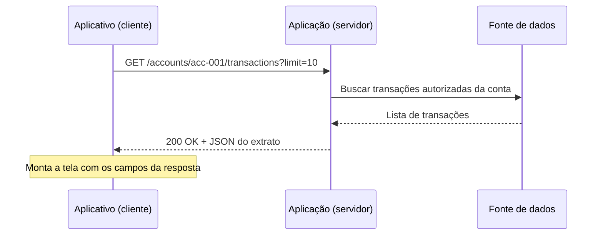
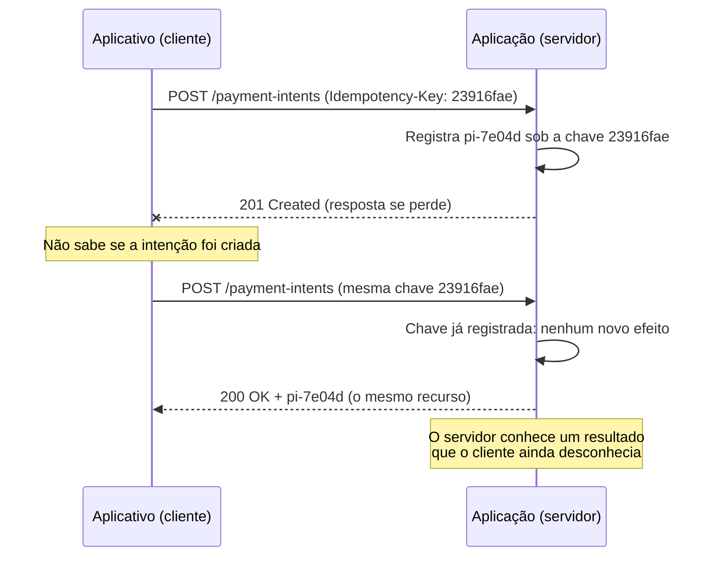

# 02 — HTTP, REST, OpenAPI e borda

**ID:** F02. **Base:** [N05](../../references/README.md#n05) traz APIs e REST; [N01](../../references/README.md#n01) traz URL, web e CloudFront. **Revisão técnica:** 10/10/2026; explicações, exemplos e critérios autorais apoiados nas fontes locais ao final. **Revisão explícita:** a formulação "REST se baseia inteiramente em HTTP" e a leitura de *stateless* como ausência de qualquer dado armazenado foram refinadas. Veja [o registro editorial](../../references/study-notes-revisions.md).

**Objetivo:** sair do zero e conseguir explicar o que acontece quando um aplicativo pede uma informação a um servidor, ler uma requisição e uma resposta, interpretar sucesso e falha, e só então discutir REST, cache, OpenAPI e os produtos AWS da borda.

## Roteiro de leitura

Este módulo é construído em três camadas. Leia na ordem; cada aprofundamento assume que a camada anterior já fez sentido.

**Primeira leitura — entender a conversa.** [Uma conversa entre aplicativo e servidor](#conversa) → [anatomia de uma requisição e resposta](#anatomia) → [JSON sem pressupor programação](#json). Com isso você já explica de onde vem cada informação de uma tela.

**Aplicação — consultar, pedir e interpretar.** [Métodos HTTP](#metodos) → [status e resultado do negócio](#status) → [segundo exemplo: criar uma intenção de pagamento](#pagamento) → [autenticação, autorização e validação](#autorizacao).

**Aprofundamento.** [REST como estilo](#rest) → [OpenAPI como contrato](#openapi) → [cache, CDN e borda](#cache) → [mapeamento em AWS](#aws) → [RPC e gRPC](#sincrona). Termine pelas [perguntas](#perguntas) e pelos [exercícios](#exercicios), sem abrir as respostas.

**Fronteiras.** DNS, TCP e TLS ficam em [F01](01-networking-dns-connectivity.md#protocolos); identidade, OAuth e IAM, em [F03](03-security-identity.md); a implementação da aplicação e o padrão visual dos ícones, em [F04](04-compute-containers.md); identidade da operação, concorrência e resultado desconhecido, em [F06](06-databases-transactions-consistency.md#fronteira-transacao); comunicação assíncrona, em [F07](07-events-messaging-distributed-systems.md#assincrona); gateway e decomposição de serviços, em [SD01](../02-system-design/01-service-architecture.md#api-gateway); fronteira transacional, em [SD03](../02-system-design/03-distributed-workflows.md#transactional-outbox); retries e resiliência, em [SD04](../02-system-design/04-resilience-isolation.md#resiliencia). Aqui ficam a conversa de aplicação e o contrato.

**Como ler as afirmações:** uma regra do protocolo vem com a RFC; um comportamento de produto vem com a documentação AWS; uma escolha dos exemplos é decisão deste material; um número é hipótese didática, não medição. Nenhum recurso AWS foi provisionado e nenhuma API foi executada para este módulo.

## Objetivos de aprendizagem

Ao terminar a primeira leitura, você deve conseguir, sem consulta:

- dizer quem fez um pedido e quem respondeu, a partir de um exemplo;
- ler uma URL e apontar host, caminho e filtros;
- interpretar um JSON de resposta e explicar de onde veio cada campo da tela;
- explicar o que um método e um status informam, e o que ainda não permitem concluir.

Ao terminar o módulo, você deve conseguir também:

- distinguir API, HTTP, JSON e REST, sem tratá-los como sinônimos;
- descrever um contrato de idempotência para um pedido que pode ser repetido;
- separar sucesso de uma consulta, aceitação de uma solicitação e conclusão de uma operação de negócio;
- ler um documento OpenAPI mínimo e dizer o que ele garante e o que não garante;
- decidir se duas solicitações podem compartilhar uma resposta em cache;
- mapear os conceitos para API Gateway, Lambda, ALB e CloudFront, dizendo o que cada um **não** resolve sozinho.

<a id="conversa"></a>
## Primeira leitura: uma conversa entre aplicativo e servidor

**A pessoa abre o aplicativo do banco e toca em "Ver extrato".** A lista de transações aparece na tela em um instante. O que aconteceu entre o toque e a lista?

O aplicativo instalado no celular não guarda, sozinho, o extrato atualizado. Ele precisa **obter** essa informação de outro lugar. Para isso:

1. o aplicativo precisa pedir os dados a quem os mantém;
2. outro software, em algum servidor, recebe esse pedido e o atende;
3. existe uma forma combinada de pedir e de responder, para que os dois se entendam;
4. o aplicativo interpreta a resposta recebida e monta a tela do extrato.

Cada um desses pontos tem um nome técnico. Vamos nomear os papéis antes de escrever qualquer código.

**Cliente.** O software que faz a solicitação. No exemplo, é o aplicativo do banco. "Cliente" aqui é um papel de software; não é necessariamente uma pessoa, e o cliente de uma conversa pode ser o servidor de outra.

**Servidor.** O software que recebe a solicitação e a atende. Não precisa ser imaginado como uma única máquina: por trás de um servidor pode haver vários processos e computadores. O que importa agora é o papel: atender pedidos.

**Frontend.** A parte com a qual a pessoa interage diretamente — as telas, os botões, a lista de transações. No exemplo, o frontend é o aplicativo.

**Backend.** A parte que executa as regras e acessa os dados e as dependências. É o backend que sabe quais são as transações da conta e decide o que pode ser devolvido.

**API.** A interface pela qual um software interage com outro software. Quando o aplicativo pede o extrato ao backend, ele usa uma API: um conjunto de operações combinadas, com um formato definido de pedido e de resposta. Uma API define uma interface e um contrato; ela não é, por si só, um servidor web nem um endereço na internet. Existem APIs de bibliotecas, de sistemas operacionais e de serviços em rede.

Neste módulo, o foco é a **API HTTP**: a forma mais comum de um aplicativo conversar com um backend pela rede, usando o protocolo HTTP. Um protocolo é um conjunto de regras combinadas para a troca de mensagens.

**Pergunta para verificar o entendimento:** no exemplo do extrato, quem é o cliente e quem é o servidor? E o aplicativo é frontend, backend, ou os dois? *(O aplicativo é o cliente e o frontend. O servidor é quem atende o pedido; o backend é a parte que aplica regras e acessa os dados.)*

Usaremos um único exemplo ao longo de toda a primeira leitura, para não trocar de contexto a cada conceito:

```text
GET /accounts/acc-001/transactions?limit=10
```

Todos os identificadores e valores são fictícios. `acc-001` é um número de conta inventado. **Conhecer o identificador de uma conta não autoriza consultá-la:** quem decide o acesso é a autorização do backend, não o fato de a pessoa saber o número. Voltaremos a esse ponto na [seção de autorização](#autorizacao).

<a id="anatomia"></a>
## Anatomia de uma requisição e de uma resposta

Antes de escrever o pedido completo, vamos nomear suas partes usando o exemplo do extrato.

- **URL.** O endereço usado para localizar o que se quer. No navegador, é o que aparece na barra de endereço.
- **Host.** O destino do pedido: qual servidor deve recebê-lo. No endereço `https://api.banco.example/...`, o host é `api.banco.example`.
- **Path (caminho).** A parte da URL que indica qual recurso se quer, depois do host: `/accounts/acc-001/transactions`.
- **Path parameter (parâmetro de caminho).** Uma parte **variável** do caminho. Em `/accounts/acc-001/transactions`, o `acc-001` é um parâmetro de caminho: identifica qual conta. Outra conta teria outro valor no mesmo lugar.
- **Query parameter (parâmetro de consulta).** Um filtro ou opção da consulta, escrito depois de `?`, no formato `nome=valor`. Em `?limit=10`, o `limit=10` pede no máximo dez transações.
- **Método.** A intenção da operação: ler, criar, substituir, remover. No exemplo, o método é `GET`, que significa "leia este recurso". Detalhamos os métodos [adiante](#metodos).
- **Headers (cabeçalhos).** Informações sobre a mensagem ou sobre como tratá-la — por exemplo, em que formato a resposta deve vir, ou quem está pedindo. Não são o conteúdo principal; são metadados da mensagem.
- **Body (corpo), ou payload.** O conteúdo enviado junto com o pedido, quando aplicável. Uma leitura simples como o extrato normalmente não tem corpo; um pedido que cria algo costuma ter.

**Endpoint.** É o ponto de acesso a uma operação da API, identificado pelo endereço e, neste contexto, também pelo método. `GET /accounts/acc-001/transactions` e `POST /accounts/acc-001/transactions` são endpoints diferentes, mesmo compartilhando o caminho, porque a intenção é diferente.

Agora o pedido completo. Vamos escrevê-lo na **representação textual do HTTP/1.1**, porque ela é fácil de ler linha a linha. Essa é uma escolha didática: o HTTP/2 e o HTTP/3 transmitem a mesma informação em um formato binário, não exatamente nestas linhas de texto. As versões do HTTP estão em [F01](01-networking-dns-connectivity.md#protocolos). O que importa aqui é o significado, não os bytes na rede.

```http
GET /accounts/acc-001/transactions?limit=10 HTTP/1.1
Host: api.banco.example
Accept: application/json
Authorization: Bearer <token-de-acesso-do-solicitante>
```

Linha a linha:

- `GET /accounts/acc-001/transactions?limit=10 HTTP/1.1` — o método (`GET`), o caminho com o filtro (`?limit=10`) e a versão do protocolo.
- `Host: api.banco.example` — a quem o pedido se destina.
- `Accept: application/json` — um header que diz "prefiro receber a resposta em JSON" (o formato JSON é explicado [adiante](#json)).
- `Authorization: Bearer <token-de-acesso-do-solicitante>` — um header que apresenta uma credencial de quem está pedindo.

Sobre o `Authorization`: `<token-de-acesso-do-solicitante>` é um **placeholder** — um espaço reservado, não um valor real. Um token é uma credencial que o backend emitiu antes para quem está autenticado; apresentá-lo diz "sou este solicitante autorizado". Nunca coloque um token real em exemplos, logs ou documentos, e nunca o escreva dentro da URL (a URL costuma aparecer em registros e históricos). O propósito do token e seus mecanismos ficam em [F03](03-security-identity.md). Usamos sempre o domínio reservado `example`, próprio para exemplos, nunca o domínio de um banco real.

A **resposta** a esse pedido tem a forma:

```http
HTTP/1.1 200 OK
Content-Type: application/json
Cache-Control: no-store

{
  "accountId": "acc-001",
  "currency": "BRL",
  "transactions": [
    { "id": "txn-9001", "description": "Pagamento recebido", "amountMinor": 50000, "bookedAt": "2026-10-02T13:45:00Z" },
    { "id": "txn-9002", "description": "Compra no cartao",    "amountMinor": -3290, "bookedAt": "2026-10-03T09:12:00Z" }
  ]
}
```

Linha a linha:

- `HTTP/1.1 200 OK` — a versão, o **status code** `200` e sua descrição `OK`. O status informa o resultado da comunicação; detalhamos os status [adiante](#status).
- `Content-Type: application/json` — um header que diz "o corpo desta resposta está em JSON".
- `Cache-Control: no-store` — um header que orienta como (não) reutilizar esta resposta; explicado na [seção de cache](#cache). Para um extrato individual, a escolha deste material é conservadora: não reutilizar.
- a linha em branco separa os headers do corpo;
- o corpo em JSON traz os dados do extrato.

**Pergunta para verificar o entendimento:** nesse pedido, o que é path parameter e o que é query parameter? E se a pessoa quisesse ver vinte transações em vez de dez, o que mudaria? *(O path parameter é `acc-001`; o query parameter é `limit=10`. Para vinte transações, `limit=20`.)*

**Limite importante:** o cliente escolheu `limit=10`, mas o servidor não é obrigado a devolver exatamente dez, nem a aceitar qualquer valor. Um parâmetro na requisição é um **pedido**, não uma garantia; o servidor aplica suas próprias regras e limites.

<a id="json"></a>
## JSON sem pressupor programação

A resposta do extrato veio em **JSON** (JavaScript Object Notation): um formato de texto para representar dados de forma que o programa consiga ler. Antes de olhar o exemplo de novo, os termos:

- **Objeto.** Um conjunto de pares nome-valor, escrito entre `{` e `}`. Representa "uma coisa com várias características".
- **Campo (ou chave).** O nome de uma característica dentro de um objeto, escrito entre aspas: `"accountId"`.
- **Valor.** O conteúdo associado a um campo. Pode ser de vários tipos.
- **String.** Um valor de texto, entre aspas: `"Pagamento recebido"`.
- **Número.** Um valor numérico, sem aspas: `50000`.
- **Booleano.** Um valor verdadeiro ou falso: `true` ou `false`.
- **Lista (ou array).** Uma sequência ordenada de valores, entre `[` e `]`.

Retomando o corpo da resposta, agora com os nomes:

```json
{
  "accountId": "acc-001",
  "currency": "BRL",
  "transactions": [
    { "id": "txn-9001", "description": "Pagamento recebido", "amountMinor": 50000, "bookedAt": "2026-10-02T13:45:00Z" },
    { "id": "txn-9002", "description": "Compra no cartao",    "amountMinor": -3290, "bookedAt": "2026-10-03T09:12:00Z" }
  ]
}
```

Lendo a estrutura: o todo é um **objeto**. Ele tem os campos `accountId` (string), `currency` (string) e `transactions` (uma **lista**). Cada item da lista é outro objeto, com os campos `id`, `description`, `amountMinor` e `bookedAt`.

**Como esses campos virariam a tela.** O aplicativo lê o JSON e usa cada campo para montar a interface: `description` vira o texto de cada linha; `bookedAt` vira a data exibida; `amountMinor` vira o valor em reais. A informação da tela veio inteiramente desta resposta — não foi inventada pelo aplicativo.

**Dinheiro: uma convenção explícita.** O campo chama-se `amountMinor` e está em **centavos inteiros**, com a moeda em um campo separado (`currency`). Então `50000` com `"currency": "BRL"` significa **R$ 500,00** (50000 centavos ÷ 100). O valor `-3290` significa **-R$ 32,90**: o sinal negativo indica uma saída. Guardar dinheiro como centavos inteiros, e não como um número com casas decimais, evita erros de arredondamento típicos de ponto flutuante binário. Esta é uma escolha deste material; a mesma convenção será usada em **todos** os exemplos — request, response e OpenAPI. Não misturaremos reais e centavos entre eles.

**Duas coisas diferentes:** o **HTTP** é a comunicação — como o pedido e a resposta trafegam. O **JSON** é a representação dos dados dentro da mensagem — como as informações são escritas. São camadas distintas: o mesmo HTTP poderia transportar outro formato, e o mesmo JSON poderia aparecer fora do HTTP. Usar JSON não torna uma API "REST", e nem toda API usa JSON; são decisões independentes. REST é discutido [adiante](#rest).

**Pergunta para verificar o entendimento:** no item `txn-9002`, quanto a pessoa gastou, em reais? E se a resposta trouxesse `"amountMinor": 1050`, que valor apareceria na tela? *(R$ 32,90 de saída; e R$ 10,50.)*

<a id="metodos"></a>
## Métodos HTTP: a intenção do pedido

O método é a intenção da operação. Comece por cinco:

| Método | Intenção | Exemplo concreto |
|---|---|---|
| `GET` | Ler um recurso, sem alterá-lo | `GET /accounts/acc-001/transactions` — consultar o extrato |
| `POST` | Criar algo novo ou submeter um pedido de processamento | `POST /payment-intents` — registrar uma intenção de pagamento |
| `PUT` | Substituir por completo um recurso em um endereço conhecido | `PUT /accounts/acc-001/preferences` — substituir todas as preferências da conta |
| `PATCH` | Alterar parte de um recurso | `PATCH /accounts/acc-001/preferences` — mudar só o idioma preferido |
| `DELETE` | Remover um recurso | `DELETE /accounts/acc-001/preferences/alerts` — desligar um alerta configurado |

Cada método tem uma intenção própria; eles não precisam todos caber no mesmo recurso. Um extrato é consultado (`GET`), mas não faz sentido "substituir o extrato" com `PUT`. Dois usos a evitar, por mudarem o significado do que o método comunica:

- **não use `GET` para executar uma transferência.** `GET` significa leitura; usá-lo para mover dinheiro quebra essa expectativa e pode ser disparado por qualquer coisa que apenas "abra" o endereço.
- **não trate `DELETE` de um pagamento concluído como se apagasse o passado financeiro.** Um pagamento que já ocorreu é um fato; cancelar ou estornar é uma nova operação de negócio, não o apagamento do histórico.

Depois de entender as intenções, duas propriedades que a especificação do HTTP atribui aos métodos:

- **Safe (seguro).** Um método é "safe" quando sua semântica é apenas de leitura: não se espera que ele altere o estado no servidor. `GET` e `HEAD` são safe. **Atenção ao nome:** "safe" aqui é uma propriedade *semântica* — "este método é para ler" — e **não** uma afirmação de segurança contra ataques. Um `GET` ainda precisa de autorização.
- **Idempotent (idempotente).** Um método é idempotente quando o **efeito pretendido** de repetir o mesmo pedido é o mesmo de fazê-lo uma única vez. A especificação lista como idempotentes os métodos safe, além de `PUT` e `DELETE`; `POST` e `PATCH` **não** são garantidos idempotentes. [Fonte T02](../../references/README.md#t02)

Idempotência é definida pelo **efeito**, não pela resposta ser idêntica byte a byte. Repetir um `DELETE` pode retornar `204` na primeira vez e `404` na segunda (já não há o que remover); mesmo assim o efeito no servidor é o mesmo — o recurso não existe. Isso continua idempotente.

Alguns cuidados, para não transformar a propriedade em regra mágica:

- um `POST` financeiro **pode** receber uma proteção de idempotência construída pela aplicação (veremos como na [seção de pagamento](#pagamento)); dizer que "`POST` nunca pode ser idempotente" é falso;
- `PATCH` **não** é sempre idempotente: depende da operação que ele descreve. "Some R$ 10 ao limite" repetido muda o resultado; "defina o idioma como pt-BR" repetido, não;
- usar `PUT` **não** resolve, sozinho, concorrência nem autorização. A propriedade do método é uma coisa; proteger contra dois pedidos simultâneos e decidir quem pode fazer o quê são outras, tratadas em [F06](06-databases-transactions-consistency.md#fronteira-transacao) e [F03](03-security-identity.md).

<details>
<summary>Aprofundamento: HEAD e OPTIONS</summary>

- **`HEAD`** pede os mesmos headers de um `GET`, mas sem o corpo. Serve para checar metadados — por exemplo, se um recurso existe ou mudou — sem transferir o conteúdo. É safe e idempotente.
- **`OPTIONS`** pergunta quais operações ou condições se aplicam a um recurso. Aparece com frequência no mecanismo de *preflight* do navegador, citado na [seção de autorização](#autorizacao).

</details>

**Pergunta para verificar o entendimento:** por que consultar o extrato com `GET` pode ser repetido à vontade, mas registrar um pagamento com `POST` exige cuidado ao repetir? *(`GET` é safe e idempotente: ler de novo não cria efeito. `POST` não é garantido idempotente: repetir sem proteção pode criar um segundo registro.)*

<a id="status"></a>
## Status HTTP e o resultado do negócio

Toda resposta HTTP traz um **status code**: um número de três dígitos que resume o resultado da comunicação. O primeiro dígito indica a classe:

- **2xx — sucesso.** O pedido foi recebido e tratado como esperado.
- **3xx — redirecionamento ou condição de cache.** O cliente precisa de um passo adicional (por exemplo, usar uma cópia já em cache).
- **4xx — erro atribuído ao pedido.** Algo no que o cliente enviou impede o atendimento (dados inválidos, falta de autorização, recurso inexistente).
- **5xx — erro atribuído ao servidor ou a uma dependência.** O pedido pode estar correto, mas o servidor não conseguiu atendê-lo.

Em vez de um catálogo exaustivo, veja os códigos mais relevantes, agrupados pelo que informam. Para cada um: o que a resposta informa, o que ela **ainda não** permite concluir, e qual seria o próximo passo do cliente.

| Código | O que informa | O que não permite concluir | Próximo passo típico |
|---|---|---|---|
| `200 OK` | A consulta foi atendida; o corpo traz o resultado | Que o conteúdo do corpo seja um resultado de negócio favorável | Ler o corpo e interpretar |
| `201 Created` | Um recurso novo foi criado | Que a operação de negócio associada já terminou | Guardar o identificador do recurso criado |
| `202 Accepted` | O pedido foi aceito para processamento | Que a operação já foi concluída | Acompanhar o resultado pela referência |
| `204 No Content` | Atendido, sem corpo a devolver | — | Seguir; não esperar corpo |
| `400 Bad Request` | O pedido está malformado ou inválido | Qual regra de negócio falhou | Corrigir o pedido antes de repetir |
| `401 Unauthorized` | Falta autenticação válida | Que a identidade exista ou não | Autenticar e repetir |
| `403 Forbidden` | Autenticado, mas sem permissão para isto | Que o recurso exista | Não repetir igual; rever a autorização |
| `404 Not Found` | O recurso não foi encontrado neste endereço | Se nunca existiu ou foi removido | Verificar o endereço |
| `409 Conflict` | O pedido conflita com o estado atual | A causa exata do conflito | Reler o estado e reavaliar |
| `429 Too Many Requests` | O cliente excedeu um limite de taxa | — | Esperar e repetir com moderação |
| `500 Internal Server Error` | Falha interna do servidor | Se o efeito pretendido ocorreu ou não | Tratar como resultado desconhecido |
| `502 Bad Gateway` | Um intermediário recebeu resposta inválida da origem | Se o pedido chegou à aplicação | Repetir com cautela, se for seguro |
| `503 Service Unavailable` | O serviço está indisponível no momento | Por quanto tempo | Esperar e repetir, se for seguro |
| `504 Gateway Timeout` | Um intermediário não recebeu resposta a tempo | Se o efeito ocorreu | Tratar como resultado desconhecido |

O código `304 Not Modified` aparece junto da [explicação de cache](#cache), por pertencer a esse mecanismo. Outros códigos entram apenas se um exemplo precisar deles.

Um status resume o resultado da comunicação; ele **não é um diagnóstico completo da causa**. Um `500` diz "falhou aqui dentro", não *por que* falhou. É por isso que precisamos separar quatro coisas que costumam ser confundidas:

| Camada | Pergunta que responde | Exemplo |
|---|---|---|
| Sucesso de uma consulta | A leitura foi atendida? | `200` ao consultar o status de um pagamento |
| Aceitação de uma solicitação | O pedido foi recebido para processar? | `202` ao submeter uma intenção de pagamento |
| Conclusão de uma operação de negócio | O efeito financeiro realmente ocorreu? | O pagamento foi efetivado, confirmado pela autoridade |
| Falha técnica | A comunicação ou o servidor falharam? | `500`, `503`, `504` |

Três consequências dessa separação, que são escolhas de contrato deste material e não convenções universais:

- **consultar com sucesso uma operação recusada retorna `200`.** Se você pergunta "qual o status do pagamento X?" e a resposta é "recusado", a **consulta** foi um sucesso: `200`. O corpo diz que o pagamento foi recusado. O status HTTP descreve a comunicação; o resultado do negócio está no corpo. Não é `4xx`: o pedido de leitura foi atendido.
- **receber `202 Accepted` não comprova pagamento efetivado.** `202` diz "aceitei processar", não "concluí". A conclusão precisa ser confirmada depois, pela autoridade do negócio.
- **receber um timeout não comprova rollback.** Um `504` ou um timeout de conexão significa "não recebi resposta a tempo". O efeito pode ter ocorrido no servidor mesmo assim. Tratar timeout como "nada aconteceu" é um erro clássico; o correto é tratá-lo como **resultado desconhecido** e consultar pela mesma referência. Esse ponto é a fronteira com [F06](06-databases-transactions-consistency.md#fronteira-transacao): só a autoridade sabe o resultado.

Convenções de código variam entre APIs. Uma API pode usar `422` para erro de validação; outra, `400`. Não apresente a convenção de uma API como obrigação universal; descubra o contrato de cada uma.

**Pergunta para verificar o entendimento:** o cliente pediu um pagamento e recebeu `202`. Pode dizer à pessoa "pagamento concluído"? E se recebesse um timeout, poderia dizer "nada foi cobrado"? *(Não e não. `202` é aceitação, não conclusão; timeout é resultado desconhecido, não prova de que nada ocorreu.)*

### A conversa da consulta, em um desenho

O diagrama resume a consulta do extrato. O foco é a conversa de aplicação; DNS, TCP e TLS, que ficam antes, estão em [F01](01-networking-dns-connectivity.md#protocolos) e não são repetidos aqui.



**Pergunta oral para o desenho:** se a fonte de dados demorasse e a aplicação respondesse `504`, o aplicativo poderia afirmar que a conta não tem transações? *(Não: `504` é falha ao obter resposta a tempo, não uma afirmação sobre o conteúdo da conta.)*

<a id="pagamento"></a>
## Segundo exemplo: criar uma intenção de pagamento

A consulta já faz sentido. Agora um pedido que **cria** algo e que, por isso, exige cuidado ao repetir. Este exemplo mantém a autoridade financeira do [Case 01](../../cases/01-payment-processing-pix.md): registrar uma intenção **não** é efetivar a transferência. Não implementamos aqui ledger, saga nem outbox — esses mecanismos ficam em [SD03](../02-system-design/03-distributed-workflows.md#transactional-outbox); aqui tratamos apenas do contrato HTTP e da recuperação de uma resposta perdida.

Três identificadores aparecem, com papéis diferentes. Não os trate como equivalentes:

- **a intenção do cliente** — o que a pessoa quer fazer: pagar R$ 500,00 ao pedido `order-8421`. É o conteúdo do pedido.
- **a chave de idempotência** — um identificador que o cliente escolhe para *este envio*, de modo que, se ele precisar repetir, o servidor reconheça que é o mesmo pedido e não crie um segundo efeito. Vai em um header.
- **o recurso criado no servidor** — a `payment-intent` que o servidor registra, com um identificador próprio (`pi-7e04d`), devolvido na resposta.

O pedido:

```http
POST /payment-intents HTTP/1.1
Host: api.banco.example
Content-Type: application/json
Idempotency-Key: 23916fae-52a7-4280-9450-8816e38f8760
Authorization: Bearer <token-de-acesso-do-solicitante>

{
  "orderId": "order-8421",
  "amountMinor": 50000,
  "currency": "BRL"
}
```

- `POST /payment-intents` — a intenção: criar uma intenção de pagamento;
- `Idempotency-Key: 23916fae-...` — a chave de idempotência deste envio;
- o corpo em JSON — a intenção do cliente: `50000` centavos (R$ 500,00) para o pedido `order-8421`, em `BRL`. Mesma convenção de centavos da consulta.

A resposta esperada, quando tudo ocorre bem:

```http
HTTP/1.1 201 Created
Content-Type: application/json
Location: /payment-intents/pi-7e04d

{
  "paymentIntentId": "pi-7e04d",
  "status": "REQUIRES_CONFIRMATION",
  "orderId": "order-8421",
  "amountMinor": 50000,
  "currency": "BRL"
}
```

O `201 Created` informa que o recurso `pi-7e04d` foi registrado; o header `Location` indica onde consultá-lo. O campo `status` é de negócio: `REQUIRES_CONFIRMATION` significa que a intenção existe, mas a transferência **ainda não foi efetivada**. Registrar a intenção não movimenta dinheiro.

### Quando a resposta se perde

Agora o caso que torna a idempotência necessária. Suponha a sequência:

1. o cliente envia o `POST` acima, com a chave `23916fae-...`;
2. o servidor **registra** a intenção `pi-7e04d` e prepara o `201`;
3. a **resposta se perde** no caminho de volta (a conexão caiu, houve timeout);
4. o cliente fica **sem saber o resultado**: a intenção foi criada ou não?
5. o cliente **repete** o mesmo `POST`, com a **mesma** chave de idempotência.

É no passo 5 que o contrato de idempotência age. Como a chave `23916fae-...` já está registrada e associada a `pi-7e04d`, o servidor **não cria uma segunda intenção**: ele reconhece a repetição e devolve a mesma `pi-7e04d` que havia criado — tipicamente com `200 OK` (recurso já existente), em vez de um novo `201`. O cliente recupera o resultado perdido sem duplicar o efeito.



**Pergunta oral para o desenho:** no momento entre o passo 3 e o passo 5, quem sabe que `pi-7e04d` existe — o cliente, o servidor, ou os dois? *(Só o servidor. O cliente ainda não sabe; por isso a repetição com a mesma chave é segura e necessária.)*

### O contrato de idempotência

A chave em um header **não cria** a garantia sozinha. A garantia vem de um contrato que o servidor implementa e documenta. Os pontos que esse contrato precisa definir:

- **escopo da chave** — a chave é única para quê? Em geral, por solicitante e por operação. A mesma string vinda de outro cliente não deve colidir com a sua.
- **comparação da intenção** — ao receber uma chave repetida, o servidor compara o conteúdo do novo pedido com o do original (por exemplo, por um hash dos campos relevantes).
- **repetição compatível** — se a chave repete e os dados batem, devolve-se o recurso já criado, sem novo efeito.
- **mesma chave com dados diferentes** — se a chave repete mas os dados divergem (outro valor, outra moeda), isso é um conflito: responder `409`, nunca alterar silenciosamente a intenção original.
- **retenção / janela** — por quanto tempo a chave é lembrada. Repetições depois dessa janela podem não ser mais reconhecidas; o contrato precisa dizer qual é a janela.

Idempotência (repetir o mesmo pedido sem duplicar efeito) **não é o mesmo que** concorrência (dois pedidos *diferentes* chegando ao mesmo tempo e disputando um recurso). O contrato de idempotência protege a repetição de um pedido; proteger contra pedidos concorrentes distintos é outro problema, tratado em [F06](06-databases-transactions-consistency.md#fronteira-transacao).

### Repetir não é repetir cegamente

Quando o cliente decide repetir após uma falha, alguns termos precisam estar claros **antes** de usá-los:

- **timeout** — o tempo máximo que o cliente espera por uma resposta antes de desistir daquela tentativa;
- **prazo (deadline)** — o tempo total que a jornada toda pode levar, somando as tentativas;
- **backoff** — aumentar a espera entre tentativas sucessivas, em vez de repetir imediatamente;
- **jitter** — adicionar uma variação aleatória a essa espera, para que muitos clientes não repitam todos no mesmo instante.

Com esses termos: ao repetir, limite o **número de tentativas**, use backoff com jitter e respeite o prazo total. E não repita cegamente: **não** se deve repetir automaticamente todo `POST` nem toda resposta `5xx`. Repetir só é seguro quando há um contrato de idempotência (como a chave acima) ou quando o método já é idempotente por natureza. A estratégia de retry em profundidade está em [SD04](../02-system-design/04-resilience-isolation.md#resiliencia); a comunicação assíncrona como alternativa à espera, em [F07](07-events-messaging-distributed-systems.md#assincrona).

**Pergunta para verificar o entendimento:** o cliente repetiu o `POST` com a mesma chave e os mesmos dados, e recebeu `200` com `pi-7e04d`. Foram criadas duas intenções? E se ele repetisse a mesma chave com `amountMinor` diferente? *(Uma só intenção; o `200` devolve a existente. Com dados diferentes sob a mesma chave, o servidor deve responder `409`, sem alterar a original.)*

<a id="autorizacao"></a>
## Autenticação, autorização e validação

Três perguntas distintas acompanham todo pedido que mexe com dados sensíveis:

1. **Quem está fazendo o pedido?** — isto é **autenticação**: provar a identidade. É o papel do token no header `Authorization`.
2. **Essa identidade pode executar esta ação nesta conta?** — isto é **autorização**: decidir se o sujeito autenticado tem permissão para aquele recurso específico.
3. **Os dados recebidos respeitam o contrato e as regras pertinentes?** — isto é **validação**: conferir a estrutura e as regras de negócio do que foi enviado.

As três são diferentes, e a confusão entre elas causa falhas graves. Um exemplo concreto: a pessoa está autenticada e consulta a própria conta com `GET /accounts/acc-001/transactions`. Em seguida, troca o identificador na URL:

```text
GET /accounts/acc-777/transactions
```

`acc-777` é a conta de **outra pessoa**. O token continua válido — a autenticação (pergunta 1) passou. Mas a **autorização** (pergunta 2) deve falhar: esta identidade não pode ler aquela conta. A resposta correta é `403 Forbidden` (ou `404`, para não revelar que a conta existe). O erro a evitar é a redução perigosa:

> token válido → acesso permitido a qualquer recurso

Isso é falso. Um token válido responde "quem é"; não responde "pode ver esta conta". Conhecer o identificador `acc-777` **não** autoriza nada. A decisão de acesso por objeto é obrigatória no backend, e é o tema central do [Case 02](../../cases/02-open-finance-apis.md); o cenário de diagnóstico correspondente está em [F03](03-security-identity.md).

**Validar estrutura não é validar regra de negócio.** Um corpo pode ser um JSON perfeitamente bem formado — `{ "amountMinor": 999999999, "currency": "BRL" }` — e ainda assim ser inaceitável: o valor pode exceder um limite, ou a conta pode não ter saldo. Um JSON válido prova apenas que a *estrutura* está correta; não prova valor permitido nem saldo suficiente. A validação de estrutura e a validação de regra de negócio são passos separados.

Sobre `401` e `403`: a diferença usual é "`401` = falta autenticar; `403` = autenticado, mas sem permissão". Útil como referência, mas o uso exato varia entre implementações; não trate cada código como prova infalível do estado da autenticação em toda API. Observe o contrato de cada serviço.

Este módulo não aprofunda OAuth, OpenID Connect, IAM nem criptografia; esses mecanismos ficam em [F03](03-security-identity.md).

<details>
<summary>Aprofundamento: CORS é comportamento de navegador, não autorização da API</summary>

Em páginas web, o navegador aplica regras de **CORS** (Cross-Origin Resource Sharing) quando um site em uma origem tenta chamar uma API em outra origem. O navegador pode fazer uma requisição de verificação prévia (*preflight*, com `OPTIONS`) e decidir se permite o código da página ler a resposta.

CORS é uma proteção **do navegador entre origens**, aplicada no lado do cliente. Não é o mecanismo de autorização da sua API, nem um bloqueio universal de clientes: um cliente que não seja navegador (um backend, uma ferramenta de linha de comando) não é limitado por CORS. A autorização de negócio precisa acontecer no servidor, independentemente de CORS.

</details>

**Pergunta para verificar o entendimento:** a pessoa está autenticada e o JSON que ela enviou está bem formado. Isso basta para processar uma transferência de R$ 9.999.999,99? *(Não. Falta autorizar a ação naquela conta e validar a regra de negócio — limite, saldo. Autenticação e estrutura válida não cobrem autorização nem regra.)*

<a id="rest"></a>
## Aprofundamento: REST depois que o HTTP já fez sentido

Agora que a conversa HTTP e o JSON fazem sentido, dá para falar de REST sem embaralhar os conceitos. Primeiro, a distinção que mais confunde:

- **API** é a interface/contrato entre softwares.
- **HTTP** é o protocolo de comunicação usado.
- **JSON** é um formato de representação dos dados.
- **REST** é um **estilo arquitetural**: um conjunto de restrições sobre como organizar a interação.

REST não é um produto, uma biblioteca nem um sinônimo de CRUD (as operações criar-ler-atualizar-remover). É um modelo descrito por Roy Fielding. [Fonte T01](../../references/README.md#t01)

Dois conceitos centrais do estilo, usando o extrato já conhecido:

- **Recurso.** Uma coisa com identidade sobre a qual se opera: a conta `acc-001`, o extrato dela, a intenção `pi-7e04d`. O recurso é o conceito; a URI o identifica.
- **Representação.** A forma concreta devolvida de um recurso em um momento — por exemplo, o JSON do extrato. O mesmo recurso poderia ter outras representações.

Uma **URI** identifica um recurso. Importante: `/accounts/acc-001/transactions` **não** precisa corresponder a uma tabela do banco chamada "transactions". A URI nomeia um recurso de negócio; como ele é armazenado é decisão interna do servidor, invisível para o cliente.

**Stateless (sem estado de conversa).** É a restrição mais mal compreendida. Contraste dois jeitos de o servidor interpretar um pedido:

- **A — depende de uma conversa anterior.** "Mostre a próxima página" só faz sentido se o servidor estiver guardando, de forma implícita, em que página aquele cliente parou. O pedido, isolado, é incompreensível.
- **B — traz o contexto necessário.** "Mostre as transações da conta `acc-001`, dez por vez, a partir deste ponto" carrega tudo o que o servidor precisa para interpretá-lo, sem depender de uma sessão de conversa guardada entre requisições.

Stateless é o estilo B: cada requisição traz o contexto para ser entendida, sem depender de uma sessão de conversa mantida implicitamente pelo servidor entre chamadas. Isso **não proíbe** bancos de dados, registros persistentes nem estado de negócio: uma conta continua existindo e sendo gravada. Uma conta persistida não é a mesma coisa que uma sessão HTTP implícita. E atenção: mover a sessão para outro armazenamento (um cache, um banco) **não torna**, por si só, a interação REST stateless — o que caracteriza stateless é a requisição não depender de contexto de conversa implícito, não onde a sessão é guardada.

As restrições do estilo REST, em linguagem acessível:

- **cliente-servidor** — separar quem pede de quem atende, com responsabilidades distintas;
- **stateless** — cada requisição traz o contexto necessário, como acima;
- **cache** — respostas podem ser marcadas como reutilizáveis quando apropriado (tema da [seção de cache](#cache));
- **interface uniforme** — uma forma consistente de identificar e manipular recursos;
- **sistema em camadas** — pode haver intermediários (proxies, caches) entre cliente e servidor;
- **código sob demanda** — opcional; o servidor pode enviar código executável ao cliente.

<details>
<summary>Aprofundamento: interface uniforme e hipermídia (HATEOAS)</summary>

A **interface uniforme** inclui, no modelo formal, que as representações carreguem *links* para as próximas ações possíveis — o cliente descobre o que pode fazer a seguir a partir da própria resposta, em vez de ter os endereços embutidos de antemão. Esse aspecto é chamado de **hipermídia** ou HATEOAS. Faz parte do modelo de Fielding, ainda que muitas APIs chamadas de "REST" não o implementem. [Fonte T01](../../references/README.md#t01)

</details>

**Cuidado com uma afirmação comum:** usar métodos HTTP e devolver JSON **não** prova, sozinho, que uma API cumpre integralmente REST. Os exemplos deste módulo usam HTTP e JSON e seguem várias dessas restrições, mas não afirmamos que satisfazem cada aspecto do modelo formal — a hipermídia, por exemplo, não está nos exemplos.

**Pergunta para verificar o entendimento:** o pedido "mostre a próxima página do extrato", sem dizer de qual conta nem de onde continuar, é compatível com stateless? Como torná-lo compatível? *(Não, pois depende de contexto implícito. Torna-se compatível incluindo a conta e o ponto de continuação na própria requisição.)*

<a id="openapi"></a>
## Aprofundamento: OpenAPI como contrato legível

Até aqui, combinamos **verbalmente** como pedir e como responder: "faça `GET` neste caminho, receba este JSON". **OpenAPI** permite registrar essa descrição de forma estruturada, em um arquivo que pessoas e ferramentas conseguem ler. Usamos a versão **3.1.1** como referência didática — não a chamamos de "mais recente", apenas de referência fixada deste material. [Fonte T03](../../references/README.md#t03)

O arquivo costuma ser escrito em **YAML**, um formato de texto para dados estruturados em que a **indentação (os espaços no início da linha) define o aninhamento**: o que está mais recuado pertence ao item acima. Diferente do JSON, o YAML não usa chaves para delimitar; ele usa os espaços. Por isso, no YAML, espaços errados mudam o significado.

Um exemplo mínimo completo, descrevendo a **consulta de extrato** que já conhecemos:

```yaml
openapi: 3.1.1
info:
  title: API de Extrato (exemplo)
  version: "1.0.0"
paths:
  /accounts/{accountId}/transactions:
    get:
      summary: Lista as transações de uma conta
      security:
        - bearerAuth: []
      parameters:
        - name: accountId
          in: path
          required: true
          schema:
            type: string
      responses:
        "200":
          description: Extrato da conta
          content:
            application/json:
              schema:
                type: object
                properties:
                  accountId:
                    type: string
                  currency:
                    type: string
                  transactions:
                    type: array
                    items:
                      type: object
                      properties:
                        id:          { type: string }
                        description: { type: string }
                        amountMinor: { type: integer }
                        bookedAt:    { type: string, format: date-time }
components:
  securitySchemes:
    bearerAuth:
      type: http
      scheme: bearer
```

Bloco a bloco:

- `openapi: 3.1.1` — a versão da especificação usada;
- `info` — metadados do documento: título e versão da API;
- `paths` — os caminhos descritos. Aqui, um só: `/accounts/{accountId}/transactions`. As chaves `{accountId}` marcam o parâmetro de caminho;
- `get` — a operação de leitura nesse caminho;
- `security` — declara que a operação exige o esquema `bearerAuth` (o token do header `Authorization`);
- `parameters` — o parâmetro `accountId`, em `path`, com `required: true` (obrigatório) e tipo string;
- `responses` — as respostas descritas; aqui, a `200`, com o corpo em JSON;
- **`schema`** — a descrição da forma dos dados: um objeto com `accountId`, `currency` e uma lista `transactions`, cada item com seus campos. Note `amountMinor` como `integer`: a mesma convenção de centavos inteiros dos exemplos anteriores;
- `components` → `securitySchemes` — a definição do esquema de segurança referenciado em `security`.

Esse documento **corresponde** ao request e à response da primeira leitura: mesmo caminho, mesmo parâmetro, mesmos campos, mesma convenção de valor. Um documento OpenAPI precisa conter ao menos um entre `paths`, `components` ou `webhooks`; o exemplo tem os três primeiros blocos essenciais. [Fonte T03](../../references/README.md#t03)

O que uma descrição OpenAPI **é** e o que **não é**:

- **descrição não é implementação** — o arquivo diz como a API *deveria* se comportar; não faz o servidor se comportar assim;
- **schema não implementa autorização** — declarar `security: bearerAuth` documenta que há autenticação; não aplica a decisão de acesso. A autorização por objeto (quem pode ver `acc-777`) continua sendo trabalho do backend;
- **o contrato documentado pode divergir do servidor** — o documento e o código podem estar fora de sincronia;
- **é necessário verificar o comportamento real** — testar o servidor, não confiar só no papel.

Sobre evolução do contrato, com uma premissa explícita sobre os **consumidores** (os clientes que já usam a API):

- **mudança compatível** — acrescentar um campo *opcional* na resposta, por exemplo `merchant`. Consumidores que ignoram campos desconhecidos continuam funcionando. A premissa é justamente que os consumidores toleram campos extras.
- **mudança incompatível** — renomear `amountMinor` para `amount`, ou torná-lo obrigatório no pedido. Consumidores que esperam o nome antigo quebram. Esse tipo de mudança costuma exigir uma nova versão da API.

<details>
<summary>Aprofundamento: paginação como contrato</summary>

A consulta do extrato usa `limit` para pedir até N itens. Para percorrer páginas, o contrato precisa definir como continuar — por exemplo, devolver um `nextCursor` que o cliente envia na próxima requisição. Isso mantém o pedido stateless: o ponto de continuação viaja na requisição, não em uma sessão guardada. Projetar paginação em profundidade é assunto de design de APIs; aqui basta entender que é parte do contrato.

</details>

**Não** prometa importar este documento diretamente no API Gateway e obter a API pronta: a compatibilidade de ferramenta e de versão precisa ser verificada à parte, e não a testamos aqui.

**Pergunta para verificar o entendimento:** acrescentar um campo opcional `merchant` à resposta é mudança compatível ou incompatível, supondo que os consumidores ignoram campos que não conhecem? E renomear `amountMinor`? *(Compatível a primeira, sob essa premissa; incompatível a segunda.)*

<a id="cache"></a>
## Aprofundamento: cache, CDN e borda

**Cache** é reutilizar uma resposta armazenada quando isso é permitido, em vez de pedir tudo de novo à origem. É o que torna uma página rápida na segunda visita. Os termos:

- **cache hit** — a resposta pedida já está no cache e pode ser reutilizada;
- **cache miss** — não está; é preciso buscar na origem;
- **origem** — o servidor que produz a resposta quando o cache não a tem;
- **expiração / TTL (time to live)** — por quanto tempo uma resposta em cache é considerada válida;
- **cache privado** — guardado para um único usuário (por exemplo, no navegador dele);
- **cache compartilhado** — guardado por um intermediário que serve vários usuários;
- **CDN (content delivery network)** — uma rede de servidores de cache distribuídos geograficamente, para servir conteúdo perto de quem pede;
- **edge / borda** — os pontos da CDN próximos dos usuários, onde o conteúdo é servido.

Contraste dois conteúdos para ver quando o cache ajuda e quando é perigoso:

- **A — arquivo público estático.** O logotipo do banco, um script da página. É igual para todos e muda raramente. Cachear na borda é ótimo: muitos usuários recebem a mesma cópia, rápido.
- **B — extrato individual autenticado.** O `GET /accounts/acc-001/transactions` da pessoa. É específico de um usuário e sensível. Reutilizar essa resposta para outra pessoa seria um vazamento.

A pergunta a fazer sempre: **"essas duas solicitações podem receber a mesma resposta?"** Para o arquivo público, sim. Para o extrato individual, não — a resposta de `acc-001` jamais pode servir a quem pediu `acc-777`.

É aqui que entra a **chave de cache**: o conjunto de elementos da requisição que decide se duas solicitações compartilham uma entrada no cache. Se a chave considerar apenas o caminho `/accounts/acc-001/transactions`, duas pessoas diferentes pedindo "o meu extrato" poderiam colidir se o caminho fosse o mesmo. Variar a chave por usuário (ou nunca cachear conteúdo individual em cache compartilhado) **separa** as variantes. Mas atenção: separar variantes de cache **não substitui autorização** — mesmo com chaves distintas, cada pedido ainda precisa passar pela decisão de acesso do backend.

Os controles de cache no HTTP, pelos headers:

- **`Cache-Control`** — o header que carrega as diretivas abaixo;
- **`max-age=N`** — a resposta pode ser reutilizada por N segundos;
- **`private`** — a resposta pode ser guardada em cache *privado* (o do próprio usuário), mas não em cache compartilhado;
- **`no-cache`** — pode ser armazenada, mas precisa ser *revalidada* com a origem antes de reutilizar. **Não** significa "proibido armazenar";
- **`no-store`** — não armazenar em lugar nenhum. É o mais restritivo;
- **`ETag`** — um identificador de versão de uma resposta. O cliente guarda o ETag e, na próxima vez, pergunta "ainda é esta versão?";
- **revalidação e `304 Not Modified`** — se o conteúdo não mudou, a origem responde `304` (sem corpo) e o cliente reutiliza a cópia que já tinha. Economiza transferência.

Dois erros de leitura a evitar:

- **`no-cache` não é proibição absoluta de armazenamento** — ele permite guardar, exigindo revalidação. Quem proíbe guardar é `no-store`;
- **`private` não é criptografia** — ele diz "não guarde em cache compartilhado", não "isto está cifrado". E **`ETag` não é autorização** — é um identificador de versão, não uma credencial de acesso.

Para o extrato individual, a política conservadora deste material é **não reutilizar em cache compartilhado**: por isso a resposta da primeira leitura trazia `Cache-Control: no-store`.

<details>
<summary>Aprofundamento: comportamento efetivo no Amazon CloudFront</summary>

O **Amazon CloudFront** é a CDN da AWS. Ao configurá-lo, confirme as **políticas efetivas de cache**, porque o comportamento não depende apenas do header que a origem envia:

- um único header não garante, sozinho, o comportamento: a *cache policy* da distribuição também pesa;
- com **Minimum TTL** maior que zero, o CloudFront pode manter o conteúdo em cache por pelo menos essa duração **mesmo que** a origem envie `Cache-Control: no-cache`, `no-store` ou `private`. Em outras palavras, um Minimum TTL mal escolhido pode fazer um conteúdo individual permanecer em cache contra a intenção da origem; [Fonte T28](../../references/README.md#t28);
- a **chave de cache** e o que é **encaminhado à origem** são configurações diferentes: encaminhar um header à origem **não** o inclui automaticamente na chave de cache. Para variar o cache por aquele header, é preciso incluí-lo na chave explicitamente.

Esses detalhes de configuração ficam recolhidos de propósito: a decisão de produto exige verificação. Nenhuma distribuição foi criada para este material.

</details>

**Pergunta para verificar o entendimento:** por que o logotipo do banco pode ser cacheado na borda, mas o extrato individual, não? E se a origem envia `no-store`, mas o CloudFront tem Minimum TTL de 60 segundos, o que pode acontecer? *(O logotipo é público e igual para todos; o extrato é individual e sensível. Com Minimum TTL > 0, o conteúdo pode ficar em cache por ao menos esse tempo, apesar do `no-store` — por isso é preciso conferir a política efetiva.)*

<a id="aws"></a>
## Aprofundamento: mapeamento em AWS

Só agora, depois dos conceitos, os produtos. O aprendizado não depende de reconhecer um ícone: os nomes dos serviços estão em texto, e os ícones apenas acompanham. A tabela liga cada conceito a um serviço, ao seu papel e ao que ele **não** resolve sozinho.

| Conceito | Serviço | Papel | O que não resolve sozinho |
|---|---|---|---|
| Ponto de entrada da API |  Amazon API Gateway | Recebe as requisições, aplica contrato de entrada, autenticação configurada e limites de taxa | Autorização de negócio por objeto ("este token pode ver `acc-777`?") |
| Execução da lógica |  AWS Lambda | Executa o código que atende a operação, por invocação | Estado entre requisições; limites de duração e payload |
| Distribuição de tráfego |  Application Load Balancer | Distribui requisições HTTP entre destinos saudáveis, com roteamento de camada 7 | Governança da API por cliente e rota; autorização de negócio |
| Cache e borda |  Amazon CloudFront | CDN que serve conteúdo de pontos próximos ao usuário | Segurança da reutilização de respostas individuais; política de cache correta |

A diferença entre **API Gateway** e **load balancer**: o balanceador distribui tráfego entre instâncias de um serviço; o gateway governa a API como produto — por cliente, rota, versão, com limites e validação. Os dois costumam aparecer juntos. Essa decomposição é aprofundada em [SD01](../02-system-design/01-service-architecture.md#api-gateway).

Uma **implementação hipotética** do caminho da consulta de extrato, sem provisionar nada:

```text
cliente  ──HTTPS──▶  Amazon API Gateway  ──▶  função AWS Lambda  ──▶  fonte de dados
```

Premissas e escolhas desta hipótese, declaradas:

- a modalidade de API Gateway pressuposta aqui é a **HTTP API** (mais simples e econômica), adequada a esta consulta. O API Gateway oferece ainda **REST API** (mais recursos, como planos de uso) e **WebSocket API**; os recursos e configurações **não** são intercambiáveis entre as três. Os cases usam REST API por recursos específicos — veja [Case 01](../../cases/01-payment-processing-pix.md) e [Case 02](../../cases/02-open-finance-apis.md);
- a função Lambda executa a leitura e devolve o JSON; o estado persiste na fonte de dados, não na função;
- a autenticação de entrada é configurada no gateway, mas a **autorização por objeto** continua na aplicação.

**Não** afirme que API Gateway, ALB e CloudFront são etapas obrigatórias de toda API. Cada um entra quando um requisito o justifica — governança de API, distribuição de tráfego, cache na borda. Uma API simples pode dispensar vários deles.

Sobre os ícones: são do pacote oficial **AWS Architecture Icons**. Reutilizamos os ícones de Lambda e ALB já presentes no repositório (os mesmos de [F04](04-compute-containers.md)); acrescentamos apenas os de API Gateway e CloudFront, copiados sem alteração gráfica do pacote oficial (release `Icon-package_07312026`) e conferidos por hash contra o arquivo original. Estão em 24 px, com o nome do serviço em texto ao lado e `alt=""` por serem decorativos e redundantes com o texto. Não há hotlink, recoloração nem o pacote inteiro no repositório. [Fonte][f02-icons]

<a id="sincrona"></a>
## Aprofundamento: REST, RPC e gRPC

Na comunicação **síncrona**, quem chama espera a resposta daquela operação antes de prosseguir. Isso simplifica o raciocínio, mas cria **acoplamento temporal**: se o serviço chamado está lento ou fora do ar, quem chamou também fica preso. A alternativa — não esperar — é a comunicação assíncrona de [F07](07-events-messaging-distributed-systems.md#assincrona).

Dentro da comunicação síncrona, há estilos diferentes de organizar as chamadas. Antes da tabela, os termos, para não tratar quatro nomes como se fossem quatro protocolos equivalentes:

- **REST** é um estilo arquitetural (visto [acima](#rest)), geralmente realizado sobre HTTP;
- **RPC (Remote Procedure Call)** é a ideia de chamar uma operação remota como se fosse uma função local: `reservarLimite(conta, valor)`;
- **gRPC** é um framework/ecossistema de RPC, mantido pela comunidade gRPC;
- **Protocol Buffers** é o mecanismo de contrato e serialização que o gRPC usa por padrão: um formato binário com um esquema declarado.

Então REST e RPC são **estilos**; HTTP é um **protocolo**; gRPC é um **framework** que usa HTTP/2 e Protocol Buffers. Não são quatro itens da mesma categoria.

| Estilo | Ideia | Quando costuma servir |
|---|---|---|
| REST | Recursos e métodos HTTP com semântica padrão | APIs públicas e de parceiros, cache HTTP, ampla compatibilidade |
| RPC | Chamar uma operação remota como uma função | Comunicação interna orientada a ações |
| gRPC | Framework de RPC sobre HTTP/2, com contrato em Protocol Buffers, payload binário e streaming | Chamadas internas de alto volume, contrato forte entre linguagens |

Pontos que exigem cuidado, confirmados em fontes oficiais:

- **gRPC não é "sempre mais rápido".** O payload binário e o HTTP/2 ajudam em muitos cenários internos, mas desempenho depende do caso, da rede e da carga; não é uma regra universal;
- **gRPC tem mais de um modo de chamada.** Além da chamada única (unária, que espera uma resposta), há *streaming* do servidor, do cliente e bidirecional. Reduzir gRPC a "uma chamada bloqueante" ignora os modos de streaming;
- **no navegador, o gRPC nativo não roda direto.** Por limitação dos navegadores, usa-se o **gRPC-Web**, que fala um *transporte diferente* do gRPC sobre HTTP/2 e costuma precisar de um proxy que faça a ponte; clientes gRPC-Web no navegador não suportam streaming do cliente nem bidirecional. [gRPC-Web][f02-grpc-web], [gRPC no navegador][f02-grpc-browser]
- **suporte nos serviços AWS precisa ser reconfirmado.** O Application Load Balancer roteia gRPC; o API Gateway, nas modalidades deste material, não oferece gRPC nativo. Antes de uma recomendação, verifique a documentação atual em vez de repetir afirmações antigas de suporte. [Fonte T29](../../references/README.md#t29), [gRPC no ALB][f02-alb-grpc]

Evite memorizar um catálogo de compatibilidade. O essencial é saber distinguir os termos e saber que transporte, streaming, uso em navegador e suporte de produto devem ser confirmados nas fontes.

**Cuidado operacional (ponte com SD04):** defina timeout em toda chamada síncrona e um prazo total para a cadeia. Uma cadeia síncrona longa soma latências e multiplica pontos de falha; se a resposta não precisa ser imediata, avalie comunicação assíncrona ([F07](07-events-messaging-distributed-systems.md#assincrona)). Retries e resiliência ficam em [SD04](../02-system-design/04-resilience-isolation.md#resiliencia).

**Pergunta para verificar o entendimento:** por que não se pode dizer "REST, HTTP, RPC e gRPC são quatro protocolos equivalentes, e gRPC é o mais rápido"? *(Porque não são a mesma categoria — REST e RPC são estilos, HTTP é protocolo, gRPC é framework — e desempenho depende do caso, não é regra universal.)*

<a id="perguntas"></a>
## Perguntas de entrevista e leitura ativa

Responda em voz alta antes de abrir a resposta. As primeiras verificam a compreensão básica; não comece a avaliação por nuances de gRPC ou de idempotência distribuída.

### Compreensão básica

#### 1. Nesta troca, quem pediu e quem respondeu?

> `GET /accounts/acc-001/transactions?limit=10` seguido de `200 OK` com o JSON do extrato.

**Follow-up:** o aplicativo é cliente ou servidor nessa conversa?

<details>
<summary><strong>Ver resposta comentada</strong></summary>

**Resposta esperada:** quem pediu foi o aplicativo (o cliente); quem respondeu foi a aplicação do banco (o servidor). O pedido é uma leitura (`GET`) do extrato da conta `acc-001`, limitada a dez itens.

**Por que essa resposta faz sentido:** o método e o caminho descrevem a intenção de ler; o `200` com corpo é a resposta do servidor a esse pedido.

**Resposta ao follow-up:** o aplicativo é o cliente — ele faz a solicitação. "Cliente" é um papel de software, não necessariamente uma pessoa.

**O que observar:** identifica os dois papéis sem trocá-los; não confunde o aplicativo com o servidor.

</details>

#### 2. Leia esta URL.

> `GET /accounts/acc-001/transactions?limit=10`

Aponte host (se houver), path, path parameter, query parameter e método.

**Follow-up:** o que muda se trocar `limit=10` por `limit=25`?

<details>
<summary><strong>Ver resposta comentada</strong></summary>

**Resposta esperada:** método `GET`; path `/accounts/acc-001/transactions`; path parameter `acc-001` (a conta); query parameter `limit=10` (o filtro). O host não aparece nesta linha isolada; viria no header `Host`.

**Por que essa resposta faz sentido:** o path parameter é a parte variável do caminho; o query parameter vem depois do `?`.

**Resposta ao follow-up:** o cliente passa a pedir até 25 transações. O servidor não é obrigado a devolver exatamente isso; o parâmetro é um pedido, não garantia.

**O que observar:** separa parte variável do caminho de filtro de consulta; sabe que o servidor aplica seus limites.

</details>

#### 3. Interprete este JSON de resposta.

> `{ "accountId": "acc-001", "currency": "BRL", "transactions": [ { "id": "txn-9002", "amountMinor": -3290 } ] }`

Quanto a pessoa gastou, em reais, nessa transação?

**Follow-up:** o que o sinal negativo indica?

<details>
<summary><strong>Ver resposta comentada</strong></summary>

**Resposta esperada:** R$ 32,90. O valor está em centavos inteiros (`amountMinor`), e a moeda vem separada em `currency` (`BRL`); `-3290` centavos ÷ 100 = R$ 32,90.

**Por que essa resposta faz sentido:** a convenção do material é centavos inteiros com moeda à parte, consistente em todos os exemplos.

**Resposta ao follow-up:** o sinal negativo indica uma saída (um gasto), em contraste com uma entrada.

**O que observar:** aplica a convenção de centavos; não lê `-3290` como reais nem mistura as unidades.

</details>

#### 4. O que um método e um status informam?

> O cliente fez `POST /payment-intents` e recebeu `202 Accepted`.

O que o método e o status dizem, juntos?

**Follow-up:** isso prova que o pagamento foi efetivado?

<details>
<summary><strong>Ver resposta comentada</strong></summary>

**Resposta esperada:** `POST` indica a intenção de criar/submeter algo; `202` indica que o pedido foi aceito para processamento, mas ainda não concluído.

**Por que essa resposta faz sentido:** o status descreve o resultado da comunicação, não o resultado do negócio.

**Resposta ao follow-up:** não. `202` é aceitação, não conclusão. A efetivação precisa ser confirmada depois, pela autoridade do negócio.

**O que observar:** separa aceitação de conclusão; não trata `202` como recibo de pagamento.

</details>

### Aplicação

#### 5. REST e stateless.

Um pedido diz apenas "mostre a próxima página" e depende de o servidor lembrar onde o cliente parou. Isso é compatível com stateless? Como corrigir?

**Follow-up:** externalizar essa memória para um cache torna a interação stateless?

<details>
<summary><strong>Ver resposta comentada</strong></summary>

**Resposta esperada:** não é compatível, porque o pedido depende de contexto de conversa guardado implicitamente. Corrige-se incluindo na requisição o que o servidor precisa — a conta e um ponto de continuação (por exemplo, um cursor).

**Por que essa resposta faz sentido:** stateless é a requisição trazer seu contexto, não o servidor manter uma sessão implícita entre chamadas.

**Resposta ao follow-up:** não por si só. Mudar onde a sessão é guardada não é o que define stateless; o que define é a requisição não depender de contexto de conversa implícito.

**O que observar:** não confunde estado de negócio persistente com sessão implícita; sabe que o lugar do armazenamento não decide stateless.

</details>

#### 6. Autenticação e autorização.

Uma pessoa autenticada troca `acc-001` por `acc-777` na URL e tenta ler o extrato de outra conta. O que deve acontecer, e por quê?

**Follow-up:** "o token é válido" encerra a questão?

<details>
<summary><strong>Ver resposta comentada</strong></summary>

**Resposta esperada:** o backend deve negar — `403` (ou `404` para não revelar a existência da conta). A autenticação diz quem é; a autorização por objeto decide se essa identidade pode ler aquela conta, e aqui não pode.

**Por que essa resposta faz sentido:** conhecer o identificador não autoriza; a decisão de acesso é obrigatória no servidor.

**Resposta ao follow-up:** não. Token válido responde "quem é", não "pode ver esta conta". Reduzir token válido a acesso irrestrito é a falha a evitar.

**O que observar:** separa autenticação de autorização; não aceita a redução perigosa.

</details>

#### 7. Timeout e repetição.

O cliente enviou `POST /payment-intents` com `Idempotency-Key` e recebeu timeout. O que ele pode concluir e qual é o próximo passo seguro?

**Follow-up:** repetir sem a chave de idempotência seria seguro?

<details>
<summary><strong>Ver resposta comentada</strong></summary>

**Resposta esperada:** não pode concluir que nada aconteceu — é resultado desconhecido. O passo seguro é repetir com a **mesma** chave de idempotência (ou consultar o recurso pela referência): se a intenção já foi criada, o servidor devolve a existente sem novo efeito.

**Por que essa resposta faz sentido:** timeout não comprova rollback; o contrato de idempotência protege a repetição.

**Resposta ao follow-up:** não. Repetir um `POST` sem a chave pode criar uma segunda intenção. A segurança vem do contrato de idempotência, não do método.

**O que observar:** trata timeout como desconhecido; usa a mesma chave; não repete `POST` cegamente.

</details>

#### 8. Cache individual versus compartilhado.

Por que o logotipo do banco pode ficar em cache compartilhado na borda, mas o extrato individual não deveria?

**Follow-up:** separar a chave de cache por usuário dispensa a autorização?

<details>
<summary><strong>Ver resposta comentada</strong></summary>

**Resposta esperada:** o logotipo é público e igual para todos; reutilizá-lo é seguro. O extrato é individual e sensível; reutilizar a resposta de um usuário para outro vazaria dados. Por isso a política conservadora é não cachear o extrato em cache compartilhado.

**Por que essa resposta faz sentido:** a pergunta-chave é "essas duas solicitações podem receber a mesma resposta?" — sim para o logotipo, não para o extrato.

**Resposta ao follow-up:** não. Separar variantes evita servir a resposta errada, mas cada pedido ainda precisa passar pela autorização do backend.

**O que observar:** usa a pergunta da mesma-resposta; não trata chave de cache como autorização.

</details>

### Diagnóstico e mudança de requisito

#### 9. OpenAPI e comportamento real.

Uma especificação OpenAPI descreve a resposta do extrato com um campo `balanceMinor`, mas o servidor não devolve esse campo. O que isso indica?

**Follow-up:** o documento declara `security: bearerAuth`. Isso garante que o acesso está autorizado?

<details>
<summary><strong>Ver resposta comentada</strong></summary>

**Resposta esperada:** indica divergência entre contrato documentado e servidor real. A descrição não é implementação; é preciso verificar o comportamento, não confiar só no documento.

**Por que essa resposta faz sentido:** OpenAPI registra como a API *deveria* ser; não força o servidor a cumprir.

**Resposta ao follow-up:** não. Declarar o esquema documenta que há autenticação; não implementa a autorização por objeto, que continua sendo trabalho do backend.

**O que observar:** distingue descrição de implementação; sabe que schema não implementa autorização.

</details>

#### 10. Escolha do próximo passo diante de uma falha.

O cliente consultou o status de um pagamento e recebeu `200` com `{ "status": "RECUSADO" }`. Noutro momento, recebeu `500` ao tentar criar a intenção. O que fazer em cada caso?

**Follow-up:** por que a consulta recusada veio como `200` e não como erro `4xx`?

<details>
<summary><strong>Ver resposta comentada</strong></summary>

**Resposta esperada:** no `200` com `RECUSADO`, a consulta foi um sucesso; o resultado de negócio é recusa — não se repete o pedido, mostra-se o motivo. No `500`, é resultado desconhecido: não presuma que nada ocorreu; consulte pela referência (ou repita com idempotência, se houver contrato) antes de concluir.

**Por que essa resposta faz sentido:** o status descreve a comunicação; o resultado do negócio está no corpo. `500` é falha técnica, não prova de ausência de efeito.

**Resposta ao follow-up:** porque a **consulta** foi atendida com sucesso. O status HTTP reflete a comunicação; a recusa é um dado de negócio no corpo, não um erro de pedido.

**O que observar:** separa sucesso de consulta de resultado de negócio; trata `500` como desconhecido.

</details>

#### 11. Mudança de requisito: compatibilidade de contrato.

A API precisa passar a devolver o nome do estabelecimento em cada transação. Como fazer isso sem quebrar consumidores que já existem? E o que seria uma mudança incompatível?

**Follow-up:** qual premissa sobre os consumidores você está assumindo?

<details>
<summary><strong>Ver resposta comentada</strong></summary>

**Resposta esperada:** acrescentar um campo **opcional** (por exemplo, `merchant`) é compatível: quem ignora campos desconhecidos continua funcionando. Renomear um campo existente, torná-lo obrigatório ou remover um campo seria incompatível e exigiria nova versão.

**Por que essa resposta faz sentido:** adicionar opcional preserva os consumidores atuais; alterar o que já existe os quebra.

**Resposta ao follow-up:** a premissa é que os consumidores toleram campos extras que não conhecem. Se algum consumidor rejeita campos desconhecidos, até a adição pode exigir cuidado.

**O que observar:** distingue adição opcional de alteração incompatível; declara a premissa sobre consumidores.

</details>

#### 12. Diagnóstico: resposta perdida após criar a intenção.

O cliente fez `POST /payment-intents`, não recebeu resposta e repetiu com a mesma chave, recebendo `200` com `pi-7e04d`. Quantas intenções existem? O que o servidor sabia que o cliente não sabia?

**Follow-up:** e se a repetição trouxesse a mesma chave com `amountMinor` diferente?

<details>
<summary><strong>Ver resposta comentada</strong></summary>

**Resposta esperada:** existe uma só intenção, `pi-7e04d`. Entre a resposta perdida e a repetição, o servidor já sabia que `pi-7e04d` existia; o cliente ainda não. A repetição com a mesma chave recuperou esse resultado sem duplicar o efeito.

**Por que essa resposta faz sentido:** o contrato de idempotência reconhece a chave já registrada e devolve o recurso existente.

**Resposta ao follow-up:** mesma chave com dados divergentes é conflito: o servidor deve responder `409` e não alterar silenciosamente a intenção original.

**O que observar:** conclui uma única intenção; descreve a assimetria de conhecimento; trata chave repetida com dados diferentes como conflito.

</details>

<a id="exercicios"></a>
## Exercícios

### Exercício 1 — Ler e explicar uma requisição e resposta de extrato

Dada a troca abaixo, explique em voz alta cada parte: método, host, path, path parameter, query parameter, headers e o significado do status; depois interprete o corpo.

```http
GET /accounts/acc-002/transactions?limit=5 HTTP/1.1
Host: api.banco.example
Accept: application/json
Authorization: Bearer <token-de-acesso-do-solicitante>
```

```http
HTTP/1.1 200 OK
Content-Type: application/json
Cache-Control: no-store

{ "accountId": "acc-002", "currency": "BRL",
  "transactions": [ { "id": "txn-5500", "description": "Tarifa", "amountMinor": -990, "bookedAt": "2026-10-05T10:00:00Z" } ] }
```

**Critérios observáveis:** identifica cliente/servidor; lê a URL (path parameter `acc-002`, query `limit=5`); explica que `200` é sucesso da comunicação; interpreta `-990` como -R$ 9,90 (saída); explica de onde cada campo da tela veio; reconhece `no-store` como "não reutilizar em cache".

<details>
<summary><strong>Ver solução comentada</strong></summary>

**Resposta esperada:** o cliente (um aplicativo) faz uma leitura (`GET`) do extrato da conta `acc-002` ao host `api.banco.example`, pedindo até cinco itens (`limit=5`) e preferindo JSON (`Accept`). O token no `Authorization` apresenta quem pede (placeholder). O servidor responde `200 OK` (a consulta foi atendida), em JSON (`Content-Type`), sem reutilização em cache (`no-store`). O corpo traz uma transação: "Tarifa" de -R$ 9,90 (990 centavos de saída), registrada em 05/10/2026. A tela exibiria a descrição, a data e o valor a partir desses campos.

**Por que essa resposta faz sentido:** cada elemento da tela veio da resposta; o status descreve a comunicação, e a convenção de centavos dá o valor em reais.

**O que observar:** não inventa dados fora da resposta; não lê `-990` como reais; não confunde `200` com um juízo sobre o conteúdo.

</details>

### Exercício 2 — Propor o contrato de uma intenção de pagamento

Projete, no papel, o contrato de `POST /payment-intents` cobrindo três situações, **reutilizando** o que o módulo ensinou (sem introduzir mecanismos novos como ledger ou saga):

1. **resposta perdida** após o registro — como o cliente recupera o resultado sem duplicar o efeito;
2. **entrada inválida** — um corpo malformado ou um valor que viola a regra de negócio;
3. **tentativa de acesso a outra conta** — o pedido referencia uma conta que o solicitante não pode usar.

Para cada situação, diga o status HTTP, o papel dos identificadores envolvidos e o próximo passo do cliente. Mantenha a convenção de centavos e a autoridade financeira do [Case 01](../../cases/01-payment-processing-pix.md): registrar intenção não efetiva transferência.

**Critérios observáveis:** usa `Idempotency-Key` com escopo e comparação de intenção; separa `400` (estrutura/validação) de regra de negócio; nega o acesso cruzado com `403`/`404`; trata resposta perdida como resultado desconhecido recuperável pela mesma chave; não trata chave de idempotência como proteção de concorrência; não promete efetivação.

<details>
<summary><strong>Ver solução comentada</strong></summary>

**Resposta esperada:**

1. **Resposta perdida.** O cliente repete o `POST` com a **mesma** `Idempotency-Key` e os mesmos dados. O servidor reconhece a chave já registrada e devolve a intenção existente (`200` com `pi-...`), sem criar outra. A chave de idempotência identifica o envio; o `paymentIntentId` identifica o recurso criado; a intenção do cliente (valor, moeda, pedido) é o conteúdo comparado. Alternativa: consultar `GET /payment-intents/{id}` pela referência, se o cliente a tiver.

2. **Entrada inválida.** Estrutura malformada → `400`. Estrutura válida mas regra violada (valor acima do limite, por exemplo) → erro de negócio apropriado (`400`/`422`/`409`, conforme o contrato declarado), com motivo no corpo. Um JSON bem formado não prova valor permitido.

3. **Acesso a outra conta.** O backend nega com `403` (ou `404`), independentemente de o token ser válido. Conhecer o identificador não autoriza; a autorização por objeto decide.

**Por que essa resposta faz sentido:** cada situação usa um mecanismo já ensinado — idempotência para a repetição, separação estrutura/regra para a validação, autorização por objeto para o acesso cruzado. Nenhuma exige ledger, saga ou outbox.

**Resposta ao desafio implícito:** a chave de idempotência protege a *repetição* do mesmo pedido; ela não resolve dois pedidos *diferentes* concorrentes nem a autorização. E `201`/`200` registram a intenção; não comprovam efetivação.

**O que observar:** reutiliza os conceitos sem inventar mecanismos; mantém a autoridade financeira; declara os status e os papéis dos identificadores; não confunde idempotência com concorrência.

</details>

<a id="fontes"></a>
## Fontes primárias desta revisão

Consultadas em **10/10/2026**. Distinga sempre: **regra do protocolo** (RFC), **comportamento de produto** (documentação AWS), **escolha do contrato didático** (decisão deste material), **hipótese do cenário** e **resultado efetivamente testado**. Nada aqui foi executado contra uma API real; os exemplos, status e identificadores são hipóteses didáticas. Documentação em `latest` muda; revalide antes de um laboratório ou de uma recomendação a cliente.

| Afirmação | Classificação | Fonte |
|---|---|---|
| REST como estilo arquitetural; stateless; interface uniforme e hipermídia | Regra do modelo | [Fonte T01][t01] |
| Métodos safe e idempotentes (`GET`/`HEAD` safe; `PUT`/`DELETE` e safe idempotentes; `POST`/`PATCH` não garantidos); idempotência pelo efeito pretendido | Regra do protocolo | [Fonte T02][t02], [RFC 9110 — métodos][f02-rfc9110] |
| Semântica de cache, `Cache-Control`, revalidação e `304` | Regra do protocolo | [RFC 9111 — cache][f02-rfc9111] |
| OpenAPI 3.1.1 como referência; blocos `info`/`paths`/`components`; schema e segurança declarada | Especificação | [Fonte T03][t03], [OpenAPI 3.1.1][f02-openapi] |
| Chave de cache do CloudFront; Minimum TTL pode manter cache apesar de `no-cache`/`no-store`/`private`; encaminhar header à origem não o inclui na chave | Comportamento de produto | [Fonte T28][t28], [CloudFront — chave de cache][f02-cf-cachekey], [CloudFront — expiração/TTL][f02-cf-ttl] |
| API Gateway oferece REST, HTTP e WebSocket APIs; recursos não intercambiáveis | Comportamento de produto | [API Gateway — visão geral][f02-apigw] |
| ALB roteia gRPC; distribuição de aplicação | Comportamento de produto | [Fonte T29][t29], [ALB — roteamento gRPC][f02-alb-grpc] |
| gRPC-Web usa transporte distinto; limites de streaming no navegador; gRPC não é "sempre mais rápido"; modos de streaming | Documentação do projeto | [gRPC-Web][f02-grpc-web], [gRPC no navegador][f02-grpc-browser] |
| Ícones de API Gateway e CloudFront | Pacote oficial | [AWS Architecture Icons][f02-icons] |

Convenção de centavos inteiros, nomes dos campos, status escolhidos e a política conservadora de cache do extrato são **escolhas do contrato didático**, não convenções universais. A autoridade financeira (registrar intenção não efetiva transferência) é coerente com o [Case 01](../../cases/01-payment-processing-pix.md); a autorização por objeto, com o [Case 02](../../cases/02-open-finance-apis.md).

[t01]: ../../references/README.md#t01
[t02]: ../../references/README.md#t02
[t03]: ../../references/README.md#t03
[t28]: ../../references/README.md#t28
[t29]: ../../references/README.md#t29
[f02-rfc9110]: https://www.rfc-editor.org/rfc/rfc9110.html#name-method-definitions
[f02-rfc9111]: https://www.rfc-editor.org/rfc/rfc9111.html
[f02-openapi]: https://spec.openapis.org/oas/v3.1.1.html
[f02-cf-cachekey]: https://docs.aws.amazon.com/AmazonCloudFront/latest/DeveloperGuide/understanding-the-cache-key.html
[f02-cf-ttl]: https://docs.aws.amazon.com/AmazonCloudFront/latest/DeveloperGuide/Expiration.html
[f02-apigw]: https://docs.aws.amazon.com/apigateway/latest/developerguide/welcome.html
[f02-alb-grpc]: https://docs.aws.amazon.com/elasticloadbalancing/latest/application/introduction.html
[f02-grpc-web]: https://github.com/grpc/grpc-web/blob/master/doc/browser-features.md
[f02-grpc-browser]: https://grpc.io/blog/state-of-grpc-web/
[f02-icons]: https://aws.amazon.com/architecture/icons/
