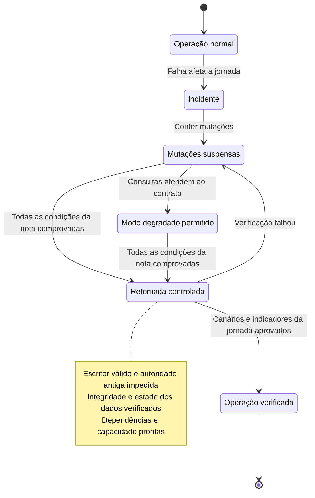

# 12 — Resiliência, migração e Well-Architected

**Base:** notas sobre alta disponibilidade, tolerância a falhas, DR e arquitetura. **Complemento:** classificar falhas e contratos antes de duplicar recursos.

## Alta disponibilidade e recuperação

Defina o que deve continuar funcionando, em qual nível e para quais falhas. Múltiplas instâncias não provam distribuição entre domínios de falha. Recuperar o frontend não demonstra disponibilidade da identidade ou do core.

RTO trata do tempo-alvo de recuperação; RPO, da perda admissível de dados expressa em intervalo de tempo para o conjunto definido. As estratégias de backup/restore, pilot light, warm standby e operação em múltiplos sites têm compromissos diferentes. [Fonte T23](../../references/README.md#t23)

## SPOF e estratégias de DR

Um ponto único de falha (SPOF) é qualquer componente cuja falha derruba a jornada. Para encontrá-los, percorra o caminho da requisição e pergunte, a cada peça, “e se isto parar?”: DNS, certificados, load balancer, NAT gateway (um por AZ), compute, banco, cache, segredos e chaves, fila, conexão com o data center, provedores externos, a região, a conta e também pessoas e processos (só uma pessoa sabe fazer o failover?).

| Estratégia de DR | Como fica a região de recuperação | RPO/RTO típicos | Custo |
|---|---|---|---|
| Backup e restore | Só backups; tudo é recriado na hora | Horas | Baixo |
| Pilot light | Dados replicados e um núcleo mínimo; o resto sobe na hora | Dezenas de minutos | Médio-baixo |
| Warm standby | Cópia completa em escala reduzida, já rodando | Minutos | Médio-alto |
| Multi-site ativo-ativo | Regiões atendendo ao mesmo tempo | Quase zero | Alto |

As faixas são ordens de grandeza; o valor real sai do teste. O [Case 09](../../cases/09-multi-region-internet-banking.md) detalha a recuperação regional de um internet banking.

**Cuidado:** DR não testado é hipótese. Faça game days e injete falhas em ambiente controlado (AWS Fault Injection Service), e cubra também a corrupção lógica, que a replicação copia.

## Disponibilidade não é apenas responder HTTP 200

No exercício de transferência, uma resposta de aceitação não significa lançamento concluído. Defina indicadores de jornada e de conclusão. Um sistema pode continuar atendendo consultas enquanto recusa temporariamente novas mutações por integridade.

A escolha precisa ser discutida com negócio: quais funcionalidades são essenciais? Qual modo degradado é aceitável? Qual risco não pode ser assumido durante a recuperação?

Neste exemplo de recuperação, o modo degradado permite somente consultas autorizadas com dados aceitáveis para o uso.

**Pergunta para treinar:** o endpoint voltou a responder, mas ainda não sabemos se o escritor antigo foi isolado; podemos liberar escrita?

## Migração e convivência

Pergunte o que muda: hospedagem, linguagem, fronteira de negócio ou autoridade dos dados? Uma fachada nova não elimina uma dependência antiga. Faça inventário, identifique uma primeira capacidade, compare alternativas e proponha critérios de transferência.

Não substitua descoberta pela frase “refatorar tudo”. O [Case 05](../../cases/05-core-banking-modernization.md) aprofunda a convivência híbrida e a transferência de escrita. O [Case 09](../../cases/09-multi-region-internet-banking.md) aborda a recuperação regional.

O padrão Strangler Fig está resumido nos [padrões de sistemas distribuídos](../02-system-design/01-service-architecture.md#strangler).

## Seis pilares como perguntas

| Pilar | Pergunta para revisar uma decisão |
|---|---|
| Excelência operacional | Quem opera, mede e aprende com falhas? |
| Segurança | Quem pode fazer o quê e como os dados são protegidos? |
| Confiabilidade | Que falha foi contemplada e como se recupera? |
| Eficiência de performance | Qual recurso responde ao workload com o desempenho necessário? |
| Otimização de custos | Qual é o custo total e unitário para atender o requisito? |
| Sustentabilidade | Onde há desperdício e como reduzir recursos mantendo o resultado? |

O framework orienta revisão de decisões e riscos; não é uma certificação automática da arquitetura. [Fonte T14](../../references/README.md#t14) As perguntas da tabela são formulações de treino, não reprodução de uma auditoria oficial.

## Testes que mudam a confiança

Simule dependência indisponível, capacidade reduzida, réplica atrasada, credencial inválida, fila acumulada e corrupção lógica em ambiente controlado. Explique o que cada teste prova e o que permanece não testado.

## Perguntas de aprofundamento

“Trocar DNS impede que um worker antigo escreva?” “Uma réplica é backup?” “Quem declara a recuperação?” “Por que não retornar automaticamente à região original?”

## Perguntas de entrevista

1. Como você conduziria a migração de um sistema crítico de um banco, da descoberta ao cutover?
2. RTO de minutos e RPO próximo de zero: que estratégia de DR isso implica, e quanto custa?

O deployment resiliente em múltiplas regiões está nas [perguntas de design](../../interview/simulations/03-system-design/design-questions.md).

## Entrega

Para um case, escreva um runbook curto: pré-condições, autoridade, passos, critérios de parada, validação e retorno. Um procedimento testável é evidência melhor que duas caixas idênticas no diagrama.
