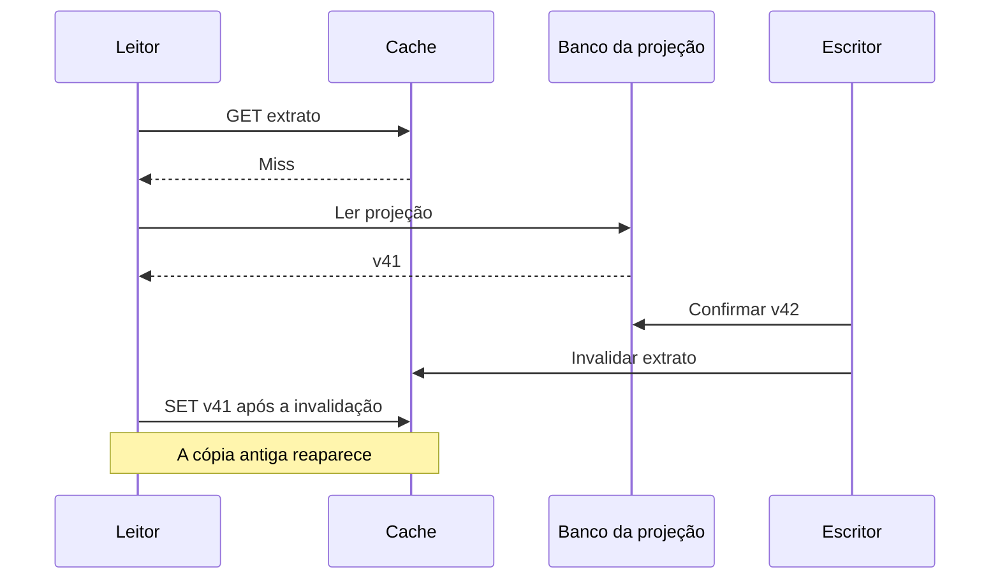

# SD02 — Dados em Escala

**ID:** SD02. **Origem:** seções que estavam em F02, F06 e F07, agora aprofundadas com exemplos autorais e fontes primárias. **Revisão técnica:** 03/10/2026.

**Objetivo:** partir do gargalo e combinar mecanismos de dados sem esconder seus limites de consistência, recuperação, operação e custo.

## Roteiro de leitura

**Essencial:** diagnóstico → consultas e conexões → cache e réplicas → exemplo do extrato. Use cada mecanismo para resolver uma hipótese específica.

**Aprofundamentos:** janelas de falha de cache, contratos AWS, backup, particionamento e sharding. Termine pelas perguntas e pelo exercício.

**Fronteira:** [F06](../01-fundamentals/06-databases-transactions-consistency.md) explica a garantia de uma operação: índice, transação, lock, MVCC e consistência. Aqui combinamos esses mecanismos para atender um workload maior. [F07](../01-fundamentals/07-events-messaging-distributed-systems.md) explica transporte; [SD03](03-distributed-workflows.md#cqrs), projeções e coordenação entre serviços.

**Como ler:** os contratos de produtos têm fontes junto às afirmações. As propostas são decisões a avaliar; números, IDs e falhas dos exemplos são hipóteses sintéticas. SQL, cenários e exercícios não foram executados contra bancos. Não há benchmark nem resultado real de `EXPLAIN`; nenhum recurso AWS é necessário para a simulação de mesa.

## Escalar um banco: investigar primeiro

“Extrato lento” é um sintoma. Comece delimitando **qual endpoint, quais contas, qual janela e qual etapa**: obter conexão, executar consulta, buscar dados complementares ou transferir a resposta. Compare pico e período normal, p50/p95/p99, erros, throughput e mudanças recentes. Um recurso ocupado pode ser consequência de consultas ruins, não falta intrínseca de capacidade.

| Hipótese | Evidência que a diferencia | Próximo passo para confirmar ou descartar |
|---|---|---|
| CPU insuficiente | CPU e trabalho ativo crescem com volume; consultas caras concentram consumo | Identificar queries/operadores; distinguir cálculo útil de varredura desnecessária |
| Pressão de memória | Working set excede cache de páginas; mais leituras físicas ou sort/hash em disco | Correlacionar memória, buffers e arquivos temporários; pouca memória livre isolada não basta |
| Storage latency | Tempo por I/O e fila crescem, com esperas de I/O no banco | Separar latência do dispositivo de aumento do número de operações |
| Limite de IOPS | Operações por segundo aproximam-se do limite e a fila aumenta | Comparar tamanho das operações e limites efetivos da configuração |
| Limite de throughput | Bytes por segundo saturam, mesmo sem atingir o teto de IOPS | Investigar scans, payloads e largura de banda de storage/instância |
| Locks/contenção | Sessões bloqueadas, transações longas, espera concentrada nas mesmas linhas | Encontrar bloqueador e regra disputada; mais CPU não libera um lock |
| Queries lentas | Muito dado lido/descartado, joins caros, estimativas ruins ou regressão de plano | Comparar plano e distribuição para parâmetros representativos |
| Connection exhaustion | Espera para obter conexão, conexões ociosas ou em transação, timeouts de aquisição | Comparar limite do banco com a soma de pools; distinguir aquisição de execução |
| Cache ineficaz | Hit ratio baixo, eviction e carga de miss aumentam | Medir por tipo de chave/consulta; média global pode esconder o endpoint crítico |
| Replication lag | Leitor não alcança o checkpoint necessário; atraso acompanha ingestão/aplicação | Separar atraso de réplica de atraso do pipeline que alimenta a projeção |
| Hot partition/hot key | Throttling ou latência concentrados em poucas chaves, apesar de capacidade agregada livre | Medir distribuição por chave/partição e tamanho dos itens |

Essas são hipóteses de investigação, não uma associação automática entre métrica e causa. Na AWS, as métricas e diagnósticos de RDS ajudam a observar recursos e carga; escolha os sinais suportados pela engine e pelo deployment. [Monitoramento RDS][r-monitoring]

Antes de recomendar uma tecnologia, registre padrões de acesso, volume e crescimento, distribuição, invariantes, latência, disponibilidade, recuperação, operação e custo. Defina também o critério de sucesso: reduzir p95 preservando a atualidade necessária e o orçamento, por exemplo. “É mais moderno” não é um critério verificável.

### Consultas e conexões antes de adicionar nós

#### Query/index optimization

Retome [F06, indexação](../01-fundamentals/06-databases-transactions-consistency.md#indexacao) para entender a estrutura. Aqui interessa reduzir trabalho por requisição: ler apenas colunas e intervalos necessários, evitar ordenações dispensáveis e conferir estatísticas e seletividade.

**Exemplo SQL PostgreSQL ilustrativo, não executado:** paginação por cursor de uma conta; parâmetros e nomes são sintéticos. Pressupõe `occurred_at` e `entry_id` não nulos, com ordenação estável.

```sql
-- $1: conta; $2 e $3: posição final da página anterior.
SELECT entry_id, occurred_at, amount_centavos
FROM statement_entry
WHERE account_id = $1
  AND (occurred_at, entry_id) < ($2, $3)
ORDER BY occurred_at DESC, entry_id DESC
LIMIT 50;
```

Um índice candidato começa por `(account_id, occurred_at, entry_id)`. Avalie o plano antes de acrescentar colunas de cobertura; a manutenção tem custo na ingestão. A primeira página omite o filtro de cursor. Em comparação com `OFFSET` profundo, keyset pagination pode evitar percorrer e descartar muitas linhas. Não cria um snapshot de todas as páginas: inserções tardias, correções e mudança da chave de ordenação exigem contrato próprio, ou uma consulta/exportação com visão estável.

**N+1:** uma consulta lista 50 lançamentos e outra busca o detalhe de cada um, totalizando 51 acessos. Um join, busca em lote ou projeção pode reduzir viagens; confira multiplicação de linhas e tamanho da resposta antes de trocar uma explosão por outra.

No PostgreSQL, confronte plano estimado e medição em ambiente controlado com dados representativos: linhas, loops, buffers e tempo. `EXPLAIN ANALYZE` executa a consulta; o custo estimado não é tempo medido. Não há saída de plano neste material. [Using EXPLAIN][r-explain]

#### Connection pooling

**Hipótese aritmética:** 80 instâncias da aplicação, cada uma com pool máximo de 40, podem demandar 3.200 conexões. Se o orçamento destinado à aplicação no banco for 400, aumentar instâncias sem coordenar pools pode causar esgotamento mesmo com CPU disponível.

Um pool reutiliza conexões e limita trabalho simultâneo. Determine teto **agregado**, reserve capacidade para outros workloads e administração, imponha timeout de aquisição e observe fila, conexões ativas/ociosas e tempo de transação. A fila do pool deve caber no prazo da requisição; rejeitar excesso de forma controlada pode ser preferível a acumular chamadas que já perderam utilidade.

RDS Proxy mantém conexões com o banco e pode reutilizá-las entre sessões/transações. Estado de sessão que impeça reutilização segura pode provocar **pinning**, reduzindo multiplexação. Transações longas também ocupam recursos. [Conceitos do RDS Proxy][r-proxy]

Pool ou proxy não adiciona CPU, IOPS nem capacidade de executar transações. Se todas as conexões já estão fazendo trabalho útil no recurso saturado, aumentar o pool pode piorar a latência. Antes de escolher proxy, compare o pool da própria aplicação, padrão de conexão e esforço operacional; não acrescente uma dependência sem benefício identificado.

<a id="cache"></a>
## Estratégias de cache

Cache evita repetir uma leitura ou cálculo; introduz uma cópia e um caminho adicional de falha. Defina **fonte de verdade, chave, atualidade e recuperação**. A chave deve representar o escopo autorizado e os parâmetros da consulta: duas contas nunca podem compartilhar acidentalmente a mesma resposta. Hit é encontrar a entrada; miss é não encontrá-la. TTL (time to live) é seu prazo de expiração.

### Quatro fluxos e suas janelas de falha

| Estratégia | Fluxo normal | Falha e dado defasado | Invalidação, TTL e recuperação |
|---|---|---|---|
| Cache-aside (lazy loading) | Aplicação busca no cache; no miss, lê a fonte e preenche | Atualização da fonte não invalida a cópia, ou uma carga antiga chega depois | Invalidar/atualizar após mudança; expirar e recarregar da fonte, tratando a corrida descrita abaixo |
| Read-through | Aplicação consulta a camada de cache; ela chama um loader no miss | Loader falha ou escritores externos mudam a fonte sem avisar o cache | Propagar invalidação, aplicar TTL e recuperar pelo loader; timeout e tratamento de erro continuam necessários |
| Write-through | Caminho de escrita grava a fonte e atualiza a cópia antes de considerar o fluxo completo, conforme a implementação | Banco confirma; atualização do cache falha. Um erro ao cliente não desfaz o commit já ocorrido | Marcar/inutilizar a cópia, reparar a atualização e recuperar pelo banco; TTL limita residência, sem garantir atomicidade |
| Write-behind / write-back | Camada aceita a alteração e a persiste depois | Processo/fila falha antes da persistência; a fonte durável fica atrás | Recuperar alterações pendentes de armazenamento/fila com durabilidade definida; não expirar/evictar escrita pendente sem preservá-la |

Os nomes descrevem a posição da carga/escrita no fluxo; detalhes e ACK variam por implementação. O [whitepaper AWS][r-cache-patterns] ilustra cache-aside e escrita na fonte seguida do cache. A [documentação do Hazelcast MapStore][r-mapstore] distingue read-through, write-through e write-behind. **Nenhum desses nomes, sozinho, estabelece uma transação distribuída entre banco e cache.**

Para read-through e write-through, TTL/eviction podem remover a cópia limpa, que volta pelo caminho de leitura. Para write-behind, além da cópia existe trabalho ainda não persistido: é necessário decidir o que o ACK garante, ordenar versões por chave e repetir gravações sem aplicar efeito indevido. Falha após persistir e antes de confirmar ao worker também pode gerar repetição. Não use um cache volátil como confirmação durável de uma reserva financeira.

### Aprofundamento: invalidar depois do commit não fecha toda corrida

Sequência **ilustrativa** de cache-aside; `v41`/`v42` são versões da mesma projeção, não saldo autoritativo:



A aplicação precisa de uma política explícita: aceitar a defasagem por contrato ou implementar controle de versão/geração que rejeite preenchimento antigo. Uma comparação apenas com o valor presente no cache não basta se a invalidação apagou também a versão conhecida. Um desenho mais forte deve preservar a referência de versão mínima ou coordenar o preenchimento; isso tem custo e precisa de teste de concorrência.

TTL limita quanto tempo aquela entrada permanece após ser carregada. Não prova um limite de defasagem em relação à autoridade: o loader pode recarregar de uma réplica já atrasada. Invalidação perdida exige recuperação; eventos de atualização precisam de tratamento de repetição e ordem, explicado em [SD03](03-distributed-workflows.md#inbox-e-consumidor-idempotente-proteger-o-efeito-local).

### Pressão de carga e recuperação

| Situação | Mecanismo útil | Limitação a testar |
|---|---|---|
| Cache stampede: muitos misses na mesma chave | Uma recarga por chave (request coalescing), atualização antecipada | Quem coordena pode falhar; limitar espera e trabalho de recuperação |
| Muitas chaves expiram juntas | TTL jitter, distribuindo expirações | Respeitar o máximo de residência permitido; não resolver uma hot key só com aleatoriedade |
| Cache penetration: consultas repetidas a valores inexistentes | Negative caching curto quando seguro e validação de entrada | “Não encontrado” pode mudar; não cachear falha transitória como ausência definitiva |
| Cache frio após deploy/failover | Cache warming gradual dos dados mais reutilizados | Aquecer toda a base pode saturar a fonte |
| Eviction por falta de memória | Política adequada ao acesso, observação de hit ratio e tamanho | Eviction é remoção por capacidade; TTL é expiração por tempo |
| Cache indisponível | Fallback com teto de concorrência, backpressure e degradação prevista | Enviar todos os misses ao banco pode derrubar também a fonte |

Essas decisões precisam de métricas por workload e ensaios com cache frio/indisponível. A [Amazon Builders' Library][r-cache-resilience] discute dependência excessiva do cache, coalescing e fallback sob pressão; [boas práticas AWS][r-cache-practice] complementam expiração e aquecimento. Aqui são propostas de validação, não testes já realizados.

### O dado pode ficar defasado para qual uso?

Uma descrição de produto pode admitir defasagem; um **preço** usado numa contratação pode exigir versão válida, prazo e confirmação na fonte. O nome “catálogo” não elimina requisitos de consistência. Da mesma forma, um extrato identificado como projeção pode ter contrato de atualização, mas não passa a autorizar débito.

No [Case 10](../../cases/10-card-authorization-platform.md#s08), o core arbitra saldo/limite e reserva. Cache pode reduzir consultas auxiliares ou apresentar um resultado, conforme seu contrato; não pode criar outra autoridade financeira. Resultado antigo de “aprovado” também não prova que uma reserva continua ativa. Se o requisito não tolera stale data, escolha um caminho que o cumpra ou indique indisponibilidade explícita.

<a id="replicacao"></a>
## Replicação

Uma réplica recebe mudanças da fonte; não corrige uma query ruim nem cria capacidade de escrita automaticamente. Em leader/follower, o líder aceita alterações e seguidores recebem o log/estado. Leituras podem ser distribuídas conforme o contrato. Um líder único reduz conflitos entre escritores independentes, mas **não elimina corridas entre transações da aplicação**: F06 continua valendo.

### O ACK precisa dizer o que foi confirmado

**Assíncrona:** o ACK ao cliente não depende de a réplica de destino persistir/aplicar a mudança. **Síncrona:** espera-se uma condição definida sobre participantes definidos. Pergunte quais cópias confirmaram, se houve recebimento, persistência ou aplicação, e qual destino pode ser promovido após qual falha.

Como exemplo de precisão, PostgreSQL distingue espera por WAL remoto persistido de espera por aplicação (`remote_apply`), conforme os standbys configurados. Persistir log não implica que toda réplica já o aplicou para leitura. [Configuração PostgreSQL][r-wal] Mesmo confirmação síncrona não protege de perda de todas as cópias relevantes ou de erro lógico replicado.

| Conceito | O que mede ou especifica | Por que não são equivalentes |
|---|---|---|
| Replication lag | Atraso de recebimento/persistência/aplicação, conforme a métrica | Precisa de estágio, unidade, direção e instante de observação |
| RPO — recovery point objective | Objetivo para o ponto recuperável: perda de dados tolerável, usualmente expressa em tempo | É requisito de recuperação; a arquitetura precisa demonstrar que o atende |
| Perda observada | Escritas confirmadas que não foram recuperadas após o incidente | Só se estabelece reconciliando dados, não olhando uma métrica antiga de lag |

**Hipótese:** o último lag observado foi 2 s e o RPO requerido é 5 s. Uma falha posterior não prova perda de 2 s nem atendimento do RPO: a medição pode estar antiga, o atraso pode crescer e talvez não tenha havido escrita no intervalo. Compare posições duráveis e operações confirmadas. [Objetivos de recuperação, T23](../../references/README.md#t23)

### Failover e read-after-write

Promover uma réplica exige avaliar sua posição, bloquear escritores incompatíveis e reorientar clientes. Conexões podem cair; uma requisição com resposta perdida precisa de consulta/retry idempotente, não de outra identidade. Coordenação e fencing estão em [SD03](03-distributed-workflows.md#leader-election).

Para ler após escrever, opções incluem usar a fonte apropriada, exigir um checkpoint mínimo aplicado ou esperar dentro de um prazo. Fixar a sessão num endpoint só funciona enquanto ele fornece a garantia requerida; failover ou projeção atrasada podem quebrar a suposição. Uma réplica do banco da projeção pode estar em dia com esse banco e ainda faltar um evento do core. Não confunda lag de replicação com lag de ingestão.

### Contratos AWS que não devem ser misturados

Escopo conferido em 03/10/2026. Engine, versão e região precisam ser verificados para uma implantação concreta; não há promessa universal de tempo de failover nesta tabela.

| Deployment | Escala, leitura e HA | Decisão e limite |
|---|---|---|
| RDS Single-AZ | Instância numa AZ, sem o standby entre AZs do Multi-AZ | Não oferece aquele failover para standby; recuperação/backup precisam de planejamento. [Comparação AWS][r-rds-options] |
| RDS Multi-AZ DB instance deployment | Primária e standby síncrono em outra AZ | Standby para HA **não atende leitura**; custo e espera de replicação. [AWS][r-multi-instance] |
| RDS Multi-AZ DB cluster | Writer e dois readers em três AZs; replicação semissíncrona | Commit exige ACK de pelo menos um reader, não aplicação completa em ambos; readers atendem consultas e são destinos de failover. [AWS][r-multi-cluster] |
| RDS Read Replica | Replicação assíncrona nativa da engine para outra instância | Pode descarregar leituras; avaliar lag e promoção. Não equivale ao standby automático do Multi-AZ. [AWS][r-read-replica] |
| Aurora cluster | Writer e readers compartilham volume distribuído; armazenamento replica em seis nós de três AZs | Cópias de storage não são seis servidores de consulta; readers podem apresentar atraso. [Arquitetura][r-aurora], [storage][r-aurora-storage], [HA][r-aurora-ha] |
| Aurora Global Database | Replicação entre regiões assíncrona | Switchover planejado saudável sincroniza antes da troca, com RPO zero; failover não planejado pode perder dados. [AWS][r-aurora-global] |
| DynamoDB global tables | Réplicas regionais; contratos MREC e MRSC distintos | Comparar consistência, APIs e regiões permitidas em [F06](../01-fundamentals/06-databases-transactions-consistency.md#global-tables-mrec-e-mrsc), não tratar os modos como intercambiáveis |

Read Replica tem diferenças por engine, inclusive réplicas usadas em modos de standby que não atendem consultas. Identifique a opção concreta. HA dentro de uma região não equivale a DR regional. Para Aurora Global Database, métricas e controles de RPO dependem de engine/versão; não transforme atraso típico em SLA ou “replicação síncrona global”. [Recuperação Aurora Global Database][r-aurora-global]

O [Case 09](../../cases/09-multi-region-internet-banking.md#s08) separa o banco do canal da autoridade financeira. Recuperar metadados do canal com perda tolerada não autoriza perder uma operação financeira já confirmada; é preciso reconciliar a identidade com a autoridade pertinente. O [Case 01](../../cases/01-payment-processing-pix.md#s15) também distingue Multi-AZ e recuperação regional.

### Aprofundamento: multi-líder e quóruns

Com multi-líder, escritas aceitas em lugares diferentes podem conflitar; uma política last writer wins não soma reservas nem protege o orçamento global. Decidir quem pode alterar cada agregado faz parte da arquitetura, não apenas do roteamento.

Num conjunto fixo de N réplicas, `W + R > N` faz conjuntos de escrita e leitura se intersectarem. **Só essa desigualdade não prova leitura linearizável:** faltam regras para versões concorrentes, escritas incompletas, membership e reparação. Em sloppy quorum, participantes substitutos podem até alterar a interseção esperada. O artigo original de [Dynamo][r-dynamo-paper] ilustra essas escolhas; seu contrato histórico não deve ser atribuído ao atual serviço DynamoDB.

### Backup versus replication

Replicar um `DELETE` acidental apaga também a réplica. Corrupção lógica produzida por uma aplicação e dados cifrados indevidamente por ransomware também podem se propagar como escritas válidas. Réplica saudável não significa estado de negócio recuperável.

Backup/snapshots e logs para point-in-time recovery preservam pontos anteriores conforme retenção e proteção configuradas. RDS permite restaurar uma instância para um ponto recuperável em **outra instância**, que deve ser validada antes da troca. [Point-in-time recovery][r-pitr]

Defina isolamento de acesso, retenção, proteção contra remoção e testes de restauração conforme o risco. A recuperação exige localizar um ponto anterior ao erro, restaurar, validar e reconciliar operações legítimas posteriores. Restaurar o banco local não desfaz efeitos que o core/PSP já confirmou. Backup sem teste não prova RTO; replicação não substitui esse processo.

<a id="particionamento"></a>
## Particionamento e sharding

**Particionamento lógico** define subconjuntos por regra, como conta ou mês. **Particionamento físico** define como esses subconjuntos são armazenados; podem estar em tabelas/segmentos no mesmo servidor. **Sharding** distribui subconjuntos entre nós que atendem partes da carga. Dividir uma tabela não implica acrescentar nós.

No PostgreSQL, particionamento declarativo divide uma tabela lógica em partições e permite pruning: excluir partições que a consulta não precisa visitar. Isso pode ajudar consulta e manutenção sem distribuir automaticamente a escrita entre servidores. [Particionamento PostgreSQL][r-partitioning]

| Estratégia | Quando ajuda | Custo e falha a considerar |
|---|---|---|
| Range | Datas/faixas favorecem busca por intervalo e descarte de períodos antigos | Faixa “hoje” pode concentrar escrita; crescimento desigual exige novas divisões |
| Hash | Distribuir muitas chaves com acesso razoavelmente disperso | Não resolve uma única chave quente; consulta sem a chave pode exigir fan-out |
| Directory | Mapa direciona cada cliente/agregado ao shard | Permite mover um cliente grande, mas mapa, atualização e roteamento viram dependências críticas |
| Geographic | Localizar dados por região sob requisito de latência/residência | Usuários e relações atravessam fronteiras; migração e coordenação precisam de contrato |

Cardinalidade alta não garante equilíbrio: **skew** é distribuição desigual de tamanho ou tráfego; **hot key** é uma chave dominante. Dividir artificialmente suas escritas pode espalhar carga e exigir agregação na leitura. Para uma invariante global sobre essa chave, espalhar contadores sem coordenação pode quebrar a regra de F06.

**Scatter/gather:** uma consulta se espalha pelos shards e reúne respostas; o fan-out aumenta trabalho, latência de cauda e chance de resposta parcial. Um índice global pode mudar o caminho de acesso, mas tem custo e seu contrato de atualização depende do produto — não é necessariamente assíncrono em todo sistema.

### Aprofundamento: consistent hashing e rebalanceamento

Consistent hashing mapeia chaves e responsáveis num espaço de hash; mudar a composição tende a redistribuir apenas parte das chaves. Nós virtuais ajudam a distribuir responsabilidade, mas não eliminam skew de tráfego. A técnica decide localização; não garante a consistência das leituras. [Dynamo, particionamento][r-dynamo-paper]

Rebalancear exige mover dados e definir quando o novo destino assume cada faixa/chave. Um plano precisa manter roteamento coerente, capturar escritas durante a cópia, verificar integridade e prever retomada. Movimentação compete por rede e I/O com o workload. O comportamento exato pertence ao sistema escolhido, não ao algoritmo de hash sozinho.

<a id="sharding"></a>
## Sharding

A pergunta é qual recurso continuará limitante depois da divisão. Shards podem repartir armazenamento e trabalho, mas uma conta quente ou um agregado que precisa de coordenação pode continuar serializando o caminho crítico.

**Cross-shard query** exige roteamento, índices ou agregação. **Cross-shard transaction** pode continuar atômica se o sistema oferecer transação distribuída; coordenação e falhas parciais têm custo. Não se conclui perda de atomicidade apenas por haver vários nós. DynamoDB oferece transações sobre itens distintos dentro do escopo documentado; particionamento interno não elimina esse contrato. [APIs transacionais][r-ddb-tx]

Se a plataforma não fornecer a transação necessária, redesenhe a fronteira ou explicite outro protocolo e suas garantias. Não substitua débito/crédito atômicos do core do [Case 03](../../cases/03-event-driven-banking.md#s01) por uma saga entre shards sem mudar o requisito e assumir o novo problema.

### Quando não fazer sharding

Não faça se a causa ainda for desconhecida, se o ganho não superar o custo operacional ou se a chave de distribuição destruir acessos/transações essenciais. Antes, compare:

1. Query optimization, índices e redução de dados lidos.
2. Scale-up, quando o recurso limitante e a margem de crescimento justificarem.
3. Read replicas e cache, somente para leituras cujo contrato permita.
4. Particionamento interno do produto para pruning e manutenção.
5. Archive/tiering com prazo de recuperação e retenção definidos.
6. Separação de relatórios, processamento em lote e tráfego transacional.

Essas alternativas não são uma sequência obrigatória de implantação. Faça a menor combinação que resolva o gargalo com margem verificável. Para cada componente adicional, nomeie quem opera, como falha, como se recupera e quanto custa.

## Exemplo acompanhado: extrato lento no pico

### 1. Descobrir o contrato e abrir hipóteses

**Cenário inteiramente sintético:** 60 milhões de lançamentos na projeção, crescimento previsto de 10% ao mês, pico de 1.200 consultas/s e páginas de 50 entradas. O enunciado supõe p95 de 900 ms e pede p95 de até 250 ms. São números para discutir decisões, não medições ou promessas de serviço.

O extrato de `acct-001` é uma **projeção de consulta**; `tx-001` identifica uma transferência fictícia já confirmada no core. O requisito permite até 5 s de atraso na listagem comum, com indicação de atualidade. Após confirmação, a interface deve preservar esse resultado e comunicar eventual atualização do extrato. O extrato não autoriza novas transferências. Esse contrato didático acompanha a separação do [Case 09](../../cases/09-multi-region-internet-banking.md#s08).

Primeiro separe tempo no pool, tempo de SQL, chamadas adicionais e serialização/transporte. Compare contas pequenas/grandes e consultas por período. Não some percentis de componentes como se fossem o percentil da requisição inteira; use traces para decompor chamadas concretas.

### 2. Investigar em sequência

Use as seguintes **cartas hipotéticas**, reveladas durante a simulação, e explique o que cada uma prova ou não:

1. **Consulta:** o caminho de acesso não combina conta e ordenação; a hipótese de plano é ler muitas entradas para devolver 50. Peça plano e estatísticas, não conclua só pelo tamanho da tabela.
2. **Aplicação:** há uma chamada adicional por lançamento. Verifique N+1 antes de atribuir as 51 viagens ao “banco lento”.
3. **Conexões:** a frota chegou a 80 instâncias com pool máximo de 40; o orçamento agregado é 400 conexões. Há hipótese de excesso de conexões, mas ainda é preciso medir simultaneidade e espera.
4. **Recursos:** peça CPU, I/O, memória e locks depois de reduzir trabalho desnecessário. A saturação pode persistir ou desaparecer; não há resultado medido nesta rodada.
5. **Leituras:** se a capacidade continuar insuficiente, separe consultas tolerantes a atraso das que exigem a informação recém-confirmada.
6. **Distribuição:** só discuta sharding após medir se o gargalo remanescente é volume/escrita distribuível ou concentração numa conta.

### 3. Comparar as seis alternativas

| Alternativa | Hipótese e evidência necessária | Trade-off e falha nova | Medir sucesso; quando descartar |
|---|---|---|---|
| Melhorar query/índice | Muitos dados lidos, sort caro ou N+1; plano e traces confirmam | Índice ocupa espaço e custa escrita; plano pode regredir para outra distribuição | Menos buffers/viagens e menor p95 sem degradar ingestão; descartar índice que não melhora o workload representativo |
| Ajustar conexões/pooling | Espera de aquisição domina, pools agregados excedem orçamento | Limite forma fila/rejeição; proxy adiciona dependência e pode sofrer pinning | Menos timeouts e fila dentro do prazo, mantendo vazão; não esperar ganho se SQL/IOPS já domina |
| Ampliar capacidade | Recurso segue saturado após otimização, com trabalho útil e crescimento previsto | Custo recorrente, limites do produto e possível interrupção na mudança | Curva de latência/vazão e margem no pico; descartar se o gargalo for lock ou plano ruim |
| Usar read replica | Volume de leitura domina e parte aceita defasagem | Custo, lag, roteamento e recuperação; risco de ler resultado antigo | Menor carga no writer e leituras dentro do contrato de atualidade; descartar para requisição estrita sem fallback adequado |
| Cachear dados apropriados | Repetição das mesmas consultas/dados e tolerância definida | Invalidação, stale data, stampede e falha de cache | Hit ratio por acesso, carga de miss e atualidade; descartar se consultas forem únicas ou correção depender de dado fresco |
| Particionar/shardar | Pruning pode reduzir leitura/manutenção, ou carga excede um nó e é distribuível | Migração, skew, roteamento, cross-shard e rebalanceamento | Menos trabalho/maior capacidade por distribuição, recuperação testável; descartar se não superar alternativas mais simples |

**Decisão provisória do exercício:** primeiro propor query/índice e eliminar N+1; ajustar o orçamento de conexões identificado. Validar com o mesmo volume, distribuição e contrato antes de adicionar capacidade ou leitores. Um extrato histórico versionado pode ser candidato a cache, mas correções retroativas precisam invalidá-lo; não assuma imutabilidade por estar no passado.

Não foi aplicado nenhum desses ajustes. O plano de validação deve comparar condições equivalentes, erros, ingestão, atualidade e custo, além da meta de p95. Uma latência baixa servindo dado incorreto não satisfaz o objetivo.

### 4. Falha inserida: a réplica atrasa oito segundos

Depois de uma possível adoção de read replica, a simulação injeta **8 s de atraso**, acima dos 5 s permitidos. `tx-001` consta na confirmação da autoridade, mas falta na listagem do leitor.

1. Não transformar ausência na réplica em “transferência falhou” ou em autorização para reenviar com outro ID.
2. Preservar o resultado confirmado e mostrar “extrato em atualização”, com `asOf`/checkpoint apropriado. Esses metadados descrevem a origem dos dados, não a hora em que a API montou a resposta.
3. Para consulta estrita, usar uma fonte que possa cumprir o requisito, ou aguardar o checkpoint mínimo dentro do prazo. Só comparar checkpoints do mesmo fluxo/escopo; um timestamp de cliente não substitui essa evidência.
4. Se também faltar o evento na projeção primária, ler o writer dessa projeção não resolve. Consultar o resultado autoritativo de `tx-001`, conforme o contrato, e manter a listagem explicitamente incompleta/em atualização.
5. Limitar fallback para não sobrecarregar writer/core. Se não houver caminho seguro no prazo, retornar indisponibilidade/degradação explícita, em vez de apresentar listagem defasada como atual.
6. Retomar o leitor quando sua posição aplicada atender ao requisito e investigar o atraso. Não reintroduzir o caminho só porque a conexão voltou.

A decisão segura mantém a separação do Case 09 e do [Case 03](../../cases/03-event-driven-banking.md#s01): o canal apresenta dados; o core mantém autoridade sobre a efetivação. Oito segundos de lag, por si, não demonstram perda de oito segundos de operações.

## Para treinar

As dez perguntas pedem descoberta, hipótese, decisão, trade-off e validação. Use os comentários para conferir o raciocínio, não para decorar respostas.

### 1. O extrato ficou lento: qual é sua primeira investigação?

**Follow-up:** o problema afeta principalmente contas com histórico longo.

<details>
<summary>Resposta comentada</summary>

Separe aquisição de conexão, SQL e dependências por conta/período. Histórico longo sugere acesso/paginação, mas precisa de plano e distribuição. Compare linhas lidas/devolvidas e ordenação antes de aumentar instância. Uma boa resposta distingue pelo menos duas causas com evidências diferentes e define métrica de melhora sem relaxar o contrato de dados.

</details>

### 2. Como defender um índice sem prometer ganho universal?

**Follow-up:** a leitura melhora, mas a ingestão passa a atrasar.

<details>
<summary>Resposta comentada</summary>

Compare o workload completo: leitura, escrita, storage e manutenção. Explique qual filtro/ordenação o índice atende e o custo de mantê-lo. Reduza colunas ou reavalie índices sobrepostos conforme evidência. Valide parâmetros representativos e custo por operação; um bom plano em uma conta pequena não encerra a análise.

</details>

### 3. Mais instâncias da aplicação podem piorar o banco?

**Follow-up:** a maioria das conexões está ociosa, mas outras ficam em transações longas.

<details>
<summary>Resposta comentada</summary>

Calcule pools agregados e separe conexões abertas de trabalho ativo. Limite aquisição, feche transações no prazo e preserve orçamento de administração. Avalie proxy quando reutilização ajudar, considerando pinning. O sucesso é menos espera/erros sob carga útil equivalente, não apenas “mais conexões aceitas”. Pool não aumenta capacidade de execução.

</details>

### 4. Write-through torna banco e cache uma transação?

**Follow-up:** o banco confirmou, mas o processo morreu antes de atualizar o cache.

<details>
<summary>Resposta comentada</summary>

Desenhe os dois passos e a janela intermediária. O commit não desaparece por falha da cópia. Defina recuperação, invalidação e identidade da operação para evitar efeito duplicado no retry. Uma resposta completa explica também a corrida em que um leitor preenche cache antigo após a invalidação e delimita a defasagem aceitável.

</details>

### 5. Como evitar derrubar o banco quando o cache some?

**Follow-up:** não é permitido servir preços desatualizados na contratação.

<details>
<summary>Resposta comentada</summary>

Calcule a carga de miss, limite concorrência e planeje aquecimento gradual. Stale data só é opção se o uso permitir; preço vinculante pode exigir consulta/versão autoritativa ou recusa temporária. Diferencie expiração de eviction e evite que todos recarreguem a mesma chave. Proponha ensaio de cache indisponível com critérios de carga e correção.

</details>

### 6. Multi-AZ atende leitura em escala?

**Follow-up:** a proposta especifica “RDS Multi-AZ”, sem dizer o deployment.

<details>
<summary>Resposta comentada</summary>

Peça engine e opção concreta. Compare o standby não legível do DB instance deployment com os readers do DB cluster; não confunda ambos com Aurora. Nomeie a finalidade — HA, leitura ou DR — e avalie lag e custo. A sigla sozinha é insuficiente para justificar capacidade de leitura.

</details>

### 7. Replicação síncrona garante perda zero em qualquer falha?

**Follow-up:** o ACK veio de um destino que persistiu log, mas ainda não o aplicou.

<details>
<summary>Resposta comentada</summary>

Delimite participantes, persistência, aplicação e falhas cobertas. Essa cópia pode precisar aplicar dados antes de atender corretamente; outra réplica promovida pode estar em posição diferente. Separe requisito de RPO e perda apurada por reconciliação. Pergunte também por exclusão lógica: replicar o erro rapidamente não é proteção de backup.

</details>

### 8. O recibo confirmou a transferência, mas o extrato não a lista. O que fazer?

**Follow-up:** o writer da projeção também não recebeu o evento.

<details>
<summary>Resposta comentada</summary>

Localize o atraso: replicação ou ingestão. Ler o writer não resolve um evento ausente. Preserve o recibo e recupere o estado pela autoridade e identidade da operação; indique atualização, ou indisponibilidade para a leitura estrita. Não reaplique a transferência. Valide checkpoint, fallback limitado e comportamento visível ao cliente.

</details>

### 9. Quando sharding ajuda e quando acrescenta um problema?

**Follow-up:** uma única conta responde por metade das escritas.

<details>
<summary>Resposta comentada</summary>

Procure capacidade distribuível. Hash por conta não divide aquela conta quente; fragmentá-la pode exigir coordenação para manter a invariante. Compare otimização, capacidade vertical e separação de workloads antes. Explique roteamento, rebalanceamento e transações entre shards segundo o produto, sem afirmar que atomicidade é sempre perdida.

</details>

### 10. Como escolher entre réplica, backup e outro banco?

**Follow-up:** um processo incorreto alterou dados válidos durante uma hora.

<details>
<summary>Resposta comentada</summary>

Relacione o mecanismo ao problema: réplica pode repetir a corrupção; backup/PITR ajuda a recuperar um ponto anterior; outra engine só faz sentido diante do workload e contrato necessários. Planeje reconciliação de operações legítimas após esse ponto, RTO e validação. Não trate restauração local como reversão dos efeitos externos já confirmados.

</details>

## Exercício

**Simulação de mesa, sem banco ou AWS:** entregue uma folha de diagnóstico e uma de decisão para o extrato do exemplo. Todos os números fornecidos continuam sendo hipóteses.

1. Escolha duas hipóteses iniciais e escreva a evidência que as distingue, sem partir da solução.
2. Escolha uma alteração inicial e uma alternativa. Registre hipótese, custo, falha introduzida, métrica de sucesso e condição para descartar cada uma.
3. Defina como medir a meta de p95 ≤ 250 ms a 1.200 consultas/s, junto com erros, ingestão, carga e atualidade. Não invente o resultado.
4. Insira a réplica 8 s atrasada e descreva o que acontece com a consulta comum e com `tx-001` recém-confirmada.
5. Mude o requisito para leitura estrita em todas as consultas. Reavalie réplica/cache e o comportamento quando a fonte estiver indisponível.
6. Por fim, retire o cache da simulação. Estime quais pedidos chegam à fonte, qual limite os contém e como o serviço volta ao normal.

**Critérios observáveis:** as duas hipóteses têm sinais diferentes; a decisão não presume que cache/pool aumentem capacidade do banco; a falha não gera segunda transferência nem esconde sua confirmação; o fallback tem limite; e sharding só aparece com evidência de ganho sobre alternativas mais simples. A proposta inclui um resultado esperado e um plano de validação, claramente separados de teste executado.

## Fontes e escopo da revisão

Fontes primárias consultadas em 03/10/2026. As páginas de PostgreSQL usam a versão 18; Hazelcast 5.5 é apenas exemplo documentado de interface de cache, não recomendação de implantação. As decisões dos cases não são garantias automáticas dos produtos.

- PostgreSQL: [EXPLAIN][r-explain], [WAL e confirmação][r-wal], [particionamento][r-partitioning]. Sustentam diagnóstico, estágios de confirmação e distinção entre tabela particionada e distribuição entre nós.
- AWS: [monitoramento RDS][r-monitoring] e [RDS Proxy][r-proxy]. Sustentam observabilidade e pooling/multiplexação, sem promessa de aumentar capacidade computacional.
- Cache: [padrões AWS][r-cache-patterns], [MapStore][r-mapstore], [Amazon Builders' Library][r-cache-resilience] e [boas práticas AWS][r-cache-practice]. Sustentam mecanismos; as janelas e decisões do exemplo são análise autoral desses fluxos.
- AWS: [opções RDS][r-rds-options], [Multi-AZ DB instance][r-multi-instance], [Multi-AZ DB cluster][r-multi-cluster], [Read Replica][r-read-replica], [Aurora][r-aurora], [HA do Aurora][r-aurora-ha], [Aurora Global Database][r-aurora-global] e [PITR][r-pitr]. Sustentam a separação entre leitura, HA e recuperação.
- DeCandia et al., *Dynamo: Amazon's Highly Available Key-value Store* (SOSP 2007): [publicação original][r-dynamo-paper], seções de particionamento e sloppy quorum. Para o serviço atual, use as [APIs transacionais DynamoDB][r-ddb-tx] e os contratos de global tables em F06.

[r-explain]: https://www.postgresql.org/docs/18/using-explain.html
[r-wal]: https://www.postgresql.org/docs/18/runtime-config-wal.html
[r-partitioning]: https://www.postgresql.org/docs/18/ddl-partitioning.html
[r-monitoring]: https://docs.aws.amazon.com/AmazonRDS/latest/UserGuide/CHAP_Monitoring.html
[r-proxy]: https://docs.aws.amazon.com/AmazonRDS/latest/UserGuide/rds-proxy.howitworks.html
[r-cache-patterns]: https://docs.aws.amazon.com/whitepapers/latest/database-caching-strategies-using-redis/caching-patterns.html
[r-mapstore]: https://docs.hazelcast.com/hazelcast/5.5/mapstore/working-with-external-data
[r-cache-resilience]: https://aws.amazon.com/builders-library/caching-challenges-and-strategies/
[r-cache-practice]: https://aws.amazon.com/caching/best-practices/
[r-rds-options]: https://aws.amazon.com/blogs/database/choose-the-right-amazon-rds-deployment-option-single-az-instance-multi-az-instance-or-multi-az-database-cluster/
[r-multi-instance]: https://docs.aws.amazon.com/AmazonRDS/latest/UserGuide/Concepts.MultiAZSingleStandby.html
[r-multi-cluster]: https://docs.aws.amazon.com/AmazonRDS/latest/UserGuide/multi-az-db-clusters-concepts.html
[r-read-replica]: https://docs.aws.amazon.com/AmazonRDS/latest/UserGuide/USER_ReadRepl.html
[r-aurora]: https://docs.aws.amazon.com/AmazonRDS/latest/AuroraUserGuide/Aurora.Overview.html
[r-aurora-storage]: https://docs.aws.amazon.com/AmazonRDS/latest/AuroraUserGuide/Aurora.Overview.StorageReliability.html
[r-aurora-ha]: https://docs.aws.amazon.com/AmazonRDS/latest/AuroraUserGuide/Concepts.AuroraHighAvailability.html
[r-aurora-global]: https://docs.aws.amazon.com/AmazonRDS/latest/AuroraUserGuide/aurora-global-database-disaster-recovery.html
[r-pitr]: https://docs.aws.amazon.com/AmazonRDS/latest/UserGuide/USER_PIT.html
[r-dynamo-paper]: https://www.allthingsdistributed.com/files/amazon-dynamo-sosp2007.pdf
[r-ddb-tx]: https://docs.aws.amazon.com/amazondynamodb/latest/developerguide/transaction-apis.html
