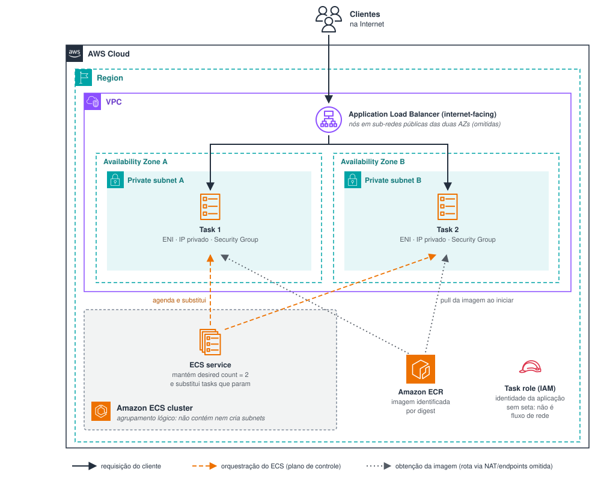
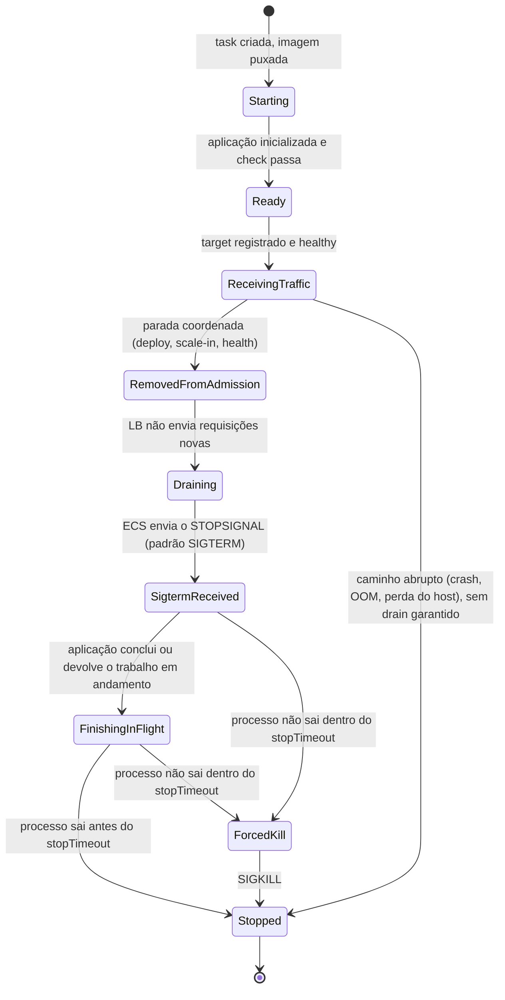

# 04 — Computação, containers e implantação

**ID:** F04. **Base:** [N01](../../references/README.md#n01)/[N05](../../references/README.md#n05) cobrem containers, HA, eficiência e CI/CD. **Revisão técnica:** 04/10/2026; explicações, exemplos e critérios autorais apoiados nas fontes ao final.

**Objetivo:** responder “como escolho uma unidade de execução e como ela nasce, recebe tráfego, acessa dependências, escala, falha e termina com segurança?”.

## Roteiro de leitura

**Essencial:** [modelo mental](#modelo-mental) → [escolha pelo workload](#escolha) → [identidade](#identidade) → [rede](#rede) → [health](#health) → [lifecycle](#lifecycle). Com isso você já explica um serviço ECS de ponta a ponta.

**Aprofundamento:** [balanceamento](#balanceamento), [Multi-AZ](#multi-az), [Auto Scaling](#auto-scaling), [imagem](#imagem), [estado](#estado), [Spot](#spot) e [troubleshooting](#troubleshooting). Termine pelas [perguntas](#perguntas), sem abrir as respostas, e pelo [exercício](#exercicio).

**Fronteiras:** redes em profundidade estão em [F01](01-networking-dns-connectivity.md); IAM, em [F03](03-security-identity.md); método de investigação, em [F08](08-observability-troubleshooting.md); pipeline e rastreabilidade, em [F11](11-git-cicd-iac.md). Decomposição, gateway, BFF e mesh pertencem a [SD01](../system-design/01-service-architecture.md); rolling, blue/green, canary e capacity planning, a [SD05](../system-design/05-scale-capacity-deployment.md). Aqui ficam os mecanismos da unidade de execução.

**Como ler as afirmações:** comportamento de produto vem com fonte; decisões dos exemplos são escolhas daquele cenário; números são hipóteses didáticas, não medições. Nenhum recurso AWS foi provisionado para este módulo.

## Objetivos de aprendizagem

Ao terminar, você deve conseguir, sem consulta:

- comparar Lambda, ECS/Fargate, ECS/EC2, EC2 e EKS a partir do workload, não do nome do serviço;
- explicar container sem confundi-lo com VM;
- diferenciar cluster, service, task e task definition no ECS;
- dizer qual role recebe uma permissão: task role ou task execution role;
- explicar onde a task executa, que IP recebe e por onde sai para suas dependências;
- distinguir saúde do processo, do target, da dependência e da jornada;
- explicar como um service escala e o que a escala não resolve;
- descrever drain, SIGTERM e encerramento forçado como momentos distintos;
- investigar falhas comuns por hipótese e evidência.

<a id="modelo-mental"></a>
## Modelo mental: do processo ao serviço

Comece pela coisa que executa e suba um nível por vez:

```text
Process ──empacotado em imagem, executa como──▶ Container

Task definition ──instancia──▶ Task        (uma task pode existir sem service)
Service ──mantém N──▶ Tasks da mesma task definition
Cluster ──agrupa logicamente──▶ Services e Tasks
```

**Process.** Um programa em execução. Tem memória, threads, conexões abertas, arquivos temporários e estado local. Quando o processo morre, esse estado morre com ele.

**Container.** Executa um processo isolado, com a aplicação e suas dependências empacotadas numa **imagem**. A imagem é o artefato imutável; o container é uma execução dessa imagem. Containers compartilham o kernel do host em que rodam, conforme o runtime e a plataforma; não carregam um sistema operacional completo como uma VM. Por isso iniciam rápido, mas o isolamento depende da plataforma: a AWS lembra que **container não é fronteira de segurança**. No Fargate, cada task tem sua própria fronteira de isolamento e não compartilha kernel, CPU, memória nem ENI com outra task. [Task role][f04-task-role], [Fargate][f04-fargate]

**Task definition.** O “contrato de execução” em JSON, versionado em revisões (`family:revision`): imagens, CPU/memória, portas, modo de rede, logs, variáveis, segredos, roles e health check do container. Mudar a imagem ou uma role exige registrar uma nova revisão. Registrar a revisão **não altera** um service existente: ele só passa a usá-la quando é atualizado para apontar para ela, e é essa atualização do service que dispara o deployment. [Task definitions][f04-taskdef], [UpdateService][f04-updateservice]

**Task.** Uma instância de uma task definition. Pode ser iniciada diretamente, sem service — por exemplo, um job —, e nesse caso ninguém a substitui se ela parar. Pode ter um ou mais containers que compartilham ciclo de vida; se um container marcado como `essential` para, a task inteira para. [ContainerDefinition][f04-containerdef]

**Service.** Mantém o número desejado (`desiredCount`) de tasks de uma task definition. Se uma task para ou é considerada não saudável, o scheduler inicia outra. Integra-se ao load balancer e ao Auto Scaling quando configurados. [Services][f04-services]

**Cluster.** Agrupamento lógico onde o ECS agenda tasks e services, e a que se associam capacidades (Fargate, EC2). **Não é uma VPC, não contém subnets e não cria conectividade por existir.** Subnets e Security Groups entram pela configuração de rede de cada service ou task. [Fonte T10](../../references/README.md#t10)

| Pergunta | Objeto que responde |
|---|---|
| “Qual imagem, quanta memória, qual role?” | Task definition (revisão) |
| “Quantas cópias e quem substitui a que caiu?” | Service |
| “Qual cópia está atendendo agora, com qual IP?” | Task |
| “Onde, logicamente, o ECS agenda isso?” | Cluster |
| “Em quais subnets e AZs a task recebe interface de rede?” | Configuração de rede do service, não o cluster |

**Erro comum:** “Fargate é o orquestrador”. O orquestrador é o ECS (ou o EKS). Fargate é uma **opção de capacidade**: onde a task roda, sem que você administre instâncias.

<a id="escolha"></a>
## Escolher compute pelo workload

“Qual serviço usar?” vem **depois** de “qual é o workload e quais são as restrições?”. Faça as perguntas em blocos:

| Bloco | Perguntas de discovery |
|---|---|
| Tempo e forma da carga | Quanto dura cada unidade de trabalho? Com que frequência chega? Volume médio e pico? Há bursts súbitos? Qual latência o cliente tolera? Quantas execuções simultâneas? |
| Estado e conexão | Guarda estado entre requisições? Mantém conexão longa (WebSocket, sessão TCP de parceiro)? Pode perder o processo a qualquer momento? |
| Plataforma | Precisa de kernel/OS específico, GPU, hardware dedicado ou agente/daemon no host? Precisa controlar o host? |
| Interrupção | Tolera ser interrompido? O trabalho pode ser repetido ou retomado? |
| Operação | O que o time já sabe operar? Quem faz patching, capacidade e upgrade? |
| Risco e custo | Disponibilidade e recuperação exigidas? Como o custo varia com uso ocioso e pico? Há requisitos de compliance sobre isolamento ou localização? |

| Opção | Sinais que favorecem | Custo ou risco a investigar |
|---|---|---|
|  **Lambda** | Trabalho por evento ou requisição curta; carga intermitente; integração nativa com eventos | 15 min por invocação no modelo padrão; concorrência por Região como quota; conexões a bancos sob burst; inicialização a frio; contrato de payload [Lambda quotas][f04-lambda] |
|   **ECS/Fargate** | Serviço containerizado de longa duração ou job; sem necessidade de controlar host | Limites da plataforma (sem `privileged`, sem daemon por host); `stopTimeout` máximo de 120 s; capacidade e IP por task |
|   **ECS/EC2** | Precisa de GPU, tipo de instância específico, agente no host, densidade ou parâmetros que Fargate não aceita | Time administra AMI, patching, escala e substituição das instâncias; tasks no mesmo host não têm isolamento entre si |
|  **EC2** | Software não containerizado, licença por host, controle total do sistema | Toda a operação do servidor; escala e substituição por Auto Scaling group |
|  **EKS** | Organização que já usa ou precisa da API Kubernetes, do ecossistema ou de portabilidade entre ambientes | Operar Kubernetes (versões, add-ons, RBAC, rede) além da aplicação; AWS gerencia o control plane, não o seu desenho [EKS][f04-eks] |

A tabela é uma pauta. Lambda não é sempre mais barato, Fargate não é sempre mais simples em todos os sentidos e EKS não é mais robusto por definição. Kubernetes também não é requisito para usar containers.

**Quando o requisito muda, a escolha muda.** Treine a adaptação:

| Mudança | O que reavaliar |
|---|---|
| A função de extrato passa a gerar um PDF de 25 minutos | Lambda deixa de caber no prazo por invocação; avalie job em ECS ou fluxo assíncrono em etapas. |
| O parceiro passa a manter uma sessão TCP de horas | Balanceamento por conexão, drain de sessão e reconexão passam a dominar; veja [Case 10](../../cases/10-card-authorization-platform.md#s09). |
| Um agente de segurança precisa rodar em cada host | Fargate não oferece daemon por host; ECS/EC2 ou sidecar na task, conforme o agente. |
| A auditoria exige isolamento entre workloads de clientes | Compare a fronteira por task do Fargate com tasks que compartilham instância no EC2. |

<a id="fargate-ec2"></a>
## ECS on Fargate × ECS on EC2

Fargate é um **modelo de responsabilidade**, não ausência de infraestrutura: a AWS provisiona, dimensiona e corrige a capacidade subjacente; você continua responsável pela aplicação, pela imagem, pela configuração da task, pela rede, pelas permissões, pela observabilidade e pelo comportamento sob falha. [Fargate][f04-fargate]

| Responsabilidade | ECS on Fargate | ECS on EC2 |
|---|---|---|
| Instâncias, AMI, patching do host | AWS | Seu time |
| Capacidade do cluster e “cabe mais uma task?” | AWS, dentro das quotas | Seu time, com Auto Scaling group/capacity provider |
| Isolamento entre tasks | Fronteira por task | Tasks podem compartilhar instância e não há isolamento de task garantido pela plataforma |
| Imagem, configuração, roles, SG, logs, health | Seu time | Seu time |
| Tasks substituídas pela plataforma | Sim: a AWS pode aposentar tasks em revisões de plataforma vulneráveis | Instâncias substituídas pelo seu processo |

A última linha importa: mesmo sem você mudar nada, uma task Fargate pode ser parada para manutenção da plataforma. A aplicação precisa tolerar substituição. Existe ainda o ECS Managed Instances, em que a AWS gerencia instâncias EC2 para o cluster; trate-o como outra opção de capacidade a comparar pelos mesmos critérios. [Fargate][f04-fargate], [task placement][f04-placement]

<a id="identidade"></a>
## Identidade: task role × task execution role

Antes de escolher a role, pergunte: **quem está fazendo a chamada AWS?** Duas roles aparecem na task definition e servem a sujeitos diferentes:

| | Task role | Task execution role |
|---|---|---|
| Quem faz a chamada | O código da aplicação, via SDK/CLI dentro do container | O agente do ECS ou do Fargate, em features que exigem permissões em nome da execução da task |
| Exemplos | S3, DynamoDB, SQS ou Secrets Manager chamados pelo SDK | Segredos referenciados no campo `secrets`; `environmentFiles` no S3; credenciais de registry privado; no Fargate, também o pull do ECR privado e o envio de logs `awslogs` |
| Os containers enxergam? | Sim, como credenciais temporárias | Não diretamente |

[Task role][f04-task-role], [task execution role][f04-exec-role], [environment files][f04-envfiles], [secrets][f04-secrets]

**Depois, qualifique pela opção de capacidade.** No Fargate, o pull do ECR privado e os logs `awslogs` usam a execution role. No ECS/EC2, o agente roda na instância com a **container instance role**; a documentação atribui a ela as permissões de pull do ECR e de escrita no CloudWatch Logs, e a execution role pode ser usada para logs quando atribuída à task, com combinações que dependem da configuração do agente (por exemplo, `ECS_ENABLE_AWSLOGS_EXECUTIONROLE_OVERRIDE`). Por isso, no EC2, identifique o principal efetivo — pelo erro, pelo `stoppedReason` ou pelo CloudTrail — antes de alterar IAM. [Container instance role][f04-instance-role], [awslogs][f04-awslogs]

**Exemplo.** A aplicação precisa ler um objeto no S3. Qual role recebe `s3:GetObject`?

**Resposta:** a **task role**, porque quem chama o S3 é o código. A exceção confirma a regra: se o arquivo no S3 é um `environmentFile`, quem o busca é o agente, antes de iniciar o container, e a documentação exige a permissão na execution role. O mesmo raciocínio separa um segredo do campo `secrets`, injetado pelo agente na inicialização (execution role) e não atualizado se for rotacionado depois, de um segredo que o código busca pelo SDK em tempo de execução (task role).

**Menor privilégio:**

- uma role por task definition ou service, com recursos específicos, não `*` por conveniência;
- a trust policy aceita `ecs-tasks.amazonaws.com` e pode ser restrita com `aws:SourceAccount`/`aws:SourceArn`;
- no ECS/EC2, são duas preocupações distintas. **IMDS:** restringir o acesso dos containers ao IMDS reduz o risco de usarem as credenciais da instância. **Tasks vizinhas:** a documentação avisa que, no mesmo host, containers podem acessar credenciais e dados de outras tasks; bloquear o IMDS não cria esse isolamento, que depende do runtime, da configuração e da decisão de compartilhar o host. Quando o isolamento entre tasks é requisito, compare com a fronteira por task do Fargate;
- a role de deploy do pipeline é uma terceira identidade e não deve ser reaproveitada pela aplicação ([F03](03-security-identity.md), [F11](11-git-cicd-iac.md)).

O CloudTrail registra o `taskArn` na sessão das credenciais da task role, o que ajuda a atribuir uma chamada a uma task específica. [Task role][f04-task-role]

<a id="rede"></a>
## Networking da task

No modo `awsvpc` — obrigatório no Fargate e disponível no EC2 —, cada task recebe **sua própria ENI**, com IP privado da subnet escolhida e os Security Groups do service. A task participa da VPC como qualquer outra interface: rotas, NACLs, SGs e Flow Logs se aplicam a ela. Por isso o target group de um service `awsvpc` usa target type `ip`. No ECS/EC2 há também os modos `bridge` e `host`, em que as tasks compartilham a interface da instância. [Service definition][f04-servicedef], [rede no Fargate][f04-fargate-net]

| Elemento | O que define para a task |
|---|---|
| VPC | O espaço de endereçamento e a resolução DNS (`enableDnsSupport`) |
| Subnet | Em qual AZ a ENI nasce e qual tabela de rotas governa a saída |
| ENI e IP | O endereço que o load balancer registra; cada task consome um IP da subnet |
| Security Group | Quem pode entrar (idealmente o SG do ALB) e para onde pode sair |
| `assignPublicIp` | No Fargate, se a ENI da task recebe IPv4 público; o padrão é `DISABLED`. No ECS/EC2 com `awsvpc`, a ENI da task não recebe IP público, e a saída para a internet passa por NAT |

**Entrada:** cliente → load balancer → IP privado da task na porta do container. **Saída:** task → rota da subnet → destino. **Nome:** a aplicação resolve dependências pelo DNS da VPC; DNS errado parece “rede caída”.

**Duas frases que evitam atalhos:**

1. **“Task em subnet privada” não significa “sem saída”.** Ela pode alcançar a internet por NAT gateway e serviços AWS por VPC endpoints, ou redes híbridas por outras rotas, conforme o destino. Para puxar a imagem, a documentação lista IP público em subnet pública, NAT gateway em subnet privada ou endpoints do ECR. Sem nenhum desses caminhos, a task não inicia. Um endpoint só não basta: no Fargate 1.4+, o pull privado por endpoints envolve `ecr.api`, `ecr.dkr` e o gateway endpoint do S3, onde ficam as camadas da imagem, além de endpoints para o que mais a task use, como logs e segredos. [Rede no Fargate][f04-fargate-net], [endpoints do ECR][f04-ecr-endpoints]
2. **“Subnet pública” não torna a aplicação corretamente exposta nem segura.** Exposição correta exige listener, rota, SG, TLS e autorização de aplicação. Colocar a task numa subnet pública com IP público costuma ampliar a superfície sem necessidade, quando o load balancer já é a porta de entrada.

Antes de concluir como uma task sai para a internet, identifique a capacidade (Fargate ou EC2) e o modo de rede: no EC2 com `awsvpc`, uma task em subnet pública não ganha acesso à internet por estar lá. [Rede awsvpc no EC2][f04-awsvpc-ec2]

<a id="diagrama-aws"></a>
### Arquitetura mínima



**Como ler:** a caixa da VPC, as AZs e as subnets representam a **rede**; a caixa do ECS cluster, fora da VPC, representa **organização lógica**. As setas tracejadas de orquestração não são caminho de requisição. A task role não tem seta porque identidade não é fluxo de rede. Foram omitidos de propósito: as sub-redes públicas em que o ALB tem nós, o caminho de saída (NAT ou endpoints) usado no pull da imagem e as dependências da aplicação. Ícones: AWS Architecture Icons oficiais, release de 31/07/2026. [Fonte][f04-icons]

<a id="balanceamento"></a>
## Proxies reversos e balanceamento

Um **proxy reverso** recebe as requisições em nome dos servidores: esconde a topologia, pode terminar TLS, aplica regras e encaminha. Um **load balancer** é um proxy reverso, ou um encaminhador de conexões, cuja função principal é distribuir carga entre destinos saudáveis.

- **Camada 4 (transporte):** decide por conexão ou fluxo, com base em endereços e portas, sem interpretar o HTTP.
- **Camada 7 (aplicação):** lê a requisição e pode rotear por host, caminho, cabeçalho ou método.

**Escolha ALB ou NLB pelo contrato, não pelo apelido.** Pergunte: qual protocolo chega (HTTP/HTTPS/gRPC ou TCP/UDP/TLS)? A conexão é curta ou dura horas? Preciso de roteamento L7, autenticação no listener ou regras por caminho? Preciso de IP estático por AZ ou preservar o IP do cliente? “ALB = HTTP” e “NLB = mais rápido” escondem essas perguntas. A documentação do ECS recomenda ALB, salvo quando o service precisa de algo que só NLB ou Gateway Load Balancer oferecem. [Service load balancing][f04-svc-lb]

| |  ALB |  NLB |
|---|---|---|
| Camada | 7 | 4 |
| Unidade de decisão | Requisição | Conexão TCP ou fluxo UDP |
| Algoritmos do target group | Round robin (padrão), least outstanding requests, weighted random | Hash de fluxo; cada conexão TCP fica num único target |
| Endereço | Acessado pelo nome DNS | IP estático por AZ; Elastic IP opcional se internet-facing |
| Cross-zone | Sempre ligado no load balancer; pode ser desligado por target group | Desligado por padrão |

[Atributos do ALB][f04-alb-attrs], [NLB][f04-nlb]

Algoritmos genéricos, como “menos conexões” ou consistent hashing por chave, existem em outros proxies, mas **não são opções do target group do ALB**. O weighted random do ALB permite a mitigação de anomalias do Automatic Target Weights. No NLB, mais tasks não redistribuem conexões já abertas: uma sessão longa continua no target original.

**Sticky sessions** são um trade-off. Com elas, o ALB envia o mesmo cliente ao mesmo target por cookie (`AWSALB` ou um cookie da aplicação), o que pode preservar caches locais ou acomodar uma aplicação legada com sessão em memória. O preço: carga desigual após escalar, estado perdido quando a task é substituída — o ALB escolhe outro target se o original for desregistrado ou ficar unhealthy — e incompatibilidade com o weighted random. [Atributos do ALB][f04-alb-attrs]

**Deregistration e draining.** Ao retirar um target, o load balancer **para de enviar requisições novas** e espera as em andamento pelo deregistration delay (300 s por padrão; estado `draining`). Se não há requisições nem conexões ativas, conclui antes. Se o target fechar a conexão antes do fim, o cliente recebe um erro 5xx. Draining **não migra** uma conexão longa: ela termina ou é fechada. [Atributos do ALB][f04-alb-attrs], [connection draining no ECS][f04-draining]

<a id="health"></a>
## Health em camadas

Saúde é uma afirmação sobre **uma pergunta específica**. Suba as camadas:

```text
Container/process health     o processo responde ao próprio check?
          ↓
Target/load balancer health  o LB alcança a porta e recebe o código esperado?
          ↓
Application/dependency health  a aplicação consegue usar banco, core, terceiro?
          ↓
Business journey health      o cliente conclui a consulta de saldo no prazo?
```

| Camada | Quem observa | O que não prova |
|---|---|---|
| Container | Agente do ECS, executando o comando do `healthCheck` dentro do container | Que o LB alcança a task ou que dependências funcionam |
| Target | ALB/NLB, pela rede, no caminho e porta configurados | Que a jornada funciona: um `/health` raso responde 200 com o banco fora |
| Dependência | Checks sintéticos, métricas de erro por dependência | Que a resposta está correta para o negócio |
| Jornada | SLI de negócio, transações sintéticas | Sozinha, não aponta a causa; precisa das camadas abaixo |

No ECS, a saúde da task considera os containers `essential` com health check; o service substitui tasks que falham no check do container ou do target group. `healthCheckGracePeriodSeconds` faz o **scheduler do ECS** ignorar resultados unhealthy do LB e do container por um período após a task iniciar, para não substituí-la enquanto aquece. Ele não é mecanismo de admissão: quem decide enviar tráfego é o health check do próprio target group. [Container health checks][f04-healthcheck], [services][f04-services], [service definition][f04-servicedef]

**Liveness × readiness, conceitualmente.** *Liveness*: “este processo está vivo ou travado? Se travou, reinicie”. *Readiness*: “posso receber tráfego agora?”. Uma task aquecendo cache está viva, mas não pronta. Uma task cujo banco caiu pode estar viva e não deveria ser reiniciada: reiniciar não conserta o banco.

**Check profundo demais derruba a frota.** Se o health do target consulta o banco e o banco compartilhado oscila, **todas** as tasks ficam unhealthy ao mesmo tempo e o service começa a substituí-las, sem efeito no banco. Prefira checks do target que provem a capacidade *desta* task de atender, e observe as dependências por métricas e alarmes. A conta muda quando a falha é **localizada**: se só uma task ou uma AZ não alcança a dependência, retirar aquela parte do tráfego pode ajudar. Note ainda que o ALB faz **fail-open**: sem targets saudáveis suficientes, envia tráfego a todos os registrados; health check não é mecanismo de bloqueio de negócio. [Atributos do ALB][f04-alb-attrs]

**Pergunta para treinar:** “O ALB mostra 100% dos targets healthy, mas a consulta de saldo falha. O serviço está saudável?” Não para o cliente. O sinal prova que o LB alcança as tasks; não prova banco, core, autorização nem dados. Comece pelo SLI da jornada e desça pelas camadas ([F08](08-observability-troubleshooting.md#slo)).

<a id="multi-az"></a>
## Alta disponibilidade e AZs

**“Duas tasks na mesma AZ são Multi-AZ?”** Não. Redundância de **processo** protege contra a falha de uma task; não contra a perda da AZ em que ambas estão.

- O service distribui tasks entre as AZs das **subnets que você informou**. Com subnets de uma só AZ, não há para onde distribuir.
- A distribuição é **best effort**: o scheduler REPLICA espalha por AZ por padrão e o Fargate tenta espalhar entre as AZs acessíveis, mas falta de capacidade ou de IP numa subnet pode deixar o service desbalanceado. [Task placement][f04-placement]
- O **Availability Zone rebalancing** é uma configuração explícita do service. Não dependa de memorizar o default: verifique e configure o valor desejado. Segundo a API `CreateService` e o guia do recurso, uma criação sem valor usa `ENABLED`; um update sem valor preserva o atual, e um service que nunca teve valor é tratado como `DISABLED`. A página de service definition parameters ainda indica `DISABLED` para services novos; a divergência está registrada nas fontes. [CreateService][f04-createservice], [AZ rebalancing][f04-rebalancing]
- Mesmo ligado, o rebalanceamento corrige a **distribuição** depois de um desequilíbrio; não garante que a jornada sobreviva à perda de uma AZ.
- Dependências também têm AZ: banco primário, NAT gateway, endpoints, cache. Uma task na AZ B que depende de um NAT na AZ A perde a saída junto com a AZ A.
- Capacidade importa: duas tasks que juntas suportam o pico não suportam o pico com uma só. O cálculo de capacidade após perder uma AZ está em [SD05](../system-design/05-scale-capacity-deployment.md#capacity).

Estar distribuído em múltiplas AZs é propriedade de **placement**: comprova-se com tasks e capacidade em mais de uma AZ. Sobreviver à perda de uma AZ é propriedade de **resiliência da jornada**: comprova-se com a arquitetura completa, as dependências, a capacidade restante e um teste de falha controlado.

<a id="auto-scaling"></a>
## Auto Scaling

O service tem `desiredCount`; o Service Auto Scaling ajusta esse número entre um **mínimo** e um **máximo**. Tipos de política: target tracking, step scaling, agendada, preditiva e, para workers, backlog de SQS por task. [Service Auto Scaling][f04-autoscaling]

**Target tracking** mantém uma métrica perto de um alvo, como um termostato. As métricas predefinidas são CPU média e memória média do service (`ECSServiceAverageCPUUtilization`, `ECSServiceAverageMemoryUtilization`) e requisições por target do ALB (`ALBRequestCountPerTarget`); métricas customizadas também servem. Para target tracking, a métrica precisa **variar de forma inversamente proporcional à capacidade**: dobrar as tasks deve reduzir o valor à metade, como requisições por target ou backlog por task. Uma métrica útil para observar o sistema não é, só por isso, adequada ao controlador; latência, por exemplo, nem sempre cai quando se adicionam tasks. E um serviço que espera I/O pode saturar com CPU baixa. [Target tracking][f04-tt], [Application Auto Scaling][f04-aas-tt]

Comportamentos documentados que surpreendem:

- escala para fora o mais rápido que puder e para dentro de forma gradual;
- sem dados suficientes da métrica, não escala;
- durante um deployment do ECS, o scale-in fica desligado; o scale-out continua;
- cooldowns evitam reagir de novo antes de a ação anterior surtir efeito.

[Service Auto Scaling][f04-autoscaling], [target tracking][f04-tt]

**Capacidade útil chega com atraso.** Entre o pico e a nova task atender: métrica publicada (intervalos de 1 min) → alarme → nova task → ENI provisionada → imagem puxada → aplicação inicia e aquece → health check passa → target registrado. No ECS/EC2, pode ainda faltar instância. Para picos previsíveis, como início do mês ou dia de salário, combine escala agendada ou mínimo maior.

**Escalar o service não escala o que está atrás dele.** Mais tasks não aumentam automaticamente: o banco, o pool de conexões, o terceiro e seu rate limit, a fila consumida por outro sistema, a dependência síncrona. Também esbarram em quotas da conta e IPs livres nas subnets.

**Exemplo hipotético: “mais tasks fizeram a latência piorar”.** Não presuma a causa; mantenha pelo menos duas hipóteses:

- **A. Downstream saturado.** Com pool de 10 conexões por task, 5 tasks abrem até 50 conexões; 20 tasks, até 200. Se o banco aceita 150: `tasks ↑ → conexões ↑ → banco satura → latência ↑ → timeouts → retries ↑`. Variações: throttling de um terceiro, contenção de lock, retries multiplicados entre camadas.
- **B. Gargalo local nas tasks.** Tasks novas ainda frias (cache, JIT, conexões), CPU ou memória por task insuficiente, pool ou threads internos esgotados.

A evidência separa as duas: latência por dependência nos traces e métricas do banco apontam para A; latência concentrada em tasks recentes, throttling de CPU ou espera interna apontam para B. Só então mude pool, tamanho da task ou máximo ([F09](09-performance-costs.md), [SD05](../system-design/05-scale-capacity-deployment.md#scale-cube)).

<a id="lifecycle"></a>
## Lifecycle e graceful shutdown

O ponto central: **parar de receber trabalho novo** e **terminar o trabalho em andamento** são momentos diferentes. O diagrama mostra o **caminho coordenado de retirada e parada** — deploy, scale-in, substituição por health — com estados conceituais, não nomes oficiais do ECS. Não é garantia de toda terminação.



Correspondência com o ECS, que expõe `PROVISIONING`, `PENDING`, `ACTIVATING`, `RUNNING`, `DEACTIVATING`, `STOPPING`, `DEPROVISIONING` e `STOPPED`: o registro no target group ocorre em `ACTIVATING`; o desregistro, em `DEACTIVATING`; o stop signal e a espera até o SIGKILL, em `STOPPING`. [Task lifecycle][f04-lifecycle]

**O que está documentado:**

- o sinal é o `STOPSIGNAL` definido na imagem; sem ele, SIGTERM. O SIGKILL só vem se o processo não terminar dentro do `stopTimeout`;
- no Fargate, `stopTimeout` tem padrão de 30 s e máximo de 120 s; no EC2, vale o parâmetro ou a variável do agente `ECS_CONTAINER_STOP_TIMEOUT`, com padrão de 30 s;
- o deregistration delay do LB (padrão 300 s) e o `stopTimeout` são configurações **diferentes**; o ECS aguarda o target sair do draining.

São quatro tempos distintos: o **drain** após o desregistro; o **momento** do stop signal; a **janela** permitida depois do sinal (`stopTimeout`); e a **terminação forçada**, só se o processo ainda não tiver saído. Para workers que não devem ser escolhidos por scale-in ou deploy enquanto processam, existe o **task scale-in protection**; ele não protege contra crash, falha de host ou Spot. [Scale-in protection][f04-scalein-protection]

[Task lifecycle][f04-lifecycle], [ContainerDefinition][f04-containerdef], [connection draining][f04-draining]

Quem recebe o sinal é o **processo principal** do container. Se ele é um shell que não repassa sinais, a aplicação nunca vê o SIGTERM e morre no SIGKILL. [docker stop][f04-docker-stop]

**Caminhos abruptos não seguem essa sequência.** Crash do processo, OOM — o container que excede o `memory` definido é morto — e perda do host ou da AZ podem impedir o desregistro completo, o drain, a entrega e o processamento do stop signal e a conclusão do trabalho em andamento. O LB só deixa de enviar tráfego quando o health check ou o desregistro detectam a mudança. A proteção, nesses casos, vem de idempotência, nova entrega e reconciliação, não do shutdown. [ContainerDefinition][f04-containerdef]

**Perguntas para treinar:**

- *“Chegou SIGTERM durante uma request. O que acontece?”* Primeiro: qual caminho de parada? Num crash ou OOM não há SIGTERM tratável. Numa parada coordenada, depende do código. O correto é parar de aceitar conexões novas, concluir as requisições em andamento e sair. Se a aplicação ignora o sinal, a request é cortada no SIGKILL e o cliente recebe erro. Se o draining do LB funcionou, poucas requisições deveriam estar em curso.
- *“E se for consumer e ele já recebeu uma mensagem?”* Pare de buscar mensagens novas. Para a que está em processamento: conclua e confirme, ou não confirme e deixe a visibilidade expirar para outra entrega. A outra task pode receber a mesma mensagem; o efeito precisa ser idempotente ([F07](07-events-messaging-distributed-systems.md#assincrona)).
- *“E se o `stopTimeout` expirar?”* SIGKILL. Nada roda depois: nem `finally`, nem flush de log. O que estava sem confirmação durável fica incerto e será resolvido por nova entrega, consulta de estado ou reconciliação, nunca por suposição.

<a id="imagem"></a>
## Imagem, artefato e identidade da versão

Uma **tag** (`pagamentos:1.4.2`, `latest`) é um nome que pode ser movido para outra imagem. Um **digest** (`@sha256:…`) identifica o conteúdo exato. Para saber o que roda, você precisa chegar ao digest.

- No ECR, **tag immutability** impede sobrescrever uma tag existente; o push com tag repetida falha. Há opção de exceções por filtro. [ECR][f04-ecr-immutability]
- Em deployments suportados, o ECS **tenta estabelecer o digest** da tag no início do deployment; quando consegue, reutiliza esse digest nas demais tasks daquela versão do service. Há condições em que a resolução não se estabelece, e então tasks podem puxar o que a tag apontar no momento. Uma tag mutável também dificulta responder “qual código estava em produção às 14h” e voltar exatamente à versão anterior. [Image resolution][f04-image-resolution]

<details>
<summary>Aprofundamento: quando o digest pode não ser estabelecido</summary>

- O comportamento é controlado por container com `versionConsistency` (`enabled` por padrão).
- Após três tentativas sem sucesso, o deployment segue sem resolver o digest; com o circuit breaker ligado, ele é marcado como falho. Rollback é uma opção separada do circuit breaker e só ocorre se estiver configurado e houver um deployment anterior em `COMPLETED`; sem ele, o deployment fica parado, sem reversão. [Circuit breaker][f04-circuit-breaker]
- Exige versões mínimas do agente no EC2 e da plataforma no Fargate.
- No EC2, capacidade insuficiente no deploy inicial pode impedir a consistência, a menos que `versionConsistency` esteja explicitamente `enabled`.
- Um service com `desiredCount` zero não estabelece digest até um deployment com tasks.

Especificar o digest na task definition elimina essa dependência. [Image resolution][f04-image-resolution], [ContainerDefinition][f04-containerdef]

</details>

- Rastreabilidade completa — commit → build → digest → revisão da task definition → deployment — pertence ao pipeline ([F11](11-git-cicd-iac.md)).

**Rollback de imagem ≠ rollback de estado.** Voltar à imagem anterior não desfaz linhas gravadas no banco, migrações de schema, mensagens publicadas ou consumidas nem efeitos externos, como uma transferência enviada ao core. A versão antiga precisa conviver com o que a nova escreveu ([F11, rollback](11-git-cicd-iac.md#rollback); estratégias em [SD05](../system-design/05-scale-capacity-deployment.md#deployment)).

<a id="estado"></a>
## Estado e sessão

Estado **apenas** na memória local da task dificulta tudo o que este módulo descreveu:

| Situação | O que acontece com o estado local |
|---|---|
| Scaling in | A task removida leva sessões e caches consigo |
| Rescheduling ou manutenção da plataforma | A task substituta começa vazia |
| Falha de AZ | Tasks da AZ perdida somem com seu estado |
| Deployment | Todas as tasks são trocadas em algum momento |
| Balanceamento | Sem afinidade, a próxima requisição vai para outra task |

Sticky session aparece quando a aplicação guarda sessão em memória ou se beneficia de cache local. Ela é aceitável quando a perda da afinidade só custa uma recomputação ou um novo login tolerável. É arriscada quando a perda significa operação incompleta ou carga desigual sob escala.

**Externalizar a sessão** — num cache gerenciado, num banco ou num token assinado com validação no servidor — torna as tasks substituíveis. A escolha do armazenamento é tema de [F05](05-storage.md) e [F06](06-databases-transactions-consistency.md); aqui importa o efeito: qualquer task pode atender qualquer requisição.

<a id="spot"></a>
## Spot

Spot é apropriado quando a workload **tolera interrupção ou consegue recuperar e reexecutar o trabalho**. A pergunta não é “qual serviço nunca vai para Spot”, e sim “o que acontece quando esta unidade some?”.

**Fargate Spot** usa capacidade ociosa com desconto. Na interrupção, o aviso de dois minutos é entregue como evento no EventBridge **e** como SIGTERM à task. A janela para encerrar conta a partir desse sinal e é limitada pelo `stopTimeout` (até 120 s): aviso e `stopTimeout` não são dois períodos sequenciais. Não presuma que o drain do LB termina antes do sinal. O Fargate **não** substitui Spot por on-demand automaticamente: sem capacidade Spot, o service espera, e um service com uma única task fica interrompido. **EC2 Spot** também avisa com dois minutos de antecedência, por EventBridge e metadados da instância, em base de melhor esforço. [Fargate Spot][f04-fargate-spot], [EC2 Spot][f04-ec2-spot]

Perguntas que decidem:

- O trabalho é reiniciável? Há checkpoint para não recomeçar do zero?
- A interrupção pode gerar efeito duplicado, como uma cobrança repetida? Existe idempotência?
- Há capacidade alternativa? Uma estratégia de capacity providers com `base` on-demand e `weight` em Spot mantém um mínimo fora do Spot. [Service definition][f04-servicedef]
- Qual o impacto no SLO se parte da frota sumir ao mesmo tempo?

Batch de relatório com checkpoint costuma caber bem. Uma autorização síncrona sem capacidade base on-demand fica exposta a perda simultânea de capacidade.

<a id="troubleshooting"></a>
## Troubleshooting: hipótese → evidência → decisão

Não comece por comandos. Delimite o impacto, pergunte o que mudou e ordene hipóteses da mais barata de verificar para a mais cara ([F08](08-observability-troubleshooting.md)).

### Cenário 1 — “Deploy terminou, mas clientes recebem 502”

Antes de levantar hipóteses sobre a task, descubra **quem gerou o erro e em qual etapa**:

| Evidência | O que separa |
|---|---|
| `HTTPCode_ELB_5XX_Count` × `HTTPCode_Target_5XX_Count` | Erro gerado pelo ALB × resposta de erro da aplicação, apenas repassada pelo ALB |
| Access logs (desligados por padrão): `elb_status_code`, `target_status_code`, `target:port` | `target_status_code` igual a `-` indica que o target não enviou resposta; `target:port` mostra qual task |
| Target health e motivo | Se há targets utilizáveis e por que não |

Quando o ALB gera o código, as causas documentadas diferem: **502** inclui conexão recusada ou resetada pelo target, conexão fechada com requisição pendente, resposta malformada e deregistration delay esgotado durante a requisição; **503**, target group sem targets registrados ou todos em `unused`; **504**, falha ao conectar dentro do timeout de conexão ou target sem responder dentro do idle timeout. Se o 502 veio do target, o ALB só o repassou e a investigação começa na aplicação ou atrás dela. [Troubleshooting do ALB][f04-alb-troubleshoot], [access logs][f04-alb-logs]

Se o ALB gerou o 502 logo após o deploy:

| Ordem | Hipótese | Evidência | Decisão |
|---|---|---|---|
| 1 | Conexão recusada: porta errada ou aplicação escutando só em `127.0.0.1` | `target_status_code` `-`; target unhealthy; `containerPort` × porta do target × bind. Com todos unhealthy, o fail-open ainda envia tráfego | Se só a versão nova falha, rollback do deployment; depois corrigir definição ou bind |
| 2 | Keep-alive da aplicação menor que o idle timeout do ALB | 502 intermitentes em conexões reutilizadas, sem resposta do target | Ajustar o keep-alive |
| 3 | Tasks antigas encerradas com requisições em curso | 502 concentrados na janela de troca e nas tasks antigas | Revisar deregistration delay e tratamento do SIGTERM |
| 4 | Processo cai sob carga ou na inicialização | `stoppedReason`, código de saída, logs da aplicação | Corrigir a causa; a reinicialização do service só a esconde |

Se o código for outro, as hipóteses mudam. Um **503** aponta para ausência de targets utilizáveis: confira registro e estado no target group. Um **504** aponta para conexão ou resposta que não se completa no tempo: é aqui que entram SG, NACL ou rota descartando tráfego entre ALB e task, além de aplicação lenta. Classifique pela evidência, não pela memória do código.

### Cenário 2 — “Service deseja 10 tasks, mas apenas 6 permanecem running”

Primeiro pergunte: as 4 **não iniciam** ou **iniciam e morrem**? Os eventos do service e o `stoppedReason` das tasks paradas respondem. O ECS reduz o ritmo de tentativas para tasks que falham antes de chegar a `RUNNING`. [Services][f04-services]

| Sinal | Hipóteses conforme o contexto |
|---|---|
| Não consegue puxar a imagem | Sem rota até o ECR (NAT/endpoint), tag inexistente, falta de permissão no principal que faz o pull (execution role no Fargate; no EC2, a container instance role) |
| Falha ao buscar segredos ou configurar logs | Execution role sem `secretsmanager:GetSecretValue`; principal que envia os logs sem permissão; endpoint ausente |
| Não há onde colocar a task | No EC2: instâncias sem CPU/memória ou porta livre. No Fargate: capacidade, quota de vCPU da conta |
| ENI não é criada | Subnet sem IPs livres; limite de interfaces |
| Inicia e é parada por health | Check do container ou do target falhando; grace period curto |
| Inicia e sai sozinha | Erro de configuração, variável ausente, dependência obrigatória inacessível |

Não assuma Fargate ou EC2 antes de saber qual é: as hipóteses de capacidade mudam.

### Cenário 3 — “Auto Scaling aumentou de 5 para 20 tasks e a latência piorou”

| Hipótese | Evidência que a distingue |
|---|---|
| Banco saturado por conexões | Conexões ativas perto do limite; espera por conexão no pool |
| Contenção de lock | Waits e locks no banco crescendo, CPU do banco nem sempre alta |
| Dependência externa com throttling | Respostas 429 ou latência do terceiro crescendo junto |
| Retry storm | Requisições ao downstream crescendo mais que as requisições de clientes |
| Fila consumida mais rápido que o destino aguenta | Erros no destino do consumer, não no consumer |
| Task sem recurso | CPU/memória por task, pausas de GC, throttling de CPU |

Decisão: primeiro classifique o gargalo como downstream ou local. Se downstream, limite a concorrência no ponto saturado — pool, taxa, `max` do service — e corte retries multiplicados; se local, corrija tamanho, aquecimento ou limites da task. Depois reavalie a métrica de escala. Aumentar o máximo antes disso pode ampliar o problema.

### Cenário 4 — “Task foi encerrada durante processamento”

Classifique o trabalho interrompido:

| Situação | O que fazer |
|---|---|
| Request síncrona, sem efeito confirmado | O cliente recebe erro ou timeout e pode repetir; o servidor precisa aceitar a repetição com a mesma chave de idempotência |
| Request síncrona com efeito confirmado, resposta perdida | Não refazer o efeito; a repetição deve devolver o resultado já registrado |
| Consumer, efeito ainda não confirmado | A mensagem volta após a visibilidade; outra task processa |
| Consumer, efeito confirmado mas sem `DeleteMessage` | Nova entrega chegará; o consumer precisa reconhecer o efeito já feito ([F07](07-events-messaging-distributed-systems.md)) |

Depois pergunte por que a task foi encerrada (deploy, scale-in, Spot, health, OOM) e se o SIGTERM foi tratado.

<a id="armadilhas"></a>
## Armadilhas comuns

| Armadilha | Formulação melhor |
|---|---|
| “EKS porque é mais robusto” | Robustez vem do desenho e da operação; EKS se justifica por API Kubernetes, ecossistema ou portabilidade que o cliente precisa e sabe operar |
| “Fargate orquestra as tasks” | O ECS orquestra; Fargate fornece a capacidade |
| “O cluster está na subnet privada” | Tasks recebem ENIs em subnets; o cluster é lógico |
| “A task mantém 3 réplicas” | O service mantém o `desiredCount`; a task é uma réplica |
| “Dei `s3:GetObject` na execution role e o código continua negado” | O código usa a task role |
| “Duas tasks, então Multi-AZ” | Distribuição Multi-AZ exige tasks em AZs diferentes; sobreviver à perda de uma AZ é outra prova, da jornada inteira |
| “Target healthy, então serviço ok” | Target healthy prova alcance; a jornada se mede por SLI |
| “Escalamos as tasks para resolver a lentidão” | Primeiro localizar a saturação; escalar pode piorar o downstream |
| “Deploy de `latest`” | Tag imutável ou digest, com rastreio até o commit |
| “Rollback desfaz o problema” | Desfaz a imagem; dados e efeitos precisam de plano próprio |
| “Mata e sobe outra” | Retirar da admissão, drenar, tratar SIGTERM, só então encerrar |
| “Sticky session resolve” | Resolve afinidade; cobra em substituição, escala e distribuição |

<a id="perguntas"></a>
## Perguntas de entrevista

Responda em voz alta antes de abrir. Uma boa resposta mostra discovery, mecanismo, decisão, trade-off, falha e validação. A pergunta de arquitetura serverless está nas [perguntas de design](../../interview/simulations/03-system-design/design-questions.md).

### 1. Como você escolhe entre Lambda, ECS/Fargate, ECS/EC2, EC2 e EKS para um novo serviço de pagamentos?

<details>
<summary><strong>Ver resposta comentada</strong></summary>

### Resposta esperada

Comece pelo workload: duração, padrão de carga, latência, conexões longas, estado, dependências de plataforma e o que o time opera hoje. Para uma API HTTP de longa duração, sem requisito de host, ECS/Fargate costuma ser um ponto de partida razoável. Lambda cabe em etapas por evento de curta duração; EC2 ou ECS/EC2, em requisitos de host; EKS, quando a organização já opera Kubernetes ou precisa da sua API. Diga o que faria mudar de ideia e como validaria: teste de carga, teste de parada, custo em pico e em ociosidade.

### Follow-up

“O time só conhece Kubernetes.” Isso pesa a favor do EKS, mas não justifica sozinho. Compare o custo de operar o cluster com o de aprender ECS, considerando a capacidade de resposta a incidentes.

### O que observar

- Pergunta antes de nomear o serviço.
- Não usa “mais barato” ou “mais robusto” sem contexto.
- Mostra um critério que mudaria a escolha.

</details>

### 2. Explique cluster, service, task e task definition como se eu nunca tivesse usado ECS.

<details>
<summary><strong>Ver resposta comentada</strong></summary>

### Resposta esperada

Task definition é a especificação versionada: imagem, CPU, memória, portas, roles e health. Task é uma execução dessa especificação. Service mantém N tasks vivas, substitui as que caem e as registra no load balancer. Cluster é o agrupamento lógico em que o ECS agenda tudo isso; ele não é rede. Uma analogia possível: receita, prato servido, cozinha que garante dez pratos na vitrine, restaurante. A analogia falha na rede: as subnets não são “o restaurante”.

### Follow-up

“Onde entram subnets e Security Groups?” Na configuração de rede do service ou da task, no modo `awsvpc`; cada task recebe uma ENI.

“Uma nova revision foi registrada, mas o service continua executando a anterior. Por quê?” Porque registrar a revision não atualiza o service: ele aponta para uma `family:revision` e só muda quando é atualizado para a nova. Verifico se essa atualização ocorreu e, se ocorreu, se o deployment falhou ou foi revertido.

### O que observar

- Separa especificação, instância e controle de quantidade.
- Não coloca o cluster dentro da VPC.
- Sabe que registrar uma revisão nova não muda o service; o deployment começa quando o service é atualizado para usá-la.

</details>

### 3. Sua aplicação no ECS precisa ler um arquivo do S3 e o acesso é negado. Qual role você ajusta?

<details>
<summary><strong>Ver resposta comentada</strong></summary>

### Resposta esperada

Primeiro: quem está fazendo a chamada? Se é o código, a task role. A execution role serve ao agente do ECS/Fargate em features como `secrets` e `environmentFiles`; um `environmentFile` no S3 é buscado pelo agente antes de o container iniciar, então ali é a execution role. Pull de imagem e `awslogs` dependem da opção de capacidade: no Fargate, execution role; no EC2, a container instance role entra no caminho. Antes de alterar a política, confirme pelo erro e pelo CloudTrail qual principal foi negado e se não há bloqueio pela política do bucket ou pela chave KMS.

### Follow-up

“Posso usar uma role só para as duas funções?” Tecnicamente pode, mas soma privilégios de sujeitos diferentes e dificulta a auditoria. Separe e restrinja por recurso.

### O que observar

- Pergunta quem faz a chamada antes de escolher a role.
- Não generaliza pull e logs para o mesmo principal no Fargate e no EC2.
- Menciona menor privilégio e evidência, não “dá `s3:*`”.

</details>

### 4. O service tem duas tasks. Ele é Multi-AZ?

<details>
<summary><strong>Ver resposta comentada</strong></summary>

### Resposta esperada

Separo duas perguntas. **Distribuição:** o service recebeu subnets de pelo menos duas AZs e as tasks estão de fato em AZs diferentes agora? A distribuição é best effort. **Resiliência:** a jornada sobrevive à perda de uma AZ? Isso depende das dependências (banco, NAT, endpoints), da capacidade restante — uma task aguenta o pico sozinha? — e só um teste de perda de AZ que observa a jornada demonstra.

### Follow-up

“Após um incidente, as duas tasks ficaram na AZ A.” Verifico se o Availability Zone rebalancing está configurado no service, em vez de presumir o default; sem ele, a distribuição pode ficar desigual até novos eventos de scheduling. Corrijo e monitoro a distribuição por AZ.

### O que observar

- Separa redundância de processo de redundância de zona.
- Distingue placement Multi-AZ de resiliência à perda de AZ.
- Inclui dependências e capacidade restante.

</details>

### 5. O ALB mostra todos os targets healthy, mas clientes não conseguem consultar o saldo. O serviço está saudável?

<details>
<summary><strong>Ver resposta comentada</strong></summary>

### Resposta esperada

Não do ponto de vista do cliente. Target healthy prova que o ALB alcança a porta e recebe o código esperado no caminho de health. A consulta pode falhar no banco, no core, na autorização ou nos dados. Olho o SLI da jornada, erros por rota, erros por dependência e traces. Separo o tipo de falha. Se é **compartilhada** — o banco inteiro fora —, não aprofundo o health do target para incluir o banco: tiraria a frota inteira sem resolver a causa. Se é **localizada** — uma task ou uma AZ não alcança a dependência —, retirar só aquela parte do tráfego pode ser útil.

### Follow-up

“Então como o LB descobre que a task não consegue atender?” Com o banco inteiro fora, ele não precisa: retirar a task não conserta o banco. A resposta é degradar, abrir circuit breaker, alarmar e comunicar.

“O banco está saudável, mas apenas as tasks da AZ B não conseguem alcançá-lo. Sua decisão muda?” Sim. A falha é localizada: retirar as tasks da AZ B do tráfego, por health ou por decisão operacional, preserva a jornada pelas outras AZs, desde que elas tenham capacidade. Investigo rota, SG, endpoint ou NAT daquela AZ.

### O que observar

- Distingue as quatro camadas.
- Separa falha compartilhada de falha localizada antes de decidir retirar tráfego.
- Conhece o risco do check profundo e o fail-open.

</details>

### 6. ALB ou NLB para expor um serviço a um parceiro?

<details>
<summary><strong>Ver resposta comentada</strong></summary>

### Resposta esperada

Depende do contrato. HTTP/gRPC com necessidade de roteamento por caminho, regras L7 e WAF favorecem ALB. TCP/UDP/TLS fora do HTTP, sessão longa, IP estático por AZ para allowlist do parceiro ou preservação do IP de origem favorecem NLB. Considero também onde termina o TLS e onde ocorre a autenticação mútua. No NLB, uma conexão fica num único target por toda a sua vida, o que muda escala e drain.

### Follow-up

“O parceiro agora exige allowlist de IPs fixos e quer o TLS validado pela própria aplicação, com mTLS.” Isso pesa para NLB: IP estático por AZ atende à allowlist, e um listener TCP deixa o tráfego cifrado chegar ao target que valida o certificado. Em troca, perco os recursos L7 do ALB, como WAF e roteamento por caminho, e preciso tratar escala e drain por conexão.

### O que observar

- Pergunta protocolo, conexão e requisitos de endereço.
- Não reduz a escolha a desempenho.

</details>

### 7. O que acontece com as requisições em andamento quando o ECS para uma task durante um deploy?

<details>
<summary><strong>Ver resposta comentada</strong></summary>

### Resposta esperada

Num deploy rolling, é o caminho coordenado: o ECS desregistra a task do target group; o LB para de enviar requisições novas e espera as em andamento durante o deregistration delay. Depois o ECS envia o stop signal (SIGTERM por padrão). A aplicação precisa tratar o sinal: parar de aceitar trabalho, concluir o que está em curso e sair. O SIGKILL só vem se o processo ainda não tiver terminado dentro da janela do `stopTimeout` (no Fargate, até 120 s).

### Follow-up

“E se o trabalho dura dez minutos?” Primeiro: dez minutos de quê? Duração total da request, de uma sessão, de um job ou o tempo que resta depois do sinal? Houve drain antes? Se o que resta após o sinal excede a janela, divida o trabalho, use checkpoint e retomada ou mova para processamento assíncrono. Para um worker ocupado, o scale-in protection evita que scale-in e deploy o escolham enquanto trabalha — sem proteger contra falha.

### O que observar

- Separa admissão, drain e término.
- Pergunta qual caminho de parada está em discussão; não presume graceful em crash, OOM ou Spot.
- Separa drain, momento do sinal, janela após o sinal e terminação forçada.
- Menciona o processo principal e o repasse de sinais.

</details>

### 8. A latência piorou depois que o Auto Scaling quadruplicou as tasks. O que você investiga?

<details>
<summary><strong>Ver resposta comentada</strong></summary>

### Resposta esperada

Mantenho duas hipóteses até a evidência decidir. **Downstream:** mais tasks, mais conexões, banco ou terceiro saturado; verifico conexões e waits do banco, throttling, retries e locks. **Local:** tasks novas frias, CPU ou memória insuficiente por task, pools internos esgotados; verifico latência por task e por dependência. Se for downstream, limito a concorrência no recurso saturado — pool menor, proxy de conexões, máximo do service, retry com backoff — e escalar mais seria a ação errada. Se for local, ajusto a task.

### Follow-up

“Qual métrica de escala você usaria?” Uma que caia proporcionalmente quando a capacidade aumenta, como requisições por target ou backlog por task. Latência serve para alarmar e investigar, mas só entra no target tracking se eu demonstrar essa relação; CPU sozinha engana num serviço que espera I/O.

### O que observar

- Não trata a hipótese do banco como certeza; considera gargalo local.
- Sabe que métrica de target tracking precisa responder à capacidade.
- Lembra quotas, IPs livres e tempo de inicialização.

</details>

### 9. A aplicação guarda a sessão do usuário em memória e usa sticky sessions. Qual o problema?

<details>
<summary><strong>Ver resposta comentada</strong></summary>

### Resposta esperada

Funciona até a task ser substituída por deploy, scale-in, Spot, manutenção ou falha: a sessão some. Também distribui mal a carga depois de escalar, porque clientes antigos continuam presos às tasks antigas. Sticky pode ser aceitável se perder a sessão custa pouco. Para jornadas importantes, externalizo a sessão e deixo qualquer task atender.

### Follow-up

“Externalizar não cria outra dependência?” Cria. O armazenamento de sessão precisa de disponibilidade compatível e de tratamento de falha; a troca é consciente.

### O que observar

- Não diz que sticky é sempre errado.
- Conecta estado local a substituição de tasks.

</details>

### 10. Um deploy quebrou o serviço. Basta voltar a imagem anterior?

<details>
<summary><strong>Ver resposta comentada</strong></summary>

### Resposta esperada

Voltar a imagem desfaz o código, não o estado. Antes, pergunto o que a versão nova escreveu: migração de schema, registros num formato novo, mensagens publicadas, chamadas externas. A versão anterior precisa ler esse estado. Também preciso saber exatamente qual imagem voltar; por isso uso tag imutável ou digest, com rastreio até o commit. O ECS tenta fixar o digest durante o deployment, mas isso pode não se estabelecer e não substitui o rastreio no pipeline.

### Follow-up

“A versão nova publicou eventos que a antiga não entende.” Esses eventos continuam na fila ou no log; preciso de compatibilidade de schema ou de um consumidor tolerante antes do rollback.

### O que observar

- Separa artefato de dados e efeitos.
- Fala em compatibilidade entre versões.

</details>

### 11. Você colocaria este serviço em Spot?

<details>
<summary><strong>Ver resposta comentada</strong></summary>

### Resposta esperada

Depende da tolerância à interrupção. Pergunto se o trabalho é reiniciável, se há checkpoint, se uma repetição gera efeito duplicado, se existe capacidade alternativa e qual o impacto no SLO. Com aviso de dois minutos, uma parte do trabalho pode ser concluída, mas não há garantia. Para um serviço síncrono crítico, mantenho uma base on-demand e uso Spot para a parcela excedente, se o restante tolera a perda. Batch com checkpoint é um bom candidato.

### Follow-up

“O Fargate cai para on-demand quando falta Spot?” Não automaticamente. A estratégia de capacity providers precisa prever a base fora do Spot.

### O que observar

- Responde por requisito, não por lista proibida.
- Considera efeito duplicado e capacidade.

</details>

### 12. O service deseja 10 tasks e só 6 rodam. Como você investiga?

<details>
<summary><strong>Ver resposta comentada</strong></summary>

### Resposta esperada

Primeiro separo “não inicia” de “inicia e morre” pelos eventos do service e pelo `stoppedReason`. Se não inicia: pull de imagem (rota, tag, permissão do principal que faz o pull), segredos e logs, capacidade (instâncias no EC2, quota no Fargate), IPs livres na subnet. Se inicia e morre: health do container ou do target, grace period, configuração ausente, dependência obrigatória, falta de memória. Confirmo uma hipótese por vez e corrijo a causa, não a quantidade.

### Follow-up

“As tasks que faltam estão todas na mesma AZ.” Suspeito da subnet daquela AZ: IPs esgotados, rota ou endpoint ausente naquela zona.

### O que observar

- Pergunta Fargate ou EC2 antes de supor capacidade.
- Usa evidência do ECS antes de mudar configuração.

</details>

<a id="exercicio"></a>
## Exercício final

**Simulação de mesa, sem provisionamento.** No [Case 10](../../cases/10-card-authorization-platform.md), separe duas workloads e preencha uma tabela para cada:

- **A. Autorização curta:** recebe uma mensagem de autorização, consulta risco e core, responde em milissegundos.
- **B. Sessão longa ou processamento drenável:** a sessão TCP persistente com a rede de cartões, ou um worker que processa mensagens posteriores.

| Linha da tabela | Pergunta |
|---|---|
| Unidade de execução | Lambda, ECS/Fargate, ECS/EC2? Por quê, e o que faria mudar? |
| Entrada de tráfego | ALB, NLB, fila? O que o balanceador entende da unidade de trabalho? |
| Estado | O que vive só na task? O que precisa ser durável fora dela? |
| Health | Qual check retira a task, qual alarma, qual mede a jornada? |
| Scaling | Qual métrica? Quanto tempo até capacidade útil? Qual downstream limita? |
| Shutdown | Quais tempos se aplicam — drain, sinal, janela após o sinal — e o trabalho em curso cabe neles? Se não cabe: checkpoint, retomada ou scale-in protection? |
| Falha | O que acontece se a task morre antes e depois do efeito no core? |
| Repetição | Qual chave impede efeito duplicado? |
| Evidência de sucesso | Que teste e que sinal provam o comportamento? |

Depois mude um requisito — por exemplo, a sessão de B passa a exigir encerramento coordenado de vários minutos — e diga qual decisão cai. O [Case 10, seções 9.3 e 9.7](../../cases/10-card-authorization-platform.md#s09), traz o contexto; não copie as respostas de lá.

**Critérios observáveis:**

- distingue parar a admissão de matar a task;
- preserva o efeito confirmado: a repetição consulta, não refaz;
- não promete rollback de banco ou de efeito no core;
- identifica o downstream que limita a escala;
- define chave de idempotência e quem a valida;
- mostra distribuição e capacidade entre AZs e as dependências zonais;
- reconhece que mais tasks não redistribuem sessões já abertas em B.

<a id="checklist"></a>
## Checklist de domínio

Sem consulta, você consegue explicar:

- [ ] container × VM e o que o Fargate isola;
- [ ] cluster, service, task e task definition;
- [ ] Fargate × ECS/EC2 como divisão de responsabilidades;
- [ ] task role × execution role, com um exemplo de cada;
- [ ] subnet privada com saída e subnet pública sem exposição correta;
- [ ] ALB × NLB a partir do contrato;
- [ ] as camadas de health e o risco do check profundo;
- [ ] por que duas tasks numa AZ não são Multi-AZ;
- [ ] como a escala pode piorar o downstream;
- [ ] a sequência deregistration → SIGTERM → SIGKILL no caminho coordenado, e o que muda no abrupto;
- [ ] por que rollback de imagem não desfaz estado;
- [ ] quando Spot é aceitável.

<a id="fontes"></a>
## Fontes primárias desta revisão

Consultadas em **04/10/2026**. Documentação AWS em `latest` muda; revalide valores antes de um laboratório ou de uma recomendação a cliente.

| Correção ou afirmação | Fonte |
|---|---|
| Task definition, task, service e substituição de tasks unhealthy | [Task definitions][f04-taskdef], [services][f04-services], [service definition][f04-servicedef] |
| Fargate como modelo de responsabilidade, isolamento por task e aposentadoria de tasks | [Fargate][f04-fargate], [task role][f04-task-role] |
| Task role × execution role; principal no ECS/EC2; `secrets` e `environmentFiles` | [Task role][f04-task-role], [execution role][f04-exec-role], [container instance role][f04-instance-role], [awslogs][f04-awslogs], [environment files][f04-envfiles], [secrets][f04-secrets] |
| Revisão da task definition × atualização do service | [Task definitions][f04-taskdef], [UpdateService][f04-updateservice] |
| ENI por task, `awsvpc`, caminhos para o pull da imagem | [Rede no Fargate][f04-fargate-net], [service definition][f04-servicedef] |
| Algoritmos reais do ALB (antes o texto citava algoritmos genéricos ao lado do ALB), sticky, draining, fail-open | [Atributos do target group do ALB][f04-alb-attrs], [service load balancing][f04-svc-lb] |
| Hash de fluxo, IP estático e cross-zone do NLB | [NLB][f04-nlb] |
| IP público no `awsvpc` sobre EC2; endpoints necessários ao pull privado do ECR | [Rede awsvpc no EC2][f04-awsvpc-ec2], [endpoints do ECR][f04-ecr-endpoints] |
| Métrica de target tracking inversamente proporcional à capacidade | [Application Auto Scaling][f04-aas-tt] |
| Circuit breaker × rollback; scale-in protection | [Circuit breaker][f04-circuit-breaker], [scale-in protection][f04-scalein-protection] |
| Origem do 5xx (ALB × target), causas de 502/503/504 e campos dos access logs | [Troubleshooting do ALB][f04-alb-troubleshoot], [access logs][f04-alb-logs] |
| Health do container e da task | [Container health checks][f04-healthcheck] |
| Distribuição best effort entre AZs e rebalanceamento. **Divergência:** `CreateService` e o guia do recurso indicam `ENABLED` em criações sem valor; a página de service definition parameters ainda indica `DISABLED`. O texto não depende do default | [Task placement][f04-placement], [CreateService][f04-createservice], [AZ rebalancing][f04-rebalancing], [service definition][f04-servicedef] |
| Auto Scaling, cooldown, métricas e deployments | [Service Auto Scaling][f04-autoscaling], [target tracking][f04-tt] |
| Estados da task, stop signal, `stopTimeout`, draining | [Task lifecycle][f04-lifecycle], [ContainerDefinition][f04-containerdef], [connection draining][f04-draining], [docker stop][f04-docker-stop] |
| Tag immutability e resolução de tag em digest | [ECR][f04-ecr-immutability], [image resolution][f04-image-resolution] |
| Fargate Spot e EC2 Spot | [Fargate Spot][f04-fargate-spot], [EC2 Spot][f04-ec2-spot] |
| Limites de Lambda e papel do EKS | [Lambda quotas][f04-lambda], [EKS][f04-eks] |
| Ícones do diagrama e das tabelas | [AWS Architecture Icons][f04-icons] |

Os exemplos, cenários, critérios e números hipotéticos são sínteses autorais. Não representam medições nem uma implantação real.

[f04-taskdef]: https://docs.aws.amazon.com/AmazonECS/latest/developerguide/task_definitions.html
[f04-services]: https://docs.aws.amazon.com/AmazonECS/latest/developerguide/ecs_services.html
[f04-servicedef]: https://docs.aws.amazon.com/AmazonECS/latest/developerguide/service_definition_parameters.html
[f04-fargate]: https://docs.aws.amazon.com/AmazonECS/latest/developerguide/AWS_Fargate.html
[f04-fargate-net]: https://docs.aws.amazon.com/AmazonECS/latest/developerguide/fargate-task-networking.html
[f04-task-role]: https://docs.aws.amazon.com/AmazonECS/latest/developerguide/task-iam-roles.html
[f04-exec-role]: https://docs.aws.amazon.com/AmazonECS/latest/developerguide/task_execution_IAM_role.html
[f04-alb-attrs]: https://docs.aws.amazon.com/elasticloadbalancing/latest/application/edit-target-group-attributes.html
[f04-svc-lb]: https://docs.aws.amazon.com/AmazonECS/latest/developerguide/service-load-balancing.html
[f04-nlb]: https://docs.aws.amazon.com/elasticloadbalancing/latest/network/introduction.html
[f04-healthcheck]: https://docs.aws.amazon.com/AmazonECS/latest/developerguide/healthcheck.html
[f04-placement]: https://docs.aws.amazon.com/AmazonECS/latest/developerguide/task-placement.html
[f04-autoscaling]: https://docs.aws.amazon.com/AmazonECS/latest/developerguide/service-auto-scaling.html
[f04-tt]: https://docs.aws.amazon.com/AmazonECS/latest/developerguide/service-autoscaling-targettracking.html
[f04-lifecycle]: https://docs.aws.amazon.com/AmazonECS/latest/developerguide/task-lifecycle-explanation.html
[f04-containerdef]: https://docs.aws.amazon.com/AmazonECS/latest/APIReference/API_ContainerDefinition.html
[f04-draining]: https://docs.aws.amazon.com/AmazonECS/latest/developerguide/load-balancer-connection-draining.html
[f04-docker-stop]: https://docs.docker.com/reference/cli/docker/container/stop/
[f04-ecr-immutability]: https://docs.aws.amazon.com/AmazonECR/latest/userguide/image-tag-mutability.html
[f04-image-resolution]: https://docs.aws.amazon.com/AmazonECS/latest/developerguide/deployment-type-ecs.html#deployment-container-image-stability
[f04-fargate-spot]: https://docs.aws.amazon.com/AmazonECS/latest/developerguide/fargate-capacity-providers.html
[f04-ec2-spot]: https://docs.aws.amazon.com/AWSEC2/latest/UserGuide/spot-instance-termination-notices.html
[f04-lambda]: https://docs.aws.amazon.com/lambda/latest/dg/gettingstarted-limits.html
[f04-eks]: https://docs.aws.amazon.com/eks/latest/userguide/what-is-eks.html
[f04-updateservice]: https://docs.aws.amazon.com/AmazonECS/latest/APIReference/API_UpdateService.html
[f04-createservice]: https://docs.aws.amazon.com/AmazonECS/latest/APIReference/API_CreateService.html
[f04-rebalancing]: https://docs.aws.amazon.com/AmazonECS/latest/developerguide/service-rebalancing.html
[f04-instance-role]: https://docs.aws.amazon.com/AmazonECS/latest/developerguide/instance_IAM_role.html
[f04-awslogs]: https://docs.aws.amazon.com/AmazonECS/latest/developerguide/using_awslogs.html
[f04-envfiles]: https://docs.aws.amazon.com/AmazonECS/latest/developerguide/use-environment-file.html
[f04-secrets]: https://docs.aws.amazon.com/AmazonECS/latest/developerguide/secrets-envvar-secrets-manager.html
[f04-alb-troubleshoot]: https://docs.aws.amazon.com/elasticloadbalancing/latest/application/load-balancer-troubleshooting.html
[f04-alb-logs]: https://docs.aws.amazon.com/elasticloadbalancing/latest/application/load-balancer-access-logs.html
[f04-awsvpc-ec2]: https://docs.aws.amazon.com/AmazonECS/latest/developerguide/task-networking-awsvpc.html
[f04-ecr-endpoints]: https://docs.aws.amazon.com/AmazonECR/latest/userguide/vpc-endpoints.html
[f04-aas-tt]: https://docs.aws.amazon.com/autoscaling/application/userguide/application-auto-scaling-target-tracking.html
[f04-circuit-breaker]: https://docs.aws.amazon.com/AmazonECS/latest/developerguide/deployment-circuit-breaker.html
[f04-scalein-protection]: https://docs.aws.amazon.com/AmazonECS/latest/developerguide/task-scale-in-protection.html
[f04-icons]: https://aws.amazon.com/architecture/icons/
