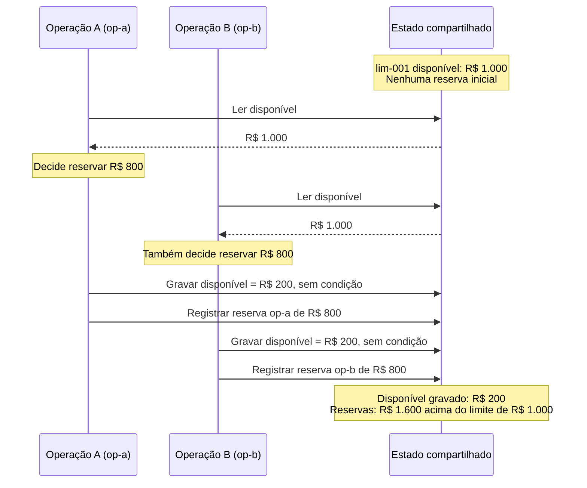

# 06 — Bancos, transações, consistência e escala

**ID:** F06. **Base:** [N04](../../references/README.md#n04) e [revisões das anotações](../../references/study-notes-revisions.md). **Revisão técnica:** 03/10/2026. Explicações, exemplos e exercícios são complementos autorais apoiados nas fontes indicadas.

**Objetivo:** explicar o que uma operação de dados garante, onde essa garantia termina e como proteger uma invariante quando operações concorrem.

**Ao terminar, você deve conseguir:**

- descobrir requisitos de acesso antes de escolher um banco e enunciar a **invariante** a proteger;
- diferenciar atomicidade, consistência, isolamento e durabilidade, e explicar **lost update** e **write skew**;
- separar consistência de leitura de controle de concorrência, e explicar locks e optimistic concurrency;
- separar **idempotência** (mesma operação repetida) de **concorrência** (operações diferentes);
- explicar índices e seus custos, CAP sem “escolha dois” e o DynamoDB sem generalizar NoSQL;
- escolher um mecanismo e **justificar o trade-off** em voz alta.

## Modelo mental

Cinco perguntas organizam o resto do módulo. Elas não são teoria nova: apenas dão nome ao que as seções já fazem. Volte a elas a cada exemplo.

| # | Pergunta | No cenário `lim-001` | Onde reaparece |
|---|---|---|---|
| 1 | **Qual é a autoridade?** Quem decide e registra o estado que vale | A linha/item de `lim-001` no core, não um extrato ou cache | [Autoridade × projeção](#autoridade-projecao), GSI, réplicas |
| 2 | **Qual é a invariante?** O que nunca pode ser violado | Reservado + consumido ≤ R$ 1.000 | Constraints, write skew, exercício |
| 3 | **Qual é a unidade atômica?** O que precisa confirmar junto | Identidade de `op-a` + reserva + contador | [Fronteira da transação](#fronteira-transacao), ACID |
| 4 | **Que outra operação pode concorrer?** | `op-b` (diferente) ou repetição de `op-a` (mesma) | Lock, CAS, isolamento, [idempotência × concorrência](#idempotencia-concorrencia) |
| 5 | **Que evidência prova o resultado?** | R$ 800 reservados, R$ 200 disponíveis, uma reserva por `operation_id` | Troubleshooting, “O que observar”, exercício |

## Roteiro de leitura

**Essencial:** modelo mental → padrões de acesso → modelos e constraints → exemplo de concorrência (inseguro, lock, versão, idempotência, timeout, fronteira) → ACID → isolamento e leituras → autoridade × projeção. Faça o exemplo com papel antes de escolher uma engine.

**Aprofundamentos:** indexação, write skew, CAP/BASE/PACELC e escopos do DynamoDB, com o mesmo cenário mapeado em Aurora/PostgreSQL, DynamoDB e multi-Region. Depois, troubleshooting, armadilhas, perguntas e exercício; não é necessário memorizar configurações de produção.

**Fronteira:** F06 explica índices, transações, locks, versões e consistência de uma operação. [SD02](../system-design/02-data-at-scale.md) combina esses mecanismos com capacidade, pooling, cache, réplicas e sharding. Outbox, idempotência de consumidores e coordenação entre autoridades estão em [SD03](../system-design/03-distributed-workflows.md).

**Natureza dos exemplos:** valores, IDs e intercalações são hipóteses didáticas, sem dados reais. O SQL e o pseudocódigo não foram executados; não há benchmark nem saída de `EXPLAIN` medida. Quando o comportamento depende da engine, usamos explicitamente PostgreSQL 18; isso não afirma que todo serviço gerenciado execute essa versão.

## Três dimensões diferentes

Separe **modelo e acesso** (como representar e consultar), **transação** (que mudanças precisam confirmar juntas) e **replicação** (qual cópia responde e com que atualidade). SQL é uma linguagem; NoSQL agrupa produtos diferentes. Esses rótulos não determinam sozinhos ACID, disponibilidade, escala ou consistência. DynamoDB oferece transações ACID, por exemplo. [Fonte T04](../../references/README.md#t04)

### Padrões de acesso antes da tecnologia

Uma pergunta útil é “consultar quais dados, para tomar qual decisão?”. “Armazenar pagamentos” ainda não descreve um workload.

| Descoberta | Exemplo sintético | Consequência para a decisão |
|---|---|---|
| Consultas e frequência | Consultar `op-a` por identidade; listar 50 lançamentos de uma conta por período | São acessos diferentes; uma chave eficiente para o primeiro não resolve necessariamente o segundo |
| Volume e crescimento | Quantidade de contas, lançamentos por conta, tamanho de cada registro e retenção | Estimar dados e índices; separar média, pico e concentração |
| Cardinalidade e distribuição | Milhões de contas, mas poucas concentram pedidos | Muitos valores distintos não garantem carga uniforme |
| Leitura/escrita e latência | Consultas frequentes; reserva de limite com prazo de resposta curto | Índices favorecem leitura e custam escrita; contenção pode dominar a latência |
| Consistência necessária | Extrato pode indicar atualização; reserva precisa verificar o limite vigente | Distinguir exibição de uma decisão autoritativa |
| Invariantes | Não reservar mais que o limite; não repetir o efeito de `op-a` | Determinar fronteira atômica, identidade e controle de concorrência |

Registre também consultas futuras plausíveis, recuperação e custo operacional. Normalização reduz redundância e facilita integridade; desnormalização pode reduzir joins, mas cria cópias que alguém precisa manter. “Flexível” não significa “sem regras”.

<a id="modelos"></a>
## Modelos de dados

| Modelo | Como pensar o acesso | Utilidade e limite |
|---|---|---|
| Relacional | Linhas relacionadas por chaves; consultas e joins | Reservas, contratos e reconciliação com relações explícitas; joins e transações ainda precisam de bons planos e fronteiras |
| Chave-valor (key-value) | Uma chave identifica um valor/item | Buscar uma operação por ID; consultas por outros atributos exigem outro caminho de acesso |
| Documento (document) | Um agregado contém campos e estruturas aninhadas | Ler uma proposta com seus componentes; duplicar dados entre documentos exige manutenção |
| Colunar largo (wide-column) | Grupos de registros organizados por chave de partição e ordenação interna | Histórico por entidade, como em Cassandra; não confundir com armazenamento colunar analítico |
| Grafo (graph) | Vértices e arestas representam relações a percorrer | Investigar conexões de fraude; não substitui automaticamente o armazenamento transacional da autorização |
| Série temporal (time series) | Tempo, dimensão e medida orientam consultas | Métricas por janela e retenção; o timestamp sozinho não identifica uma operação financeira |
| Em memória (in-memory) | O conjunto ativo é atendido principalmente da RAM | Baixa latência; persistência, replicação e perda tolerável dependem do produto e da configuração |

Os modelos podem coexistir: DynamoDB suporta chave-valor e documentos; um relacional também pode armazenar JSON. “Em memória” descreve principalmente uma escolha de armazenamento, não uma alternativa exclusiva aos outros modelos. Compare a operação necessária e seu contrato, não apenas o nome da categoria. [Componentes do DynamoDB][r-ddb-model]

### Chaves, constraints e invariantes

Considere uma linha de limite `lim-001` e reservas identificadas por operação. Valores monetários do exemplo usam centavos inteiros; não há conversão cambial nem arredondamento.

| Mecanismo | Exemplo | O que ainda falta |
|---|---|---|
| Primary key | `limit_id` identifica a linha de limite | Identidade de registro não impede operações distintas sobre o mesmo limite |
| Unique constraint | `UNIQUE(limit_id, operation_id)` impede duas reservas com a mesma identidade | Comparar a intenção: reutilizar `op-a` com outro valor não é repetição válida |
| Foreign key | A reserva referencia um limite existente | Existência não prova autorização nem disponibilidade de valor |
| Check constraint | `amount_centavos > 0`; contador disponível não negativo | Condição por linha não verifica automaticamente somas de outras linhas |

No PostgreSQL, primary key implica unicidade e ausência de nulos. Um `CHECK` aceita expressão verdadeira **ou nula**: use `NOT NULL` quando necessário. Não use `CHECK` como se validasse de forma segura um agregado de outras linhas. [Constraints][r-constraints]

A aplicação deve traduzir a invariante em operações protegidas pela engine. Um contador na linha do limite pode concentrar a decisão; contador e reserva precisam mudar na mesma transação. Validar apenas no código, antes da escrita, abre uma janela de concorrência. Constraints são uma defesa adicional, não uma descrição completa das regras de negócio.

## Cenário de concorrência

### Exemplo acompanhado: duas operações de R$ 800

**Hipótese:** `lim-001` começa com limite total de **R$ 1.000**, nada reservado ou consumido e, portanto, **R$ 1.000 disponíveis**. A (`op-a`) e B (`op-b`) são pedidos legítimos **diferentes**, de R$ 800 cada.

**Invariante:** “o total reservado/consumido não pode ultrapassar o limite disponível”. Aqui, esse limite é o orçamento autorizado de R$ 1.000; a disponibilidade **remanescente** é `total − reservado − consumido`. Uma mesma parcela não pode ser contada simultaneamente como reserva e consumo definitivo.

#### 1. O fluxo inseguro: read → decide → write

Pseudocódigo conceitual em centavos, não executado, sem lock nem condição na atualização:

```text
valor_lido = ler_disponivel("lim-001")
se valor_lido >= 80000:
    gravar_disponivel("lim-001", valor_lido - 80000)
    registrar_reserva(operation_id, 80000)
    responder_aprovado()
```



**Pergunta para treinar:** as duas leituras estavam corretas; onde está a falha? **Follow-up:** strongly consistent read resolveria isso?

| Passo | A: `op-a` | B: `op-b` | Efeito |
|---|---|---|---|
| 1 | Lê R$ 1.000 | — | A decide que pode reservar |
| 2 | — | Lê R$ 1.000 | B também decide que pode reservar |
| 3 | Grava R$ 200; registra R$ 800 | — | A conclui |
| 4 | — | Grava R$ 200; registra R$ 800 | B sobrescreve o disponível com cálculo antigo |

O registro de disponibilidade termina em R$ 200, mas foram admitidas reservas de R$ 1.600. É uma atualização perdida (**lost update**) combinada com violação da invariante entre registros. Mesmo leituras fortes podem retornar R$ 1.000 se ambas ocorrerem antes da primeira escrita. Cada chamada isolada correta não torna atômica a sequência inteira.

Envolver a sequência em uma transação, sem escolher isolamento ou proteção adequados, também não basta. Na variação com `READ COMMITTED` do PostgreSQL, uma escrita que atribui o valor constante calculado antes pode sobrescrever a anterior depois de esperar pelo lock da atualização.

#### 2. Estratégia pessimista: proteger a decisão antes de ler

**Desenho didático para PostgreSQL 18, `READ COMMITTED`:** todos os caminhos que alteram esse limite usam a mesma linha de coordenação.

1. A inicia a transação e obtém `SELECT ... FOR UPDATE` na linha `lim-001`.
2. Dentro dela, consulta a identidade da operação. Se já existe, verifica a intenção e devolve o resultado registrado, sem nova reserva.
3. Caso novo, verifica os R$ 1.000, atualiza o contador, insere a reserva com chave única e confirma tudo junto.
4. B tenta bloquear a mesma linha e espera. Após o commit de A, obtém a versão com R$ 200 disponíveis.
5. B recusa a nova reserva por insuficiência; não há motivo para retry imediato dessa regra de negócio. Se o contrato exige repetir também recusas, registra a decisão pela mesma identidade, sem criar reserva.

O conflito é sobre a **linha compartilhada**, embora os IDs sejam diferentes. O lock bloqueia escritores e lockers conflitantes até o fim da transação; um `SELECT` comum sob MVCC não fica automaticamente impedido de ler. Um deadlock ocorre, por exemplo, quando A segura X e espera Y, enquanto B segura Y e espera X; PostgreSQL aborta uma das transações para desfazer o ciclo. Transações curtas e ordem consistente de aquisição reduzem esse risco. Não segure o lock enquanto chama um serviço externo. [Locks do PostgreSQL][r-locks]

**Falha inserida:** A cai depois de alterar o contador, antes do commit. Sem commit, a transação deve ser desfeita; B não pode tratar a reserva incompleta como confirmada. Se A cai **após** o commit e antes da resposta, o cliente não sabe o resultado: consulte/reenvie a mesma identidade sob o protocolo de idempotência. Timeout não prova rollback.

#### 3. Estratégia otimista: detectar mudança no momento da escrita

A e B podem ler `version = 7`. A atualização condiciona a mudança à versão esperada e ao orçamento ainda disponível. Este SQL PostgreSQL ilustra **apenas a primitiva de concorrência**, não uma implementação completa de reserva:

```sql
-- Ilustrativo; não executado. R$ 800 = 80000 centavos.
UPDATE credit_limit
SET reserved_centavos = reserved_centavos + 80000,
    version = version + 1
WHERE limit_id = 'lim-001'
  AND version = 7
  AND total_centavos - reserved_centavos - consumed_centavos >= 80000
RETURNING version;
```

A altera a versão para 8. B não encontra mais a versão 7 e afeta zero linhas. A aplicação precisa inspecionar esse resultado: pode ser conflito de versão, entidade ausente ou falta de limite. Releia e **refaça a decisão**; neste cenário, restaram R$ 200, então B deve ser recusada. No PostgreSQL `READ COMMITTED`, uma atualização concorrente pode esperar e reavaliar o `WHERE` sobre a versão atualizada. [Isolamento da engine][r-isolation]

Compare-and-swap (CAS) significa “troque apenas se o estado ainda for o esperado”. A versão detecta alteração concorrente mesmo quando o valor volta ao anterior; todos os escritores participantes precisam mantê-la corretamente. Quando toda a regra cabe no predicado atômico, uma atualização condicional pode dispensar uma leitura prévia e até a versão. No DynamoDB, `ConditionExpression` é o mecanismo correspondente para condicionar a escrita de um item. [Escritas condicionais][r-conditions]

Registrar a identidade da operação e modificar o limite continuam exigindo uma unidade atômica. Um desenho possível insere primeiro o registro único da operação na transação, aplica a atualização condicional e confirma ambos; se a condição falhar, desfaz a tentativa e classifica o motivo. Se a identidade já existir, recupera o resultado anterior em vez de executar a atualização de novo. Quando o contrato exige memorizar uma recusa definitiva, essa decisão também precisa ser registrada; conflito transitório de versão não é recusa de negócio. O trecho SQL sozinho **não** implementa esse protocolo.

#### 4. Escolha, recuperação e repetição

| Aspecto | Lock/transação | Atualização condicional/versão |
|---|---|---|
| Quando detectar conflito | Antes de decidir, aguardando acesso à linha | Na tentativa de modificar o estado |
| Custo | Espera, locks e possíveis deadlocks | Tentativas descartadas e releituras sob contenção |
| Boa aplicação | Regra concentrada, decisão curta e coordenação clara | Predicado expressável atomicamente; conflitos administráveis |
| Limite | Bloquear uma linha não protege dados fora do protocolo | CAS de um item não transforma escritas independentes em transação |

Retry é aceitável para conflito transitório quando a tentativa anterior foi abortada ou sua identidade permite recuperar o resultado. Use limite de tentativas, prazo total e espaçamento; não repita indefinidamente durante contenção. No PostgreSQL, um erro de serialização pede retry da **transação completa**, incluindo a lógica que escolheu os valores, não só do último comando. [Tratamento de falhas][r-retry]

Se B fosse uma repetição de **`op-a`**, o problema seria também idempotência: devolver o mesmo resultado sem consumir outros R$ 800. Com limite maior, duas repetições poderiam satisfazer o predicado e consumir duas vezes; só verificar disponibilidade não basta. Inversamente, deduplicar `op-a` não impede `op-b` de disputar o mesmo orçamento.

<a id="idempotencia-concorrencia"></a>
#### 5. Idempotência × concorrência

São dois problemas que se confundem porque ambos aparecem como “duas requisições ao mesmo tempo”.

| | Idempotência | Concorrência |
|---|---|---|
| Pergunta | Esta é a **mesma** operação de novo? | Operações **diferentes** disputam o mesmo estado? |
| Exemplo | `op-a` + `op-a` | `op-a` + `op-b` |
| Garantia buscada | A mesma identidade não cria novo efeito; devolve o resultado registrado | Cada decisão vê o estado correto e a invariante se mantém |
| Mecanismo típico | Identidade estável + unicidade/registro de resultado na autoridade | Lock, atualização condicional/versão, isolamento adequado |
| Não resolve | Duas operações legítimas disputando R$ 1.000 | Uma repetição que consome o orçamento duas vezes |

**Pergunta de treino:** `UNIQUE(operation_id)` resolve as duas reservas de R$ 800? **Não.** `op-a` e `op-b` têm identidades diferentes, então a constraint não conflita e as duas passam por ela. O que protege o limite é o lock ou a condição sobre `lim-001`. A constraint só responde à pergunta “já vi esta operação?”. Os dois mecanismos se somam; nenhum substitui o outro.

<a id="timeout-nao-e-rollback"></a>
#### 6. Timeout não é rollback

```text
cliente envia op-a
        ↓
core confirma o commit (reserva de R$ 800 existe)
        ↓
a resposta se perde
        ↓
cliente vê timeout
```

**Pergunta:** o cliente pode criar uma nova operação para “garantir”? **Não automaticamente.** Um novo `operation_id` seria outra operação e poderia reservar outros R$ 800. Primeiro investigue o resultado pela **identidade original**, ou repita a mesma operação sob um contrato idempotente.

| Situação | O que se sabe | Reação adequada |
|---|---|---|
| Timeout / resultado desconhecido | O commit pode ou não ter ocorrido | Consultar ou repetir pela mesma identidade; não criar outra operação |
| Abort conhecido (rollback, deadlock, falha de serialização) | A tentativa **não** confirmou | Retry da transação completa, com limite e prazo |
| Rejeição de negócio (`limite insuficiente`) | A decisão foi tomada e é definitiva para aquela entrada | Não repetir; devolver o motivo. Registrar a decisão se o contrato exigir |

Os mecanismos de timeout, retry e contrato HTTP estão em [F02](02-http-rest-openapi.md) e [F07](07-events-messaging-distributed-systems.md); aqui interessa apenas o ponto de dados: **só a autoridade sabe o resultado**.

<a id="fronteira-transacao"></a>
#### 7. Fronteira da transação

```text
DENTRO da mesma transação (pode confirmar junto)      FORA (não entra automaticamente)
─────────────────────────────────────────────────     ─────────────────────────────────
identidade da operação (op-a)                         chamada HTTP a serviço externo
+ reserva / atualização do contador de lim-001        publicação em SQS ou outro broker
+ resultado local registrado                          outro microserviço, com seu próprio banco
                                                      terceiro (parceiro, câmara, adquirente)
```

`COMMIT` torna atômico o que a engine controla. Se a aplicação chama um serviço depois do commit e cai antes de chamar, ou chama antes e a transação aborta, o efeito externo e o interno divergem. O caminho seguro é registrar a **intenção** dentro da transação e executar o efeito externo depois, com identidade estável: [outbox e inbox em SD03](../system-design/03-distributed-workflows.md#transactional-outbox) e [saga](../system-design/03-distributed-workflows.md#saga). Aqui basta saber que a garantia ACID termina na fronteira do banco que executou o commit.

### Problema → mecanismo

Use como mapa de perguntas, não como receita universal: cada mecanismo resolve um pedaço e deixa outro de fora.

| Problema | Mecanismo possível | O que ele NÃO resolve sozinho |
|---|---|---|
| Mesma operação repetida | Idempotência / identidade única | Concorrência entre operações diferentes |
| Duas operações disputam um valor | Lock / escrita condicional (CAS) | Efeitos externos; regras que dependem de outros itens |
| Várias mudanças devem confirmar juntas | Transaction | Coordenação entre serviços ou bancos distintos |
| Leitura pode estar desatualizada | Contrato de leitura mais forte | Exclusão mútua depois da leitura |
| Regra depende de um conjunto de linhas | Linha de coordenação ou isolamento serializável | Efeitos externos; custo de aborto e retry |
| Query lenta | Índice | Workload mal modelado; custo extra de escrita |

**Conexão FSI:** o [Case 10, modelo de dados](../../cases/10-card-authorization-platform.md#s08) mantém a decisão financeira e a reserva no core. O exemplo explica um mecanismo dentro da autoridade pertinente, sem transferi-la para cache ou banco auxiliar. No [Case 03](../../cases/03-event-driven-banking.md#s01), limite operacional é distinto de saldo, e débito/crédito continuam uma operação atômica do core. Não estamos implementando um ledger.

<a id="acid-cap"></a>
## ACID não significa executar tudo uma transação por vez

Use a mesma transação de `op-a`: registrar sua identidade, reservar R$ 800 e atualizar o contador de `lim-001`.

| Propriedade | Aplicação à transação | O que não promete |
|---|---|---|
| Atomicity | Registro e contador confirmam juntos ou não deixam efeitos confirmados parciais | Não inclui automaticamente uma chamada externa ou uma mensagem fora da transação |
| Consistency | Preserva regras: reserva positiva, identidade única e orçamento respeitado | A engine não adivinha regras que ninguém expressou ou protegeu |
| Isolation | Controla interações que A e B podem observar e realizar | Não implica execução física de uma transação por vez |
| Durability | O commit sobrevive às falhas cobertas pela configuração e pelo sistema | Não cobre qualquer desastre, exclusão lógica ou perda de todas as cópias |

`BEGIN`/`COMMIT` delimitam a unidade; rollback abandona uma tentativa não confirmada. Após commit, uma reversão de negócio é outra operação, não apagamento do passado. [Transações PostgreSQL][r-transactions]

**Aprofundamento — durabilidade:** write-ahead logging (WAL) registra alterações antes de depender das páginas de dados finais para recuperação. O que precisa chegar ao armazenamento durável antes do ACK depende da configuração. No PostgreSQL, `synchronous_commit = off` pode confirmar antes do flush local; `on` e modos remotos têm outros contratos. “Recebi sucesso” só é uma garantia útil quando sabemos o que esse sucesso confirma. [Configuração de WAL][r-wal]

### Concorrência: o que cada anomalia revela

| Anomalia | Pequena intercalação | Pergunta para investigação |
|---|---|---|
| Dirty read | B lê reserva não confirmada de A; A aborta | B decidiu sobre estado que nunca virou commit? |
| Non-repeatable read | B lê uma linha; A confirma mudança; B relê outro valor | B precisava de uma visão estável? |
| Phantom read | B consulta reservas; A insere outra; B repete e recebe outro conjunto | A regra depende de um predicado? |
| Lost update | A e B calculam sobre o mesmo valor; B substitui o efeito de A | A atribuição usou uma leitura antiga? |
| Write skew | A e B verificam o orçamento em snapshots e inserem linhas distintas | Existe conflito lógico sem disputa pela mesma linha? |

As anomalias e a diferença entre snapshot isolation e serialização são discutidas por [Berenson et al.][r-anomalies]. Os exemplos são adaptações didáticas.

**Aprofundamento — write skew:** suponha que só existam linhas de reservas, sem contador comum. A e B leem soma zero, verificam `soma + 800 <= 1000` e inserem linhas distintas. Um snapshot estável pode permitir que ambas confirmem: cada tentativa julgou o mesmo orçamento livre. `UNIQUE(operation_id)` não conflita, pois os IDs são diferentes. Uma linha de coordenação, proteção adequada do predicado ou serialização podem resolver, com custos diferentes.

### MVCC, locks e níveis de isolamento

MVCC — multiversion concurrency control — mantém versões e regras de visibilidade: a leitura escolhe quais versões pertencem ao seu snapshot. Enquanto A altera `lim-001` sem confirmar, um leitor pode observar a versão anterior confirmada, sem dirty read nem espera pelo fim de A. Isso reduz bloqueios entre consultas e atualizações, mas não elimina conflitos de escrita nem todos os locks. Versões antigas também precisam de manutenção. É um mecanismo; não é sinônimo de `SERIALIZABLE`. [Introdução ao MVCC][r-mvcc]

A tabela descreve **PostgreSQL 18**, não todos os bancos com os mesmos nomes. Consulte o isolamento da leitura e a reação à escrita concorrente. [Documentação da engine][r-isolation]

| Nível solicitado | Comportamento no PostgreSQL 18 | Consequência |
|---|---|---|
| Read Uncommitted | Funciona como Read Committed | Não habilita dirty reads |
| Read Committed | Snapshot por comando | Consultas sucessivas podem divergir |
| Repeatable Read | Snapshot estável; impede também phantoms | Ainda pode admitir write skew |
| Serializable | Resultados equivalentes a uma ordem serial | Pode abortar tentativas incompatíveis |

Escolha a proteção da invariante, não o nome mais forte por reflexo. Para o orçamento de uma linha, a atualização condicional pode ser suficiente. Para regras envolvendo vários conjuntos, a complexidade de coordenar locks pode justificar serialização. Meça abortos, espera e latência; retries sem limite podem piorar a sobrecarga. Verifique também o nível efetivamente usado pela conexão, e não apenas o padrão que alguém supôs.

**Pergunta de treino:** se eu aumentar o isolamento para `SERIALIZABLE`, resolvi tudo? **Não.**

- Oferece equivalência a alguma ordem serial **para o conjunto de transações que participam desse isolamento**, o que cobre anomalias como o write skew de linhas distintas. Elevar só um caminho para `SERIALIZABLE` não torna segura sua interação com outro caminho que altere a mesma invariante com proteção mais fraca: todos os caminhos que a modificam precisam usar `SERIALIZABLE` ou um mecanismo equivalente que preserve o protocolo.
- Faz isso **abortando** tentativas incompatíveis (SQLSTATE `40001`). A aplicação precisa tratar o erro e repetir a transação completa, inclusive a lógica que tomou a decisão; a documentação do PostgreSQL diz que quem usa esse nível deve estar preparado para retry. [Serializable e retry][r-isolation]
- Não cobre efeitos fora da transação: HTTP, mensagem ou outro serviço continuam fora da garantia. Também não é “exactly-once”: uma repetição da mesma operação continua pedindo idempotência.
- Sob contenção, mais abortos significam mais trabalho descartado; meça antes de adotar como padrão.

### Consistência de leitura não é isolamento entre decisões

| Garantia/conceito | O que o cliente pode esperar | Limite |
|---|---|---|
| Strong consistency | No contrato linearizável de um item, leitura respeita escritas concluídas antes de começar; pode observar escrita concorrente | Não reserva o valor nem congela mudanças futuras |
| Eventual consistency | Sem novas escritas e com propagação/reconciliação concluídas, cópias convergem | Não fornece, por si, prazo máximo de defasagem |
| Read-your-writes | A sessão não lê uma visão anterior às próprias escritas confirmadas | Pode observar mudanças posteriores de outros clientes |
| Monotonic reads | A sessão não retrocede na informação já observada ao trocar de réplica | Não obriga a primeira leitura a ser a mais recente |
| Stale read | Resposta anterior a alguma atualização já confirmada no escopo de interesse | Sua admissibilidade depende do contrato |

As garantias de sessão não equivalem a transações: [Terry et al.][r-session] tratam read-your-writes e monotonic reads. A engine/API define o escopo da leitura forte; para DynamoDB, veja [consistência de leitura][r-ddb-read].

<a id="autoridade-projecao"></a>
### Autoridade × projeção

```text
ESTADO AUTORITATIVO                      MODELO DE LEITURA / PROJEÇÃO
(onde a operação foi decidida)    ───►   (extrato, busca, dashboard, GSI, cache)
transferência confirmada no core         ainda não ingerida → extrato atrasado
```

Uma leitura forte de uma **projeção** só vê o que já chegou a ela. “Forte” descreve a atualidade **em relação àquela cópia**, não em relação ao core. Por isso a ausência na projeção **não prova** que a operação não existe: pode ser atraso de propagação, filtro, falha de ingestão ou índice eventual. Perguntas de investigação: qual é a autoridade desta informação? A pergunta que o cliente fez precisa da decisão (consulte a autoridade pela identidade) ou da exibição (a projeção atrasada é aceitável, se a tela diz que está em atualização)?

A diferença entre autoridade e modelo de consulta está em [SD03, CQRS](../system-design/03-distributed-workflows.md#cqrs); o [Case 09](../../cases/09-multi-region-internet-banking.md#s08) mostra como comunicar um extrato em atualização sem negar um resultado financeiro confirmado.

<a id="indexacao"></a>
## Indexação

**Leitura essencial:** índice é uma estrutura de acesso adicional. Pode poupar buscas e ordenações, mas ocupa espaço e precisa acompanhar escritas. Compare o que a consulta lê com o que devolve; escolher índice não altera, por si, a autoridade dos dados.

**Aprofundamento com PostgreSQL 18:** uma B-tree organiza chaves em ordem e permite localizar uma faixa, depois percorrê-la. Atende igualdade, intervalos e algumas ordenações. Um índice hash atende igualdade; não oferece o mesmo percurso ordenado por faixa. Tipo, operadores e consulta precisam ser compatíveis. [Tipos de índice][r-index-types]

### Cenário: o extrato

```sql
-- Ilustrativo; não executado.
SELECT entry_id, occurred_at, amount_centavos
FROM ledger_entry
WHERE account_id = ?
  AND occurred_at BETWEEN ? AND ?
ORDER BY occurred_at, entry_id;
```

**Pergunta:** qual padrão de acesso estamos tentando otimizar? Antes de criar qualquer índice, responda: quantas linhas essa consulta devolve (uma página de 50 ou o ano inteiro)? Com que frequência roda? Há contas muito maiores que as outras? A tabela recebe escritas contínuas? Só depois olhe o desenho.

### Composição, seletividade e ordem

Para o extrato acima, um índice B-tree em `(account_id, occurred_at, entry_id)` agrupa as entradas de uma conta, permite localizar o início do período e percorrer a faixa já na ordem pedida, sem ordenação separada. A ordem das colunas vem do workload: igualdade primeiro (`account_id`), faixa e ordenação depois. Se o planner ainda escolher outro caminho, o motivo está nas estatísticas e na distribuição, não numa regra fixa; a hipótese se confirma com `EXPLAIN`, como em “Ler o plano”, abaixo. O custo de escrita desse índice entra na decisão (veja “Cobertura e custo de manutenção”). A ordem deve seguir filtros, faixas, joins e ordenação do workload; “coloque sempre a coluna mais seletiva primeiro” também é uma simplificação.

**Cardinalidade** é a quantidade de valores distintos; **seletividade do predicado** é quanto ele restringe o conjunto. Uma coluna com muitos valores pode ter uma conta excepcionalmente frequente. Estatísticas desatualizadas ou distribuição desigual podem levar o planner a estimar mal o trabalho.

Um índice `(A, B)` **não é inutilizável só porque A não está no filtro**. No PostgreSQL 18, o planner pode considerar acesso por B, inclusive skip scan em situações favoráveis, como poucos valores distintos de A. Isso não garante eficiência: percorrer grande parte do índice pode custar mais que varrer a tabela. Confirme engine, versão, estatísticas e plano. [Índices compostos][r-multicolumn]

### Cobertura e custo de manutenção

Um covering index contém os dados exigidos pela consulta. No PostgreSQL, `INCLUDE` adiciona colunas como payload, sem torná-las chaves de busca. Mesmo com cobertura, um index-only scan pode precisar consultar o heap para verificar visibilidade MVCC quando a página não estiver marcada como totalmente visível no visibility map. Não prometa “zero leitura da tabela”. [Index-only scans][r-index-only]

Adicionar colunas e índices amplia armazenamento, WAL e trabalho de manutenção. Atualizações frequentes podem diminuir o benefício de cobertura. Um índice útil para o extrato pode ser ruim para ingestão se seu ganho de leitura não compensar a escrita; avalie os dois caminhos.

### Ler o plano para testar uma hipótese

No PostgreSQL, `EXPLAIN` mostra o plano estimado; `EXPLAIN ANALYZE` executa a consulta e mede seu comportamento. Custos estimados não são milissegundos. Compare estimativa/linhas efetivas, filtros, ordenação, loops e buffers; um sequential scan pode ser apropriado. Nenhum plano foi executado para este módulo. [Using EXPLAIN][r-explain]

A aplicação desses sinais ao extrato, à paginação e à capacidade fica em [SD02](../system-design/02-data-at-scale.md#consultas-e-conexões-antes-de-adicionar-nós).

## CAP sem o atalho perigoso

Uma **partition** de rede impede grupos de nós de trocar as mensagens necessárias; não é particionar uma tabela. No CAP, consistência é **linearizability**: cada operação parece ocorrer em um instante entre pedido e resposta, respeitando a ordem real das operações não sobrepostas. Disponibilidade exige que pedidos a nós não falhos terminem com resposta conforme o serviço; não é apenas um percentual de uptime, nem “sempre devolver um erro rapidamente”. [Gilbert e Lynch][r-cap]

**Experimento mental:** a região X confirmou `version = 8`, mas a comunicação com Y foi interrompida. Y só conhece 7. Responder imediatamente com 7 viola a leitura linearizável; esperar até conseguir a informação pode sacrificar disponibilidade durante a partição. Um protocolo pode continuar atendendo um lado com quórum e bloquear o outro, sem garantir atendimento em **todos** os nós não falhos.

O dilema aparece durante a partição. Fora dela ainda existem custos de coordenação, mas “escolha dois de três” não é uma classificação universal de SQL/NoSQL. **ACID Consistency preserva invariantes de estado; CAP Consistency ordena a observação das operações distribuídas.** Consulte também a revisão de Brewer em [T05](../../references/README.md#t05).

### Não diga isso na entrevista

- “CAP é escolha dois de três.”
- “SQL é CP e NoSQL é AP.”
- “A Consistency do ACID é a Consistency do CAP.”
- “Eventually consistent significa dado incorreto.”
- “BASE é o oposto de ACID.”

### Formulação melhor

- **CAP:** sob partições, um serviço de leitura/escrita replicado não pode garantir simultaneamente linearizabilidade e atendimento de todos os pedidos aos nós não falhos. Isso não proíbe que algumas operações sejam atendidas corretamente durante a partição; o dilema aparece sob partição, e o que se sacrifica depende do protocolo.
- **SQL × NoSQL:** o contrato vem do produto, do modo e da configuração, não do rótulo.
- **Dois “C”:** ACID Consistency preserva invariantes de estado; CAP Consistency ordena a observação entre cópias.
- **Eventual:** o dado pode estar defasado, não errado; sem novas escritas, as cópias convergem, e quanto tempo isso leva é uma pergunta de contrato.
- **BASE:** vocabulário para operação parcial e convergência, usado em partes do sistema; não nega transações locais.

<a id="base-pacelc"></a>
## BASE e PACELC

**BASE** — basically available, soft state, eventually consistent — ajuda a pensar em operação parcial e convergência: uma cópia pode mudar por propagação mesmo sem novo pedido local. É uma abordagem, não um protocolo que resolve conflitos ou prova uma invariante. O artigo de [Dan Pritchett][r-base] é uma referência histórica; sua oposição retórica entre ACID e BASE não deve ser aplicada como classificação absoluta dos produtos atuais.

Um sistema pode confirmar a reserva numa transação local e atualizar o extrato de forma eventual. É preciso especificar quem propaga, como conflitos são tratados e como se detecta atraso; “eventualmente” não substitui recuperação. O exemplo não autoriza aceitar duas reservas conflitantes esperando corrigir o dinheiro depois.

**PACELC** acrescenta a pergunta da operação normal: se houver partição (**P**), como se equilibram disponibilidade (**A**) e consistência (**C**); caso contrário (**E**, else), qual o compromisso entre latência (**L**) e consistência (**C**)? Esperar comunicação entre regiões afeta o tempo de resposta mesmo com rede saudável. [Daniel Abadi][r-pacelc]

Não presuma que partições sejam raras em todo ambiente ou que todo acesso de um banco faça a mesma escolha. BASE e PACELC orientam perguntas; não especificam isolamento, durabilidade, resolução de conflitos ou o comportamento completo de uma API.

### DynamoDB: delimitar a garantia

**Aprofundamento aplicado:** partition key direciona a distribuição; numa chave composta, partition key + sort key identificam o item. A sort key ordena itens de uma mesma chave de partição. Um `Query` exige a partition key e pode restringir a sort key; não é um join arbitrário. Um global secondary index (GSI) permite outra chave de acesso; um local secondary index (LSI) conserva a partition key e muda a sort key. [Modelo de acesso][r-ddb-model]

| Recurso | Garantia útil | Fronteira |
|---|---|---|
| Conditional write | Só modifica o item se a condição for satisfeita | A condição deve expressar a regra; não protege automaticamente outros itens |
| `TransactWriteItems` | Confirma ou desfaz o conjunto de escritas/condições | Escopo de conta e região; não inclui API externa |
| `TransactGetItems` | Leitura atômica do conjunto solicitado | Várias leituras individuais fortes não equivalem automaticamente a esse conjunto |
| Leitura de tabela ou LSI | Eventual por padrão; opção fortemente consistente | Não bloqueia escritores após a leitura |
| GSI | Outro acesso por chave, mantido a partir da tabela | Propagação e leituras eventuais; não aceita leitura forte |

Fontes: [condições][r-conditions], [APIs transacionais][r-ddb-tx], [leituras][r-ddb-read] e [GSI][r-gsi]. Um GSI pode localizar candidatos pendentes; uma decisão posterior deve validar o estado atual e condicionar a mudança na base. Um resultado ausente no índice não prova inexistência na tabela, como explica o [Case 01](../../cases/01-payment-processing-pix.md#s08).

#### Global tables: MREC e MRSC

Contratos conferidos em **03/10/2026**, para global tables versão 2019.11.21. [Documentação AWS][r-global]

| Modo | Replicação e leitura | Limites relevantes |
|---|---|---|
| MREC — multi-Region eventual consistency, padrão | Assíncrona; conflitos por item usam last writer wins. Leitura forte e condições têm escopo regional | Transação é atômica na origem, mas não é replicada como unidade |
| MRSC — multi-Region strong consistency | Confirma após replicar sincronamente para pelo menos outra região; leitura forte solicitada e condições usam a versão mais recente | Três regiões: três réplicas, ou duas e um witness sem API de dados; sem transações, TTL ou LSI |

MRSC opera em conjuntos regionais autorizados nos EUA, Europa e Ásia-Pacífico, sem cruzá-los; São Paulo não está na lista consultada. O modo não é alterável depois da criação. Escritas concorrentes podem gerar `ReplicatedWriteConflictException`. A AWS documenta RPO zero para MRSC; isso não transforma uma jornada financeira em transação global.

**Consequência para os cases:** substituir MREC por MRSC exige rever regiões, APIs e modelo de dados. Não é uma opção transparente para o fluxo transacional do [Case 01, disponibilidade](../../cases/01-payment-processing-pix.md#s15). Nenhum dos modos desloca a autoridade financeira do core nos Cases 03 e 10.

#### O que preciso lembrar para entrevista

- Leitura de tabela e de LSI pode ser **fortemente consistente** (`ConsistentRead`); a de GSI é **sempre eventual**.
- **Strong read não é lock:** nada impede que outro escritor altere o item logo depois.
- **Conditional write** protege o item e o predicado que a condição expressa; não protege outros itens nem regras que ela não menciona.
- **Transação tem escopo:** até 100 ações sobre itens distintos da mesma conta e região; não opera por índices; não inclui API externa. [APIs transacionais][r-ddb-tx]
- **Global tables têm contratos específicos** por modo: MREC ≠ MRSC.
- **Consistência multi-Region ≠ transação financeira global:** a garantia é sobre a replicação do item, não sobre a jornada.

## O mesmo cenário em serviços AWS

“Como esse conceito aparece em serviços AWS?” Três mapeamentos curtos de `lim-001`; não são tutoriais nem listas de configuração.

### A. Aurora PostgreSQL

| Conceito | Como aparece no cenário | Cuidado |
|---|---|---|
| Lock pessimista | Dentro da transação, `SELECT ... FOR UPDATE` em `lim-001`; B espera e relê a versão confirmada por A | Segure a transação pouco tempo; nada de chamada externa com o lock aberto |
| Unidade atômica | `INSERT` da identidade + `UPDATE` do contador + resultado no mesmo `COMMIT` | Efeitos fora do banco continuam fora |
| Versão otimista | `UPDATE ... WHERE version = 7 AND disponível >= 80000`, inspecionando linhas afetadas | Zero linhas pode ser conflito, ausência ou falta de limite |
| Isolamento | Escolha pela anomalia que a regra teme; erro `40001` pede retry da transação inteira | Aurora é compatível com PostgreSQL, mas a tabela de níveis deste módulo vem da documentação do PostgreSQL 18; confirme versão e comportamento no serviço antes de afirmar equivalência |

### B. DynamoDB

| Conceito | Como aparece no cenário | Cuidado |
|---|---|---|
| Escrita condicional | `UpdateItem` em `lim-001` com `ConditionExpression` como `available_centavos >= :valor` | A condição compara atributos e valores; a aritmética fica na `UpdateExpression`. Mantenha o atributo derivado apenas por esse caminho |
| Unidade atômica | `TransactWriteItems` com um `Put` da operação (`attribute_not_exists` na chave) e um `Update` condicional em `lim-001` | Não se pode alvejar o mesmo item duas vezes na transação. Se a transação for cancelada, interprete os motivos como descrito abaixo |
| Identidade já existe | A condição do `Put` da operação falha; leia o item com `ConsistentRead` e **compare a intenção** antes de decidir | Mesmo `operation_id` com intenção compatível: recupere o resultado anterior. Valor ou intenção diferente: conflito de identidade, não repetição válida |
| Retry da própria chamada | `ClientRequestToken` na `TransactWriteItems` | Veja “Três coisas que não se misturam” |
| Leitura forte | `GetItem` com `ConsistentRead` mostra R$ 1.000 para A e B se ambos leem antes da primeira escrita | Não é exclusão mútua |
| GSI | Localiza candidatos, por exemplo reservas pendentes | Eventual e sem transação por índice; ausência no GSI não prova inexistência. Valide na tabela |
| Item compartilhado | Todo pedido do limite passa por um único item `lim-001` | Concentração de tráfego pode causar contenção e throttling: [SD02](../system-design/02-data-at-scale.md#particionamento) |

**Três coisas que não se misturam**

1. **`ClientRequestToken`:** dá idempotência à **chamada de API** `TransactWriteItems`. Por contrato documentado, o token vale por 10 minutos após o término da primeira solicitação que o usou; uma chamada idêntica nessa janela não é tratada como nova execução normal das escritas, e mudar parâmetros dentro dela gera `IdempotentParameterMismatch`. Não é idempotência financeira permanente: após a janela, o token vira uma solicitação nova, e a identidade de negócio precisa de retenção durável própria.
2. **`Put` condicional da identidade:** detectar que `op-a` já existe não prova repetição válida; é preciso comparar a intenção (ver tabela).
3. **`CancellationReasons`:** `ConditionalCheckFailed` sozinho não diz o motivo de negócio. Considere o código, a **posição** da ação na lista de itens (os motivos seguem essa ordem) e o predicado que falhou: falha no `Put` da identidade → investigar operação existente e intenção; falha no `Update` do limite → investigar o predicado financeiro. Classificar o motivo de negócio é responsabilidade da aplicação, e a forma como os detalhes são expostos varia por SDK.

Fontes: [transações e idempotência][r-ddb-tx], [condições][r-conditions], [leituras][r-ddb-read]. As operações descritas não foram executadas.

### C. Multi-Region (global tables)

| Modo | O que acontece com A e B se chegam a regiões diferentes | Lição |
|---|---|---|
| MREC | **Cenário derivado dos contratos documentados, não uma execução oficial:** a replicação é assíncrona e as condições têm escopo regional. Se ambas as avaliações locais ocorrerem antes de cada região receber a alteração da outra, as duas reservas podem ser aceitas; o conflito por item usa *last writer wins*, e um efeito pode ser sobrescrito. Não há ordem de propagação nem região vencedora definidas | Condição local e leitura forte regional não coordenam regiões; a transação também só é atômica na origem |
| MRSC | Escrita confirmada após replicação síncrona; condição e leitura forte pedida usam a versão mais recente; escritas concorrentes podem gerar `ReplicatedWriteConflictException` | Protege a **versão do item**, não a jornada; sem transações, o par identidade + contador precisa de outro desenho |

Replicação é um contrato sobre cópias de itens. Ela não vira transação global nem substitui a autoridade do core. Detalhes e restrições na tabela de [global tables](#global-tables-mrec-e-mrsc).

## Troubleshooting por hipótese

Formato: **hipótese → evidência → decisão**. Não há métricas medidas aqui; os sinais são o que você procuraria. Medição e alarmes: [F08](08-observability-troubleshooting.md).

### Cenário 1: CPU do banco alta no pico

Primeiro separe dois quadros: **CPU alta** indica trabalho consumindo CPU; **sessões ativas esperando** (lock, I/O) elevam latência e *database load* sem serem, por si, a origem do consumo de CPU. Uma sessão ativa ou está na CPU ou espera um recurso, então os sintomas podem coexistir, e correlação não prova causalidade. [Database load][r-dbload]

Perguntas, em ordem: houve mudança de workload? Quais queries aumentaram execução ou trabalho? O plano mudou? A concorrência aumentou? Retries amplificaram a carga? Existem waits relevantes, e eles explicam latência, CPU ou ambos? Sinais possíveis: métricas de CPU, database load, sessões ativas, wait events, estatísticas por query, planos e correlação temporal.

| Hipótese | Evidência a buscar | Decisão |
|---|---|---|
| Query nova ou mudou de plano | Estatísticas por query (por exemplo `pg_stat_statements`, se habilitada) e `EXPLAIN` da consulta dominante | Índice ou reescrita, comparando custo de escrita |
| Falta ou excesso de índice | Varreduras grandes para poucas linhas; escrita lenta com muitos índices | Ajustar conforme o padrão de acesso |
| Conexões demais | Muitas sessões ativas competindo por CPU | Limitar concorrência: pooling em [SD02](../system-design/02-data-at-scale.md#consultas-e-conexões-antes-de-adicionar-nós) |
| Waits por lock (podem explicar latência, não necessariamente CPU) | Wait events de lock dominando o database load; sessões esperando em vez de executando | Encurtar transações; revisar ordem de aquisição |
| Mudança de workload | Novo release, campanha, relatório no horário de pico | Separar o trabalho ou limitar o novo tráfego |
| Waits de I/O (idem) | Leitura de disco acima do normal, waits de leitura nos wait events | Reduzir dados lidos antes de aumentar capacidade; verifique se explicam a latência, a CPU ou ambos |

### Cenário 2: muitos serialization failures

| Hipótese | Evidência a buscar | Decisão |
|---|---|---|
| Transações demais disputando as mesmas linhas | Quais transações aparecem juntas nos erros `40001` | Reduzir o conjunto de dados lido/escrito por transação |
| Transações longas | Duração de cada uma; trabalho feito entre ler e escrever | Encurtar; tirar chamada externa de dentro |
| Hot key | Poucas chaves concentram os conflitos | Reavaliar o desenho da linha de coordenação |
| Retry amplification | Taxa de tentativas maior que a de pedidos novos | Limitar tentativas e prazo, com espaçamento; não reiniciar só o último comando |

Decisão importante: se o nível `SERIALIZABLE` foi escolhido “por segurança”, avalie se uma atualização condicional ou uma linha de coordenação protegem a invariante com menos aborto.

### Cenário 3: DynamoDB com throttle em poucas partition keys

| Hipótese | Evidência a buscar | Decisão |
|---|---|---|
| Chave quente (skew) | Métricas de throttle concentradas; ferramenta de chaves mais acessadas (por exemplo, CloudWatch Contributor Insights) | Identificar o padrão de acesso que concentra |
| Item compartilhado como `lim-001` | Muitas escritas no mesmo item | Rever o desenho antes de aumentar capacidade |
| Crescimento de acesso por GSI | Throttle no índice, não na tabela | Avaliar a chave do índice |

Escalar o armazenamento, dividir chaves e capacidade são tema de [SD02](../system-design/02-data-at-scale.md#particionamento); aqui o objetivo é reconhecer o skew.

### Cenário 4: cliente recebeu timeout, a projeção não mostra a operação

| Hipótese | Evidência a buscar | Decisão |
|---|---|---|
| O commit ocorreu e a projeção atrasou | Consulta pela **mesma identidade** na autoridade | Informar “em atualização”; não criar outra operação |
| O commit não ocorreu | A autoridade não tem a identidade e há registro de abort | Repetir a mesma operação sob o contrato idempotente |
| A operação foi recusada por regra de negócio | Resultado registrado com o motivo | Devolver o motivo; não tentar de novo |
| Falha de ingestão na projeção | Lag crescente ou mensagens paradas | Tratar a projeção; o resultado financeiro permanece |

Perguntas-guia: qual é a autoridade? qual é a identidade? o commit é conhecido? há atraso de projeção?

## Armadilhas comuns

| Armadilha | Formulação melhor |
|---|---|
| “Strong read é lock.” | Leitura forte devolve o estado confirmado mais recente; não impede outra escrita depois |
| “Transação significa uma por vez.” | ACID Isolation controla o que cada transação observa, sem execução física serial |
| “Idempotência controla concorrência.” | Idempotência trata a mesma operação repetida; concorrência entre operações diferentes pede lock, condição ou isolamento |
| “NoSQL é eventual consistency.” | Depende do produto e da operação; DynamoDB oferece leitura forte e transações |
| “ACID é coisa de SQL.” | ACID é um contrato; DynamoDB tem transações ACID com escopo definido |
| “Unique constraint resolve limite agregado.” | Unicidade impede identidades iguais; a soma exige lock, condição ou serialização |
| “Retry é sempre seguro.” | Só quando a tentativa abortou ou a identidade permite recuperar o resultado |
| “Timeout é rollback.” | Timeout é resultado desconhecido; o commit pode ter ocorrido |
| “Réplica de leitura é backup.” | Réplica copia também erros e exclusões; recuperação é outro contrato (SD02) |
| “O item não está no GSI, logo não existe.” | GSI é eventual; confirme na tabela |
| “Serializable dispensa retry.” | Serializable pode abortar; a aplicação precisa repetir a transação completa |

## Perguntas de aprofundamento

Ao mudar um requisito, volte a quatro pontos: unidade atômica, estado usado na decisão, reação ao conflito e evidência do resultado. Para investigar chaves quentes, atraso de réplica e failover, avance para [SD02](../system-design/02-data-at-scale.md#replicacao). Para migração, consulte [F12](12-resilience-migration.md).

## Perguntas de entrevista

As respostas abaixo são critérios de raciocínio, não discursos para memorizar. Em cada tentativa, explicite descoberta, hipótese, decisão, trade-off e validação. Em “O que observar”, procure seis sinais de uma boa resposta de SA:

- **Discovery:** o que falta saber?
- **Invariant:** o que não pode quebrar?
- **Mechanism:** qual garantia resolve isso?
- **Trade-off:** qual custo?
- **Failure:** onde pode falhar?
- **Evidence:** como valido?

### 1. Que informação falta antes de escolher relacional ou DynamoDB?

**Follow-up:** agora precisamos buscar operações por conta, estado e período, além do ID.

<details>
<summary><strong>Ver resposta comentada</strong></summary>

### Resposta esperada

Liste consultas e frequência, volume, distribuição, picos, invariantes, consistência necessária e recuperação. A nova consulta (conta + estado + período) pode exigir índice, projeção ou outra modelagem; compare o custo de mantê-la e o atraso aceitável. “NoSQL escala” não responde se a operação crítica cabe na fronteira atômica.

### O que observar

- **Discovery:** produz uma matriz de acessos, não um nome de produto.
- **Invariant:** identifica o que a operação crítica não pode violar antes de escolher.
- **Trade-off:** compara pelo menos duas alternativas, com custo de leitura, escrita e manutenção.
- **Evidence:** diz como validaria o acesso (plano, teste de carga com o padrão real).

</details>

### 2. Duas leituras fortes de R$ 1.000 impedem duas reservas de R$ 800?

**Follow-up:** as duas chamadas terminaram a leitura antes de qualquer atualização.

<details>
<summary><strong>Ver resposta comentada</strong></summary>

### Resposta esperada

Não. Ambas podem ter lido corretamente. A falha está na janela entre verificar e mudar. Proponha lock com a decisão dentro da transação, ou um predicado atômico na escrita. Leitura forte não dá exclusão mútua.

### O que observar

- **Mechanism:** separa “o que a leitura devolve” de “quem pode escrever depois”.
- **Invariant:** nomeia a violação (R$ 1.600 admitidos para R$ 1.000).
- **Failure:** descreve a intercalação em que só uma reserva deveria confirmar e o disponível termina em R$ 200.
- **Evidence:** propõe um teste concorrente com resultado esperado.

</details>

### 3. Uma unique constraint por operação resolve o limite compartilhado?

**Follow-up:** `op-a` reaparece com outro valor após um timeout.

<details>
<summary><strong>Ver resposta comentada</strong></summary>

### Resposta esperada

Não. `UNIQUE(operation_id)` evita duas identidades iguais, mas `op-a` e `op-b` legítimas continuam concorrendo pelo mesmo orçamento. Associe identidade à intenção e ao resultado: uma repetição compatível recupera a decisão; payload diferente com a mesma identidade é conflito a tratar. Contador e registro confirmam juntos.

### O que observar

- **Discovery:** pergunta se a repetição é a mesma operação ou outra.
- **Mechanism:** atribui a repetição à idempotência e a disputa ao lock/condição, sem misturar.
- **Failure:** trata o payload divergente sob a mesma identidade.
- **Evidence:** testa separadamente `op-a`+`op-b` e `op-a`+`op-a`.

</details>

### 4. Como escolher entre lock e versão otimista?

**Follow-up:** uma única conta passa a receber a maior parte das tentativas.

<details>
<summary><strong>Ver resposta comentada</strong></summary>

### Resposta esperada

Compare duração da decisão, contenção e possibilidade de refazer a tentativa. Lock forma fila; CAS pode produzir tentativas inúteis repetidas. Após conflito, releia e recalcule a regra. Sob chave quente, meça espera, abortos e trabalho por sucesso, com prazo e admissão; trocar o mecanismo não aumenta o orçamento financeiro.

### O que observar

- **Trade-off:** fila e deadlock de um lado, retries descartados do outro.
- **Failure:** não repete às cegas; limita tentativas e prazo.
- **Mechanism:** reconhece que a chave quente é um problema de desenho, não do mecanismo.
- **Evidence:** cita espera, abortos e latência como métricas.

</details>

### 5. Um snapshot estável garante a soma das reservas?

**Follow-up:** A e B inserem linhas distintas após ler a mesma soma.

<details>
<summary><strong>Ver resposta comentada</strong></summary>

### Resposta esperada

Não: é o write skew. Não há atualização da mesma linha para detectar o conflito. Compare uma linha comum de coordenação com isolamento serializável. Diga quais caminhos participam do protocolo e como tratar abortos. Aumentar o isolamento não resolve tudo: pode abortar, exige retry e não cobre efeitos externos.

### O que observar

- **Failure:** mostra a intercalação com linhas distintas.
- **Mechanism:** compara pelo menos duas proteções.
- **Trade-off:** custo de coordenação versus custo de abortos.
- **Evidence:** valida a soma final, não só a ausência de erros SQL.

</details>

### 6. ACID Consistency e CAP Consistency são equivalentes?

**Follow-up:** uma réplica devolve um estado antigo que ainda respeita todas as constraints.

<details>
<summary><strong>Ver resposta comentada</strong></summary>

### Resposta esperada

Não. O estado pode ser válido e, mesmo assim, não atender à atualidade ou ordenação exigida pela leitura. ACID Consistency preserva invariantes da transição; CAP Consistency ordena a observação entre cópias. Durante uma partição, declare qual operação espera ou fica indisponível.

### O que observar

- **Invariant:** separa integridade do estado de atualidade da leitura.
- **Failure:** descreve o que acontece durante a partição, por operação.
- **Trade-off:** reconhece o custo de latência/disponibilidade, sem “escolha dois”.
- **Discovery:** pergunta qual leitura exige atualidade.

</details>

### 7. O índice `(account_id, occurred_at)` atende uma busca só por data?

**Follow-up:** há poucas contas, mas grande variação no tamanho de cada uma.

<details>
<summary><strong>Ver resposta comentada</strong></summary>

### Resposta esperada

Não responda com proibição universal. Engine, versão, distribuição e plano determinam uso e eficiência. Compare páginas percorridas, linhas devolvidas e o custo de um índice alternativo na escrita. Cobrir a consulta não prova ausência de acessos ao heap. Peça evidência de plano; não invente `EXPLAIN` nem ganho percentual.

### O que observar

- **Discovery:** pergunta qual padrão de acesso e qual distribuição.
- **Trade-off:** ganho de leitura versus custo de escrita e espaço.
- **Evidence:** usa `EXPLAIN` como hipótese testável, com estatísticas atualizadas.
- **Failure:** não promete que o planner usará (ou ignorará) o índice.

</details>

### 8. A reserva confirmou, mas a aplicação recebeu timeout. Pode tentar de novo?

**Follow-up:** o histórico de consulta ainda não mostra a operação.

<details>
<summary><strong>Ver resposta comentada</strong></summary>

### Resposta esperada

Ausência na projeção não prova ausência na autoridade. Consulte pelo mesmo identificador ou repita sob um contrato idempotente; não gere outro ID “para garantir”. Separe resultado desconhecido, abort conhecido e recusa de negócio; cada um pede uma recuperação diferente. Preserve a confirmação financeira mesmo quando a visualização atrasa.

### O que observar

- **Discovery:** pergunta qual é a autoridade e qual a identidade.
- **Failure:** distingue as três situações, sem assumir rollback.
- **Mechanism:** recuperação pela identidade original.
- **Evidence:** como confirmar o resultado (consulta à autoridade, não à projeção).

</details>

### 9. Um GSI pode arbitrar se uma operação já existe?

**Follow-up:** a base recebeu a operação, mas o índice não a retornou.

<details>
<summary><strong>Ver resposta comentada</strong></summary>

### Resposta esperada

Use o índice para descoberta, não sua ausência como prova de inexistência: GSI é eventual. Arbitre a criação com chave e condição apropriadas na tabela e leia a autoridade quando necessário. Considere também a unicidade de negócio: IDs diferentes podem representar a mesma intenção externa; o Case 01 separa esses escopos.

### O que observar

- **Mechanism:** a condição na tabela decide; o índice só localiza.
- **Failure:** explica o atraso de propagação como causa da ausência.
- **Invariant:** distingue identidade técnica de intenção de negócio.
- **Evidence:** lê o item na tabela com leitura forte.

</details>

### 10. MRSC resolve automaticamente a autorização em duas regiões?

**Follow-up:** a proposta depende de São Paulo, TTL e uma transação com vários itens.

<details>
<summary><strong>Ver resposta comentada</strong></summary>

### Resposta esperada

Compare os requisitos com a tabela de contratos: os limites de regiões, TTL e transações impedem uma substituição direta. Mesmo uma garantia forte por item não implementa as regras do core nem a coordenação da jornada. Identifique a incompatibilidade, ofereça outra arquitetura ou renegocie requisitos, sem chamar replicação de “efeito financeiro exatamente uma vez”. MREC, por sua vez, pode aceitar condições locais conflitantes.

### O que observar

- **Discovery:** confere o contrato do modo antes de propor.
- **Mechanism:** diferencia MREC de MRSC pelo que cada um garante.
- **Trade-off:** latência, regiões permitidas e restrições de API.
- **Failure:** replicação não vira transação global.

</details>

### 11. Basta colocar a reserva e a notificação dentro de `BEGIN`/`COMMIT`?

**Follow-up:** o destinatário executou o efeito, mas a resposta para o emissor se perdeu. O que você faz?

<details>
<summary><strong>Ver resposta comentada</strong></summary>

### Resposta esperada

Não. A transação garante o que a engine controla: identidade, reserva e resultado local. HTTP, mensagem e outro serviço ficam fora. Manter o lock aberto durante a chamada não incorpora o destinatário à transação; só prolonga a fila. Chamar depois do commit pode cair antes de chamar. Registre a intenção na mesma transação e execute o efeito depois, com identidade estável (outbox, em SD03). Se o destinatário executou e a resposta se perdeu, o emissor tem resultado desconhecido: consulte o estado do envio e reenvie com a **mesma identidade**, aceitando possível redelivery. Efeito único no receptor só existe se o destinatário tiver contrato ou mecanismo idempotente.

### O que observar

- **Mechanism:** define a unidade atômica e diz que a garantia local termina antes do efeito externo.
- **Failure:** trata o resultado desconhecido do efeito externo, não só a queda entre commit e chamada.
- **Trade-off:** duração do lock/transação local e atraso até o envio da intenção persistida.
- **Evidence:** identidade usada na entrega, estado do envio e mecanismo de recuperação; não afirma “uma vez” só porque a intenção foi persistida.

</details>

### 12. A CPU do banco triplicou no pico depois de um release. Como investigar?

**Follow-up:** os erros de serialização também aumentaram.

<details>
<summary><strong>Ver resposta comentada</strong></summary>

### Resposta esperada

Distinga “o sistema está ocupado **executando**” (CPU consumida por mais trabalho, plano novo, mais concorrência) de “o sistema está **acumulando sessões esperando**” (locks, I/O); os dois podem coexistir e um não prova o outro. Abra hipóteses antes de agir: mudança de workload, queries com mais execuções ou trabalho, plano novo, índice ausente ou excessivo, concorrência, retries. Associe o aumento de serialization failures a transações mais longas, hot key ou retries amplificando a carga. Cada hipótese tem evidência própria; escolha a decisão menos custosa e valide com a mesma métrica.

### O que observar

- **Discovery:** o que mudou no release e a partir de quando.
- **Evidence:** separa CPU consumida de sessões em espera (wait events, database load, estatísticas por query, planos) e não atribui CPU alta a um wait sem evidência.
- **Failure:** retry amplification; não repete até “passar”.
- **Trade-off:** índice ajuda leitura e custa escrita; capacidade não corrige contenção.

</details>

## Exercício

**Simulação de mesa, sem executar SQL nem criar recursos:** desenhe uma autoridade hipotética de reserva com `lim-001`, orçamento de R$ 1.000 e A/B de R$ 800. Use duas folhas, uma para estado e outra para ordem dos passos.

1. Reproduza a implementação insegura e a violação de R$ 1.600 admitidos.
2. Escolha lock/transação ou atualização condicional; indique exatamente onde a disputa é resolvida.
3. Insira uma queda antes do commit e outra após commit/antes da resposta. Repita `op-a` sem trocar sua identidade.
4. **Mude o requisito:** o banco decide permitir até **R$ 2.000**. Na ordem `op-a` (confirma), **`op-a` de novo com o mesmo `operation_id`** e depois `op-b`: A e B distintas podem confirmar, mas a repetição **não pode** consumir outros R$ 800. Mostre o estado final (R$ 1.600 reservados, R$ 400 disponíveis, uma reserva por identidade) e o que aconteceria com `op-b` se a repetição de A tivesse sido tratada como nova.
5. **Pergunta:** qual mecanismo resolveu a concorrência e qual resolveu a repetição? Escreva os dois em linhas separadas, com o ponto exato do protocolo em que cada um atua.
6. Mude a regra para somar reservas em várias linhas. Explique por que sua proteção ainda funciona ou qual parte precisa mudar.
7. Relacione a identidade estável ao [Case 01](../../cases/01-payment-processing-pix.md#s08) e mantenha a autoridade da reserva conforme o [Case 10](../../cases/10-card-authorization-platform.md#s08).

**Critérios observáveis:** a folha identifica autoridade, invariante e unidade atômica; distingue conflito de versão de insuficiência; mostra R$ 800 reservados e R$ 200 disponíveis no cenário protegido com orçamento de R$ 1.000; **separa idempotência de concorrência no passo 5**; não duplica a mesma operação; não assume rollback por timeout; e propõe uma validação concorrente com resultado esperado, sem apresentá-la como teste já executado.

## Checklist de domínio

Consigo explicar **sem consulta**:

- [ ] o padrão de acesso que uma consulta precisa atender;
- [ ] a invariante de uma operação financeira;
- [ ] a unidade atômica e o que fica fora dela;
- [ ] as quatro propriedades do ACID, sem confundi-las com “uma por vez”;
- [ ] o que o isolamento controla e o que `SERIALIZABLE` não resolve;
- [ ] lost update;
- [ ] write skew;
- [ ] lock pessimista;
- [ ] optimistic concurrency/CAS;
- [ ] strong consistency, e por que não é lock;
- [ ] idempotência × concorrência;
- [ ] índice, ordem das colunas e custo de escrita;
- [ ] autoridade × projeção;
- [ ] CAP, sem “escolha dois”;
- [ ] conditional write no DynamoDB;
- [ ] consistência de leitura do GSI;
- [ ] MREC × MRSC.

## Fontes e escopo da revisão

Fontes primárias consultadas em 03/10/2026; os complementos sobre idempotência de `TransactWriteItems`, escopo de transações do DynamoDB e retry em `SERIALIZABLE` foram conferidos em 04/10/2026 nas páginas de transações do DynamoDB e de isolamento do PostgreSQL 18. Links próximos às afirmações delimitam o suporte; os exemplos financeiros, escolhas e critérios são autorais. As páginas de PostgreSQL abaixo são da versão 18. O catálogo compartilhado permanece em [references](../../references/README.md).

- PostgreSQL: [transações][r-transactions], [constraints][r-constraints], [MVCC][r-mvcc], [isolamento][r-isolation], [locks][r-locks], [retry][r-retry] e [WAL][r-wal]. Sustentam mecanismos e limites da engine, não equivalência automática com outras implementações.
- PostgreSQL: [tipos de índice][r-index-types], [índices compostos][r-multicolumn], [index-only scans][r-index-only] e [EXPLAIN][r-explain]. Sustentam acesso, planejamento e a correção das antigas afirmações absolutas.
- DynamoDB: [modelo][r-ddb-model], [condições][r-conditions], [transações][r-ddb-tx], [leituras][r-ddb-read], [GSI][r-gsi] e [global tables][r-global]. Sustentam os escopos das APIs e os modos MREC/MRSC.
- AWS: [database load e wait events][r-dbload], usada apenas para distinguir CPU de sessões em espera no troubleshooting.
- Berenson et al., *A Critique of ANSI SQL Isolation Levels* (1995): [publicação original][r-anomalies]. Terry et al., *Session Guarantees for Weakly Consistent Replicated Data* (1994): [texto original disponibilizado por Cornell][r-session].
- Gilbert e Lynch, *Perspectives on the CAP Theorem* (2012): [publicação dos autores][r-cap]. Pritchett, *BASE: An ACID Alternative* (2008): [original disponibilizado por Stanford][r-base]. Abadi, *Consistency Tradeoffs in Modern Distributed Database System Design* (2012): [publicação do autor][r-pacelc]. As classificações históricas não substituem contratos atuais dos serviços.

[r-transactions]: https://www.postgresql.org/docs/18/tutorial-transactions.html
[r-constraints]: https://www.postgresql.org/docs/18/ddl-constraints.html
[r-mvcc]: https://www.postgresql.org/docs/18/mvcc-intro.html
[r-isolation]: https://www.postgresql.org/docs/18/transaction-iso.html
[r-locks]: https://www.postgresql.org/docs/18/explicit-locking.html
[r-retry]: https://www.postgresql.org/docs/18/mvcc-serialization-failure-handling.html
[r-wal]: https://www.postgresql.org/docs/18/runtime-config-wal.html
[r-index-types]: https://www.postgresql.org/docs/18/indexes-types.html
[r-multicolumn]: https://www.postgresql.org/docs/18/indexes-multicolumn.html
[r-index-only]: https://www.postgresql.org/docs/18/indexes-index-only-scans.html
[r-explain]: https://www.postgresql.org/docs/18/using-explain.html
[r-ddb-model]: https://docs.aws.amazon.com/amazondynamodb/latest/developerguide/HowItWorks.CoreComponents.html
[r-conditions]: https://docs.aws.amazon.com/amazondynamodb/latest/developerguide/Expressions.ConditionExpressions.html
[r-ddb-tx]: https://docs.aws.amazon.com/amazondynamodb/latest/developerguide/transaction-apis.html
[r-ddb-read]: https://docs.aws.amazon.com/amazondynamodb/latest/developerguide/HowItWorks.ReadConsistency.html
[r-gsi]: https://docs.aws.amazon.com/amazondynamodb/latest/developerguide/GSI.html
[r-global]: https://docs.aws.amazon.com/amazondynamodb/latest/developerguide/V2globaltables_HowItWorks.html
[r-dbload]: https://docs.aws.amazon.com/AmazonRDS/latest/UserGuide/USER_PerfInsights.Overview.ActiveSessions.html
[r-anomalies]: https://www.microsoft.com/en-us/research/wp-content/uploads/2016/02/tr-95-51.pdf
[r-session]: https://www.cs.cornell.edu/courses/cs734/2000FA/cached%20papers/SessionGuaranteesPDIS_1.html
[r-cap]: https://groups.csail.mit.edu/tds/papers/Gilbert/Brewer2.pdf
[r-base]: https://web.stanford.edu/class/cs245/spr2019/readings/base.pdf
[r-pacelc]: https://www.cs.umd.edu/~abadi/papers/abadi-pacelc.pdf
