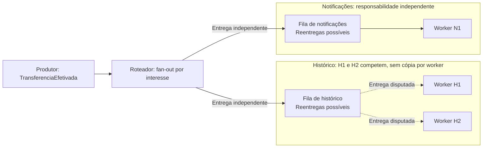
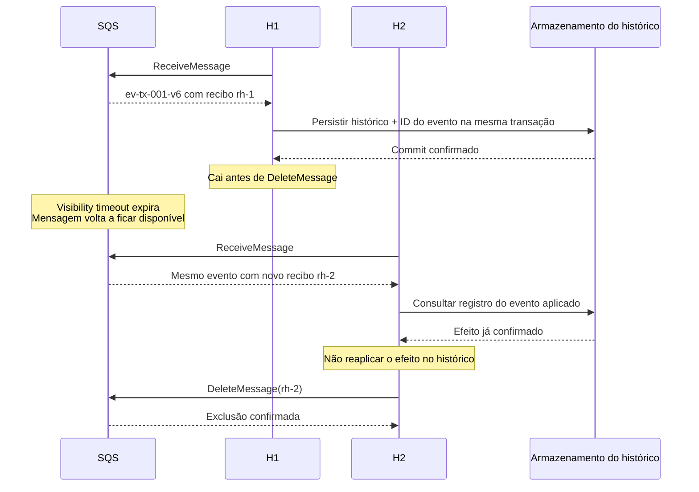

# 07 — Eventos, mensageria e sistemas distribuídos

**ID:** F07. **Base:** [N04](../../references/README.md#n04), sobre comunicação e sistemas distribuídos. **Revisão técnica:** 03/10/2026; explicações, exemplos e critérios autorais apoiados nas fontes locais ao final.

**Objetivo:** explicar quem guarda uma mensagem, quem decide repeti-la e por que isso não prova que uma transferência foi efetivada uma única vez.

## Roteiro de leitura

**Essencial:** vocabulário → síncrono/assíncrono → fila → fan-out → entrega versus efeito → exemplo acompanhado. Depois compare fila e log antes de escolher o serviço.

**Aprofundamento:** escopos de ordenação, offsets, retenção, capacidade e DLQ. Termine pelas perguntas e pelo exercício; não é necessário memorizar quotas.

**Fronteira:** F07 trata dos mecanismos de comunicação. [SD03](../system-design/03-distributed-workflows.md) desenvolve outbox, inbox, saga, CQRS e event sourcing. Para atomicidade local, retome [F06](06-databases-transactions-consistency.md#acid-cap).

**Como ler as afirmações:** comportamento de produto vem acompanhado de fonte; escolhas do [Case 03](../../cases/03-event-driven-banking.md#s04) são decisões daquele cenário; números e IDs abaixo são hipóteses didáticas. Não são medições nem experiências profissionais. Os exercícios são simulações de mesa, sem provisionamento AWS.

## Mensagem, comando e evento

Mensagem é a unidade transportada: envelope, conteúdo e metadados. Comando e evento descrevem seu **significado**, não o protocolo. Um comando pode viajar por HTTP ou por uma fila.

| Conceito | Exemplo sintético | O que permite concluir |
|---|---|---|
| Comando | `EfetivarTransferencia(tx-001)` | Alguém pede uma ação; há um responsável por aceitá-la ou recusá-la. |
| Evento | `TransferenciaSolicitada` | A intenção foi registrada; ainda não sabemos se houve movimentação. |
| Evento | `TransferenciaEfetivada` | O produtor afirma uma efetivação confirmada segundo o contrato. |
| Consulta | `ConsultarTransferencia(tx-001)` | Busca o estado sem pedir nova movimentação. |

Não basta escolher um verbo no passado. Defina dono, evidência necessária para emitir o fato, campos, versão e consumidores. Um evento de efetivação não autoriza seus assinantes a debitar a conta novamente.

**Envelope ilustrativo reduzido**, compartilhado com SD03; não é uma chamada executada nem o contrato completo do case:

```json
{
  "eventId": "ev-tx-001-v6",
  "eventType": "TransferenciaEfetivada",
  "aggregateId": "tx-001",
  "aggregateVersion": 6,
  "schemaVersion": 1,
  "data": {
    "amountMinor": 50000,
    "currency": "BRL",
    "coreReference": "core-tx-001"
  }
}
```

`eventId` identifica o fato e deve sobreviver à republicação. `aggregateId` identifica a transferência; `aggregateVersion`, sua evolução; `schemaVersion`, o formato do envelope. IDs do transporte e horários não substituem essas funções. `50000` representa R$ 500,00 fictícios. O [Case 03, contratos](../../cases/03-event-driven-banking.md#s08) detalha correlação e causalidade.

## Síncrono não é errado; assíncrono não elimina falhas

Em uma interação síncrona, quem chama espera uma resposta daquela operação. Em uma interação assíncrona, a aceitação e a conclusão podem ocorrer em momentos distintos; é necessário acompanhar o resultado. Uma publicação assíncrona para o negócio ainda pode aguardar confirmação síncrona do broker.

No Case 03, `202 Accepted` vem **depois de persistir a intenção e a publicação pendente**; não é recibo de transferência concluída. Já uma consulta pode ser síncrona. Retirar e-mail do caminho crítico não equivale a dispensar a decisão obrigatória de risco.

A fila absorve um desacoplamento de velocidade, mas introduz espera, expiração e recuperação. Se o prazo do cliente não comporta essa espera, reavalie a admissão ou o contrato. Timeout de uma chamada mutável pode significar **resposta perdida depois do efeito**, e não recusa: a recuperação da jornada está em [SD03, saga](../system-design/03-distributed-workflows.md#saga).

<a id="assincrona"></a>
## Fila, pub/sub e streaming na AWS

### Fila de trabalho: receber não é retirar definitivamente

Produtores enviam trabalho; consumidores concorrentes, com a mesma responsabilidade, disputam itens da fila. Dois workers de histórico podem dividir a carga. Colocar histórico e notificações na mesma fila não entrega uma cópia a cada sistema.

No SQS, o ciclo normal é:

1. O produtor envia; uma confirmação de envio informa aceitação pelo serviço, não conclusão pelo consumidor.
2. `ReceiveMessage` devolve a mensagem e um `ReceiptHandle` da entrega. A mensagem permanece na fila, temporariamente invisível.
3. O consumidor executa seu trabalho e torna durável o resultado que pretende confirmar.
4. O consumidor chama `DeleteMessage`, com o recibo mais recente. **Terminar a função de negócio, sozinho, não informa sucesso ao SQS.**
5. Sem exclusão, o fim da visibilidade permite outra entrega; a retenção limita por quanto tempo o item permanece armazenado.

`MessageId` não serve como recibo de exclusão. Uma nova entrega tem outro recibo. Em Standard, inclusive uma exclusão bem-sucedida não elimina toda possibilidade de duplicata. [Visibilidade — T21](../../references/README.md#t21), [API DeleteMessage][f07-delete]

**Integração gerenciada:** no event source mapping SQS → Lambda, o serviço faz o polling e exclui mensagens após o sucesso informado pela função. Por padrão, um erro no lote faz seus itens reaparecerem; respostas parciais configuradas permitem identificar os que falharam. A aplicação deve concluir o trabalho antes de informar sucesso, não apenas iniciar uma tarefa em segundo plano. [Lambda com SQS][f07-lambda], [falhas por item][f07-batch]

A visibilidade reduz disputa temporária; não é lock sobre um saldo. Se o processamento exceder o prazo, outro worker pode receber o item enquanto o anterior ainda trabalha. Ajustar/estender a visibilidade ajuda, mas não substitui idempotência.

<a id="pubsub"></a>
## Pub/Sub

Pub/sub distribui uma publicação às assinaturas interessadas; **fan-out** é essa ramificação para vários destinos. Cada responsabilidade precisa de sua própria entrega. No SNS com assinaturas SQS, as filas podem acumular e recuperar trabalho independentemente. Filtros podem selecionar apenas parte dos eventos. [SNS → SQS][f07-sns]



**Pergunta para treinar:** H1 recebeu um evento; H2 necessariamente recebe uma cópia? E N1?

H1 e H2 competem pelo trabalho de histórico; N1 tem uma cópia independente. Duplicatas continuam possíveis. Neste desenho, o roteador pode ilustrar SNS ou regras de EventBridge; os contratos dos serviços não são intercambiáveis.

Um assinante lento não deve bloquear os demais por compartilhar a mesma fila. Ainda pode haver dependências comuns, como banco e quotas. Falha de entrega do roteador à fila e falha de processamento **dentro** da fila são fronteiras distintas, com políticas de retry/DLQ próprias. [Retries SNS][f07-sns-retry], [retries EventBridge][f07-eb-retry]

## Entrega não é efeito único

| Camada | Pergunta verificável | O que não prova |
|---|---|---|
| Entrega | O transporte disponibilizou a mensagem ao consumidor? | Que o código terminou ou que o efeito foi persistido. |
| Processamento | O handler executou e registrou seu resultado? | Que uma API externa participou da mesma transação. |
| Efeito de negócio | A autoridade aplicou uma única operação identificada? | Que houve uma única entrega ou uma única execução do código. |

**At-most-once** admite perda ao evitar repetição; **at-least-once** admite repetição. São descrições de uma fronteira e de seu modelo de falhas, não promessas de sucesso eterno apesar de retenção vencida, exclusão incorreta ou destino inválido. SQS Standard documenta entrega pelo menos uma vez e ordem de melhor esforço. [T20](../../references/README.md#t20)

SQS FIFO deduplica envios dentro da janela documentada, de cinco minutos, e ordena por grupo. Isso não une o commit no core à exclusão da mensagem. Uma queda depois do efeito e antes da confirmação ainda exige recuperação idempotente. [Deduplicação FIFO][f07-fifo-dedup]

No Kafka, idempotência do produtor e transações podem oferecer garantias dentro de um fluxo Kafka configurado para isso. Uma chamada a um core externo exige coordenação com esse destino; “exactly-once” não atravessa automaticamente essa fronteira. [Semântica Kafka][f07-kafka-design]

Idempotência depende de **identidade estável + verificação e efeito protegidos no responsável pelo estado**. Um conjunto de IDs em memória desaparece no reinício. Os mecanismos de persistência e as fronteiras de transação ficam em [SD03, outbox e inbox](../system-design/03-distributed-workflows.md#transactional-outbox).

## Exemplo acompanhado: queda depois da gravação

**Hipótese do exercício:** o core já confirmou `tx-001`. O evento `ev-tx-001-v6` atualiza apenas o histórico de atendimento. O consumidor mantém um registro durável de eventos aplicados junto da projeção; seu funcionamento será desenvolvido em SD03.



**Pergunta para treinar:** se H1 cair antes do commit, o que muda na ação de H2?

| Passo | Ação | Evidência disponível |
|---|---|---|
| 1 | A fila recebe `ev-tx-001-v6`. | Há trabalho pendente; nenhuma projeção foi confirmada. |
| 2 | H1 recebe com recibo `rh-1`. | Mensagem em processamento, ainda armazenada. |
| 3 | H1 confirma a transação local de histórico + evento aplicado. | O efeito local está durável. |
| 4 | **Falha inserida:** H1 cai antes de excluir a mensagem. | O SQS não recebeu a confirmação; o histórico já mudou. |
| 5 | A visibilidade termina; H2 recebe o mesmo evento com `rh-2`. | Nova entrega do mesmo fato, não nova transferência. |
| 6 | H2 reconhece o efeito já registrado e não o reaplica. | Uma atualização lógica do histórico. |
| 7 | H2 exclui usando `rh-2`. | O trabalho dessa entrega foi resolvido. |

**Mude o ponto da falha:** antes do commit do passo 3, a repetição precisa fazer o trabalho; depois dele, precisa reconhecer o trabalho feito. Excluir antes do passo 3 pode perder a atualização. Se o efeito fosse externo e seu resultado fosse incerto, seria necessário consultar pela referência original antes de decidir. São previsões de uma simulação, não resultados de execução.

## Aprofundamento: log, tópico, partição, offset e grupo

Um log mantém registros para releitura. Consumi-los não os remove para os demais leitores. No Kafka, **tópico** é o agrupamento lógico; **partição** é uma sequência com ordem própria; **offset** é uma posição dentro dela. O grupo registra posições de retomada por partição. Um commit de offset não é um commit de banco.

Exemplo ilustrativo: na partição P0, `ev-tx-001-v6` ocupa o offset 42. O grupo `historico` conclui esse registro e confirma 43 como próxima posição; `analytics` ainda pode estar em 40. Avançar `historico` não avança `analytics` nem apaga o registro 42. Se confirmar a posição antes do efeito durável, a retomada pode pular trabalho; se confirmar depois e cair no intervalo, pode repeti-lo. [Posição e commits do KafkaConsumer][f07-kafka-consumer]

### Ordenação e paralelismo têm escopos diferentes

| Mecanismo | Escopo e concorrência | Responsabilidade restante |
|---|---|---|
| SQS Standard | Workers concorrentes; sem ordem estrita. | Tolerar duplicatas e desordem; limitar pressão no destino. |
| SQS FIFO | Ordem por `MessageGroupId`; grupos diferentes podem avançar em paralelo. Um lote pode conter vários itens do mesmo grupo. | Preservar sua sequência no processamento; um grupo muito carregado não ganha paralelismo ordenado só com mais workers. |
| Kafka, consumer group com partições atribuídas | Cada partição é atribuída a um consumidor do grupo; um consumidor pode ler várias. Outro grupo tem atribuição e posições próprias. | O limite por partições se aplica à atribuição de leitura desse grupo, não a todo processamento possível. Paralelizar tarefas internas exige controlar ordem de conclusão e commits. |
| Kinesis, modelo por `PartitionKey` usado aqui | A chave direciona ao shard; registros têm sequence numbers. Na KCL, cada shard tem um lease atribuído a um worker da aplicação. Outras aplicações têm checkpoints próprios. | KCL não é consumer group Kafka. Leitores independentes e processamento interno têm limites próprios; uma troca de lease não prova que código antigo já parou. |

A tabela usa o consumo Kafka por atribuição de partições, não `share groups`. Em Kinesis, delimita o modelo por chave e a KCL; não afirma um limite universal para outras integrações. Enhanced fan-out oferece capacidade dedicada de leitura por consumidor registrado, não novas partições nem ordenação global. [FIFO][f07-fifo], [KafkaConsumer][f07-kafka-consumer], [KCL][f07-kcl], [troca de lease KCL][f07-kcl-failure], [enhanced fan-out][f07-efo]

Na KCL, o checkpoint registra a posição do último registro processado com sucesso no shard; não exclui esse registro do stream. A aplicação decide quando sua lógica terminou para poder confirmar esse progresso. Isso difere do próximo offset confirmado no exemplo Kafka e do recibo usado para excluir no SQS.

**Ordem de chegada não é ordem de negócio.** Dois produtores concorrentes podem enviar versões conflitantes da mesma transferência. No Kafka, chave/particionador e configuração do produtor importam; retries sem a proteção adequada podem reordenar envios. A ordenação da partição não corrige uma sequência errada produzida pela aplicação. [Configuração do produtor Kafka][f07-kafka-producer]

Em Kinesis, `PutRecords` pode ter sucesso parcial e **não garante ordem**. Para a garantia específica de sequence numbers estritamente crescentes do mesmo cliente/chave, a documentação orienta envios seriais com `PutRecord` e `SequenceNumberForOrdering`. Não estenda isso a produtores independentes. [PutRecords][f07-putrecords], [PutRecord][f07-putrecord]

Escolher `tx-001` como grupo/chave organiza a evolução da transferência, não todas as operações da conta. Se o requisito virar ordem por conta, o particionamento e as disputas mudam. Nenhuma escolha de chave substitui a atomicidade de débito/crédito do core.

### Retenção e replay

Retenção define por quanto tempo o dado está disponível; posição de consumo define de onde um leitor retoma. São controles diferentes. SQS não oferece releitura por offset de mensagens já excluídas; também expira mensagens pela retenção. Kafka aplica políticas de retenção e, quando configurada, compactação; não presuma que todo evento histórico continuará disponível. Kinesis retém registros pela janela configurada. [DeleteMessage][f07-delete], [políticas de tópico Kafka][f07-kafka-topic], [conceitos Kinesis][f07-kinesis]

EventBridge permite replay de eventos **previamente arquivados**; isso não o transforma em log com offset por assinante. O replay não assegura a ordem original. [Arquivo e replay][f07-eb-archive]

**Decisão do Case 03:** replay reconstrói projeções ou análises em destino controlado; não reenvia comandos financeiros. Defina intervalo, schema, identidade de consumidor, deduplicação, origem completa e permissões. Retenção de transporte, sozinha, não constitui arquivo de auditoria nem [event sourcing](../system-design/03-distributed-workflows.md#event-sourcing).

## Aprofundamento: backlog, concorrência e DLQ

Backlog é trabalho acumulado. **Hipótese aritmética:** chegam 120 eventos/s, saem 100/s; em 60 s acumulam-se aproximadamente 1.200 eventos, partindo de zero. Se a chegada cair para 80/s e a capacidade continuar em 100/s, há 20/s para drenar: cerca de 60 s adicionais. Não é benchmark; ignora variação, fan-out, retries e falhas.

Aumentar workers ajuda apenas enquanto há capacidade no banco, core ou provedor. Mais chamadas concorrentes podem elevar latência, estourar visibilidade e aumentar retries, piorando a fila. Controle admissão, taxa e concorrência; separe responsabilidades e planeje recuperação dentro do prazo de negócio. Consulte [SD04](../system-design/04-resilience-isolation.md#resiliencia).

| Sinal | Hipótese a investigar | Evidência útil |
|---|---|---|
| Idade dos itens aumenta | Capacidade insuficiente ou item que falha repetidamente. | Taxa de chegada/conclusão, erro por tipo, idade e tentativas. |
| Muitos itens em voo e poucas conclusões | Dependência lenta, consumidores travados ou confirmação falhando. | Duração, timeouts, conexões e erros de exclusão. |
| Lag concentrado | Partição/grupo quente ou processamento desigual. | Carga por chave e duração por consumidor. |
| Fila cai, mas reclamações persistem | Exclusão prematura, expiração ou envio à DLQ. | Resultado de negócio e estado das filas de erro. |

Métricas do SQS são aproximadas e têm particularidades; contagem de mensagens recebidas/excluídas não é contagem de transferências únicas. [Métricas SQS][f07-metrics]

A DLQ isola mensagens que excederam a política de tentativas; **não corrige payload, código ou estado financeiro**. No SQS, `maxReceiveCount` considera recebimentos, não provas de efeito. Enviar uma mensagem de FIFO para DLQ permite avançar sem ela e pode romper a sequência exigida pelo negócio. [DLQ SQS][f07-dlq]

Um procedimento de recuperação deve:

1. Preservar ID, erro e contexto mínimo; classificar falha transitória, de contrato ou de resultado desconhecido.
2. Corrigir a causa e consultar o estado pertinente antes de repetir uma mutação.
3. Selecionar itens e destino; preservar a identidade de negócio mesmo se o transporte gerar outro ID.
4. Reintroduzir um lote pequeno com taxa limitada e observar efeito, duplicatas e dependências.
5. Encerrar com reconciliação; “DLQ vazia” não prova recuperação correta.

## Aprofundamento: escolha pelo mecanismo

| Serviço | Mecanismo que ilustra | Requisito favorável | Limite relevante |
|---|---|---|---|
| SQS | Fila de trabalho Standard ou FIFO. | Distribuir tarefas, amortecer picos, recuperar consumo. | Exclusão/visibilidade, retenção e contrato de efeito continuam necessários. |
| SNS | Publicação para assinaturas; SNS + SQS dá fila por responsabilidade. | Fan-out com assinantes bem definidos. | Protocolo, tipo de tópico, filtros e destino definem garantias; não presumir replay geral. |
| EventBridge | Event bus com regras sobre eventos e destinos. | Integração entre domínios e roteamento por conteúdo. | Não coordena transações; retries, DLQ e arquivo/replay são escolhas explícitas. |
| Kinesis Data Streams | Stream particionado em shards. | Leituras independentes e processamento contínuo no ecossistema AWS. | APIs de escrita, modo de distribuição e biblioteca de consumo mudam o contrato. |
| Amazon MSK | Apache Kafka gerenciado. | Ecossistema Kafka, grupos independentes e releitura por posição. | Particionamento, clientes, schemas, retenção e operação continuam exigindo decisões. |

A comparação combina os contratos documentados acima com julgamento arquitetural; não é um ranking de produtos. [EventBridge FAQ][f07-eb-faq]

No Case 03, a base usa EventBridge + SQS; MSK é uma evolução condicionada a requisitos de log. Para apenas duas consequências de uma transferência, uma fila por consumidor pode bastar. Se a operação cabe numa transação e exige resposta imediata, uma chamada síncrona pode ser mais simples. Evite introduzir um stream só para encaminhar um único trabalho.

## Perguntas de aprofundamento

Responda primeiro sem abrir o comentário. Em cada resposta, identifique a fronteira da garantia e uma evidência que permitiria decidir.

### 1. Receber TransferenciaSolicitada prova que o dinheiro foi transferido?

**Follow-up:** o core respondeu apenas que aceitou processar a solicitação.

<details>
<summary>Resposta comentada</summary>

Não. O evento prova o registro da intenção segundo seu contrato; aceitação pelo core também pode preceder a conclusão. É preciso consultar o resultado autoritativo pela referência original. No Case 03, somente a confirmação permite produzir `TransferenciaEfetivada`. Uma resposta forte distingue os dois fatos e aponta onde a evidência fica durável.

</details>

### 2. Três serviços na mesma fila recebem todos os eventos?

**Follow-up:** notificações ficará indisponível por duas horas, mas histórico deve continuar.

<details>
<summary>Resposta comentada</summary>

Consumidores da mesma fila competem pelo trabalho. Use fan-out para filas independentes, com retenção e capacidade de recuperação adequadas. Assim, o atraso de notificações não consome o item de histórico. Verifique também dependências compartilhadas; separar filas não isola automaticamente banco ou quotas.

</details>

### 3. Quem apaga a mensagem quando o handler termina?

**Follow-up:** uma Lambda recebeu três itens; dois tiveram sucesso e o terceiro falhou.

<details>
<summary>Resposta comentada</summary>

No consumidor direto, seu código ou biblioteca deve chamar `DeleteMessage` usando o recibo da entrega. Na integração gerenciada, Lambda exclui conforme o sucesso reportado. Para o lote, configure e implemente resposta parcial; caso contrário, o erro pode repetir inclusive os itens já processados. Eles ainda precisam ser idempotentes. [Lambda][f07-lambda], [falhas parciais][f07-batch]

</details>

### 4. O trabalho dura 45 segundos e a visibilidade é de 30. Basta subir outro worker?

**Follow-up:** a latência da dependência dobrou.

<details>
<summary>Resposta comentada</summary>

Outro worker pode receber a mensagem ainda em execução, ampliando a disputa. Investigue duração, capacidade do destino e falha de confirmação; ajuste ou estenda a visibilidade quando apropriado. Limite a concorrência se o destino saturou. A proteção do efeito deve funcionar mesmo se a extensão falhar. [T21](../../references/README.md#t21)

</details>

### 5. FIFO garante uma única efetivação financeira?

**Follow-up:** o consumidor caiu após a resposta de sucesso do core e antes de excluir o item.

<details>
<summary>Resposta comentada</summary>

Não. Deduplicação de envio e ordem por grupo não formam uma transação com o core. Na repetição, a mesma intenção deve recuperar o resultado da mesma referência, sem novo lançamento. Trocar o identificador porque a execução é nova quebra essa proteção. O contrato de idempotência pertence à autoridade do efeito.

</details>

### 6. Um tópico Kafka tem três partições e cinco consumidores no mesmo grupo. Todos dividem a leitura?

**Follow-up:** acrescente outro grupo; depois compare com uma aplicação KCL.

<details>
<summary>Resposta comentada</summary>

No modelo de atribuição de partições descrito aqui, no máximo três desses consumidores recebem partições desse tópico; outro grupo tem sua própria atribuição. Na KCL, workers distribuem leases de shards por aplicação. Isso não torna offset, checkpoint e recibo SQS equivalentes, nem limita todo paralelismo interno às instâncias que leem. [KafkaConsumer][f07-kafka-consumer], [KCL][f07-kcl]

</details>

### 7. Usar a mesma chave torna qualquer sequência de produtores ordenada?

**Follow-up:** em Kinesis, a primeira entrada de PutRecords falha e a segunda é aceita.

<details>
<summary>Resposta comentada</summary>

A chave escolhe um escopo de distribuição, não coordena a intenção de escritores concorrentes. Ao repetir a primeira entrada, ela pode chegar depois da segunda. Defina a sequência no produtor e valide versão/estado no consumidor conforme a necessidade. FIFO colocado depois de um trecho desordenado também não recompõe a ordem original. [PutRecords][f07-putrecords]

</details>

### 8. Com retenção de sete dias, um consumidor parado por oito dias consegue reconstruir tudo?

**Follow-up:** existe arquivo no EventBridge, mas apenas de alguns tipos de evento.

<details>
<summary>Resposta comentada</summary>

Não há garantia de que todo o intervalo ainda exista. Verifique cobertura do arquivo, schemas e fonte de reconstrução; não trate um replay parcial como histórico completo. Reconstrua em destino separado e compare evidências antes da troca. Offset antigo não recupera dado já removido. [Retenção Kafka][f07-kafka-topic], [arquivo EventBridge][f07-eb-archive]

</details>

### 9. A fila cresceu e há mensagens na DLQ. Você reenvia tudo com concorrência máxima?

**Follow-up:** parte dos itens pode já ter produzido efeito externo.

<details>
<summary>Resposta comentada</summary>

Primeiro classifique erros e consulte resultados incertos. Depois selecione um lote, preserve referências e limite a taxa à capacidade de recuperação. Observe conclusões de negócio, não só redução da fila. Uma DLQ esvaziada por descarte ou por nova falha não representa solução. A política é uma decisão operacional do exercício, não um efeito automático do serviço.

</details>

## Exercício

**Simulação de mesa, sem código de aplicação executado.** Use três cartões para entregas do mesmo `ev-tx-001-v6`, uma folha de estado durável do histórico e outra para a fila. O core já efetivou `tx-001`; nenhuma rodada pode fazer nova chamada financeira.

1. Na rodada A, H1 recebe e cai **antes** do commit local. Deixe a visibilidade terminar e passe a H2.
2. Na rodada B, comece do estado inicial; H1 confirma o efeito e cai **antes** de excluir.
3. Na rodada C, exclua primeiro e caia antes de gravar: demonstre o defeito desse protocolo.
4. Anote entrega, recibo atual, estado durável, ação de H2 e critério de confirmação. Explique onde seria necessário o mecanismo de inbox de SD03.

**Critérios observáveis:** A deve permitir concluir a atualização; B deve reconhecer a atualização já feita; C deve expor trabalho perdido. O número de efeitos lógicos do histórico deve ser um nas rodadas corretas, mesmo com mais entregas. Distingua esse resultado esperado de um teste real contra SQS.

**Extensão opcional:** use a hipótese de 120 entradas/s e 100 conclusões/s para calcular backlog e recuperação. Se o destino suportar apenas 100/s, justifique por que adicionar consumidores não garante drenar mais rápido.

## Referências e revisão técnica

Fontes consultadas em **03/10/2026**. Kafka **4.1** é a versão documental fixada para este estudo, não uma afirmação de versão atual do MSK. Documentos AWS em `latest` exigem revalidação antes de implantação.

| Leitura | O que a fonte sustenta |
|---|---|
| [T20](../../references/README.md#t20), [T21](../../references/README.md#t21), [DeleteMessage][f07-delete] | Entrega Standard, visibilidade, recibo e exclusão; corrigem a sugestão anterior de exclusão automática ao terminar a aplicação. |
| [FIFO][f07-fifo], [deduplicação][f07-fifo-dedup], [Lambda][f07-lambda], [falhas parciais][f07-batch] | Escopo por grupo, deduplicação de envio e responsabilidade da integração gerenciada. |
| [SNS/SQS][f07-sns], [retries SNS][f07-sns-retry], [EventBridge][f07-eb-faq], [retries][f07-eb-retry], [arquivo][f07-eb-archive] | Assinaturas, roteamento e recuperação de entrega/replay. |
| [Design Kafka][f07-kafka-design], [KafkaConsumer][f07-kafka-consumer], [produtor][f07-kafka-producer], [tópicos][f07-kafka-topic] | Posições, garantias e configurações que limitam a generalização sobre ordem e paralelismo. |
| [Kinesis][f07-kinesis], [KCL][f07-kcl], [falhas de lease][f07-kcl-failure], [enhanced fan-out][f07-efo], [PutRecords][f07-putrecords], [PutRecord][f07-putrecord] | Shards, checkpoints, modos de leitura e restrições das APIs de escrita. |
| [DLQ][f07-dlq], [métricas][f07-metrics] | Isolamento de falhas e limites da observação operacional. |

Os exemplos e critérios são sínteses autorais. Eles não reproduzem respostas de cursos nem demonstram capacidade, disponibilidade ou integridade de uma implantação real.

[f07-delete]: https://docs.aws.amazon.com/AWSSimpleQueueService/latest/APIReference/API_DeleteMessage.html
[f07-lambda]: https://docs.aws.amazon.com/lambda/latest/dg/with-sqs.html
[f07-batch]: https://docs.aws.amazon.com/lambda/latest/dg/services-sqs-errorhandling.html
[f07-fifo]: https://docs.aws.amazon.com/AWSSimpleQueueService/latest/SQSDeveloperGuide/FIFO-queues-understanding-logic.html
[f07-fifo-dedup]: https://docs.aws.amazon.com/AWSSimpleQueueService/latest/SQSDeveloperGuide/FIFO-queues-exactly-once-processing.html
[f07-sns]: https://docs.aws.amazon.com/sns/latest/dg/sns-sqs-as-subscriber.html
[f07-sns-retry]: https://docs.aws.amazon.com/sns/latest/dg/sns-message-delivery-retries.html
[f07-eb-faq]: https://aws.amazon.com/eventbridge/faqs/
[f07-eb-retry]: https://docs.aws.amazon.com/eventbridge/latest/userguide/eb-rule-retry-policy.html
[f07-eb-archive]: https://docs.aws.amazon.com/eventbridge/latest/userguide/eb-archive.html
[f07-kafka-design]: https://kafka.apache.org/41/design/design/
[f07-kafka-consumer]: https://kafka.apache.org/41/javadoc/org/apache/kafka/clients/consumer/KafkaConsumer.html
[f07-kafka-producer]: https://kafka.apache.org/41/configuration/producer-configs/
[f07-kafka-topic]: https://kafka.apache.org/41/configuration/topic-configs/
[f07-kinesis]: https://docs.aws.amazon.com/streams/latest/dev/key-concepts.html
[f07-kcl]: https://docs.aws.amazon.com/streams/latest/dev/kcl-concepts.html
[f07-kcl-failure]: https://docs.aws.amazon.com/streams/latest/dev/troubleshooting-consumers.html
[f07-efo]: https://docs.aws.amazon.com/streams/latest/dev/enhanced-consumers.html
[f07-putrecords]: https://docs.aws.amazon.com/kinesis/latest/APIReference/API_PutRecords.html
[f07-putrecord]: https://docs.aws.amazon.com/kinesis/latest/APIReference/API_PutRecord.html
[f07-dlq]: https://docs.aws.amazon.com/AWSSimpleQueueService/latest/SQSDeveloperGuide/sqs-dead-letter-queues.html
[f07-metrics]: https://docs.aws.amazon.com/AWSSimpleQueueService/latest/SQSDeveloperGuide/sqs-available-cloudwatch-metrics.html
