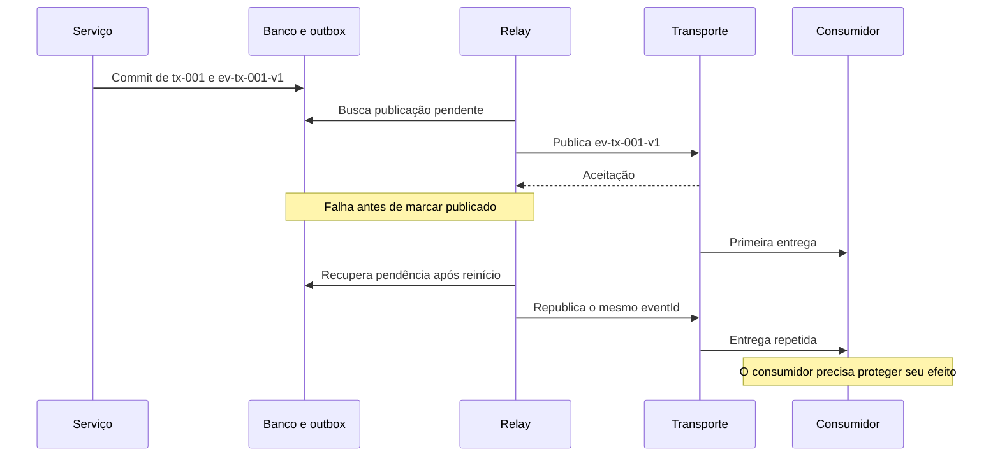
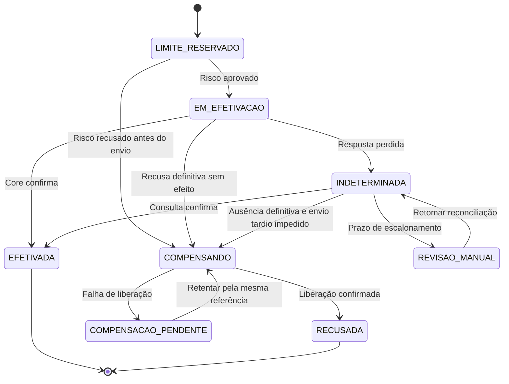

# SD03 — Fluxos Distribuídos

**Origem:** temas antes reunidos em F07, relacionados a [N04](../../references/README.md#n04). **Revisão técnica:** 03/10/2026; desenvolvimento autoral com fontes primárias. As seções complementares não são transcrição de anotações ou de cursos.

**Objetivo:** defender como uma jornada progride e se recupera quando banco, transporte e sistemas externos não compartilham uma transação.

## Roteiro de leitura e contrato do exemplo

**Essencial:** contrato → outbox e inbox → orquestração/coreografia → saga acompanhada. **Aprofundamento:** CQRS, event sourcing e autoridade de escrita. Termine pelo treino e pela simulação de mesa.

[F07](../fundamentals/07-events-messaging-distributed-systems.md) explica recebimento, confirmação, ordenação e replay. Aqui esses mecanismos são usados para discutir **onde uma invariante é protegida, qual estado fica durável e como recuperar uma falha**. [F06](../fundamentals/06-databases-transactions-consistency.md#acid-cap) cobre atomicidade e isolamento local.

**Contrato herdado do [Case 03](../../cases/03-event-driven-banking.md#s01):** transferência interna entre contas do mesmo banco; o core faz débito e crédito em uma operação atômica, decide saldo e oferece referência idempotente e consulta de resultado. São premissas do case a verificar numa arquitetura real, não garantias entregues por SQS ou Step Functions.

Usaremos os mesmos identificadores sintéticos de F07:

| Identificador | Papel |
|---|---|
| `tx-001` | Transferência de `acc-origem-01` para `acc-destino-02`, R$ 500,00 fictícios. |
| `core-tx-001` | Referência estável da efetivação; não muda no retry ou failover. |
| `res-tx-001` | Reserva de limite **operacional**, distinta do saldo no core. |
| `ev-tx-001-v1` | Fato `TransferenciaSolicitada`, após registrar a intenção. |
| `ev-tx-001-v6` | Fato `TransferenciaEfetivada`, após evidência do core. |

As versões são ilustrativas; o resumo não enumera todos os estados intermediários. Fatos de produto são sustentados pelas fontes; decisões do case e variantes didáticas são identificadas. Nenhum fluxo bancário, código de aplicação ou recurso AWS foi executado para este módulo.

<a id="transactional-outbox"></a>
## Outbox e inbox

### Transactional outbox: preservar a intenção de publicar

**Problema sem o padrão:** gravar `tx-001` e depois publicar `TransferenciaSolicitada` deixa uma janela de falha. Se o processo cair entre as operações, a intenção existe e ninguém inicia a jornada. Publicar primeiro permite anunciar algo que o banco depois rejeita.

**Fluxo normal:** uma transação local grava o estado e a linha da outbox com `ev-tx-001-v1`. Depois do commit, um relay publica o evento, verifica a aceitação pelo destino e marca a publicação. Somente dados confirmados entram no relay. A atomicidade cobre **estado + intenção de envio**, não o broker. [T16](../../references/README.md#t16), [padrão de Chris Richardson][sd03-outbox]



| Ponto da falha | O que permanece | Recuperação e dependência |
|---|---|---|
| Antes do commit local | Nem mudança nem evento, se a transação abortou. | Repetir a intenção com a mesma chave; resultado de commit incerto exige consulta. |
| Depois do commit, antes de publicar | Estado + outbox pendente. | Relay retoma; monitorar idade da pendência. |
| Depois da aceitação, antes de marcar | Broker pode ter o evento; outbox ainda pendente. | Republicar o mesmo `eventId`; consumidor tolera repetição. |
| Falha parcial de lote | Alguns itens aceitos, outros não. | Examinar resposta por item e preservar os não resolvidos. |

**Garantia e limite:** o banco precisa realmente confirmar ambos na mesma transação. A entrega posterior depende de relay, destino, retenção e recuperação operacional. A outbox não elimina duplicatas, não resolve uma efetivação desconhecida no core e não fornece ordem por agregado apenas por ter uma coluna de versão.

**Aprofundamento:** workers podem adquirir lotes com lease e marcar apenas os itens que ainda possuem. Se ordem estrita for necessária, coordenem a publicação por agregado; vários publicadores podem inverter versões. Um relay antigo ainda pode publicar tarde. No EventBridge, `PutEvents` requer inspeção por entrada e validação do destino; HTTP 200 isolado não basta. [Case 03, relay](../../cases/03-event-driven-banking.md#s08), [PutEvents][sd03-putevents]

**Quando não vale / alternativa:** se a ação inteira cabe no mesmo banco e não exige publicação, use a transação local. Quando há publicação obrigatória, CDC a partir de alterações confirmadas é alternativa ao polling; pode inclusive transportar a própria outbox. Avalie retenção do log, contrato de evento e recuperação do conector. “Gravar e tentar enviar uma vez” não é substituto equivalente.

### Inbox e consumidor idempotente: proteger o efeito local

**Problema:** uma nova entrega do mesmo evento pode inserir duas entradas ou incrementar duas vezes uma projeção. Fazer `SELECT` para verificar o ID e depois gravar, sem proteção concorrente, permite que dois workers passem na verificação.

**Fluxo proposto para um efeito no mesmo banco:** use unicidade em `(consumer_name, event_id)` e confirme inbox + alteração numa só transação. Em uma disputa, a restrição arbitra; não basta uma consulta prévia. [Idempotent Consumer][sd03-inbox]

**Pseudocódigo conceitual, não executado:**

```text
abrir transação local
    tentar registrar ("historico-v1", eventId) com unicidade
    se o evento já estiver confirmado:
        encerrar sem reaplicar
    senão:
        validar contrato, versão e transição
        aplicar a mudança local
confirmar a transação
só então confirmar a entrega no transporte
```

“Evento confirmado” significa que a mesma transação também confirmou o efeito. Conflito com uma transação ainda aberta deve ser resolvido pelo banco; não se deve tratá-lo prematuramente como sucesso. Se houver erro de validação ou lacuna que impeça aplicar o evento, aborte a transação, inclusive a inbox, e encaminhe a recuperação.

**Falha e recuperação:** queda antes do commit permite tentar de novo; depois do commit e antes do ack, a inbox impede reaplicação. A confirmação no transporte continua separada. Eventos diferentes sobre a mesma transferência ainda exigem controle de estado/versão; deduplicar IDs não garante ordenação.

**Efeito externo:** gravar “processado” antes de enviar SMS pode perder o envio; gravar depois pode duplicá-lo. Uma intenção durável de envio, chave idempotente aceita pelo provedor e consulta/reconciliação ajudam. Sem esse contrato externo, declare a possibilidade de repetição; não prometa que a inbox inclui banco e provedor na mesma transação. No core, a referência é `core-tx-001`. [APIs idempotentes][sd03-idempotency], [Case 03, quatro fronteiras](../../cases/03-event-driven-banking.md#s08)

**Quando não vale / alternativa:** se uma escrita condicional já garante a invariante, uma tabela separada de inbox pode ser redundante. Um `upsert` só é suficiente se repetir ou receber uma versão velha não regredir o estado. Para projeção de último estado, uma versão pode proteger a substituição; para somas/deltas, pular eventos intermediários pode corromper o resultado. Retenção da deduplicação precisa cobrir a repetição/replay autorizado; para reconstruir uma projeção nova, use identidade própria de consumidor.

<a id="orquestracao"></a>
## Orquestração e coreografia

**Problema comum:** alguém precisa decidir a próxima etapa, acompanhar prazo e tratar uma etapa que não respondeu. Publicar eventos não remove essas responsabilidades.

| Escolha | Fluxo normal | Falha, recuperação e custo |
|---|---|---|
| Orquestração | Coordenador durável registra progresso e aciona participantes por comandos. | Após reinício, recupera o passo e consulta/reexecuta com a mesma identidade. Concentra a lógica do fluxo e exige disponibilidade, versionamento e observação do coordenador. |
| Coreografia | Participantes reagem a fatos e publicam novos fatos; a sequência emerge desses contratos. | Cada participante persiste progresso e decide retries/timeouts. Falta de um evento ou ciclo entre participantes pode parar a jornada; correlação e detecção de pendências precisam ser desenhadas. |

Na proposta do Case 03, **Step Functions Standard orquestra limite, risco e core**; o evento confirmado dispara notificações e projeções independentes. Esse uso misto reduz a quantidade de consequências secundárias no workflow crítico. Orquestração pode usar mensagens assíncronas; coreografia não é sinônimo de ausência de estado. [Saga orquestrada — T17](../../references/README.md#t17), [coreografia AWS][sd03-choreography]

**Garantia dependente da aplicação:** nenhum estilo prova que um efeito externo terminou. É preciso guardar correlação, propriedade da execução, resultado e referência da operação. Um timeout do coordenador não cancela necessariamente a chamada que já saiu. A semântica de execução de Step Functions não faz commit atômico no core e no banco local. [Tipos de workflow][sd03-workflows]

**Quando não vale / alternativa:** duas funções do mesmo serviço podem ser coordenadas no próprio código/transação. Coreografia funciona bem para poucas reações independentes; com dependências e compensações crescentes, considere um coordenador explícito. Para uma única consequência, uma fila e um worker podem bastar. A escolha depende do fluxo e de quem vai operá-lo, não de uma preferência universal por eventos.

<a id="saga"></a>
### Saga na prática

Saga coordena transações locais e sua recuperação. Alguns passos admitem compensação; outros exigem continuar até completar, consultar ou escalar. **Não há rollback nem isolamento ACID global automático.** Uma reserva, por exemplo, protege uma invariante que poderia ser violada por jornadas concorrentes. [T17](../../references/README.md#t17), [compensações][sd03-compensation]

**Correção do exemplo anterior:** não dividimos débito e crédito entre serviços. Ambos permanecem dentro da operação atômica do core, conforme o [Case 03, fronteira financeira](../../cases/03-event-driven-banking.md#s01). A saga coordena as etapas ao redor.

#### Exemplo acompanhado: o core efetivou e a resposta se perdeu

1. A entrada persiste `tx-001` e `ev-tx-001-v1`; responde que a intenção foi aceita. O relay publica e um iniciador idempotente associa a execução à transferência.
2. Limites confirma `res-tx-001`; risco aprova. Reserva de limite operacional não movimenta saldo.
3. A saga registra o despacho e chama o core com `core-tx-001`. O core valida e confirma **débito e crédito juntos**.
4. **Falha inserida:** a resposta se perde. A jornada registra `INDETERMINADA`. Não gera nova referência, não anuncia recusa e não libera a reserva.
5. A recuperação consulta `core-tx-001`. Neste cenário, recebe `EFETIVADA` com evidência durável. Se a consulta continuar inconclusiva, permanece pendente, com prazo de escalonamento e reserva protegida.
6. O serviço registra `EFETIVADA` e `ev-tx-001-v6` atomicamente. Converte a reserva em limite consumido com operação idempotente. Uma queda local nessa fase exige recuperar o registro, não efetivar novamente no core.
7. O relay distribui o fato confirmado. Uma falha de e-mail mantém uma pendência de notificação; não muda o estado financeiro.



Diagrama reduzido do **estado principal**, não de todos os atributos da saga. `EFETIVADA` pode coexistir com ajuste de limite ou notificação pendente. As setas são decisões do exercício baseadas no contrato do case; não foram testadas num core real.

#### Falhas que mudam a decisão

| Falha inserida | Decisão segura no contrato do case | Evidência necessária |
|---|---|---|
| Timeout ao reservar limite | Consultar a mesma reserva antes de criar outra ou encerrar. | Estado autoritativo de `res-tx-001`. |
| Risco recusa antes do envio ao core | Impedir despacho e liberar a reserva confirmada. | Recusa + controle de estado que impede uma execução concorrente de enviar. |
| Core pode ter efetivado | Manter `INDETERMINADA` e reconciliar. | Consulta pela referência original; timeout não prova ausência. |
| Consulta devolve `NOT_FOUND` transitório | Não liberar nem iniciar outra operação. | Estado terminal ou cancelamento/barreira que impeça efetivação tardia. |
| Core confirmou; banco local falha | Retomar consulta e gravação condicional do resultado/outbox. | Evidência do core + versão/estado local. |
| Liberação falha | Manter `COMPENSACAO_PENDENTE` e retentar a mesma liberação. | Confirmação do serviço de limites. |
| Notificação falha após efetivação | Recuperar notificação separadamente. | Resultado do envio; nenhuma reversão financeira por esse motivo. |

**Compensar é produzir uma nova operação de negócio**, referenciada e observável. Não apaga a reserva anterior nem necessariamente restaura o mundo ao estado inicial: outras operações podem ter ocorrido. A própria compensação pode falhar. Uma reversão financeira, quando permitida pelo produto, tem autorização e rastreabilidade próprias; não é tratamento genérico de erro de workflow. [Compensating Transaction][sd03-compensation]

**Reserva expirada não prova cancelamento.** Durante a incerteza, a política precisa preservar a capacidade pertinente, renovar/proteger a reserva ou escalar sua regularização. Uma expiração automática que libere limite enquanto o core ainda pode concluir rompe a invariante. [Case 03, reservas e recuperação](../../cases/03-event-driven-banking.md#s09)

**Quando não vale / alternativa:** se as invariantes podem ficar numa transação local, mantê-las juntas é mais simples. Uma saga se justifica por responsabilidades e transações separadas, não por dividir toda operação em microserviços. Se o core não oferece referência e consulta suficientes, uma saga não inventa essas garantias: reveja a integração e preveja reconciliação/controle operacional antes de autorizar repetição automática.

<a id="cqrs"></a>
## CQRS

**Aprofundamento.** Command Query Responsibility Segregation separa modelos/responsabilidades de comandos e consultas. O problema aparece quando o modelo que protege regras de escrita fica inadequado para consultas, ou quando seus requisitos divergem muito. Separar modelos **não exige separar bancos**, adotar eventos ou introduzir assincronia. [Fowler — CQRS][sd03-cqrs], [Microsoft — modelos no mesmo armazenamento][sd03-cqrs-ms]

**Fluxo normal, versão simples:** um comando valida e atualiza o estado; consultas usam uma representação própria. Na mesma base, uma projeção pode ser calculada na consulta ou mantida na própria transação de escrita. Nesse desenho proposto, a consistência depende do isolamento e do caminho de leitura escolhido; não existe um atraso de mensageria obrigatório.

**Variante do Case 03:** o estado da jornada publica fatos pela outbox; o consumidor atualiza uma projeção de atendimento. Aqui a atualização é assíncrona. O core continua autoritativo para a efetivação; mesmo a tabela de estado da jornada precisa de sua evidência.

| Situação | Falha possível | Recuperação/garantia exigida |
|---|---|---|
| Core confirmou; tela ainda mostra pendência | Evento não publicado, fila atrasada ou projetor com erro. | Consultar a autoridade adequada; investigar cada fronteira e idade da projeção. |
| O mesmo fato reaparece | Projetor soma ou insere em duplicidade. | Inbox + efeito local atômicos ou escrita condicional equivalente. |
| Versão nova chega antes da antiga | Estado regride ou um delta é perdido. | Para snapshots completos, condicionar à versão; para deltas, detectar lacuna e recuperar a sequência. |
| Um bug afetou a projeção | Dados derivados incorretos. | Corrigir o projetor e reconstruir outra geração a partir de fonte suficiente; reconciliar antes da troca. |

**Limite:** uma leitura forte da projeção não cria um evento que ela ainda não recebeu. Para read-your-writes, considere consultar o lado autoritativo ou esperar uma versão conhecida com prazo definido. Isso acrescenta latência/dependência; não transforme saldo projetado em autorização para novo débito.

**Reconstrução também tem contrato:** se os eventos necessários expiraram, será preciso snapshot consistente + mudanças posteriores, ou outra exportação da fonte. Marcar “replay concluído” sem verificar cobertura não demonstra integridade.

**Quando não vale / alternativa:** para CRUD simples, comece por consultas, índices e views apropriados; uma réplica pode aliviar leitura. Réplica, sozinha, não estabelece a separação lógica de modelos, embora possa integrar uma solução CQRS. Bancos independentes acrescentam sincronização, segurança, operação e tratamento de atraso; justifique esses custos com o padrão de acesso.

<a id="event-sourcing"></a>
## Event Sourcing

**Aprofundamento.** O problema é precisar reconstruir a evolução do domínio a partir de fatos, enquanto uma tabela de estado atual só mostra o último resultado. Em event sourcing, os eventos persistidos são a fonte de verdade **do agregado modelado**; o estado é derivado deles. Manter uma outbox ao lado de uma tabela autoritativa não muda essa fonte de verdade. [Fowler — Event Sourcing][sd03-es]

**Fluxo normal de uma variante hipotética para a jornada:** carregar o estado de `tx-001` até a versão conhecida, validar o comando e acrescentar fatos com uma condição sobre essa versão. Aplicar os fatos produz o novo estado; projeções podem servi-lo em outros formatos. Event sourcing e CQRS podem ser combinados, mas um não exige o outro.

**Concorrência:** dois escritores leram versão 3 e propõem a próxima mudança. O event store precisa arbitrar atomicamente a versão esperada; um conflito exige recarregar e reavaliar a decisão. Uma tabela apenas denominada “append-only” não fornece, por si, esse protocolo. [Event sourcing: concorrência e armazenamento][sd03-es-ms]

| Falha | Recuperação | O que a aplicação precisa garantir |
|---|---|---|
| Append confirmou, mas a resposta sumiu | Consultar a intenção/eventos existentes antes de tentar outra mudança. | Identidade estável do comando; impedir que o retry represente nova intenção. |
| Projetor caiu depois de aplicar um fato | Retomar por checkpoint com deduplicação ou reconstruir. | Posição de leitura e efeito precisam de um protocolo seguro. |
| Código/schema antigo não é mais compreendido | Usar evolução compatível ou adaptação de leitura versionada. | Preservar significado dos fatos; não reinterpretar silenciosamente o passado. |
| Snapshot incorreto ou incompatível | Reconstruir dos eventos disponíveis e refazer snapshot. | Snapshot é otimização, identificado por versão; não substitui a fonte. |

**Replay não repete a ação original.** Reconstituir que o core confirmou `tx-001` não chama `EfetivarTransferencia` novamente. No exercício, a reconstrução escreve somente num destino de projeção, sem permissão para chamar core ou provedor de mensagens. Dados usados na decisão original, como uma taxa externa, não devem ser substituídos pela taxa de hoje. [Interações externas e replay][sd03-es]

**Limites:** o histórico só contém os fatos que o sistema registrou corretamente. Durabilidade, acesso, retenção, evolução e vínculos com evidências externas continuam necessários. Um log Kafka para distribuição ou um histórico de alterações de banco não é automaticamente um event store de domínio. A semelhança com lançamentos contábeis não autoriza afirmar que qualquer ledger implementa este padrão nem que event sourcing cria um ledger correto.

**Conexão com o case:** a arquitetura-base do [Case 03](../../cases/03-event-driven-banking.md#s10) usa estado atual + outbox, sem exigir event sourcing. A variante acima mudaria como o serviço de jornada guarda seu estado; não transferiria a autoridade financeira do core.

**Quando não vale / alternativa:** se basta estado atual com rastreabilidade, uma base transacional e registros de auditoria apropriados podem atender com menor custo. Event sourcing se justifica quando reconstrução temporal e evolução por fatos compensam o custo de compatibilidade, ferramentas e recuperação. Retenção/compactação de transporte precisa ser compatível com a fonte completa pretendida; releitura de um subconjunto não recompõe toda a história.

<a id="leader-election"></a>
## Leader Election

**Aprofundamento.** A eleição escolhe um responsável por um escopo, como despachar operações pendentes. O problema é evitar decisões concorrentes de propriedade e permitir substituição após falha. Ela não impede, sozinha, que um processo antigo execute uma chamada atrasada.

**Fluxo normal:** um coordenador concede propriedade temporária; o dono renova um **lease**. Ao perder o lease, deve parar. Um sucessor adquire nova geração de autoridade. etcd oferece primitivas de eleição/lock associadas a leases; usá-las não transforma um core externo em participante da transação do etcd. [API de concorrência etcd 3.6][sd03-etcd]

**Falha concreta:** A recebe geração 7 e pausa. Seu lease expira; B recebe geração 8. A volta ainda acreditando que é dono e tenta escrever. Só eleger B não torna impossível a escrita de A.

**Fencing** protege o recurso contra essa autoridade antiga. Um token cresce a cada aquisição, e o destino rejeita gerações obsoletas. O teste e a mutação devem ser atômicos no recurso protegido; “consultar token, aguardar rede, escrever” abre outra corrida. O exemplo de fencing de Kleppmann mostra por que a validação precisa estar no armazenamento, e não apenas no cliente. [Fencing tokens][sd03-fencing]

**Protocolo proposto, alinhado ao [Case 05](../../cases/05-core-banking-modernization.md#s09):**

1. Estabelecer a nova geração no ponto de escrita como parte da transferência de autoridade.
2. Exigir essa geração em toda mutação do escopo, inclusive jobs e caminhos administrativos.
3. Recusar a geração 7 quando a 8 já estiver vigente; manter a deduplicação pela identidade original da operação.
4. Drenar/reconciliar chamadas externas já enviadas antes de concluir que o novo dono pode continuar.

Um recurso que apenas memoriza o maior token recebido só rejeita o antigo **depois de observar o novo**. Por isso, “o lease expirou” não basta para declarar concluída a troca. Se um caminho ignora o controle ou o destino não verifica tokens, não há essa garantia. Fencing também não desfaz um efeito que já foi aceito.

**Recuperação e observação:** correlacione dono, escopo, geração, operação e rejeição; recupere pendências pelo mesmo ID. No Case 03, um failover deve manter `core-tx-001`, consultar resultado incerto e bloquear despachos do dono anterior. O token e a referência de idempotência resolvem problemas diferentes: autoridade versus repetição.

Na AWS, escritas condicionais no DynamoDB podem integrar um protocolo de coordenação, mas não fornecem automaticamente fencing em outro sistema. TTL é limpeza assíncrona, não cronômetro de expiração exata nem mutex. Um writer gerenciado, como o de um banco, protege seu próprio escopo; não elege o dono de todas as chamadas externas da aplicação. [Condições DynamoDB][sd03-conditional], [TTL][sd03-ttl]

**Quando não vale / alternativa:** se workers podem operar independentemente, prefira disputa por trabalho e efeitos idempotentes. Para uma invariante num único banco, use transação/atualização condicional no próprio recurso. Evite um líder global se bastam donos por escopo; coordenação traz custo de indisponibilidade, renovação e recuperação. Não implemente um serviço de consenso próprio como pré-requisito deste exercício.

## Comparar antes de combinar

| Necessidade | Mecanismo/padrão candidato | Não substitui |
|---|---|---|
| Estado local exige publicação recuperável | Outbox ou captura de mudanças confirmadas. | Idempotência do consumidor e progresso do relay. |
| Repetição não pode reaplicar efeito local | Inbox transacional ou condição equivalente. | Contrato de um efeito externo. |
| Etapas distribuídas precisam convergir | Saga com coordenação explícita ou distribuída. | Atomicidade financeira do core. |
| Modelos de comando e consulta divergem | CQRS, começando pelo menor nível de separação útil. | Definição de consistência e autoridade. |
| Estado precisa derivar de fatos persistidos | Event sourcing no domínio apropriado. | Governança, event store e fronteiras transacionais. |
| Um escritor substituído pode continuar ativo | Eleição/lease + fencing no recurso. | Deduplicação, cancelamento e reconciliação de operações em voo. |

## Para treinar

As dez perguntas avaliam raciocínio, não uma rubrica oficial. Responda nomeando estado durável, autoridade, falha e critério para avançar.

### 1. Por que não publicar antes de atualizar o banco e evitar o risco de esquecer o evento?

**Follow-up:** a publicação foi aceita, mas a transação do banco abortou.

<details>
<summary>Resposta comentada</summary>

Isso troca a janela de perda pela janela de fato inexistente: um consumidor pode agir sobre mudança não confirmada. Outbox une estado e intenção de publicação numa transação local; o envio vem depois. Se o relay cair após publicar, o mesmo evento pode reaparecer, exigindo consumidor idempotente. [T16](../../references/README.md#t16)

</details>

### 2. Basta registrar o eventId na inbox antes de processar?

**Follow-up:** o registro da inbox confirmou e o processo caiu antes de atualizar a projeção.

<details>
<summary>Resposta comentada</summary>

Não nesse protocolo: a repetição pode ser descartada apesar de o efeito faltar. Inbox e efeito local devem confirmar juntos, com unicidade concorrente. Um registro de “em andamento” é possível, mas exige estados e retomada; não deve ser interpretado como “concluído”. Na falha descrita, o desenho correto precisa recuperar o trabalho, não apenas o ID. [Consumidor idempotente][sd03-inbox]

</details>

### 3. A inbox garante que um SMS será enviado uma única vez?

**Follow-up:** o provedor não aceita chave idempotente nem consulta por referência.

<details>
<summary>Resposta comentada</summary>

Ela protege a transação local, não o provedor. Persistir uma intenção evita esquecer o envio, mas uma resposta perdida ainda deixa dúvida. Sem suporte externo, é necessário declarar o risco, definir política de repetição e avaliar outro provedor ou canal. Não há base para prometer simultaneamente ausência de perda e ausência de duplicata.

</details>

### 4. O core não respondeu. Você libera a reserva?

**Follow-up:** a primeira consulta retorna NOT_FOUND, mas a requisição original pode estar em trânsito.

<details>
<summary>Resposta comentada</summary>

Não. Mantenha resultado indeterminado, a mesma referência e a reserva protegida. Ausência transitória não impede efetivação tardia. Para liberar, é preciso conhecer o estado pertinente e impedir que o envio anterior ou um concorrente ainda efetive. Se não houver evidência suficiente, reconcilie/escale; tempo decorrido não é prova financeira. Essa é a regra do [Case 03](../../cases/03-event-driven-banking.md#s09).

</details>

### 5. Toda etapa deve ter uma operação inversa?

**Follow-up:** a transferência concluiu, o e-mail falhou e a tentativa de regularizar limite também falhou.

<details>
<summary>Resposta comentada</summary>

Não. Leituras podem não exigir compensação; certas ações não são reversíveis, e outras exigem uma nova operação autorizada. No cenário, preserve a efetivação e registre separadamente notificação/ajuste pendentes. Recupere esses passos com identidades estáveis. Compensar não é apagar o histórico nem desfazer automaticamente todas as etapas em ordem inversa. [Compensações][sd03-compensation]

</details>

### 6. Quando escolher orquestração em vez de coreografia?

**Follow-up:** há deadlines, reservas e três maneiras de ficar com resultado desconhecido.

<details>
<summary>Resposta comentada</summary>

Um coordenador durável pode tornar essas dependências e decisões de recuperação mais explícitas. Avalie quem guarda progresso e quem detecta a falta de resposta. Coreografia continua útil para consequências independentes, mas distribui a lógica de recuperação. Em ambos os casos, participante e coordenador precisam tratar repetição; trocar o estilo não muda o contrato do core.

</details>

### 7. CQRS exige dois bancos e consistência eventual?

**Follow-up:** uma consulta deve refletir imediatamente o comando recém-confirmado.

<details>
<summary>Resposta comentada</summary>

Não. A separação é de modelos/responsabilidades. No mesmo banco, um desenho transacional e um caminho de leitura adequado podem atender esse requisito. Em uma projeção assíncrona, seria necessário esperar a versão com prazo ou consultar a autoridade. A decisão deve explicitar latência e disponibilidade, em vez de declarar toda projeção obrigatoriamente atrasada. [CQRS][sd03-cqrs], [modelos no mesmo banco][sd03-cqrs-ms]

</details>

### 8. Publicar eventos Kafka torna o sistema event-sourced?

**Follow-up:** os eventos antigos expiraram, mas a tabela de estado atual permanece.

<details>
<summary>Resposta comentada</summary>

Não. Pergunte qual é a fonte autoritativa e de onde o estado é reconstruído. Distribuir notificações sobre uma tabela não equivale a persistir todos os fatos necessários como fonte. No cenário, a perda dos eventos impede uma reconstrução que dependa deles; não se deve simular um histórico completo a partir apenas do último estado.

</details>

### 9. A eleição escolheu B. Por que A ainda pode causar problema?

**Follow-up:** A pausou após verificar seu lease e voltou depois da eleição.

<details>
<summary>Resposta comentada</summary>

A verificação antiga não acompanha a mutação futura. O destino precisa rejeitar autoridade obsoleta atomicamente com a escrita. Estabelecer a nova geração no recurso faz parte da troca; um token no cabeçalho ignorado pelo core não protege nada. Operações aceitas antes da barreira exigem reconciliação, e a identidade da operação continua necessária. [Fencing][sd03-fencing]

</details>

### 10. Você adotaria todos esses padrões numa funcionalidade nova?

**Follow-up:** uma única base suporta a transação e as consultas; só há uma notificação posterior.

<details>
<summary>Resposta comentada</summary>

Começaria com a transação local e, se a notificação for obrigatória, uma publicação durável com consumidor recuperável. Não há requisito suficiente para saga, dois bancos, event sourcing ou líder global. Se futuramente surgirem transações independentes ou necessidade de reconstrução temporal, reavalie o padrão correspondente. A justificativa deve partir de uma invariante ou necessidade mensurável.

</details>

## Exercício: recuperar sem inventar uma nova transferência

**Simulação de mesa; não é teste executado de AWS, banco ou core.** Prepare quatro colunas: estado da jornada, estado autoritativo do core, reserva e publicação/projeção. Use somente `tx-001`, `core-tx-001`, `res-tx-001` e os eventos deste módulo.

1. Registre intenção + outbox. O relay publica `ev-tx-001-v1` e cai antes de marcar. Anote o que o reinício pode repetir e onde a duplicação de início deve ser reconhecida.
2. Confirme reserva e aprovação de risco. O core efetiva atomicamente, mas perca a resposta. Mostre o estado local que representa a incerteza.
3. Entregue uma consulta inconclusiva; depois uma confirmação autoritativa. Registre o instante em que passa a ser permitido emitir `ev-tx-001-v6`.
4. Faça o consumidor aplicar esse evento e cair antes do ack. Repita a entrega. Em seguida, falhe apenas a notificação.
5. Como variante independente, volte ao ponto anterior ao envio ao core: risco recusa; a liberação da reserva falha. Mostre sua recuperação sem misturar esse ramo com a transferência efetivada.

**Entrega:** uma tabela com ação, evidência conhecida, próxima ação permitida e ação proibida em cada passo. Acrescente uma alternativa mais simples para um cenário sem transações distribuídas.

**Critérios observáveis:**

- Há uma única intenção financeira, sempre com a mesma referência; débito e crédito não são separados pela saga.
- A outbox pode ser republicada; inbox/início idempotente impedem repetir os respectivos efeitos.
- O período incerto não produz recusa fictícia nem liberação prematura.
- A confirmação do core antecede o evento de efetivação; falha local posterior dispara recuperação do registro.
- A notificação pendente não regride o estado financeiro; a compensação pendente tem identidade e acompanhamento.
- Cada afirmação distingue hipótese, evidência e ação. Uma execução de mesa bem argumentada não demonstra resiliência de produção.

**Extensão de aprofundamento:** pause o dono na geração 7, estabeleça a 8 no destino e deixe o antigo voltar. Indique o ponto que rejeita a escrita, o que acontece se ele não existir e como tratar uma chamada aceita antes da barreira.

## Referências e revisão técnica

Consultadas em **03/10/2026**. Foram usadas pelo conteúdo que sustenta o mecanismo, não apenas pela disponibilidade da página. A documentação de etcd foi fixada em **3.6**; `latest` e guias vivos precisam ser revalidados antes de implantação.

| Fonte primária | Afirmação sustentada e limite de uso |
|---|---|
| [T16](../../references/README.md#t16), [Transactional Outbox — Chris Richardson][sd03-outbox] | Atomicidade entre estado e intenção de publicação; relay pode duplicar. Não implica transação global. |
| [Idempotent Consumer — Chris Richardson][sd03-inbox] | Registro de processamento e efeito no escopo transacional do consumidor. |
| [AWS — APIs idempotentes][sd03-idempotency], [PutEvents][sd03-putevents] | Identidade de intenção/retry e confirmação por entrada de publicação. |
| [T17](../../references/README.md#t17), [coreografia AWS][sd03-choreography], [Step Functions][sd03-workflows] | Coordenação, ausência de isolamento global e limites do workflow. |
| [Microsoft — Compensating Transaction][sd03-compensation] | Recuperação dependente do negócio, concorrência e possibilidade de falha da compensação. |
| [Fowler — CQRS][sd03-cqrs], [Microsoft — CQRS][sd03-cqrs-ms] | Separação lógica de modelos, inclusive no mesmo armazenamento; assincronia é uma escolha adicional. |
| [Fowler — Event Sourcing][sd03-es], [Microsoft — Event Sourcing][sd03-es-ms] | Estado derivado de fatos, replay, efeitos externos, concorrência e snapshots. |
| [etcd][sd03-etcd], [Kleppmann — fencing][sd03-fencing], [DynamoDB — condições][sd03-conditional] e [TTL][sd03-ttl] | Propriedade/lease, rejeição de escritores antigos e limites das primitivas. |

O exemplo de saga e as regras de reserva vêm do contrato explícito do Case 03: [fronteira financeira](../../cases/03-event-driven-banking.md#s01), [contratos](../../cases/03-event-driven-banking.md#s08) e [recuperação](../../cases/03-event-driven-banking.md#s09). Não são uma certificação de comportamento de qualquer core. O [Case 05](../../cases/05-core-banking-modernization.md#s09) sustenta a conexão didática com autoridade e fencing.

Esta revisão corrige quatro atalhos do resumo anterior: débito/crédito separados na saga; compensação supostamente universal; atraso obrigatório em CQRS; eleição confundida com exclusão efetiva do escritor antigo. Também delimita a analogia entre event sourcing e contabilidade. Não adotamos generalizações SQL/NoSQL de textos introdutórios: atomicidade depende do contrato concreto, como explica F06.

[sd03-outbox]: https://microservices.io/patterns/data/transactional-outbox.html
[sd03-inbox]: https://microservices.io/patterns/communication-style/idempotent-consumer.html
[sd03-idempotency]: https://aws.amazon.com/builders-library/making-retries-safe-with-idempotent-APIs/
[sd03-putevents]: https://docs.aws.amazon.com/eventbridge/latest/userguide/eb-putevents.html
[sd03-choreography]: https://docs.aws.amazon.com/prescriptive-guidance/latest/cloud-design-patterns/saga-choreography.html
[sd03-workflows]: https://docs.aws.amazon.com/step-functions/latest/dg/choosing-workflow-type.html
[sd03-compensation]: https://learn.microsoft.com/en-us/azure/architecture/patterns/compensating-transaction
[sd03-cqrs]: https://martinfowler.com/bliki/CQRS.html
[sd03-cqrs-ms]: https://learn.microsoft.com/en-us/azure/architecture/patterns/cqrs
[sd03-es]: https://martinfowler.com/eaaDev/EventSourcing.html
[sd03-es-ms]: https://learn.microsoft.com/en-us/azure/architecture/patterns/event-sourcing
[sd03-etcd]: https://etcd.io/docs/v3.6/dev-guide/api_concurrency_reference_v3/
[sd03-fencing]: https://martin.kleppmann.com/2016/02/08/how-to-do-distributed-locking.html
[sd03-conditional]: https://docs.aws.amazon.com/amazondynamodb/latest/developerguide/Expressions.ConditionExpressions.html
[sd03-ttl]: https://docs.aws.amazon.com/amazondynamodb/latest/developerguide/TTL.html
